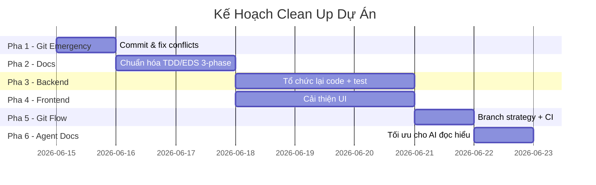

# 🔧 KẾ HOẠCH CLEAN UP DỰ ÁN KAWAI RESORT

> **Ngày lập:** 2026-06-14 | **Trạng thái:** Chờ duyệt

---

## 📊 KẾT QUẢ KHẢO SÁT — CÁC VẤN ĐỀ PHÁT HIỆN

### Mức độ nghiêm trọng

| #  | Vấn đề                                                                                                                                                                                        | Mức độ   |
| -- | ------------------------------------------------------------------------------------------------------------------------------------------------------------------------------------------------ | ----------- |
| 1  | **Git status hỗn loạn**: ~350+ file thay đổi chưa commit, có file từ cấu trúc cũ (`03_sourcecode/`, `04_testing/`) lẫn cấu trúc mới (`04-Implement/`, `06-Testing/`) | 🔴 CRITICAL |
| 2  | **Conflict markers còn sót** trong `MASTER_EDS_SPEC.md` (dòng 424, 540-542): `<<<<<<< Updated upstream` / `>>>>>>> Stashed changes`                                               | 🔴 CRITICAL |
| 3  | **60+ nhánh Git** (local + remote), nhiều nhánh vô nghĩa: `haha`, `CayThuMuc`, `Loi_Chao`, `ngocngu`, `lgok`, `tmp`                                                       | 🟡 HIGH     |
| 4  | **TDD tracker thiếu 3-phase log**: Cột 🔵 REFACTOR chỉ ghi note chung, không ghi commit hash, timestamp, hay evidence rõ ràng                                                        | 🟡 HIGH     |
| 5  | **README.md lỗi thời**: Vẫn tham chiếu `01_SRS/`, `02_SDS/`, `sourcecode/` (cấu trúc cũ)                                                                                      | 🟡 HIGH     |
| 6  | **Backend code không theo module boundary**: Controller nằm lẫn (`controllers/` root + `controllers/api/` + `controllers/web/`), không tách theo module                         | 🟡 HIGH     |
| 7  | **`01-Planning/` và `05-Development/` trống rỗng**, `07-Reports/` trống                                                                                                          | 🟠 MEDIUM   |
| 8  | **MOD3 và MOD5 chưa có test code nào**, tracker toàn `[ ]`                                                                                                                          | 🟠 MEDIUM   |
| 9  | **TEAM_WORKFLOW_GUIDE.md** tham chiếu đường dẫn cũ (`04_testing/`, `01_SRS/`)                                                                                                    | 🟠 MEDIUM   |
| 10 | **Template Thymeleaf** có file cũ (`tours_old.html`) và ảnh thô trong `templates/tour/AnhTour/`                                                                                   | 🟠 MEDIUM   |

---

## 🗺️ TỔNG QUAN 6 PHA



---

## PHA 1: GIT EMERGENCY — DỌN DẸP TRẠNG THÁI GIT (Ngày 1)

> [!CAUTION]
> Đây là bước **bắt buộc làm trước tiên**. Không làm bất kỳ việc gì khác khi git status còn 350+ file thay đổi.

### 1.1. Commit snapshot hiện tại

```bash
# Bước 1: Tạo branch backup
git checkout -b backup/pre-cleanup-20260615

# Bước 2: Commit toàn bộ trạng thái hiện tại
git add -A
git commit -m "chore: snapshot pre-cleanup state"

# Bước 3: Quay lại dev, merge backup
git checkout dev
git merge backup/pre-cleanup-20260615
```

### 1.2. Xóa file/thư mục cũ đã di chuyển

Các thư mục cũ vẫn đang bị Git track dưới dạng Deleted nhưng chưa commit:

| Thư mục cũ (xóa)                         | Đã di chuyển sang        |
| -------------------------------------------- | --------------------------- |
| `03_sourcecode/`                           | `04-Implement/`           |
| `04_testing/`                              | `06-Testing/`             |
| `Template_Test/`                           | `06-Testing/templates/`   |
| `Design_Skill/`                            | `03-Design/skills/`       |
| `AGENTS_MEMORIES.md` (root)                | `08-Document-References/` |
| `TEAM_WORKFLOW_GUIDE.md` (root)            | `00-Policy/`              |
| `index.html`, `All_Diagram.drawio`, etc. | Xóa hoặc di chuyển       |

### 1.3. Fix conflict markers trong MASTER_EDS_SPEC.md

File [MASTER_EDS_SPEC.md](file:///d:/SWP391/su26-swp391-se2023-g2/06-Testing/MASTER_EDS_SPEC.md#L424-L542) có conflict markers cần xóa ngay:

```diff
-<<<<<<< Updated upstream
 ## 6.7. API Specification — UC21: Điểm danh AI Face Scan
 ...
-=======
-## 8. Phương pháp Xác minh (API Verification Samples)
->>>>>>> Stashed changes
```

### 1.4. Cập nhật .gitignore

Thêm các rule sau vào [.gitignore](file:///d:/SWP391/su26-swp391-se2023-g2/.gitignore):

```gitignore
# Python AI service
__pycache__/
*.pyc
venv/
.env

# Gemini Agent (không cần track)
.gemini/

# Thư mục cũ (đã di chuyển)
03_sourcecode/
04_testing/
```

### 1.5. Dọn nhánh rác

**Xóa các nhánh local vô nghĩa:**
`haha`, `CayThuMuc`, `Loi_Chao`, `newLuu`, `reviewInt1`, `test`

**Xóa các nhánh remote đã merge:**
`ngocngu`, `lgok`, `tmp`, `NhapCommit`, `Duc-12/6`, `dung`, `lan`, `minhduc`, `ngoclan`, `ngoc`

---

## PHA 2: CHUẨN HÓA TÀI LIỆU TDD/EDS — 3-PHASE LOGGING (Ngày 2-3)

> [!IMPORTANT]
> Đây là yêu cầu trọng tâm của thầy: mỗi test case phải ghi được log rõ ràng theo 3 giai đoạn Red → Green → Refactor.

### 2.1. Chuẩn hóa bảng Red-Green-Refactor Tracker

**Hiện tại** — thiếu evidence:

| TC ID     | 🔴 RED | 🟢 GREEN (commit) | 🔵 REFACTOR note |
| --------- | ------ | ----------------- | ---------------- |
| TC-M4-001 | [x]    | [x]`a1b2c3d`    | ✅               |

**Chuẩn mới** — đầy đủ 3-phase evidence:

| TC ID     | Mô tả                 | Test File                    | 🔴 RED | 🔴 Commit   | 🔴 Date    | 🟢 GREEN | 🟢 Commit   | 🟢 Date    | 🔵 REFACTOR | 🔵 Commit   | 🔵 Note                  |
| --------- | ----------------------- | ---------------------------- | ------ | ----------- | ---------- | -------- | ----------- | ---------- | ----------- | ----------- | ------------------------ |
| TC-M4-001 | Tìm tour + thời tiết | `TourServiceUC19Test.java` | [x]    | `abc1234` | 2026-06-10 | [x]      | `def5678` | 2026-06-10 | [x]         | `ghi9012` | Extract streams, JavaDoc |

### 2.2. Áp dụng cho từng file TDD

Cần sửa **7 file** TDD (2 master + 5 module):

| File                                         | Hành động                                                                                |
| -------------------------------------------- | ------------------------------------------------------------------------------------------- |
| `06-Testing/MASTER_TDD_SPEC.md`            | Cập nhật bảng tracker theo format mới cho**tất cả 5 module**                    |
| `06-Testing/mod1_auth/TDD_MOD1_SPEC.md`    | Thêm cột commit hash + date cho 🔴🟢🔵, bổ sung Test Steps chi tiết (hiện đang "TBD") |
| `06-Testing/mod2_booking/TDD_MOD2_SPEC.md` | Tương tự mod1                                                                            |
| `06-Testing/mod3_pos/TDD_MOD3_SPEC.md`     | Khảo sát → bổ sung                                                                      |
| `06-Testing/mod4_tour/TDD_MOD4_SPEC.md`    | Đã tốt — chỉ cần thêm cột date + commit hash refactor                               |
| `06-Testing/mod5_finance/TDD_MOD5_SPEC.md` | Khảo sát → bổ sung                                                                      |
| `06-Testing/MASTER_EDS_SPEC.md`            | Fix conflict markers + đánh số mục lại cho nhất quán                                 |

### 2.3. Bổ sung Test Steps cho các TC đang "TBD"

Ví dụ `TDD_MOD1_SPEC.md` — tất cả 22 test case đều ghi `Test Steps: TBD dựa trên Spec kỹ thuật`. Cần bổ sung chi tiết để agent đọc và tự sinh test code.

### 2.4. Đồng bộ MASTER ↔ Module TDD

Hiện tại MASTER_TDD có data, module TDD cũng có data, nhưng **không khớp nhau**. Quy tắc:

- **MASTER_TDD_SPEC.md**: Chỉ chứa bảng tracker tổng hợp (overview)
- **mod{x}/TDD_MOD{x}_SPEC.md**: Chi tiết đầy đủ test case + steps + evidence

---

## PHA 3: KIỂM SOÁT BACKEND CODE (Ngày 3-5)

### 3.1. Tổ chức lại Controller

**Hiện tại** — lộn xộn:

```
controllers/
├── BookingApiController.java      ← REST API nhưng ở root
├── FaceIdApiController.java       ← REST API nhưng ở root  
├── api/
│   ├── AdminAccountRestController.java
│   └── TourBookingApiController.java
└── web/
    ├── AdminController.java       ← 23KB, quá lớn
    └── ManagerController.java     ← 20KB, quá lớn
```

**Đề xuất** — tách theo module:

```
controllers/
├── api/                           ← Tất cả REST API
│   ├── mod1/AuthApiController.java
│   ├── mod2/BookingApiController.java
│   ├── mod3/PosApiController.java
│   ├── mod4/TourApiController.java
│   └── mod5/FolioApiController.java
└── web/                           ← Tất cả Thymeleaf MVC
    ├── AdminController.java       ← Giữ nhưng refactor nhỏ lại
    ├── BookingController.java
    └── ...
```

**Bước thực hiện:**

1. Di chuyển `BookingApiController.java`, `FaceIdApiController.java`, `MenuItemApiController.java`, `PosApiController.java`, `RoomApiController.java` vào `controllers/api/`
2. Tách `AdminController.java` (23KB) thành các controller nhỏ theo chức năng
3. Tách `ManagerController.java` (20KB) tương tự

### 3.2. Kiểm tra Service layer

Các service đã tổ chức tốt (`interfaces/` + `impl/`). Cần kiểm tra:

| Service                          | Size   | Hành động                                       |
| -------------------------------- | ------ | -------------------------------------------------- |
| `BookingServiceImpl.java`      | 11.5KB | Review business logic, đảm bảo pessimistic lock |
| `CheckinServiceImpl.java`      | 11.2KB | Review, có thể tách helper methods              |
| `KdsServiceImpl.java`          | 10.5KB | Review kitchen display logic                       |
| `TourBookingServiceImpl.java`  | 9.5KB  | ✅ Đã test tốt                                  |
| `HousekeepingServiceImpl.java` | 9KB    | ✅ Đã test tốt                                  |
| `CustomerServiceImpl.java`     | 161B   | ⚠️ Gần rỗng, cần implement                    |

### 3.3. Bổ sung test cho MOD3 và MOD5

**MOD3 (POS)**: 0/12 test case — cần tạo:

- `PosServiceUC14Test.java` — E-Menu, đặt món
- `KdsServiceUC17Test.java` — Kitchen Display System
- `PosServiceUC18Test.java` — Post to Room

**MOD5 (Finance)**: 0/14 test case — cần tạo:

- `FolioServiceUC24Test.java` — Night Audit
- `CheckoutServiceUC25Test.java` — Checkout validation
- `ReportServiceUC27Test.java` — Báo cáo USALI

### 3.4. Xóa file rác trong test

- `BookingConcurrencyTest.java.ignored` — Rename thành `.java` hoặc xóa
- Kiểm tra thư mục `services/custom/` và `services/impl/` trong test

---

## PHA 4: CẢI THIỆN GIAO DIỆN (Ngày 3-5, song song Pha 3)

### 4.1. Dọn template Thymeleaf

| Hành động                  | File                                                                                     |
| ----------------------------- | ---------------------------------------------------------------------------------------- |
| Xóa file cũ                 | `templates/guest/tours_old.html`                                                       |
| Di chuyển ảnh thô          | `templates/tour/AnhTour/*.jpg` → `static/images/tours/`                             |
| Xóa template tour riêng lẻ | `DiSan.html`, `DoanTu.html`, `DongNoi.html`, `TinhLang.html` (nếu đã dynamic) |

### 4.2. Checklist cải thiện UI

Dựa trên khảo sát các template hiện có:

- [ ] **Thống nhất header/nav** trên tất cả guest pages
- [ ] **Responsive design** — kiểm tra mobile breakpoints
- [ ] **Dark mode / Premium aesthetics** — thêm gradient, micro-animation
- [ ] **Font chuyên nghiệp** — Google Fonts (Inter/Outfit)
- [ ] **Loading states** — skeleton screens cho các API call
- [ ] **Error states** — hiển thị lỗi thân thiện

### 4.3. Thống nhất CSS

Tạo file `global.css` chứa design tokens chung:

- Color palette, typography scale, spacing, border-radius
- Tất cả template import cùng 1 file CSS gốc

---

## PHA 5: THIẾT LẬP GIT WORKFLOW CHỐNG CONFLICT (Ngày 6)

### 5.1. Branch Strategy mới

```
main ← production-ready
 └── dev ← integration branch
      ├── feature/mod1-UC01  ← Lưu
      ├── feature/mod2-UC10  ← Dũng  
      ├── feature/mod3-UC14  ← Đức
      ├── feature/mod4-UC19  ← Ngọc
      └── feature/mod5-UC24  ← Lan
```

**Quy tắc nghiêm ngặt:**

1. **Naming convention**: `feature/mod{x}-UC{xx}` — không cho phép tên khác
2. **Mỗi nhánh chỉ sửa file trong module của mình**
3. **Rebase trước khi PR**: `git pull --rebase origin dev`
4. **Squash merge** khi merge vào dev

### 5.2. File "hot" dễ conflict — Quy tắc đặc biệt

| File                        | Ai được sửa                             | Cách tránh conflict                                                     |
| --------------------------- | ------------------------------------------- | ------------------------------------------------------------------------- |
| `MASTER_TDD_SPEC.md`      | Mỗi người chỉ sửa section module mình | Dùng comment delimiter:`<!-- MOD1 START -->` ... `<!-- MOD1 END -->` |
| `MASTER_EDS_SPEC.md`      | Tương tự                                 | Tương tự                                                               |
| `pom.xml`                 | Chỉ Tech Lead                              | Lock file, PR riêng                                                      |
| `SecurityConfig.java`     | Chỉ Tech Lead                              | Lock file                                                                 |
| `application.properties`  | Chỉ Tech Lead                              | Lock file                                                                 |
| Entity models (`models/`) | Chỉ Tech Lead duyệt                       | PR riêng, review bắt buộc                                              |

### 5.3. Commit message convention

```
feat(mod2): implement room search UC09
test(mod4): add RED phase for TC-M4-008  
fix(mod1): resolve BCrypt hash mismatch
docs(mod3): update EDS API specification
chore: clean up unused branches
```

### 5.4. Tách MASTER TDD/EDS thành file riêng biệt

**Giải pháp triệt để chống conflict trên file chung:**

Thay vì 1 file `MASTER_TDD_SPEC.md` chứa tracker của cả 5 module → Mỗi module tự quản lý tracker trong `mod{x}/TDD_MOD{x}_SPEC.md`. File MASTER chỉ chứa link tham chiếu:

```markdown
## Red-Green-Refactor Tracker
- [MOD1 Tracker](mod1_auth/TDD_MOD1_SPEC.md#5-red-green-refactor-tracker)
- [MOD2 Tracker](mod2_booking/TDD_MOD2_SPEC.md#5-red-green-refactor-tracker)
- ...
```

---

## PHA 6: TỐI ƯU TÀI LIỆU CHO AI AGENT ĐỌC HIỂU (Ngày 7)

### 6.1. Tạo file CONTEXT.md ở root

File này là **entry point** cho AI agent khi mới vào dự án:

```markdown
# CONTEXT.md — AI Agent Entry Point

## Dự án
Kawai Resort & Tour Hub — Hệ thống quản lý resort tích hợp tour

## Tech Stack
- Backend: Spring Boot 3.x, JPA, MySQL
- AI: Python, Flask, OpenCV, dlib
- Frontend: Thymeleaf + Bootstrap + vanilla JS
- DB: MySQL (schema: 03-Design/database_schema.md)

## Cấu trúc (đọc theo thứ tự)
1. `02-Requirement/SRS_Document_SWP391_G2.md` — Yêu cầu hệ thống
2. `03-Design/database_schema.md` — Schema DB
3. `04-Implement/kawai-backend/` — Source code
4. `06-Testing/MASTER_TDD_SPEC.md` → `mod{x}/TDD_MOD{x}_SPEC.md`
5. `00-Policy/TEAM_WORKFLOW_GUIDE.md` — Quy trình TDD 3-phase

## Module Ownership
| Module | Owner | Package | Test Progress |
|--------|-------|---------|---------------|
| MOD1 Auth | Lưu | com.kawai.auth, security | 5/22 done |
| MOD2 Booking | Dũng | com.kawai.booking | 20/20 done ✅ |
| MOD3 POS | Đức | com.kawai.pos | 0/12 |
| MOD4 Tour | Ngọc | com.kawai.tour | 12/12 done ✅ |
| MOD5 Finance | Lan | com.kawai.finance | 0/14 |

## Quy trình TDD bắt buộc
Mỗi test case phải có evidence 3 giai đoạn:
🔴 RED: Viết test → chạy FAIL → ghi commit hash + date
🟢 GREEN: Implement code → chạy PASS → ghi commit hash + date  
🔵 REFACTOR: Clean code → chạy PASS → ghi commit hash + note
```

### 6.2. Cập nhật README.md

Sửa toàn bộ README.md để phản ánh cấu trúc mới (hiện tại tham chiếu `01_SRS/`, `02_SDS/`, `sourcecode/` — cấu trúc cũ).

### 6.3. Cập nhật TEAM_WORKFLOW_GUIDE.md

Sửa tất cả đường dẫn cũ:

- `04_testing/MASTER_TDD_SPEC.md` → `06-Testing/MASTER_TDD_SPEC.md`
- `04_testing/MASTER_EDS_SPEC.md` → `06-Testing/MASTER_EDS_SPEC.md`
- `01_SRS/TRACEABILITY_MATRIX.md` → `02-Requirement/TRACEABILITY_MATRIX.md`
- `01_SRS/BR_ACTOR_ROLE_TABLE.md` → `02-Requirement/BR_ACTOR_ROLE_TABLE.md`

### 6.4. Thêm AI agent instructions vào prompt templates

Cập nhật prompt templates trong `TEAM_WORKFLOW_GUIDE.md` để agent tự động:

1. Đọc `CONTEXT.md` trước khi làm việc
2. Ghi log 3-phase với commit hash + date vào đúng file module
3. Không sửa file ngoài module boundary

---

## 📋 CHECKLIST TỔNG HỢP — PHÂN CÔNG

| #  | Task                                                     | Ai làm          | Ưu tiên | Thời gian |
| -- | -------------------------------------------------------- | ---------------- | --------- | ---------- |
| 1  | Git: commit snapshot, xóa file cũ                      | Tech Lead (Lưu) | 🔴 P0     | 2h         |
| 2  | Git: fix conflict markers`MASTER_EDS_SPEC.md`          | AI Agent         | 🔴 P0     | 15min      |
| 3  | Git: xóa nhánh rác (local + remote)                   | Tech Lead        | 🟡 P1     | 30min      |
| 4  | Git: cập nhật`.gitignore`                            | Tech Lead        | 🟡 P1     | 10min      |
| 5  | Docs: chuẩn hóa TDD tracker format 3-phase             | AI Agent + Lưu  | 🔴 P0     | 3h         |
| 6  | Docs: bổ sung Test Steps cho MOD1 TDD (22 TC đang TBD) | AI Agent         | 🟡 P1     | 2h         |
| 7  | Docs: đồng bộ MASTER ↔ Module TDD                    | AI Agent         | 🟡 P1     | 2h         |
| 8  | Backend: di chuyển API controllers vào`api/`         | AI Agent + Lưu  | 🟠 P2     | 1h         |
| 9  | Backend: tách AdminController (23KB)                    | AI Agent + Lưu  | 🟠 P2     | 2h         |
| 10 | Backend: tạo test MOD3 (Đức)                          | Đức + AI Agent | 🟡 P1     | 4h         |
| 11 | Backend: tạo test MOD5 (Lan)                            | Lan + AI Agent   | 🟡 P1     | 4h         |
| 12 | Frontend: dọn template, xóa file cũ                   | AI Agent         | 🟠 P2     | 1h         |
| 13 | Frontend: thống nhất CSS + premium design              | AI Agent         | 🟠 P2     | 4h         |
| 14 | Git: thiết lập branch strategy + naming convention     | Tech Lead        | 🟡 P1     | 1h         |
| 15 | Git: tách MASTER TDD thành tham chiếu module riêng   | AI Agent         | 🟡 P1     | 1h         |
| 16 | Docs: tạo CONTEXT.md cho AI agent                       | AI Agent         | 🟡 P1     | 30min      |
| 17 | Docs: cập nhật README.md                               | AI Agent         | 🟡 P1     | 30min      |
| 18 | Docs: sửa đường dẫn cũ trong TEAM_WORKFLOW_GUIDE   | AI Agent         | 🟡 P1     | 30min      |

---

## 🚀 THỨ TỰ THỰC HIỆN ĐỀ XUẤT

Nói "**bắt đầu bước X**" để tôi thực hiện từng bước:

1. **Bước 1**: Fix conflict markers + commit snapshot git *(Pha 1.2 + 1.3)*
2. **Bước 2**: Chuẩn hóa TDD 3-phase tracker format *(Pha 2.1 + 2.2)*
3. **Bước 3**: Tạo CONTEXT.md + cập nhật README + WORKFLOW *(Pha 6)*
4. **Bước 4**: Tổ chức lại backend controllers *(Pha 3.1)*
5. **Bước 5**: Dọn template frontend + cải thiện UI *(Pha 4)*
6. **Bước 6**: Thiết lập git branch strategy *(Pha 5)*

