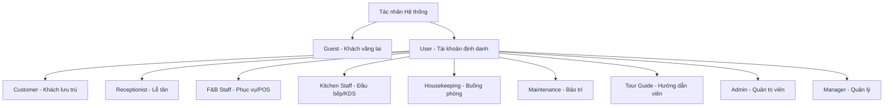

# ĐẶC TẢ DỰ ÁN PHÁT TRIỂN PHẦN MỀM
**HỆ THỐNG QUẢN LÝ NGHỈ DƯỠNG TÍCH HỢP KAWAI RETREAT RESORT & HUB**

## CHANGELOG
| Ngày | Người thực hiện | Nội dung thay đổi |
|---|---|---|
| 2026-06-11 | Antigravity | Xác nhận và định hình tài liệu đặc tả khớp luồng phát triển Hybrid Organization |
| 2026-06-09 | Antigravity | Khởi tạo tài liệu đặc tả dự án |

---

## 1. Bài toán đặt ra & Giải pháp tổng thể
**Kawai Retreat Resort & Hub** là một khu nghỉ dưỡng hạng sang. Vận hành một resort cao cấp đòi hỏi sự phối hợp chặt chẽ giữa nhiều bộ phận: Tiền sảnh, Nhà hàng (F&B), Buồng phòng (Housekeeping), Bảo trì (Maintenance), Lữ hành (Tour) và Quản lý chiến lược.

Hiện tại, các bộ phận đang hoạt động biệt lập trên các công cụ rời rạc (Phần mềm phòng riêng, POS nhà hàng riêng, Tour và Buồng phòng quản lý bằng bảng tính thủ công). Sự thiếu kết nối này dẫn đến:
- **Trải nghiệm khách hàng kém:** Khách bị trùng phòng do bất đồng bộ dữ liệu; khách phải thanh toán nhỏ lẻ nhiều lần (móc ví tại nhà hàng, tại quầy tour, tại lễ tân) thay vì tận hưởng kỳ nghỉ nghỉ dưỡng trọn vẹn.
- **Vận hành rủi ro:** Phòng bẩn/hỏng chưa kịp cập nhật khiến lễ tân giao nhầm phòng cho khách; thông tin đồ uống có phí tại phòng bị thất thoát; kiểm toán đêm và tổng hợp doanh thu cuối tháng của kế toán dễ sai sót do làm thủ công từ nhiều nguồn.

**Giải pháp Kawai Retreat Resort & Hub:** Một nền tảng tập trung duy nhất kết nối toàn bộ luồng vận hành và dữ liệu. Hệ thống vận hành theo cơ chế **Tích hợp Folio (Post to Room / Room Charge)**: mọi chi phí phát sinh từ nhà hàng, dịch vụ phòng, tour tuyến, tiêu dùng mini-bar hay đền bù tài sản đều tự động đổ về một hóa đơn tổng hợp theo số phòng của khách, ký gửi thanh toán một lần duy nhất khi Check-out.

---

## 2. Kiến trúc Đối tượng & Phân quyền (Actors)
Hệ thống phân tách rõ ràng giữa **Đối tượng thực tế** và **Mô hình kế thừa tài khoản** để tối ưu hóa bảo mật và lập trình backend:



### 2.1. Nhóm Khách hàng
- **Guest (Khách vãng lai):** Người dùng chưa đăng nhập hệ thống. Chỉ có quyền truy cập, tìm kiếm và xem các thông tin công khai trên Landing Page.
- **Customer (Khách hàng hệ thống):** Kế thừa từ User. Là Guest đã đăng ký/đăng nhập tài khoản. Có quyền thực hiện giao dịch đặt dịch vụ, quản lý booking cá nhân, theo dõi chi tiêu và viết đánh giá.

### 2.2. Nhóm Người dùng Hệ thống (Kế thừa từ lớp đối tượng User)
- **User (Lớp cơ sở):** Chứa các thuộc tính và nghiệp vụ dùng chung: Đăng nhập, đăng ký, xác thực OTP, quên/đặt lại mật khẩu, cập nhật hồ sơ cá nhân và quản lý phiên làm việc.
- **Receptionist (Lễ tân):** Điều phối cốt lõi tại tiền sảnh, xử lý vòng đời lưu trú của khách, quản lý sơ đồ phòng trực quan và là chốt chặn thanh toán cuối cùng.
- **Housekeeping (Nhân viên buồng phòng):** Quản lý trạng thái vệ sinh phòng vật lý, ghi nhận tiêu dùng mini-bar, kiểm soát tài sản và báo cáo sự cố kỹ thuật.
- **Maintenance (Nhân viên kỹ thuật / Sửa chữa):** Tiếp nhận và sửa chữa các sự cố trang thiết bị hạ tầng phần cứng.
- **F&B Staff (Nhân viên Phục vụ/Thu ngân):** Sử dụng hệ thống POS, quản lý sơ đồ bàn, nhận order và thanh toán.
- **Kitchen Staff (Nhân viên Bếp):** Nhận thông tin order từ hệ thống KDS, cập nhật trạng thái món ăn và báo cáo kho nguyên liệu.
- **Tour Guide (Hướng dẫn viên):** Điều hành các chương trình lữ hành, trải nghiệm địa phương, quản lý khách và điểm danh bằng AI.
- **Admin (Quản trị viên):** Quản trị toàn bộ tài khoản nhân viên, phân quyền truy cập, quản lý dữ liệu gốc (Core Data) và giám sát rủi ro qua Audit Log.
- **Manager (Quản lý cấp cao):** Theo dõi sức khỏe tài chính, phân tích biểu đồ chiến lược và xuất bản tài liệu báo cáo định kỳ.

---

## 3. Phân rã Nghiệp vụ chi tiết theo Tác nhân (Actor Workflows)

### 3.1. Khách hàng (Guest / Customer)
- **Khi là Khách vãng lai (Guest):** Xem Landing Page công khai, thông tin resort, hạng phòng, gói tour, nhà hàng và các đánh giá.
- **Khi đã Đăng nhập (Customer):**
  - **Thực hiện đặt dịch vụ:** Đặt phòng (thanh toán cọc trực tuyến), Đặt tour, Đặt bàn nhà hàng hoặc gọi món.
  - **Cá nhân hóa ưu đãi:** Xem khuyến mãi, giảm giá cá nhân hóa.
  - **Quản lý Booking:** Theo dõi lịch sử và trạng thái thời gian thực.
  - **Thay đổi lịch trình:** Hủy/Thay đổi lịch trình theo chính sách.
  - **Quản lý chi tiêu (Room Charge):** Theo dõi tổng số tiền dịch vụ phát sinh (Folio).
  - **Đánh giá:** Viết nhận xét và chấm điểm sao.
  - **Quyền riêng tư:** Gửi yêu cầu xóa thông tin cá nhân (Ẩn danh hóa).

### 3.2. Lễ tân (Front Office)
- **Quản lý Sơ đồ phòng trực quan (Room Matrix):** Giám sát trạng thái phòng thời gian thực.
- **Nghiệp vụ lưu trú:** Đăng ký nhận phòng (Check-in), Trả phòng (Check-out) và Đổi phòng.
- **Xử lý tài chính:** Thu tiền cọc, tự động gom hóa đơn phát sinh từ các bộ phận (Folio) để thanh toán tổng.
- **Điều phối dịch vụ:** Theo dõi lịch dọn dẹp, tra cứu lịch trình tour.
- **Yêu cầu dọn gấp (Rush Room):** Đánh dấu ưu tiên dọn dẹp cho phòng sắp có khách check-in sớm.

### 3.3. Nhân viên buồng phòng (Housekeeping)
- **Quản lý trạng thái phòng:** Xem danh sách phòng phân công, ưu tiên Rush Room. Cập nhật trạng thái (Bẩn -> Sạch).
- **Báo cáo Mini-bar & Tài sản:** Nhập số lượng đồ dùng có phí đã sử dụng, hệ thống đẩy vào Folio.
- **Báo cáo sửa chữa:** Gửi phiếu yêu cầu sửa chữa kỹ thuật.

### 3.4. Nhân viên kỹ thuật / Sửa chữa (Maintenance)
- **Quản lý phiếu sửa chữa:** Tiếp nhận yêu cầu từ Buồng phòng/Lễ tân.
- **Cập nhật tiến độ:** Thay đổi trạng thái sự cố, tự động cập nhật lên Room Matrix.

### 3.5. Bộ phận Nhà hàng (F&B Staff) & Bếp (Kitchen Staff)
- **F&B Staff (POS Order):** Tra cứu E-Menu, tạo đơn tại bàn, xử lý thanh toán, **Ký gửi hóa đơn về phòng (Post to Room)**.
- **Kitchen Staff (KDS):** Theo dõi đơn hàng real-time, cập nhật trạng thái chế biến, báo "Hết món" để khóa món trên POS.

### 3.6. Hướng dẫn viên (Tour Guide)
- **Quản lý lịch trình:** Xem lịch trình điều động tour.
- **Quản lý danh sách khách:** Xem bảng kê Manifest.
- **Xác thực khách bằng AI:** Quét khuôn mặt đối chiếu dữ liệu điểm danh.
- **Báo cáo sự cố tour:** Gửi báo cáo khẩn cấp về trung tâm.

### 3.7. Quản trị viên (Admin)
- **Quản lý người dùng:** CRUD và phân quyền (RBAC) nhân viên.
- **Quản lý dữ liệu hệ thống (Core Data):** CRUD danh mục món ăn, tour, phòng, bảng giá, email, Landing Page.
- **Nhật ký hệ thống (Audit Log):** Giám sát lịch sử thao tác nhạy cảm.

### 3.8. Quản lý (Manager)
- **Xem báo cáo tài chính:** Theo dõi dòng tiền, doanh thu chi tiết (USALI).
- **Biểu đồ phân tích (Dashboard):** Xem Occupancy Rate, tỷ lệ bán món ăn, tour.
- **Xuất bản tài liệu:** Kết xuất báo cáo PDF/Excel (.xlsx).

---

## 4. Phân rã 5 Module Phát triển cho 5 Sinh viên (Full-stack)

Hệ thống được thiết kế theo kiến trúc hướng dịch vụ, chia thành 5 module độc lập liên kết chặt chẽ thông qua Database và API nội bộ.

### Module 1: Xác thực, Hồ sơ & Dữ liệu gốc (Sinh viên 1)
- **UC01:** Đăng ký & đăng nhập bảo mật (BCrypt).
- **UC02:** Xác thực đăng nhập hai yếu tố (2FA/OTP).
- **UC03:** Quên/Đặt lại mật khẩu qua Token giới hạn thời gian.
- **UC04:** Quản lý hồ sơ cá nhân (Mã hóa AES-256).
- **UC05:** Quản lý tài khoản nhân viên (CRUD Account, RBAC).
- **UC06:** Quản lý Core Data (Cấu hình hệ thống, hạng phòng, tour).
- **UC07:** Nghiệp vụ "Quyền được quên" (Ẩn danh hóa thông tin khách hàng).
- **UC08:** Quản lý phiên làm việc (Session Timeout).
- **Kiểm soát rủi ro:** Ghi nhận Audit Log.

### Module 2: Đặt phòng & Tiền sảnh - CỐT LÕI 1 (Sinh viên 2)
- **UC09:** Khách hàng tìm kiếm phòng trống thời gian thực.
- **UC10:** Đặt phòng, áp dụng mã giảm giá, thanh toán cọc trực tuyến.
- **UC11:** Front Desk Dashboard hiển thị tiến trình Check-in/out, Rush Room.
- **UC12:** Lễ tân Check-in (quét CCCD), Check-out, Đổi phòng.
- **UC13:** Quản lý Sơ đồ trạng thái phòng vật lý (Room Matrix).

### Module 3: POS Nhà hàng & Dịch vụ phòng - CỐT LÕI 2 (Sinh viên 3)
- **UC14:** Khách xem E-Menu, đặt Room Service.
- **UC15:** Đặt bàn nhà hàng trước.
- **UC16:** Màn hình POS nhân viên phục vụ, tạo order, thanh toán.
- **UC17:** Hệ thống KDS cho Bếp (Cập nhật trạng thái món, báo hết món).
- **UC18:** Nghiệp vụ Post to Room / Room Charge vào Folio phòng.

### Module 4: Đặt Tour & Hệ thống phản hồi (Sinh viên 4)
- **UC19:** Tìm kiếm gói tour, tích hợp API thời tiết.
- **UC20:** Đặt tour lữ hành (Thanh toán cọc hoặc Post to Room), chống Double-booking.
- **UC21:** Ứng dụng Hướng dẫn viên (Xem Manifest, Điểm danh AI Face Scan, Báo sự cố).
- **UC22:** Chấm điểm và đánh giá dịch vụ.
- **UC23:** Admin kiểm duyệt nội dung đánh giá.

### Module 5: Hóa đơn tổng hợp & Biểu đồ (Sinh viên 5 - Tích hợp hệ thống)
- **UC24:** Tự động hóa hóa đơn (Folio Aggregation) gom mọi chi phí chưa thanh toán.
- **UC25:** Xử lý tất toán (Nhận thanh toán cuối, kích hoạt e-Invoice).
- **UC26:** Dashboard Manager (Tỷ lệ lấp đầy, thời gian lưu trú).
- **UC27:** Báo cáo doanh thu chuẩn USALI (phân tách nguồn thu).
- **UC28:** Kết xuất tài liệu PDF/Excel.

---

## 5. Quy tắc Kinh doanh & Ràng buộc Hệ thống (Business Rules)
- **Chống ghi đè đồng thời:** Bắt buộc dùng Pessimistic/Optimistic Locking khi đặt phòng, bàn, ghế tour.
- **Điều kiện Check-out nghiêm ngặt:** Khóa tính năng Check-out nếu Folio vẫn còn đơn hàng "Chưa thanh toán" hoặc "Đang xử lý". Mọi công nợ phải = 0.
- **Chính sách hoàn tiền phòng:** Hủy trước 48h hoàn 100%. Hủy trong 48h tịch thu tiền cọc.

## 6. Danh mục Tích hợp API Bên thứ ba
- **Cổng thanh toán:** Stripe / VNPay Sandbox.
- **Dịch vụ truyền thông:** SendGrid / Twilio (Email/SMS, e-Invoice).
- **Bản đồ & Thời tiết:** OpenWeather / Google Maps.

## 7. Tiêu chuẩn Kỹ thuật & Tuân thủ Pháp lý bắt buộc
- **Bảo vệ dữ liệu (Nghị định 13/2023/NĐ-CP):** Mã hóa AES-256 CCCD/Hộ chiếu. Hỗ trợ Ẩn danh hóa dữ liệu (UC07).
- **Khai báo tạm trú (Luật Cư trú 2020):** Thu thập đủ thông tin check-in để đồng bộ cơ quan Công an.
- **Chu kỳ khách hàng (AHLEI):** Pre-arrival -> Arrival -> Occupancy -> Departure.
- **Kế toán lưu trú (USALI):** Phân tách doanh thu theo Department (Rooms, F&B, Tours).
- **Quy trình Kiểm toán đêm (Night Audit):** Chạy ngầm 02:00 sáng để chốt doanh thu, cộng phí phòng vào Folio, chuyển ngày vận hành.

## 8. Thiết kế Cơ sở Dữ liệu & Ràng buộc Hệ thống
Hệ thống sử dụng cơ sở dữ liệu quan hệ với các nguyên tắc thiết kế tối ưu hóa hiệu năng và toàn vẹn dữ liệu:
- **Phân tách nghiệp vụ F&B và Kitchen:** Thiết lập các bảng dữ liệu độc lập để xử lý đơn hàng và trạng thái món ăn, tránh xung đột dữ liệu giữa nhân viên phục vụ và bếp.
- **Quản lý Khách tham gia Tour (`Tour_Attendees`):** Lưu trữ danh sách chi tiết từng cá nhân tham gia tour, phục vụ hệ thống điểm danh tự động bằng AI Face Scan.
- **Quản lý Trạng thái KOT (`kot_status`):** Theo dõi trạng thái từng món ăn riêng lẻ (tại `Food_Order_Details`), cho phép bếp báo hoàn thành từng món một thay vì cập nhật toàn bộ đơn hàng.
- **Giá phòng động (`Daily_Rates`):** Quản lý giá phòng linh hoạt theo từng ngày cụ thể, tối ưu thuật toán tìm kiếm và tính toán doanh thu.
- **Quản lý Người phụ thuộc (`Dependents`):** Lưu trữ thông tin trẻ em hoặc người đi kèm chưa có tài khoản, hỗ trợ lễ tân dễ dàng nâng cấp (upgrade) thành tài khoản khách hàng độc lập.
- **Triggers & Ràng buộc toàn vẹn:** Ứng dụng Database Triggers để tự động hóa các quy tắc nghiệp vụ cốt lõi: ngăn chặn ghi nợ vượt hạn mức (Credit Limit), chặn Check-out khi hóa đơn chưa thanh toán, và tự động sinh yêu cầu dọn phòng khi khách Check-out.

---

## 9. Cấu trúc Thư mục Dự án (Project Directory Tree)
Hệ thống tuân thủ nghiêm ngặt mô hình kiến trúc MVC (Model-View-Controller) của Spring Boot kết hợp với phân lớp Layered Architecture (Controller - Service - Repository), được thiết kế tối ưu cho việc phát triển song song 5 module:

```text
Kawai-Resort-Project/
├── 01_SRS/                           # Tài liệu Đặc tả Yêu cầu & Kiến trúc
├── 02_SDS/                           # Tài liệu Thiết kế Hệ thống
├── 03_sourcecode/                    # Mã nguồn chính của hệ thống
│   ├── FE_Templates/                 # (Frontend) HTML/CSS/JS tĩnh dùng để ghép Thymeleaf
│   │
│   ├── kawai-ai-service/             # (Microservice) Python FastAPI cho AI Face Scan
│   │   ├── main.py                   # API xử lý nhận diện khuôn mặt
│   │   └── models/                   # Chứa model AI (dlib/OpenCV)
│   │
│   └── kawai-backend/                # (Backend) Spring Boot Core
│       ├── pom.xml                   # Cấu hình thư viện Maven
│       └── src/main/
│           ├── resources/
│           │   ├── application.yml   # Cấu hình hệ thống (MySQL, SMTP, Port)
│           │   ├── static/           # CSS, JS, Images, Fonts tĩnh
│           │   └── templates/        # (View) Các file giao diện Thymeleaf (.html)
│           │       ├── admin/        # Giao diện Quản trị viên
│           │       ├── guest/        # Giao diện Khách hàng (Booking, Landing)
│           │       ├── staff/        # Giao diện Nhân viên (Lễ tân, POS, Buồng phòng)
│           │       └── shared/       # Components dùng chung (Header, Footer, Modal)
│           │
│           └── java/com/kawai/
│               ├── KawaiApplication.java   # File khởi chạy
│               ├── config/           # Cấu hình bảo mật, CORS, VNPay, Swagger
│               ├── security/         # JWT / Session auth, Role-based Access Control
│               ├── exceptions/       # Xử lý ngoại lệ toàn cục (Global Exception Handler)
│               ├── utils/            # Các hàm tiện ích (DateFormatter, Exporter)
│               │
│               ├── models/           # (Model) Entity JPA ánh xạ Database
│               │   ├── core/         # Entity cốt lõi (User, Roles)
│               │   └── modules/      # Entity chia theo 5 Module
│               │
│               ├── dto/              # Data Transfer Objects (Hứng dữ liệu từ form)
│               ├── repositories/     # (DAO) Spring Data JPA tương tác CSDL
│               │
│               ├── services/         # Chứa Business Logic cốt lõi
│               │   ├── interfaces/   # Interface định nghĩa dịch vụ
│               │   └── impl/         # Triển khai logic thực tế
│               │
│               └── controllers/      # (Controller) Nhận Request & Điều hướng
│                   ├── api/          # RESTful APIs (cho AI Service gọi tới)
│                   └── web/          # Web Controllers trả về Thymeleaf views
```

**Nguyên tắc thiết kế mã nguồn:**
- **Views (Thymeleaf):** Hoàn toàn không chứa Business Logic, chỉ nhận Data từ Controller để hiển thị giao diện.
- **Controllers:** Chỉ làm nhiệm vụ phân luồng (Routing), kiểm tra quyền (Authorization), và gọi `Service`. Tuyệt đối không thao tác Database trực tiếp.
- **Services:** Chứa 100% nghiệp vụ cốt lõi (Ví dụ: logic cộng dồn Folio, chống Overbooking).
- **Repositories:** Chuyên trách giao tiếp Database (kế thừa `JpaRepository`) và thực thi các câu lệnh JPQL/Native SQL.
