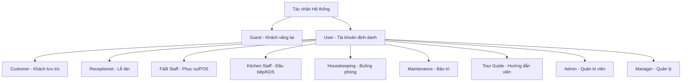

# ĐẶC TẢ CHI TIẾT DỰ ÁN PHÁT TRIỂN PHẦN MỀM

**HỆ THỐNG QUẢN LÝ NGHỈ DƯỠNG TÍCH HỢP KAWAI RETREAT RESORT & HUB**

## CHANGELOG

| Ngày      | Người thực hiện | Nội dung thay đổi                                                                                                                                                       |
| ---------- | ------------------- | -------------------------------------------------------------------------------------------------------------------------------------------------------------------------- |
| 2026-06-16 | Antigravity         | Đồng bộ hóa toàn diện đặc tả dự án theo UC_MASTER_TABLE V3, chi tiết hóa 25 Use Cases, luồng xử lý và dữ liệu I/O làm tài liệu blueprint lập trình |
| 2026-06-11 | Antigravity         | Xác nhận và định hình tài liệu đặc tả khớp luồng phát triển Hybrid Organization                                                                             |
| 2026-06-09 | Antigravity         | Khởi tạo tài liệu đặc tả dự án                                                                                                                                    |

---

## 1. Bài toán đặt ra & Giải pháp tổng thể

**Kawai Retreat Resort & Hub** là một khu nghỉ dưỡng hạng sang. Vận hành một resort cao cấp đòi hỏi sự phối hợp chặt chẽ giữa nhiều bộ phận: Tiền sảnh, Nhà hàng (F&B), Buồng phòng (Housekeeping), Bảo trì (Maintenance), Lữ hành (Tour) và Quản lý chiến lược.

Hiện tại, các bộ phận đang hoạt động biệt lập trên các công cụ rời rạc (Phần mềm phòng riêng, POS nhà hàng riêng, Tour và Buồng phòng quản lý bằng bảng tính thủ công). Sự thiếu kết nối này dẫn đến:

- **Trải nghiệm khách hàng kém:** Khách bị trùng phòng do bất đồng bộ dữ liệu; khách phải thanh toán nhỏ lẻ nhiều lần (móc ví tại nhà hàng, tại quầy tour, tại lễ tân) thay vì tận hưởng kỳ nghỉ nghỉ dưỡng trọn vẹn.
- **Vận hành rủi ro:** Phòng bẩn/hỏng chưa kịp cập nhật khiến lễ tân giao nhầm phòng cho khách; thông tin đồ uống có phí tại phòng bị thất thoát; kiểm toán đêm và tổng hợp doanh thu cuối tháng của kế toán dễ sai sót do làm thủ công từ nhiều nguồn.

**Giải pháp Kawai Retreat Resort & Hub:** Một nền tảng tập trung duy nhất kết nối toàn bộ luồng vận hành và dữ liệu. Hệ thống vận hành theo cơ chế **Tích hợp Folio (Post to Room / Room Charge)**: mọi chi phí phát sinh từ nhà hàng, dịch vụ phòng, tour tuyến, tiêu dùng mini-bar hay đền bù tài sản đều tự động đổ về một hóa đơn tổng hợp theo số phòng của khách, ký gửi thanh toán một lần duy nhất khi Check-out.

---

## 2. Kiến trúc Đối tượng & Phân quyền (Actors)

Hệ thống phân tách rõ ràng giữa **Đối tượng thực tế** và **Mô hình kế thừa tài khoản** để tối ưu hóa bảo mật và lập trình backend:



### 2.1. Nhóm Khách hàng

- **Guest (Khách vãng lai):** Người dùng chưa đăng nhập hệ thống. Chỉ có quyền truy cập, tìm kiếm và xem các thông tin công khai trên Landing Page.
- **Customer (Khách hàng hệ thống):** Kế thừa từ User. Là Guest đã đăng ký/đăng nhập tài khoản. Có quyền thực hiện giao dịch đặt dịch vụ, quản lý booking cá nhân, theo dõi chi tiêu và viết đánh giá.

### 2.2. Nhóm Người dùng Hệ thống (Kế thừa từ lớp đối tượng User)

- **User (Lớp cơ sở):** Chứa các thuộc tính và nghiệp vụ dùng chung: Đăng nhập, đăng ký, xác thực OTP, quên/đặt lại mật khẩu, cập nhật hồ sơ cá nhân và quản lý phiên làm việc.
- **Receptionist (Lễ tân):** Điều phối cốt lõi tại tiền sảnh, xử lý vòng đời lưu trú của khách, quản lý sơ đồ phòng trực quan và là chốt chặn thanh toán cuối cùng.
- **Housekeeping (Nhân viên buồng phòng):** Quản lý trạng thái vệ sinh phòng vật lý, ghi nhận tiêu dùng mini-bar, kiểm soát tài sản và báo cáo sự cố kỹ thuật.
- **Maintenance (Nhân viên kỹ thuật / Sửa chữa):** Tiếp nhận và sửa chữa các sự cố trang thiết bị hạ tầng phần cứng.
- **F&B Staff (Nhân viên Phục vụ/Thu ngân):** Sử dụng hệ thống POS, quản lý sơ đồ bàn, nhận order và thanh toán.
- **Kitchen Staff (Nhân viên Bếp):** Nhận thông tin order từ hệ thống KDS, cập nhật trạng thái món ăn và báo cáo kho nguyên liệu.
- **Tour Guide (Hướng dẫn viên):** Điều hành các chương trình lữ hành, trải nghiệm địa phương, quản lý khách và điểm danh bằng AI.
- **Admin (Quản trị viên):** Quản trị toàn bộ tài khoản nhân viên, phân quyền truy cập, quản lý dữ liệu gốc (Core Data) và giám sát rủi ro qua Audit Log.
- **Manager (Quản lý cấp cao):** Theo dõi sức khỏe tài chính, phân tích biểu đồ chiến lược và xuất bản tài liệu báo cáo định kỳ.

---

## 3. Phân rã Nghiệp vụ chi tiết theo Tác nhân (Actor Workflows)

### 3.1. Khách hàng (Guest / Customer)

- **Khi là Khách vãng lai (Guest):** Xem Landing Page công khai, thông tin resort, hạng phòng, gói tour, nhà hàng và các đánh giá.
- **Khi đã Đăng nhập (Customer):**
  - **Thực hiện đặt dịch vụ:** Đặt phòng (thanh toán cọc trực tuyến), Đặt tour, Đặt bàn nhà hàng hoặc gọi món.
  - **Cá nhân hóa ưu đãi:** Xem khuyến mãi, giảm giá cá nhân hóa.
  - **Quản lý Booking:** Theo dõi lịch sử và trạng thái thời gian thực.
  - **Thay đổi lịch trình:** Hủy/Thay đổi lịch trình theo chính sách.
  - **Quản lý chi tiêu (Room Charge):** Theo dõi tổng số tiền dịch vụ phát sinh (Folio).
  - **Đánh giá:** Viết nhận xét và chấm điểm sao.
  - **Quyền riêng tư:** Gửi yêu cầu xóa thông tin cá nhân (Ẩn danh hóa).

### 3.2. Lễ tân (Front Office)

- **Quản lý Sơ đồ phòng trực quan (Room Matrix):** Giám sát trạng thái phòng thời gian thực.
- **Nghiệp vụ lưu trú:** Đăng ký nhận phòng (Check-in), Trả phòng (Check-out) và Đổi phòng.
- **Xử lý tài chính:** Thu tiền cọc, tự động gom hóa đơn phát sinh từ các bộ phận (Folio) để thanh toán tổng.
- **Điều phối dịch vụ:** Theo dõi lịch dọn dẹp, tra cứu lịch trình tour.
- **Yêu cầu dọn gấp (Rush Room):** Đánh dấu ưu tiên dọn dẹp cho phòng sắp có khách check-in sớm.

### 3.3. Nhân viên buồng phòng (Housekeeping)

- **Quản lý trạng thái phòng:** Xem danh sách phòng phân công, ưu tiên Rush Room. Cập nhật trạng thái (Bẩn -> Sạch).
- **Báo cáo Mini-bar & Tài sản:** Nhập số lượng đồ dùng có phí đã sử dụng, hệ thống đẩy vào Folio.
- **Báo cáo sửa chữa:** Gửi phiếu yêu cầu sửa chữa kỹ thuật.

### 3.4. Nhân viên kỹ thuật / Sửa chữa (Maintenance)

- **Quản lý phiếu sửa chữa:** Tiếp nhận yêu cầu từ Buồng phòng/Lễ tân.
- **Cập nhật tiến độ:** Thay đổi trạng thái sự cố, tự động cập nhật lên Room Matrix.

### 3.5. Bộ phận Nhà hàng (F&B Staff) & Bếp (Kitchen Staff)

- **F&B Staff (POS Order):** Tra cứu E-Menu, tạo đơn tại bàn, xử lý thanh toán, **Ký gửi hóa đơn về phòng (Post to Room)**.
- **Kitchen Staff (KDS):** Theo dõi đơn hàng real-time, cập nhật trạng thái chế biến, báo "Hết món" để khóa món trên POS.

### 3.6. Hướng dẫn viên (Tour Guide)

- **Quản lý lịch trình:** Xem lịch trình điều động tour.
- **Quản lý danh sách khách:** Xem bảng kê Manifest.
- **Xác thực khách bằng AI:** Quét khuôn mặt đối chiếu dữ liệu điểm danh.
- **Báo cáo sự cố tour:** Gửi báo cáo khẩn cấp về trung tâm.

### 3.7. Quản trị viên (Admin)

- **Quản lý người dùng:** CRUD và phân quyền (RBAC) nhân viên.
- **Quản lý dữ liệu hệ thống (Core Data):** CRUD danh mục món ăn, tour, phòng, bảng giá, email, Landing Page.
- **Nhật ký hệ thống (Audit Log):** Giám sát lịch sử thao tác nhạy cảm.

### 3.8. Quản lý (Manager)

- **Xem báo cáo tài chính:** Theo dõi dòng tiền, doanh thu chi tiết (USALI).
- **Biểu đồ phân tích (Dashboard):** Xem Occupancy Rate, tỷ lệ bán món ăn, tour.
- **Xuất bản tài liệu:** Kết xuất báo cáo PDF/Excel (.xlsx).

---

## 4. Đặc tả kỹ thuật chi tiết của 25 Use Cases phát triển hệ thống

Hệ thống được chia thành 5 phân hệ cốt lõi tương ứng 5 nhóm nghiệp vụ chính:

### 🔴 PHÂN HỆ 1: XÁC THỰC, HỒ SƠ & DỮ LIỆU GỐC (Sinh viên 1)

#### **UC01: Đăng ký & Đăng nhập (BCrypt)**

* **UC01.1: Đăng ký tài khoản khách hàng trực tuyến**
  * **Actor:** Customer (Guest)
  * **Luồng xử lý chính:** Khách điền form đăng ký trực tuyến -> Hệ thống thực hiện Validate định dạng (Email, Phone) -> Kiểm tra tính duy nhất (tránh trùng lặp username, email, phone) -> Băm mật khẩu bằng BCrypt (độ phức tạp 10) -> Thực hiện ghi bản ghi vào bảng `Accounts` (trạng thái `is_active = true`, gán vai trò `CUSTOMER`) và bảng `Customers` -> Gửi Email chào mừng thông qua Mail Service.
  * **Ràng buộc & Logic kiểm tra:** Mật khẩu tối thiểu 8 ký tự, chứa ít nhất một chữ hoa, chữ thường và chữ số. Số điện thoại phải gồm 10-12 số.
  * **Dữ liệu Đầu vào (Inputs):** `username`, `password`, `email`, `phone`, `fullName`, `gender`.
  * **Dữ liệu Đầu ra (Outputs):** Thông báo đăng ký thành công, tự động chuyển hướng về trang đăng nhập.
  * **Tác động Database:** `Accounts` (INSERT), `Customers` (INSERT).
* **UC01.2: Đăng nhập hệ thống (Form truyền thống & OAuth2 Google)**
  * **Actor:** Customer, User (Nhân viên, Lễ tân, Admin...)
  * **Luồng xử lý chính:**
    * *Truyền thống:* User gửi thông tin credentials -> Spring Security xác thực thông tin thông qua `UserDetailsService` -> Kiểm tra mật khẩu khớp BCrypt -> Cấp phát Session hoặc JWT -> Ghi log đăng nhập vào `Audit_Logs`.
    * *OAuth2 Google:* Khách hàng click đăng nhập bằng Google -> Nhận Token xác thực từ Google Auth Provider -> Giải mã lấy Email và Họ tên -> Kiểm tra trong hệ thống, nếu Email chưa tồn tại thì tự động tạo tài khoản Customer mới với mật khẩu sinh ngẫu nhiên -> Cấp quyền đăng nhập.
  * **Ràng buộc & Logic kiểm tra:** Tài khoản phải có `is_active = true`. Tự động khóa tài khoản tạm thời trong 15 phút nếu nhập sai mật khẩu quá 5 lần liên tiếp.
  * **Dữ liệu Đầu vào (Inputs):** `username`, `password` (Truyền thống) hoặc Google OAuth code.
  * **Dữ liệu Đầu ra (Outputs):** JWT Token/Session Cookie, thông tin Role và Redirect URL thích hợp.
  * **Tác động Database:** `Accounts` (SELECT), `Audit_Logs` (INSERT).

#### **UC02: Đặt lại mật khẩu (Gửi Mail chứa Token giới hạn thời gian)**

* **Actor:** Customer, User
* **Luồng xử lý chính:** User click "Quên mật khẩu" -> Nhập email -> Hệ thống kiểm tra tính tồn tại -> Sinh mã UUID Token ngẫu nhiên -> Lưu Token vào DB kèm thời hạn hết hạn (15 phút) -> Gửi Email chứa link reset có kèm Token -> User click link -> Nhập mật khẩu mới -> Hệ thống xác thực Token hợp lệ và chưa hết hạn -> Băm mật khẩu mới bằng BCrypt và cập nhật DB -> Xóa/Vô hiệu hóa Token.
* **Ràng buộc & Logic kiểm tra:** Token chỉ được sử dụng một lần duy nhất. Hết hiệu lực sau đúng 15 phút kể từ thời điểm gửi.
* **Dữ liệu Đầu vào (Inputs):** `email` (Bước 1), `token`, `newPassword` (Bước 2).
* **Dữ liệu Đầu ra (Outputs):** Thông báo gửi email thành công / Đổi mật khẩu thành công.
* **Tác động Database:** `Accounts` (UPDATE), `Password_Reset_Tokens` (INSERT/UPDATE/DELETE).

#### **UC03: Quản lý thông tin hồ sơ & Định danh FaceID**

* **UC03.1: Quản lý hồ sơ cá nhân & Mã hóa giấy tờ (AES-256)**
  * **Actor:** Customer
  * **Luồng xử lý chính:** Khách truy cập trang cá nhân -> Cập nhật thông tin cơ bản -> Nhập thông tin nhạy cảm định danh (CCCD/Passport) -> Hệ thống sử dụng thuật toán AES-256 để mã hóa chuỗi thông tin này trước khi lưu trữ vào cột `cccd_passport_encrypted` tại Database nhằm tránh rò rỉ dữ liệu.
  * **Ràng buộc & Logic kiểm tra:** Khóa mã hóa (AES Key) được cấu hình tuyệt mật trên biến môi trường hệ thống. Giải mã chỉ thực hiện khi được yêu cầu bởi người dùng hợp lệ hoặc Lễ tân có thẩm quyền.
  * **Dữ liệu Đầu vào (Inputs):** `fullName`, `gender`, `phone`, `email`, `cccdPassportRaw`.
  * **Dữ liệu Đầu ra (Outputs):** Thông báo cập nhật thông tin cá nhân thành công.
  * **Tác động Database:** `Customers` (UPDATE).
* **UC03.2: Đăng tải, trích xuất dữ liệu khuôn mặt và chuyển đổi Vector**
  * **Actor:** Customer, Lễ tân
  * **Luồng xử lý chính:** Khách chụp ảnh hoặc tải ảnh chân dung lên -> Server Spring Boot chuyển tiếp ảnh sang Microservice Python `kawai-ai-service` -> AI service sử dụng OpenCV/dlib để phát hiện khuôn mặt và trích xuất mảng Vector đặc trưng (128-dimensional embedding) -> Trả về mảng số Vector -> Spring Boot lưu mảng Vector này dưới dạng Text/JSON vào cột `face_vector_data`.
  * **Ràng buộc & Logic kiểm tra:** Ảnh chụp phải đảm bảo chất lượng, đủ ánh sáng, chỉ chứa duy nhất một khuôn mặt trực diện. Ảnh lỗi/mờ sẽ bị AI service trả về mã lỗi 400.
  * **Dữ liệu Đầu vào (Inputs):** Multipart File (Ảnh chân dung).
  * **Dữ liệu Đầu ra (Outputs):** Xác nhận cập nhật khuôn mặt thành công.
  * **Tác động Database:** `Tour_Attendees` hoặc `Customers` (UPDATE cột `face_vector_data`).

#### **UC04: Quản lý tài khoản nhân viên & Kiểm soát rủi ro**

* **UC04.1: Quản lý tài khoản & Phân quyền RBAC (Lễ tân, Bếp, Guide)**
  * **Actor:** Admin
  * **Luồng xử lý chính:** Admin thực hiện tạo mới nhân sự -> Phân phối Tài khoản đăng nhập -> Chọn gán Vai trò tương ứng trong bảng `Roles` -> Spring Security nhận cấu hình và tự động giới hạn quyền truy cập các API của phân hệ tương ứng (ví dụ: Nhân viên bếp không được gọi API Lễ tân).
  * **Ràng buộc & Logic kiểm tra:** Nhân viên chỉ có duy nhất một vai trò chính tại một thời điểm.
  * **Dữ liệu Đầu vào (Inputs):** `username`, `password`, `roleId`, `fullName`, `gender`, `cccd`, `phone`, `email`, `salary`.
  * **Dữ liệu Đầu ra (Outputs):** Thông báo tạo/cập nhật tài khoản nhân sự thành công.
  * **Tác động Database:** `Accounts` (INSERT/UPDATE), `Employees` (INSERT/UPDATE).
* **UC04.2: Truy vết lịch sử nhật ký hệ thống (Audit Log) chống gian lận**
  * **Actor:** Admin
  * **Luồng xử lý chính:** Khi có bất kỳ hành vi thay đổi dữ liệu nhạy cảm nào (Thay đổi hạn mức nợ, chỉnh sửa giá phòng động, hủy hóa đơn...) -> Hệ thống tự động kích hoạt ghi nhận Audit Log lưu thông tin: bảng dữ liệu bị tác động, giá trị cũ dạng JSON, giá trị mới dạng JSON, tài khoản thực hiện, địa chỉ IP và thời gian.
  * **Ràng buộc & Logic kiểm tra:** Bảng `Audit_Logs` chỉ cho phép thêm mới (`INSERT`) và truy vấn (`SELECT`), chặn đứng tất cả thao tác `UPDATE` và `DELETE` để bảo mật pháp lý.
  * **Dữ liệu Đầu vào (Inputs):** Query filters (Date, Account, Table).
  * **Dữ liệu Đầu ra (Outputs):** Danh sách dòng log truy vết.
  * **Tác động Database:** `Audit_Logs` (INSERT).

#### **UC05: Quản lý Cấu hình Hệ thống (Core Data Config)**

* **UC05.1: Quản lý dữ liệu nền (Thêm/Sửa/Xóa cấu hình phòng, bàn, tour)**
  * **Actor:** Admin
  * **Luồng xử lý chính:** Admin thực hiện các thao tác CRUD danh mục các phòng vật lý, các bàn ăn nhà hàng, các hành trình du lịch lữ hành.
  * **Ràng buộc & Logic kiểm tra:** Không cho phép xóa phòng đang có khách ở, cấm xóa bàn đang được đặt cọc trước, cấm xóa tour đang hoạt động.
  * **Dữ liệu Đầu vào (Inputs):** Biến cấu hình tương ứng của từng thực thể nền.
  * **Dữ liệu Đầu ra (Outputs):** Xác nhận thay đổi dữ liệu gốc thành công.
  * **Tác động Database:** `Rooms`, `Restaurant_Tables`, `Tours`, `Menu_Items` (INSERT/UPDATE/DELETE).
* **UC05.2: Cấu hình chiến dịch giá phòng động biến động (Mùa/Lễ tết)**
  * **Actor:** Admin, Manager
  * **Luồng xử lý chính:** Chọn hạng phòng -> Thiết lập khoảng ngày áp dụng -> Nhập hệ số tiền tăng/giảm (`price_modifier`) -> Tạo chính sách -> Hệ thống tự động tính toán lại và chèn/cập nhật bảng tĩnh `Daily_Rates` cho từng ngày cụ thể để phục vụ việc truy xuất tìm kiếm nhanh.
  * **Ràng buộc & Logic kiểm tra:** Khoảng ngày áp dụng không được chồng lấn (overlap) với các chính sách giá động khác của cùng một hạng phòng.
  * **Dữ liệu Đầu vào (Inputs):** `categoryId`, `startDate`, `endDate`, `priceModifier`, `reason`.
  * **Dữ liệu Đầu ra (Outputs):** Bảng lịch giá phòng chi tiết sau cấu hình.
  * **Tác động Database:** `Dynamic_Pricing` (INSERT/UPDATE), `Daily_Rates` (INSERT/UPDATE).
* **UC05.3: Thiết lập chiến dịch Marketing & Đóng gói Combo dạng JSON**
  * **Actor:** Admin, Manager
  * **Luồng xử lý chính:** Tạo mới mã Voucher khuyến mãi (`promo_code`) quy định mức giảm, số lượt dùng tối đa. Tạo các gói Combo dịch vụ (gộp phòng lưu trú + suất ăn + tour) -> Lưu trữ thông số đóng gói các dịch vụ con dưới cấu trúc chuỗi JSON để hệ thống tự động bóc tách phân phối.
  * **Ràng buộc & Logic kiểm tra:** Cấu trúc JSON combo phải chuẩn hóa schema thiết kế.
  * **Dữ liệu Đầu vào (Inputs):** Promo code details, JSON combo configuration.
  * **Dữ liệu Đầu ra (Outputs):** Lưu thành công chiến dịch tiếp thị.
  * **Tác động Database:** `Promotions` (INSERT/UPDATE).

---

### 🔵 PHÂN HỆ 2: QUẢN LÝ PHÒNG & LỄ TÂN VẬN HÀNH (Sinh viên 2)

#### **UC06: Tìm kiếm hạng phòng trống thời gian thực theo bộ lọc**

* **Actor:** Customer, Guest (Khách vãng lai)
* **Luồng xử lý chính:** Khách nhập Ngày nhận phòng, Ngày trả phòng, Số lượng khách -> Hệ thống truy vấn đếm tổng số phòng của mỗi hạng -> Tính số lượng phòng của hạng đó đã bị khóa trước trong khoảng ngày tìm kiếm (dựa vào `Room_Booking_Details` ở trạng thái khác `Cancelled`) -> Hiển thị số lượng phòng còn trống thực tế -> Tính tổng tiền dự kiến dựa vào việc cộng dồn đơn giá theo ngày tại bảng `Daily_Rates`.
* **Ràng buộc & Logic kiểm tra:** Ngày nhận phòng phải lớn hơn hoặc bằng ngày hiện tại. Ngày trả phòng phải sau ngày nhận phòng tối thiểu 1 ngày.
* **Dữ liệu Đầu vào (Inputs):** `checkInDate`, `checkOutDate`, `guestsCount`.
* **Dữ liệu Đầu ra (Outputs):** Danh sách hạng phòng trống khả dụng kèm hình ảnh, mô tả, tiện ích và tổng giá trị thanh toán.
* **Tác động Database:** `Room_Booking_Details` (SELECT), `Daily_Rates` (SELECT), `Rooms` (SELECT).

#### **UC07: Đặt phòng & Quản lý quỹ giao dịch trực tuyến**

* **UC07.1: Đặt phòng & Đặt cọc trực tuyến đa hạng (Tích hợp VNPay)**
  * **Actor:** Customer
  * **Luồng xử lý chính:** Khách hàng tiến hành chọn phòng -> Xác nhận điền thông tin người lưu trú -> Hệ thống tạo đơn hàng Booking nháp ở trạng thái `Pending` -> Khóa giữ chỗ tạm thời (Cart Lock 15 phút) -> Sinh Link thanh toán cọc VNPay -> Khách tiến hành thanh toán qua ứng dụng ngân hàng -> Nhận tín hiệu Webhook Callback từ VNPay -> So khớp chữ ký bảo mật -> Cập nhật trạng thái Booking thành `Confirmed`, lưu thông tin giao dịch vào `Payment_Transactions`.
  * **Ràng buộc & Logic kiểm tra:** Nếu VNPay phản hồi thất bại hoặc hết hạn 15 phút chưa thanh toán, hệ thống tự động chạy ngầm hủy đơn hàng và giải phòng bị giữ.
  * **Dữ liệu Đầu vào (Inputs):** Cart Details, VNPay IPN Callback variables.
  * **Dữ liệu Đầu ra (Outputs):** Trực quan hóa kết quả giao dịch (Thành công / Thất bại).
  * **Tác động Database:** `Bookings` (INSERT/UPDATE), `Room_Bookings` (INSERT), `Room_Booking_Details` (INSERT), `Payment_Transactions` (INSERT).
* **UC07.2: Áp dụng mã chiến dịch khuyến mãi / Voucher giảm giá**
  * **Actor:** Customer
  * **Luồng xử lý chính:** Khách nhập mã voucher -> Hệ thống truy xuất thông tin `Promotions` -> Kiểm tra: Trạng thái `is_active = true`, ngày hiện tại nằm trong hiệu lực, lượt dùng chưa vượt `max_uses` -> Thực hiện tính toán giảm giá trực tiếp vào tổng tiền Booking.
  * **Ràng buộc & Logic kiểm tra:** Mỗi Booking chỉ được sử dụng tối đa 1 mã giảm giá.
  * **Dữ liệu Đầu vào (Inputs):** `promoCode`, `bookingTotal`.
  * **Dữ liệu Đầu ra (Outputs):** Giá trị giảm giá và tổng tiền thanh toán mới sau khấu trừ.
  * **Tác động Database:** `Promotions` (SELECT, UPDATE).
* **UC07.3: Kích hoạt khóa quỹ giữ phòng tạm thời (Room Cart Lock 15')**
  * **Actor:** System
  * **Luồng xử lý chính:** Khi khách hàng click chọn thanh toán đặt phòng, hệ thống lập tức chèn tạm thời số lượng phòng bị giữ vào bộ nhớ đệm cache (hoặc database nháp) với thời gian sống (TTL) 15 phút. Trong thời gian này, các khách hàng khác tìm kiếm sẽ thấy số lượng phòng trống khả dụng bị trừ đi tương ứng, ngăn chặn tuyệt đối tình trạng Overbooking.
  * **Ràng buộc & Logic kiểm tra:** Tự động thu hồi khóa sau 15 phút nếu giao dịch thanh toán không được xác nhận thành công.
  * **Dữ liệu Đầu vào (Inputs):** `bookingId`.
  * **Dữ liệu Đầu ra (Outputs):** Hủy bỏ khóa giữ phòng (Giải phóng / Xác nhận giữ phòng vĩnh viễn).
  * **Tác động Database:** `Bookings` (UPDATE trạng thái thành `Cancelled` nếu hết hạn).

#### **UC08: Xem sơ đồ trạng thái phòng thời gian thực (Front Desk Dashboard)**

* **Actor:** Receptionist
* **Luồng xử lý chính:** Lễ tân truy cập dashboard -> Hệ thống kết xuất giao diện lưới (Room Matrix Grid) thể hiện toàn bộ phòng vật lý được gom nhóm theo Hạng phòng/Số tầng. Mỗi ô phòng hiển thị trực quan trạng thái vận hành hiện tại (`Vacant_Clean`, `Vacant_Dirty`, `Occupied`, `Maintenance`) kết hợp hiển thị thông tin tên khách hàng đang lưu trú và các cảnh báo khẩn cấp.
* **Ràng buộc & Logic kiểm tra:** Cập nhật trạng thái thời gian thực bằng cơ chế WebSocket Connection.
* **Dữ liệu Đầu vào (Inputs):** Tùy chọn bộ lọc (Tầng, Hạng phòng).
* **Dữ liệu Đầu ra (Outputs):** Bảng hiển thị Room Matrix trực quan động.
* **Tác động Database:** `Rooms` (SELECT), `Room_Booking_Details` (SELECT).

#### **UC09: N nghiệp vụ Sảnh (Check-in / Check-out / Điều phối đoàn)**

* **UC09.1: Quy trình Check-In sảnh (Quét OCR CCCD tự động điền form)**
  * **Actor:** Receptionist
  * **Luồng xử lý chính:** Lễ tân chụp/quét ảnh mặt trước CCCD của khách -> Upload lên Server -> Hệ thống gọi API OCR trích xuất thông tin cá nhân (Họ tên, CCCD, Ngày sinh, Giới tính, Quê quán) -> Tự động điền dữ liệu vào Form khai báo sảnh -> Lễ tân chọn gán phòng vật lý khả dụng (phải ở trạng thái `Vacant_Clean`) -> Cập nhật trạng thái `Room_Booking_Details.detail_status = 'Checked_In'` -> Trạng thái phòng chuyển sang `Occupied`.
  * **Ràng buộc & Logic kiểm tra:** Chỉ tiến hành check-in được đối với các đơn hàng ở trạng thái `Confirmed`. Phòng vật lý chỉ định bắt buộc phải sạch sẽ (`Vacant_Clean`).
  * **Dữ liệu Đầu vào (Inputs):** Image File (CCCD), `roomId`, `bookingId`.
  * **Dữ liệu Đầu ra (Outputs):** Form thông tin điền sẵn tự động, mã khóa phòng / Số phòng được cấp.
  * **Tác động Database:** `Room_Booking_Details` (UPDATE), `Rooms` (UPDATE).
* **UC09.2: Ủy quyền hạn mức chi tiêu ví nợ phòng phát sinh**
  * **Actor:** Receptionist
  * **Luồng xử lý chính:** Lễ tân thiết lập giá trị nợ trần (`sub_credit_limit`) và bật cờ `is_charge_to_room_allowed = true` cho phòng cụ thể -> Khách hàng thiết lập mã PIN bảo mật 4 số (hệ thống băm bằng BCrypt và lưu vào `personal_pin_hash`) để phục vụ việc xác thực ký nợ dịch vụ tại quầy F&B/Tour.
  * **Ràng buộc & Logic kiểm tra:** Tổng hạn mức nợ của các phòng chi tiết không được vượt quá hạn mức nợ trần của Booking tổng.
  * **Dữ liệu Đầu vào (Inputs):** `detailId`, `subCreditLimit`, `pinRaw`.
  * **Dữ liệu Đầu ra (Outputs):** Thiết lập hạn mức ghi nợ phòng thành công.
  * **Tác động Database:** `Room_Booking_Details` (UPDATE).
* **UC09.3: Điều phối đổi phòng vật lý linh hoạt cho khách lưu trú**
  * **Actor:** Receptionist
  * **Luồng xử lý chính:** Khách yêu cầu đổi phòng -> Lễ tân tìm phòng trống cùng hạng -> Thực hiện đổi: Cập nhật `room_id` mới vào chi tiết đặt phòng -> Chuyển trạng thái phòng cũ thành `Vacant_Dirty` -> Chuyển phòng mới thành `Occupied` -> Ghi log vết đổi phòng.
  * **Ràng buộc & Logic kiểm tra:** Phòng mới phải trống hoàn toàn. Nếu đổi sang hạng phòng cao hơn (Upgrade), Lễ tân phải nhập số tiền phụ thu phát sinh (nếu có).
  * **Dữ liệu Đầu vào (Inputs):** `detailId`, `newRoomId`, `priceDifference`.
  * **Dữ liệu Đầu ra (Outputs):** Thông báo đổi phòng thành công.
  * **Tác động Database:** `Room_Booking_Details` (UPDATE), `Rooms` (UPDATE), `Audit_Logs` (INSERT).
* **UC09.4: Khai báo lưu trú & Chỉ định người lớn đứng tên phòng (Primary Contact)**
  * **Actor:** Customer, Lễ tân
  * **Luồng xử lý chính:** Thực hiện liên kết thông tin của tất cả thành viên ở chung một phòng vào danh sách lưu trú (có thể là tài khoản hệ thống `Customers` hoặc người đi kèm `Dependents`) -> Chỉ định một người lớn đại diện làm Primary Contact chịu trách nhiệm pháp lý trực tiếp cho phòng.
  * **Ràng buộc & Logic kiểm tra:** Bắt buộc phải có tối thiểu một người lớn đứng tên đại diện pháp lý cho mỗi phòng vật lý.
  * **Dữ liệu Đầu vào (Inputs):** `detailId`, danh sách thành viên lưu trú, `primaryCustomerId`.
  * **Dữ liệu Đầu ra (Outputs):** Hồ sơ lưu trú của phòng được hoàn tất.
  * **Tác động Database:** `Room_Booking_Details` (UPDATE).

#### **UC10: Tác vụ buồng phòng nội bộ & Bảo trì thiết bị (Housekeeping)**

* **UC10.1: Tự động phát lệnh tác vụ dọn phòng khi khách Check-out**
  * **Actor:** System
  * **Luồng xử lý chính:** Khi Lễ tân chuyển trạng thái phòng sang `Checked_Out`, database trigger `TRG_Auto_Housekeeping_Task` tự động chuyển trạng thái phòng vật lý đó thành `Vacant_Dirty` và sinh một bản ghi dọn dẹp mới trong bảng `Hotel_Operations` (trạng thái `Pending`, độ ưu tiên `High`).
  * **Ràng buộc & Logic kiểm tra:** Trigger tự động kích hoạt ở tầng CSDL không cần gọi qua code Java.
  * **Dữ liệu Đầu vào (Inputs):** Sự kiện Check-out phòng.
  * **Dữ liệu Đầu ra (Outputs):** Sinh phiếu dọn phòng trên app của nhân viên buồng.
  * **Tác động Database:** `Hotel_Operations` (INSERT), `Rooms` (UPDATE).
* **UC10.2: Cập nhật tiến độ dọn dẹp trực tiếp trên App (Báo Sạch / Bẩn)**
  * **Actor:** Housekeeping
  * **Luồng xử lý chính:** Nhân viên buồng mở ứng dụng -> Nhận tác vụ dọn phòng -> Thực hiện dọn -> Nhấn "Hoàn thành" -> Trạng thái tác vụ chuyển thành `Completed` -> Hệ thống tự động cập nhật trạng thái phòng vật lý thành `Vacant_Clean`.
  * **Dữ liệu Đầu vào (Inputs):** `taskId`, `notes`.
  * **Dữ liệu Đầu ra (Outputs):** Trạng thái dọn phòng cập nhật thành công.
  * **Tác động Database:** `Hotel_Operations` (UPDATE), `Rooms` (UPDATE).
* **UC10.3: Xem giám sát danh sách yêu cầu dọn, sửa phòng khẩn cấp**
  * **Actor:** Receptionist
  * **Luồng xử lý chính:** Màn hình điều phối hiển thị toàn bộ tiến độ của các tác vụ dọn phòng đang chạy. Lễ tân có quyền click nút "Đẩy hàng ưu tiên" (Rush Room) để chuyển độ ưu tiên của một phòng thành `Urgent`, báo hiệu nhân viên buồng dọn trước phục vụ khách VIP nhận phòng sớm.
  * **Dữ liệu Đầu vào (Inputs):** `taskId`, `priority`.
  * **Dữ liệu Đầu ra (Outputs):** Thay đổi thứ tự ưu tiên dọn dẹp trong hàng đợi dọn phòng.
  * **Tác động Database:** `Hotel_Operations` (UPDATE).
* **UC10.4: Ghi nhận yêu cầu sửa chữa cơ sở vật chất (Báo hỏng thiết bị)**
  * **Actor:** Housekeeping
  * **Luồng xử lý chính:** Nhân viên buồng phòng phát hiện trang thiết bị phòng bị hỏng -> Lên đơn báo hỏng -> Hệ thống sinh một phiếu tác vụ kỹ thuật mới trong `Hotel_Operations` với loại `MAINTENANCE` -> Trạng thái phòng vật lý chuyển sang `Maintenance` (ngăn cản việc Lễ tân chọn phòng này để gán check-in).
  * **Dữ liệu Đầu vào (Inputs):** `roomId`, `description`, `priority`.
  * **Dữ liệu Đầu ra (Outputs):** Phiếu báo hỏng được chuyển tới đội Kỹ thuật.
  * **Tác động Database:** `Hotel_Operations` (INSERT), `Rooms` (UPDATE).
* **UC10.5: Khắc phục sự cố kỹ thuật phòng vật lý (Báo hoàn thành bảo trì)**
  * **Actor:** Maintenance
  * **Luồng xử lý chính:** Nhân viên sửa chữa nhận phiếu -> Khắc phục sự cố vật lý xong -> Bấm xác nhận hoàn thành trên app -> Hệ thống chuyển trạng thái phòng vật lý trở lại thành `Vacant_Dirty` (chờ dọn dẹp) hoặc `Vacant_Clean` (sẵn sàng đón khách).
  * **Dữ liệu Đầu vào (Inputs):** `taskId`, `notes`.
  * **Dữ liệu Đầu ra (Outputs):** Giải phóng phòng khỏi trạng thái bảo trì.
  * **Tác động Database:** `Hotel_Operations` (UPDATE), `Rooms` (UPDATE).

---

### 🟡 PHÂN HỆ 3: DỊCH VỤ ẨM THỰC & NHÀ HÀNG (F&B / POS / KDS) (Sinh viên 3)

#### **UC11: Đặt món trực tuyến lên phòng nghỉ (Room Service / E-Menu)**

* **Actor:** Customer (Khách lưu trú)
* **Luồng xử lý chính:** Khách quét mã QR tại phòng nghỉ -> Hệ thống giải mã Token QR lấy thông tin Số phòng -> Trả về giao diện E-Menu thực đơn -> Khách chọn món, điền ghi chú -> Chọn hình thức "Ghi nợ phòng" -> Hệ thống tạo đơn hàng `Food_Orders` (trạng thái `Pending`, loại `Room_Service`) -> Gửi tín hiệu real-time thông báo xuống màn hình nhà bếp (KDS).
* **Ràng buộc & Logic kiểm tra:** Khách hàng bắt buộc phải đang ở trạng thái lưu trú (`Checked_In`) mới có quyền đặt Room Service. Hạn mức ví nợ phòng của khách phải đủ thanh toán đơn hàng.
* **Dữ liệu Đầu vào (Inputs):** `roomBookingDetailId`, Cart items (item_id, quantity), `notes`.
* **Dữ liệu Đầu ra (Outputs):** Thông báo đặt món thành công, hiển thị tiến trình món đang làm.
* **Tác động Database:** `Food_Orders` (INSERT), `Food_Order_Details` (INSERT).

#### **UC12: Đặt giữ trước bàn ăn tại sảnh nhà hàng của resort**

* **Actor:** Customer
* **Luồng xử lý chính:** Khách hàng chọn ngày dùng bữa, khung giờ hẹn, số khách, chọn bàn vật lý mong muốn -> Nhấn đặt chỗ -> Hệ thống kiểm tra tình trạng trống của bàn -> Lưu lịch đặt bàn vào `Table_Reservations` (trạng thái `Confirmed`) -> Gửi email xác nhận.
* **Ràng buộc & Logic kiểm tra:** Thời điểm đặt bàn phải trước giờ dùng bữa tối thiểu 1 tiếng. Không được đặt trùng bàn trong cùng một khoảng thời gian giữ bàn quy định.
* **Dữ liệu Đầu vào (Inputs):** `reserveDate`, `reserveTime`, `guestsCount`, `tableId`.
* **Dữ liệu Đầu ra (Outputs):** Hóa đơn đặt bàn và thông tin mã đặt bàn.
* **Tác động Database:** `Table_Reservations` (INSERT), `Restaurant_Tables` (SELECT).

#### **UC13: Gọi món Dine-In tại quầy (Nhân viên POS lên đơn tại bàn)**

* **Actor:** F&B Staff
* **Luồng xử lý chính:** Nhân viên phục vụ đứng tại bàn gọi món -> Sử dụng Tablet POS -> Chọn bàn vật lý `table_id` -> Chọn các món ăn khách yêu cầu -> Nhấn gửi đơn -> Hệ thống tạo đơn `Food_Orders` (trạng thái `Pending`, loại `Dine_In`) -> Đẩy dữ liệu tức thời xuống màn hình KDS nhà bếp.
* **Dữ liệu Đầu vào (Inputs):** `tableId`, List of items and quantities.
* **Dữ liệu Đầu ra (Outputs):** Tạo đơn hàng thành công, sinh vé gọi món (KOT).
* **Tác động Database:** `Food_Orders` (INSERT), `Food_Order_Details` (INSERT).

#### **UC14: Màn hình nhà bếp KDS Real-time — Điều phối trạng thái món**

* **UC14.1: Theo dõi hiển thị vé gọi món nhà bếp tập trung (Màn hình KOT)**
  * **Actor:** Kitchen Staff
  * **Luồng xử lý chính:** Màn hình KDS hiển thị danh sách các món ăn cần nấu theo thứ tự thời gian gọi món. Các món Room Service được đánh dấu cảnh báo riêng để bếp xử lý kịp thời.
  * **Dữ liệu Đầu vào (Inputs):** WebSocket Stream từ máy chủ backend.
  * **Dữ liệu Đầu ra (Outputs):** Màn hình hiển thị vé KOT động theo hàng đợi.
  * **Tác động Database:** `Food_Order_Details` (SELECT).
* **UC14.2: Cập nhật tiến độ nấu nướng (Bếp bấm chuyển COOKING / READY)**
  * **Actor:** Kitchen Staff
  * **Luồng xử lý chính:** Đầu bếp click vào món ăn đang làm để báo chuyển sang `Cooking` -> Chế biến xong, đầu bếp click chuyển sang `Ready` -> Hệ thống tự động bắn tin báo cho nhân viên chạy bàn bê món đến cho khách và cập nhật trạng thái `Served`.
  * **Dữ liệu Đầu vào (Inputs):** `detailId` (Mã chi tiết dòng order), `newStatus`.
  * **Dữ liệu Đầu ra (Outputs):** Trạng thái món cập nhật real-time trên POS và màn hình của khách.
  * **Tác động Database:** `Food_Order_Details` (UPDATE `kot_status`).
* **UC14.3: Kích hoạt báo hết món ăn (Tự động khóa thực đơn trên POS/Web)**
  * **Actor:** Kitchen Staff
  * **Luồng xử lý chính:** Đầu bếp phát hiện một món ăn đã hết nguyên liệu -> Truy cập danh mục KDS bếp -> Click nút "Hết món" -> Hệ thống cập nhật `Menu_Items.is_available = false` -> Món ăn bị ẩn / khóa đặt trên toàn bộ hệ thống POS sảnh và Web Room Service của khách.
  * **Dữ liệu Đầu vào (Inputs):** `itemId`.
  * **Dữ liệu Đầu ra (Outputs):** Khóa đặt món trên toàn bộ mặt diện.
  * **Tác động Database:** `Menu_Items` (UPDATE `is_available`).

#### **UC15: Ký nợ hóa đơn ăn uống về phòng nghỉ — Post to Room (Gom Folio)**

* **Actor:** F&B Staff
* **Luồng xử lý chính:** Nhân viên POS hỏi thông tin số phòng của khách -> Nhập số phòng -> Hệ thống kiểm tra phòng đang lưu trú và có quyền ký nợ (`is_charge_to_room_allowed = true`) -> Khách hàng tiến hành nhập mã PIN 4 số trên thiết bị POS -> So khớp mã băm mật khẩu -> Kiểm tra số tiền nợ mới cộng dồn nợ cũ không vượt hạn mức nợ của phòng -> Hệ thống tạo bản ghi ghi nợ `Folio_Items` (nguồn `source_department = 'FB'`) -> Đóng đơn F&B thành công (đánh dấu `is_paid_in_pos = false`).
* **Ràng buộc & Logic kiểm tra:** Database Trigger `TRG_Folio_Credit_Limit_Check` tự động kiểm tra hạn mức nợ. Nếu vi phạm, giao dịch bị rollback và đẩy lỗi 403.
* **Dữ liệu Đầu vào (Inputs):** `orderId`, `roomNumber`, `pinRaw`.
* **Dữ liệu Đầu ra (Outputs):** In hóa đơn ký nợ thành công kèm chữ ký.
* **Tác động Database:** `Folio_Items` (INSERT), `Food_Orders` (UPDATE `payment_type = 'Charge_To_Room'`).

---

### 🟢 PHÂN HỆ 4: QUẢN LÝ LỮ HÀNH & ĐÁNH GIÁ (Sinh viên 4)

#### **UC16: Tìm kiếm hành trình trải nghiệm local ngắn giờ (Tích hợp thời tiết)**

* **Actor:** Customer, Guest
* **Luồng xử lý chính:** Người dùng tìm kiếm các chuyến xe Tour trải nghiệm tại Resort -> Nhập ngày muốn đi -> Hệ thống gọi API dự báo thời tiết OpenWeather tương ứng ngày đó -> Hiển thị thông số dự báo thời tiết trực quan trên thẻ thông tin Tour (ví dụ: Cảnh báo bão/mưa dông không nên đi biển).
* **Dữ liệu Đầu vào (Inputs):** `searchQuery`, `tourDate`.
* **Dữ liệu Đầu ra (Outputs):** Danh sách Tour kèm cảnh báo thời tiết tương ứng ngày đi.
* **Tác động Database:** `Tours` (SELECT), `Tour_Schedules` (SELECT).

#### **UC17: Điều hành & Đặt lịch chuyến xe Tour (Chống Double-booking)**

* **UC17.1: Duyệt và đặt lệnh mua vé gói hành trình trải nghiệm**
  * **Actor:** Customer
  * **Luồng xử lý chính:** Khách chọn Tour, chọn lịch đi `schedule_id` -> Chọn số lượng vé -> Thực hiện thanh toán (VNPay trực tiếp hoặc ký nợ phòng Post to Room) -> Hệ thống kiểm tra số lượng ghế trống khả dụng của chuyến xe -> Tạo hóa đơn `Tour_Bookings` và danh sách hành khách trong `Tour_Attendees`.
  * **Ràng buộc & Logic kiểm tra:** Trigger `TRG_Tour_Capacity_Validator` sẽ chặn đứng giao dịch và báo lỗi nếu số lượng ghế đặt vượt quá sức chứa tối đa của xe Tour (`max_capacity`).
  * **Dữ liệu Đầu vào (Inputs):** `scheduleId`, `participantCount`, danh sách thông tin người đi kèm.
  * **Dữ liệu Đầu ra (Outputs):** Mã vé Tour điện tử.
  * **Tác động Database:** `Tour_Bookings` (INSERT), `Tour_Attendees` (INSERT), `Tour_Schedules` (UPDATE `booked_seats` thông qua Trigger `TRG_Update_Tour_Booked_Seats`).
* **UC17.2: Lập lịch chạy các chuyến xe (Phân công tài xế & Hướng dẫn viên)**
  * **Actor:** Admin, Tour Guide
  * **Luồng xử lý chính:** Quản lý lữ hành tạo mới chuyến chạy thực tế -> Chỉ định ngày, giờ khởi hành -> Phân công tài xế lái xe và Hướng dẫn viên du lịch tương ứng -> Hệ thống kiểm tra chéo lịch hoạt động của các nhân sự được chỉ định trong khoảng thời gian diễn ra tour -> Cảnh báo và chặn lập lịch nếu phát hiện nhân sự bị trùng thời gian ở một chuyến chạy khác (Double-booking).
  * **Dữ liệu Đầu vào (Inputs):** `tourId`, `departureDate`, `departureTime`, danh sách `employeeId` được phân công.
  * **Dữ liệu Đầu ra (Outputs):** Lập lịch chạy tour thành công.
  * **Tác động Database:** `Tour_Schedules` (INSERT), `Tour_Staff_Assignments` (INSERT).
* **UC17.3: Hủy chuyến Tour do sự cố khẩn cấp (Xử lý hoàn tiền/đổi lịch)**
  * **Actor:** Admin, Tour Guide
  * **Luồng xử lý chính:** Khi xảy ra thiên tai hoặc sự cố khẩn cấp -> Admin bấm hủy chuyến chạy tour -> Trạng thái chuyến chạy chuyển thành `Closed` -> Hệ thống tìm kiếm toàn bộ các đơn đặt `Tour_Bookings` của chuyến chạy này -> Thực hiện hoàn tiền tự động (gọi VNPay Refund) hoặc xóa khoản nợ Folio đã Post to Room -> Gửi email xin lỗi và thông báo khẩn cấp tới toàn bộ khách hàng đặt tour.
  * **Dữ liệu Đầu vào (Inputs):** `scheduleId`, `cancelReason`.
  * **Dữ liệu Đầu ra (Outputs):** Hoàn tất tiến trình hủy tour và hoàn trả tiền cho khách hàng.
  * **Tác động Database:** `Tour_Schedules` (UPDATE), `Tour_Bookings` (UPDATE status to `Cancelled`), `Payment_Transactions` (INSERT refund records).
* **UC17.4: Tự động đồng bộ phôi khách hàng từ gói Combo phòng sang Tour**
  * **Actor:** System
  * **Luồng xử lý chính:** Khi khách hàng đặt mua gói Combo Phòng + Tour thành công -> Hệ thống tự động bóc tách thông tin Combo -> Tự động sinh giao dịch đặt vé Tour trong `Tour_Bookings` -> Trích xuất danh sách hành khách lưu trú gán trực tiếp vào bảng danh sách hành khách tham gia chuyến đi `Tour_Attendees` mà không cần khách phải tự thao tác đặt tour thủ công.
  * **Tác động Database:** `Tour_Bookings` (INSERT), `Tour_Attendees` (INSERT).

#### **UC18: Điểm danh hành khách bằng AI quét mặt khuôn mặt tại Checkpoint**

* **Actor:** Tour Guide
* **Luồng xử lý chính:** Hướng dẫn viên chụp ảnh khách hàng bằng điện thoại khi lên xe -> Upload lên API -> Spring Boot gửi request sang microservice Python `kawai-ai-service` -> AI service trích xuất vector khuôn mặt khách chụp, thực hiện tính toán độ tương đồng Cosine Similarity với vector khuôn mặt gốc lưu trữ trong database của hành khách -> Nếu độ tương đồng vượt ngưỡng 0.8 -> Trả về định danh khách hàng -> Spring Boot cập nhật `Tour_Attendees.attendance_status = 'Boarded'` và lưu thời gian `face_matched_at`.
* **Ràng buộc & Logic kiểm tra:** Trong trường hợp quét lỗi (do trời tối, góc chụp...), Hướng dẫn viên có quyền tích chọn điểm danh thủ công trên giao diện.
* **Dữ liệu Đầu vào (Inputs):** Image File, `scheduleId`.
* **Dữ liệu Đầu ra (Outputs):** Trạng thái so khớp khuôn mặt (Khớp thành công / Thất bại).
* **Tác động Database:** `Tour_Attendees` (UPDATE cột `attendance_status`, `face_matched_at`).

#### **UC19: Gửi đánh giá bằng sao & feedback văn bản (Về phòng / Tour)**

* **Actor:** Customer
* **Luồng xử lý chính:** Khách sau khi Check-out phòng hoặc hoàn thành chuyến Tour lữ hành sẽ nhận được link đánh giá -> Nhập điểm sao (1 đến 5 sao) và nhận xét chữ -> Nhấn gửi -> Hệ thống lưu bản ghi vào bảng `Reviews` ở trạng thái chờ duyệt `moderation_status = 'Pending'`.
* **Ràng buộc & Logic kiểm tra:** Hệ thống kiểm tra chéo cơ sở dữ liệu, chỉ cho phép khách hàng đã thanh toán và hoàn tất chu kỳ dịch vụ thực tế viết đánh giá (tránh spam review khống).
* **Dữ liệu Đầu vào (Inputs):** `ratingService`, `reviewText`, `roomBookingDetailId` (hoặc `tourBookingId`).
* **Dữ liệu Đầu ra (Outputs):** Thông báo gửi đánh giá thành công.
* **Tác động Database:** `Reviews` (INSERT).

#### **UC20: Kiểm duyệt nội dung đánh giá của khách (Ẩn bình luận toxic/spam)**

* **Actor:** Admin
* **Luồng xử lý chính:** Admin truy cập danh sách review chờ duyệt -> Xem nội dung -> Click "Phê duyệt" để công khai review ra Landing Page hoặc click "Ẩn" kèm lý do để khóa review không cho hiển thị.
* **Dữ liệu Đầu vào (Inputs):** `reviewId`, `action` (APPROVE / HIDE), `reason`.
* **Dữ liệu Đầu ra (Outputs):** Trạng thái kiểm duyệt review được cập nhật.
* **Tác động Database:** `Reviews` (UPDATE).

---

### 🟣 PHÂN HỆ 5: KIỂM TOÁN ĐÊM, TÀI CHÍNH & BÁO CÁO (Sinh viên 5)

#### **UC21: Folio Aggregation — Gom hóa đơn tích lũy tự động**

* **UC21.1: Theo dõi kiểm soát dư nợ phòng lẻ thời gian thực (Ví Folio)**
  * **Actor:** Receptionist, Customer
  * **Luồng xử lý chính:** Giao diện hiển thị ví nợ Folio của một booking. Thể hiện chi tiết tất cả các khoản chi tiêu nhỏ lẻ phát sinh từ phòng (tiền phòng hàng ngày, ăn uống nhà hàng, mua vé xe tour, đền bù mất đồ buồng phòng...) cùng hạn mức nợ còn lại.
  * **Dữ liệu Đầu ra (Outputs):** Bảng kê chi phí Folio chi tiết thời gian thực.
  * **Tác động Database:** `Folio_Items` (SELECT).
* **UC21.2: Ghi vết lưu lịch sử luồng tiền nhiều đợt (Ứng trước, hoàn tiền)**
  * **Actor:** System
  * **Luồng xử lý chính:** Mọi hành vi nạp cọc đặt phòng, đóng thêm tiền mặt tại sảnh lúc lưu trú, hoàn tiền hủy dịch vụ... đều được hệ thống tự động ghi vết thành một dòng giao dịch chi tiết trong bảng `Payment_Transactions` để phục vụ đối soát kế toán.
  * **Tác động Database:** `Payment_Transactions` (INSERT).
* **UC21.3: Tổng hợp hóa đơn quyết toán tổng (Gom phòng + F&B + Tour thành 1)**
  * **Actor:** System
  * **Luồng xử lý chính:** Khi khách làm thủ tục trả phòng, hệ thống tự động quét toàn bộ các bản ghi `Folio_Items` chưa thanh toán (`is_settled_separately = false`) và tiền phòng -> Cộng dồn -> Khấu trừ số tiền đã đặt cọc trước đó -> Tính ra số tiền dư nợ thực tế cuối cùng khách phải thanh toán để Check-out.
  * **Tác động Database:** `Folio_Items` (SELECT), `Room_Booking_Details` (SELECT).
* **UC21.4: Chạy lệnh Kiểm toán đêm (Night Audit) tự động khóa sổ (02:00 AM)**
  * **Actor:** System
  * **Luồng xử lý chính:** Vào đúng **02:00 AM** hàng ngày, hệ thống chạy Scheduler ngầm tự động:
    1. Quét toàn bộ phòng đang có khách ở (`detail_status = 'Checked_In'`).
    2. Với mỗi phòng, lấy giá phòng của ngày hôm nay tại bảng `Daily_Rates`.
    3. Tạo một dòng ghi nợ tiền phòng vào ví Folio (`Folio_Items` với bộ phận nguồn `ROOM`, số tiền bằng giá phòng).
    4. Tự động dịch chuyển ngày hoạt động của khách sạn sang ngày tiếp theo.
    5. Kết xuất dữ liệu cân đối doanh thu của ngày đã khóa sổ.
  * **Ràng buộc & Logic kiểm tra:** Tiến trình tự động chạy ngầm, ghi nhật ký thực thi chi tiết. Nếu phát hiện lỗi (ví dụ: không có cấu hình giá phòng ngày hôm đó), hệ thống sẽ gửi cảnh báo khẩn cấp tới Quản lý.
  * **Dữ liệu Đầu vào (Inputs):** Ngày vận hành hiện hành của hệ thống.
  * **Dữ liệu Đầu ra (Outputs):** Ghi nhận nợ tiền phòng của đêm vào ví nợ của khách.
  * **Tác động Database:** `Folio_Items` (INSERT), `Room_Booking_Details` (SELECT).
* **UC21.5: Điều hướng dòng nợ & Tách hóa đơn tách ví Folio nâng cao**
  * **Actor:** Kế toán, Lễ tân
  * **Luồng xử lý chính:** Khách đi theo đoàn hoặc công tác yêu cầu tách hóa đơn thanh toán (Ví dụ: Công ty trả tiền phòng nghỉ, cá nhân tự trả tiền ăn uống) -> Lễ tân chọn các dòng chi phí ăn uống -> Bật cờ `is_settled_separately = true` -> Trích xuất phần này thành một hóa đơn thanh toán riêng lẻ lập tức, phần tiền phòng giữ nguyên trên hóa đơn tổng.
  * **Dữ liệu Đầu vào (Inputs):** `folioItemId`, `action` (SPLIT / MOVE).
  * **Dữ liệu Đầu ra (Outputs):** Hóa đơn phụ được bóc tách riêng biệt.
  * **Tác động Database:** `Folio_Items` (UPDATE).

#### **UC22: Tất toán tài chính & Phát hành e-Invoice**

* **UC22.1: Xử lý thanh toán Check-out tài chính cuối cùng tại sảnh**
  * **Actor:** Receptionist
  * **Luồng xử lý chính:** Lễ tân in hóa đơn tổng hợp -> Khách thanh toán số tiền nợ cuối cùng bằng thẻ hoặc chuyển khoản ngân hàng -> Lễ tân bấm nút xác nhận trả phòng -> Hệ thống cập nhật trạng thái hóa đơn tổng thành `Paid`, chuyển trạng thái `Room_Booking_Details.detail_status = 'Checked_Out'` -> Hệ thống tự động chuyển trạng thái phòng vật lý sang `Vacant_Dirty` và sinh task dọn phòng.
  * **Ràng buộc & Logic kiểm tra:** Hệ thống khóa tính năng check-out nếu số dư nợ trên hóa đơn tổng của Booking chưa bằng 0. Mọi công nợ folio phải được tất toán hoàn toàn trước khi khách rời đi.
  * **Dữ liệu Đầu vào (Inputs):** `bookingId`, `paymentMethod`, `amountPaid`.
  * **Dữ liệu Đầu ra (Outputs):** Hóa đơn tổng có đóng dấu đã thanh toán, giải phóng phòng.
  * **Tác động Database:** `Consolidated_Invoices` (UPDATE), `Room_Booking_Details` (UPDATE), `Rooms` (UPDATE), `Payment_Transactions` (INSERT).
* **UC22.2: Tự động phát hành hóa đơn điện tử e-Invoice gửi về Email khách**
  * **Actor:** System
  * **Luồng xử lý chính:** Ngay sau khi hóa đơn được thanh toán thành công -> Hệ thống tự động render hóa đơn điện tử dưới dạng file tài liệu PDF có chữ ký số điện tử của Resort -> Kích hoạt gửi Mail đính kèm e-Invoice PDF tới hòm thư của khách hàng.
  * **Tác động Database:** `Consolidated_Invoices` (SELECT).

#### **UC23: Dashboard Manager — Báo cáo quản trị cấp cao**

* **UC23.1: Giám sát biểu đồ phân tích tài chính doanh thu luỹ kế**
  * **Actor:** Manager
  * **Luồng xử lý chính:** Dashboard truy vấn tổng doanh thu theo ngày/tháng/năm, bóc tách dòng tiền chi tiết theo từng nguồn thu dịch vụ (Doanh thu phòng, Doanh thu ăn uống nhà hàng, Doanh thu bán vé Tour lữ hành) -> Vẽ biểu đồ xu hướng trực quan.
  * **Dữ liệu Đầu ra (Outputs):** Biểu đồ doanh thu lũy kế (Line / Bar chart).
  * **Tác động Database:** `Consolidated_Invoices` (SELECT), `Folio_Items` (SELECT).
* **UC23.2: Kiểm soát công suất phòng & Số khách đang lưu trú (Occupancy)**
  * **Actor:** Manager
  * **Luồng xử lý chính:** Manager xem tỷ lệ lấp đầy phòng thực tế = (Số phòng ở trạng thái `Occupied` / Tổng số phòng của Resort) * 100%. Xem tổng số lượng khách hàng thực tế đang có mặt trong khu nghỉ dưỡng sảnh.
  * **Tác động Database:** `Rooms` (SELECT), `Room_Booking_Details` (SELECT).

#### **UC24: Kết xuất báo cáo tài chính vận hành khách sạn chuẩn quốc tế USALI**

* **Actor:** Manager
* **Luồng xử lý chính:** Hệ thống tự động phân tích toàn bộ doanh thu và các chi phí trực tiếp phát sinh của từng bộ phận vận hành để tạo báo cáo theo chuẩn USALI (Uniform System of Accounts for the Lodging Industry). Phân tách rõ ràng doanh thu Phòng (Room Revenue), doanh thu Ẩm thực (F&B Revenue), doanh thu Lữ hành (Tour Revenue) cùng với các chi phí phân bổ trực tiếp tương ứng để tính toán lợi nhuận hoạt động gộp (GOP).
* **Dữ liệu Đầu ra (Outputs):** Bảng báo cáo tài chính chuẩn USALI có phân bổ chi phí.
* **Tác động Database:** `Consolidated_Invoices` (SELECT), `Folio_Items` (SELECT), `Employees` (SELECT - chi phí lương).

#### **UC25: Trích xuất báo cáo định dạng file tài liệu cứng PDF / Excel**

* **Actor:** Manager
* **Luồng xử lý chính:** Manager click chọn xuất tài liệu cứng -> Server Java gọi thư viện Apache POI (đối với Excel) hoặc OpenPDF (đối với PDF) -> Tiến hành đổ dữ liệu từ database vào template mẫu được thiết kế sẵn -> Trả về luồng Byte Stream cho trình duyệt của người dùng tải file.
* **Dữ liệu Đầu vào (Inputs):** `reportType`, `startDate`, `endDate`.
* **Dữ liệu Đầu ra (Outputs):** Tệp tin cứng `.xlsx` hoặc `.pdf` tải về thiết bị.

---

## 5. Quy tắc Kinh doanh & Ràng buộc Hệ thống (Business Rules)

- **Chống ghi đè đồng thời (Concurrent Booking Prevention):** Bắt buộc sử dụng cơ chế Khóa lạc quan (Optimistic Locking) thông qua cột `@Version` trong JPA tại các bảng `Bookings` để tránh việc hai khách hàng cùng đặt thành công một phòng vật lý tại một thời điểm hoặc đặt vượt sức chứa của một chuyến xe Tour.
- **Điều kiện Check-out nghiêm ngặt:** Hệ thống tiền sảnh Lễ tân không được phép kích hoạt sự kiện trả phòng (Check-out) nếu ví nợ Folio của phòng nghỉ/khách hàng đó vẫn còn tồn tại các hóa đơn hoặc giao dịch con ở trạng thái `Pending` hoặc số dư nợ tổng hợp chưa quy về bằng 0.
- **Chính sách hoàn tiền phòng (Cancellation Policy):**
  * Yêu cầu hủy trước 48 giờ so với ngày Check-in dự kiến: Hoàn trả 100% số tiền đặt cọc trước (`Payment_Transactions.transaction_type = 'REFUND'`).
  * Yêu cầu hủy trong vòng 48 giờ trước ngày Check-in: Tịch thu toàn bộ số tiền đặt cọc, chuyển trạng thái đơn sang `Cancelled`.

---

## 6. Danh mục Tích hợp API Bên thứ ba

- **Cổng thanh toán điện tử:** Tích hợp bộ thư viện SDK VNPay Sandbox phục vụ thanh toán đặt cọc phòng và vé tour trực tuyến bằng mã QR hoặc tài khoản ngân hàng.
- **Dịch vụ truyền thông:** Sử dụng Mail Service (SendGrid API) để gửi Email xác thực OTP, gửi mã đường link khôi phục mật khẩu và gửi hóa đơn điện tử e-Invoice PDF tự động.
- **Bản đồ & Thời tiết:** Gọi API thời tiết địa phương của OpenWeather API để hỗ trợ khách hàng theo dõi thời tiết thực tế tại điểm lữ hành trước khi đăng ký đặt Tour.

---

## 7. Tiêu chuẩn Kỹ thuật & Tuân thủ Pháp lý bắt buộc

- **Bảo vệ dữ liệu cá nhân (Nghị định 13/2023/NĐ-CP):** Mã hóa đối xứng thông tin CCCD/Hộ chiếu bằng AES-256 trước khi lưu trữ vào Database. Hỗ trợ tính năng Ẩn danh hóa thông tin cá nhân khách hàng (Anonymization) khi khách hàng gửi yêu cầu xóa hồ sơ.
- **Khai báo tạm trú (Luật Cư trú 2020):** Thiết lập cấu hình dữ liệu check-in thu thập đủ: Họ tên, Ngày sinh, CCCD, Giới tính, Quốc tịch nhằm đáp ứng yêu cầu xuất tệp tin khai báo lưu trú đồng bộ với cơ quan Công an khu vực.
- **Kế toán lưu trú tiêu chuẩn USALI:** Mọi doanh thu phát sinh trên hóa đơn tổng hợp bắt buộc phải được phân loại và bóc tách chính xác theo từng bộ phận (Department Code) phát sinh chi phí để phục vụ xuất báo cáo GOP chuẩn quốc tế.
- **Chu kỳ khách hàng tiêu chuẩn AHLEI:** Đảm bảo hệ thống quản lý luồng dữ liệu của khách hàng tuân thủ đúng 4 giai đoạn chuẩn của Hiệp hội Khách sạn Hoa Kỳ: *Pre-arrival* (Đăng ký/Đặt cọc) -> *Arrival* (Check-in/OCR CCCD) -> *Occupancy* (Lưu trú/Ký nợ Folio) -> *Departure* (Tất toán nợ/Check-out/Xuất e-Invoice).

---

## 8. Thiết kế Cơ sở Dữ liệu & Ràng buộc Hệ thống

Hệ thống sử dụng cơ sở dữ liệu quan hệ H2 (trong môi trường test/dev) và MySQL/PostgreSQL (trong môi trường production) với các nguyên tắc thiết kế tối ưu hóa hiệu năng và toàn vẹn dữ liệu:

- **Phân tách nghiệp vụ F&B và Kitchen:** Bảng `Food_Orders` và `Food_Order_Details` phân tách rõ ràng. Trạng thái chế biến món ăn (`kot_status`) được theo dõi chi tiết ở mức từng món ăn, cho phép Bếp xác nhận hoàn thành từng đĩa và tự động đẩy WebSocket báo về cho chạy bàn.
- **Quản lý Khách tham gia Tour (`Tour_Attendees`):** Lưu trữ danh sách chi tiết từng hành khách đi xe Tour (kể cả người phụ thuộc `Dependents`), tích hợp trực tiếp cột `face_vector_data` chứa mảng số đặc trưng khuôn mặt nhằm phục vụ điểm danh AI.
- **Giá phòng động (`Daily_Rates`):** Quản lý giá phòng linh hoạt theo từng ngày cụ thể, tối ưu thuật toán tìm kiếm phòng và tính toán doanh thu tự động khi chạy Kiểm toán đêm (Night Audit).
- **Database Triggers toàn vẹn:** Ứng dụng các Database Triggers để tự động hóa các quy tắc nghiệp vụ cốt lõi dưới tầng CSDL:
  * `TRG_Auto_Housekeeping_Task`: Tự động sinh tác vụ dọn phòng khi khách Check-out.
  * `TRG_Prevent_Overbooking`: Ngăn chặn đặt phòng chồng lấn ngày thời gian thực.
  * `TRG_Tour_Capacity_Validator`: Chặn đặt vé tour vượt sức chứa của xe.
  * `TRG_Folio_Credit_Limit_Check`: Chặn ký nợ dịch vụ vượt hạn mức phòng.

---

## 9. Cấu trúc Thư mục Dự án (Project Directory Tree)

Hệ thống tuân thủ nghiêm ngặt mô hình kiến trúc MVC (Model-View-Controller) của Spring Boot kết hợp với phân lớp Layered Architecture (Controller - Service - Repository), được thiết kế tối ưu cho việc phát triển song song 5 phân hệ:

```text
Kawai-Resort-Project/
├── 01_SRS/                           # Tài liệu Đặc tả Yêu cầu & Kiến trúc
├── 02_SDS/                           # Tài liệu Thiết kế Hệ thống
├── 03-Design/                        # Chứa tài liệu Database Schema và sơ đồ thiết kế
├── 04-Implement/                     # Mã nguồn dự án được tổ chức lại
│   ├── FE_Templates/                 # (Frontend) HTML/CSS/JS tĩnh dùng để ghép Thymeleaf
│   │
│   ├── kawai-ai-service/             # (Microservice) Python FastAPI cho AI Face Scan
│   │   ├── main.py                   # API xử lý nhận diện khuôn mặt
│   │   └── models/                   # Chứa model AI (dlib/OpenCV)
│   │
│   └── kawai-backend/                # (Backend) Spring Boot Core
│       ├── pom.xml                   # Cấu hình thư viện Maven
│       └── src/main/
│           ├── resources/
│           │   ├── application.yml   # Cấu hình hệ thống (MySQL, SMTP, Port)
│           │   ├── static/           # CSS, JS, Images, Fonts tĩnh
│           │   └── templates/        # (View) Các file giao diện Thymeleaf (.html)
│           │       ├── admin/        # Giao diện Quản trị viên
│           │       ├── guest/        # Giao diện Khách hàng (Booking, Landing)
│           │       ├── staff/        # Giao diện Nhân viên (Lễ tân, POS, Buồng phòng)
│           │       └── shared/       # Components dùng chung (Header, Footer, Modal)
│           │
│           └── java/com/kawai/
│               ├── KawaiApplication.java   # File khởi chạy
│               ├── config/           # Cấu hình bảo mật, CORS, VNPay, Swagger
│               ├── security/         # JWT / Session auth, Role-based Access Control
│               ├── exceptions/       # Xử lý ngoại lệ toàn cục (Global Exception Handler)
│               ├── utils/            # Các hàm tiện ích (DateFormatter, Exporter)
│               │
│               ├── models/           # (Model) Entity JPA ánh xạ Database
│               │   ├── core/         # Entity cốt lõi (User, Roles)
│               │   └── modules/      # Entity chia theo 5 Module
│               │
│               ├── dto/              # Data Transfer Objects (Hứng dữ liệu từ form)
│               ├── repositories/     # (DAO) Spring Data JPA tương tác CSDL
│               │
│               ├── services/         # Chứa Business Logic cốt lõi
│               │   ├── interfaces/   # Interface định nghĩa dịch vụ
│               │   └── impl/         # Triển khai logic thực tế
│               │
│               └── controllers/      # (Controller) Nhận Request & Điều hướng
│                   ├── api/          # RESTful APIs (cho AI Service gọi tới)
│                   └── web/          # Web Controllers trả về Thymeleaf views
```

**Nguyên tắc thiết kế mã nguồn:**

- **Views (Thymeleaf):** Hoàn toàn không chứa Business Logic, chỉ nhận Data từ Controller để hiển thị giao diện.
- **Controllers:** Chỉ làm nhiệm vụ phân luồng (Routing), kiểm tra quyền (Authorization), và gọi `Service`. Tuyệt đối không thao tác Database trực tiếp.
- **Services:** Chứa 100% nghiệp vụ cốt lõi (Ví dụ: logic cộng dồn Folio, chống Overbooking, thuật toán Night Audit).
- **Repositories:** Chuyên trách giao tiếp Database (kế thừa `JpaRepository`) và thực thi các câu lệnh JPQL/Native SQL.
