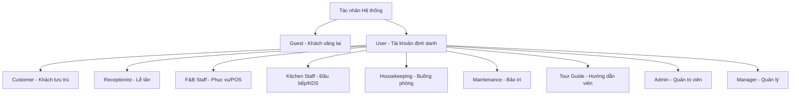

# ĐẶC TẢ CHI TIẾT DỰ ÁN PHÁT TRIỂN PHẦN MỀM

**HỆ THỐNG QUẢN LÝ NGHỈ DƯỠNG TÍCH HỢP KAWAI RETREAT RESORT & HUB**

## CHANGELOG

| Ngày      | Người thực hiện | Nội dung thay đổi                                                                                                                                                       |
| ---------- | ------------------- | -------------------------------------------------------------------------------------------------------------------------------------------------------------------------- |
| 2026-06-16 | Antigravity         | Đồng bộ hóa toàn diện đặc tả dự án theo UC_MASTER_TABLE V3, chi tiết hóa 25 Use Cases, luồng xử lý và dữ liệu I/O làm tài liệu blueprint lập trình |
| 2026-06-11 | Antigravity         | Xác nhận và định hình tài liệu đặc tả khớp luồng phát triển Hybrid Organization                                                                             |
| 2026-06-09 | Antigravity         | Khởi tạo tài liệu đặc tả dự án                                                                                                                                    |

---

## 1. Bài toán đặt ra & Giải pháp tổng thể

**Kawai Retreat Resort & Hub** là một khu nghỉ dưỡng hạng sang. Vận hành một resort cao cấp đòi hỏi sự phối hợp chặt chẽ giữa nhiều bộ phận: Tiền sảnh, Nhà hàng (F&B), Buồng phòng (Housekeeping), Bảo trì (Maintenance), Lữ hành (Tour) và Quản lý chiến lược.

Hiện tại, các bộ phận đang hoạt động biệt lập trên các công cụ rời rạc (Phần mềm phòng riêng, POS nhà hàng riêng, Tour và Buồng phòng quản lý bằng bảng tính thủ công). Sự thiếu kết nối này dẫn đến:

- **Trải nghiệm khách hàng kém:** Khách bị trùng phòng do bất đồng bộ dữ liệu; khách phải thanh toán nhỏ lẻ nhiều lần (móc ví tại nhà hàng, tại quầy tour, tại lễ tân) thay vì tận hưởng kỳ nghỉ nghỉ dưỡng trọn vẹn.
- **Vận hành rủi ro:** Phòng bẩn/hỏng chưa kịp cập nhật khiến lễ tân giao nhầm phòng cho khách; thông tin đồ uống có phí tại phòng bị thất thoát; kiểm toán đêm và tổng hợp doanh thu cuối tháng của kế toán dễ sai sót do làm thủ công từ nhiều nguồn.

**Giải pháp Kawai Retreat Resort & Hub:** Một nền tảng tập trung duy nhất kết nối toàn bộ luồng vận hành và dữ liệu. Hệ thống vận hành theo cơ chế **Tích hợp Folio (Post to Room / Room Charge)**: mọi chi phí phát sinh từ nhà hàng, dịch vụ phòng, tour tuyến, tiêu dùng mini-bar hay đền bù tài sản đều tự động đổ về một hóa đơn tổng hợp theo số phòng của khách, ký gửi thanh toán một lần duy nhất khi Check-out.

---

## 2. Kiến trúc Đối tượng & Phân quyền (Actors)

Hệ thống phân tách rõ ràng giữa **Đối tượng thực tế** và **Mô hình kế thừa tài khoản** để tối ưu hóa bảo mật và lập trình backend:



### 2.1. Nhóm Khách hàng

- **Guest (Khách vãng lai):** Người dùng chưa đăng nhập hệ thống. Chỉ có quyền truy cập, tìm kiếm và xem các thông tin công khai trên Landing Page.
- **Customer (Khách hàng hệ thống):** Kế thừa từ User. Là Guest đã đăng ký/đăng nhập tài khoản. Có quyền thực hiện giao dịch đặt dịch vụ, quản lý booking cá nhân, theo dõi chi tiêu và viết đánh giá.

### 2.2. Nhóm Người dùng Hệ thống (Kế thừa từ lớp đối tượng User)

- **User (Lớp cơ sở):** Chứa các thuộc tính và nghiệp vụ dùng chung: Đăng nhập, đăng ký, xác thực OTP, quên/đặt lại mật khẩu, cập nhật hồ sơ cá nhân và quản lý phiên làm việc.
- **Receptionist (Lễ tân):** Điều phối cốt lõi tại tiền sảnh, xử lý vòng đời lưu trú của khách, quản lý sơ đồ phòng trực quan và là chốt chặn thanh toán cuối cùng.
- **Housekeeping (Nhân viên buồng phòng):** Quản lý trạng thái vệ sinh phòng vật lý, ghi nhận tiêu dùng mini-bar, kiểm soát tài sản và báo cáo sự cố kỹ thuật.
- **Maintenance (Nhân viên kỹ thuật / Sửa chữa):** Tiếp nhận và sửa chữa các sự cố trang thiết bị hạ tầng phần cứng.
- **F&B Staff (Nhân viên Phục vụ/Thu ngân):** Sử dụng hệ thống POS, quản lý sơ đồ bàn, nhận order và thanh toán.
- **Kitchen Staff (Nhân viên Bếp):** Nhận thông tin order từ hệ thống KDS, cập nhật trạng thái món ăn và báo cáo kho nguyên liệu.
- **Tour Guide (Hướng dẫn viên):** Điều hành các chương trình lữ hành, trải nghiệm địa phương, quản lý khách và điểm danh bằng AI.
- **Admin (Quản trị viên):** Quản trị toàn bộ tài khoản nhân viên, phân quyền truy cập, quản lý dữ liệu gốc (Core Data) và giám sát rủi ro qua Audit Log.
- **Manager (Quản lý cấp cao):** Theo dõi sức khỏe tài chính, phân tích biểu đồ chiến lược và xuất bản tài liệu báo cáo định kỳ.

---

## 3. Phân rã Nghiệp vụ chi tiết theo Tác nhân (Actor Workflows)

### 3.1. Khách hàng (Guest / Customer)

- **Khi là Khách vãng lai (Guest):** Xem Landing Page công khai, thông tin resort, hạng phòng, gói tour, nhà hàng và các đánh giá.
- **Khi đã Đăng nhập (Customer):**
  - **Thực hiện đặt dịch vụ:** Đặt phòng (thanh toán cọc trực tuyến), Đặt tour, Đặt bàn nhà hàng hoặc gọi món.
  - **Cá nhân hóa ưu đãi:** Xem khuyến mãi, giảm giá cá nhân hóa.
  - **Quản lý Booking:** Theo dõi lịch sử và trạng thái thời gian thực.
  - **Thay đổi lịch trình:** Hủy/Thay đổi lịch trình theo chính sách.
  - **Quản lý chi tiêu (Room Charge):** Theo dõi tổng số tiền dịch vụ phát sinh (Folio).
  - **Đánh giá:** Viết nhận xét và chấm điểm sao.
  - **Quyền riêng tư:** Gửi yêu cầu xóa thông tin cá nhân (Ẩn danh hóa).

### 3.2. Lễ tân (Front Office)

- **Quản lý Sơ đồ phòng trực quan (Room Matrix):** Giám sát trạng thái phòng thời gian thực.
- **Nghiệp vụ lưu trú:** Đăng ký nhận phòng (Check-in), Trả phòng (Check-out) và Đổi phòng.
- **Xử lý tài chính:** Thu tiền cọc, tự động gom hóa đơn phát sinh từ các bộ phận (Folio) để thanh toán tổng.
- **Điều phối dịch vụ:** Theo dõi lịch dọn dẹp, tra cứu lịch trình tour.
- **Yêu cầu dọn gấp (Rush Room):** Đánh dấu ưu tiên dọn dẹp cho phòng sắp có khách check-in sớm.

### 3.3. Nhân viên buồng phòng (Housekeeping)

- **Quản lý trạng thái phòng:** Xem danh sách phòng phân công, ưu tiên Rush Room. Cập nhật trạng thái (Bẩn -> Sạch).
- **Báo cáo Mini-bar & Tài sản:** Nhập số lượng đồ dùng có phí đã sử dụng, hệ thống đẩy vào Folio.
- **Báo cáo sửa chữa:** Gửi phiếu yêu cầu sửa chữa kỹ thuật.

### 3.4. Nhân viên kỹ thuật / Sửa chữa (Maintenance)

- **Quản lý phiếu sửa chữa:** Tiếp nhận yêu cầu từ Buồng phòng/Lễ tân.
- **Cập nhật tiến độ:** Thay đổi trạng thái sự cố, tự động cập nhật lên Room Matrix.

### 3.5. Bộ phận Nhà hàng (F&B Staff) & Bếp (Kitchen Staff)

- **F&B Staff (POS Order):** Tra cứu E-Menu, tạo đơn tại bàn, xử lý thanh toán, **Ký gửi hóa đơn về phòng (Post to Room)**.
- **Kitchen Staff (KDS):** Theo dõi đơn hàng real-time, cập nhật trạng thái chế biến, báo "Hết món" để khóa món trên POS.

### 3.6. Hướng dẫn viên (Tour Guide)

- **Quản lý lịch trình:** Xem lịch trình điều động tour.
- **Quản lý danh sách khách:** Xem bảng kê Manifest.
- **Xác thực khách bằng AI:** Quét khuôn mặt đối chiếu dữ liệu điểm danh.
- **Báo cáo sự cố tour:** Gửi báo cáo khẩn cấp về trung tâm.

### 3.7. Quản trị viên (Admin)

- **Quản lý người dùng:** CRUD và phân quyền (RBAC) nhân viên.
- **Quản lý dữ liệu hệ thống (Core Data):** CRUD danh mục món ăn, tour, phòng, bảng giá, email, Landing Page.
- **Nhật ký hệ thống (Audit Log):** Giám sát lịch sử thao tác nhạy cảm.

### 3.8. Quản lý (Manager)

- **Xem báo cáo tài chính:** Theo dõi dòng tiền, doanh thu chi tiết (USALI).
- **Biểu đồ phân tích (Dashboard):** Xem Occupancy Rate, tỷ lệ bán món ăn, tour.
- **Xuất bản tài liệu:** Kết xuất báo cáo PDF/Excel (.xlsx).

---

## 4. Đặc tả kỹ thuật chi tiết các Use Cases phát triển hệ thống (31 Use Cases)

Hệ thống được chia thành 6 phân hệ cốt lõi tương ứng 6 nhóm nghiệp vụ chính:

### 🔴 MOD1: HỆ THỐNG CỐT LÕI, XÁC THỰC & ADMIN CONFIG

#### **UC01: Quản lý Tài khoản & Xác thực (BCrypt)**
* **UC01.1: Đăng ký khách hàng trực tuyến + xác thực OTP email**
  * **Actor:** Guest (Customer)
  * **Luồng xử lý chính:** Khách điền form đăng ký trực tuyến -> Validate định dạng (Email, Phone) -> Băm mật khẩu bằng BCrypt (factor=10) -> INSERT `Accounts` (trạng thái `is_active = true`, role `CUSTOMER`) và `Customers` -> Gửi Email OTP kích hoạt tài khoản.
  * **Ràng buộc:** Mật khẩu tối thiểu 8 ký tự, có chữ hoa, thường và số. SĐT từ 10-12 số.
  * **Inputs:** `username`, `password`, `email`, `phone`, `fullName`.
  * **Outputs:** Thông báo đăng ký thành công, link xác thực gửi qua email.
  * **Tác động Database:** `Accounts` (INSERT), `Customers` (INSERT).
* **UC01.2: Admin khởi tạo tài khoản nhân viên / khách CRM**
  * **Actor:** Admin
  * **Luồng xử lý chính:** Admin điền form tạo nhân viên -> Chọn role tương ứng -> Hệ thống tự động tạo Account liên kết -> Gửi mail thông báo thông tin đăng nhập.
  * **Tác động Database:** `Accounts` (INSERT), `Employees` (INSERT).
* **UC01.3: Đăng nhập Guest (modal) + OAuth2 Google**
  * **Actor:** Guest, Customer
  * **Luồng xử lý chính:** Đăng nhập trực tiếp bằng Google OAuth2 -> Lấy thông tin email/tên -> Nếu chưa có tài khoản, tự động tạo tài khoản Customer mới.
  * **Tác động Database:** `Accounts` (SELECT/INSERT), `Customers` (SELECT/INSERT).
* **UC01.4: Đăng nhập nhân viên Ops (`/ops-login`) + redirect theo role**
  * **Actor:** Staff
  * **Luồng xử lý chính:** Nhân viên nhập credentials -> Spring Security xác thực -> Redirect về dashboard phù hợp: `/admin`, `/receptionist`, `/kitchen`, `/pos`.
  * **Tác động Database:** `Accounts` (SELECT).
* **UC01.5: Khóa tài khoản tự động sau n lần đăng nhập sai**
  * **Actor:** System
  * **Luồng xử lý chính:** Nhập sai liên tiếp 5 lần -> Cập nhật `failed_attempts` -> Khóa tài khoản trong 15 phút.
  * **Tác động Database:** `Accounts` (UPDATE).

#### **UC02: Đặt lại mật khẩu (Gửi Mail chứa Token giới hạn thời gian)**
* **Actor:** Toàn bộ User
* **Luồng xử lý chính:** Click "Quên mật khẩu" -> Nhập email -> Sinh UUID Token lưu vào DB (thời hạn 15 phút) -> Gửi mail link reset -> User click link -> Nhập mật khẩu mới -> Xác thực token hợp lệ -> Cập nhật mật khẩu mới và vô hiệu hóa token.
* **Tác động Database:** `Accounts` (UPDATE), `PasswordResetTokens` (INSERT/DELETE).

#### **UC03: Quản lý thông tin hồ sơ & người phụ thuộc**
* **UC03.1: Cập nhật thông tin profile, đổi mật khẩu**
  * **Actor:** Customer
  * **Tác động Database:** `Customers` (UPDATE).
* **UC03.2: Upload avatar (`/api/v1/upload`)**
  * **Actor:** Customer
  * **Tác động Database:** `Customers` (UPDATE).
* **UC03.3: Quản lý người phụ thuộc (Dependents)**
  * **Actor:** Customer
  * **Luồng xử lý chính:** Thêm thông tin người đi cùng (họ tên, CCCD/Passport) để phục vụ khai báo tạm trú.
  * **Tác động Database:** `Dependents` (INSERT/UPDATE/DELETE).

#### **UC04: FaceID — Đăng ký & nhận diện khuôn mặt**
* **UC04.1: Upload ảnh chân dung / vector khuôn mặt vào profile**
  * **Actor:** Customer
  * **Luồng xử lý chính:** Khách hàng upload ảnh trực diện chân dung -> Server gọi Python AI service trích xuất vector khuôn mặt và lưu vào DB.
  * **Tác động Database:** `Customers` (UPDATE cột `face_vector_data`).
* **UC04.2: Quét FaceID tại checkpoint tour (Python + face-api.js)**
  * **Actor:** Tour Guide
  * **Luồng xử lý chính:** Hướng dẫn viên dùng camera quét mặt khách -> So khớp vector khuôn mặt (Cosine Similarity >= 0.85) để ghi nhận điểm danh.
  * **Tác động Database:** `TourAttendees` (UPDATE cột `attendance_status`).

#### **UC05: Phân quyền & An ninh nội bộ**
* **UC05.1: RBAC — Gán role & permission**
  * **Actor:** Admin
  * **Tác động Database:** `Roles` (UPDATE), `Accounts` (UPDATE).
* **UC05.2: Activity Audit Log (`AuditLog`, `@LogActivity`)**
  * **Actor:** Admin
  * **Luồng xử lý chính:** Log tự động ghi nhận hành vi thay đổi dữ liệu nhạy cảm (Ai, làm gì, ở đâu, lúc nào, giá trị cũ/mới).
  * **Tác động Database:** `AuditLogs` (INSERT).
* **UC05.3: Envers — Lịch sử thay đổi entity & rollback**
  * **Actor:** Admin
  * **Tác động Database:** `CustomRevisionEntities` (INSERT), các bảng audit của Envers.
* **UC05.4: Quản lý thiết bị ủy quyền Ops (`AuthorizedDevice`)**
  * **Actor:** Admin
  * **Tác động Database:** `AuthorizedDevices` (INSERT/UPDATE/DELETE).

#### **UC06: Master Data — Hạng phòng & Phòng vật lý**
* **Actor:** Admin
* **Luồng xử lý chính:** CRUD hạng phòng và các phòng vật lý trong resort.
* **Tác động Database:** `RoomCategories` (CRUD), `Rooms` (CRUD).

#### **UC07: Master Data — Sơ đồ bàn ăn**
* **Actor:** Admin, Manager
* **Luồng xử lý chính:** CRUD bàn ăn của các nhà hàng trong khu nghỉ dưỡng.
* **Tác động Database:** `RestaurantTables` (CRUD).

#### **UC08: Master Data — Tour & Lịch trình**
* **Actor:** Admin, Manager
* **Luồng xử lý chính:** CRUD tour, lịch chạy tour và các điểm dừng trong hành trình.
* **Tác động Database:** `Tours` (CRUD), `TourSchedules` (CRUD), `TourItineraries` (CRUD).

#### **UC09: Giá, Marketing & Vận hành Admin**
* **UC09.1: Cấu hình giá phòng động (`Dynamic_Pricing`)**
  * **Actor:** Admin, Manager
  * **Tác động Database:** `DynamicPricing` (INSERT/UPDATE).
* **UC09.2: CRUD bảng giá ngày (`Daily_Rates`)**
  * **Actor:** Admin
  * **Tác động Database:** `DailyRates` (CRUD).
* **UC09.3: Phụ thu trẻ em theo khung tuổi (`Room_Surcharge`)**
  * **Actor:** Admin, Manager
  * **Tác động Database:** `RoomSurcharges` (CRUD).
* **UC09.4: CRUD chiến dịch khuyến mãi (`Promotions`)**
  * **Actor:** Admin, Manager
  * **Tác động Database:** `Promotions` (CRUD).
* **UC09.5: CRUD thực đơn F&B (`Menu_Items`)**
  * **Actor:** Admin, Manager
  * **Tác động Database:** `MenuItems` (CRUD).
* **UC09.8: Workflow phê duyệt nghiệp vụ (promo threshold)**
  * **Actor:** Admin
  * **Luồng xử lý chính:** Quản lý JSON config workflow duyệt hạn mức giảm giá hoặc ngoại lệ nghiệp vụ.
  * **Tác động Database:** `Workflows` (INSERT/UPDATE).
* **UC09.9: Quản lý Cronjob hệ thống (DynamicJobManager)**
  * **Actor:** Admin
  * **Tác động Database:** `AuditLogs` (INSERT).

---

### 🔵 MOD2: QUẢN LÝ PHÒNG, LỄ TÂN & BUỒNG PHÒNG

#### **UC10: Tìm kiếm phòng trống & giá**
* **Actor:** Guest, Customer, Receptionist
* **Luồng xử lý chính:** Nhập ngày đến/đi và số khách -> Tính toán phòng trống khả dụng -> Trả về danh sách kèm giá tính theo `Daily_Rates`.
* **Tác động Database:** `Rooms` (SELECT), `DailyRates` (SELECT), `RoomBookingDetails` (SELECT).

#### **UC11: Khóa giữ phòng tạm (Room Cart Lock 15')**
* **Actor:** Customer, System
* **Luồng xử lý chính:** Khi khách chọn phòng và bấm thanh toán -> Giữ phòng tạm thời (`holdExpiresAt = now + 15 mins`) -> Tự động giải phóng nếu hết 15 phút không thanh toán.
* **Tác động Database:** `RoomBookingDetails` (UPDATE).

#### **UC12: Nghiệp vụ sảnh (Front Desk)**
* **UC12.1: Đặt phòng & Đặt cọc trực tuyến đa hạng (Tích hợp VNPay)**
  * **Actor:** Customer
  * **Tác động Database:** `Bookings` (INSERT), `PaymentTransactions` (INSERT).
* **UC12.2: Check-in tại quầy & Gán phòng vật lý**
  * **Actor:** Receptionist
  * **Tác động Database:** `RoomBookingDetails` (UPDATE), `Rooms` (UPDATE status thành `Occupied`).
* **UC12.3: Quét OCR CCCD tự động điền form**
  * **Actor:** Receptionist
  * **Luồng xử lý chính:** Lễ tân upload ảnh CCCD của khách -> AI trích xuất thông tin -> Tự động cập nhật hồ sơ lưu trú.
  * **Tác động Database:** `Customers` (UPDATE).
* **UC12.5: Điều phối đổi phòng vật lý linh hoạt**
  * **Actor:** Receptionist
  * **Tác động Database:** `RoomBookingDetails` (UPDATE), `Rooms` (UPDATE).
* **UC12.6: Check-out tất toán hóa đơn tổng**
  * **Actor:** Receptionist
  * **Tác động Database:** `Bookings` (UPDATE status thành `Checked_Out`), `Rooms` (UPDATE status thành `Vacant_Dirty`).
* **UC12.7: Walk-in Check-in (Khách đặt trực tiếp tại sảnh)**
  * **Actor:** Receptionist
  * **Tác động Database:** `Bookings` (INSERT), `RoomBookingDetails` (INSERT), `PaymentTransactions` (INSERT).

#### **UC13: Buồng phòng & Bảo trì**
* **UC13.1: Tự động phát lệnh tác vụ dọn phòng khi khách Check-out**
  * **Actor:** System
  * **Tác động Database:** `HotelOperations` (INSERT task `CLEANING`).
* **UC13.2: HK cập nhật dọn phòng hoàn thành (Báo Sạch/Bẩn)**
  * **Actor:** Housekeeper
  * **Tác động Database:** `Rooms` (UPDATE status thành `Vacant_Clean`), `HotelOperations` (UPDATE status thành `Completed`).
* **UC13.4: Báo hỏng thiết bị phòng (Chuyển trạng thái Maintenance)**
  * **Actor:** Housekeeper, Receptionist
  * **Tác động Database:** `Rooms` (UPDATE status thành `Maintenance`), `HotelOperations` (INSERT task `MAINTENANCE`).
* **UC13.5: Hoàn thành bảo trì thiết bị**
  * **Actor:** Maintenance Staff
  * **Tác động Database:** `Rooms` (UPDATE status thành `Vacant_Dirty`), `HotelOperations` (UPDATE).

---

### 🔵 MOD3: F&B, POS & KDS

#### **UC14: Đặt giữ trước bàn ăn tại nhà hàng**
* **Actor:** Customer, Receptionist
* **Luồng xử lý chính:** Đặt chỗ giữ bàn theo giờ hẹn -> Hệ thống cập nhật sơ đồ bàn.
* **Tác động Database:** `TableReservations` (INSERT).

#### **UC15: Cấu hình thực đơn & nhãn dị ứng**
* **Actor:** Admin, Manager
* **Tác động Database:** `MenuItems` (INSERT/UPDATE).

#### **UC16: Đặt món trực tuyến lên phòng nghỉ (Room Service / E-Menu)**
* **Actor:** Customer
* **Luồng xử lý chính:** Khách quét QR phòng -> Lên đơn -> Báo bếp -> Cho phép chọn ghi nợ ví phòng.
* **Tác động Database:** `FoodOrders` (INSERT), `FoodOrderDetails` (INSERT).

#### **UC17: POS Dine-In — Lên đơn tại bàn**
* **Actor:** F&B Staff
* **Tác động Database:** `FoodOrders` (INSERT), `FoodOrderDetails` (INSERT).

#### **UC18: Tất toán POS / Post-to-Room (Gom Folio)**
* **Actor:** F&B Staff, Cashier
* **Luồng xử lý chính:** Khách ăn tại quầy muốn ghi nợ phòng -> Nhập số phòng + mã PIN -> Kiểm tra Credit Limit của phòng -> Tạo giao dịch folio.
* **Tác động Database:** `FolioItems` (INSERT).

#### **UC19: Màn hình bếp KDS Real-time**
* **UC19.2: Đầu bếp cập nhật tiến độ (Cooking / Ready / Served)**
  * **Actor:** Kitchen Staff
  * **Tác động Database:** `FoodOrderDetails` (UPDATE `kot_status`).
* **UC19.3: Báo hết món (Tự động khóa thực đơn trên POS/Web)**
  * **Actor:** Kitchen Staff
  * **Tác động Database:** `MenuItems` (UPDATE `is_available = false`).

---

### 🟢 MOD4: TOUR, ADD-ONS & ĐÁNH GIÁ

#### **UC20: Tìm kiếm hành trình lữ hành & thời tiết**
* **Actor:** Guest, Customer
* **Luồng xử lý chính:** Xem danh sách tour, hiển thị widget thời tiết OpenWeather tương ứng ngày chạy.
* **Tác động Database:** `Tours` (SELECT).

#### **UC21: Đặt vé tour & Chống Double-booking**
* **Actor:** Customer, Receptionist
* **Luồng xử lý chính:** Đặt vé tour -> Kiểm tra capacity của chuyến xe -> Trừ số chỗ còn trống.
* **Tác động Database:** `TourBookings` (INSERT), `TourAttendees` (INSERT).

#### **UC22: Điều hành Tour**
* **UC22.1: Phân công tài xế & Hướng dẫn viên du lịch**
  * **Actor:** Admin
  * **Tác động Database:** `TourStaffAssignments` (INSERT).
* **UC22.2: Điểm danh AI Face Scan tại Checkpoint**
  * **Actor:** Tour Guide
  * **Luồng xử lý chính:** Chụp ảnh khách -> Microservice so khớp FaceID -> Cập nhật trạng thái điểm danh hành khách.
  * **Tác động Database:** `TourAttendees` (UPDATE).
* **UC22.3: Ghi nhận tọa độ GPS xe chạy**
  * **Actor:** Tour Guide
  * **Tác động Database:** `TourLocations` (INSERT).
* **UC22.4: Hủy chuyến Tour do sự cố khẩn cấp (Hoàn tiền)**
  * **Actor:** Admin
  * **Tác động Database:** `TourSchedules` (UPDATE), `TourBookings` (UPDATE status thành `Cancelled`), `PaymentTransactions` (INSERT refund).

#### **UC23: Add-ons dịch vụ gia tăng (Spa, Transfer Booking)**
* **Actor:** Customer, Receptionist
* **Tác động Database:** `BookingServices` (INSERT), `FolioItems` (INSERT).

#### **UC24: Gửi đánh giá bằng sao & feedback văn bản**
* **Actor:** Customer
* **Luồng xử lý chính:** Khách đã checkout / hoàn thành tour được quyền đánh giá dịch vụ 1-5 sao.
* **Tác động Database:** `Reviews` (INSERT).

#### **UC25: Kiểm duyệt nội dung đánh giá của khách**
* **Actor:** Admin
* **Tác động Database:** `Reviews` (UPDATE `moderation_status`).

---

### 🟢 MOD5: FOLIO, TÀI CHÍNH & BÁO CÁO

#### **UC26: Folio Aggregation — Gom hóa đơn tích lũy tự động**
* **UC26.1: Theo dõi ví nợ phòng lẻ thời gian thực**
  * **Actor:** Customer, Receptionist
  * **Tác động Database:** `FolioItems` (SELECT).
* **UC26.2: Kiểm soát nợ trần & Ví nợ phòng**
  * **Actor:** Receptionist
  * **Tác động Database:** `RoomBookingDetails` (SELECT/UPDATE).
* **UC26.5: Tách hóa đơn phụ thu / hóa đơn đoàn**
  * **Actor:** Receptionist
  * **Tác động Database:** `FolioItems` (UPDATE `is_settled_separately`).

#### **UC27: Night Audit & Thanh toán Check-out phát hành e-Invoice**
* **UC27.1: Chạy lệnh Kiểm toán đêm (Night Audit) tự động khóa sổ (02:00 AM)**
  * **Actor:** System
  * **Luồng xử lý chính:** 02:00 AM tự động chốt ngày -> Post room charges vào folio -> Chốt doanh thu ngày -> Đổi ngày làm việc.
  * **Tác động Database:** `FolioItems` (INSERT), `AuditLogs` (INSERT).
* **UC27.2: Tất toán tài chính check-out & In hóa đơn**
  * **Actor:** Receptionist
  * **Tác động Database:** `ConsolidatedInvoices` (INSERT/UPDATE).
* **UC27.4: Phát hành hóa đơn điện tử e-Invoice gửi mail PDF**
  * **Actor:** System
  * **Tác động Database:** `ConsolidatedInvoices` (SELECT).

#### **UC28: Dashboard Manager & Báo cáo USALI**
* **UC28.1: Biểu đồ phân tích tài chính doanh thu luỹ kế**
  * **Actor:** Manager
  * **Tác động Database:** `ConsolidatedInvoices` (SELECT).
* **UC28.4: Xuất báo cáo tài chính phân bổ chi phí chuẩn USALI**
  * **Actor:** Manager
  * **Tác động Database:** `ConsolidatedInvoices` (SELECT), `FolioItems` (SELECT).
* **UC28.5: Export PDF / Excel (.xlsx) các loại báo cáo**
  * **Actor:** Manager
  * **Tác động Database:** `ExportHistories` (INSERT).

---

### 🟢 MOD6: HỆ THỐNG & TÍCH HỢP

#### **UC29: Hệ thống email thông báo tự động**
* **Actor:** System
* **Luồng xử lý chính:** Mail OTP đăng ký, reset mật khẩu, e-Invoice PDF, xác nhận booking, cảnh báo VIP.
* **Tác động Database:** `Accounts` (SELECT).

#### **UC30: Scheduled Jobs tự động (Cronjobs)**
* **Actor:** System
* **Luồng xử lý chính:** Scheduler quét giỏ phòng tạm 15 phút, giải phóng bàn ăn quá giờ 30 phút, kiểm toán đêm 02:00 AM.
* **Tác động Database:** `RoomBookingDetails` (UPDATE), `TableReservations` (UPDATE).

#### **UC31: Landing pages & Trải nghiệm khách hàng portal**
* **Actor:** Guest, Customer
* **Luồng xử lý chính:** Hiển thị giao diện giới thiệu resort, menu ẩm thực công khai, form đặt phòng trực tuyến.
* **Tác động Database:** `RoomCategories` (SELECT).

---
## 5. Quy tắc Kinh doanh & Ràng buộc Hệ thống (Business Rules)

- **Chống ghi đè đồng thời (Concurrent Booking Prevention):** Bắt buộc sử dụng cơ chế Khóa lạc quan (Optimistic Locking) thông qua cột `@Version` trong JPA tại các bảng `Bookings` để tránh việc hai khách hàng cùng đặt thành công một phòng vật lý tại một thời điểm hoặc đặt vượt sức chứa của một chuyến xe Tour.
- **Điều kiện Check-out nghiêm ngặt:** Hệ thống tiền sảnh Lễ tân không được phép kích hoạt sự kiện trả phòng (Check-out) nếu ví nợ Folio của phòng nghỉ/khách hàng đó vẫn còn tồn tại các hóa đơn hoặc giao dịch con ở trạng thái `Pending` hoặc số dư nợ tổng hợp chưa quy về bằng 0.
- **Chính sách hoàn tiền phòng (Cancellation Policy):**
  * Yêu cầu hủy trước 48 giờ so với ngày Check-in dự kiến: Hoàn trả 100% số tiền đặt cọc trước (`Payment_Transactions.transaction_type = 'REFUND'`).
  * Yêu cầu hủy trong vòng 48 giờ trước ngày Check-in: Tịch thu toàn bộ số tiền đặt cọc, chuyển trạng thái đơn sang `Cancelled`.

---

## 6. Danh mục Tích hợp API Bên thứ ba

- **Cổng thanh toán điện tử:** Tích hợp bộ thư viện SDK VNPay Sandbox phục vụ thanh toán đặt cọc phòng và vé tour trực tuyến bằng mã QR hoặc tài khoản ngân hàng.
- **Dịch vụ truyền thông:** Sử dụng Mail Service (SendGrid API) để gửi Email xác thực OTP, gửi mã đường link khôi phục mật khẩu và gửi hóa đơn điện tử e-Invoice PDF tự động.
- **Bản đồ & Thời tiết:** Gọi API thời tiết địa phương của OpenWeather API để hỗ trợ khách hàng theo dõi thời tiết thực tế tại điểm lữ hành trước khi đăng ký đặt Tour.

---

## 7. Tiêu chuẩn Kỹ thuật & Tuân thủ Pháp lý bắt buộc

- **Bảo vệ dữ liệu cá nhân (Nghị định 13/2023/NĐ-CP):** Mã hóa đối xứng thông tin CCCD/Hộ chiếu bằng AES-256 trước khi lưu trữ vào Database. Hỗ trợ tính năng Ẩn danh hóa thông tin cá nhân khách hàng (Anonymization) khi khách hàng gửi yêu cầu xóa hồ sơ.
- **Khai báo tạm trú (Luật Cư trú 2020):** Thiết lập cấu hình dữ liệu check-in thu thập đủ: Họ tên, Ngày sinh, CCCD, Giới tính, Quốc tịch nhằm đáp ứng yêu cầu xuất tệp tin khai báo lưu trú đồng bộ với cơ quan Công an khu vực.
- **Kế toán lưu trú tiêu chuẩn USALI:** Mọi doanh thu phát sinh trên hóa đơn tổng hợp bắt buộc phải được phân loại và bóc tách chính xác theo từng bộ phận (Department Code) phát sinh chi phí để phục vụ xuất báo cáo GOP chuẩn quốc tế.
- **Chu kỳ khách hàng tiêu chuẩn AHLEI:** Đảm bảo hệ thống quản lý luồng dữ liệu của khách hàng tuân thủ đúng 4 giai đoạn chuẩn của Hiệp hội Khách sạn Hoa Kỳ: *Pre-arrival* (Đăng ký/Đặt cọc) -> *Arrival* (Check-in/OCR CCCD) -> *Occupancy* (Lưu trú/Ký nợ Folio) -> *Departure* (Tất toán nợ/Check-out/Xuất e-Invoice).

---

## 8. Thiết kế Cơ sở Dữ liệu & Ràng buộc Hệ thống

Hệ thống sử dụng cơ sở dữ liệu quan hệ H2 (trong môi trường test/dev) và MySQL/PostgreSQL (trong môi trường production) với các nguyên tắc thiết kế tối ưu hóa hiệu năng và toàn vẹn dữ liệu:

- **Phân tách nghiệp vụ F&B và Kitchen:** Bảng `Food_Orders` và `Food_Order_Details` phân tách rõ ràng. Trạng thái chế biến món ăn (`kot_status`) được theo dõi chi tiết ở mức từng món ăn, cho phép Bếp xác nhận hoàn thành từng đĩa và tự động đẩy WebSocket báo về cho chạy bàn.
- **Quản lý Khách tham gia Tour (`Tour_Attendees`):** Lưu trữ danh sách chi tiết từng hành khách đi xe Tour (kể cả người phụ thuộc `Dependents`), tích hợp trực tiếp cột `face_vector_data` chứa mảng số đặc trưng khuôn mặt nhằm phục vụ điểm danh AI.
- **Giá phòng động (`Daily_Rates`):** Quản lý giá phòng linh hoạt theo từng ngày cụ thể, tối ưu thuật toán tìm kiếm phòng và tính toán doanh thu tự động khi chạy Kiểm toán đêm (Night Audit).
- **Database Triggers toàn vẹn:** Ứng dụng các Database Triggers để tự động hóa các quy tắc nghiệp vụ cốt lõi dưới tầng CSDL:
  * `TRG_Auto_Housekeeping_Task`: Tự động sinh tác vụ dọn phòng khi khách Check-out.
  * `TRG_Prevent_Overbooking`: Ngăn chặn đặt phòng chồng lấn ngày thời gian thực.
  * `TRG_Tour_Capacity_Validator`: Chặn đặt vé tour vượt sức chứa của xe.
  * `TRG_Folio_Credit_Limit_Check`: Chặn ký nợ dịch vụ vượt hạn mức phòng.

---

## 9. Cấu trúc Thư mục Dự án (Project Directory Tree)

Hệ thống tuân thủ nghiêm ngặt mô hình kiến trúc MVC (Model-View-Controller) của Spring Boot kết hợp với phân lớp Layered Architecture (Controller - Service - Repository), được thiết kế tối ưu cho việc phát triển song song 5 phân hệ:

```text
Kawai-Resort-Project/
├── 01_SRS/                           # Tài liệu Đặc tả Yêu cầu & Kiến trúc
├── 02_SDS/                           # Tài liệu Thiết kế Hệ thống
├── 03-Design/                        # Chứa tài liệu Database Schema và sơ đồ thiết kế
├── 04-Implement/                     # Mã nguồn dự án được tổ chức lại
│   ├── FE_Templates/                 # (Frontend) HTML/CSS/JS tĩnh dùng để ghép Thymeleaf
│   │
│   ├── kawai-ai-service/             # (Microservice) Python FastAPI cho AI Face Scan
│   │   ├── main.py                   # API xử lý nhận diện khuôn mặt
│   │   └── models/                   # Chứa model AI (dlib/OpenCV)
│   │
│   └── kawai-backend/                # (Backend) Spring Boot Core
│       ├── pom.xml                   # Cấu hình thư viện Maven
│       └── src/main/
│           ├── resources/
│           │   ├── application.yml   # Cấu hình hệ thống (MySQL, SMTP, Port)
│           │   ├── static/           # CSS, JS, Images, Fonts tĩnh
│           │   └── templates/        # (View) Các file giao diện Thymeleaf (.html)
│           │       ├── admin/        # Giao diện Quản trị viên
│           │       ├── guest/        # Giao diện Khách hàng (Booking, Landing)
│           │       ├── staff/        # Giao diện Nhân viên (Lễ tân, POS, Buồng phòng)
│           │       └── shared/       # Components dùng chung (Header, Footer, Modal)
│           │
│           └── java/com/kawai/
│               ├── KawaiApplication.java   # File khởi chạy
│               ├── config/           # Cấu hình bảo mật, CORS, VNPay, Swagger
│               ├── security/         # JWT / Session auth, Role-based Access Control
│               ├── exceptions/       # Xử lý ngoại lệ toàn cục (Global Exception Handler)
│               ├── utils/            # Các hàm tiện ích (DateFormatter, Exporter)
│               │
│               ├── models/           # (Model) Entity JPA ánh xạ Database
│               │   ├── core/         # Entity cốt lõi (User, Roles)
│               │   └── modules/      # Entity chia theo 5 Module
│               │
│               ├── dto/              # Data Transfer Objects (Hứng dữ liệu từ form)
│               ├── repositories/     # (DAO) Spring Data JPA tương tác CSDL
│               │
│               ├── services/         # Chứa Business Logic cốt lõi
│               │   ├── interfaces/   # Interface định nghĩa dịch vụ
│               │   └── impl/         # Triển khai logic thực tế
│               │
│               └── controllers/      # (Controller) Nhận Request & Điều hướng
│                   ├── api/          # RESTful APIs (cho AI Service gọi tới)
│                   └── web/          # Web Controllers trả về Thymeleaf views
```

**Nguyên tắc thiết kế mã nguồn:**

- **Views (Thymeleaf):** Hoàn toàn không chứa Business Logic, chỉ nhận Data từ Controller để hiển thị giao diện.
- **Controllers:** Chỉ làm nhiệm vụ phân luồng (Routing), kiểm tra quyền (Authorization), và gọi `Service`. Tuyệt đối không thao tác Database trực tiếp.
- **Services:** Chứa 100% nghiệp vụ cốt lõi (Ví dụ: logic cộng dồn Folio, chống Overbooking, thuật toán Night Audit).
- **Repositories:** Chuyên trách giao tiếp Database (kế thừa `JpaRepository`) và thực thi các câu lệnh JPQL/Native SQL.
