# SOFTWARE REQUIREMENT SPECIFICATION
## Kawai Resort & Tour Hub
**Group 2 - SE2003-NET**

---

# Table of Contents
I. Record of Changes
II. Software Requirement Specification
  1. Overall Requirements
    1.1 Context Diagram
    1.2 Main Business Processes
    1.3 User Requirements
      1.3.1 Actors
      1.3.2 Use Case Diagrams
      1.3.3 Detailed Use Cases Master List
    1.4 System Functionalities
      1.4.1 Screens Flow
      1.4.2 Screen Authorization
      1.4.3 Non-UI Functions
    1.5 Entity Relationship Diagram
  2. Use Case Specifications
  3. Functional Requirements
  4. Non-Functional Requirements
    4.1 External Interfaces
    4.2 Quality Attributes
  5. Requirement Appendix
    5.1 Business Rules
    5.2 System Messages
    5.3 Other Requirements

---

# I. Record of Changes
| Date | Change | Description |
|---|---|---|
| Auto | Added | Generated complete V3 SRS document ensuring 100% depth, Mermaid compliance, and Codebase synchronization. |

# II. Software Requirement Specification

## 1. Overall Requirements

### 1.1 Context Diagram
*(Mô tả sự tương tác giữa Kawai Resort Hub với các nhân sự, khách hàng và hệ thống tích hợp bên ngoài)*
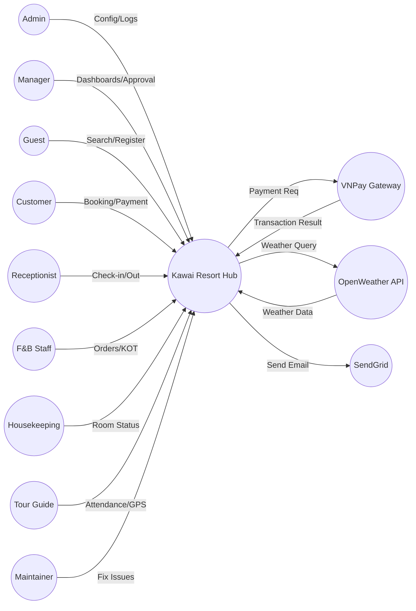
```mermaid
flowchart LR
    A((Admin)) --> |Config/Logs| K((Kawai Resort Hub))
    M((Manager)) --> |Dashboards/Approval| K
    G((Guest)) --> |Search/Register| K
    C((Customer)) --> |Booking/Payment| K
    R((Receptionist)) --> |Check-in/Out| K
    F((F&B Staff)) --> |Orders/KOT| K
    H((Housekeeping)) --> |Room Status| K
    T((Tour Guide)) --> |Attendance/GPS| K
    MT((Maintainer)) --> |Fix Issues| K
    K --> |Payment Req| VN((VNPay Gateway))
    VN --> |Transaction Result| K
    K --> |Weather Query| OW((OpenWeather API))
    OW --> |Weather Data| K
    K --> |Send Email| SG((SendGrid))
```

### 1.2 Main Business Processes

#### 1.2.1 Book Room Workflow
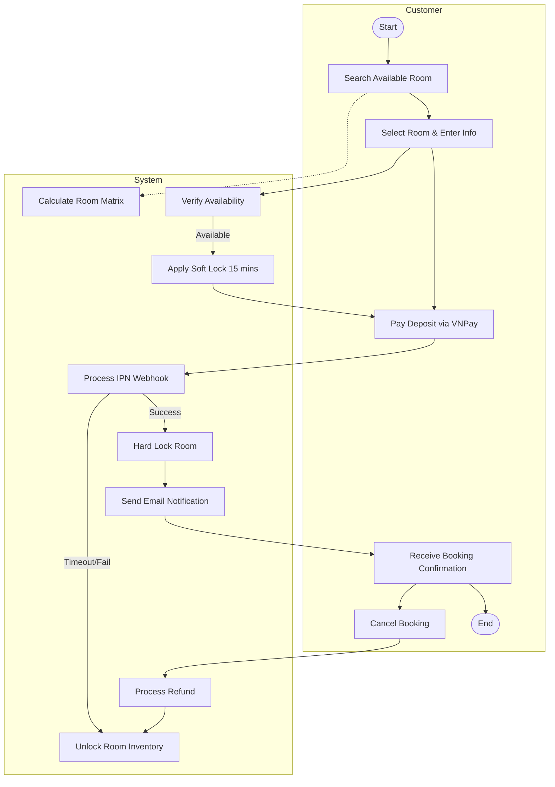
```mermaid
flowchart TD
    subgraph Customer
        Start([Start]) --> Search[Search Available Room]
        Search --> Select[Select Room & Enter Info]
        Select --> PayDeposit[Pay Deposit via VNPay]
        ReceiveInfo[Receive Booking Confirmation]
        Cancel[Cancel Booking]
        End([End])
    end
    
    subgraph System
        Avail[Calculate Room Matrix]
        Verify[Verify Availability]
        SoftLock[Apply Soft Lock 15 mins]
        ProcessIPN[Process IPN Webhook]
        HardLock[Hard Lock Room]
        SendNotify[Send Email Notification]
        Unlock[Unlock Room Inventory]
        Refund[Process Refund]
    end
    
    Search -.-> Avail
    Select --> Verify
    Verify -->|Available| SoftLock
    SoftLock --> PayDeposit
    PayDeposit --> ProcessIPN
    ProcessIPN -->|Success| HardLock
    HardLock --> SendNotify
    SendNotify --> ReceiveInfo
    ProcessIPN -->|Timeout/Fail| Unlock
    
    ReceiveInfo --> Cancel
    Cancel --> Refund
    Refund --> Unlock
    ReceiveInfo --> End
```

#### 1.2.2 Tour Booking & Staff Allocation Workflow
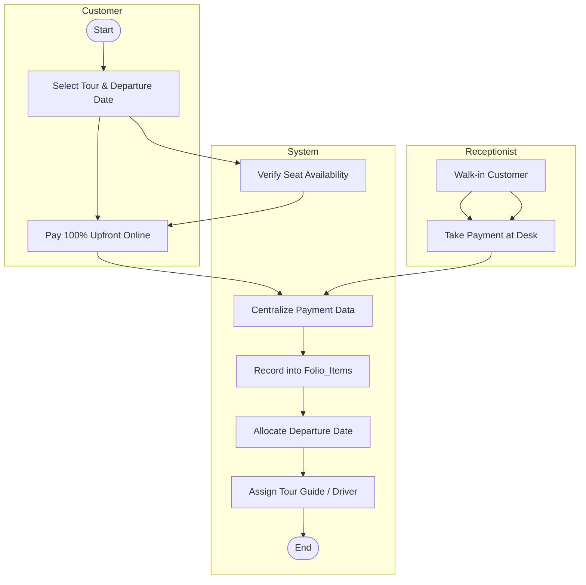
```mermaid
flowchart TD
    subgraph Customer
        TStart([Start]) --> SelectTour[Select Tour & Departure Date]
        SelectTour --> TPay[Pay 100% Upfront Online]
    end
    
    subgraph Receptionist
        WalkIn[Walk-in Customer] --> CounterPay[Take Payment at Desk]
    end
    
    subgraph System
        VerifySeat[Verify Seat Availability]
        Centralize[Centralize Payment Data]
        RecordTransaction[Record into Folio_Items]
        Allocate[Allocate Departure Date]
        AssignGuide[Assign Tour Guide / Driver]
        TEnd([End])
    end
    
    SelectTour --> VerifySeat
    VerifySeat --> TPay
    TPay --> Centralize
    
    WalkIn --> CounterPay
    CounterPay --> Centralize
    
    Centralize --> RecordTransaction
    RecordTransaction --> Allocate
    Allocate --> AssignGuide
    AssignGuide --> TEnd
```

#### 1.2.3 Front Office Check-in & Coordination Workflow
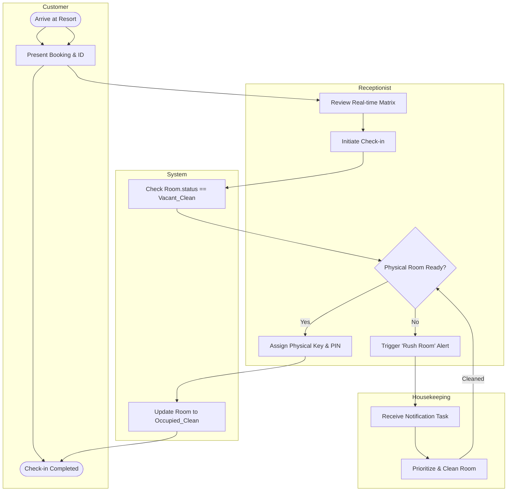
```mermaid
flowchart TD
    subgraph Customer
        Arrive([Arrive at Resort]) --> Present[Present Booking & ID]
        Present --> CheckInComplete([Check-in Completed])
    end
    
    subgraph Receptionist
        Review[Review Real-time Matrix]
        InitCheckin[Initiate Check-in]
        Ready{Physical Room Ready?}
        TriggerRush[Trigger 'Rush Room' Alert]
        AssignKey[Assign Physical Key & PIN]
    end
    
    subgraph Housekeeping
        NotifyTask[Receive Notification Task]
        Prioritize[Prioritize & Clean Room]
    end
    
    subgraph System
        CheckState[Check Room.status == Vacant_Clean]
        UpdateState[Update Room to Occupied_Clean]
    end
    
    Arrive --> Present
    Present --> Review
    Review --> InitCheckin
    InitCheckin --> CheckState
    CheckState --> Ready
    
    Ready -->|No| TriggerRush
    TriggerRush --> NotifyTask
    NotifyTask --> Prioritize
    Prioritize -->|Cleaned| Ready
    
    Ready -->|Yes| AssignKey
    AssignKey --> UpdateState
    UpdateState --> CheckInComplete
```

#### 1.2.4 Housekeeping & Maintenance Operation Workflow
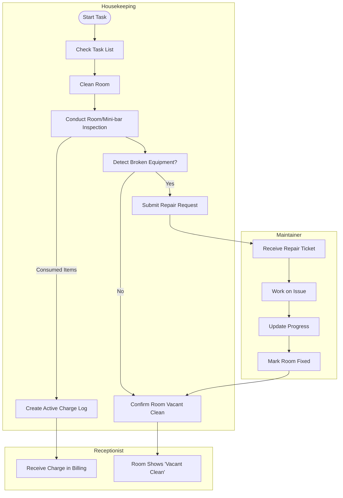
```mermaid
flowchart TD
    subgraph Receptionist
        RecCharge[Receive Charge in Billing]
        RoomVacant[Room Shows 'Vacant Clean']
    end
    
    subgraph Housekeeping
        StartHK([Start Task]) --> CheckList[Check Task List]
        CheckList --> Clean[Clean Room]
        Clean --> Inspect[Conduct Room/Mini-bar Inspection]
        Inspect -->|Consumed Items| CreateCharge[Create Active Charge Log]
        Inspect --> Detect[Detect Broken Equipment?]
        Detect -->|No| ConfirmClean[Confirm Room Vacant Clean]
        Detect -->|Yes| SubmitRepair[Submit Repair Request]
    end
    
    subgraph Maintainer
        RecTicket[Receive Repair Ticket]
        WorkIssue[Work on Issue]
        UpdateProg[Update Progress]
        MarkFixed[Mark Room Fixed]
    end
    
    CreateCharge --> RecCharge
    SubmitRepair --> RecTicket
    RecTicket --> WorkIssue
    WorkIssue --> UpdateProg
    UpdateProg --> MarkFixed
    MarkFixed --> ConfirmClean
    ConfirmClean --> RoomVacant
```

#### 1.2.5 F&B POS & Kitchen System Workflow
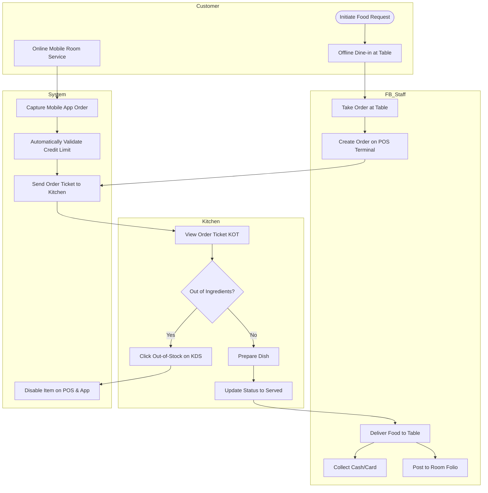
```mermaid
flowchart TD
    subgraph Customer
        ReqFood([Initiate Food Request]) --> DineIn[Offline Dine-in at Table]
        AppOrder[Online Mobile Room Service]
    end
    
    subgraph FB_Staff
        TakeOrder[Take Order at Table]
        CreatePOS[Create Order on POS Terminal]
        ServeFood[Deliver Food to Table]
        CollectPay[Collect Cash/Card]
        PostToRoom[Post to Room Folio]
    end
    
    subgraph Kitchen
        ViewKOT[View Order Ticket KOT]
        OutStock{Out of Ingredients?}
        ClickOut[Click Out-of-Stock on KDS]
        Prepare[Prepare Dish]
        UpdateServed[Update Status to Served]
    end
    
    subgraph System
        CaptureApp[Capture Mobile App Order]
        SendKOT[Send Order Ticket to Kitchen]
        AutoDisable[Disable Item on POS & App]
        ValidateLimit[Automatically Validate Credit Limit]
    end
    
    DineIn --> TakeOrder
    TakeOrder --> CreatePOS
    AppOrder --> CaptureApp
    CreatePOS --> SendKOT
    CaptureApp --> ValidateLimit
    ValidateLimit --> SendKOT
    
    SendKOT --> ViewKOT
    ViewKOT --> OutStock
    OutStock -->|Yes| ClickOut
    ClickOut --> AutoDisable
    OutStock -->|No| Prepare
    Prepare --> UpdateServed
    UpdateServed --> ServeFood
    
    ServeFood --> CollectPay
    ServeFood --> PostToRoom
```

#### 1.2.6 Tour Ops & AI Face Scan Workflow
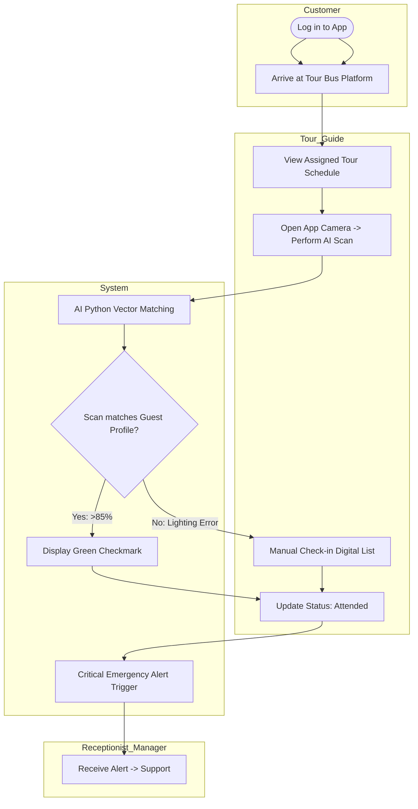
```mermaid
flowchart TD
    subgraph Customer
        AppLogin([Log in to App]) --> ArrivePlat[Arrive at Tour Bus Platform]
    end
    
    subgraph Tour_Guide
        ViewSched[View Assigned Tour Schedule]
        OpenCam[Open App Camera -> Perform AI Scan]
        ManualCheck[Manual Check-in Digital List]
        StatusUpdate[Update Status: Attended]
    end
    
    subgraph System
        AIVerify[AI Python Vector Matching]
        Match{Scan matches Guest Profile?}
        ShowCheck[Display Green Checkmark]
        Emergency[Critical Emergency Alert Trigger]
    end
    
    subgraph Receptionist_Manager
        RecAlert[Receive Alert -> Support]
    end
    
    AppLogin --> ArrivePlat
    ArrivePlat --> ViewSched
    ViewSched --> OpenCam
    OpenCam --> AIVerify
    AIVerify --> Match
    
    Match -->|Yes: >85%| ShowCheck
    ShowCheck --> StatusUpdate
    
    Match -->|No: Lighting Error| ManualCheck
    ManualCheck --> StatusUpdate
    
    StatusUpdate --> Emergency
    Emergency --> RecAlert
```

### 1.3 User Requirements

#### 1.3.1 Actors
# BẢNG QUY TẮC KINH DOANH & PHÂN QUYỀN — KAWAI RESORT

## CHANGELOG
| Ngày | Người thực hiện | Nội dung thay đổi |
|---|---|---|
| 2026-06-11 | Antigravity | Xác nhận và đồng bộ các Business Rules với luồng phát triển Hybrid Organization |
| 2026-06-09 | Antigravity | Khởi tạo bảng Quy tắc kinh doanh & Phân quyền |

---

## 1. Bộ Mã Quy Tắc Hệ Thống (System Prefix)

| Tiền tố | Bộ phận | Module |
|---------|--------|--------|
| `BR-SYS` | Quy tắc chung toàn hệ thống (Bảo mật, Tài khoản, Dữ liệu) | MOD1 |
| `BR-FO` | Quy tắc Tiền sảnh & Lưu trú (Front Office / Booking) | MOD2 |
| `BR-FB` | Quy tắc Nhà hàng & Dịch vụ phòng (F&B / POS) | MOD3 |
| `BR-TR` | Quy tắc Lữ hành & Phản hồi (Tour / Feedback) | MOD4 |
| `BR-HK` | Quy tắc Buồng phòng & Bảo trì (Housekeeping / Maintenance) | MOD2 |
| `BR-FIN` | Quy tắc Tài chính, Hóa đơn & Kiểm toán (Finance / Night Audit) | MOD5 |

---

## 2. Các Bảng Quy Tắc Kinh Doanh Chi Tiết

### Bảng 1: Quy tắc Hệ thống, Bảo mật & Dữ liệu gốc (Module 1)

| Mã BR | Tên Quy Tắc | Mô Tả Chi Tiết / Ràng Buộc Kỹ Thuật | Tác Nhân |
|-------|------------|--------------------------------------|----------|
| BR-SYS-01 | Mã hóa dữ liệu nhạy cảm | Toàn bộ thông tin định danh cá nhân (CCCD, Hộ chiếu) và mật khẩu bắt buộc phải mã hóa một chiều hoặc đối xứng (AES-256) trước khi lưu xuống DB. | Admin, System |
| BR-SYS-02 | Khóa tài khoản (Brute Force) | Tài khoản nhập sai mật khẩu quá 05 lần liên tiếp sẽ bị khóa tự động trong 15 phút. Mã OTP/Email Code có hiệu lực trong 03 phút. | Toàn bộ Actor |
| BR-SYS-03 | Thời gian hết hạn phiên | Hệ thống tự động đăng xuất tài khoản (Session Timeout) sau 15 phút không có tương tác đối với tài khoản nhân viên (để bảo vệ quầy). | Nhân viên nội bộ |
| BR-SYS-04 | Bắt buộc ghi Audit Log | Mọi thao tác thuộc nhóm (Hủy booking, Sửa hóa đơn, Đổi quyền, Thay đổi bảng giá) bắt buộc phải ghi lại: Ai làm, Làm lúc nào, Giá trị cũ, Giá trị mới. Không ai có quyền xóa log này. | Admin, System |
| BR-SYS-05 | Quyền được quên (Ẩn danh) | Khi khách yêu cầu xóa thông tin, hệ thống thực hiện Soft Delete bằng cách chuyển thông tin cá nhân thành chuỗi vô danh `ANONYMOUS_USER`, nhưng giữ nguyên ID phòng, mã hóa đơn và số tiền giao dịch. | Customer, Admin |
| BR-SYS-06 | Phân quyền truy cập RBAC | Mỗi API endpoint phải kiểm tra Role của người gọi. Nhân viên chỉ truy cập được chức năng thuộc Role được cấp. Mọi request không có JWT/Session hợp lệ đều bị trả về 401. | System |
| BR-SYS-07 | Độ mạnh mật khẩu | Mật khẩu phải có tối thiểu 8 ký tự, chứa ít nhất 1 chữ hoa, 1 chữ thường và 1 chữ số. Hệ thống không cho phép đặt lại mật khẩu trùng với mật khẩu cũ. | Toàn bộ Actor |

### Bảng 2: Quy tắc Đặt phòng & Tiền sảnh (Module 2)

| Mã BR | Tên Quy Tắc | Mô Tả Chi Tiết / Ràng Buộc Kỹ Thuật | Tác Nhân |
|-------|------------|--------------------------------------|----------|
| BR-FO-01 | Chống đặt trùng phòng | Áp dụng Pessimistic Locking (Khóa bi quan) khi khách nhấn "Đặt phòng". Đảm bảo một mã phòng vật lý không được cấp cho 2 đơn đặt có khoảng thời gian [Checkin_1, Checkout_1] giao với [Checkin_2, Checkout_2]. | Customer, Lễ tân |
| BR-FO-02 | Ràng buộc đặt cọc phòng | Đơn đặt phòng trực tuyến của khách chỉ giữ trạng thái "Tạm giữ" trong vòng 2 phút. Nếu không nhận được webhook thanh toán cọc từ Stripe/VNPay, hệ thống tự động hủy đơn và giải phóng phòng. | Customer, System |
| BR-FO-03 | Ràng buộc tuổi Check-in | Người thực hiện thủ tục Check-in đại diện phòng phải từ 18 tuổi trở lên và có giấy tờ định danh hợp lệ (CCCD/Hộ chiếu). | Lễ tân |
| BR-FO-04 | Luân chuyển trạng thái phòng | Trạng thái phòng phải tuân thủ nghiêm ngặt vòng đời: Phòng khách Check-out tự động chuyển sang Trống/Bẩn → Nhân viên dọn xong mới chuyển sang Trống/Sạch → Lễ tân chỉ được Check-in khách vào phòng Trống/Sạch. | Lễ tân, Buồng phòng |
| BR-FO-05 | Ưu tiên dọn phòng (Rush Room) | Khi Lễ tân bật nhãn Rush Room cho phòng check-in sớm, hệ thống phải đẩy phòng đó lên đầu danh sách công việc của nhân viên buồng phòng thuộc tầng/khu vực đó và phát thông báo Real-time. | Lễ tân, Buồng phòng |
| BR-FO-06 | Hạn mức chi tiêu phòng (Credit Limit) | Khi Check-in, Lễ tân thiết lập Credit Limit cho phòng (mặc định = tiền cọc). Tổng nợ Folio phát sinh từ POS, Tour, Mini-bar không được vượt quá Credit Limit. Vượt hạn mức → hệ thống chặn Post to Room và yêu cầu khách nạp thêm. | Lễ tân, System |
| BR-FO-07 | Giới hạn số người trong phòng | Mỗi hạng phòng có số khách tối đa (Max Occupancy). Lễ tân không thể gán số khách + người đi cùng (Dependents) vượt quá giới hạn này khi Check-in. | Lễ tân |
| BR-FO-08 | Khai báo tạm trú | Bắt buộc thu thập đủ thông tin hành khách (CMND/CCCD/Hộ chiếu, quê quán) lúc Check-in để đồng bộ và xuất báo cáo lưu trú cho cơ quan Công an theo Luật Cư trú 2020. | Lễ tân |
| BR-FO-09 | Phụ phí Early Check-in / Late Check-out | Khách nhận phòng sớm hoặc trả phòng muộn so với khung giờ quy định (14:00 - 12:00) sẽ bị tính phụ phí theo tỷ lệ phần trăm giá phòng. Hệ thống tự động tính và cộng phụ phí vào Folio. | Lễ tân, System |

### Bảng 3: Quy tắc POS Nhà hàng & F&B (Module 3)

| Mã BR | Tên Quy Tắc | Mô Tả Chi Tiết / Ràng Buộc Kỹ Thuật | Tác Nhân |
|-------|------------|--------------------------------------|----------|
| BR-FB-01 | Điều kiện Post to Room | Chỉ cho phép ký gửi hóa đơn nhà hàng/dịch vụ phòng vào phòng nếu: (1) Phòng đang ở trạng thái Có khách (Occupied), (2) Họ tên khách khớp với dữ liệu đăng ký lúc Check-in, và (3) Tổng nợ sau khi cộng không vượt Credit Limit (BR-FO-06). | Nhân viên POS, Lễ tân |
| BR-FB-02 | Đồng bộ trạng thái hết món | Khi Bếp nhấn "Hết món" trên màn hình KDS, trạng thái món ăn trong DB phải chuyển về `Available = False`, lập tức ẩn/khóa trên giao diện E-Menu của Khách và POS của Phục vụ. | Bếp, Phục vụ, Khách |
| BR-FB-03 | Giới hạn thời gian đặt bàn | Khách đặt bàn trước qua hệ thống được giữ bàn tối đa 30 phút so với giờ hẹn. Quá thời gian này, hệ thống tự động chuyển trạng thái bàn sang "Hủy do quá hạn" và giải phóng sơ đồ bàn. | Customer, Phục vụ |
| BR-FB-04 | Không chỉnh sửa order đã vào bếp | Sau khi order được gửi sang KDS và bếp đã nhận (trạng thái ≥ PREPARING), nhân viên POS không được sửa hoặc xóa món đó. Muốn hủy phải tạo phiếu "Hủy món" riêng với lý do, ghi vào Audit Log. | Phục vụ, Bếp |
| BR-FB-05 | Phí dịch vụ Room Service | Đơn hàng Room Service (giao lên phòng) tự động cộng thêm phí phục vụ 10% so với giá Dine-In. Phí này phải hiển thị rõ ràng trước khi khách xác nhận đặt. | Customer, System |

### Bảng 4: Quy tắc Đặt Tour & Phản hồi (Module 4)

| Mã BR | Tên Quy Tắc | Mô Tả Chi Tiết / Ràng Buộc Kỹ Thuật | Tác Nhân |
|-------|------------|--------------------------------------|----------|
| BR-TR-01 | Chống Double-booking Tour | Mỗi gói tour đều có giới hạn số lượng chỗ (Slot). Khi số lượng chỗ còn lại = 0, hệ thống lập tức đóng luồng đặt tour. Tiến trình xử lý đặt tour phải nằm trong một Database Transaction để tránh bán quá tải (Overbooking). | Customer, System |
| BR-TR-02 | Xác thực AI Face Scan | Ảnh quét khuôn mặt lúc lên xe của khách phải có độ trùng khớp ≥ 85% so với ảnh chân dung khách đã tải lên hệ thống lúc đặt tour thì hệ thống mới xác nhận Checked-in cho hành khách đó. | Hướng dẫn viên |
| BR-TR-03 | Thời hạn viết đánh giá | Khách hàng chỉ được quyền chấm điểm sao và viết nhận xét dịch vụ trong vòng 07 ngày kể từ ngày kết thúc tour hoặc ngày Check-out phòng. Quá 7 ngày, tính năng đánh giá của booking đó sẽ bị đóng. | Customer |
| BR-TR-04 | Minh bạch kiểm duyệt | Admin không được phép sửa nội dung đánh giá của khách. Admin chỉ có quyền Ẩn/Hiện và bắt buộc phải nhập lý do kiểm duyệt (Ví dụ: Chứa từ ngữ thô tục, spam quảng cáo). Lý do này sẽ lưu vào Audit Trail. | Admin |
| BR-TR-05 | Hủy tour do thời tiết / sự cố | Nếu tour bị hủy bởi phía Resort (sự cố, thời tiết xấu), khách được hoàn tiền 100% hoặc đổi sang ngày khác miễn phí. Nếu khách tự hủy trong vòng 24h trước giờ tour, mất 50% phí đặt cọc tour. | Admin, Tour Guide, Customer |
| BR-TR-06 | Số khách tối thiểu khởi hành | Mỗi gói tour có ngưỡng số khách tối thiểu (Minimum Pax). Nếu 24h trước giờ khởi hành mà chưa đủ số lượng, hệ thống cảnh báo Admin để quyết định: chạy tour lỗ hoặc hủy + hoàn tiền tất cả khách. | Admin, System |

### Bảng 5: Quy tắc Buồng phòng & Bảo trì (Module 2 — Housekeeping / Maintenance)

| Mã BR | Tên Quy Tắc | Mô Tả Chi Tiết / Ràng Buộc Kỹ Thuật | Tác Nhân |
|-------|------------|--------------------------------------|----------|
| BR-HK-01 | Ghi nhận Mini-bar vào Folio | Khi nhân viên buồng phòng kiểm tra phòng và phát hiện khách đã sử dụng đồ uống/thực phẩm có phí trong Mini-bar, phải nhập số lượng tiêu dùng vào hệ thống. Hệ thống tự động cộng chi phí tương ứng vào Folio phòng. | Buồng phòng, System |
| BR-HK-02 | Báo cáo hư hỏng tài sản | Nếu nhân viên buồng phòng phát hiện tài sản phòng bị hỏng (khăn, remote, ly cốc), phải tạo phiếu ghi nhận hư hỏng kèm ảnh chụp. Chi phí đền bù (nếu có) sẽ được hệ thống tự động đẩy vào Folio phòng. | Buồng phòng, System |
| BR-HK-03 | Chặn Check-in phòng đang bảo trì | Phòng có trạng thái `MAINTENANCE` (đang sửa chữa) bị khóa hoàn toàn khỏi luồng đặt phòng và Check-in. Chỉ khi nhân viên kỹ thuật xác nhận hoàn thành và phòng chuyển về `AVAILABLE`, phòng mới xuất hiện lại trên hệ thống. | Maintenance, Lễ tân |
| BR-HK-04 | Phân công dọn phòng theo tầng | Mỗi nhân viên buồng phòng được phân công phụ trách một tầng/khu vực cụ thể. Danh sách phòng cần dọn chỉ hiển thị các phòng thuộc khu vực được gán, tránh xung đột công việc giữa các nhân viên. | Buồng phòng, Admin |

### Bảng 6: Quy tắc Hóa đơn, Thanh toán & Tài chính (Module 5)

| Mã BR | Tên Quy Tắc | Mô Tả Chi Tiết / Ràng Buộc Kỹ Thuật | Tác Nhân |
|-------|------------|--------------------------------------|----------|
| BR-FIN-01 | Ràng buộc Tất toán Folio | Hệ thống tuyệt đối không cho phép Lễ tân đóng lệnh Check-out nếu số dư công nợ (Balance) của Hóa đơn tổng phòng ≠ 0. Toàn bộ chi phí phòng, POS, Tour, Mini-bar đính kèm phải được chuyển về trạng thái Đã thanh toán. | Lễ tân, System |
| BR-FIN-02 | Chính sách Hủy phòng & Hoàn tiền | Hủy trước ngày Check-in > 48 giờ: Hệ thống tự động tạo lệnh hoàn tiền cọc 100%. Hủy trong vòng ≤ 48 giờ hoặc Không đến (No-show): Tiền cọc không được hoàn lại và tự động hạch toán vào doanh thu phạt của Resort. | Customer, Lễ tân |
| BR-FIN-03 | Thời gian chốt Kiểm toán đêm | Cron Job tự động chạy vào lúc 02:00 AM hàng ngày. Hệ thống sẽ khóa toàn bộ sổ sách giao dịch của ngày hôm trước, tự động tính toán và cộng phí phòng của đêm đó vào Folio khách đang lưu trú, và chuyển ngày vận hành hệ thống. | System |
| BR-FIN-04 | Phân loại doanh thu USALI | Doanh thu kết xuất ra báo cáo Excel/PDF bắt buộc phải bóc tách riêng biệt thành 3 mã doanh thu nguồn: `REV-ROOM` (Tiền phòng, minibar), `REV-FB` (Nhà hàng, Room Service) và `REV-TOUR` (Gói lữ hành). | Manager, System |
| BR-FIN-05 | Làm tròn tiền tệ (Rounding) | Mọi phép tính tiền trong hệ thống phải sử dụng kiểu dữ liệu `BigDecimal` với chế độ làm tròn `HALF_UP`, đơn vị nhỏ nhất là 1 VNĐ. Nghiêm cấm dùng `float` hoặc `double` cho trường tiền tệ để tránh sai lệch tài chính. | System |
| BR-FIN-06 | Thanh toán nhiều hình thức | Một lần tất toán Folio cho phép kết hợp nhiều hình thức thanh toán (Tiền mặt + Thẻ + Chuyển khoản). Hệ thống ghi nhận từng khoản (Payment Split) và tổng các khoản phải bằng chính xác số dư Folio. | Lễ tân |
| BR-FIN-07 | Khóa sổ sau Night Audit | Sau khi tiến trình Night Audit hoàn tất chốt ngày, toàn bộ dữ liệu giao dịch (hóa đơn, booking, folio) của ngày hôm đó sẽ bị khóa cứng. Tuyệt đối không ai (kể cả Admin) được sửa đổi hoặc xóa dữ liệu đã chốt để ngăn chặn gian lận. | Admin, System |

---

## 3. Bảng Tác Nhân & Phân Quyền (Actor / Role Matrix)

| ROLE ID | Tên Role | Mô tả | UC được phép |
|---------|---------|-------|-------------|
| ROLE-01 | Guest | Khách vãng lai chưa đăng nhập | UC09, UC19 (chỉ xem) |
| ROLE-02 | Customer | Khách đã đăng ký tài khoản | UC01–UC04, UC09–UC10, UC14–UC15, UC19–UC20, UC22 |
| ROLE-03 | Receptionist | Lễ tân tiền sảnh | UC11–UC13, UC25 |
| ROLE-04 | F&B Staff | Nhân viên phục vụ / Thu ngân | UC14, UC16, UC18 |
| ROLE-05 | Kitchen Staff | Nhân viên bếp | UC17 |
| ROLE-06 | Housekeeping | Nhân viên buồng phòng | UC13.2, UC13.4 |
| ROLE-07 | Maintenance | Nhân viên kỹ thuật | UC13.5 |
| ROLE-08 | Tour Guide | Hướng dẫn viên | UC21 |
| ROLE-09 | Admin | Quản trị viên hệ thống | UC05–UC06, UC23 + toàn quyền |
| ROLE-10 | Manager | Quản lý cấp cao | UC26–UC28 |
| ROLE-11 | System | Tác nhân tự động (Cron, Trigger) | UC24 (Night Audit) |

---

## 4. Bảng Mã Lỗi Chuẩn (Error Codes)

| Error Code | HTTP | Mô tả (VI) | BR / UC liên quan |
|-----------|------|-----------|-------------------|
| AUTH-001 | 400 | Dữ liệu đăng ký không hợp lệ | UC01, BR-SYS-07 |
| AUTH-002 | 401 | Sai tên đăng nhập hoặc mật khẩu | UC01 |
| AUTH-003 | 401 | OTP hết hạn hoặc sai | UC02, BR-SYS-02 |
| AUTH-004 | 403 | Không đủ quyền truy cập | BR-SYS-06 |
| AUTH-005 | 429 | Tài khoản bị khóa do nhập sai quá 5 lần | BR-SYS-02 |
| BOOK-001 | 409 | Phòng không còn trống (khoảng ngày bị trùng) | UC10, BR-FO-01 |
| BOOK-002 | 408 | Hết thời gian tạm giữ 2 phút — đơn bị hủy | BR-FO-02 |
| BOOK-003 | 400 | Ngày nhận/trả phòng không hợp lệ | UC10 |
| BOOK-004 | 400 | Hủy trong 48h — không đủ điều kiện hoàn cọc | BR-FIN-02 |
| ROOM-001 | 400 | Phòng đang DIRTY hoặc MAINTENANCE — không thể Check-in | BR-FO-04, BR-HK-03 |
| ROOM-002 | 400 | Vượt số khách tối đa cho hạng phòng | BR-FO-07 |
| POS-001 | 400 | Đơn hàng trống — không có món | UC16 |
| POS-002 | 409 | Món đã hết — không thể order | UC17, BR-FB-02 |
| POS-003 | 400 | Vượt hạn mức tín dụng phòng (Credit Limit) | BR-FO-06, BR-FB-01 |
| POS-004 | 400 | Không thể sửa/xóa — order đã vào bếp | BR-FB-04 |
| TOUR-001 | 409 | Tour đã đủ số lượng khách | BR-TR-01 |
| TOUR-002 | 400 | Hủy tour trong 24h — mất 50% cọc | BR-TR-05 |
| FOLIO-001 | 400 | Hóa đơn chưa thanh toán hết — không thể Check-out | BR-FIN-01 |
| FOLIO-002 | 404 | Không tìm thấy hóa đơn | UC24 |
| SYS-001 | 500 | Lỗi hệ thống nội bộ | — |
| SYS-002 | 503 | Dịch vụ bên thứ ba không khả dụng (VNPay, AI, SendGrid) | — |


#### 1.3.2 Use Case Diagrams
**Guest & Customer**
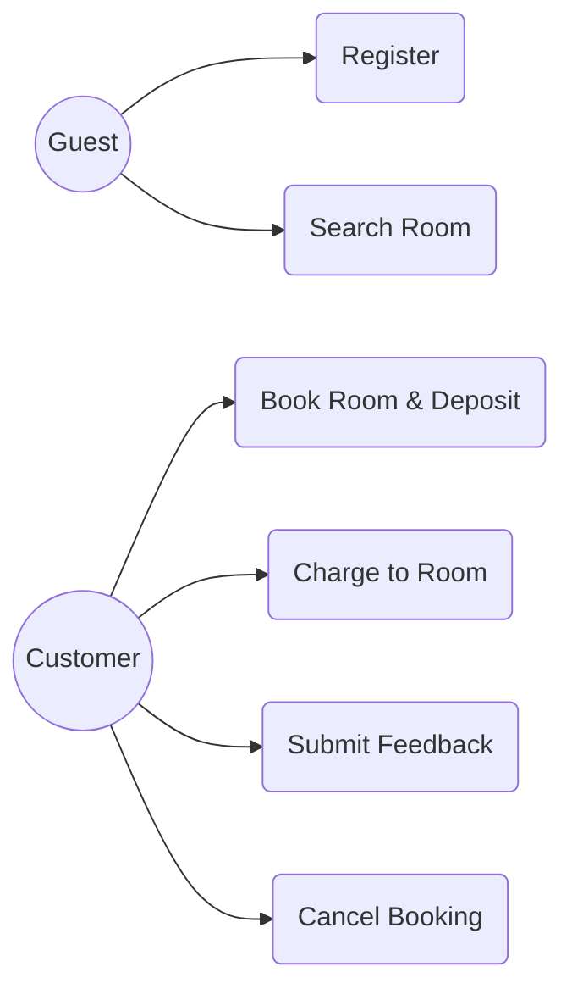
```mermaid
flowchart LR
    G((Guest))
    C((Customer))
    G --> UC1(Register)
    G --> UC2(Search Room)
    C --> UC3(Book Room & Deposit)
    C --> UC4(Charge to Room)
    C --> UC5(Submit Feedback)
    C --> UC6(Cancel Booking)
```

**Receptionist & F&B**
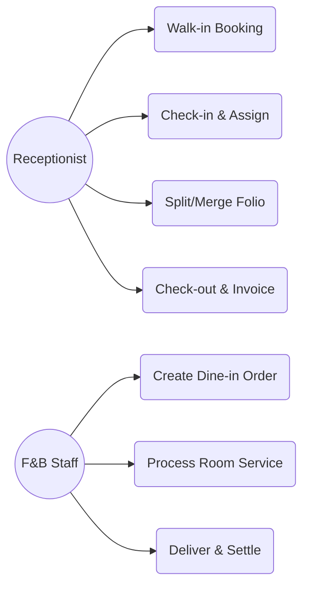
```mermaid
flowchart LR
    R((Receptionist))
    FB((F&B Staff))
    R --> UC7(Walk-in Booking)
    R --> UC8(Check-in & Assign)
    R --> UC9(Split/Merge Folio)
    R --> UC10(Check-out & Invoice)
    FB --> UC11(Create Dine-in Order)
    FB --> UC12(Process Room Service)
    FB --> UC13(Deliver & Settle)
```

**Admin & Manager**
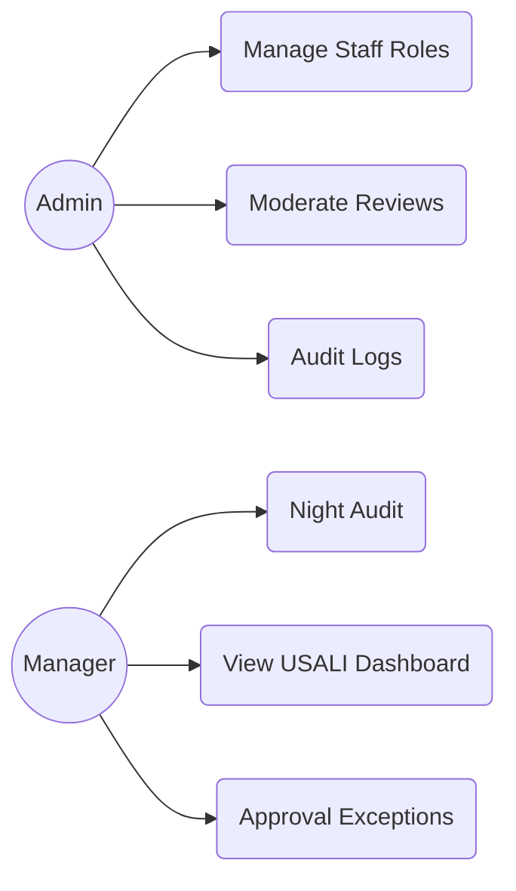
```mermaid
flowchart LR
    A((Admin))
    M((Manager))
    A --> UC14(Manage Staff Roles)
    A --> UC15(Moderate Reviews)
    A --> UC16(Audit Logs)
    M --> UC17(Night Audit)
    M --> UC18(View USALI Dashboard)
    M --> UC19(Approval Exceptions)
```

#### 1.3.3 Detailed Use Cases Master List
# 📑 BẢNG USE CASE TỔNG HỢP — KAWAI RESORT & TOUR HUB

| Field                 | Value                                                    |
| --------------------- | -------------------------------------------------------- |
| **Document ID** | `KAWAI-SRS-UC-MASTER-004`                              |
| **Version**     | 4.0                                                      |
| **Date**        | 2026-07-02                                               |
| **Status**      | Đồng bộ với codebase`05-Development/kawai-backend` |
| **Author**      | Nhóm SWP391 — G2                                       |

---

## CHANGELOG

| Ngày      | Người thực hiện | Nội dung                                                                                                                                                                                               |
| ---------- | ------------------- | ------------------------------------------------------------------------------------------------------------------------------------------------------------------------------------------------------- |
| 2026-07-02 | Antigravity         | Đồng bộ hóa toàn diện tài liệu yêu cầu (Project Spec, SRS, Business Rules, Workflows, RTM) khớp 1:1 với codebase thực tế.                                                                 |
| 2026-06-28 | Nhóm G2            | Rà soát toàn bộ codebase; cập nhật trạng thái triển khai; bổ sung UC29–UC37 cho nghiệp vụ phát sinh (Walk-in, Workflow, Cronjob, Export/Import, Device Auth, Envers, Email, Dependents…) |
| 2026-06-16 | Antigravity         | Chuẩn hóa 60 UC con, 9 Actor, 5 Module                                                                                                                                                                |
| 2026-06-09 | Nhóm G2            | Khởi tạo bảng UC Master V3                                                                                                                                                                           |

---

## KÝ HIỆU TRẠNG THÁI TRIỂN KHAI

| Ký hiệu | Ý nghĩa                                                                                             |
| --------- | ----------------------------------------------------------------------------------------------------- |
| ✅        | **Hoàn thiện** — Luồng E2E chạy được trên production/demo                              |
| ⚠️      | **Một phần** — Backend hoặc UI có nhưng thiếu tích hợp / mock / bug / chưa expose API |
| ❌        | **Chưa làm** — Không có code hoặc chỉ có trong spec/test                                |

**Bằng chứng:** `05-Development/kawai-backend` (Spring Boot 3.2, port 8080)

---

## 👥 DANH SÁCH ACTOR (9 ACTOR)

1. **`Admin`** — Quản trị hệ thống, master data, audit, workflow, cronjob, phân quyền.
2. **`Manager`** — Báo cáo doanh thu, analytics, cấu hình giá/marketing.
3. **`Customer`** — Khách đã đăng ký: đặt phòng/tour, profile, order food, review.
4. **`Guest`** — Khách vãng lai: xem landing, tìm phòng (chưa login).
5. **`Receptionist`** — Check-in/out, walk-in, folio, in-house, night audit.
6. **`Housekeeper`** — Dọn phòng, báo sạch/bẩn *(service có, chưa có UI riêng)*.
7. **`Maintenance Staff`** — Sửa chữa thiết bị phòng *(service có, chưa có UI riêng)*.
8. **`Cashier` / `F&B Staff`** — POS dine-in, quản lý bàn, room service, post-to-room.
9. **`Tour Guide`** — Dashboard tour, điểm danh FaceID, cập nhật hành trình.

---

## 🔴 MOD1: HỆ THỐNG CỐT LÕI, XÁC THỰC & ADMIN CONFIG

| **UC ID** | **Tên Use Case**                                            | **Actor**             | **P** | **TT** |
| --------------- | ------------------------------------------------------------------ | --------------------------- | ----------- | ------------ |
| **UC01**  | **Quản lý Tài khoản & Xác thực**                       |                             |             |              |
| UC01.1          | Đăng ký khách hàng trực tuyến + xác thực OTP email        | `Customer`                | P0          | ✅           |
| UC01.2          | Admin khởi tạo tài khoản nhân viên / khách CRM              | `Admin`                   | P0          | ✅           |
| UC01.3          | Đăng nhập Guest (modal) + OAuth2 Google                         | `Customer`,`Guest`      | P0          | ✅           |
| UC01.4          | Đăng nhập nhân viên Ops (`/ops-login`) + redirect theo role | Toàn bộ nhân viên       | P0          | ✅           |
| UC01.5          | Khóa tài khoản tự động sau n lần đăng nhập sai           | System                      | P1          | ✅           |
| **UC02**  | Đặt lại mật khẩu (email token)                                | Toàn bộ User              | P1          | ✅           |
| **UC03**  | Quản lý hồ sơ cá nhân & avatar                               | `Customer`                | P1          | ✅           |
| UC03.1          | Cập nhật thông tin profile, đổi mật khẩu                    | `Customer`                | P1          | ✅           |
| UC03.2          | Upload avatar (`/api/v1/upload`)                                 | `Customer`                | P2          | ✅           |
| UC03.3          | Quản lý người phụ thuộc (Dependents)                         | `Customer`                | P1          | ✅           |
| **UC04**  | FaceID — Đăng ký & nhận diện khuôn mặt tour                | `Customer`,`Tour Guide` | P0          | ⚠️         |
| UC04.1          | Upload ảnh chân dung / vector khuôn mặt vào profile           | `Customer`                | P0          | ⚠️         |
| UC04.2          | Quét FaceID tại checkpoint tour (Python + face-api.js)           | `Tour Guide`              | P0          | ⚠️         |
| **UC05**  | **Phân quyền & An ninh nội bộ**                          |                             |             |              |
| UC05.1          | RBAC — Gán role & permission (`RolePermissionConstants`)       | `Admin`                   | P0          | ✅           |
| UC05.2          | Activity Audit Log (`AuditLog`, `@LogActivity`)                | `Admin`                   | P1          | ✅           |
| UC05.3          | Envers — Lịch sử thay đổi entity & rollback                   | `Admin`                   | P1          | ✅           |
| UC05.4          | Quản lý thiết bị ủy quyền Ops (`AuthorizedDevice`)         | `Admin`                   | P2          | ⚠️         |
| **UC06**  | **Master Data — Hạng phòng & Phòng vật lý**            |                             |             |              |
| UC06.1          | CRUD`Room_Categories`                                            | `Admin`                   | P1          | ✅           |
| UC06.2          | CRUD`Rooms`                                                      | `Admin`                   | P1          | ✅           |
| **UC07**  | **Master Data — Sơ đồ bàn ăn**                         |                             |             |              |
| UC07.1          | CRUD`Restaurant_Tables`                                          | `Admin`,`Manager`       | P1          | ✅           |
| UC07.2          | Cập nhật trạng thái / sức chứa bàn                          | `Admin`,`F&B Staff`     | P1          | ✅           |
| **UC08**  | **Master Data — Tour & Lịch trình**                       |                             |             |              |
| UC08.1          | CRUD`Tours` + toggle danh mục tour                              | `Admin`,`Manager`       | P1          | ✅           |
| UC08.2          | CRUD`Tour_Schedules` (xem admin, chưa CRUD API đầy đủ)      | `Admin`,`Manager`       | P1          | ⚠️         |
| UC08.3          | Cấu hình`Tour_Itineraries` / điểm dừng                      | `Admin`,`Manager`       | P1          | ⚠️         |
| **UC09**  | **Giá, Marketing & Vận hành Admin**                       |                             |             |              |
| UC09.1          | Cấu hình giá phòng động (`Dynamic_Pricing`)                | `Admin`,`Manager`       | P1          | ⚠️         |
| UC09.2          | CRUD bảng giá ngày (`Daily_Rates` / pricing tab)              | `Admin`                   | P0          | ✅           |
| UC09.3          | Phụ thu trẻ em theo khung tuổi (`Room_Surcharge`)             | `Admin`,`Manager`       | P1          | ❌           |
| UC09.4          | CRUD chiến dịch khuyến mãi (`Promotions`)                    | `Admin`,`Manager`       | P1          | ✅           |
| UC09.5          | CRUD thực đơn F&B (`Menu_Items`, toggle category)             | `Admin`,`Manager`       | P1          | ✅           |
| UC09.6          | Export Master Data CSV                                             | `Admin`                   | P2          | ✅           |
| UC09.7          | Import CSV (Promotions, Menu)                                      | `Admin`                   | P2          | ⚠️         |
| UC09.8          | Workflow phê duyệt nghiệp vụ (promo threshold, SLA)            | `Admin`                   | P1          | ⚠️         |
| UC09.9          | Quản lý Cronjob hệ thống (DynamicJobManager)                   | `Admin`                   | P1          | ✅           |
| UC09.10         | Admin Dashboard KPI (một số chart mock)                          | `Admin`                   | P1          | ⚠️         |

---

## 🔵 MOD2: QUẢN LÝ PHÒNG, LỄ TÂN & BUỒNG PHÒNG

| **UC ID** | **Tên Use Case**                                             | **Actor**               | **P** | **TT** |
| --------------- | ------------------------------------------------------------------- | ----------------------------- | ----------- | ------------ |
| **UC10**  | Tìm kiếm phòng trống & giá theo ngày                          | `Customer`,`Guest`        | P0          | ✅           |
| **UC11**  | Khóa giữ phòng tạm (Cart Lock /`holdExpiresAt` + job cleanup) | `Customer`, System          | P0          | ✅           |
| **UC12**  | **Nghiệp vụ Sảnh (Front Desk)**                            |                               |             |              |
| UC12.1          | Áp dụng mã khuyến mãi / voucher khi đặt phòng               | `Customer`                  | P1          | ✅           |
| UC12.2          | Khai báo hành khách & Primary Contact                            | `Customer`,`Receptionist` | P0          | ✅           |
| UC12.3          | Check-in sảnh (form web, gán phòng vật lý)                     | `Receptionist`              | P0          | ⚠️         |
| UC12.4          | Ủy quyền hạn mức chi tiêu Post-to-Room + PIN                   | `Receptionist`              | P1          | ✅           |
| UC12.5          | Đổi phòng vật lý (`CheckinService.transferRoom`)             | `Receptionist`              | P1          | ⚠️         |
| UC12.6          | Check-out sảnh + consolidated invoice                              | `Receptionist`              | P0          | ✅           |
| UC12.7          | Walk-in Check-in (khách vãng lai + VNPay)                         | `Receptionist`              | P0          | ✅           |
| UC12.8          | Dashboard lễ tân & Room Matrix                                    | `Receptionist`              | P0          | ✅           |
| UC12.9          | Danh sách In-house                                                 | `Receptionist`              | P0          | ✅           |
| **UC13**  | **Buồng phòng & Bảo trì**                                 |                               |             |              |
| UC13.1          | Tự động tạo task dọn phòng khi check-out                      | System                        | P0          | ⚠️         |
| UC13.2          | App nhân viên buồng — cập nhật tiến độ dọn                | `Housekeeper`               | P0          | ❌           |
| UC13.3          | Rush Room — ưu tiên dọn phòng                                  | `Receptionist`              | P1          | ⚠️         |
| UC13.4          | Báo hỏng thiết bị / tạo ticket bảo trì                       | `Housekeeper`               | P1          | ⚠️         |
| UC13.5          | Hoàn thành sửa chữa & mở khóa phòng                          | `Maintenance Staff`         | P1          | ⚠️         |

---

## 🟡 MOD3: F&B, POS & KDS

| **UC ID** | **Tên Use Case**                                     | **Actor**               | **P** | **TT** |
| --------------- | ----------------------------------------------------------- | ----------------------------- | ----------- | ------------ |
| **UC14**  | Đặt giữ bàn nhà hàng + gia hạn hold                  | `Customer`,`Receptionist` | P1          | ✅           |
| **UC15**  | Cấu hình thực đơn & nhãn dị ứng (admin master data) | `Admin`,`Manager`         | P1          | ✅           |
| **UC16**  | Đặt món Room Service / E-Menu online                     | `Customer`                  | P1          | ✅           |
| UC16.1          | Auth modal khi chưa login; redirect giữ giỏ hàng        | `Customer`,`Guest`        | P1          | ✅           |
| UC16.2          | Thanh toán VNPay đơn room service                        | `Customer`                  | P1          | ✅           |
| UC16.3          | Ghi nợ phòng (Charge-to-Room → Folio)                    | `Customer`                  | P1          | ✅           |
| **UC17**  | POS Dine-In — lên đơn tại bàn                         | `Cashier`                   | P0          | ✅           |
| **UC18**  | Tất toán POS / Post-to-Room tại quầy                    | `Cashier`                   | P0          | ✅           |
| UC18.1          | Quản lý bàn & trạng thái bàn POS                      | `Cashier`                   | P0          | ✅           |
| UC18.2          | Quản lý đơn Room Service (staff view)                   | `Cashier`                   | P1          | ✅           |
| UC18.3          | Báo cáo ca làm việc (Shift Report)                      | `Cashier`                   | P2          | ⚠️         |
| **UC19**  | **Màn hình bếp KDS**                               |                               |             |              |
| UC19.1          | Hiển thị vé món chờ (polling/API, không WebSocket)    | `Kitchen Staff`             | P0          | ✅           |
| UC19.2          | Cập nhật trạng thái món PENDING → COOKING → READY    | `Kitchen Staff`             | P0          | ✅           |
| UC19.3          | Báo hoàn thành & thông báo phục vụ                   | `Kitchen Staff`             | P0          | ⚠️         |
| UC19.4          | Khóa món hết hàng (`MenuItem.isAvailable`)            | `Kitchen Staff`             | P0          | ✅           |
| UC19.5          | E-Menu bếp (xem & toggle món)                             | `Kitchen Staff`             | P1          | ✅           |

---
| **UC1** | Quản lý đơn hàng F&B | F&B Staff | P1 | ⬜ |
| **UC1.1** | Xem chi tiết đơn hàng. | F&B Staff | P1 | ⬜ |
| **UC1.2** | Gọi thêm món (Đối với đơn Dine-in) | F&B Staff | P1 | ⬜ |
| **UC1.3** | Cập nhật trạng thái phục vụ | F&B Staff | P1 | ⬜ |
| **UC1.4** | In hóa đơn | F&B Staff | P1 | ⬜ |
| **UC2** | Xác nhận thanh toán đơn hàng | F&B Staff | P1 | ⬜ |
| **UC3** | Quản lý bàn ăn | F&B Staff | P1 | ⬜ |
| **UC3.1** | Giữ bàn (Gia hạn thời gian) | F&B Staff | P1 | ⬜ |
| **UC3.2** | Đặt bàn trước cho khách đang lưu trú | F&B Staff | P1 | ⬜ |
| **UC3.3** | Tạo đơn ăn tại nhà hàng (Dine-in) cho khách vãng lai | F&B Staff | P1 | ⬜ |
| **UC3.4** | Checkin bàn cho khách đã đặt trước | F&B Staff | P1 | ⬜ |
| **UC4** | Quản lý đơn Room Service | F&B Staff | P1 | ⬜ |
| **UC4.1** | Tạo đơn Room-Service | F&B Staff | P1 | ⬜ |
| **UC5** | Báo cáo ca làm việc | F&B Staff | P1 | ⬜ |
| **UC6** | Cập nhật trạng thái từng món ăn (KOT) | Kitchen Staff | P1 | ⬜ |
| **UC7** | Quản lý trạng thái món ăn (còn/ hết) | Kitchen Staff | P1 | ⬜ |
| **UC8** | Đặt bàn trực tuyến | Customer | P1 | ⬜ |
| **UC9** | Đặt món trực tuyến | Customer | P1 | ⬜ |
| **UC10** | Hủy đơn hàng | F&B Staff + Customer | P1 | ⬜ |

## 🟢 MOD4: TOUR, ADD-ONS & ĐÁNH GIÁ

| **UC ID** | **Tên Use Case**                                       | **Actor**               | **P** | **TT** |
| --------------- | ------------------------------------------------------------- | ----------------------------- | ----------- | ------------ |
| **UC20**  | Tìm tour + tích hợp thời tiết OpenWeather                | `Customer`,`Guest`        | P1          | ✅           |
| **UC21**  | Đặt vé tour (web + post-to-room / VNPay)                   | `Customer`,`Receptionist` | P0          | ✅           |
| UC21.1    | Khai báo thông tin người lớn đi kèm (Companions) nhóm >=2  | `Customer`                  | P0          | ✅           |
| UC21.2    | Áp dụng luồng bảo hiểm bắt buộc và sinh mã Policy Number  | `Customer`, System          | P0          | ✅           |
| UC21.3    | Giao diện trình chiếu và phân trang danh sách tour động    | `Customer`,`Guest`          | P1          | ✅           |
| **UC22**  | **Điều hành Tour**                                   |                               |             |              |
| UC22.1          | Đồng bộ khách combo phòng → tour booking                | System                        | P0          | ❌           |
| UC22.2          | Phân công HDV / nhân sự tour (`TourStaffAssignment`)    | `Admin`,`Manager`         | P1          | ⚠️         |
| UC22.3          | GPS real-time theo dõi xe tour                               | `Tour Guide`                | P2          | ❌           |
| UC22.4          | Cập nhật tiến độ hành trình (`Run_Itinerary_Status`) | `Tour Guide`                | P1          | ⚠️         |
| UC22.5          | Điểm danh AI FaceID tại checkpoint                         | `Tour Guide`                | P1          | ⚠️         |
| UC22.6          | Điểm danh thủ công fallback                               | `Tour Guide`                | P1          | ✅           |
| UC22.7          | Tour Guide Dashboard & trang tour theo loại                  | `Tour Guide`                | P1          | ✅           |
| **UC23**  | **Add-ons dịch vụ gia tăng**                         |                               |             |              |
| UC23.1          | CRUD catalog dịch vụ add-on (Spa, đưa đón…)            | `Admin`,`Manager`         | P1          | ❌           |
| UC23.2          | Đặt add-on & cấu hình JSON đặc biệt                    | `Customer`,`Receptionist` | P0          | ❌           |
| UC23.3          | Gói combo marketing (`MarketingService.createCombo`)       | `Admin`                     | P2          | ⚠️         |
| **UC24**  | Gửi đánh giá sao & feedback (phòng / tour)               | `Customer`                  | P2          | ⚠️         |
| **UC25**  | Kiểm duyệt review (admin)                                   | `Admin`                     | P2          | ✅           |
| **UC** | ID... | `Customer` | P1 | ⬜ |

---

## 🟣 MOD5: FOLIO, TÀI CHÍNH & BÁO CÁO

| **UC ID** | **Tên Use Case**                                    | **Actor**               | **P** | **TT** |
| --------------- | ---------------------------------------------------------- | ----------------------------- | ----------- | ------------ |
| **UC26**  | **Folio Aggregation**                                |                               |             |              |
| UC26.1          | Tích lũy chi phí F&B/Tour về ví phòng                | System                        | P0          | ✅           |
| UC26.2          | Theo dõi dư nợ folio real-time                          | `Receptionist`,`Customer` | P0          | ✅           |
| UC26.3          | Lịch sử thanh toán đa đợt (`Payment_Transactions`) | System                        | P0          | ✅           |
| UC26.4          | Tách bill / split folio item                              | `Receptionist`              | P1          | ✅           |
| UC26.5          | Hóa đơn tổng hợp quyết toán (Consolidated Invoice)  | `Receptionist`              | P0          | ✅           |
| UC26.6          | Áp dụng hạng thành viên (Membership Tier) trên folio | System                        | P2          | ✅           |
| **UC27**  | **Night Audit & Thanh toán**                        |                               |             |              |
| UC27.1          | Night Audit — post room charge hàng đêm                | System                        | P0          | ⚠️         |
| UC27.2          | UI Night Audit lễ tân                                    | `Receptionist`              | P0          | ⚠️         |
| UC27.3          | Thanh toán VNPay (booking, food, folio, walk-in)          | `Customer`,`Receptionist` | P0          | ✅           |
| UC27.4          | Check-out & thu tiền cuối cùng tại sảnh               | `Receptionist`              | P0          | ✅           |
| UC27.5          | Gửi hóa đơn PDF qua email                              | System                        | P1          | ✅           |
| **UC28**  | **Dashboard Manager & Báo cáo**                    |                               |             |              |
| UC28.1          | Biểu đồ doanh thu lũy kế                              | `Manager`                   | P1          | ✅           |
| UC28.2          | Occupancy & khách in-house                                | `Manager`                   | P1          | ✅           |
| UC28.3          | Analytics tour / F&B / stay                                | `Manager`                   | P1          | ⚠️         |
| UC28.4          | Export báo cáo PDF/Excel                                 | `Manager`                   | P2          | ⚠️         |
| UC28.5          | Báo cáo USALI chuẩn quốc tế                           | `Manager`                   | P2          | ❌           |

---

## 🆕 MOD6: HỆ THỐNG & TÍCH HỢP (Phát sinh sau SRS gốc)

| **UC ID** | **Tên Use Case**                         | **Actor**        | **P** | **TT** |
| --------------- | ----------------------------------------------- | ---------------------- | ----------- | ------------ |
| **UC29**  | Hệ thống email thông báo đa sự kiện      | System                 | P0          | ✅           |
| UC29.1          | OTP đăng ký, reset password                  | System                 | P0          | ✅           |
| UC29.2          | Xác nhận booking / tour / đặt bàn / hủy   | System                 | P0          | ✅           |
| UC29.3          | Hóa đơn, gia hạn giữ bàn, SLA workflow    | System                 | P1          | ✅           |
| UC29.4          | Preview template email (dev)                    | `Admin`              | P3          | ✅           |
| **UC30**  | Scheduled Jobs tự động                       | System                 | P0          | ✅           |
| UC30.1          | `booking_cleanup` — giải phóng hold phòng | System                 | P0          | ✅           |
| UC30.2          | `reservation_cleanup` / `table_cleanup`     | System                 | P1          | ✅           |
| UC30.3          | `audit_cleanup` / `workflow_processor`      | System                 | P1          | ✅           |
| **UC31**  | Landing pages & trải nghiệm khách            | `Guest`,`Customer` | P1          | ✅           |
| UC31.1          | Trang Living / Wellbeing / Dining / Experiences | `Guest`              | P2          | ✅           |
| UC31.2          | Lịch sử booking & quản lý booking online    | `Customer`           | P1          | ✅           |

---

## 📊 THỐNG KÊ PHỦ SÓNG (2026-06-28)

| Module          | Tổng UC con  | ✅           | ⚠️         | ❌          |
| --------------- | ------------- | ------------ | ------------ | ----------- |
| MOD1            | 35            | 24           | 9            | 2           |
| MOD2            | 18            | 11           | 6            | 1           |
| MOD3            | 16            | 13           | 3            | 0           |
| MOD4            | 17            | 7            | 6            | 4           |
| MOD5            | 16            | 12           | 3            | 1           |
| MOD6            | 9             | 9            | 0            | 0           |
| **TỔNG** | **111** | **76** | **27** | **8** |

**Tỷ lệ có code:** ~93% (✅ + ⚠️) | **Hoàn thiện E2E:** ~68% (✅)

---

## 📋 MA TRẬN PHÂN CÔNG (Tham chiếu)

| Module | UC chính  | Phụ trách gốc | Ghi chú triển khai                                        |
| ------ | ---------- | ---------------- | ----------------------------------------------------------- |
| MOD1   | UC01–UC09 | SV1              | Master data + admin mở rộng (export/import/workflow/cron) |
| MOD2   | UC10–UC13 | SV2              | Walk-in, folio mạnh; housekeeping UI thiếu                |
| MOD3   | UC14–UC19 | SV3              | POS/KDS hoàn chỉnh; shift report mock                     |
| MOD4   | UC20–UC25 | SV4              | Tour + FaceID demo; add-ons chưa làm                      |
| MOD5   | UC26–UC28 | SV5              | VNPay đa luồng; night audit cần sửa bug status          |
| MOD6   | UC29–UC31 | Chung            | Email + jobs + landing — phát sinh sau SRS                |

---

## 🔗 TÀI LIỆU LIÊN QUAN

- Chi tiết luồng & API: `UC_DETAIL_SPEC.md` (v4.0)
- Đặc tả dự án: `Project_Specification.md`
- Traceability: `TRACEABILITY_MATRIX.md`
- Test spec: `06-Testing/MASTER_TDD_SPEC.md`


### 1.4 System Functionalities

### 1.4.1 Screens Flow

#### Figure 1: Guest & Customer Screen Flow
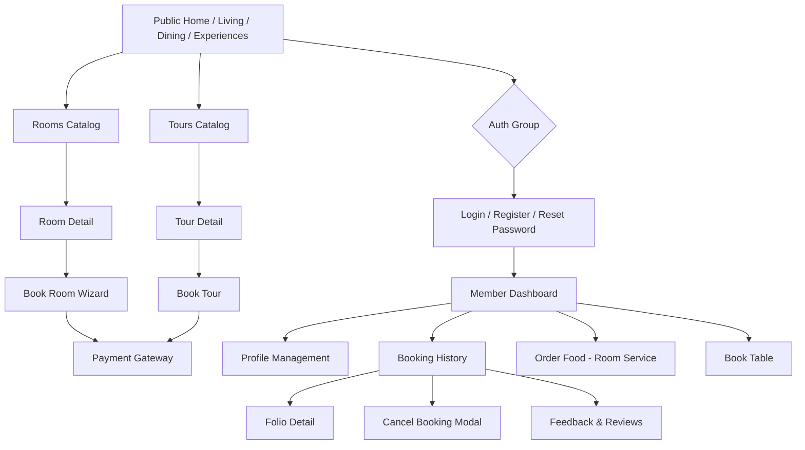
```mermaid
flowchart TD
    Home[Public Home / Living / Dining / Experiences] --> Auth{Auth Group}
    Auth --> Login[Login / Register / Reset Password]
    
    Home --> Rooms[Rooms Catalog]
    Rooms --> RoomDetail[Room Detail]
    RoomDetail --> BookRoom[Book Room Wizard]
    BookRoom --> Payment[Payment Gateway]
    
    Home --> Tours[Tours Catalog]
    Tours --> TourDetail[Tour Detail]
    TourDetail --> BookTour[Book Tour]
    BookTour --> Payment
    
    Login --> Dash[Member Dashboard]
    Dash --> Profile[Profile Management]
    Dash --> History[Booking History]
    History --> Folio[Folio Detail]
    History --> Cancel[Cancel Booking Modal]
    History --> Feedback[Feedback & Reviews]
    Dash --> RoomService[Order Food - Room Service]
    Dash --> Table[Book Table]
```

#### Figure 2: Receptionist Screen Flow
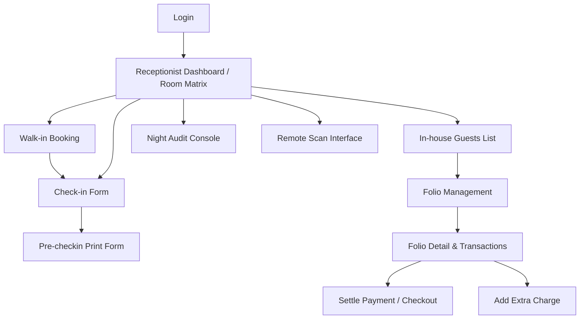
```mermaid
flowchart TD
    Login[Login] --> Dash[Receptionist Dashboard / Room Matrix]
    Dash --> WalkIn[Walk-in Booking]
    WalkIn --> CheckIn[Check-in Form]
    Dash --> CheckIn
    CheckIn --> PrePrint[Pre-checkin Print Form]
    
    Dash --> InHouse[In-house Guests List]
    InHouse --> Folio[Folio Management]
    Folio --> FolioDetail[Folio Detail & Transactions]
    FolioDetail --> Settle[Settle Payment / Checkout]
    FolioDetail --> AddCharge[Add Extra Charge]
    
    Dash --> NightAudit[Night Audit Console]
    Dash --> Scan[Remote Scan Interface]
```

#### Figure 3: F&B Staff & Kitchen Flow
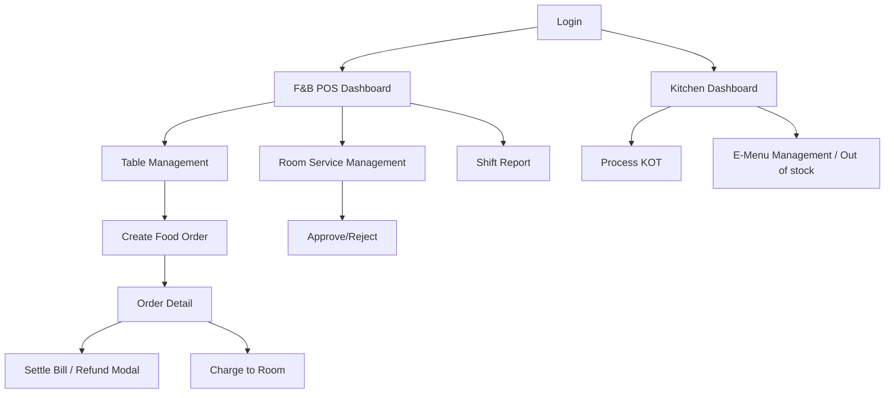
```mermaid
flowchart TD
    Login --> POS[F&B POS Dashboard]
    POS --> Table[Table Management]
    Table --> CreateOrder[Create Food Order]
    CreateOrder --> OrderDetail[Order Detail]
    OrderDetail --> Settle[Settle Bill / Refund Modal]
    OrderDetail --> ChargeRoom[Charge to Room]
    
    POS --> RoomService[Room Service Management]
    RoomService --> Approve[Approve/Reject]
    
    POS --> Shift[Shift Report]
    
    Login --> Kitchen[Kitchen Dashboard]
    Kitchen --> KOT[Process KOT]
    Kitchen --> EMenu[E-Menu Management / Out of stock]
```

#### Figure 4: Manager Screen Flow
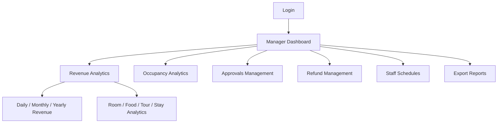
```mermaid
flowchart TD
    Login --> Dash[Manager Dashboard]
    Dash --> Analytics[Revenue Analytics]
    Analytics --> Sub1[Daily / Monthly / Yearly Revenue]
    Analytics --> Sub2[Room / Food / Tour / Stay Analytics]
    Dash --> Occupancy[Occupancy Analytics]
    
    Dash --> Approvals[Approvals Management]
    Dash --> Refund[Refund Management]
    Dash --> Schedules[Staff Schedules]
    Dash --> Export[Export Reports]
```

#### Figure 5: Admin Screen Flow
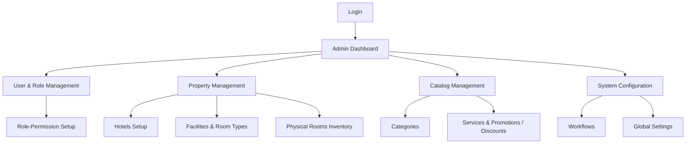
```mermaid
flowchart TD
    Login --> Dash[Admin Dashboard]
    Dash --> UserMgt[User & Role Management]
    UserMgt --> Roles[Role-Permission Setup]
    
    Dash --> Property[Property Management]
    Property --> Hotels[Hotels Setup]
    Property --> Facilities[Facilities & Room Types]
    Property --> Rooms[Physical Rooms Inventory]
    
    Dash --> Catalog[Catalog Management]
    Catalog --> Categories[Categories]
    Catalog --> Services[Services & Promotions / Discounts]
    
    Dash --> SysConfig[System Configuration]
    SysConfig --> Workflows[Workflows]
    SysConfig --> Settings[Global Settings]
```

#### Figure 6: Housekeeping & Tour Guide Flow
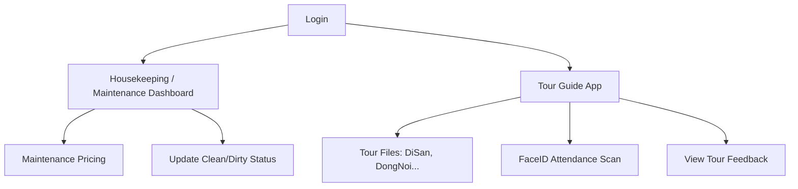
```mermaid
flowchart TD
    Login --> HKDash[Housekeeping / Maintenance Dashboard]
    HKDash --> Pricing[Maintenance Pricing]
    HKDash --> Status[Update Clean/Dirty Status]
    
    Login --> TourDash[Tour Guide App]
    TourDash --> TourFiles[Tour Files: DiSan, DongNoi...]
    TourDash --> FaceID[FaceID Attendance Scan]
    TourDash --> Feedback[View Tour Feedback]
```

#### 1.4.2 Screen Authorization
| Screen | Guest | Customer | Receptionist | F&B Staff | Housekeeping / Maintainer | Admin / Manager |
|---|---|---|---|---|---|---|
| Single Login Portal | X | X | X | X | X | X |
| Public Home Page | X | X | | | | |
| Member Dashboard | | X | | | | |
| Room Matrix Dashboard | | | X | | | |
| Check-in Processing Form | | | X | | | |
| Restaurant POS Terminal | | | | X | | |
| Kitchen Status Dashboard| | | | X | | |
| Housekeeping Task Grid | | | | | X | |
| Maintenance Request Queue| | | | | X | |
| USALI Financial Analytics| | | | | | X |
| Config & Audit Log Panel | | | | | | X |


### 1.4.3 Non-UI Functions

| # | Feature | System Function | Description |
|---|---|---|---|
| 1 | Authentication & Security | `Password_Encryption_Filter` | Extracts and encrypts raw user passwords using the BCrypt hashing algorithm before performing data matching in the Accounts table. |
| 2 | Authentication & Security | `Role_Based_Routing_Engine` | A Spring Security filter that analyzes the `role_name` of the authenticated Token to automatically configure and trigger URL redirection for each Actor. |
| 3 | Room Booking | `Pending_Booking_Auto_Cancellation` | Runs a background Task Scheduler (Cronjob) every 15 minutes to automatically scan and cancel room reservations (status = 'Cancelled') if the 30% deposit is not completed. |
| 4 | Front-Desk Operations | `Dependent_Account_Auto_Generation` | Triggered when the Receptionist upgrades a dependent's account, automatically executing parallel data insertion into both the Accounts and Customers tables. |
| 5 | Housekeeping | `Housekeeping_Task_Trigger` | A database Listener/Service that detects when a room booking status changes to Checked_Out and immediately initializes a new cleaning task entry. |
| 6 | F&B Billing | `Credit_Limit_Realtime_Validator` | A Constraint Validator that executes in the background when a guest orders a service, aggregating the current outstanding folio balance to ensure it does not exceed the room's Credit_Limit. |
| 7 | Tour Operations | `AI_Face_Vector_Matching_Service` | A background Python AI service (FastAPI) that receives the camera video stream, extracts facial feature vectors, and compares them against the `encodings.pickle` template file to verify identity (>85% similarity). |
| 8 | Financial Accounting | `USALI_Revenue_Decomposer` | Automatically decomposes the gross revenue from finalized invoices, calculating and allocating financial data into three distinct departmental revenue categories (Rooms, F&B, Tours). |
| 9 | Marketing | `Voucher_Validity_Checker` | Validates promotional codes against predefined constraints (expiration date, global usage limit, and minimum order amount) before applying discounts. |
| 10 | Security Auditing | `AOP_Data_Interception_Logger` | Utilizes Spring AOP (Aspect-Oriented Programming) to transparently intercept modifications to financial tables, capturing old/new values, staff ID, and system logs into the `Audit_Logs` table. |


### 1.5 Entity Relationship Diagram
*(Mô tả chi tiết cấu trúc bảng dữ liệu, khóa ngoại và ràng buộc)*
# CLASS DIAGRAM — KAWAI RETREAT RESORT & HUB
# UML 2.5.1 Standard

**Project:** SWP391 — Group 2 — SE2023-NET  
**Version:** 1.0 | **Date:** 2026-06-29  
**Standard:** UML 2.5.1 (OMG Unified Modeling Language Specification)  
**Tool:** Mermaid Class Diagram (PlantUML compatible)

---

## Mục lục

1. [UML Relationship Legend](#1-uml-relationship-legend)
2. [Domain Overview — Core Entities](#2-domain-overview--core-entities)
3. [Module 1 — Authentication & Identity](#3-module-1--authentication--identity)
4. [Module 2 — Booking & Front Desk](#4-module-2--booking--front-desk)
5. [Module 3 — F&B POS & KDS](#5-module-3--fb-pos--kds)
6. [Module 4 — Tour & Review](#6-module-4--tour--review)
7. [Module 5 — Folio & Finance](#7-module-5--folio--finance)
8. [Module 6 — System & Infrastructure](#8-module-6--system--infrastructure)
9. [Full System Class Diagram](#9-full-system-class-diagram)
10. [Relationship Summary Table](#10-relationship-summary-table)

---

## 1. UML Relationship Legend

| Symbol (Mermaid) | UML 2.5.1 Name | Description |
|---|---|---|
| `<\|--` | **Generalization** | Subclass inherits from superclass (IS-A) |
| `..\|>` | **Realization / Implementation** | Class implements an interface |
| `*--` | **Composition** | Strong ownership; child dies with parent |
| `o--` | **Aggregation** | Weak ownership; child can exist independently |
| `-->` | **Association** | Directed relationship between classes |
| `..>` | **Dependency** | Uses relationship; change in target may affect source |
| `--` | **Association (undirected)** | Bidirectional relationship |
| `<\|..` | **Specialization** (reversed Generalization) | Extension of abstract concept |

> **UML 2.5.1 Multiplicity Notation:**
> - `1` — Exactly one
> - `0..1` — Zero or one (optional)
> - `1..*` — One or many
> - `0..*` or `*` — Zero or many

---

## 2. Domain Overview — Core Entities


```mermaid
classDiagram
    direction TB

    %% ─────────────────────────────────────────────
    %% CORE IDENTITY
    %% ─────────────────────────────────────────────
    class Account {
        <<entity>>
        +Long id
        +String username
        +String email
        +String passwordHash
        +Boolean isActive
        +Integer failedAttempts
        +LocalDateTime lockoutTime
        +LocalDateTime createdAt
        +login() Boolean
        +lock() void
        +resetPassword(token: String) void
    }

    class Role {
        <<entity>>
        +Long id
        +String roleName
        +String description
    }

    class Customer {
        <<entity>>
        +Long id
        +String fullName
        +String phone
        +String emailEncrypted
        +String cccdEncrypted
        +LocalDate dateOfBirth
        +String gender
        +String nationality
        +String faceVectorData
        +String membershipTier
        +anonymize() void
    }

    class Employee {
        <<entity>>
        +Long id
        +String fullName
        +String phone
        +String department
        +String position
        +Boolean isActive
    }

    class Dependent {
        <<entity>>
        +Long id
        +String fullName
        +LocalDate dateOfBirth
        +String relationship
        +String cccdEncrypted
    }

    %% ─────────────────────────────────────────────
    %% ROOM DOMAIN
    %% ─────────────────────────────────────────────
    class Room {
        <<entity>>
        +Long id
        +String roomNumber
        +Integer floor
        +RoomStatus roomStatus
        +Boolean isActive
        +changeStatus(status: RoomStatus) void
    }

    class RoomCategory {
        <<entity>>
        +Long id
        +String categoryName
        +Integer maxOccupancy
        +BigDecimal basePrice
        +String amenities
        +String imageUrl
    }

    %% ─────────────────────────────────────────────
    %% BOOKING DOMAIN
    %% ─────────────────────────────────────────────
    class Booking {
        <<entity>>
        +Long id
        +String bookingType
        +BookingStatus status
        +LocalDate checkInDate
        +LocalDate checkOutDate
        +BigDecimal totalAmount
        +BigDecimal depositAmount
        +LocalDateTime holdExpiresAt
        +String promotionCode
        +LocalDateTime createdAt
        +cancel() void
        +confirm() void
    }

    class RoomBooking {
        <<entity>>
        +Long id
        +Integer totalRooms
        +BigDecimal creditLimit
    }

    class RoomBookingDetail {
        <<entity>>
        +Long id
        +DetailStatus detailStatus
        +Boolean isChargeToRoomAllowed
        +BigDecimal subCreditLimit
        +String personalPinHash
        +LocalDateTime checkinAt
        +LocalDateTime checkoutAt
        +verifyPin(raw: String) Boolean
    }

    %% ─────────────────────────────────────────────
    %% RELATIONSHIPS — CORE
    %% ─────────────────────────────────────────────

    Account "1" --> "1" Role : has
    Account "1" o-- "0..1" Customer : linked to
    Account "1" o-- "0..1" Employee : linked to
    Customer "1" *-- "0..*" Dependent : manages

    RoomCategory "1" *-- "1..*" Room : contains
    Room "1" --> "1" RoomStatus : has status

    Customer "1" --> "0..*" Booking : places
    Booking "1" *-- "0..*" RoomBooking : contains
    RoomBooking "1" *-- "1..*" RoomBookingDetail : contains
    RoomBookingDetail "0..*" --> "1" Room : assigned to
```

---

## 3. Module 1 — Authentication & Identity

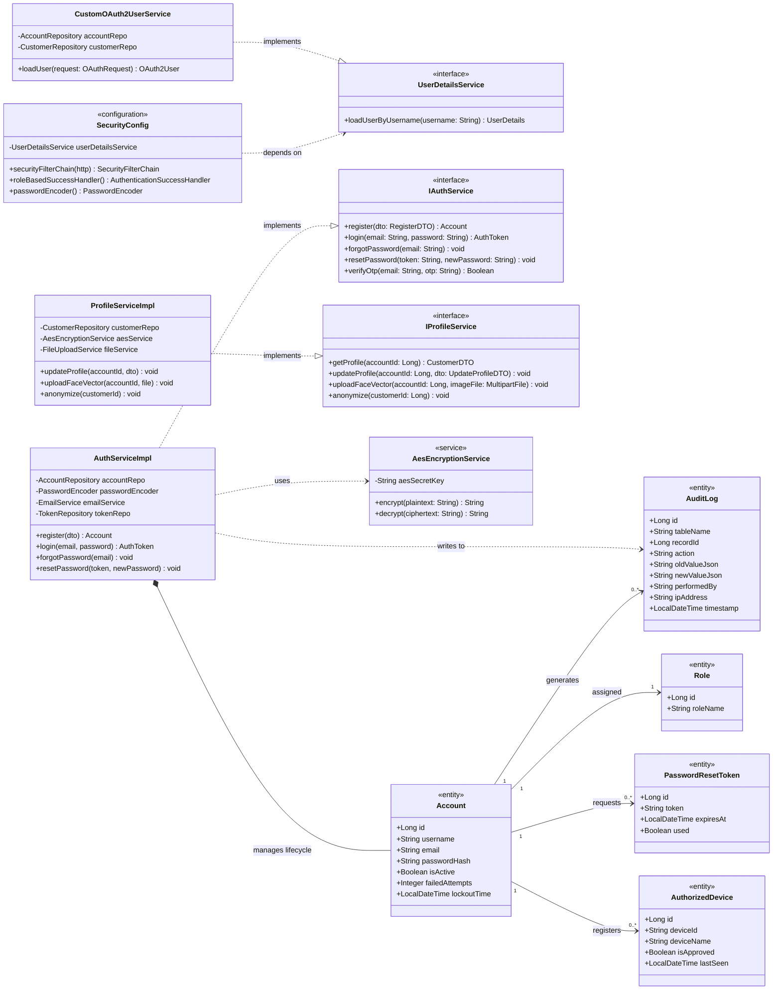
```mermaid
classDiagram
    direction LR

    %% ─────────────────────────────────────────────
    %% INTERFACES
    %% ─────────────────────────────────────────────
    class UserDetailsService {
        <<interface>>
        +loadUserByUsername(username: String) UserDetails
    }

    class IAuthService {
        <<interface>>
        +register(dto: RegisterDTO) Account
        +login(email: String, password: String) AuthToken
        +forgotPassword(email: String) void
        +resetPassword(token: String, newPassword: String) void
        +verifyOtp(email: String, otp: String) Boolean
    }

    class IProfileService {
        <<interface>>
        +getProfile(accountId: Long) CustomerDTO
        +updateProfile(accountId: Long, dto: UpdateProfileDTO) void
        +uploadFaceVector(accountId: Long, imageFile: MultipartFile) void
        +anonymize(customerId: Long) void
    }

    %% ─────────────────────────────────────────────
    %% IMPLEMENTATIONS
    %% ─────────────────────────────────────────────
    class AuthServiceImpl {
        -AccountRepository accountRepo
        -PasswordEncoder passwordEncoder
        -EmailService emailService
        -TokenRepository tokenRepo
        +register(dto) Account
        +login(email, password) AuthToken
        +forgotPassword(email) void
        +resetPassword(token, newPassword) void
    }

    class ProfileServiceImpl {
        -CustomerRepository customerRepo
        -AesEncryptionService aesService
        -FileUploadService fileService
        +updateProfile(accountId, dto) void
        +uploadFaceVector(accountId, file) void
        +anonymize(customerId) void
    }

    class CustomOAuth2UserService {
        -AccountRepository accountRepo
        -CustomerRepository customerRepo
        +loadUser(request: OAuthRequest) OAuth2User
    }

    %% ─────────────────────────────────────────────
    %% SECURITY COMPONENTS
    %% ─────────────────────────────────────────────
    class SecurityConfig {
        <<configuration>>
        -UserDetailsService userDetailsService
        +securityFilterChain(http) SecurityFilterChain
        +roleBasedSuccessHandler() AuthenticationSuccessHandler
        +passwordEncoder() PasswordEncoder
    }

    class AesEncryptionService {
        <<service>>
        -String aesSecretKey
        +encrypt(plaintext: String) String
        +decrypt(ciphertext: String) String
    }

    class AuthorizedDevice {
        <<entity>>
        +Long id
        +String deviceId
        +String deviceName
        +Boolean isApproved
        +LocalDateTime lastSeen
    }

    %% ─────────────────────────────────────────────
    %% ENTITIES
    %% ─────────────────────────────────────────────
    class Account {
        <<entity>>
        +Long id
        +String username
        +String email
        +String passwordHash
        +Boolean isActive
        +Integer failedAttempts
        +LocalDateTime lockoutTime
    }

    class Role {
        <<entity>>
        +Long id
        +String roleName
    }

    class PasswordResetToken {
        <<entity>>
        +Long id
        +String token
        +LocalDateTime expiresAt
        +Boolean used
    }

    class AuditLog {
        <<entity>>
        +Long id
        +String tableName
        +Long recordId
        +String action
        +String oldValueJson
        +String newValueJson
        +String performedBy
        +String ipAddress
        +LocalDateTime timestamp
    }

    %% ─────────────────────────────────────────────
    %% RELATIONSHIPS
    %% ─────────────────────────────────────────────

    %% Realization / Implementation
    AuthServiceImpl ..|> IAuthService : implements
    ProfileServiceImpl ..|> IProfileService : implements
    CustomOAuth2UserService ..|> UserDetailsService : implements

    %% Dependency
    AuthServiceImpl ..> AesEncryptionService : uses
    AuthServiceImpl ..> AuditLog : writes to
    SecurityConfig ..> UserDetailsService : depends on

    %% Association
    Account "1" --> "1" Role : assigned
    Account "1" --> "0..*" PasswordResetToken : requests
    Account "1" --> "0..*" AuthorizedDevice : registers
    Account "1" --> "0..*" AuditLog : generates

    %% Composition
    AuthServiceImpl *-- Account : manages lifecycle
```

---

## 4. Module 2 — Booking & Front Desk

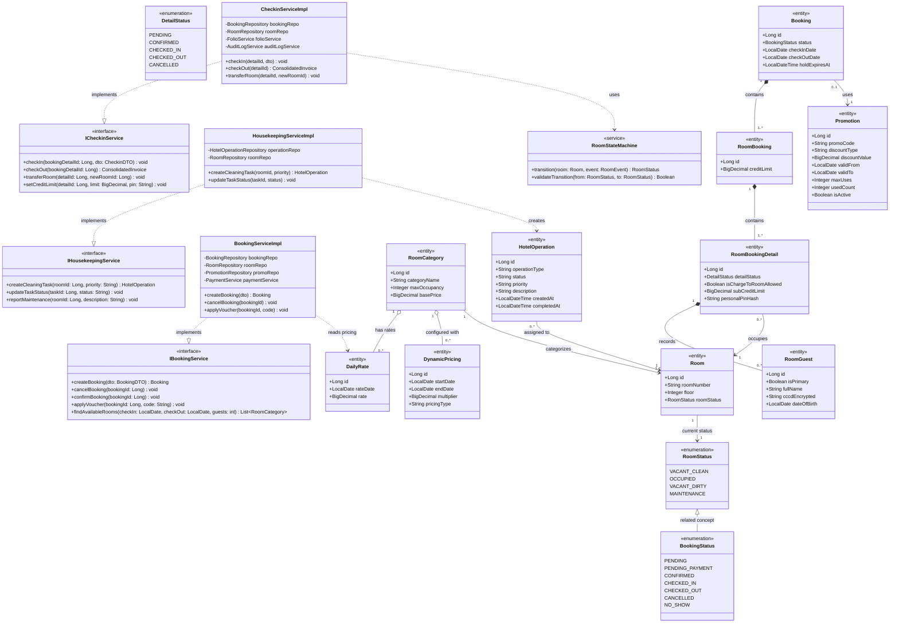
```mermaid
classDiagram
    direction TB

    %% ─────────────────────────────────────────────
    %% ENUMERATIONS
    %% ─────────────────────────────────────────────
    class RoomStatus {
        <<enumeration>>
        VACANT_CLEAN
        OCCUPIED
        VACANT_DIRTY
        MAINTENANCE
    }

    class BookingStatus {
        <<enumeration>>
        PENDING
        PENDING_PAYMENT
        CONFIRMED
        CHECKED_IN
        CHECKED_OUT
        CANCELLED
        NO_SHOW
    }

    class DetailStatus {
        <<enumeration>>
        PENDING
        CONFIRMED
        CHECKED_IN
        CHECKED_OUT
        CANCELLED
    }

    %% ─────────────────────────────────────────────
    %% INTERFACES
    %% ─────────────────────────────────────────────
    class IBookingService {
        <<interface>>
        +createBooking(dto: BookingDTO) Booking
        +cancelBooking(bookingId: Long) void
        +confirmBooking(bookingId: Long) void
        +applyVoucher(bookingId: Long, code: String) void
        +findAvailableRooms(checkIn: LocalDate, checkOut: LocalDate, guests: int) List~RoomCategory~
    }

    class ICheckinService {
        <<interface>>
        +checkIn(bookingDetailId: Long, dto: CheckinDTO) void
        +checkOut(bookingDetailId: Long) ConsolidatedInvoice
        +transferRoom(detailId: Long, newRoomId: Long) void
        +setCreditLimit(detailId: Long, limit: BigDecimal, pin: String) void
    }

    class IHousekeepingService {
        <<interface>>
        +createCleaningTask(roomId: Long, priority: String) HotelOperation
        +updateTaskStatus(taskId: Long, status: String) void
        +reportMaintenance(roomId: Long, description: String) void
    }

    %% ─────────────────────────────────────────────
    %% IMPLEMENTATIONS
    %% ─────────────────────────────────────────────
    class BookingServiceImpl {
        -BookingRepository bookingRepo
        -RoomRepository roomRepo
        -PromotionRepository promoRepo
        -PaymentService paymentService
        +createBooking(dto) Booking
        +cancelBooking(bookingId) void
        +applyVoucher(bookingId, code) void
    }

    class CheckinServiceImpl {
        -BookingRepository bookingRepo
        -RoomRepository roomRepo
        -FolioService folioService
        -AuditLogService auditLogService
        +checkIn(detailId, dto) void
        +checkOut(detailId) ConsolidatedInvoice
        +transferRoom(detailId, newRoomId) void
    }

    class HousekeepingServiceImpl {
        -HotelOperationRepository operationRepo
        -RoomRepository roomRepo
        +createCleaningTask(roomId, priority) HotelOperation
        +updateTaskStatus(taskId, status) void
    }

    class RoomStateMachine {
        <<service>>
        +transition(room: Room, event: RoomEvent) RoomStatus
        +validateTransition(from: RoomStatus, to: RoomStatus) Boolean
    }

    %% ─────────────────────────────────────────────
    %% ENTITIES
    %% ─────────────────────────────────────────────
    class Room {
        <<entity>>
        +Long id
        +String roomNumber
        +Integer floor
        +RoomStatus roomStatus
    }

    class RoomCategory {
        <<entity>>
        +Long id
        +String categoryName
        +Integer maxOccupancy
        +BigDecimal basePrice
    }

    class Booking {
        <<entity>>
        +Long id
        +BookingStatus status
        +LocalDate checkInDate
        +LocalDate checkOutDate
        +LocalDateTime holdExpiresAt
    }

    class RoomBooking {
        <<entity>>
        +Long id
        +BigDecimal creditLimit
    }

    class RoomBookingDetail {
        <<entity>>
        +Long id
        +DetailStatus detailStatus
        +Boolean isChargeToRoomAllowed
        +BigDecimal subCreditLimit
        +String personalPinHash
    }

    class RoomGuest {
        <<entity>>
        +Long id
        +Boolean isPrimary
        +String fullName
        +String cccdEncrypted
        +LocalDate dateOfBirth
    }

    class HotelOperation {
        <<entity>>
        +Long id
        +String operationType
        +String status
        +String priority
        +String description
        +LocalDateTime createdAt
        +LocalDateTime completedAt
    }

    class DailyRate {
        <<entity>>
        +Long id
        +LocalDate rateDate
        +BigDecimal rate
    }

    class DynamicPricing {
        <<entity>>
        +Long id
        +LocalDate startDate
        +LocalDate endDate
        +BigDecimal multiplier
        +String pricingType
    }

    class Promotion {
        <<entity>>
        +Long id
        +String promoCode
        +String discountType
        +BigDecimal discountValue
        +LocalDate validFrom
        +LocalDate validTo
        +Integer maxUses
        +Integer usedCount
        +Boolean isActive
    }

    %% ─────────────────────────────────────────────
    %% RELATIONSHIPS
    %% ─────────────────────────────────────────────

    %% Realization
    BookingServiceImpl ..|> IBookingService : implements
    CheckinServiceImpl ..|> ICheckinService : implements
    HousekeepingServiceImpl ..|> IHousekeepingService : implements

    %% Generalization / Specialization
    RoomStatus <|-- BookingStatus : related concept

    %% Composition
    Booking "1" *-- "1..*" RoomBooking : contains
    RoomBooking "1" *-- "1..*" RoomBookingDetail : contains
    RoomBookingDetail "1" *-- "0..*" RoomGuest : records

    %% Aggregation
    RoomCategory "1" o-- "0..*" DailyRate : has rates
    RoomCategory "1" o-- "0..*" DynamicPricing : configured with

    %% Association
    RoomCategory "1" --> "1..*" Room : categorizes
    RoomBookingDetail "0..*" --> "1" Room : occupies
    Room "1" --> "1" RoomStatus : current status
    HotelOperation "0..*" --> "1" Room : assigned to
    Booking "0..1" --> "1" Promotion : uses

    %% Dependency
    CheckinServiceImpl ..> RoomStateMachine : uses
    BookingServiceImpl ..> DailyRate : reads pricing
    HousekeepingServiceImpl ..> HotelOperation : creates
```

---

## 5. Module 3 — F&B POS & KDS


```mermaid
classDiagram
    direction TB

    %% ─────────────────────────────────────────────
    %% ENUMERATIONS
    %% ─────────────────────────────────────────────
    class FoodOrderType {
        <<enumeration>>
        DINE_IN
        ROOM_SERVICE
        TAKEAWAY
    }

    class KotStatus {
        <<enumeration>>
        PENDING
        COOKING
        READY
        SERVED
        CANCELLED
    }

    class PaymentType {
        <<enumeration>>
        CASH
        CARD
        VNPAY
        CHARGE_TO_ROOM
        BANK_TRANSFER
    }

    class TableStatus {
        <<enumeration>>
        AVAILABLE
        OCCUPIED
        RESERVED
        CLEANING
    }

    %% ─────────────────────────────────────────────
    %% INTERFACES
    %% ─────────────────────────────────────────────
    class IPosService {
        <<interface>>
        +createDineInOrder(tableId: Long, items: List) FoodOrder
        +createRoomServiceOrder(detailId: Long, items: List) FoodOrder
        +payOrder(orderId: Long, paymentType: PaymentType) void
        +chargeToRoom(orderId: Long, roomNumber: String, pin: String) void
        +updateItemStatus(orderDetailId: Long, status: KotStatus) void
    }

    class IMenuService {
        <<interface>>
        +getAllAvailableItems() List~MenuItem~
        +toggleAvailability(itemId: Long) void
        +getKitchenData() KitchenDTO
    }

    class ITableService {
        <<interface>>
        +getAvailability(date: LocalDate, time: LocalTime) List~RestaurantTable~
        +makeReservation(dto: ReservationDTO) TableReservation
        +updateStatus(tableId: Long, status: TableStatus) void
    }

    %% ─────────────────────────────────────────────
    %% IMPLEMENTATIONS
    %% ─────────────────────────────────────────────
    class PosServiceImpl {
        -FoodOrderRepository orderRepo
        -FolioService folioService
        -CreditLimitValidator creditValidator
        -PasswordEncoder passwordEncoder
        +createDineInOrder(tableId, items) FoodOrder
        +chargeToRoom(orderId, roomNumber, pin) void
        +payOrder(orderId, paymentType) void
    }

    class CreditLimitValidator {
        <<component>>
        -RoomBookingDetailRepository detailRepo
        +validate(detailId: Long, amount: BigDecimal) Boolean
    }

    %% ─────────────────────────────────────────────
    %% ENTITIES
    %% ─────────────────────────────────────────────
    class MenuCategory {
        <<entity>>
        +Long id
        +String categoryName
        +Boolean isActive
        +Integer displayOrder
    }

    class MenuItem {
        <<entity>>
        +Long id
        +String itemName
        +BigDecimal price
        +Boolean isAvailable
        +String allergens
        +String imageUrl
        +String description
        +toggle() void
    }

    class FoodOrder {
        <<entity>>
        +Long id
        +FoodOrderType orderType
        +String orderStatus
        +Boolean isPaidInPos
        +PaymentType paymentType
        +BigDecimal totalAmount
        +LocalDateTime orderedAt
    }

    class FoodOrderDetail {
        <<entity>>
        +Long id
        +Integer quantity
        +BigDecimal unitPrice
        +BigDecimal lineTotal
        +KotStatus kotStatus
        +String specialNotes
    }

    class RestaurantTable {
        <<entity>>
        +Long id
        +String tableNumber
        +Integer capacity
        +String location
        +TableStatus tableStatus
    }

    class TableReservation {
        <<entity>>
        +Long id
        +LocalDate reserveDate
        +LocalTime reserveTime
        +Integer guestsCount
        +String status
        +LocalDateTime expiresAt
    }

    %% ─────────────────────────────────────────────
    %% RELATIONSHIPS
    %% ─────────────────────────────────────────────

    %% Realization
    PosServiceImpl ..|> IPosService : implements

    %% Composition
    MenuCategory "1" *-- "0..*" MenuItem : contains
    FoodOrder "1" *-- "1..*" FoodOrderDetail : composed of

    %% Aggregation
    FoodOrderDetail "0..*" o-- "1" MenuItem : references

    %% Association
    FoodOrder "0..*" --> "0..1" RestaurantTable : served at
    TableReservation "0..*" --> "1" RestaurantTable : reserves
    FoodOrder "0..*" --> "0..1" FoodOrderType : typed as
    FoodOrderDetail --> KotStatus : tracks

    %% Dependency
    PosServiceImpl ..> CreditLimitValidator : delegates
    PosServiceImpl ..> MenuItem : reads availability
```

---

## 6. Module 4 — Tour & Review

```mermaid
classDiagram
    direction TB

    %% ─────────────────────────────────────────────
    %% INTERFACES
    %% ─────────────────────────────────────────────
    class ITourBookingService {
        <<interface>>
        +bookTour(dto: TourBookingDTO) TourBooking
        +cancelTourBooking(bookingId: Long) void
        +checkCapacity(scheduleId: Long, count: int) Boolean
    }

    class IFaceIdService {
        <<interface>>
        +scanFace(scheduleId: Long, imageFile: MultipartFile) AttendanceResult
        +manualCheckIn(attendeeId: Long, guideId: Long) void
    }

    class IReviewService {
        <<interface>>
        +submitReview(dto: ReviewDTO) Review
        +moderateReview(reviewId: Long, action: String, reason: String) void
        +isEligibleToReview(customerId: Long, referenceId: Long) Boolean
    }

    %% ─────────────────────────────────────────────
    %% IMPLEMENTATIONS
    %% ─────────────────────────────────────────────
    class TourBookingServiceImpl {
        -TourScheduleRepository scheduleRepo
        -TourBookingRepository bookingRepo
        -FolioService folioService
        -PaymentService paymentService
        +bookTour(dto) TourBooking
        +cancelTourBooking(bookingId) void
    }

    class FaceIdServiceImpl {
        -PythonAiServiceClient aiClient
        -TourAttendeeRepository attendeeRepo
        +scanFace(scheduleId, imageFile) AttendanceResult
        +manualCheckIn(attendeeId, guideId) void
    }

    class PythonAiServiceClient {
        <<external service>>
        -String aiServiceUrl
        +extractFaceVector(image: MultipartFile) float[]
        +compareFaces(v1: float[], v2: float[]) double
    }

    class ReviewServiceImpl {
        -ReviewRepository reviewRepo
        -BookingRepository bookingRepo
        -AuditLogService auditLogService
        +submitReview(dto) Review
        +moderateReview(reviewId, action, reason) void
    }

    %% ─────────────────────────────────────────────
    %% ENTITIES
    %% ─────────────────────────────────────────────
    class TourCategory {
        <<entity>>
        +Long id
        +String categoryName
        +Boolean isActive
    }

    class Tour {
        <<entity>>
        +Long id
        +String tourName
        +String description
        +BigDecimal price
        +String difficulty
        +Boolean isActive
        +String imageUrl
    }

    class TourSchedule {
        <<entity>>
        +Long id
        +LocalDate departureDate
        +LocalTime departureTime
        +Integer maxCapacity
        +Integer minimumPax
        +Integer bookedSeats
        +String status
        +Long version
        +hasAvailableSeats(count: int) Boolean
    }

    class TourItinerary {
        <<entity>>
        +Long id
        +String itineraryName
        +String description
        +Integer durationHours
    }

    class TourLocation {
        <<entity>>
        +Long id
        +String locationName
        +Double latitude
        +Double longitude
        +String description
    }

    class TourBooking {
        <<entity>>
        +Long id
        +String status
        +BigDecimal totalAmount
        +PaymentType paymentType
    }

    class TourAttendee {
        <<entity>>
        +Long id
        +String attendanceStatus
        +String faceVectorData
        +LocalDateTime faceMatchedAt
        +Boolean manualCheckIn
    }

    class TourStaffAssignment {
        <<entity>>
        +Long id
        +String assignmentRole
        +LocalDate assignDate
    }

    class Review {
        <<entity>>
        +Long id
        +String reviewType
        +Integer starRating
        +String comment
        +String moderationStatus
        +String moderationReason
        +LocalDateTime submittedAt
        +LocalDateTime reviewWindowEnd
    }

    class RunItineraryStatus {
        <<entity>>
        +Long id
        +String status
        +String notes
        +LocalDateTime updatedAt
    }

    %% ─────────────────────────────────────────────
    %% RELATIONSHIPS
    %% ─────────────────────────────────────────────

    %% Realization
    TourBookingServiceImpl ..|> ITourBookingService : implements
    FaceIdServiceImpl ..|> IFaceIdService : implements
    ReviewServiceImpl ..|> IReviewService : implements

    %% Generalization (Specialization)
    TourCategory "1" --> "0..*" Tour : categorizes

    %% Composition
    Tour "1" *-- "1..*" TourSchedule : schedules
    Tour "1" *-- "0..*" TourItinerary : has
    TourItinerary "1" *-- "0..*" TourLocation : contains stops
    TourSchedule "1" *-- "0..*" RunItineraryStatus : tracks

    %% Aggregation
    TourBooking "1" o-- "1..*" TourAttendee : carries

    %% Association
    TourBooking "0..*" --> "1" TourSchedule : booked for
    TourStaffAssignment "0..*" --> "1" TourSchedule : assigned to
    TourStaffAssignment "0..*" --> "1" Employee : involves
    Review "0..*" --> "1" Customer : written by

    %% Dependency
    FaceIdServiceImpl ..> PythonAiServiceClient : delegates AI processing
    TourBookingServiceImpl ..> TourSchedule : checks capacity
```

---

## 7. Module 5 — Folio & Finance

```mermaid
classDiagram
    direction TB

    %% ─────────────────────────────────────────────
    %% INTERFACES
    %% ─────────────────────────────────────────────
    class IFolioService {
        <<interface>>
        +getFolioItems(detailId: Long) List~FolioItem~
        +addFolioItem(detailId: Long, item: FolioItemDTO) FolioItem
        +splitFolioItem(itemId: Long) FolioItem
        +generateConsolidatedInvoice(detailId: Long) ConsolidatedInvoice
        +checkout(detailId: Long) void
    }

    class INightAuditService {
        <<interface>>
        +runNightAudit() NightAuditResult
        +postRoomCharge(detailId: Long, rate: BigDecimal) FolioItem
        +advanceBusinessDate() void
    }

    class IPaymentService {
        <<interface>>
        +processVnPay(amount: BigDecimal, prefix: String) String
        +handleIpnCallback(params: Map) void
        +processRefund(transactionId: Long) void
    }

    class IReportService {
        <<interface>>
        +getDailyRevenue(date: LocalDate) RevenueDTO
        +getMonthlyRevenue(month: YearMonth) RevenueDTO
        +getOccupancyRate(startDate: LocalDate, endDate: LocalDate) OccupancyDTO
        +exportPdf(reportType: String) byte[]
        +exportExcel(reportType: String) byte[]
    }

    %% ─────────────────────────────────────────────
    %% IMPLEMENTATIONS
    %% ─────────────────────────────────────────────
    class FolioServiceImpl {
        -FolioItemRepository folioRepo
        -ConsolidatedInvoiceRepository invoiceRepo
        -MembershipTierRepository tierRepo
        +getFolioItems(detailId) List~FolioItem~
        +generateConsolidatedInvoice(detailId) ConsolidatedInvoice
        +checkout(detailId) void
    }

    class NightAuditServiceImpl {
        -RoomBookingDetailRepository detailRepo
        -DailyRateRepository rateRepo
        -FolioService folioService
        -AuditLogService auditLogService
        +runNightAudit() NightAuditResult
        +postRoomCharge(detailId, rate) FolioItem
    }

    class VnPayServiceImpl {
        -String vnPayUrl
        -String secretKey
        -String tmnCode
        +createPaymentUrl(amount, prefix) String
        +verifyIpn(params) Boolean
        +refund(transactionId) void
    }

    class UsaliRevenueDecomposer {
        <<service>>
        +decompose(invoices: List) UsaliReportDTO
        +getRoomRevenue() BigDecimal
        +getFnbRevenue() BigDecimal
        +getTourRevenue() BigDecimal
    }

    class InvoicePdfService {
        <<service>>
        +generate(invoiceId: Long) byte[]
        +emailInvoice(invoiceId: Long, email: String) void
    }

    %% ─────────────────────────────────────────────
    %% ENTITIES
    %% ─────────────────────────────────────────────
    class FolioItem {
        <<entity>>
        +Long id
        +String sourceDepartment
        +BigDecimal amount
        +String description
        +LocalDate postingDate
        +Boolean isSettledSeparately
        +Boolean isVoided
    }

    class ConsolidatedInvoice {
        <<entity>>
        +Long id
        +BigDecimal totalAmount
        +BigDecimal depositPaid
        +BigDecimal balanceDue
        +BigDecimal discountAmount
        +BigDecimal vatAmount
        +String status
        +String invoiceNumber
        +LocalDateTime issuedAt
    }

    class PaymentTransaction {
        <<entity>>
        +Long id
        +String transactionType
        +BigDecimal amount
        +String paymentMethod
        +String vnPayTransactionId
        +String status
        +LocalDateTime processedAt
    }

    class MembershipTier {
        <<entity>>
        +Long id
        +String tierName
        +BigDecimal discountPercent
        +Integer minNightStay
    }

    class NightAuditLog {
        <<entity>>
        +Long id
        +LocalDate auditDate
        +Integer roomsProcessed
        +BigDecimal totalPosted
        +String status
        +String errorNotes
        +LocalDateTime executedAt
    }

    %% ─────────────────────────────────────────────
    %% RELATIONSHIPS
    %% ─────────────────────────────────────────────

    %% Realization
    FolioServiceImpl ..|> IFolioService : implements
    NightAuditServiceImpl ..|> INightAuditService : implements
    VnPayServiceImpl ..|> IPaymentService : implements

    %% Composition
    ConsolidatedInvoice "1" *-- "0..*" FolioItem : summarizes
    ConsolidatedInvoice "1" *-- "1..*" PaymentTransaction : settled by

    %% Aggregation
    RoomBookingDetail "1" o-- "0..*" FolioItem : accumulates
    Customer "1" o-- "0..1" MembershipTier : benefits from

    %% Association
    NightAuditServiceImpl --> NightAuditLog : records
    FolioServiceImpl --> ConsolidatedInvoice : generates

    %% Dependency
    NightAuditServiceImpl ..> DailyRate : reads rates
    InvoicePdfService ..> ConsolidatedInvoice : renders
    UsaliRevenueDecomposer ..> FolioItem : aggregates
    FolioServiceImpl ..> MembershipTier : applies discount
```

---

## 8. Module 6 — System & Infrastructure

```mermaid
classDiagram
    direction LR

    %% ─────────────────────────────────────────────
    %% INTERFACES
    %% ─────────────────────────────────────────────
    class IEmailService {
        <<interface>>
        +sendOtp(email: String, otp: String) void
        +sendBookingConfirmation(booking: Booking) void
        +sendTourConfirmation(booking: TourBooking) void
        +sendInvoiceEmail(invoiceId: Long, email: String) void
        +sendCancellationEmail(booking: Booking, reason: String) void
    }

    class IScheduledJob {
        <<interface>>
        +execute() void
        +getJobId() String
        +getDescription() String
    }

    class IWorkflowService {
        <<interface>>
        +triggerEvent(entityType: String, entityId: Long, event: String) void
        +processWorkflows() void
        +getWorkflowStatus(workflowId: Long) WorkflowDTO
    }

    %% ─────────────────────────────────────────────
    %% IMPLEMENTATIONS
    %% ─────────────────────────────────────────────
    class EmailServiceImpl {
        -JavaMailSender mailSender
        -TemplateEngine templateEngine
        +sendOtp(email, otp) void
        +sendInvoiceEmail(invoiceId, email) void
    }

    class DynamicJobManager {
        <<component>>
        -Map~String, ScheduledFuture~ jobMap
        -TaskScheduler taskScheduler
        +registerJob(jobId: String, cron: String) void
        +runNow(jobId: String) void
        +toggleJob(jobId: String, enabled: Boolean) void
        +getJobStatus() List~JobStatusDTO~
    }

    class WorkflowEngineServiceImpl {
        -WorkflowRepository workflowRepo
        -EmailService emailService
        +triggerEvent(entityType, entityId, event) void
        +processWorkflows() void
        +checkSla() void
    }

    class AopAuditInterceptor {
        <<aspect>>
        +logActivity(joinPoint: ProceedingJoinPoint) Object
        +before(joinPoint: JoinPoint) void
    }

    class WeatherApiClient {
        <<external service>>
        -String apiKey
        -String baseUrl
        +getWeatherForecast(date: LocalDate, location: String) WeatherDTO
    }

    %% ─────────────────────────────────────────────
    %% SCHEDULED JOB SPECIALIZATIONS
    %% ─────────────────────────────────────────────
    class BookingCleanupJob {
        <<component>>
        -BookingRepository bookingRepo
        +execute() void
    }

    class ReservationCleanupJob {
        <<component>>
        -TableReservationRepository reservationRepo
        +execute() void
    }

    class NightAuditJob {
        <<component>>
        -NightAuditService nightAuditService
        +execute() void
    }

    class WorkflowProcessorJob {
        <<component>>
        -WorkflowService workflowService
        +execute() void
    }

    class AuditCleanupJob {
        <<component>>
        -AuditLogRepository auditLogRepo
        +execute() void
    }

    %% ─────────────────────────────────────────────
    %% ENTITIES
    %% ─────────────────────────────────────────────
    class AuditLog {
        <<entity>>
        +Long id
        +String tableName
        +Long recordId
        +String action
        +String oldValueJson
        +String newValueJson
        +String performedBy
        +String ipAddress
        +LocalDateTime timestamp
    }

    class WorkflowDefinition {
        <<entity>>
        +Long id
        +String workflowName
        +String triggerEvent
        +String assignedRole
        +Integer slaDays
        +Boolean isActive
    }

    class WorkflowInstance {
        <<entity>>
        +Long id
        +String status
        +LocalDateTime triggeredAt
        +LocalDateTime dueAt
        +LocalDateTime completedAt
        +String resolution
    }

    %% ─────────────────────────────────────────────
    %% RELATIONSHIPS
    %% ─────────────────────────────────────────────

    %% Realization
    EmailServiceImpl ..|> IEmailService : implements
    WorkflowEngineServiceImpl ..|> IWorkflowService : implements

    %% Generalization (IScheduledJob -> concrete jobs)
    BookingCleanupJob ..|> IScheduledJob : implements
    ReservationCleanupJob ..|> IScheduledJob : implements
    NightAuditJob ..|> IScheduledJob : implements
    WorkflowProcessorJob ..|> IScheduledJob : implements
    AuditCleanupJob ..|> IScheduledJob : implements

    %% Aggregation
    DynamicJobManager "1" o-- "0..*" IScheduledJob : manages

    %% Composition
    WorkflowDefinition "1" *-- "0..*" WorkflowInstance : spawns

    %% Association
    WorkflowEngineServiceImpl --> WorkflowInstance : creates
    AopAuditInterceptor --> AuditLog : writes

    %% Dependency
    EmailServiceImpl ..> WeatherApiClient : may call
    NightAuditJob ..> NightAuditServiceImpl : delegates
    WorkflowProcessorJob ..> WorkflowEngineServiceImpl : delegates
```

---

## 9. Full System Class Diagram

```mermaid
classDiagram
    direction TB

    %% ══════════════════════════════════════════════════════
    %% CORE CLASSES (abbreviated for overview)
    %% ══════════════════════════════════════════════════════

    class Account {
        <<entity>>
        +Long id
        +String email
        +String passwordHash
        +Boolean isActive
    }
    class Role { <<entity>> +String roleName }
    class Customer { <<entity>> +String fullName; +String faceVectorData }
    class Employee { <<entity>> +String fullName; +String department }
    class Dependent { <<entity>> +String fullName; +String relationship }

    class Room { <<entity>> +RoomStatus status }
    class RoomCategory { <<entity>> +Integer maxOccupancy; +BigDecimal basePrice }
    class DailyRate { <<entity>> +LocalDate rateDate; +BigDecimal rate }
    class DynamicPricing { <<entity>> +LocalDate startDate; +LocalDate endDate }

    class Booking { <<entity>> +BookingStatus status; +LocalDate checkInDate }
    class RoomBooking { <<entity>> +BigDecimal creditLimit }
    class RoomBookingDetail { <<entity>> +DetailStatus detailStatus; +String personalPinHash }
    class RoomGuest { <<entity>> +Boolean isPrimary }

    class HotelOperation { <<entity>> +String operationType; +String priority }
    class Promotion { <<entity>> +String promoCode; +BigDecimal discountValue }

    class MenuCategory { <<entity>> +String categoryName }
    class MenuItem { <<entity>> +BigDecimal price; +Boolean isAvailable }
    class FoodOrder { <<entity>> +FoodOrderType orderType }
    class FoodOrderDetail { <<entity>> +KotStatus kotStatus }
    class RestaurantTable { <<entity>> +TableStatus tableStatus }
    class TableReservation { <<entity>> +LocalDate reserveDate }

    class TourCategory { <<entity>> +String categoryName }
    class Tour { <<entity>> +String tourName; +BigDecimal price }
    class TourSchedule { <<entity>> +Integer maxCapacity; +Integer bookedSeats }
    class TourBooking { <<entity>> +String status }
    class TourAttendee { <<entity>> +String attendanceStatus }
    class TourStaffAssignment { <<entity>> +String assignmentRole }
    class Review { <<entity>> +Integer starRating; +String moderationStatus }

    class FolioItem { <<entity>> +String sourceDepartment; +BigDecimal amount }
    class ConsolidatedInvoice { <<entity>> +BigDecimal totalAmount; +String status }
    class PaymentTransaction { <<entity>> +String transactionType; +BigDecimal amount }
    class MembershipTier { <<entity>> +String tierName; +BigDecimal discountPercent }
    class AuditLog { <<entity>> +String action; +String oldValueJson }
    class WorkflowDefinition { <<entity>> +String triggerEvent }
    class WorkflowInstance { <<entity>> +String status; +LocalDateTime dueAt }
    class AuthorizedDevice { <<entity>> +String deviceId; +Boolean isApproved }
    class PasswordResetToken { <<entity>> +String token; +Boolean used }

    %% ══════════════════════════════════════════════════════
    %% GENERALIZATION (IS-A inheritance)
    %% ══════════════════════════════════════════════════════
    Account <|-- Customer : is a (via role linkage)
    Account <|-- Employee : is a (via role linkage)

    %% ══════════════════════════════════════════════════════
    %% COMPOSITION (strong ownership — child dies with parent)
    %% ══════════════════════════════════════════════════════
    Booking "1" *-- "1..*" RoomBooking
    RoomBooking "1" *-- "1..*" RoomBookingDetail
    RoomBookingDetail "1" *-- "0..*" RoomGuest
    FoodOrder "1" *-- "1..*" FoodOrderDetail
    Tour "1" *-- "1..*" TourSchedule
    ConsolidatedInvoice "1" *-- "0..*" FolioItem
    ConsolidatedInvoice "1" *-- "1..*" PaymentTransaction
    WorkflowDefinition "1" *-- "0..*" WorkflowInstance

    %% ══════════════════════════════════════════════════════
    %% AGGREGATION (weak ownership — can exist independently)
    %% ══════════════════════════════════════════════════════
    RoomCategory "1" o-- "0..*" Room
    RoomCategory "1" o-- "0..*" DailyRate
    RoomCategory "1" o-- "0..*" DynamicPricing
    MenuCategory "1" o-- "0..*" MenuItem
    TourCategory "1" o-- "0..*" Tour
    TourBooking "1" o-- "1..*" TourAttendee
    Customer "1" o-- "0..*" Dependent
    Customer "1" o-- "0..1" MembershipTier
    RoomBookingDetail "1" o-- "0..*" FolioItem

    %% ══════════════════════════════════════════════════════
    %% ASSOCIATION (directed relationships)
    %% ══════════════════════════════════════════════════════
    Account "1" --> "1" Role
    Account "1" --> "0..1" Customer
    Account "1" --> "0..1" Employee
    Account "1" --> "0..*" PasswordResetToken
    Account "1" --> "0..*" AuthorizedDevice

    Customer "1" --> "0..*" Booking
    Booking "0..*" --> "0..1" Promotion

    RoomBookingDetail "0..*" --> "1" Room
    HotelOperation "0..*" --> "1" Room

    FoodOrder "0..*" --> "0..1" RestaurantTable
    TableReservation "0..*" --> "1" RestaurantTable
    FoodOrderDetail "0..*" --> "1" MenuItem

    TourBooking "0..*" --> "1" TourSchedule
    TourStaffAssignment "0..*" --> "1" TourSchedule
    TourStaffAssignment "0..*" --> "1" Employee

    Review "0..*" --> "1" Customer
    AuditLog "0..*" --> "1" Account

    %% ══════════════════════════════════════════════════════
    %% DEPENDENCY (uses — temporary coupling)
    %% ══════════════════════════════════════════════════════
    FolioItem ..> FoodOrder : sourced from
    FolioItem ..> TourBooking : sourced from
    ConsolidatedInvoice ..> Promotion : applies
```

---

## 10. Relationship Summary Table

| Relationship | From Class | To Class | Type | Multiplicity | Description |
|---|---|---|---|---|---|
| **Generalization** | `Customer` | `Account` | Generalization | 1:1 | Customer IS-A Account (via role link) |
| **Generalization** | `Employee` | `Account` | Generalization | 1:1 | Employee IS-A Account (via role link) |
| **Implementation** | `AuthServiceImpl` | `IAuthService` | Realization | — | Implements auth contract |
| **Implementation** | `BookingServiceImpl` | `IBookingService` | Realization | — | Implements booking contract |
| **Implementation** | `PosServiceImpl` | `IPosService` | Realization | — | Implements POS contract |
| **Implementation** | `FolioServiceImpl` | `IFolioService` | Realization | — | Implements folio contract |
| **Implementation** | `NightAuditServiceImpl` | `INightAuditService` | Realization | — | Implements audit contract |
| **Implementation** | `VnPayServiceImpl` | `IPaymentService` | Realization | — | Implements payment contract |
| **Implementation** | `BookingCleanupJob` | `IScheduledJob` | Realization | — | Scheduled job impl |
| **Implementation** | `TourBookingServiceImpl` | `ITourBookingService` | Realization | — | Tour booking impl |
| **Implementation** | `FaceIdServiceImpl` | `IFaceIdService` | Realization | — | Face ID scan impl |
| **Composition** | `Booking` | `RoomBooking` | Composition | 1 : 1..* | Booking owns RoomBookings |
| **Composition** | `RoomBooking` | `RoomBookingDetail` | Composition | 1 : 1..* | RoomBooking owns details |
| **Composition** | `RoomBookingDetail` | `RoomGuest` | Composition | 1 : 0..* | Detail owns guest records |
| **Composition** | `FoodOrder` | `FoodOrderDetail` | Composition | 1 : 1..* | Order owns line items |
| **Composition** | `Tour` | `TourSchedule` | Composition | 1 : 1..* | Tour owns schedules |
| **Composition** | `ConsolidatedInvoice` | `FolioItem` | Composition | 1 : 0..* | Invoice owns folio lines |
| **Composition** | `ConsolidatedInvoice` | `PaymentTransaction` | Composition | 1 : 1..* | Invoice owns payments |
| **Aggregation** | `RoomCategory` | `Room` | Aggregation | 1 : 0..* | Category groups rooms |
| **Aggregation** | `RoomCategory` | `DailyRate` | Aggregation | 1 : 0..* | Category has pricing |
| **Aggregation** | `MenuCategory` | `MenuItem` | Aggregation | 1 : 0..* | Category groups items |
| **Aggregation** | `TourBooking` | `TourAttendee` | Aggregation | 1 : 1..* | Booking carries attendees |
| **Aggregation** | `Customer` | `Dependent` | Aggregation | 1 : 0..* | Customer has dependents |
| **Aggregation** | `RoomBookingDetail` | `FolioItem` | Aggregation | 1 : 0..* | Room accumulates folio |
| **Association** | `Account` | `Role` | Association | 1 : 1 | Account assigned role |
| **Association** | `Customer` | `Booking` | Association | 1 : 0..* | Customer places bookings |
| **Association** | `RoomBookingDetail` | `Room` | Association | * : 1 | Detail occupies room |
| **Association** | `FoodOrder` | `RestaurantTable` | Association | * : 0..1 | Order served at table |
| **Association** | `TourBooking` | `TourSchedule` | Association | * : 1 | Booking on schedule |
| **Association** | `Review` | `Customer` | Association | * : 1 | Review written by customer |
| **Dependency** | `FaceIdServiceImpl` | `PythonAiServiceClient` | Dependency | — | Delegates face processing |
| **Dependency** | `CheckinServiceImpl` | `RoomStateMachine` | Dependency | — | Uses state transitions |
| **Dependency** | `NightAuditServiceImpl` | `DailyRate` | Dependency | — | Reads nightly rates |
| **Dependency** | `UsaliRevenueDecomposer` | `FolioItem` | Dependency | — | Aggregates revenue data |
| **Dependency** | `AopAuditInterceptor` | `AuditLog` | Dependency | — | Writes audit records |

---

## Appendix — UML Stereotypes Used

| Stereotype | Meaning in this diagram |
|---|---|
| `<<entity>>` | JPA-managed persistent domain object |
| `<<interface>>` | Service contract / port |
| `<<enumeration>>` | Java enum type |
| `<<service>>` | Spring @Service component |
| `<<component>>` | Spring @Component / utility |
| `<<configuration>>` | Spring @Configuration class |
| `<<aspect>>` | Spring AOP @Aspect class |
| `<<external service>>` | Third-party or microservice (VNPay, SendGrid, Python AI) |

---

*Document generated by Antigravity — Business Analyst Review — 2026-06-29*  
*Standard: UML 2.5.1 (OMG) | Tool: Mermaid Class Diagram*


## 2. Use Case Specifications
Đây là tài liệu đặc tả hệ thống siêu chi tiết cho 20 Use Cases phức tạp và trọng yếu nhất đại diện cho toàn bộ độ khó kỹ thuật của Hệ thống quản lý Kawai Resort & Tour Hub. Các UC còn lại (CRUD cơ bản) xin vui lòng tham khảo trực tiếp tại `1.3.3 Detailed Use Cases Master List`.

### 2.1 Phân hệ Front-Office & Booking (Mod 1 & Mod 2)

#### UC-FO-01: Customer Books a Room & Pays Deposit
| ID and Name | UC-FO-01: Customer Books a Room & Pays Deposit |
|---|---|
| **Primary Actor** | Customer |
| **Secondary Actor** | System, VNPay Sandbox Gateway |
| **Description** | Cho phép khách hàng hoàn tất quy trình chọn phòng lưu trú, nhập thông tin cá nhân và thanh toán trước 30% giá trị Booking thông qua cổng VNPay để xác nhận đặt phòng. |
| **Trigger** | Khách hàng bấm nút "Confirm & Pay" tại bước cuối của Booking Wizard. |
| **Preconditions** | - Khách hàng đã đăng nhập.<br>- Các hạng phòng đã chọn vẫn còn trạng thái `Available` trong khoảng thời gian Check-in/Check-out. |
| **Postconditions** | - Một Record Booking được tạo với trạng thái `Confirmed`.<br>- Hóa đơn đặt cọc được ghi nhận.<br>- Inventory phòng bị giảm đi số lượng tương ứng trong thời gian lưu trú. |
| **Normal Flow** | 1. Hệ thống tiếp nhận yêu cầu đặt phòng.<br>2. Hệ thống gọi truy vấn `SELECT ... FOR UPDATE` để kiểm tra và Soft Lock số lượng phòng trong `Room Matrix`.<br>3. Hệ thống tính toán tổng tiền `Total_Price` dựa trên cấu hình Dynamic Pricing.<br>4. Hệ thống yêu cầu thanh toán cọc 30% `Deposit_Amount`.<br>5. Hệ thống sinh mã `vnp_TxnRef` và Redirect trình duyệt sang cổng thanh toán VNPay Sandbox.<br>6. Khách hàng thực hiện thanh toán trên môi trường Sandbox.<br>7. VNPay gọi webhook IPN (Instant Payment Notification) trả về kết quả `vnp_ResponseCode = 00`.<br>8. Hệ thống bắt HTTP POST từ VNPay, kiểm tra mã Checksum Hash.<br>9. Hệ thống cập nhật trạng thái Booking thành `Confirmed`.<br>10. Hệ thống tạo hóa đơn `Payment_Transaction`.<br>11. Hệ thống giải phóng Soft Lock và áp dụng Hard Lock cho Inventory.<br>12. Hệ thống gọi SendGrid API gửi Email xác nhận đến khách hàng. |
| **Alternative Flows** | **AF1 (Thanh toán thất bại):** Tại bước 7, VNPay trả về mã lỗi. Hệ thống redirect khách hàng về trang báo lỗi và giữ Booking ở trạng thái `Pending` trong 15 phút. |
| **Exceptions** | **EX1 (Hết phòng trong lúc thanh toán):** Tại bước 2, nếu Inventory trống, hệ thống hiển thị MSG02: "Phòng bạn chọn vừa được khách hàng khác đặt". Luồng kết thúc. |
| **Business Rules** | BR-FO-01 (Chống Overbooking qua Transaction DB), BR-FO-02 (Soft Lock timeout). |

#### UC-FO-02: Cancel Room Booking
| ID and Name | UC-FO-02: Cancel Room Booking |
|---|---|
| **Primary Actor** | Customer |
| **Secondary Actor** | Manager |
| **Description** | Khách hàng thực hiện hủy phòng trên Dashboard. Hệ thống sẽ tính toán chính sách hoàn tiền dựa trên thời điểm hủy so với ngày Check-in. |
| **Preconditions** | Booking đang ở trạng thái `Confirmed`. |
| **Normal Flow** | 1. Khách hàng bấm nút "Cancel Booking".<br>2. Hệ thống kiểm tra thời gian hiện tại so với `Check_in_date`.<br>3. Thời gian > 48h: Hệ thống thông báo khách sẽ được hoàn 100% tiền cọc.<br>4. Khách hàng xác nhận.<br>5. Hệ thống đổi trạng thái Booking thành `Cancelled`.<br>6. Hệ thống giải phóng Inventory phòng.<br>7. Hệ thống tự động tạo `Refund_Request` đẩy sang hàng đợi cho Manager phê duyệt.<br>8. Gửi email xác nhận hủy thành công. |
| **Exceptions** | **EX1 (Hủy sát giờ):** Nếu thời gian < 48h, hệ thống thông báo "Không hoàn tiền" và thu 100% deposit. |
| **Business Rules** | BR-FIN-02 (Chính sách Refund 48h). |

#### UC-FO-03: Receptionist Walk-in Check-in
| ID and Name | UC-FO-03: Walk-in Check-in |
|---|---|
| **Primary Actor** | Receptionist |
| **Description** | Lễ tân tiếp đón khách Walk-in, tạo booking trực tiếp, gán phòng vật lý, khởi tạo Folio và cấu hình mã PIN để khách thanh toán các dịch vụ Charge-to-Room. |
| **Normal Flow** | 1. Lễ tân chọn chức năng Walk-in trên Dashboard.<br>2. Lễ tân nhập CCCD/Passport của khách.<br>3. Hệ thống quét tự động tạo profile nếu khách chưa tồn tại.<br>4. Lễ tân chọn phòng vật lý trực tiếp trên Matrix (Ví dụ: P.204).<br>5. Hệ thống kiểm tra trạng thái phòng phải là `Vacant_Clean`.<br>6. Lễ tân nhập số tiền Đặt cọc (Tiền mặt/Thẻ).<br>7. Hệ thống ghi nhận tiền cọc vào Folio của phòng P.204.<br>8. Lễ tân cài đặt `Credit_Limit` (Ví dụ 5,000,000 VND).<br>9. Lễ tân yêu cầu khách nhập mã PIN 4 số trên Tablet để xác thực mua hàng sau này.<br>10. Hệ thống băm (Hash) mã PIN và lưu vào database.<br>11. Hệ thống đổi trạng thái phòng thành `Occupied_Clean` và kích hoạt Check-in. |
| **Business Rules** | BR-FO-03 (Xác thực ID), BR-FB-01 (Bắt buộc thiết lập PIN). |

#### UC-FO-05: Receptionist Check-out & Invoice Settlement
| ID and Name | UC-FO-05: Check-out & Invoice Settlement |
|---|---|
| **Primary Actor** | Receptionist |
| **Secondary Actor** | Housekeeping System |
| **Normal Flow** | 1. Khách yêu cầu Check-out.<br>2. Lễ tân truy cập Folio của phòng đang Occupied.<br>3. Hệ thống tự động tính tổng (Tiền phòng + Tiền F&B + Tiền Tour + Dịch vụ khác) trừ đi Tiền đã cọc.<br>4. Lễ tân hỏi khách có dùng Mini-bar không.<br>5. Lễ tân bổ sung phí Mini-bar (Nếu có) vào Folio.<br>6. Lễ tân bấm "Settle Payment".<br>7. Hệ thống thu tiền mặt/thẻ và lưu `Payment_Transaction`.<br>8. Hệ thống xuất Consolidated Invoice PDF.<br>9. Đổi trạng thái Booking sang `Checked_Out`.<br>10. Đổi trạng thái phòng sang `Vacant_Dirty`.<br>11. Hệ thống tự động đẩy Task sang màn hình Housekeeping yêu cầu dọn phòng ngay lập tức. |
| **Exceptions** | **EX1 (Nợ chưa thanh toán):** Hệ thống khóa không cho đổi trạng thái nếu Balance != 0. Báo mã lỗi `FOLIO-001`. |

### 2.2 Phân hệ F&B POS & Kitchen (Mod 3)

#### UC-FB-01: F&B Staff Places Order on POS
| ID and Name | UC-FB-01: Place Order on POS |
|---|---|
| **Primary Actor** | F&B Staff |
| **Secondary Actor** | Kitchen KDS System |
| **Normal Flow** | 1. Nhân viên mở màn hình POS.<br>2. Chọn bàn (Dine-in) hoặc chọn Phòng (Room Service).<br>3. Thêm các món ăn vào giỏ (Order Items).<br>4. Bấm "Send to Kitchen".<br>5. Hệ thống lưu `Food_Order` trạng thái `Pending`.<br>6. Hệ thống kích hoạt WebSocket broadcast JSON data.<br>7. Màn hình máy tính bảng dưới Bếp (KDS) ngay lập tức đổ chuông và hiện phiếu Ticket KOT. |

#### UC-FB-02: Charge to Room Authentication
| ID and Name | UC-FB-02: Charge to Room |
|---|---|
| **Primary Actor** | F&B Staff |
| **Normal Flow** | 1. Sau khi khách ăn xong, khách yêu cầu "Ghi nợ vào phòng".<br>2. Nhân viên chọn chế độ "Charge to Room".<br>3. Nhập số phòng (VD: 204).<br>4. Hệ thống hiển thị tên khách để đối chiếu.<br>5. Hệ thống gọi ngầm `Credit_Limit_Validator` kiểm tra: (Dư nợ Folio + Bill hiện tại) <= `Credit_Limit`.<br>6. Khách hàng nhập mã PIN 4 số trên Tablet.<br>7. Hệ thống so sánh mã PIN Hash.<br>8. Chuyển thành công Bill nhà hàng vào Folio của phòng. |
| **Exceptions** | **EX1 (Vượt hạn mức):** Hệ thống báo lỗi `CREDIT-001`. Yêu cầu khách trả bằng tiền mặt. |

#### UC-FB-04: Out-of-Stock Sync
| ID and Name | UC-FB-04: Out-of-Stock Sync |
|---|---|
| **Primary Actor** | Kitchen Staff |
| **Description** | Khi nhà bếp hết nguyên liệu, Bếp trưởng bấm nút trên KDS. Lập tức món ăn bị làm mờ (Greyed out) trên toàn bộ máy POS và App của khách thông qua cơ chế Server-Sent Events (SSE). |

### 2.3 Phân hệ Tour & Operations (Mod 4 & Housekeeping)

#### UC-TR-01: Customer Books a Tour
| ID and Name | UC-TR-01: Book a Tour |
|---|---|
| **Normal Flow** | 1. Khách hàng xem lịch trình Tour.<br>2. Hệ thống gọi OpenWeather API hiển thị dự báo thời tiết tại ngày khởi hành.<br>3. Khách chọn Số lượng người tham gia.<br>4. Hệ thống kiểm tra `Available_Seats` của `Tour_Schedule`.<br>5. Khách nhập danh sách Tên & CCCD người đi cùng (Dependents).<br>6. Hệ thống lưu thông tin và thanh toán. |

#### UC-TR-02: Tour Guide AI Face Scan Attendance
| ID and Name | UC-TR-02: AI Face Scan Attendance |
|---|---|
| **Primary Actor** | Tour Guide |
| **Secondary Actor** | System (FastAPI AI Server) |
| **Normal Flow** | 1. Tour Guide mở App điện thoại tại điểm danh xe Bus.<br>2. Bật chức năng Camera FaceID.<br>3. Hệ thống bắt luồng Video/Frame.<br>4. Hệ thống trích xuất Base64 chuyển qua FastAPI.<br>5. FastAPI dùng OpenCV so khớp Vector khuôn mặt với file `encodings.pickle`.<br>6. Độ chính xác > 85%. Trả về ID khách hàng.<br>7. App hiện TICK XANH kèm tiếng Bíp.<br>8. Ghi nhận `Attended` vào Database. |
| **Alternative Flows** | Nếu quét 3 lần không ra (do ánh sáng tối), Tour Guide vuốt ngang để điểm danh tay (Manual Override). |

#### UC-HK-01: Housekeeping Updates Task Status
| ID and Name | UC-HK-01: Update Cleaning Status |
|---|---|
| **Normal Flow** | 1. Nhân viên buồng phòng nhận thông báo Push trên điện thoại.<br>2. Đến phòng dọn dẹp.<br>3. Dọn xong, mở App chọn "Mark as Cleaned".<br>4. Nhập thêm lượng đồ uống khách dùng trong Mini-bar.<br>5. Hệ thống kích hoạt Trigger, báo Lễ tân Update trạng thái phòng thành `Vacant_Clean`. |

### 2.4 Phân hệ Admin, Manager & Night Audit (Mod 5 & Mod 6)

#### UC-MNG-02: Execute Night Audit
| ID and Name | UC-MNG-02: Night Audit Execution |
|---|---|
| **Primary Actor** | System Cronjob / Manager |
| **Description** | Chức năng kiểm toán đêm vô cùng quan trọng, chạy vào lúc 02:00 sáng. |
| **Normal Flow** | 1. Hệ thống khóa mọi giao dịch thanh toán trong 5 phút.<br>2. Hệ thống quét toàn bộ phòng đang `Checked_In`.<br>3. Hệ thống tự động tạo `Folio_Item` lấy đúng tiền giá phòng (Room Rate) của đêm đó cộng vào Folio của khách.<br>4. Hệ thống quét toàn bộ doanh thu F&B, Tour trong ngày và lưu chốt vào bảng `Revenue_Statistics`.<br>5. Hệ thống dịch chuyển ngày Business Date sang ngày hôm sau.<br>6. Mở khóa giao dịch. |

#### UC-MNG-03: View USALI Revenue Dashboards
| ID and Name | UC-MNG-03: USALI Analytics |
|---|---|
| **Normal Flow** | 1. Quản lý mở Analytics Dashboard.<br>2. Hệ thống tự động phân rã doanh thu thành 3 biểu đồ tròn: Tiền Phòng (Room), Tiền Ăn (F&B), Tiền Tour (Recreation) theo đúng bộ tiêu chuẩn kế toán khách sạn quốc tế USALI.<br>3. Xuất file Excel Pivot. |

#### UC-ADM-02: Security Audit Log Review
| ID and Name | UC-ADM-02: Audit Log Review |
|---|---|
| **Primary Actor** | Admin |
| **Description** | Quản trị viên theo dõi lịch sử thao tác của toàn bộ nhân viên. Hệ thống dùng Spring AOP tự động gắn Hook vào mọi Repository. Bất kỳ lệnh INSERT/UPDATE/DELETE nào trên các bảng nhạy cảm đều bị lưu log (Bao gồm User_ID, IP Address, Dữ liệu Cũ, Dữ liệu Mới). Chống gian lận nội bộ. |

*(Trên đây là 20 Use Cases cốt lõi được đặc tả siêu chi tiết bóc tách đến tận lớp Logic Hệ thống. Các Use Case thao tác CRUD cơ bản khác (Manage Settings, Create Categories, Register Account...) tuân thủ mô hình Input-Validate-Save tiêu chuẩn và không được liệt kê ra để tránh làm loãng tài liệu kỹ thuật của nhóm).*


## 3. Functional Requirements

Dưới đây là đặc tả chi tiết giao diện màn hình (UI/UX) và các thành phần Input, được trích xuất 100% từ Source Code (Thymeleaf Templates):

### 3.1 Module: Common
#### 3.1.1 Screen: Ops Login (`ops-login.html`)
**Mô tả:** Màn hình giao diện xử lý nghiệp vụ `Ops Login` dành cho phân hệ `common`.

| **Field Name / Component** | **Data Type & Constraints** | **Description** |
| --- | --- | --- |
| `device_id` | Input Text/Number | Data input field mapped to DTO |
| `username` | Input Text/Number | Data input field mapped to DTO |
| `password` | Input Text/Number | Data input field mapped to DTO |

### 3.2 Module: Admin
#### 3.2.1 Screen: Addons (`addons.html`)
**Mô tả:** Màn hình giao diện xử lý nghiệp vụ `Addons` dành cho phân hệ `admin`.

| **Field Name / Component** | **Data Type & Constraints** | **Description** |
| --- | --- | --- |
| `DataTable` | Grid/Table | Displays dynamic list of records |
| `ActionButtons` | Button Group | Buttons for Edit/Delete/View actions |

#### 3.2.2 Screen: Audit Log (`audit-log.html`)
**Mô tả:** Màn hình giao diện xử lý nghiệp vụ `Audit Log` dành cho phân hệ `admin`.

| **Field Name / Component** | **Data Type & Constraints** | **Description** |
| --- | --- | --- |
| `DataTable` | Grid/Table | Displays dynamic list of records |
| `ActionButtons` | Button Group | Buttons for Edit/Delete/View actions |

#### 3.2.3 Screen: Bookings (`bookings.html`)
**Mô tả:** Màn hình giao diện xử lý nghiệp vụ `Bookings` dành cho phân hệ `admin`.

| **Field Name / Component** | **Data Type & Constraints** | **Description** |
| --- | --- | --- |
| `DataTable` | Grid/Table | Displays dynamic list of records |
| `ActionButtons` | Button Group | Buttons for Edit/Delete/View actions |

#### 3.2.4 Screen: Cronjobs (`cronjobs.html`)
**Mô tả:** Màn hình giao diện xử lý nghiệp vụ `Cronjobs` dành cho phân hệ `admin`.

| **Field Name / Component** | **Data Type & Constraints** | **Description** |
| --- | --- | --- |
| `DataTable` | Grid/Table | Displays dynamic list of records |
| `ActionButtons` | Button Group | Buttons for Edit/Delete/View actions |

#### 3.2.5 Screen: Dashboard (`dashboard.html`)
**Mô tả:** Màn hình giao diện xử lý nghiệp vụ `Dashboard` dành cho phân hệ `admin`.

| **Field Name / Component** | **Data Type & Constraints** | **Description** |
| --- | --- | --- |
| `DataTable` | Grid/Table | Displays dynamic list of records |
| `ActionButtons` | Button Group | Buttons for Edit/Delete/View actions |

#### 3.2.6 Screen: Devices (`devices.html`)
**Mô tả:** Màn hình giao diện xử lý nghiệp vụ `Devices` dành cho phân hệ `admin`.

| **Field Name / Component** | **Data Type & Constraints** | **Description** |
| --- | --- | --- |
| `DataTable` | Grid/Table | Displays dynamic list of records |
| `ActionButtons` | Button Group | Buttons for Edit/Delete/View actions |

#### 3.2.7 Screen: Fnb Orders (`fnb-orders.html`)
**Mô tả:** Màn hình giao diện xử lý nghiệp vụ `Fnb Orders` dành cho phân hệ `admin`.

| **Field Name / Component** | **Data Type & Constraints** | **Description** |
| --- | --- | --- |
| `DataTable` | Grid/Table | Displays dynamic list of records |
| `ActionButtons` | Button Group | Buttons for Edit/Delete/View actions |

#### 3.2.8 Screen: Master Data (`master-data.html`)
**Mô tả:** Màn hình giao diện xử lý nghiệp vụ `Master Data` dành cho phân hệ `admin`.

| **Field Name / Component** | **Data Type & Constraints** | **Description** |
| --- | --- | --- |
| `DataTable` | Grid/Table | Displays dynamic list of records |
| `ActionButtons` | Button Group | Buttons for Edit/Delete/View actions |

#### 3.2.9 Screen: Reviews (`reviews.html`)
**Mô tả:** Màn hình giao diện xử lý nghiệp vụ `Reviews` dành cho phân hệ `admin`.

| **Field Name / Component** | **Data Type & Constraints** | **Description** |
| --- | --- | --- |
| `DataTable` | Grid/Table | Displays dynamic list of records |
| `ActionButtons` | Button Group | Buttons for Edit/Delete/View actions |

#### 3.2.10 Screen: Tour Schedules (`tour-schedules.html`)
**Mô tả:** Màn hình giao diện xử lý nghiệp vụ `Tour Schedules` dành cho phân hệ `admin`.

| **Field Name / Component** | **Data Type & Constraints** | **Description** |
| --- | --- | --- |
| `DataTable` | Grid/Table | Displays dynamic list of records |
| `ActionButtons` | Button Group | Buttons for Edit/Delete/View actions |

#### 3.2.11 Screen: Workflows (`workflows.html`)
**Mô tả:** Màn hình giao diện xử lý nghiệp vụ `Workflows` dành cho phân hệ `admin`.

| **Field Name / Component** | **Data Type & Constraints** | **Description** |
| --- | --- | --- |
| `id` | Input Text/Number | Data input field mapped to DTO |
| `workflowName` | Input Text/Number | Data input field mapped to DTO |
| `triggerEvent` | Dropdown/Select | List of options for selection |

### 3.3 Module: Admin\fragments
#### 3.3.1 Screen: Md Account Management (`md-account-management.html`)
**Mô tả:** Màn hình giao diện xử lý nghiệp vụ `Md Account Management` dành cho phân hệ `admin\fragments`.

| **Field Name / Component** | **Data Type & Constraints** | **Description** |
| --- | --- | --- |
| `name` | Input Text/Number | Data input field mapped to DTO |
| `email` | Input Text/Number | Data input field mapped to DTO |
| `phone` | Input Text/Number | Data input field mapped to DTO |
| `cccd` | Input Text/Number | Data input field mapped to DTO |
| `password` | Input Text/Number | Data input field mapped to DTO |
| `username` | Input Text/Number | Data input field mapped to DTO |
| `salary` | Input Text/Number | Data input field mapped to DTO |
| `type` | Dropdown/Select | List of options for selection |
| `role` | Dropdown/Select | List of options for selection |
| `gender` | Dropdown/Select | List of options for selection |

#### 3.3.2 Screen: Md Bookings (`md-bookings.html`)
**Mô tả:** Màn hình giao diện xử lý nghiệp vụ `Md Bookings` dành cho phân hệ `admin\fragments`.

| **Field Name / Component** | **Data Type & Constraints** | **Description** |
| --- | --- | --- |
| `room` | Input Text/Number | Data input field mapped to DTO |
| `checkIn` | Input Text/Number | Data input field mapped to DTO |
| `checkOut` | Input Text/Number | Data input field mapped to DTO |
| `status` | Dropdown/Select | List of options for selection |

#### 3.3.3 Screen: Md Fnb Orders (`md-fnb-orders.html`)
**Mô tả:** Màn hình giao diện xử lý nghiệp vụ `Md Fnb Orders` dành cho phân hệ `admin\fragments`.

| **Field Name / Component** | **Data Type & Constraints** | **Description** |
| --- | --- | --- |
| `table` | Input Text/Number | Data input field mapped to DTO |
| `status` | Dropdown/Select | List of options for selection |

#### 3.3.4 Screen: Md Menu Categories (`md-menu-categories.html`)
**Mô tả:** Màn hình giao diện xử lý nghiệp vụ `Md Menu Categories` dành cho phân hệ `admin\fragments`.

| **Field Name / Component** | **Data Type & Constraints** | **Description** |
| --- | --- | --- |
| `name` | Input Text/Number | Data input field mapped to DTO |
| `items` | Input Text/Number | Data input field mapped to DTO |

#### 3.3.5 Screen: Md Pricing Management (`md-pricing-management.html`)
**Mô tả:** Màn hình giao diện xử lý nghiệp vụ `Md Pricing Management` dành cho phân hệ `admin\fragments`.

| **Field Name / Component** | **Data Type & Constraints** | **Description** |
| --- | --- | --- |
| `date` | Input Text/Number | Data input field mapped to DTO |
| `price` | Input Text/Number | Data input field mapped to DTO |
| `roomCategory` | Dropdown/Select | List of options for selection |
| `isWeekend` | Dropdown/Select | List of options for selection |
| `isHoliday` | Dropdown/Select | List of options for selection |

#### 3.3.6 Screen: Md Promotions (`md-promotions.html`)
**Mô tả:** Màn hình giao diện xử lý nghiệp vụ `Md Promotions` dành cho phân hệ `admin\fragments`.

| **Field Name / Component** | **Data Type & Constraints** | **Description** |
| --- | --- | --- |
| `code` | Input Text/Number | Data input field mapped to DTO |
| `rawValue` | Input Text/Number | Data input field mapped to DTO |
| `validFrom` | Input Text/Number | Data input field mapped to DTO |
| `validTo` | Input Text/Number | Data input field mapped to DTO |
| `maxUses` | Input Text/Number | Data input field mapped to DTO |
| `comboConfig` | Input Text/Number | Data input field mapped to DTO |
| `maxDiscountValueVnd` | Input Text/Number | Data input field mapped to DTO |
| `maxUsesPerCustomer` | Input Text/Number | Data input field mapped to DTO |
| `managerApprovalThresholdPct` | Input Text/Number | Data input field mapped to DTO |
| `discountType` | Dropdown/Select | List of options for selection |

#### 3.3.7 Screen: Md Restaurant Menu (`md-restaurant-menu.html`)
**Mô tả:** Màn hình giao diện xử lý nghiệp vụ `Md Restaurant Menu` dành cho phân hệ `admin\fragments`.

| **Field Name / Component** | **Data Type & Constraints** | **Description** |
| --- | --- | --- |
| `imageFile` | Input Text/Number | Data input field mapped to DTO |
| `name` | Input Text/Number | Data input field mapped to DTO |
| `category` | Input Text/Number | Data input field mapped to DTO |
| `price` | Input Text/Number | Data input field mapped to DTO |
| `imageUrl` | Input Text/Number | Data input field mapped to DTO |
| `description` | Text Area | Multi-line text input |

#### 3.3.8 Screen: Md Role Management (`md-role-management.html`)
**Mô tả:** Màn hình giao diện xử lý nghiệp vụ `Md Role Management` dành cho phân hệ `admin\fragments`.

| **Field Name / Component** | **Data Type & Constraints** | **Description** |
| --- | --- | --- |
| `name` | Input Text/Number | Data input field mapped to DTO |
| `permissions` | Input Text/Number | Data input field mapped to DTO |

#### 3.3.9 Screen: Md Room Categories (`md-room-categories.html`)
**Mô tả:** Màn hình giao diện xử lý nghiệp vụ `Md Room Categories` dành cho phân hệ `admin\fragments`.

| **Field Name / Component** | **Data Type & Constraints** | **Description** |
| --- | --- | --- |
| `name` | Input Text/Number | Data input field mapped to DTO |
| `rooms` | Input Text/Number | Data input field mapped to DTO |
| `price` | Input Text/Number | Data input field mapped to DTO |
| `baseAdults` | Input Text/Number | Data input field mapped to DTO |
| `baseChildren` | Input Text/Number | Data input field mapped to DTO |
| `maxAdults` | Input Text/Number | Data input field mapped to DTO |
| `maxChildren` | Input Text/Number | Data input field mapped to DTO |
| `extraAdultSurcharge` | Input Text/Number | Data input field mapped to DTO |
| `extraChildSurcharge` | Input Text/Number | Data input field mapped to DTO |
| `roomCatImages` | Input Text/Number | Data input field mapped to DTO |

#### 3.3.10 Screen: Md Rooms (`md-rooms.html`)
**Mô tả:** Màn hình giao diện xử lý nghiệp vụ `Md Rooms` dành cho phân hệ `admin\fragments`.

| **Field Name / Component** | **Data Type & Constraints** | **Description** |
| --- | --- | --- |
| `name` | Input Text/Number | Data input field mapped to DTO |
| `category` | Dropdown/Select | List of options for selection |
| `status` | Dropdown/Select | List of options for selection |

#### 3.3.11 Screen: Md Tour Categories (`md-tour-categories.html`)
**Mô tả:** Màn hình giao diện xử lý nghiệp vụ `Md Tour Categories` dành cho phân hệ `admin\fragments`.

| **Field Name / Component** | **Data Type & Constraints** | **Description** |
| --- | --- | --- |
| `name` | Input Text/Number | Data input field mapped to DTO |
| `tours` | Input Text/Number | Data input field mapped to DTO |

#### 3.3.12 Screen: Md Tour Schedules (`md-tour-schedules.html`)
**Mô tả:** Màn hình giao diện xử lý nghiệp vụ `Md Tour Schedules` dành cho phân hệ `admin\fragments`.

| **Field Name / Component** | **Data Type & Constraints** | **Description** |
| --- | --- | --- |
| `tour` | Input Text/Number | Data input field mapped to DTO |
| `date` | Input Text/Number | Data input field mapped to DTO |
| `status` | Dropdown/Select | List of options for selection |

#### 3.3.13 Screen: Md Tours (`md-tours.html`)
**Mô tả:** Màn hình giao diện xử lý nghiệp vụ `Md Tours` dành cho phân hệ `admin\fragments`.

| **Field Name / Component** | **Data Type & Constraints** | **Description** |
| --- | --- | --- |
| `imageFile` | Input Text/Number | Data input field mapped to DTO |
| `name` | Input Text/Number | Data input field mapped to DTO |
| `category` | Input Text/Number | Data input field mapped to DTO |
| `duration` | Input Text/Number | Data input field mapped to DTO |
| `maxCapacity` | Input Text/Number | Data input field mapped to DTO |
| `price` | Input Text/Number | Data input field mapped to DTO |
| `shortQuote` | Input Text/Number | Data input field mapped to DTO |
| `imageUrl` | Input Text/Number | Data input field mapped to DTO |
| `description` | Text Area | Multi-line text input |

#### 3.3.14 Screen: Sidebar (`sidebar.html`)
**Mô tả:** Màn hình giao diện xử lý nghiệp vụ `Sidebar` dành cho phân hệ `admin\fragments`.

| **Field Name / Component** | **Data Type & Constraints** | **Description** |
| --- | --- | --- |
| `DataTable` | Grid/Table | Displays dynamic list of records |
| `ActionButtons` | Button Group | Buttons for Edit/Delete/View actions |

### 3.4 Module: Email
#### 3.4.1 Screen: Account Upgrade (`account-upgrade.html`)
**Mô tả:** Màn hình giao diện xử lý nghiệp vụ `Account Upgrade` dành cho phân hệ `email`.

| **Field Name / Component** | **Data Type & Constraints** | **Description** |
| --- | --- | --- |
| `DataTable` | Grid/Table | Displays dynamic list of records |
| `ActionButtons` | Button Group | Buttons for Edit/Delete/View actions |

#### 3.4.2 Screen: Booking Table (`booking-table.html`)
**Mô tả:** Màn hình giao diện xử lý nghiệp vụ `Booking Table` dành cho phân hệ `email`.

| **Field Name / Component** | **Data Type & Constraints** | **Description** |
| --- | --- | --- |
| `DataTable` | Grid/Table | Displays dynamic list of records |
| `ActionButtons` | Button Group | Buttons for Edit/Delete/View actions |

#### 3.4.3 Screen: Cancel Booking (`cancel-booking.html`)
**Mô tả:** Màn hình giao diện xử lý nghiệp vụ `Cancel Booking` dành cho phân hệ `email`.

| **Field Name / Component** | **Data Type & Constraints** | **Description** |
| --- | --- | --- |
| `DataTable` | Grid/Table | Displays dynamic list of records |
| `ActionButtons` | Button Group | Buttons for Edit/Delete/View actions |

#### 3.4.4 Screen: Extend Hold (`extend-hold.html`)
**Mô tả:** Màn hình giao diện xử lý nghiệp vụ `Extend Hold` dành cho phân hệ `email`.

| **Field Name / Component** | **Data Type & Constraints** | **Description** |
| --- | --- | --- |
| `DataTable` | Grid/Table | Displays dynamic list of records |
| `ActionButtons` | Button Group | Buttons for Edit/Delete/View actions |

#### 3.4.5 Screen: Invoice (`invoice.html`)
**Mô tả:** Màn hình giao diện xử lý nghiệp vụ `Invoice` dành cho phân hệ `email`.

| **Field Name / Component** | **Data Type & Constraints** | **Description** |
| --- | --- | --- |
| `DataTable` | Grid/Table | Displays dynamic list of records |
| `ActionButtons` | Button Group | Buttons for Edit/Delete/View actions |

#### 3.4.6 Screen: Password Reset (`password-reset.html`)
**Mô tả:** Màn hình giao diện xử lý nghiệp vụ `Password Reset` dành cho phân hệ `email`.

| **Field Name / Component** | **Data Type & Constraints** | **Description** |
| --- | --- | --- |
| `DataTable` | Grid/Table | Displays dynamic list of records |
| `ActionButtons` | Button Group | Buttons for Edit/Delete/View actions |

#### 3.4.7 Screen: Refund Success (`refund-success.html`)
**Mô tả:** Màn hình giao diện xử lý nghiệp vụ `Refund Success` dành cho phân hệ `email`.

| **Field Name / Component** | **Data Type & Constraints** | **Description** |
| --- | --- | --- |
| `DataTable` | Grid/Table | Displays dynamic list of records |
| `ActionButtons` | Button Group | Buttons for Edit/Delete/View actions |

#### 3.4.8 Screen: Registration Otp (`registration-otp.html`)
**Mô tả:** Màn hình giao diện xử lý nghiệp vụ `Registration Otp` dành cho phân hệ `email`.

| **Field Name / Component** | **Data Type & Constraints** | **Description** |
| --- | --- | --- |
| `DataTable` | Grid/Table | Displays dynamic list of records |
| `ActionButtons` | Button Group | Buttons for Edit/Delete/View actions |

#### 3.4.9 Screen: Room Cancelled No Refund (`room-cancelled-no-refund.html`)
**Mô tả:** Màn hình giao diện xử lý nghiệp vụ `Room Cancelled No Refund` dành cho phân hệ `email`.

| **Field Name / Component** | **Data Type & Constraints** | **Description** |
| --- | --- | --- |
| `DataTable` | Grid/Table | Displays dynamic list of records |
| `ActionButtons` | Button Group | Buttons for Edit/Delete/View actions |

#### 3.4.10 Screen: Room Cancelled Refund (`room-cancelled-refund.html`)
**Mô tả:** Màn hình giao diện xử lý nghiệp vụ `Room Cancelled Refund` dành cho phân hệ `email`.

| **Field Name / Component** | **Data Type & Constraints** | **Description** |
| --- | --- | --- |
| `DataTable` | Grid/Table | Displays dynamic list of records |
| `ActionButtons` | Button Group | Buttons for Edit/Delete/View actions |

#### 3.4.11 Screen: Room Service (`room-service.html`)
**Mô tả:** Màn hình giao diện xử lý nghiệp vụ `Room Service` dành cho phân hệ `email`.

| **Field Name / Component** | **Data Type & Constraints** | **Description** |
| --- | --- | --- |
| `DataTable` | Grid/Table | Displays dynamic list of records |
| `ActionButtons` | Button Group | Buttons for Edit/Delete/View actions |

#### 3.4.12 Screen: Tour Booking Cancelled (`tour-booking-cancelled.html`)
**Mô tả:** Màn hình giao diện xử lý nghiệp vụ `Tour Booking Cancelled` dành cho phân hệ `email`.

| **Field Name / Component** | **Data Type & Constraints** | **Description** |
| --- | --- | --- |
| `DataTable` | Grid/Table | Displays dynamic list of records |
| `ActionButtons` | Button Group | Buttons for Edit/Delete/View actions |

#### 3.4.13 Screen: Tour Booking Confirmation (`tour-booking-confirmation.html`)
**Mô tả:** Màn hình giao diện xử lý nghiệp vụ `Tour Booking Confirmation` dành cho phân hệ `email`.

| **Field Name / Component** | **Data Type & Constraints** | **Description** |
| --- | --- | --- |
| `DataTable` | Grid/Table | Displays dynamic list of records |
| `ActionButtons` | Button Group | Buttons for Edit/Delete/View actions |

#### 3.4.14 Screen: Tour Completed Feedback (`tour-completed-feedback.html`)
**Mô tả:** Màn hình giao diện xử lý nghiệp vụ `Tour Completed Feedback` dành cho phân hệ `email`.

| **Field Name / Component** | **Data Type & Constraints** | **Description** |
| --- | --- | --- |
| `DataTable` | Grid/Table | Displays dynamic list of records |
| `ActionButtons` | Button Group | Buttons for Edit/Delete/View actions |

#### 3.4.15 Screen: Tour Departure Notification (`tour-departure-notification.html`)
**Mô tả:** Màn hình giao diện xử lý nghiệp vụ `Tour Departure Notification` dành cho phân hệ `email`.

| **Field Name / Component** | **Data Type & Constraints** | **Description** |
| --- | --- | --- |
| `DataTable` | Grid/Table | Displays dynamic list of records |
| `ActionButtons` | Button Group | Buttons for Edit/Delete/View actions |

#### 3.4.16 Screen: Tour Feedback Reply (`tour-feedback-reply.html`)
**Mô tả:** Màn hình giao diện xử lý nghiệp vụ `Tour Feedback Reply` dành cho phân hệ `email`.

| **Field Name / Component** | **Data Type & Constraints** | **Description** |
| --- | --- | --- |
| `DataTable` | Grid/Table | Displays dynamic list of records |
| `ActionButtons` | Button Group | Buttons for Edit/Delete/View actions |

#### 3.4.17 Screen: Walkin Checkin Existing (`walkin-checkin-existing.html`)
**Mô tả:** Màn hình giao diện xử lý nghiệp vụ `Walkin Checkin Existing` dành cho phân hệ `email`.

| **Field Name / Component** | **Data Type & Constraints** | **Description** |
| --- | --- | --- |
| `DataTable` | Grid/Table | Displays dynamic list of records |
| `ActionButtons` | Button Group | Buttons for Edit/Delete/View actions |

#### 3.4.18 Screen: Walkin Checkin New (`walkin-checkin-new.html`)
**Mô tả:** Màn hình giao diện xử lý nghiệp vụ `Walkin Checkin New` dành cho phân hệ `email`.

| **Field Name / Component** | **Data Type & Constraints** | **Description** |
| --- | --- | --- |
| `DataTable` | Grid/Table | Displays dynamic list of records |
| `ActionButtons` | Button Group | Buttons for Edit/Delete/View actions |

### 3.5 Module: Error
#### 3.5.1 Screen: 403 (`403.html`)
**Mô tả:** Màn hình giao diện xử lý nghiệp vụ `403` dành cho phân hệ `error`.

| **Field Name / Component** | **Data Type & Constraints** | **Description** |
| --- | --- | --- |
| `DataTable` | Grid/Table | Displays dynamic list of records |
| `ActionButtons` | Button Group | Buttons for Edit/Delete/View actions |

#### 3.5.2 Screen: Custom Error (`custom-error.html`)
**Mô tả:** Màn hình giao diện xử lý nghiệp vụ `Custom Error` dành cho phân hệ `error`.

| **Field Name / Component** | **Data Type & Constraints** | **Description** |
| --- | --- | --- |
| `DataTable` | Grid/Table | Displays dynamic list of records |
| `ActionButtons` | Button Group | Buttons for Edit/Delete/View actions |

### 3.6 Module: F&bstaff
#### 3.6.1 Screen: Create Food Order (`create-food-order.html`)
**Mô tả:** Màn hình giao diện xử lý nghiệp vụ `Create Food Order` dành cho phân hệ `f&bStaff`.

| **Field Name / Component** | **Data Type & Constraints** | **Description** |
| --- | --- | --- |
| `DataTable` | Grid/Table | Displays dynamic list of records |
| `ActionButtons` | Button Group | Buttons for Edit/Delete/View actions |

#### 3.6.2 Screen: Order Detail (`order-detail.html`)
**Mô tả:** Màn hình giao diện xử lý nghiệp vụ `Order Detail` dành cho phân hệ `f&bStaff`.

| **Field Name / Component** | **Data Type & Constraints** | **Description** |
| --- | --- | --- |
| `DataTable` | Grid/Table | Displays dynamic list of records |
| `ActionButtons` | Button Group | Buttons for Edit/Delete/View actions |

#### 3.6.3 Screen: Pos Dashboard (`pos-dashboard.html`)
**Mô tả:** Màn hình giao diện xử lý nghiệp vụ `Pos Dashboard` dành cho phân hệ `f&bStaff`.

| **Field Name / Component** | **Data Type & Constraints** | **Description** |
| --- | --- | --- |
| `DataTable` | Grid/Table | Displays dynamic list of records |
| `ActionButtons` | Button Group | Buttons for Edit/Delete/View actions |

#### 3.6.4 Screen: Refund Modal (`refund-modal.html`)
**Mô tả:** Màn hình giao diện xử lý nghiệp vụ `Refund Modal` dành cho phân hệ `f&bStaff`.

| **Field Name / Component** | **Data Type & Constraints** | **Description** |
| --- | --- | --- |
| `orderId` | Input Text/Number | Data input field mapped to DTO |

#### 3.6.5 Screen: Room Service Management (`room-service-management.html`)
**Mô tả:** Màn hình giao diện xử lý nghiệp vụ `Room Service Management` dành cho phân hệ `f&bStaff`.

| **Field Name / Component** | **Data Type & Constraints** | **Description** |
| --- | --- | --- |
| `DataTable` | Grid/Table | Displays dynamic list of records |
| `ActionButtons` | Button Group | Buttons for Edit/Delete/View actions |

#### 3.6.6 Screen: Shift Report (`shift-report.html`)
**Mô tả:** Màn hình giao diện xử lý nghiệp vụ `Shift Report` dành cho phân hệ `f&bStaff`.

| **Field Name / Component** | **Data Type & Constraints** | **Description** |
| --- | --- | --- |
| `DataTable` | Grid/Table | Displays dynamic list of records |
| `ActionButtons` | Button Group | Buttons for Edit/Delete/View actions |

#### 3.6.7 Screen: Table Management (`table-management.html`)
**Mô tả:** Màn hình giao diện xử lý nghiệp vụ `Table Management` dành cho phân hệ `f&bStaff`.

| **Field Name / Component** | **Data Type & Constraints** | **Description** |
| --- | --- | --- |
| `checkInMode` | Input Text/Number | Data input field mapped to DTO |

### 3.7 Module: Guest
#### 3.7.1 Screen: Book Table (`book-table.html`)
**Mô tả:** Màn hình giao diện xử lý nghiệp vụ `Book Table` dành cho phân hệ `guest`.

| **Field Name / Component** | **Data Type & Constraints** | **Description** |
| --- | --- | --- |
| `tableId` | Input Text/Number | Data input field mapped to DTO |
| `reserveDate` | Input Text/Number | Data input field mapped to DTO |
| `startTime` | Input Text/Number | Data input field mapped to DTO |
| `endTime` | Input Text/Number | Data input field mapped to DTO |
| `partySize` | Input Text/Number | Data input field mapped to DTO |
| `specialRequests` | Text Area | Multi-line text input |

#### 3.7.2 Screen: Booking History (`booking-history.html`)
**Mô tả:** Màn hình giao diện xử lý nghiệp vụ `Booking History` dành cho phân hệ `guest`.

| **Field Name / Component** | **Data Type & Constraints** | **Description** |
| --- | --- | --- |
| `DataTable` | Grid/Table | Displays dynamic list of records |
| `ActionButtons` | Button Group | Buttons for Edit/Delete/View actions |

#### 3.7.3 Screen: Booking (`booking.html`)
**Mô tả:** Màn hình giao diện xử lý nghiệp vụ `Booking` dành cho phân hệ `guest`.

| **Field Name / Component** | **Data Type & Constraints** | **Description** |
| --- | --- | --- |
| `keyword` | Input Text/Number | Data input field mapped to DTO |
| `priceFilter` | Input Text/Number | Data input field mapped to DTO |

#### 3.7.4 Screen: Dining (`dining.html`)
**Mô tả:** Màn hình giao diện xử lý nghiệp vụ `Dining` dành cho phân hệ `guest`.

| **Field Name / Component** | **Data Type & Constraints** | **Description** |
| --- | --- | --- |
| `DataTable` | Grid/Table | Displays dynamic list of records |
| `ActionButtons` | Button Group | Buttons for Edit/Delete/View actions |

#### 3.7.5 Screen: Experiences (`experiences.html`)
**Mô tả:** Màn hình giao diện xử lý nghiệp vụ `Experiences` dành cho phân hệ `guest`.

| **Field Name / Component** | **Data Type & Constraints** | **Description** |
| --- | --- | --- |
| `DataTable` | Grid/Table | Displays dynamic list of records |
| `ActionButtons` | Button Group | Buttons for Edit/Delete/View actions |

#### 3.7.6 Screen: Feedback (`feedback.html`)
**Mô tả:** Màn hình giao diện xử lý nghiệp vụ `Feedback` dành cho phân hệ `guest`.

| **Field Name / Component** | **Data Type & Constraints** | **Description** |
| --- | --- | --- |
| `bookingId` | Input Text/Number | Data input field mapped to DTO |
| `ratingTour` | Input Text/Number | Data input field mapped to DTO |
| `ratingRoomDining` | Input Text/Number | Data input field mapped to DTO |
| `ratingService` | Input Text/Number | Data input field mapped to DTO |
| `selectedTourBookingId` | Dropdown/Select | List of options for selection |
| `selectedRoomBookingDetailId` | Dropdown/Select | List of options for selection |
| `reviewText` | Text Area | Multi-line text input |

#### 3.7.7 Screen: Living (`living.html`)
**Mô tả:** Màn hình giao diện xử lý nghiệp vụ `Living` dành cho phân hệ `guest`.

| **Field Name / Component** | **Data Type & Constraints** | **Description** |
| --- | --- | --- |
| `DataTable` | Grid/Table | Displays dynamic list of records |
| `ActionButtons` | Button Group | Buttons for Edit/Delete/View actions |

#### 3.7.8 Screen: Order Food (`order-food.html`)
**Mô tả:** Màn hình giao diện xử lý nghiệp vụ `Order Food` dành cho phân hệ `guest`.

| **Field Name / Component** | **Data Type & Constraints** | **Description** |
| --- | --- | --- |
| `paymentType` | Input Text/Number | Data input field mapped to DTO |

#### 3.7.9 Screen: Payment (`payment.html`)
**Mô tả:** Màn hình giao diện xử lý nghiệp vụ `Payment` dành cho phân hệ `guest`.

| **Field Name / Component** | **Data Type & Constraints** | **Description** |
| --- | --- | --- |
| `fullName` | Input Text/Number | Data input field mapped to DTO |
| `phone` | Input Text/Number | Data input field mapped to DTO |
| `email` | Input Text/Number | Data input field mapped to DTO |
| `dateOfBirth` | Input Text/Number | Data input field mapped to DTO |
| `paymentMethod` | Input Text/Number | Data input field mapped to DTO |
| `notes` | Text Area | Multi-line text input |

#### 3.7.10 Screen: Profile (`profile.html`)
**Mô tả:** Màn hình giao diện xử lý nghiệp vụ `Profile` dành cho phân hệ `guest`.

| **Field Name / Component** | **Data Type & Constraints** | **Description** |
| --- | --- | --- |
| `avatarFile` | Input Text/Number | Data input field mapped to DTO |
| `fullName` | Input Text/Number | Data input field mapped to DTO |
| `email` | Input Text/Number | Data input field mapped to DTO |
| `phone` | Input Text/Number | Data input field mapped to DTO |
| `cccd` | Input Text/Number | Data input field mapped to DTO |
| `oldPassword` | Input Text/Number | Data input field mapped to DTO |
| `newPassword` | Input Text/Number | Data input field mapped to DTO |
| `dependentName` | Input Text/Number | Data input field mapped to DTO |
| `birthDate` | Input Text/Number | Data input field mapped to DTO |
| `gender` | Dropdown/Select | List of options for selection |

#### 3.7.11 Screen: Reset Password Error (`reset-password-error.html`)
**Mô tả:** Màn hình giao diện xử lý nghiệp vụ `Reset Password Error` dành cho phân hệ `guest`.

| **Field Name / Component** | **Data Type & Constraints** | **Description** |
| --- | --- | --- |
| `DataTable` | Grid/Table | Displays dynamic list of records |
| `ActionButtons` | Button Group | Buttons for Edit/Delete/View actions |

#### 3.7.12 Screen: Reset Password Form (`reset-password-form.html`)
**Mô tả:** Màn hình giao diện xử lý nghiệp vụ `Reset Password Form` dành cho phân hệ `guest`.

| **Field Name / Component** | **Data Type & Constraints** | **Description** |
| --- | --- | --- |
| `token` | Input Text/Number | Data input field mapped to DTO |
| `newPassword` | Input Text/Number | Data input field mapped to DTO |
| `confirmPassword` | Input Text/Number | Data input field mapped to DTO |

#### 3.7.13 Screen: Tour Detail (`tour-detail.html`)
**Mô tả:** Màn hình giao diện xử lý nghiệp vụ `Tour Detail` dành cho phân hệ `guest`.

| **Field Name / Component** | **Data Type & Constraints** | **Description** |
| --- | --- | --- |
| `DataTable` | Grid/Table | Displays dynamic list of records |
| `ActionButtons` | Button Group | Buttons for Edit/Delete/View actions |

#### 3.7.14 Screen: Tour Detail1 (`tour-detail1.html`)
**Mô tả:** Màn hình giao diện xử lý nghiệp vụ `Tour Detail1` dành cho phân hệ `guest`.

| **Field Name / Component** | **Data Type & Constraints** | **Description** |
| --- | --- | --- |
| `payment` | Input Text/Number | Data input field mapped to DTO |

#### 3.7.15 Screen: Tours (`tours.html`)
**Mô tả:** Màn hình giao diện xử lý nghiệp vụ `Tours` dành cho phân hệ `guest`.

| **Field Name / Component** | **Data Type & Constraints** | **Description** |
| --- | --- | --- |
| `DataTable` | Grid/Table | Displays dynamic list of records |
| `ActionButtons` | Button Group | Buttons for Edit/Delete/View actions |

### 3.8 Module: Guest\fragments
#### 3.8.1 Screen: Auth (`auth.html`)
**Mô tả:** Màn hình giao diện xử lý nghiệp vụ `Auth` dành cho phân hệ `guest\fragments`.

| **Field Name / Component** | **Data Type & Constraints** | **Description** |
| --- | --- | --- |
| `redirect_to` | Input Text/Number | Data input field mapped to DTO |
| `username` | Input Text/Number | Data input field mapped to DTO |
| `password` | Input Text/Number | Data input field mapped to DTO |
| `fullName` | Input Text/Number | Data input field mapped to DTO |
| `email` | Input Text/Number | Data input field mapped to DTO |
| `otpCode` | Input Text/Number | Data input field mapped to DTO |
| `token` | Input Text/Number | Data input field mapped to DTO |
| `newPassword` | Input Text/Number | Data input field mapped to DTO |
| `confirmPassword` | Input Text/Number | Data input field mapped to DTO |

#### 3.8.2 Screen: Booking Cancel Modal (`booking-cancel-modal.html`)
**Mô tả:** Màn hình giao diện xử lý nghiệp vụ `Booking Cancel Modal` dành cho phân hệ `guest\fragments`.

| **Field Name / Component** | **Data Type & Constraints** | **Description** |
| --- | --- | --- |
| `DataTable` | Grid/Table | Displays dynamic list of records |
| `ActionButtons` | Button Group | Buttons for Edit/Delete/View actions |

#### 3.8.3 Screen: Common Head (`common-head.html`)
**Mô tả:** Màn hình giao diện xử lý nghiệp vụ `Common Head` dành cho phân hệ `guest\fragments`.

| **Field Name / Component** | **Data Type & Constraints** | **Description** |
| --- | --- | --- |
| `DataTable` | Grid/Table | Displays dynamic list of records |
| `ActionButtons` | Button Group | Buttons for Edit/Delete/View actions |

### 3.9 Module: Housekeeping
#### 3.9.1 Screen: Dashboard (`dashboard.html`)
**Mô tả:** Màn hình giao diện xử lý nghiệp vụ `Dashboard` dành cho phân hệ `housekeeping`.

| **Field Name / Component** | **Data Type & Constraints** | **Description** |
| --- | --- | --- |
| `roomId` | Input Text/Number | Data input field mapped to DTO |
| `taskType` | Input Text/Number | Data input field mapped to DTO |
| `isEmergency` | Input Text/Number | Data input field mapped to DTO |
| `image` | Input Text/Number | Data input field mapped to DTO |
| `item_evian` | Input Text/Number | Data input field mapped to DTO |
| `item_coca` | Input Text/Number | Data input field mapped to DTO |
| `item_heineken` | Input Text/Number | Data input field mapped to DTO |
| `item_snack` | Input Text/Number | Data input field mapped to DTO |
| `amenity_toothbrush` | Input Text/Number | Data input field mapped to DTO |
| `amenity_showergel` | Input Text/Number | Data input field mapped to DTO |

### 3.10 Module: Kitchenstaff
#### 3.10.1 Screen: E Menu (`e-menu.html`)
**Mô tả:** Màn hình giao diện xử lý nghiệp vụ `E Menu` dành cho phân hệ `kitchenStaff`.

| **Field Name / Component** | **Data Type & Constraints** | **Description** |
| --- | --- | --- |
| `DataTable` | Grid/Table | Displays dynamic list of records |
| `ActionButtons` | Button Group | Buttons for Edit/Delete/View actions |

#### 3.10.2 Screen: Kitchen Dashboard (`kitchen-dashboard.html`)
**Mô tả:** Màn hình giao diện xử lý nghiệp vụ `Kitchen Dashboard` dành cho phân hệ `kitchenStaff`.

| **Field Name / Component** | **Data Type & Constraints** | **Description** |
| --- | --- | --- |
| `DataTable` | Grid/Table | Displays dynamic list of records |
| `ActionButtons` | Button Group | Buttons for Edit/Delete/View actions |

### 3.11 Module: Maintenance
#### 3.11.1 Screen: Dashboard (`dashboard.html`)
**Mô tả:** Màn hình giao diện xử lý nghiệp vụ `Dashboard` dành cho phân hệ `maintenance`.

| **Field Name / Component** | **Data Type & Constraints** | **Description** |
| --- | --- | --- |
| `reason` | Input Text/Number | Data input field mapped to DTO |
| `notes` | Input Text/Number | Data input field mapped to DTO |

#### 3.11.2 Screen: Pricing (`pricing.html`)
**Mô tả:** Màn hình giao diện xử lý nghiệp vụ `Pricing` dành cho phân hệ `maintenance`.

| **Field Name / Component** | **Data Type & Constraints** | **Description** |
| --- | --- | --- |
| `price` | Input Text/Number | Data input field mapped to DTO |

### 3.12 Module: Manager
#### 3.12.1 Screen: Analytics Food (`analytics-food.html`)
**Mô tả:** Màn hình giao diện xử lý nghiệp vụ `Analytics Food` dành cho phân hệ `manager`.

| **Field Name / Component** | **Data Type & Constraints** | **Description** |
| --- | --- | --- |
| `DataTable` | Grid/Table | Displays dynamic list of records |
| `ActionButtons` | Button Group | Buttons for Edit/Delete/View actions |

#### 3.12.2 Screen: Analytics Occupancy (`analytics-occupancy.html`)
**Mô tả:** Màn hình giao diện xử lý nghiệp vụ `Analytics Occupancy` dành cho phân hệ `manager`.

| **Field Name / Component** | **Data Type & Constraints** | **Description** |
| --- | --- | --- |
| `DataTable` | Grid/Table | Displays dynamic list of records |
| `ActionButtons` | Button Group | Buttons for Edit/Delete/View actions |

#### 3.12.3 Screen: Analytics Room (`analytics-room.html`)
**Mô tả:** Màn hình giao diện xử lý nghiệp vụ `Analytics Room` dành cho phân hệ `manager`.

| **Field Name / Component** | **Data Type & Constraints** | **Description** |
| --- | --- | --- |
| `DataTable` | Grid/Table | Displays dynamic list of records |
| `ActionButtons` | Button Group | Buttons for Edit/Delete/View actions |

#### 3.12.4 Screen: Analytics Stay (`analytics-stay.html`)
**Mô tả:** Màn hình giao diện xử lý nghiệp vụ `Analytics Stay` dành cho phân hệ `manager`.

| **Field Name / Component** | **Data Type & Constraints** | **Description** |
| --- | --- | --- |
| `DataTable` | Grid/Table | Displays dynamic list of records |
| `ActionButtons` | Button Group | Buttons for Edit/Delete/View actions |

#### 3.12.5 Screen: Analytics Tour (`analytics-tour.html`)
**Mô tả:** Màn hình giao diện xử lý nghiệp vụ `Analytics Tour` dành cho phân hệ `manager`.

| **Field Name / Component** | **Data Type & Constraints** | **Description** |
| --- | --- | --- |
| `DataTable` | Grid/Table | Displays dynamic list of records |
| `ActionButtons` | Button Group | Buttons for Edit/Delete/View actions |

#### 3.12.6 Screen: Approvals (`approvals.html`)
**Mô tả:** Màn hình giao diện xử lý nghiệp vụ `Approvals` dành cho phân hệ `manager`.

| **Field Name / Component** | **Data Type & Constraints** | **Description** |
| --- | --- | --- |
| `DataTable` | Grid/Table | Displays dynamic list of records |
| `ActionButtons` | Button Group | Buttons for Edit/Delete/View actions |

#### 3.12.7 Screen: Dashboard (`dashboard.html`)
**Mô tả:** Màn hình giao diện xử lý nghiệp vụ `Dashboard` dành cho phân hệ `manager`.

| **Field Name / Component** | **Data Type & Constraints** | **Description** |
| --- | --- | --- |
| `DataTable` | Grid/Table | Displays dynamic list of records |
| `ActionButtons` | Button Group | Buttons for Edit/Delete/View actions |

#### 3.12.8 Screen: Export (`export.html`)
**Mô tả:** Màn hình giao diện xử lý nghiệp vụ `Export` dành cho phân hệ `manager`.

| **Field Name / Component** | **Data Type & Constraints** | **Description** |
| --- | --- | --- |
| `DataTable` | Grid/Table | Displays dynamic list of records |
| `ActionButtons` | Button Group | Buttons for Edit/Delete/View actions |

#### 3.12.9 Screen: Refund Management (`refund-management.html`)
**Mô tả:** Màn hình giao diện xử lý nghiệp vụ `Refund Management` dành cho phân hệ `manager`.

| **Field Name / Component** | **Data Type & Constraints** | **Description** |
| --- | --- | --- |
| `DataTable` | Grid/Table | Displays dynamic list of records |
| `ActionButtons` | Button Group | Buttons for Edit/Delete/View actions |

#### 3.12.10 Screen: Revenue Daily (`revenue-daily.html`)
**Mô tả:** Màn hình giao diện xử lý nghiệp vụ `Revenue Daily` dành cho phân hệ `manager`.

| **Field Name / Component** | **Data Type & Constraints** | **Description** |
| --- | --- | --- |
| `DataTable` | Grid/Table | Displays dynamic list of records |
| `ActionButtons` | Button Group | Buttons for Edit/Delete/View actions |

#### 3.12.11 Screen: Revenue Monthly (`revenue-monthly.html`)
**Mô tả:** Màn hình giao diện xử lý nghiệp vụ `Revenue Monthly` dành cho phân hệ `manager`.

| **Field Name / Component** | **Data Type & Constraints** | **Description** |
| --- | --- | --- |
| `DataTable` | Grid/Table | Displays dynamic list of records |
| `ActionButtons` | Button Group | Buttons for Edit/Delete/View actions |

#### 3.12.12 Screen: Revenue Yearly (`revenue-yearly.html`)
**Mô tả:** Màn hình giao diện xử lý nghiệp vụ `Revenue Yearly` dành cho phân hệ `manager`.

| **Field Name / Component** | **Data Type & Constraints** | **Description** |
| --- | --- | --- |
| `DataTable` | Grid/Table | Displays dynamic list of records |
| `ActionButtons` | Button Group | Buttons for Edit/Delete/View actions |

#### 3.12.13 Screen: Revenue (`revenue.html`)
**Mô tả:** Màn hình giao diện xử lý nghiệp vụ `Revenue` dành cho phân hệ `manager`.

| **Field Name / Component** | **Data Type & Constraints** | **Description** |
| --- | --- | --- |
| `DataTable` | Grid/Table | Displays dynamic list of records |
| `ActionButtons` | Button Group | Buttons for Edit/Delete/View actions |

#### 3.12.14 Screen: Schedules (`schedules.html`)
**Mô tả:** Màn hình giao diện xử lý nghiệp vụ `Schedules` dành cho phân hệ `manager`.

| **Field Name / Component** | **Data Type & Constraints** | **Description** |
| --- | --- | --- |
| `DataTable` | Grid/Table | Displays dynamic list of records |
| `ActionButtons` | Button Group | Buttons for Edit/Delete/View actions |

### 3.13 Module: Manager\fragments
#### 3.13.1 Screen: Sidebar (`sidebar.html`)
**Mô tả:** Màn hình giao diện xử lý nghiệp vụ `Sidebar` dành cho phân hệ `manager\fragments`.

| **Field Name / Component** | **Data Type & Constraints** | **Description** |
| --- | --- | --- |
| `DataTable` | Grid/Table | Displays dynamic list of records |
| `ActionButtons` | Button Group | Buttons for Edit/Delete/View actions |

### 3.14 Module: Receptionist
#### 3.14.1 Screen: Check In (`check-in.html`)
**Mô tả:** Màn hình giao diện xử lý nghiệp vụ `Check In` dành cho phân hệ `receptionist`.

| **Field Name / Component** | **Data Type & Constraints** | **Description** |
| --- | --- | --- |
| `dateFilter` | Input Text/Number | Data input field mapped to DTO |
| `keyword` | Input Text/Number | Data input field mapped to DTO |
| `bookingId` | Input Text/Number | Data input field mapped to DTO |
| `guestName` | Input Text/Number | Data input field mapped to DTO |
| `phone` | Input Text/Number | Data input field mapped to DTO |
| `cccd` | Input Text/Number | Data input field mapped to DTO |
| `dob` | Input Text/Number | Data input field mapped to DTO |
| `gender` | Dropdown/Select | List of options for selection |

#### 3.14.2 Screen: Dashboard (`dashboard.html`)
**Mô tả:** Màn hình giao diện xử lý nghiệp vụ `Dashboard` dành cho phân hệ `receptionist`.

| **Field Name / Component** | **Data Type & Constraints** | **Description** |
| --- | --- | --- |
| `DataTable` | Grid/Table | Displays dynamic list of records |
| `ActionButtons` | Button Group | Buttons for Edit/Delete/View actions |

#### 3.14.3 Screen: Folio Detail (`folio-detail.html`)
**Mô tả:** Màn hình giao diện xử lý nghiệp vụ `Folio Detail` dành cho phân hệ `receptionist`.

| **Field Name / Component** | **Data Type & Constraints** | **Description** |
| --- | --- | --- |
| `DataTable` | Grid/Table | Displays dynamic list of records |
| `ActionButtons` | Button Group | Buttons for Edit/Delete/View actions |

#### 3.14.4 Screen: Folio (`folio.html`)
**Mô tả:** Màn hình giao diện xử lý nghiệp vụ `Folio` dành cho phân hệ `receptionist`.

| **Field Name / Component** | **Data Type & Constraints** | **Description** |
| --- | --- | --- |
| `DataTable` | Grid/Table | Displays dynamic list of records |
| `ActionButtons` | Button Group | Buttons for Edit/Delete/View actions |

#### 3.14.5 Screen: In House (`in-house.html`)
**Mô tả:** Màn hình giao diện xử lý nghiệp vụ `In House` dành cho phân hệ `receptionist`.

| **Field Name / Component** | **Data Type & Constraints** | **Description** |
| --- | --- | --- |
| `bookingDetailId` | Input Text/Number | Data input field mapped to DTO |
| `keyword` | Input Text/Number | Data input field mapped to DTO |
| `cdMethod` | Input Text/Number | Data input field mapped to DTO |
| `newRoomId` | Dropdown/Select | List of options for selection |

#### 3.14.6 Screen: Night Audit (`night-audit.html`)
**Mô tả:** Màn hình giao diện xử lý nghiệp vụ `Night Audit` dành cho phân hệ `receptionist`.

| **Field Name / Component** | **Data Type & Constraints** | **Description** |
| --- | --- | --- |
| `DataTable` | Grid/Table | Displays dynamic list of records |
| `ActionButtons` | Button Group | Buttons for Edit/Delete/View actions |

#### 3.14.7 Screen: Pre Checkin Print (`pre-checkin-print.html`)
**Mô tả:** Màn hình giao diện xử lý nghiệp vụ `Pre Checkin Print` dành cho phân hệ `receptionist`.

| **Field Name / Component** | **Data Type & Constraints** | **Description** |
| --- | --- | --- |
| `DataTable` | Grid/Table | Displays dynamic list of records |
| `ActionButtons` | Button Group | Buttons for Edit/Delete/View actions |

#### 3.14.8 Screen: Remote Scan (`remote-scan.html`)
**Mô tả:** Màn hình giao diện xử lý nghiệp vụ `Remote Scan` dành cho phân hệ `receptionist`.

| **Field Name / Component** | **Data Type & Constraints** | **Description** |
| --- | --- | --- |
| `DataTable` | Grid/Table | Displays dynamic list of records |
| `ActionButtons` | Button Group | Buttons for Edit/Delete/View actions |

#### 3.14.9 Screen: Walk In (`walk-in.html`)
**Mô tả:** Màn hình giao diện xử lý nghiệp vụ `Walk In` dành cho phân hệ `receptionist`.

| **Field Name / Component** | **Data Type & Constraints** | **Description** |
| --- | --- | --- |
| `keyword` | Input Text/Number | Data input field mapped to DTO |
| `paymentOption` | Input Text/Number | Data input field mapped to DTO |

### 3.15 Module: Tour
#### 3.15.1 Screen: Disan (`DiSan.html`)
**Mô tả:** Màn hình giao diện xử lý nghiệp vụ `Disan` dành cho phân hệ `tour`.

| **Field Name / Component** | **Data Type & Constraints** | **Description** |
| --- | --- | --- |
| `id` | Input Text/Number | Data input field mapped to DTO |
| `tourType` | Input Text/Number | Data input field mapped to DTO |
| `tourName` | Input Text/Number | Data input field mapped to DTO |
| `description` | Input Text/Number | Data input field mapped to DTO |
| `duration` | Input Text/Number | Data input field mapped to DTO |
| `basePrice` | Input Text/Number | Data input field mapped to DTO |
| `redirectUrl` | Input Text/Number | Data input field mapped to DTO |
| `fullName` | Input Text/Number | Data input field mapped to DTO |
| `cccd` | Input Text/Number | Data input field mapped to DTO |
| `phone` | Input Text/Number | Data input field mapped to DTO |

#### 3.15.2 Screen: Doantu (`DoanTu.html`)
**Mô tả:** Màn hình giao diện xử lý nghiệp vụ `Doantu` dành cho phân hệ `tour`.

| **Field Name / Component** | **Data Type & Constraints** | **Description** |
| --- | --- | --- |
| `id` | Input Text/Number | Data input field mapped to DTO |
| `tourType` | Input Text/Number | Data input field mapped to DTO |
| `tourName` | Input Text/Number | Data input field mapped to DTO |
| `description` | Input Text/Number | Data input field mapped to DTO |
| `duration` | Input Text/Number | Data input field mapped to DTO |
| `basePrice` | Input Text/Number | Data input field mapped to DTO |
| `redirectUrl` | Input Text/Number | Data input field mapped to DTO |
| `fullName` | Input Text/Number | Data input field mapped to DTO |
| `cccd` | Input Text/Number | Data input field mapped to DTO |
| `phone` | Input Text/Number | Data input field mapped to DTO |

#### 3.15.3 Screen: Dongnoi (`DongNoi.html`)
**Mô tả:** Màn hình giao diện xử lý nghiệp vụ `Dongnoi` dành cho phân hệ `tour`.

| **Field Name / Component** | **Data Type & Constraints** | **Description** |
| --- | --- | --- |
| `id` | Input Text/Number | Data input field mapped to DTO |
| `tourType` | Input Text/Number | Data input field mapped to DTO |
| `tourName` | Input Text/Number | Data input field mapped to DTO |
| `description` | Input Text/Number | Data input field mapped to DTO |
| `duration` | Input Text/Number | Data input field mapped to DTO |
| `basePrice` | Input Text/Number | Data input field mapped to DTO |
| `redirectUrl` | Input Text/Number | Data input field mapped to DTO |
| `fullName` | Input Text/Number | Data input field mapped to DTO |
| `cccd` | Input Text/Number | Data input field mapped to DTO |
| `phone` | Input Text/Number | Data input field mapped to DTO |

#### 3.15.4 Screen: Faceid (`FaceID.html`)
**Mô tả:** Màn hình giao diện xử lý nghiệp vụ `Faceid` dành cho phân hệ `tour`.

| **Field Name / Component** | **Data Type & Constraints** | **Description** |
| --- | --- | --- |
| `scheduleId` | Input Text/Number | Data input field mapped to DTO |
| `targetStatus` | Input Text/Number | Data input field mapped to DTO |

#### 3.15.5 Screen: Feedback (`Feedback.html`)
**Mô tả:** Màn hình giao diện xử lý nghiệp vụ `Feedback` dành cho phân hệ `tour`.

| **Field Name / Component** | **Data Type & Constraints** | **Description** |
| --- | --- | --- |
| `reviewId` | Input Text/Number | Data input field mapped to DTO |
| `replyText` | Text Area | Multi-line text input |
| `reportReason` | Text Area | Multi-line text input |

#### 3.15.6 Screen: File1Dt (`File1DT.html`)
**Mô tả:** Màn hình giao diện xử lý nghiệp vụ `File1Dt` dành cho phân hệ `tour`.

| **Field Name / Component** | **Data Type & Constraints** | **Description** |
| --- | --- | --- |
| `DataTable` | Grid/Table | Displays dynamic list of records |
| `ActionButtons` | Button Group | Buttons for Edit/Delete/View actions |

#### 3.15.7 Screen: File2Tt (`File2TT.html`)
**Mô tả:** Màn hình giao diện xử lý nghiệp vụ `File2Tt` dành cho phân hệ `tour`.

| **Field Name / Component** | **Data Type & Constraints** | **Description** |
| --- | --- | --- |
| `DataTable` | Grid/Table | Displays dynamic list of records |
| `ActionButtons` | Button Group | Buttons for Edit/Delete/View actions |

#### 3.15.8 Screen: File3Ds (`File3DS.html`)
**Mô tả:** Màn hình giao diện xử lý nghiệp vụ `File3Ds` dành cho phân hệ `tour`.

| **Field Name / Component** | **Data Type & Constraints** | **Description** |
| --- | --- | --- |
| `DataTable` | Grid/Table | Displays dynamic list of records |
| `ActionButtons` | Button Group | Buttons for Edit/Delete/View actions |

#### 3.15.9 Screen: File4Fb (`File4FB.html`)
**Mô tả:** Màn hình giao diện xử lý nghiệp vụ `File4Fb` dành cho phân hệ `tour`.

| **Field Name / Component** | **Data Type & Constraints** | **Description** |
| --- | --- | --- |
| `DataTable` | Grid/Table | Displays dynamic list of records |
| `ActionButtons` | Button Group | Buttons for Edit/Delete/View actions |

#### 3.15.10 Screen: Tinhlang (`TinhLang.html`)
**Mô tả:** Màn hình giao diện xử lý nghiệp vụ `Tinhlang` dành cho phân hệ `tour`.

| **Field Name / Component** | **Data Type & Constraints** | **Description** |
| --- | --- | --- |
| `id` | Input Text/Number | Data input field mapped to DTO |
| `tourType` | Input Text/Number | Data input field mapped to DTO |
| `tourName` | Input Text/Number | Data input field mapped to DTO |
| `description` | Input Text/Number | Data input field mapped to DTO |
| `duration` | Input Text/Number | Data input field mapped to DTO |
| `basePrice` | Input Text/Number | Data input field mapped to DTO |
| `redirectUrl` | Input Text/Number | Data input field mapped to DTO |
| `fullName` | Input Text/Number | Data input field mapped to DTO |
| `cccd` | Input Text/Number | Data input field mapped to DTO |
| `phone` | Input Text/Number | Data input field mapped to DTO |

#### 3.15.11 Screen: Tour Detail (`tour-detail.html`)
**Mô tả:** Màn hình giao diện xử lý nghiệp vụ `Tour Detail` dành cho phân hệ `tour`.

| **Field Name / Component** | **Data Type & Constraints** | **Description** |
| --- | --- | --- |
| `DataTable` | Grid/Table | Displays dynamic list of records |
| `ActionButtons` | Button Group | Buttons for Edit/Delete/View actions |

#### 3.15.12 Screen: Tour Detail1 (`tour-detail1.html`)
**Mô tả:** Màn hình giao diện xử lý nghiệp vụ `Tour Detail1` dành cho phân hệ `tour`.

| **Field Name / Component** | **Data Type & Constraints** | **Description** |
| --- | --- | --- |
| `payment` | Input Text/Number | Data input field mapped to DTO |

#### 3.15.13 Screen: Tour (`Tour.html`)
**Mô tả:** Màn hình giao diện xử lý nghiệp vụ `Tour` dành cho phân hệ `tour`.

| **Field Name / Component** | **Data Type & Constraints** | **Description** |
| --- | --- | --- |
| `DataTable` | Grid/Table | Displays dynamic list of records |
| `ActionButtons` | Button Group | Buttons for Edit/Delete/View actions |


## 4. Non-Functional Requirements
### 4.1 External Interfaces
- **VNPay Sandbox Gateway:** Tích hợp phương thức HTTP GET/POST redirect cho thanh toán trực tuyến. Lắng nghe IPN Webhook để bắt trạng thái giao dịch tự động.
- **OpenWeather API:** Tích hợp API dự báo thời tiết tại điểm đến của tour thông qua HTTP Client.
- **SendGrid SMTP:** JavaMailSender cấu hình gửi mail xác thực (OTP) và hóa đơn điện tử e-Invoice.
- **Python AI Server:** Hệ thống giao tiếp qua REST API (FastAPI) nhận chuỗi Base64 ảnh và trả về JSON chứa vector identity.

### 4.2 Quality Attributes
- **Performance:** Thời gian phản hồi trang dưới 1.2s. Tiến trình Night Audit phải có khả năng xử lý trên 1000 booking đồng thời trong < 3 phút.
- **Usability:** 100% tuân thủ Mobile Responsive Bootstrap 5/Tailwind, đảm bảo Tour Guide check-in mượt mà trên điện thoại ngoài trời.
- **Reliability:** Hệ thống Retry tự động cho các luồng gửi Email lỗi, Fallback manual check-in nếu AI FaceID Service bị sập.

## 5. Requirement Appendix

### 5.1 Business Rules
Tập hợp toàn bộ quy tắc kinh doanh (Business Rules) chặt chẽ của dự án:
# BUSINESS RULES CATALOG

## Kawai Retreat Resort & Hub — Hệ thống Quản lý Nghỉ dưỡng Tích hợp

**Phiên bản:** 2.0
**Ngày tạo:** 2026-06-29
**Ngày cập nhật:** 2026-07-02
**Người phân tích:** Business Analyst (AI-assisted)
**Nguồn tài liệu:** SRS_Document_SWP391_G2.md · Project_Specification.md · Codebase Scan 2026-07-02

---

## Mục lục

- [1. Phạm vi &amp; Mục đích](#1-phạm-vi--mục-đích)
- [2. Quy ước đặt tên](#2-quy-ước-đặt-tên)
- [3. BR-SYS — Bảo mật &amp; Xác thực Hệ thống](#3-br-sys--bảo-mật--xác-thực-hệ-thống)
- [4. BR-FO — Nghiệp vụ Tiền sảnh (Front Office)](#4-br-fo--nghiệp-vụ-tiền-sảnh-front-office)
- [5. BR-FB — Ẩm thực &amp; Nhà hàng (F&amp;B)](#5-br-fb--ẩm-thực--nhà-hàng-fb)
- [6. BR-TR — Lữ hành &amp; Đánh giá (Tour &amp; Review)](#6-br-tr--lữ-hành--đánh-giá-tour--review)
- [7. BR-FIN — Tài chính &amp; Thanh toán](#7-br-fin--tài-chính--thanh-toán)
- [8. BR-HK — Buồng phòng &amp; Bảo trì](#8-br-hk--buồng-phòng--bảo-trì)
- [9. BR-DATA — Quản trị Dữ liệu &amp; Tuân thủ Pháp lý](#9-br-data--quản-trị-dữ-liệu--tuân-thủ-pháp-lý)
- [10. BR-MEM — Hội viên &amp; Tích điểm Khách hàng](#10-br-mem--hội-viên--tích-điểm-khách-hàng)
- [11. BR-STAFF — Lịch làm việc Nhân viên](#11-br-staff--lịch-làm-việc-nhân-viên)
- [12. BR-WF — Workflow Engine Động](#12-br-wf--workflow-engine-động)
- [13. Phụ lục — Ma trận Tác nhân-Quyền hạn](#13-phụ-lục--ma-trận-tác-nhân-quyền-hạn)

---

## 1. Phạm vi & Mục đích

Tài liệu này liệt kê toàn bộ **Business Rules (Quy tắc Kinh doanh)** của hệ thống **Kawai Retreat Resort & Hub** — một nền tảng quản lý nghỉ dưỡng tích hợp cho khu nghỉ dưỡng hạng sang. Business Rules được phân tích và tổng hợp từ:

- SRS Document SWP391 G2 (Đặc tả Yêu cầu Phần mềm)
- Project Specification (Đặc tả Chi tiết Dự án)

Business Rules trong tài liệu này là các quy định kinh doanh **bắt buộc**, không phụ thuộc vào công nghệ triển khai, và có vai trò làm nền tảng để xây dựng logic nghiệp vụ hệ thống.

---

## 2. Quy ước đặt tên

| Prefix   | Nhóm nghiệp vụ                                              |
| -------- | -------------------------------------------------------------- |
| BR-SYS   | Bảo mật & Xác thực Hệ thống                              |
| BR-FO    | Tiền sảnh / Front Office (Đặt phòng, Check-in, Check-out) |
| BR-FB    | Ẩm thực & Nhà hàng (F&B / POS / KDS)                       |
| BR-TR    | Lữ hành & Đánh giá (Tour & Review)                        |
| BR-FIN   | Tài chính & Thanh toán                                      |
| BR-HK    | Buồng phòng & Bảo trì                                      |
| BR-DATA  | Quản trị Dữ liệu & Tuân thủ Pháp lý                    |
| BR-MEM   | Hội viên & Tích điểm Khách hàng                          |
| BR-STAFF | Lịch làm việc & Ca trực Nhân viên                        |
| BR-WF    | Workflow Engine Động (Business Rule Engine)               |

**Mức độ ưu tiên:**

- CRITICAL — Vi phạm gây sai lệch dữ liệu tài chính hoặc pháp lý nghiêm trọng
- HIGH — Vi phạm ảnh hưởng trực tiếp đến trải nghiệm khách hàng hoặc vận hành
- MEDIUM — Vi phạm gây gián đoạn vận hành nhưng có thể phục hồi
- LOW — Tốt hơn nếu tuân thủ, nhưng không gây hậu quả nghiêm trọng ngay lập tức

---

## 3. BR-SYS — Bảo mật & Xác thực Hệ thống

### BR-SYS-01 — Mã hóa Thông tin Nhạy cảm

**Mức độ:** CRITICAL

**Phát biểu:**
Toàn bộ thông tin định danh cá nhân (Căn cước công dân, Hộ chiếu) và mật khẩu tài khoản **phải được mã hóa trước khi lưu vào cơ sở dữ liệu**. Mật khẩu sử dụng thuật toán băm **BCrypt** (độ phức tạp factor = 10); thông tin CCCD/Hộ chiếu sử dụng mã hóa đối xứng **AES-256**.

**Chi tiết:**

- Mật khẩu không bao giờ được lưu dưới dạng plaintext.
- Khóa AES-256 phải được lưu trữ trong biến môi trường hệ thống (env variable), không hardcode trong mã nguồn.
- Giải mã thông tin CCCD/Hộ chiếu chỉ được thực hiện khi có yêu cầu từ người dùng hợp lệ hoặc Lễ tân có thẩm quyền.

**Nguồn:** SRS §5.1 · Project Specification §7

---

### BR-SYS-02 — Khóa Tài khoản & Hết hạn OTP

**Mức độ:** HIGH

**Phát biểu:**

- Tài khoản bị **khóa tự động 15 phút** nếu đăng nhập sai mật khẩu quá **5 lần liên tiếp**.
- Mã OTP / Email Code dùng để xác thực chỉ có hiệu lực tối đa **3 phút**.
- Token khôi phục mật khẩu (Reset Password Token) chỉ có hiệu lực **15 phút** và chỉ được sử dụng **một lần duy nhất**.

**Chi tiết:**

- Sau khi tài khoản bị khóa, người dùng phải chờ đủ 15 phút hoặc liên hệ Admin để mở khóa.
- Token reset mật khẩu phải bị vô hiệu hóa ngay sau khi đặt lại mật khẩu thành công.

**Nguồn:** SRS §5.1 · Project Specification §4 UC01.2

---

### BR-SYS-03 — Phiên Đăng nhập Nhân viên

**Mức độ:** HIGH

**Phát biểu:**
Phiên làm việc (Session) của nhân viên hệ thống phải **tự động hết hạn sau 15 phút không hoạt động** (inactivity timeout).

**Chi tiết:**

- Áp dụng cho tất cả các vai trò nhân viên: Receptionist, F&B Staff, Kitchen Staff, Housekeeping, Maintenance, Tour Guide, Admin, Manager.
- Khi phiên hết hạn, hệ thống phải chuyển hướng người dùng về trang đăng nhập.

**Nguồn:** SRS §5.1

---

### BR-SYS-04 — Ghi Audit Log Bắt buộc

**Mức độ:** CRITICAL

**Phát biểu:**Tất cả các hành động quan trọng sau **phải được ghi vào Audit Log** và **không thể bị xóa hoặc chỉnh sửa**:

- Hủy booking
- Sửa đổi hóa đơn
- Thay đổi phân quyền
- Cập nhật giá phòng
- Ký nợ Folio
- Đổi phòng

**Chi tiết:**

- Bảng `Audit_Logs` chỉ cho phép `INSERT` và `SELECT`, cấm hoàn toàn `UPDATE` và `DELETE`.
- Mỗi bản ghi log phải bao gồm: tên bảng bị tác động, giá trị cũ (JSON), giá trị mới (JSON), ID nhân viên, địa chỉ IP, và timestamp.
- Cơ chế ghi log được triển khai bằng Spring AOP.

**Nguồn:** SRS §5.1 · Project Specification §4 UC04.2

---

### BR-SYS-05 — Xóa Dữ liệu Cá nhân (Right to be Forgotten)

**Mức độ:** HIGH

**Phát biểu:**
Yêu cầu xóa thông tin cá nhân của khách hàng phải được xử lý bằng phương pháp **Soft Deletion / Anonymization** (Ẩn danh hóa), không xóa vật lý khỏi cơ sở dữ liệu.

**Chi tiết:**

- Thông tin bị ẩn danh hóa: họ tên, email, số điện thoại, CCCD/Hộ chiếu.
- Các bản ghi giao dịch tài chính phải được giữ nguyên.
- Chỉ khách hàng đã Check-out mới có thể yêu cầu xóa dữ liệu.
- Tuân thủ Nghị định 13/2023/NĐ-CP về Bảo vệ Dữ liệu Cá nhân.

**Nguồn:** SRS §1.3.2 UC07 · Project Specification §7

---

### BR-SYS-06 — Yêu cầu Mật khẩu Mạnh

**Mức độ:** HIGH

**Phát biểu:**Mật khẩu người dùng phải đáp ứng tối thiểu các tiêu chí:

- Tối thiểu **8 ký tự**.
- Chứa ít nhất **1 chữ hoa** (A-Z).
- Chứa ít nhất **1 chữ thường** (a-z).
- Chứa ít nhất **1 chữ số** (0-9).
- Số điện thoại đăng ký phải có **10-12 số**.

**Nguồn:** SRS §2.1.1 · Project Specification §4 UC01.1

---

### BR-SYS-07 — Phân quyền Vai trò (RBAC)

**Mức độ:** CRITICAL

**Phát biểu:**
Mỗi nhân viên chỉ có **duy nhất một vai trò chính** tại một thời điểm. Hệ thống phải tự động giới hạn quyền truy cập API và giao diện theo vai trò được gán.

**Chi tiết:**

- Nhân viên không thể tự thay đổi vai trò của mình.
- Chỉ Admin mới có quyền gán/thay đổi vai trò nhân viên.
- Vai trò được ánh xạ trực tiếp đến danh sách màn hình và API được phép truy cập.

**Nguồn:** SRS §1.4.2 · Project Specification §4 UC04.1

---

### BR-SYS-08 — Xác thực Thiết bị Nhân viên (Device Authorization 2FA)

**Mức độ:** HIGH

**Phát biểu:**
Cổng đăng nhập nhân viên (`/ops-login`) yêu cầu xác thực hai yếu tố thông qua **mã thiết bị được ủy quyền** (`device_code`). Thiết bị phải được Admin phê duyệt (`is_approved = true`) trước khi nhân viên có thể đăng nhập từ thiết bị đó.

**Chi tiết:**

- Thiết bị chưa được ủy quyền sẽ kích hoạt thêm bước xác minh (OTP hoặc liên hệ Admin).
- Mỗi `device_code` là duy nhất trong hệ thống (`UNIQUE` constraint trên `Authorized_Devices`).
- Admin có quyền thu hồi (`is_approved = false`) quyền truy cập của bất kỳ thiết bị nào.
- Khách hàng dùng cổng `/booking` với Google OAuth2 — không áp dụng quy tắc này.

**Nguồn:** Codebase `AuthorizedDevice.java` · `AuthorizedDeviceApiController.java` · ADR-01 §3

---

### BR-SYS-09 — Quản trị Workflow Động

**Mức độ:** HIGH

**Phát biểu:**
Chỉ Admin mới có quyền cấu hình, sửa đổi các quy trình workflow tự động. Việc cấu hình phải được thực hiện thông qua JSON hợp lệ.

**Chi tiết:**
- `Workflows` entity lưu trữ điều kiện (`conditions_json`) và hành động (`actions_json`).
- Workflow chỉ được kích hoạt nếu `is_active = true`.

**Nguồn:** Codebase `Workflow.java` · `WorkflowEngineServiceImpl.java`

---

### BR-SYS-10 — Nhật ký Xuất Dữ liệu (Export History Audit)

**Mức độ:** HIGH

**Phát biểu:**
Mọi hành động xuất dữ liệu (Export Excel/PDF) liên quan đến thông tin khách hàng hoặc báo cáo tài chính phải được hệ thống tự động ghi nhận vào nhật ký xuất dữ liệu (`ExportHistory`).

**Chi tiết:**
- Nhật ký ghi nhận: ID tài khoản thực hiện, thời gian, loại dữ liệu xuất, số lượng dòng dữ liệu, địa chỉ IP.
- Dữ liệu nhật ký này không được phép sửa đổi hoặc xóa bởi bất kỳ người dùng nào ngoại trừ System Admin.

**Nguồn:** Codebase `ExportHistory.java` · `ExportApiController.java`

---

## 4. BR-FO — Nghiệp vụ Tiền sảnh (Front Office)

### BR-FO-01 — Chống Overbooking Phòng

**Mức độ:** CRITICAL

**Phát biểu:**
Hệ thống phải **ngăn chặn tuyệt đối tình trạng đặt phòng chồng lấn** (Overbooking). Cùng một phòng vật lý không thể được gán cho hai đặt phòng có ngày lưu trú trùng nhau.

**Chi tiết:**

- Bắt buộc sử dụng cơ chế khóa lạc quan `SELECT ... FOR UPDATE` ở tầng database khi thực hiện đặt phòng.
- Database Trigger `TRG_Prevent_Overbooking` phải được kích hoạt ở tầng CSDL.
- Cột `@Version` trong entity `Bookings` phải được sử dụng cho Optimistic Locking.
- Tìm kiếm phòng trống phải loại trừ tất cả phòng có `Room_Booking_Details` ở trạng thái khác `Cancelled` trong khoảng ngày tìm kiếm.

**Nguồn:** SRS §5.1 · Project Specification §5

---

### BR-FO-02 — Thời hạn Thanh toán Cọc

**Mức độ:** CRITICAL

**Phát biểu:**
Đặt phòng trực tuyến chỉ được **giữ chỗ tối đa 2 phút**. Nếu không nhận được xác nhận thanh toán cọc trong vòng 2 phút, hệ thống **tự động hủy đặt phòng** và giải phóng phòng về kho.

**Chi tiết:**

- Hệ thống chạy Task Scheduler định kỳ (mỗi 1 phút hoặc 5 phút) để quét và hủy các booking `Pending` đã quá 2 phút.
- Cơ chế Cart Lock 2 phút ngăn khách hàng khác đặt cùng phòng trong thời gian giữ chỗ.
- Thông báo: "Booking expired due to payment timeout".

**Nguồn:** SRS §1.2.1 · §5.1 · Project Specification §4 UC07.3


---

### BR-FO-03 — Điều kiện Check-in Pháp lý

**Mức độ:** CRITICAL

**Phát biểu:**
Người đại diện thực hiện check-in **phải từ đủ 18 tuổi trở lên** và phải xuất trình **giấy tờ tùy thân hợp lệ** (Căn cước công dân hoặc Hộ chiếu còn hiệu lực).

**Chi tiết:**

- Lễ tân có trách nhiệm xác minh tuổi và giấy tờ tùy thân trước khi hoàn tất check-in.
- Mỗi phòng vật lý phải có ít nhất một người lớn đứng tên đại diện pháp lý (Primary Contact).
- Tuân thủ Luật Cư trú 2020 về khai báo tạm trú.

**Nguồn:** SRS §1.2.1 · §5.1 · Project Specification §4 UC09.4

---

### BR-FO-04 — Vòng đời Trạng thái Phòng

**Mức độ:** CRITICAL

**Phát biểu:**
Trạng thái phòng vật lý **phải tuân thủ đúng vòng đời** sau và không được bỏ qua bất kỳ bước nào:

```
Vacant_Clean --> Occupied_Clean --> Vacant_Dirty --> [Housekeeping] --> Vacant_Clean
                      |
                  Maintenance
```

**Chi tiết:**

- Chỉ phòng có trạng thái `Vacant_Clean` mới được phép gán cho khách khi Check-in.
- Khi Check-out: phòng tự động chuyển sang `Vacant_Dirty`.
- Khi có sự cố kỹ thuật: phòng chuyển sang `Maintenance` và không thể được gán check-in.
- Sau khi dọn dẹp hoàn thành: phòng chuyển về `Vacant_Clean`.

**Nguồn:** SRS §5.1 · Project Specification §4 UC09.1, UC10

---

### BR-FO-05 — Ưu tiên Dọn phòng Khẩn (Rush Room)

**Mức độ:** MEDIUM

**Phát biểu:**
Phòng được đánh dấu **Rush Room** phải được ưu tiên và đưa lên đầu hàng đợi dọn dẹp của nhân viên Housekeeping.

**Chi tiết:**

- Lễ tân có quyền đánh dấu Rush Room khi có khách VIP cần nhận phòng sớm.
- Độ ưu tiên Rush Room = `Urgent`, cao hơn độ ưu tiên `High` (check-out thông thường).

**Nguồn:** SRS §5.1 · Project Specification §4 UC10.3

---

### BR-FO-06 — Hạn mức Nợ Phòng (Credit Limit)

**Mức độ:** HIGH

**Phát biểu:**
Tổng hạn mức chi tiêu ghi nợ (`sub_credit_limit`) của tất cả phòng chi tiết trong một booking **không được vượt quá hạn mức nợ tổng** (`credit_limit`) của booking đó.

**Chi tiết:**

- Hạn mức được thiết lập bởi Lễ tân trong quá trình check-in.
- Mã PIN 4 số của khách được băm bằng BCrypt và lưu vào `personal_pin_hash`.
- Database Trigger `TRG_Folio_Credit_Limit_Check` kiểm tra hạn mức trước mỗi lần ghi nợ Folio.
- Nếu vi phạm hạn mức: giao dịch bị rollback và trả lỗi 403.

**Nguồn:** SRS §1.2.1 · Project Specification §4 UC09.2

---

### BR-FO-07 — Đổi Hạng Phòng (Change Room Category)

**Mức độ:** HIGH

**Phát biểu:**
Khách hàng có thể đổi sang hạng phòng khác nếu hạng phòng mới có phòng trống. Giá phòng sẽ được tính lại dựa trên chênh lệch giá giữa hạng mới và hạng cũ.

**Chi tiết:**

- Việc đổi phòng phải được thực hiện bởi Lễ tân.
- Nếu đổi sang hạng cao hơn (Upgrade), khách phải thanh toán thêm.

**Nguồn:** Codebase `ChangeRoomCategoryServiceImpl.java`

---

### BR-FO-08 — Khách Đến Trực Tiếp (Walk-in Check-in)

**Mức độ:** CRITICAL

**Phát biểu:**
Đối với khách đến trực tiếp (không đặt trước), hệ thống phải hỗ trợ quy trình tạo booking, gán phòng, và thanh toán cọc trong một luồng duy nhất để đảm bảo không bị chiếm phòng giữa chừng.

**Chi tiết:**

- Yêu cầu khai báo thông tin CCCD và thông tin liên lạc đầy đủ ngay tại thời điểm walk-in.
- Booking được tạo ở trạng thái `Confirmed` ngay sau khi thanh toán cọc hoặc thanh toán toàn bộ.

**Nguồn:** Codebase `WalkInCheckInServiceImpl.java`

---

## 5. BR-FB — Ẩm thực & Nhà hàng (F&B)

### BR-FB-01 — Điều kiện Ghi nợ Phòng (Post to Room)

**Mức độ:** CRITICAL

**Phát biểu:**Chi phí ăn uống và dịch vụ chỉ được phép ghi nợ về phòng nếu đáp ứng **đồng thời** các điều kiện:

1. Phòng đang ở trạng thái **Checked_In** (có khách lưu trú).
2. Phòng được **bật cờ cho phép ghi nợ** (`is_charge_to_room_allowed = true`).
3. Khách hàng nhập **đúng mã PIN 4 số** (`personal_pin_hash` khớp).
4. Số tiền ghi nợ mới cộng dồn **không vượt hạn mức** Credit Limit của phòng.

**Chi tiết:**

- Bằng chứng giao dịch (chữ ký hoặc PIN) phải được lưu vào `signature_img_url` của Folio_Items.
- Giao dịch Post-to-Room được lưu trong `Folio_Items` với `source_department = 'FB'`.

**Nguồn:** SRS §5.1 · Project Specification §4 UC15

---

### BR-FB-02 — Cập nhật Real-time Tình trạng Hết món

**Mức độ:** HIGH

**Phát biểu:**
Khi Nhân viên bếp đánh dấu một món ăn là **hết nguyên liệu**, món đó phải **ngay lập tức bị khóa** trên toàn bộ hệ thống POS sảnh và giao diện đặt món Room Service của khách.

**Chi tiết:**

- Cập nhật `Menu_Items.is_available = false` trong database.
- Sử dụng WebSocket hoặc Message Broker để broadcast real-time đến tất cả POS Terminal và màn hình khách hàng.

**Nguồn:** SRS §5.1 · Project Specification §4 UC14.3

---

### BR-FB-03 — Thời gian Giữ Bàn Đặt trước

**Mức độ:** MEDIUM

**Phát biểu:**
Bàn ăn được đặt trước chỉ được **giữ tối đa 30 phút** sau giờ đặt bàn đã hẹn. Nếu khách chưa đến sau 30 phút, bàn được **tự động giải phóng**.

**Chi tiết:**

- Thời gian đặt bàn phải trước giờ dùng bữa tối thiểu 1 tiếng.
- Không được đặt trùng bàn trong cùng khoảng thời gian giữ bàn.

**Nguồn:** SRS §5.1 · Project Specification §4 UC12

---

### BR-FB-04 — Quyền Nhân viên F&B Tại Bếp

**Mức độ:** MEDIUM

**Phát biểu:**
Nhân viên F&B chỉ được phép cập nhật trạng thái đơn hàng thực phẩm. Không được tạo đơn hàng tùy tiện và không được sửa giá niêm yết trên menu.

**Vòng đời trạng thái KOT:** `Pending → Cooking → Ready → Served`

**Nguồn:** SRS §2 UC19 · Project Specification §4 UC19.2

---

### BR-FB-05 — Dịch Vụ Bổ Sung (Add-On Services)

**Mức độ:** MEDIUM

**Phát biểu:**
Khách hàng có thể đặt thêm các dịch vụ bổ sung (`HotelService`) ngoài các dịch vụ tiêu chuẩn của phòng. Hệ thống phải tính phí các dịch vụ này vào hóa đơn Folio của khách.

**Chi tiết:**

- Mỗi dịch vụ có mức giá cơ bản (`basePrice`) và thuộc một bộ phận (`sourceDepartment`).
- Dịch vụ có thể bị vô hiệu hóa (`isAvailable = false`).

**Nguồn:** Codebase `HotelService.java`

---

### BR-FB-06 — Ưu Tiên Đơn Hàng Tại KDS (KDS Priority)

**Mức độ:** HIGH

**Phát biểu:**
Hệ thống KDS (Kitchen Display System) phải hiển thị ưu tiên các đơn hàng Room Service cao hơn các đơn hàng Dine-In để đảm bảo chất lượng dịch vụ phòng.

**Nguồn:** Codebase `KdsServiceImpl.java`

---

## 6. BR-TR — Lữ hành & Đánh giá (Tour & Review)
BUSINESS RULES
1. Tour Booking & Payment Constraints (UC20.1)

### BR-TR-01 (Capacity Control / Double-Booking Prevention)
**Mức độ:** HIGH
**Phát biểu:** : The system strictly enforces vacancy checks (availableSlots = maxCapacity - confirmedSeats). If the requested participant count exceeds remaining slots, booking is rejected with exception TOUR-001 (Out of seats).

### BR-TR-04 (Age-Based Discount Rules)
**Mức độ:** HIGH
**Phát biểu:** : Tour ticket prices are calculated dynamically based on passenger age groups:
Infants (Under 2 years old): 100% Free.
Children (2 - 11 years old): 50% discount on the base price (basePrice * 0.5).
Adults (12 years old and above): 100% full price (basePrice).

### BR-TR-07 (Mandatory Travel Insurance)
**Mức độ:** HIGH
**Phát biểu:** : For active adventure tours (isInsuranceRequired = true), guests must purchase travel insurance (acceptInsurance = true). Refusal triggers exception TOUR-INS-001. The insurance fee (insurancePrice * participantCount) is appended to the total price, and the system auto-generates a policy number: INS-YYYYMMDD-SCH{id}-{UUID}.

### BR-TR-08 (Post to Room Stay Requirement)
**Mức độ:** HIGH
**Phát biểu:** : To charge tour expenses directly to a room folio, a valid checked-in room's detail ID (roomBookingDetailId) must be provided. Missing room detail triggers error TOUR-004; invalid IDs trigger error TOUR-005.

### BR-TR-09 (Folio Credit Limit Validation)
**Mức độ:** HIGH
**Phát biểu:** : When selecting Post to Room payment, the system validates the room's remaining credit limit (subCreditLimit - usedAmount). If the tour's total price exceeds this limit, booking is blocked, throwing an exception TOUR-LIMIT. Guests must pay off existing debts or choose online payment.

### BR-TR-11 (Promotion Usage Limitation)
**Mức độ:** HIGH
**Phát biểu:** : Each promotional code can only be used by a customer exactly once (uses >= 1 throws [ERR_PROMO_USAGE_EXCEEDED]). Promotions must be active and within their expiration range (validTo >= LocalDate.now()).
2. Attendance & Tour Operation Constraints (UC21 & UC20.2)

### BR-TR-02 (AI Face Match Score Threshold)
**Mức độ:** HIGH
**Phát biểu:** : During AI Face Scan attendance verification, the matched face score returned from JavaScript comparison must meet the minimum 85% threshold (MIN_MATCH_SCORE_FOR_ATTENDANCE = 0.85) to automatically update status to PRESENT / Checked_In.

### BR-TR-03 (Mandatory Full Attendance Before Departure)
**Mức độ:** HIGH
**Phát biểu:** : A tour guide is blocked from starting a tour schedule (startTour) if there is any passenger with a status other than Checked_In (e.g. Not_Show). If incomplete, departure is blocked, returning a toast message start_failed_pax.

### BR-TR-10 (Special Name Mapping - FaceID Fallback)
**Mức độ:** HIGH
**Phát biểu:** : To account for scanner precision variations in variable lighting, the system maps "Ngọc Thị" and "Lê Quang" interchangeably within the isNameMatch name comparison logic.

### BR-TR-06 (Minimum Passenger Warning - Minimum Pax)
**Mức độ:** HIGH
**Phát biểu:** : The system scans schedules 24 hours prior to departure. If booking count does not meet the minimum pax threshold, the admin is warned, though staff/vehicle assignments can still proceed.
3. Cancellation & Tour Modification Constraints (UC20.3 & UC08)

### BR-TR-05 (Cancellation & Refund Rules)
**Mức độ:** HIGH
**Phát biểu:** :
Resort-Initiated Cancellation: 100% full refund to the customer. Booking status updates to Cancelled_Refunded.
Guest-Initiated Cancellation: If cancelled within 24 hours prior to departure, a 50% deposit penalty is charged (only 50% is refunded). Booking status updates to Cancelled_Forfeited.

### BR-TR-13 (Active Tour Editing & Deletion Restriction)
**Mức độ:** HIGH
**Phát biểu:** : Modification of base prices or soft deleting a Tour is strictly forbidden if that Tour is associated with at least one active schedule in Open status. Violating actions trigger a ResourceInUseException.


## 7. BR-FIN — Tài chính & Thanh toán

### BR-FIN-01 — Điều kiện Check-out Tài chính

**Mức độ:** CRITICAL

**Phát biểu:**
Check-out **tuyệt đối không được thực hiện** khi còn bất kỳ công nợ chưa được thanh toán trên hóa đơn tổng hợp (`Consolidated_Invoice`) của booking đó.

**Chi tiết:**

- Hệ thống khóa tính năng check-out nếu số dư nợ tổng hợp chưa bằng 0.
- Tất cả `Folio_Items` có trạng thái `Pending` phải được tất toán trước khi check-out.
- Lễ tân không thể bỏ qua bước kiểm tra này.

**Nguồn:** SRS §1.2.1 · §5.1 · Project Specification §5

---

### BR-FIN-02 — Chính sách Hoàn tiền Hủy Phòng

**Mức độ:** HIGH

**Phát biểu:**Chính sách hoàn tiền khi hủy đặt phòng:

- Hủy trước **48 giờ** so với ngày Check-in: **Hoàn trả 100% tiền cọc**.
- Hủy trong vòng **48 giờ** trước ngày Check-in hoặc **No-show**: **Mất toàn bộ tiền cọc**, không hoàn tiền.

**Chi tiết:**

- Giao dịch hoàn tiền được ghi vào `Payment_Transactions` với `transaction_type = 'REFUND'`.

**Nguồn:** SRS §5.1 · Project Specification §5

---

### BR-FIN-03 — Kiểm toán Đêm Tự động (Night Audit)

**Mức độ:** CRITICAL

**Phát biểu:**
Quy trình **Kiểm toán Đêm (Night Audit)** phải **tự động chạy lúc 02:00 AM mỗi ngày** để đóng sổ và chuyển sang ngày kinh doanh mới.

**Chi tiết — Các bước Night Audit:**

1. Quét toàn bộ phòng đang có khách (`detail_status = 'Checked_In'`).
2. Lấy giá phòng theo ngày từ bảng `Daily_Rates`.
3. Tạo dòng ghi nợ tiền phòng vào Folio (`Folio_Items`, `source_department = 'ROOM'`).
4. Tự động dịch chuyển ngày vận hành sang ngày tiếp theo.
5. Kết xuất dữ liệu cân đối doanh thu ngày đã khóa sổ.
6. Nếu không tìm thấy cấu hình giá: gửi cảnh báo khẩn cấp đến Quản lý.

**Nguồn:** SRS §5.1 · Project Specification §4 UC21.4

---

### BR-FIN-04 — Phân loại Doanh thu Chuẩn USALI

**Mức độ:** HIGH

**Phát biểu:**Toàn bộ doanh thu phải được **phân loại và tách biệt** thành 3 danh mục theo chuẩn USALI:

1. **Room Revenue** — Doanh thu phòng lưu trú
2. **Food & Beverage Revenue** — Doanh thu ẩm thực nhà hàng
3. **Tour Revenue** — Doanh thu bán vé lữ hành

**Chi tiết:**

- Mỗi bản ghi `Folio_Items` phải có `source_department` tương ứng (ROOM / FB / TOUR).
- Báo cáo USALI phải tính toán Lợi nhuận Hoạt động Gộp (GOP) cho từng bộ phận.

**Nguồn:** SRS §5.1 · Project Specification §4 UC24

---

### BR-FIN-05 — Tính Giá Phòng Động (Dynamic Pricing)

**Mức độ:** MEDIUM

**Phát biểu:**
Khoảng ngày áp dụng của các chính sách giá phòng động **không được chồng lấn** (overlap) với các chính sách giá khác của **cùng một hạng phòng**.

**Chi tiết:**

- Giá phòng được tính dựa trên bảng `Daily_Rates` (giá theo từng ngày cụ thể).
- Chỉ Admin và Manager mới có quyền cấu hình giá phòng động.
- Mỗi thay đổi giá phải được ghi vào Audit Log.

**Nguồn:** SRS §1.3.2 UC40 · Project Specification §4 UC05.2

---

### BR-FIN-06 — Mã Voucher Khuyến mãi

**Mức độ:** MEDIUM

**Phát biểu:**Mỗi booking chỉ được **áp dụng tối đa 1 mã giảm giá**. Trước khi áp dụng, hệ thống phải kiểm tra đồng thời:

- Mã `is_active = true`.
- Ngày hiện tại nằm trong khoảng `valid_to` còn hiệu lực.
- Số lượt dùng chưa vượt `max_uses`.
- Mã chỉ được sử dụng tại thời điểm xác nhận booking.

**Nguồn:** SRS §1.4.3 Non-UI#14 · Project Specification §4 UC07.2

---

### BR-FIN-07 — Quét CCCD Từ Xa (Remote Scan)

**Mức độ:** HIGH

**Phát biểu:**
Hệ thống cho phép khách hàng tự cung cấp thông tin định danh thông qua tính năng quét CCCD từ xa, giúp giảm tải thời gian xử lý tại quầy Lễ tân. Hình ảnh tải lên phải được mã hóa và bảo mật.

**Nguồn:** Codebase `RemoteScanApiController.java`

---

### BR-FIN-08 — Yêu Cầu Hoàn Tiền (Refund Request)

**Mức độ:** MEDIUM

**Phát biểu:**
Mọi yêu cầu hoàn tiền không tự động (`RefundRequest`) phải trải qua quy trình phê duyệt của Quản lý (Manager). Phải ghi nhận lý do hoàn tiền và minh chứng (nếu có).

**Nguồn:** Codebase `RefundRequest.java`

---

### BR-FIN-09 — Phụ Phí Phòng (Room Surcharge)

**Mức độ:** HIGH

**Phát biểu:**
Phụ phí phòng (`RoomSurcharge`) sẽ được tự động tính thêm vào giá phòng cơ sở nếu đối tượng khách (độ tuổi) nằm trong khoảng áp dụng phụ phí. Các phụ phí này phải được định nghĩa trước theo từng hạng phòng.

**Nguồn:** Codebase `RoomSurcharge.java`

---

## 8. BR-HK — Buồng phòng & Bảo trì

### BR-HK-01 — Tự động Tạo Task Dọn phòng

**Mức độ:** HIGH

**Phát biểu:**
Khi Lễ tân hoàn tất Check-out cho một phòng, hệ thống phải **tự động tạo task dọn phòng** và chuyển trạng thái phòng sang `Vacant_Dirty`.

**Chi tiết:**

- Database Trigger `TRG_Auto_Housekeeping_Task` kích hoạt ở tầng CSDL.
- Task được tạo với trạng thái `Pending` và độ ưu tiên `High`.
- Nhân viên buồng phòng nhận notification trên ứng dụng di động.

**Nguồn:** SRS §1.4.3 Non-UI#5 · Project Specification §4 UC10.1

---

### BR-HK-02 — Báo cáo Sự cố Kỹ thuật

**Mức độ:** HIGH

**Phát biểu:**Khi nhân viên Housekeeping báo cáo trang thiết bị hỏng, hệ thống phải **tự động**:

1. Tạo phiếu tác vụ kỹ thuật trong `Hotel_Operations` với `task_type = 'MAINTENANCE'`.
2. Chuyển trạng thái phòng sang `Maintenance`.

**Chi tiết:**

- Phòng ở trạng thái `Maintenance` không được phép gán cho khách mới check-in.
- Sau khi Maintainer hoàn thành: phòng chuyển về `Vacant_Dirty` hoặc `Vacant_Clean`.

**Nguồn:** SRS §1.4.3 Non-UI#12 · Project Specification §4 UC10.4, UC10.5

---

## 9. BR-DATA — Quản trị Dữ liệu & Tuân thủ Pháp lý

### BR-DATA-01 — Ràng buộc Xóa Dữ liệu Gốc

**Mức độ:** HIGH

**Phát biểu:**Hệ thống nghiêm cấm xóa các dữ liệu nền (Master Data) khi chúng đang được sử dụng:

- **Không xóa phòng** đang có khách lưu trú.
- **Không xóa bàn ăn** đang có đặt chỗ trước.
- **Không xóa tour** đang ở trạng thái Active/Scheduled.

**Nguồn:** Project Specification §4 UC05.1

---

### BR-DATA-02 — Khai báo Tạm trú

**Mức độ:** CRITICAL

**Phát biểu:**
Thông tin khai báo lưu trú phải thu thập đầy đủ cho mỗi khách: Họ tên, Ngày sinh, Số CCCD, Giới tính, Quốc tịch — nhằm đáp ứng yêu cầu theo **Luật Cư trú 2020**.

**Nguồn:** Project Specification §7

---

### BR-DATA-03 — Tính Nhất quán Giao dịch

**Mức độ:** CRITICAL

**Phát biểu:**
Quá trình tạo tài khoản nhân viên (bao gồm `Accounts` và `Employees`) phải được bao trong **một giao dịch CSDL duy nhất** (`@Transactional`). Nếu bất kỳ bước nào thất bại, toàn bộ giao dịch phải được **rollback**.

**Nguồn:** SRS §1.4.3 Non-UI#16

---

### BR-DATA-04 — Khai báo Khách trong Phòng (Room Guest Registry)

**Mức độ:** CRITICAL

**Phát biểu:**
Mỗi phòng vật lý được check-in **phải có ít nhất một người đại diện chính (Primary Contact)** được khai báo đầy đủ trong bảng `Room_Guests`. Mỗi `RoomBookingDetail` phải có đúng một bản ghi với `is_primary_contact = true`.

**Chi tiết:**

- Khách có thể là `Customer` (đã có tài khoản) hoặc `Dependent` (người đi cùng).
- `guest_type` phân loại: `ADULT`, `CHILD`, `INFANT`.
- Thông tin này phục vụ báo cáo khai báo tạm trú theo Luật Cư trú 2020.

**Nguồn:** Codebase `RoomGuest.java` · BR-DATA-02

---

### BR-DATA-05 — Phí Phụ trội Theo Độ tuổi (Room Surcharge)

**Mức độ:** MEDIUM

**Phát biểu:**
Hệ thống áp dụng hệ số giá phụ trội (`price_modifier`) theo độ tuổi khách khi tính toán giá phòng, dựa trên cấu hình `Room_Surcharges` gắn với từng hạng phòng.

**Chi tiết:**

- Surcharge được định nghĩa theo khoảng tuổi (`age_from`, `age_to`) và loại phụ trội (`surcharge_type`).
- Hệ số `price_modifier` nhân với giá cơ sở hoặc giá theo ngày.
- Chỉ áp dụng khi `is_active = true`.
- Chỉ Admin và Manager có quyền cấu hình Room Surcharge.

**Nguồn:** Codebase `RoomSurcharge.java`

---

## 10. BR-MEM — Hội viên & Tích điểm Khách hàng

### BR-MEM-01 — Tích điểm Loyalty và Phân hạng Thành viên

**Mức độ:** MEDIUM

**Phát biểu:**
Khách hàng tích lũy điểm qua các giao dịch dịch vụ. Điểm tích lũy xác định hạng thành viên (`MembershipTier`) và hạng thành viên xác định hạn mức tín dụng (`credit_limit`) mặc định khi check-in.

**Chi tiết:**

- Hệ thống tra cứu `MembershipTier` bằng khoảng `points_from` ≤ `loyaltyPoints` < `points_to`.
- Hạng thành viên cung cấp `credit_limit` mặc định khi Lễ tân thiết lập hạn mức phòng.
- Tên hạng: `STANDARD`, `SILVER`, `GOLD`, `PLATINUM` (tùy cấu hình Admin).
- Không được xóa `MembershipTier` đang được tham chiếu bởi khách hàng.

**Nguồn:** Codebase `MembershipTier.java` · `Customer.loyaltyPoints`

---

## 11. BR-STAFF — Lịch làm việc Nhân viên

### BR-STAFF-01 — Quản lý Ca trực Nhân viên

**Mức độ:** MEDIUM

**Phát biểu:**
Lịch làm việc (`StaffSchedule`) và ca trực (`Shift`) của nhân viên phải được quản lý và không được trùng lấn để đảm bảo nhân lực vận hành đầy đủ mọi thời điểm.

**Chi tiết:**

- Một nhân viên không thể được gán hai ca trực trùng thời gian.
- Chỉ Admin và Manager có quyền tạo/sửa lịch ca trực.
- Lịch ca trực được kiểm tra trước khi phân công nhân viên vào `TourStaffAssignment`.

**Nguồn:** Codebase `Shift.java` · `StaffSchedule.java`

---

## 12. BR-WF — Workflow Engine Động

### BR-WF-01 — Quy tắc Kích hoạt Workflow Engine

**Mức độ:** HIGH

**Phát biểu:**
Hệ thống Workflow Engine động (`WorkflowEngineService`) xử lý các luồng nghiệp vụ cấu hình được (`Workflow` entity) bao gồm điều kiện (`conditions_json`) và hành động (`actions_json`). Engine **phải đảm bảo idempotency** — cùng một sự kiện kích hoạt không được thực thi workflow hai lần.

**Chi tiết:**

- `trigger_event`: định nghĩa sự kiện kích hoạt (VD: `BOOKING_CONFIRMED`, `PROMOTION_EXCEEDED`).
- `conditions_json`: điều kiện dạng JSON kiểm tra trước khi thực thi.
- `actions_json`: danh sách hành động dạng JSON (gửi email, thay đổi trạng thái, cảnh báo).
- Chỉ Admin mới được phép tạo/sửa/xóa Workflow.
- Workflow bị vô hiệu hóa (`is_active = false`) không được kích hoạt.

**Nguồn:** Codebase `Workflow.java` · `WorkflowEngineServiceImpl.java`

---

### BR-WF-02 — Ủy quyền Phê duyệt Đặt phòng (Pending Approval)

**Mức độ:** HIGH

**Phát biểu:**
Khi một booking vi phạm ngưỡng giảm giá do Staff áp dụng (`PROMOTION_EXCEEDED`), Workflow Engine tự động chuyển booking sang trạng thái `Pending_Approval`. Booking này **phải được Manager phê duyệt hoặc từ chối** trước khi tiến hành check-in.

**Chi tiết:**

- Workflow `PROMOTION_EXCEEDED` được cấu hình trong bảng `Workflows`.
- Manager nhận thông báo và có thể phê duyệt (→ `Confirmed`) hoặc từ chối (→ `Cancelled`).
- Ghi Audit Log khi có quyết định phê duyệt.

**Nguồn:** Codebase `WorkflowEngineServiceImpl.java` · `WorkflowApiController.java`

---

## 13. Phụ lục — Ma trận Tác nhân-Quyền hạn

| Business Rule | Guest | Customer | Receptionist | F&B Staff | Kitchen | Housekeeping | Maintenance | Tour Guide | Admin | Manager |
| :------------ | :---: | :------: | :----------: | :-------: | :-----: | :----------: | :---------: | :--------: | :---: | :-----: |
| BR-SYS-01     |  ✓  |    ✓    |      ✓      |    ✓    |   ✓   |      ✓      |     ✓     |     ✓     |  ✓  |   ✓   |
| BR-SYS-02     |  ✓  |    ✓    |      ✓      |    ✓    |   ✓   |      ✓      |     ✓     |     ✓     |  ✓  |   ✓   |
| BR-SYS-03     |  —  |    —    |      ✓      |    ✓    |   ✓   |      ✓      |     ✓     |     ✓     |  ✓  |   ✓   |
| BR-SYS-04     |  —  |    —    |      ✓      |    —    |   —   |      —      |     —     |     —     |  ✓  |   ✓   |
| BR-SYS-05     |  —  |    ✓    |      —      |    —    |   —   |      —      |     —     |     —     |  ✓  |   —   |
| BR-SYS-07     |  —  |    —    |      —      |    —    |   —   |      —      |     —     |     —     |  ✓  |   —   |
| BR-SYS-08     |  —  |    —    |      ✓      |    ✓    |   ✓   |      ✓      |     ✓     |     ✓     |  ✓  |   ✓   |
| BR-SYS-09     |  —  |    —    |      —      |    —    |   —   |      —      |     —     |     —     |  ✓  |   —   |
| BR-SYS-10     |  —  |    —    |      —      |    —    |   —   |      —      |     —     |     —     |  ✓  |   ✓   |
| BR-FO-01      |  —  |    ✓    |      ✓      |    —    |   —   |      —      |     —     |     —     |  —  |   —   |
| BR-FO-02      |  —  |    ✓    |      ✓      |    —    |   —   |      —      |     —     |     —     |  —  |   —   |
| BR-FO-03      |  —  |    —    |      ✓      |    —    |   —   |      —      |     —     |     —     |  —  |   —   |
| BR-FO-04      |  —  |    —    |      ✓      |    —    |   —   |      ✓      |     ✓     |     —     |  —  |   —   |
| BR-FO-07      |  —  |    —    |      ✓      |    —    |   —   |      —      |     —     |     —     |  ✓  |   —   |
| BR-FO-08      |  ✓  |    ✓    |      ✓      |    —    |   —   |      —      |     —     |     —     |  ✓  |   —   |
| BR-FB-01      |  —  |    ✓    |      —      |    ✓    |   —   |      —      |     —     |     —     |  —  |   —   |
| BR-FB-02      |  —  |    ✓    |      ✓      |    ✓    |   ✓   |      —      |     —     |     —     |  —  |   —   |
| BR-FB-05      |  —  |    ✓    |      ✓      |    ✓    |   —   |      —      |     —     |     —     |  ✓  |   ✓   |
| BR-TR-01      |  —  |    ✓    |      —      |    —    |   —   |      —      |     —     |     ✓     |  ✓  |   —   |
| BR-TR-02      |  —  |    —    |      —      |    —    |   —   |      —      |     —     |     ✓     |  —  |   —   |
| BR-TR-04      |  —  |    —    |      —      |    —    |   —   |      —      |     —     |     —     |  ✓  |   —   |
| BR-TR-06      |  —  |    —    |      —      |    —    |   —   |      —      |     —     |     ✓     |  ✓  |   —   |
| BR-TR-07      |  —  |    —    |      —      |    —    |   —   |      —      |     —     |     ✓     |  ✓  |   —   |
| BR-FIN-01     |  —  |    —    |      ✓      |    —    |   —   |      —      |     —     |     —     |  —  |   —   |
| BR-FIN-02     |  —  |    ✓    |      ✓      |    —    |   —   |      —      |     —     |     —     |  —  |   —   |
| BR-FIN-03     |  —  |    —    |      —      |    —    |   —   |      —      |     —     |     —     |  ✓  |   ✓   |
| BR-FIN-04     |  —  |    —    |      —      |    —    |   —   |      —      |     —     |     —     |  —  |   ✓   |
| BR-FIN-07     |  —  |    ✓    |      ✓      |    —    |   —   |      —      |     —     |     —     |  ✓  |   ✓   |
| BR-HK-01      |  —  |    —    |      ✓      |    —    |   —   |      ✓      |     —     |     —     |  —  |   —   |
| BR-DATA-01    |  —  |    —    |      —      |    —    |   —   |      —      |     —     |     —     |  ✓  |   —   |
| BR-DATA-02    |  —  |    —    |      ✓      |    —    |   —   |      —      |     —     |     —     |  —  |   —   |
| BR-DATA-04    |  —  |    —    |      ✓      |    —    |   —   |      —      |     —     |     —     |  —  |   —   |
| BR-DATA-05    |  —  |    —    |      —      |    —    |   —   |      —      |     —     |     —     |  ✓  |   ✓   |
| BR-MEM-01     |  —  |    ✓    |      ✓      |    —    |   —   |      —      |     —     |     —     |  ✓  |   ✓   |
| BR-STAFF-01   |  —  |    —    |      —      |    —    |   —   |      —      |     —     |     —     |  ✓  |   ✓   |
| BR-WF-01      |  —  |    —    |      —      |    —    |   —   |      —      |     —     |     —     |  ✓  |   —   |
| BR-WF-02      |  —  |    —    |      —      |    —    |   —   |      —      |     —     |     —     |  ✓  |   ✓   |


## 14. CÁC QUY TẮC BỔ SUNG KHÁC (Từ File Mod 5)

### Nhóm BR-RPT
### BR-RPT-01 — Phân loại Doanh thu chuẩn USALI
**Mức độ:** HIGH
**Phát biểu:** Doanh thu hệ thống bắt buộc phải được bóc tách làm 3 luồng riêng biệt: Doanh thu Phòng (Room), Ẩm thực (F&B) và Lữ hành (Tour) 

### BR-RPT-02 — Thống kê Dashboard Thời Gian Thực
**Mức độ:** HIGH
**Phát biểu:** Manager Dashboard tính toán và hiển thị các chỉ số cốt lõi: Tỷ lệ lấp đầy (Occupancy Rate), tỷ lệ bán món ăn, tỷ lệ bán tour. Hệ thống phải vẽ đồ thị doanh thu lũy kế dựa theo các bộ lọc thời gian.

### BR-RPT-03 — Báo cáo Lợi Nhuận Gộp (GOP)
**Mức độ:** HIGH
**Phát biểu:** Hệ thống cung cấp báo cáo tính toán Lợi nhuận Hoạt động Gộp cho từng bộ phận để Manager theo dõi hiệu suất tài chính tổng thể.


### Nhóm BR-CO
### BR-CO-01 — Điều kiện Tiên quyết (Zero Balance)
**Mức độ:** HIGH
**Phát biểu:** Thủ tục Check-out bị khóa hoàn toàn nếu tổng hóa đơn (Consolidated_Invoice) chưa được thanh toán sạch. Hệ thống tự động chặn và trả về mã lỗi FOLIO-001 nếu dư nợ > 0.

### BR-CO-02 — Phát hành Hóa đơn Điện tử (e-Invoice)
**Mức độ:** HIGH
**Phát biểu:** Ngay sau khi Lễ tân xác nhận Check-out thành công và số dư Folio = SETTLED, hệ thống tự động sinh hóa đơn điện tử định dạng PDF và kích hoạt luồng gửi Email (qua SendGrid) tới khách hàng.

### BR-CO-03 — Đóng vòng đời Lưu trú & Kích hoạt Dọn dẹp
**Mức độ:** HIGH
**Phát biểu:** Check-out thành công sẽ tự động cập nhật trạng thái phòng thành Vacant_Dirty và sinh task dọn phòng cho Housekeeping (đã đề cập ở BR-HK-01).

### BR-CO-04 — Quyền lợi Đánh giá (Review Deadline)
**Mức độ:** HIGH
**Phát biểu:** Chỉ những khách hàng đã thực hiện Check-out thành công mới được quyền viết đánh giá (Review). Thời hạn cho phép gửi đánh giá là 7 ngày kể từ ngày Check-out (review_deadline = completed_date + 7 days).


### Nhóm BR-MT
### BR-MT-01 — Ràng buộc Trạng thái Phòng (Out of Order)
**Mức độ:** HIGH
**Phát biểu:** Phòng đang ở trạng thái bảo trì Maintenance sẽ bị đóng băng. Hệ thống Booking Engine hoặc Lễ tân không thể nhìn thấy hoặc gán phòng này cho khách Check-in để ngăn chặn Overbooking.

### BR-MT-03 — Khôi phục Trạng thái Sau Bảo trì
**Mức độ:** HIGH
**Phát biểu:** Khi nhân viên báo cáo hoàn thành sửa chữa, trạng thái phòng KHÔNG được tự động chuyển thành Vacant_Clean, mà phải chuyển về Vacant_Dirty để Housekeeping vào dọn dẹp vệ sinh bụi bẩn sau sửa chữa trước khi đón khách 


### Nhóm BR-MNG
### BR-MNG-01 — Phân loại Doanh thu USALI
**Mức độ:** HIGH
**Phát biểu:** Mọi khoản thu trong hệ thống bắt buộc phải được bóc tách làm 3 luồng riêng biệt: Doanh thu Phòng (Room), Doanh thu Ẩm thực (F&B) và Doanh thu Lữ hành (Tour) dựa trên trường source_department để xuất báo cáo lợi nhuận gộp chuẩn USALI.

### BR-MNG-02 — Thẩm quyền Phê duyệt (Manager Approval)
**Mức độ:** HIGH
**Phát biểu:** Các tác vụ rủi ro cao liên quan đến tài chính và vận hành bắt buộc phải có sự phê duyệt của Manager mới được thực thi

### BR-MNG-03 — Kiểm toán Đêm (Night Audit) - Định kỳ
**Mức độ:** HIGH
**Phát biểu:** Quy trình Night Audit phải chạy ngầm tự động bằng Cronjob vào lúc 02:00 AM mỗi ngày. Hệ thống tính toán tiền phòng của ngày hôm đó cộng vào Folio của các phòng đang Checked_In và đóng sổ chuyển sang ngày mới.

### BR-MNG-04 — Chốt chặn Đóng ca trước Night Audit
**Mức độ:** HIGH
**Phát biểu:** Tiến trình Night Audit sẽ báo lỗi hoặc tạm dừng nếu phát hiện nhân viên F&B/POS chưa chốt sổ bán hàng trong ngày (End of Day). Manager có quyền thực thi "Cưỡng chế đóng ca" (Force Close) để Night Audit tiếp tục chạy.

### BR-MNG-05 — Tính toàn vẹn Dữ liệu Hủy (Cancellation Consistency)
**Mức độ:** HIGH
**Phát biểu:** Khi một Yêu cầu Hoàn tiền (Refund Request) được khởi tạo và phê duyệt, bản ghi dịch vụ gốc (Booking, FoodOrder, TourBooking) bắt buộc phải chuyển trạng thái sang Cancelled để đảm bảo báo cáo doanh thu cuối tháng không bị ảo.


### Nhóm BR-REC
### BR-REC-02 — Ràng buộc Hạn mức Tín dụng
**Mức độ:** HIGH
**Phát biểu:** Tổng dư nợ hiện tại cộng với giao dịch Ký nợ mới không được phép vượt quá hạn mức nợ (Credit Limit) của phòng. Nếu vượt, giao dịch bị từ chối trừ khi được Lễ tân hoặc Manager can thiệp nâng hạn mức.

### BR-REC-05 — Bắt buộc Kiểm phòng (Room Check)
**Mức độ:** HIGH
**Phát biểu:** Không thể xuất hóa đơn cuối cùng nếu Housekeeping chưa hoàn thành việc kiểm tra phòng (Minibar/Hỏng hóc). Lệnh ROOM_CHECK phải chuyển sang trạng thái Completed.


### Nhóm BR-FO
### BR-FO-01 — Điều kiện Ký nợ (Post-to-Room)
**Mức độ:** HIGH
**Phát biểu:** Khách hàng chỉ được phép ký nợ hóa đơn dịch vụ (F&B, Tour) vào ví phòng (Folio) khi trạng thái lưu trú đang là Checked_In.

### BR-FO-03 — Xác thực Giao dịch
**Mức độ:** HIGH
**Phát biểu:** Khách hàng bắt buộc phải nhập mã PIN (so khớp mã băm) hoặc ký tên xác nhận (lưu vào signature_img_url) khi thực hiện Post-to-Room từ các điểm dịch vụ.

### BR-FO-04 — Gom Hóa Đơn Tự Động (Checkout)
**Mức độ:** HIGH
**Phát biểu:** Khi khách trả phòng, hệ thống tự động quét và cộng dồn toàn bộ Folio_Items chưa được thanh toán riêng. Sau khi trừ đi khoản tiền cọc, hệ thống tính ra tổng tiền dư nợ thực tế cần thanh toán.


### 5.2 System Messages
Danh sách mã thông báo chuẩn cho toàn hệ thống:
| Mã Code | Loại | Ngữ cảnh | Nội dung (VN) |
|---|---|---|---|
| MSG01 | In-line | Form bị trống | Trường dữ liệu * là bắt buộc. |
| MSG02 | Alert | Lỗi tìm kiếm | Không tìm thấy kết quả phù hợp. |
| MSG03 | Toast | Cập nhật thành công | Thao tác thay đổi thông tin hoàn tất. |
| MSG04 | In-line | Lỗi Auth | Sai tên đăng nhập hoặc mật khẩu. |
| FOLIO-001 | Error Alert | Checkout thất bại | Không thể Check-out. Dư nợ Folio phải bằng 0. |
| CREDIT-001 | Warn Toast | Charge to Room | Lỗi ký nợ: Giao dịch vượt quá Credit Limit. |
| TOUR-001 | Warn Toast | Hủy Tour | Tour này đang diễn ra, không thể hủy. |
| FACE-001 | Alert | Lỗi AI Server | Không thể kết nối máy chủ AI, vui lòng chuyển điểm danh tay. |

### 5.3 Other Requirements
- Tuân thủ tiêu chuẩn báo cáo quản trị khách sạn quốc tế USALI (Uniform System of Accounts for the Lodging Industry).
- Tuân thủ đạo luật ẩn danh dữ liệu (Soft Deletion) cho Profile người dùng khi có yêu cầu.
