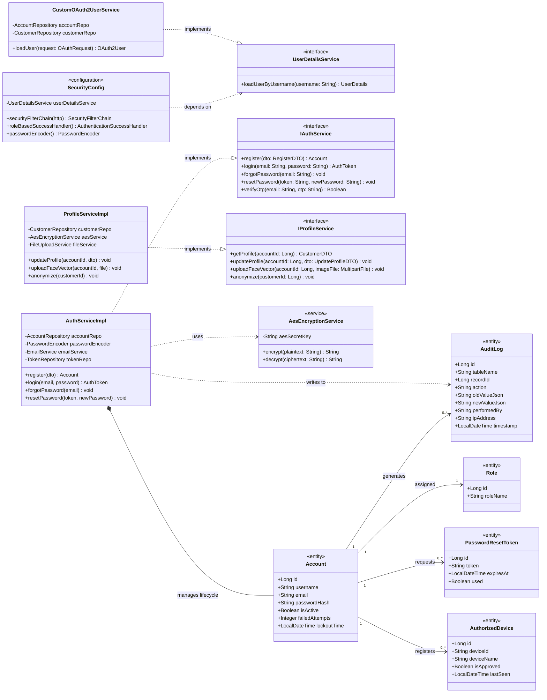
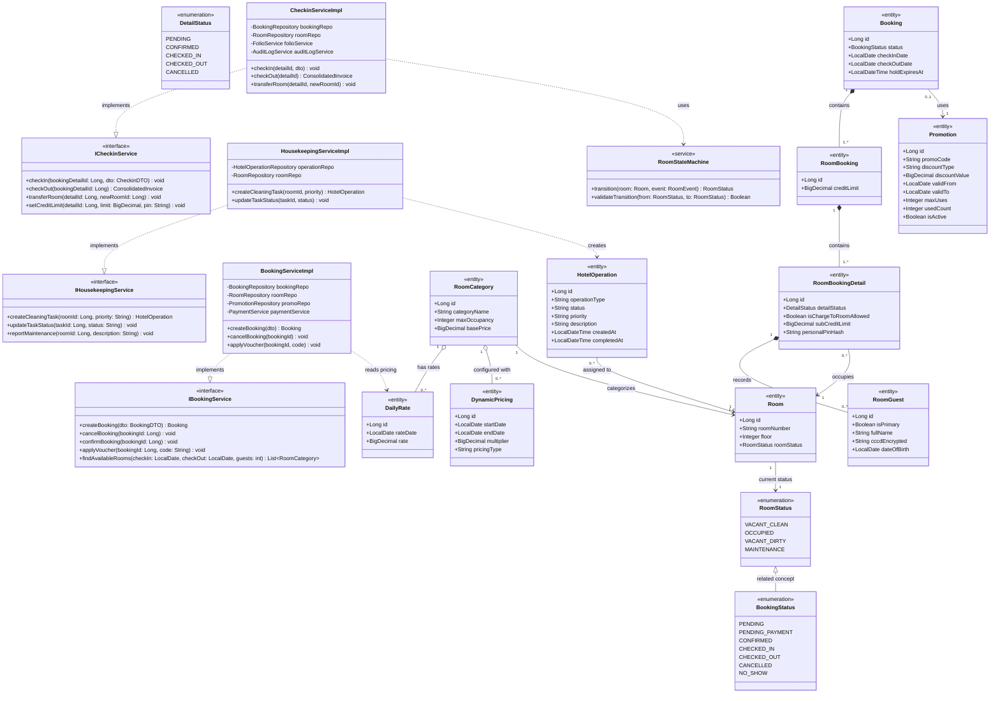
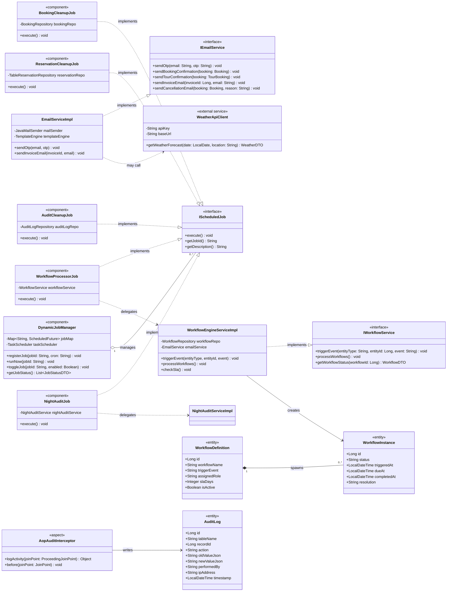

# CLASS DIAGRAM — KAWAI RETREAT RESORT & HUB
# UML 2.5.1 Standard

**Project:** SWP391 — Group 2 — SE2023-NET  
**Version:** 1.0 | **Date:** 2026-06-29  
**Standard:** UML 2.5.1 (OMG Unified Modeling Language Specification)  
**Tool:** Mermaid Class Diagram (PlantUML compatible)

---

## Mục lục

1. [UML Relationship Legend](#1-uml-relationship-legend)
2. [Domain Overview — Core Entities](#2-domain-overview--core-entities)
3. [Module 1 — Authentication & Identity](#3-module-1--authentication--identity)
4. [Module 2 — Booking & Front Desk](#4-module-2--booking--front-desk)
5. [Module 3 — F&B POS & KDS](#5-module-3--fb-pos--kds)
6. [Module 4 — Tour & Review](#6-module-4--tour--review)
7. [Module 5 — Folio & Finance](#7-module-5--folio--finance)
8. [Module 6 — System & Infrastructure](#8-module-6--system--infrastructure)
9. [Full System Class Diagram](#9-full-system-class-diagram)
10. [Relationship Summary Table](#10-relationship-summary-table)

---

## 1. UML Relationship Legend

| Symbol (Mermaid) | UML 2.5.1 Name | Description |
|---|---|---|
| `<\|--` | **Generalization** | Subclass inherits from superclass (IS-A) |
| `..\|>` | **Realization / Implementation** | Class implements an interface |
| `*--` | **Composition** | Strong ownership; child dies with parent |
| `o--` | **Aggregation** | Weak ownership; child can exist independently |
| `-->` | **Association** | Directed relationship between classes |
| `..>` | **Dependency** | Uses relationship; change in target may affect source |
| `--` | **Association (undirected)** | Bidirectional relationship |
| `<\|..` | **Specialization** (reversed Generalization) | Extension of abstract concept |

> **UML 2.5.1 Multiplicity Notation:**
> - `1` — Exactly one
> - `0..1` — Zero or one (optional)
> - `1..*` — One or many
> - `0..*` or `*` — Zero or many

---

## 2. Domain Overview — Core Entities

```mermaid
classDiagram
    direction TB

    %% ─────────────────────────────────────────────
    %% CORE IDENTITY
    %% ─────────────────────────────────────────────
    class Account {
        <<entity>>
        +Long id
        +String username
        +String email
        +String passwordHash
        +Boolean isActive
        +Integer failedAttempts
        +LocalDateTime lockoutTime
        +LocalDateTime createdAt
        +login() Boolean
        +lock() void
        +resetPassword(token: String) void
    }

    class Role {
        <<entity>>
        +Long id
        +String roleName
        +String description
    }

    class Customer {
        <<entity>>
        +Long id
        +String fullName
        +String phone
        +String emailEncrypted
        +String cccdEncrypted
        +LocalDate dateOfBirth
        +String gender
        +String nationality
        +String faceVectorData
        +String membershipTier
        +anonymize() void
    }

    class Employee {
        <<entity>>
        +Long id
        +String fullName
        +String phone
        +String department
        +String position
        +Boolean isActive
    }

    class Dependent {
        <<entity>>
        +Long id
        +String fullName
        +LocalDate dateOfBirth
        +String relationship
        +String cccdEncrypted
    }

    %% ─────────────────────────────────────────────
    %% ROOM DOMAIN
    %% ─────────────────────────────────────────────
    class Room {
        <<entity>>
        +Long id
        +String roomNumber
        +Integer floor
        +RoomStatus roomStatus
        +Boolean isActive
        +changeStatus(status: RoomStatus) void
    }

    class RoomCategory {
        <<entity>>
        +Long id
        +String categoryName
        +Integer maxOccupancy
        +BigDecimal basePrice
        +String amenities
        +String imageUrl
    }

    %% ─────────────────────────────────────────────
    %% BOOKING DOMAIN
    %% ─────────────────────────────────────────────
    class Booking {
        <<entity>>
        +Long id
        +String bookingType
        +BookingStatus status
        +LocalDate checkInDate
        +LocalDate checkOutDate
        +BigDecimal totalAmount
        +BigDecimal depositAmount
        +LocalDateTime holdExpiresAt
        +String promotionCode
        +LocalDateTime createdAt
        +cancel() void
        +confirm() void
    }

    class RoomBooking {
        <<entity>>
        +Long id
        +Integer totalRooms
        +BigDecimal creditLimit
    }

    class RoomBookingDetail {
        <<entity>>
        +Long id
        +DetailStatus detailStatus
        +Boolean isChargeToRoomAllowed
        +BigDecimal subCreditLimit
        +String personalPinHash
        +LocalDateTime checkinAt
        +LocalDateTime checkoutAt
        +verifyPin(raw: String) Boolean
    }

    %% ─────────────────────────────────────────────
    %% RELATIONSHIPS — CORE
    %% ─────────────────────────────────────────────

    Account "1" --> "1" Role : has
    Account "1" o-- "0..1" Customer : linked to
    Account "1" o-- "0..1" Employee : linked to
    Customer "1" *-- "0..*" Dependent : manages

    RoomCategory "1" *-- "1..*" Room : contains
    Room "1" --> "1" RoomStatus : has status

    Customer "1" --> "0..*" Booking : places
    Booking "1" *-- "0..*" RoomBooking : contains
    RoomBooking "1" *-- "1..*" RoomBookingDetail : contains
    RoomBookingDetail "0..*" --> "1" Room : assigned to
```

---

## 3. Module 1 — Authentication & Identity

---

## 4. Module 2 — Booking & Front Desk

---

## 5. Module 3 — F&B POS & KDS

```mermaid
classDiagram
    direction TB

    %% ─────────────────────────────────────────────
    %% ENUMERATIONS
    %% ─────────────────────────────────────────────
    class FoodOrderType {
        <<enumeration>>
        DINE_IN
        ROOM_SERVICE
        TAKEAWAY
    }

    class KotStatus {
        <<enumeration>>
        PENDING
        COOKING
        READY
        SERVED
        CANCELLED
    }

    class PaymentType {
        <<enumeration>>
        CASH
        CARD
        VNPAY
        CHARGE_TO_ROOM
        BANK_TRANSFER
    }

    class TableStatus {
        <<enumeration>>
        AVAILABLE
        OCCUPIED
        RESERVED
        CLEANING
    }

    %% ─────────────────────────────────────────────
    %% INTERFACES
    %% ─────────────────────────────────────────────
    class IPosService {
        <<interface>>
        +createDineInOrder(tableId: Long, items: List) FoodOrder
        +createRoomServiceOrder(detailId: Long, items: List) FoodOrder
        +payOrder(orderId: Long, paymentType: PaymentType) void
        +chargeToRoom(orderId: Long, roomNumber: String, pin: String) void
        +updateItemStatus(orderDetailId: Long, status: KotStatus) void
    }

    class IMenuService {
        <<interface>>
        +getAllAvailableItems() List~MenuItem~
        +toggleAvailability(itemId: Long) void
        +getKitchenData() KitchenDTO
    }

    class ITableService {
        <<interface>>
        +getAvailability(date: LocalDate, time: LocalTime) List~RestaurantTable~
        +makeReservation(dto: ReservationDTO) TableReservation
        +updateStatus(tableId: Long, status: TableStatus) void
    }

    %% ─────────────────────────────────────────────
    %% IMPLEMENTATIONS
    %% ─────────────────────────────────────────────
    class PosServiceImpl {
        -FoodOrderRepository orderRepo
        -FolioService folioService
        -CreditLimitValidator creditValidator
        -PasswordEncoder passwordEncoder
        +createDineInOrder(tableId, items) FoodOrder
        +chargeToRoom(orderId, roomNumber, pin) void
        +payOrder(orderId, paymentType) void
    }

    class CreditLimitValidator {
        <<component>>
        -RoomBookingDetailRepository detailRepo
        +validate(detailId: Long, amount: BigDecimal) Boolean
    }

    %% ─────────────────────────────────────────────
    %% ENTITIES
    %% ─────────────────────────────────────────────
    class MenuCategory {
        <<entity>>
        +Long id
        +String categoryName
        +Boolean isActive
        +Integer displayOrder
    }

    class MenuItem {
        <<entity>>
        +Long id
        +String itemName
        +BigDecimal price
        +Boolean isAvailable
        +String allergens
        +String imageUrl
        +String description
        +toggle() void
    }

    class FoodOrder {
        <<entity>>
        +Long id
        +FoodOrderType orderType
        +String orderStatus
        +Boolean isPaidInPos
        +PaymentType paymentType
        +BigDecimal totalAmount
        +LocalDateTime orderedAt
    }

    class FoodOrderDetail {
        <<entity>>
        +Long id
        +Integer quantity
        +BigDecimal unitPrice
        +BigDecimal lineTotal
        +KotStatus kotStatus
        +String specialNotes
    }

    class RestaurantTable {
        <<entity>>
        +Long id
        +String tableNumber
        +Integer capacity
        +String location
        +TableStatus tableStatus
    }

    class TableReservation {
        <<entity>>
        +Long id
        +LocalDate reserveDate
        +LocalTime reserveTime
        +Integer guestsCount
        +String status
        +LocalDateTime expiresAt
    }

    %% ─────────────────────────────────────────────
    %% RELATIONSHIPS
    %% ─────────────────────────────────────────────

    %% Realization
    PosServiceImpl ..|> IPosService : implements

    %% Composition
    MenuCategory "1" *-- "0..*" MenuItem : contains
    FoodOrder "1" *-- "1..*" FoodOrderDetail : composed of

    %% Aggregation
    FoodOrderDetail "0..*" o-- "1" MenuItem : references

    %% Association
    FoodOrder "0..*" --> "0..1" RestaurantTable : served at
    TableReservation "0..*" --> "1" RestaurantTable : reserves
    FoodOrder "0..*" --> "0..1" FoodOrderType : typed as
    FoodOrderDetail --> KotStatus : tracks

    %% Dependency
    PosServiceImpl ..> CreditLimitValidator : delegates
    PosServiceImpl ..> MenuItem : reads availability
```

---

## 6. Module 4 — Tour & Review

```mermaid
classDiagram
    direction TB

    %% ─────────────────────────────────────────────
    %% INTERFACES
    %% ─────────────────────────────────────────────
    class ITourBookingService {
        <<interface>>
        +bookTour(dto: TourBookingDTO) TourBooking
        +cancelTourBooking(bookingId: Long) void
        +checkCapacity(scheduleId: Long, count: int) Boolean
    }

    class IFaceIdService {
        <<interface>>
        +scanFace(scheduleId: Long, imageFile: MultipartFile) AttendanceResult
        +manualCheckIn(attendeeId: Long, guideId: Long) void
    }

    class IReviewService {
        <<interface>>
        +submitReview(dto: ReviewDTO) Review
        +moderateReview(reviewId: Long, action: String, reason: String) void
        +isEligibleToReview(customerId: Long, referenceId: Long) Boolean
    }

    %% ─────────────────────────────────────────────
    %% IMPLEMENTATIONS
    %% ─────────────────────────────────────────────
    class TourBookingServiceImpl {
        -TourScheduleRepository scheduleRepo
        -TourBookingRepository bookingRepo
        -FolioService folioService
        -PaymentService paymentService
        +bookTour(dto) TourBooking
        +cancelTourBooking(bookingId) void
    }

    class FaceIdServiceImpl {
        -PythonAiServiceClient aiClient
        -TourAttendeeRepository attendeeRepo
        +scanFace(scheduleId, imageFile) AttendanceResult
        +manualCheckIn(attendeeId, guideId) void
    }

    class PythonAiServiceClient {
        <<external service>>
        -String aiServiceUrl
        +extractFaceVector(image: MultipartFile) float[]
        +compareFaces(v1: float[], v2: float[]) double
    }

    class ReviewServiceImpl {
        -ReviewRepository reviewRepo
        -BookingRepository bookingRepo
        -AuditLogService auditLogService
        +submitReview(dto) Review
        +moderateReview(reviewId, action, reason) void
    }

    %% ─────────────────────────────────────────────
    %% ENTITIES
    %% ─────────────────────────────────────────────
    class TourCategory {
        <<entity>>
        +Long id
        +String categoryName
        +Boolean isActive
    }

    class Tour {
        <<entity>>
        +Long id
        +String tourName
        +String description
        +BigDecimal price
        +String difficulty
        +Boolean isActive
        +String imageUrl
    }

    class TourSchedule {
        <<entity>>
        +Long id
        +LocalDate departureDate
        +LocalTime departureTime
        +Integer maxCapacity
        +Integer minimumPax
        +Integer bookedSeats
        +String status
        +Long version
        +hasAvailableSeats(count: int) Boolean
    }

    class TourItinerary {
        <<entity>>
        +Long id
        +String itineraryName
        +String description
        +Integer durationHours
    }

    class TourLocation {
        <<entity>>
        +Long id
        +String locationName
        +Double latitude
        +Double longitude
        +String description
    }

    class TourBooking {
        <<entity>>
        +Long id
        +String status
        +BigDecimal totalAmount
        +PaymentType paymentType
    }

    class TourAttendee {
        <<entity>>
        +Long id
        +String attendanceStatus
        +String faceVectorData
        +LocalDateTime faceMatchedAt
        +Boolean manualCheckIn
    }

    class TourStaffAssignment {
        <<entity>>
        +Long id
        +String assignmentRole
        +LocalDate assignDate
    }

    class Review {
        <<entity>>
        +Long id
        +String reviewType
        +Integer starRating
        +String comment
        +String moderationStatus
        +String moderationReason
        +LocalDateTime submittedAt
        +LocalDateTime reviewWindowEnd
    }

    class RunItineraryStatus {
        <<entity>>
        +Long id
        +String status
        +String notes
        +LocalDateTime updatedAt
    }

    %% ─────────────────────────────────────────────
    %% RELATIONSHIPS
    %% ─────────────────────────────────────────────

    %% Realization
    TourBookingServiceImpl ..|> ITourBookingService : implements
    FaceIdServiceImpl ..|> IFaceIdService : implements
    ReviewServiceImpl ..|> IReviewService : implements

    %% Generalization (Specialization)
    TourCategory "1" --> "0..*" Tour : categorizes

    %% Composition
    Tour "1" *-- "1..*" TourSchedule : schedules
    Tour "1" *-- "0..*" TourItinerary : has
    TourItinerary "1" *-- "0..*" TourLocation : contains stops
    TourSchedule "1" *-- "0..*" RunItineraryStatus : tracks

    %% Aggregation
    TourBooking "1" o-- "1..*" TourAttendee : carries

    %% Association
    TourBooking "0..*" --> "1" TourSchedule : booked for
    TourStaffAssignment "0..*" --> "1" TourSchedule : assigned to
    TourStaffAssignment "0..*" --> "1" Employee : involves
    Review "0..*" --> "1" Customer : written by

    %% Dependency
    FaceIdServiceImpl ..> PythonAiServiceClient : delegates AI processing
    TourBookingServiceImpl ..> TourSchedule : checks capacity
```

---

## 7. Module 5 — Folio & Finance

```mermaid
classDiagram
    direction TB

    %% ─────────────────────────────────────────────
    %% INTERFACES
    %% ─────────────────────────────────────────────
    class IFolioService {
        <<interface>>
        +getFolioItems(detailId: Long) List~FolioItem~
        +addFolioItem(detailId: Long, item: FolioItemDTO) FolioItem
        +splitFolioItem(itemId: Long) FolioItem
        +generateConsolidatedInvoice(detailId: Long) ConsolidatedInvoice
        +checkout(detailId: Long) void
    }

    class INightAuditService {
        <<interface>>
        +runNightAudit() NightAuditResult
        +postRoomCharge(detailId: Long, rate: BigDecimal) FolioItem
        +advanceBusinessDate() void
    }

    class IPaymentService {
        <<interface>>
        +processVnPay(amount: BigDecimal, prefix: String) String
        +handleIpnCallback(params: Map) void
        +processRefund(transactionId: Long) void
    }

    class IReportService {
        <<interface>>
        +getDailyRevenue(date: LocalDate) RevenueDTO
        +getMonthlyRevenue(month: YearMonth) RevenueDTO
        +getOccupancyRate(startDate: LocalDate, endDate: LocalDate) OccupancyDTO
        +exportPdf(reportType: String) byte[]
        +exportExcel(reportType: String) byte[]
    }

    %% ─────────────────────────────────────────────
    %% IMPLEMENTATIONS
    %% ─────────────────────────────────────────────
    class FolioServiceImpl {
        -FolioItemRepository folioRepo
        -ConsolidatedInvoiceRepository invoiceRepo
        -MembershipTierRepository tierRepo
        +getFolioItems(detailId) List~FolioItem~
        +generateConsolidatedInvoice(detailId) ConsolidatedInvoice
        +checkout(detailId) void
    }

    class NightAuditServiceImpl {
        -RoomBookingDetailRepository detailRepo
        -DailyRateRepository rateRepo
        -FolioService folioService
        -AuditLogService auditLogService
        +runNightAudit() NightAuditResult
        +postRoomCharge(detailId, rate) FolioItem
    }

    class VnPayServiceImpl {
        -String vnPayUrl
        -String secretKey
        -String tmnCode
        +createPaymentUrl(amount, prefix) String
        +verifyIpn(params) Boolean
        +refund(transactionId) void
    }

    class UsaliRevenueDecomposer {
        <<service>>
        +decompose(invoices: List) UsaliReportDTO
        +getRoomRevenue() BigDecimal
        +getFnbRevenue() BigDecimal
        +getTourRevenue() BigDecimal
    }

    class InvoicePdfService {
        <<service>>
        +generate(invoiceId: Long) byte[]
        +emailInvoice(invoiceId: Long, email: String) void
    }

    %% ─────────────────────────────────────────────
    %% ENTITIES
    %% ─────────────────────────────────────────────
    class FolioItem {
        <<entity>>
        +Long id
        +String sourceDepartment
        +BigDecimal amount
        +String description
        +LocalDate postingDate
        +Boolean isSettledSeparately
        +Boolean isVoided
    }

    class ConsolidatedInvoice {
        <<entity>>
        +Long id
        +BigDecimal totalAmount
        +BigDecimal depositPaid
        +BigDecimal balanceDue
        +BigDecimal discountAmount
        +BigDecimal vatAmount
        +String status
        +String invoiceNumber
        +LocalDateTime issuedAt
    }

    class PaymentTransaction {
        <<entity>>
        +Long id
        +String transactionType
        +BigDecimal amount
        +String paymentMethod
        +String vnPayTransactionId
        +String status
        +LocalDateTime processedAt
    }

    class MembershipTier {
        <<entity>>
        +Long id
        +String tierName
        +BigDecimal discountPercent
        +Integer minNightStay
    }

    class NightAuditLog {
        <<entity>>
        +Long id
        +LocalDate auditDate
        +Integer roomsProcessed
        +BigDecimal totalPosted
        +String status
        +String errorNotes
        +LocalDateTime executedAt
    }

    %% ─────────────────────────────────────────────
    %% RELATIONSHIPS
    %% ─────────────────────────────────────────────

    %% Realization
    FolioServiceImpl ..|> IFolioService : implements
    NightAuditServiceImpl ..|> INightAuditService : implements
    VnPayServiceImpl ..|> IPaymentService : implements

    %% Composition
    ConsolidatedInvoice "1" *-- "0..*" FolioItem : summarizes
    ConsolidatedInvoice "1" *-- "1..*" PaymentTransaction : settled by

    %% Aggregation
    RoomBookingDetail "1" o-- "0..*" FolioItem : accumulates
    Customer "1" o-- "0..1" MembershipTier : benefits from

    %% Association
    NightAuditServiceImpl --> NightAuditLog : records
    FolioServiceImpl --> ConsolidatedInvoice : generates

    %% Dependency
    NightAuditServiceImpl ..> DailyRate : reads rates
    InvoicePdfService ..> ConsolidatedInvoice : renders
    UsaliRevenueDecomposer ..> FolioItem : aggregates
    FolioServiceImpl ..> MembershipTier : applies discount
```

---

## 8. Module 6 — System & Infrastructure

---

## 9. Full System Class Diagram

```mermaid
classDiagram
    direction TB

    %% ══════════════════════════════════════════════════════
    %% CORE CLASSES (abbreviated for overview)
    %% ══════════════════════════════════════════════════════

    class Account {
        <<entity>>
        +Long id
        +String email
        +String passwordHash
        +Boolean isActive
    }
    class Role { <<entity>> +String roleName }
    class Customer { <<entity>> +String fullName; +String faceVectorData }
    class Employee { <<entity>> +String fullName; +String department }
    class Dependent { <<entity>> +String fullName; +String relationship }

    class Room { <<entity>> +RoomStatus status }
    class RoomCategory { <<entity>> +Integer maxOccupancy; +BigDecimal basePrice }
    class DailyRate { <<entity>> +LocalDate rateDate; +BigDecimal rate }
    class DynamicPricing { <<entity>> +LocalDate startDate; +LocalDate endDate }

    class Booking { <<entity>> +BookingStatus status; +LocalDate checkInDate }
    class RoomBooking { <<entity>> +BigDecimal creditLimit }
    class RoomBookingDetail { <<entity>> +DetailStatus detailStatus; +String personalPinHash }
    class RoomGuest { <<entity>> +Boolean isPrimary }

    class HotelOperation { <<entity>> +String operationType; +String priority }
    class Promotion { <<entity>> +String promoCode; +BigDecimal discountValue }

    class MenuCategory { <<entity>> +String categoryName }
    class MenuItem { <<entity>> +BigDecimal price; +Boolean isAvailable }
    class FoodOrder { <<entity>> +FoodOrderType orderType }
    class FoodOrderDetail { <<entity>> +KotStatus kotStatus }
    class RestaurantTable { <<entity>> +TableStatus tableStatus }
    class TableReservation { <<entity>> +LocalDate reserveDate }

    class TourCategory { <<entity>> +String categoryName }
    class Tour { <<entity>> +String tourName; +BigDecimal price }
    class TourSchedule { <<entity>> +Integer maxCapacity; +Integer bookedSeats }
    class TourBooking { <<entity>> +String status }
    class TourAttendee { <<entity>> +String attendanceStatus }
    class TourStaffAssignment { <<entity>> +String assignmentRole }
    class Review { <<entity>> +Integer starRating; +String moderationStatus }

    class FolioItem { <<entity>> +String sourceDepartment; +BigDecimal amount }
    class ConsolidatedInvoice { <<entity>> +BigDecimal totalAmount; +String status }
    class PaymentTransaction { <<entity>> +String transactionType; +BigDecimal amount }
    class MembershipTier { <<entity>> +String tierName; +BigDecimal discountPercent }
    class AuditLog { <<entity>> +String action; +String oldValueJson }
    class WorkflowDefinition { <<entity>> +String triggerEvent }
    class WorkflowInstance { <<entity>> +String status; +LocalDateTime dueAt }
    class AuthorizedDevice { <<entity>> +String deviceId; +Boolean isApproved }
    class PasswordResetToken { <<entity>> +String token; +Boolean used }

    %% ══════════════════════════════════════════════════════
    %% GENERALIZATION (IS-A inheritance)
    %% ══════════════════════════════════════════════════════
    Account <|-- Customer : is a (via role linkage)
    Account <|-- Employee : is a (via role linkage)

    %% ══════════════════════════════════════════════════════
    %% COMPOSITION (strong ownership — child dies with parent)
    %% ══════════════════════════════════════════════════════
    Booking "1" *-- "1..*" RoomBooking
    RoomBooking "1" *-- "1..*" RoomBookingDetail
    RoomBookingDetail "1" *-- "0..*" RoomGuest
    FoodOrder "1" *-- "1..*" FoodOrderDetail
    Tour "1" *-- "1..*" TourSchedule
    ConsolidatedInvoice "1" *-- "0..*" FolioItem
    ConsolidatedInvoice "1" *-- "1..*" PaymentTransaction
    WorkflowDefinition "1" *-- "0..*" WorkflowInstance

    %% ══════════════════════════════════════════════════════
    %% AGGREGATION (weak ownership — can exist independently)
    %% ══════════════════════════════════════════════════════
    RoomCategory "1" o-- "0..*" Room
    RoomCategory "1" o-- "0..*" DailyRate
    RoomCategory "1" o-- "0..*" DynamicPricing
    MenuCategory "1" o-- "0..*" MenuItem
    TourCategory "1" o-- "0..*" Tour
    TourBooking "1" o-- "1..*" TourAttendee
    Customer "1" o-- "0..*" Dependent
    Customer "1" o-- "0..1" MembershipTier
    RoomBookingDetail "1" o-- "0..*" FolioItem

    %% ══════════════════════════════════════════════════════
    %% ASSOCIATION (directed relationships)
    %% ══════════════════════════════════════════════════════
    Account "1" --> "1" Role
    Account "1" --> "0..1" Customer
    Account "1" --> "0..1" Employee
    Account "1" --> "0..*" PasswordResetToken
    Account "1" --> "0..*" AuthorizedDevice

    Customer "1" --> "0..*" Booking
    Booking "0..*" --> "0..1" Promotion

    RoomBookingDetail "0..*" --> "1" Room
    HotelOperation "0..*" --> "1" Room

    FoodOrder "0..*" --> "0..1" RestaurantTable
    TableReservation "0..*" --> "1" RestaurantTable
    FoodOrderDetail "0..*" --> "1" MenuItem

    TourBooking "0..*" --> "1" TourSchedule
    TourStaffAssignment "0..*" --> "1" TourSchedule
    TourStaffAssignment "0..*" --> "1" Employee

    Review "0..*" --> "1" Customer
    AuditLog "0..*" --> "1" Account

    %% ══════════════════════════════════════════════════════
    %% DEPENDENCY (uses — temporary coupling)
    %% ══════════════════════════════════════════════════════
    FolioItem ..> FoodOrder : sourced from
    FolioItem ..> TourBooking : sourced from
    ConsolidatedInvoice ..> Promotion : applies
```

---

## 10. Relationship Summary Table

| Relationship | From Class | To Class | Type | Multiplicity | Description |
|---|---|---|---|---|---|
| **Generalization** | `Customer` | `Account` | Generalization | 1:1 | Customer IS-A Account (via role link) |
| **Generalization** | `Employee` | `Account` | Generalization | 1:1 | Employee IS-A Account (via role link) |
| **Implementation** | `AuthServiceImpl` | `IAuthService` | Realization | — | Implements auth contract |
| **Implementation** | `BookingServiceImpl` | `IBookingService` | Realization | — | Implements booking contract |
| **Implementation** | `PosServiceImpl` | `IPosService` | Realization | — | Implements POS contract |
| **Implementation** | `FolioServiceImpl` | `IFolioService` | Realization | — | Implements folio contract |
| **Implementation** | `NightAuditServiceImpl` | `INightAuditService` | Realization | — | Implements audit contract |
| **Implementation** | `VnPayServiceImpl` | `IPaymentService` | Realization | — | Implements payment contract |
| **Implementation** | `BookingCleanupJob` | `IScheduledJob` | Realization | — | Scheduled job impl |
| **Implementation** | `TourBookingServiceImpl` | `ITourBookingService` | Realization | — | Tour booking impl |
| **Implementation** | `FaceIdServiceImpl` | `IFaceIdService` | Realization | — | Face ID scan impl |
| **Composition** | `Booking` | `RoomBooking` | Composition | 1 : 1..* | Booking owns RoomBookings |
| **Composition** | `RoomBooking` | `RoomBookingDetail` | Composition | 1 : 1..* | RoomBooking owns details |
| **Composition** | `RoomBookingDetail` | `RoomGuest` | Composition | 1 : 0..* | Detail owns guest records |
| **Composition** | `FoodOrder` | `FoodOrderDetail` | Composition | 1 : 1..* | Order owns line items |
| **Composition** | `Tour` | `TourSchedule` | Composition | 1 : 1..* | Tour owns schedules |
| **Composition** | `ConsolidatedInvoice` | `FolioItem` | Composition | 1 : 0..* | Invoice owns folio lines |
| **Composition** | `ConsolidatedInvoice` | `PaymentTransaction` | Composition | 1 : 1..* | Invoice owns payments |
| **Aggregation** | `RoomCategory` | `Room` | Aggregation | 1 : 0..* | Category groups rooms |
| **Aggregation** | `RoomCategory` | `DailyRate` | Aggregation | 1 : 0..* | Category has pricing |
| **Aggregation** | `MenuCategory` | `MenuItem` | Aggregation | 1 : 0..* | Category groups items |
| **Aggregation** | `TourBooking` | `TourAttendee` | Aggregation | 1 : 1..* | Booking carries attendees |
| **Aggregation** | `Customer` | `Dependent` | Aggregation | 1 : 0..* | Customer has dependents |
| **Aggregation** | `RoomBookingDetail` | `FolioItem` | Aggregation | 1 : 0..* | Room accumulates folio |
| **Association** | `Account` | `Role` | Association | 1 : 1 | Account assigned role |
| **Association** | `Customer` | `Booking` | Association | 1 : 0..* | Customer places bookings |
| **Association** | `RoomBookingDetail` | `Room` | Association | * : 1 | Detail occupies room |
| **Association** | `FoodOrder` | `RestaurantTable` | Association | * : 0..1 | Order served at table |
| **Association** | `TourBooking` | `TourSchedule` | Association | * : 1 | Booking on schedule |
| **Association** | `Review` | `Customer` | Association | * : 1 | Review written by customer |
| **Dependency** | `FaceIdServiceImpl` | `PythonAiServiceClient` | Dependency | — | Delegates face processing |
| **Dependency** | `CheckinServiceImpl` | `RoomStateMachine` | Dependency | — | Uses state transitions |
| **Dependency** | `NightAuditServiceImpl` | `DailyRate` | Dependency | — | Reads nightly rates |
| **Dependency** | `UsaliRevenueDecomposer` | `FolioItem` | Dependency | — | Aggregates revenue data |
| **Dependency** | `AopAuditInterceptor` | `AuditLog` | Dependency | — | Writes audit records |

---

## Appendix — UML Stereotypes Used

| Stereotype | Meaning in this diagram |
|---|---|
| `<<entity>>` | JPA-managed persistent domain object |
| `<<interface>>` | Service contract / port |
| `<<enumeration>>` | Java enum type |
| `<<service>>` | Spring @Service component |
| `<<component>>` | Spring @Component / utility |
| `<<configuration>>` | Spring @Configuration class |
| `<<aspect>>` | Spring AOP @Aspect class |
| `<<external service>>` | Third-party or microservice (VNPay, SendGrid, Python AI) |

---

*Document generated by Antigravity — Business Analyst Review — 2026-06-29*  
*Standard: UML 2.5.1 (OMG) | Tool: Mermaid Class Diagram*
