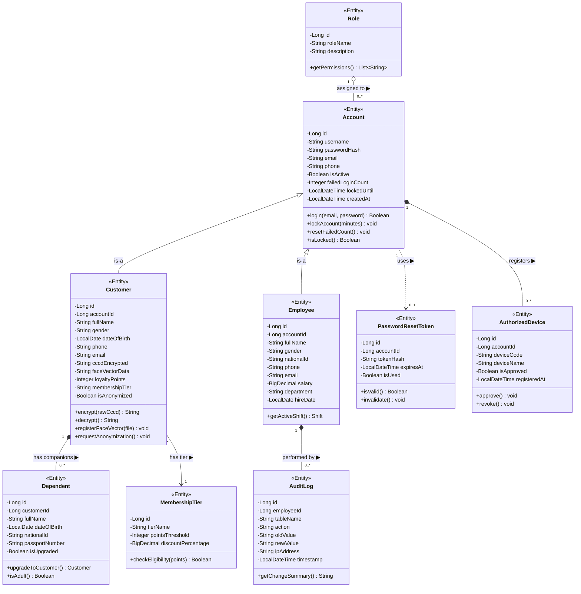
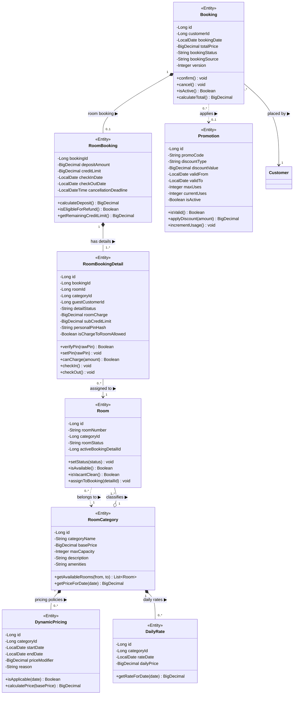
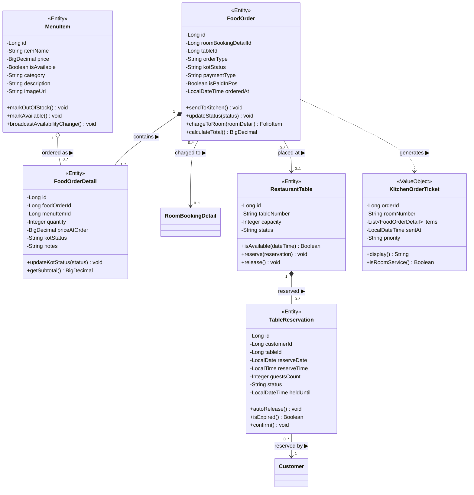
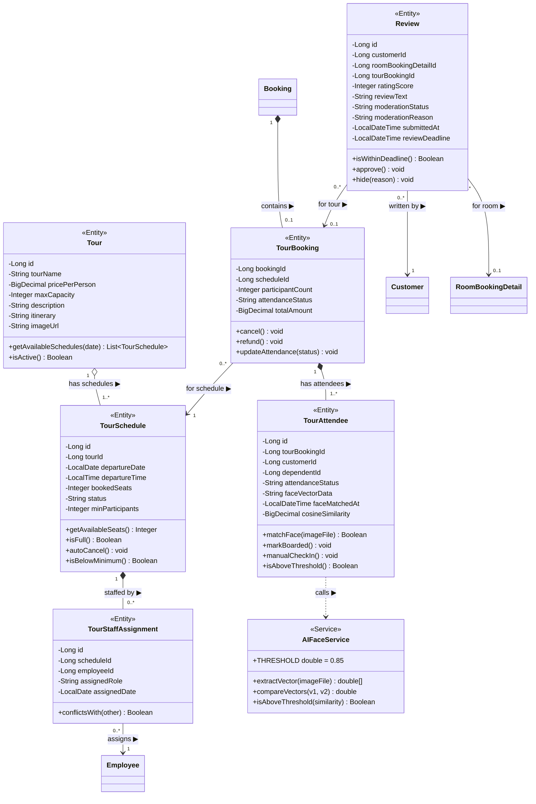
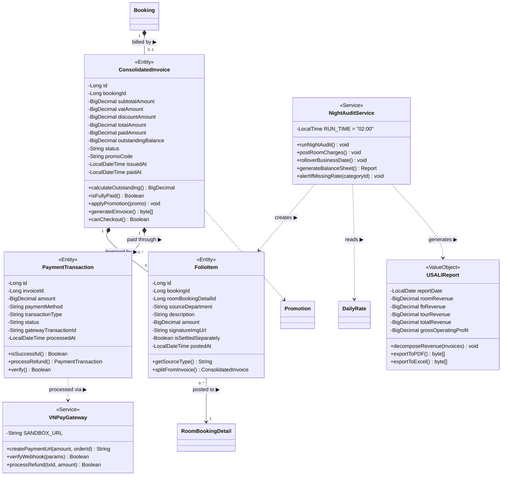
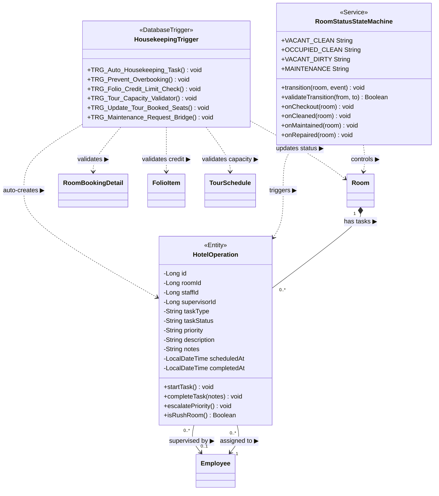

# CLASS DIAGRAM — UML Standard

## Kawai Retreat Resort & Hub — Sơ đồ Lớp Hệ thống

**Phiên bản:** 1.0  
**Ngày tạo:** 2026-06-29  
**Chuẩn:** UML (Aggregation · Composition · Generalization · Association · Dependency · Realization)  
**Nguồn:** SRS_Document_SWP391_G2.md · Project_Specification.md · ERD Entities

---

## Mục lục

| # | Sơ đồ | Phân hệ |
|:-:|:------|:--------|
| 1 | [Quy ước UML](#1-quy-ước-uml) | — |
| 2 | [CD-01 Authentication & Account](#cd-01--authentication--account) | Xác thực & Tài khoản |
| 3 | [CD-02 Booking & Front Office](#cd-02--booking--front-office) | Đặt phòng & Tiền sảnh |
| 4 | [CD-03 F&B / POS / KDS](#cd-03--fb--pos--kds) | Nhà hàng & Bếp |
| 5 | [CD-04 Tour & Review](#cd-04--tour--review) | Lữ hành & Đánh giá |
| 6 | [CD-05 Finance & Payment](#cd-05--finance--payment) | Tài chính & Thanh toán |
| 7 | [CD-06 Housekeeping & Maintenance](#cd-06--housekeeping--maintenance) | Buồng phòng & Bảo trì |
| 8 | [CD-07 Master Class Diagram](#cd-07--master-class-diagram) | Toàn hệ thống |
| 9 | [Bảng Giải thích Quan hệ](#9-bảng-giải-thích-quan-hệ-uml) | Tổng hợp |

---

## 1. Quy ước UML

### 1.1 Loại Quan hệ (Relationships)

| Loại | Ký hiệu Mermaid | Ý nghĩa | Ví dụ |
|:-----|:---------------|:--------|:------|
| **Association** | `A --> B` | A biết / dùng B | Customer → Booking |
| **Aggregation** | `A o-- B` | B là phần của A; B tồn tại độc lập | Role ◇── Account |
| **Composition** | `A *-- B` | B sống chết với A; A bị xóa → B mất | Booking ◆── FolioItem |
| **Generalization** | `A <|-- B` | B kế thừa A (is-a) | Employee ──▷ Account |
| **Realization** | `A <|.. B` | B implements interface A | Service ──▷ Interface |
| **Dependency** | `A ..> B` | A tạm thời dùng B | Controller ..> Service |

### 1.2 Visibility Modifier

| Ký hiệu | Ý nghĩa | Java tương đương |
|:--------|:--------|:----------------|
| `+` | public | `public` |
| `-` | private | `private` |
| `#` | protected | `protected` |
| `~` | package | (default) |

### 1.3 Multiplicity (Cardinality)

| Ký hiệu | Ý nghĩa |
|:--------|:--------|
| `1` | Đúng 1 |
| `0..1` | Không hoặc 1 |
| `*` hoặc `0..*` | Không hoặc nhiều |
| `1..*` | Ít nhất 1 |

---

## CD-01 — Authentication & Account

### Quan hệ chính trong phân hệ này

| Quan hệ | Từ | Đến | Loại | Multiplicity | Lý do |
|:--------|:--|:----|:-----|:------------|:------|
| Account ←── Customer | Account | Customer | **Generalization** | 1 → 0..1 | Customer "is-a" Account, liên kết qua accountId FK |
| Account ←── Employee | Account | Employee | **Generalization** | 1 → 0..1 | Employee "is-a" Account, liên kết qua accountId FK |
| Role ──◇ Account | Role | Account | **Aggregation** | 1 → 0..* | Account tham chiếu Role; Role tồn tại độc lập khi xóa Account |
| Customer ──◆ Dependent | Customer | Dependent | **Composition** | 1 → 0..* | Dependent gắn chặt Customer; xóa Customer thì Dependent mất ý nghĩa |
| Employee ──◆ AuditLog | Employee | AuditLog | **Composition** | 1 → 0..* | AuditLog gắn với người thực hiện; không tồn tại độc lập |
| Account ──> PasswordResetToken | Account | PasswordResetToken | **Dependency** | 1 → 0..1 | Account tạm thời dùng token; token độc lập sau khi tạo |
| Account ──◆ AuthorizedDevice | Account | AuthorizedDevice | **Composition** | 1 → 0..* | Thiết bị đã đăng ký của Account nhân viên |
| Customer ──> MembershipTier | Customer | MembershipTier | **Association** | 0..* → 1 | Hạng thành viên hiện tại của Customer |

---

## CD-02 — Booking & Front Office

### Quan hệ chính trong phân hệ này

| Quan hệ | Từ | Đến | Loại | Multiplicity | Lý do |
|:--------|:--|:----|:-----|:------------|:------|
| Booking ──◆ RoomBooking | Booking | RoomBooking | **Composition** | 1 → 0..1 | RoomBooking không tồn tại nếu không có Booking |
| RoomBooking ──◆ RoomBookingDetail | RoomBooking | RoomBookingDetail | **Composition** | 1 → 1..* | Detail gắn chặt RoomBooking; xóa booking thì detail mất |
| RoomCategory ──◇ Room | RoomCategory | Room | **Aggregation** | 1 → 1..* | Room thuộc Category; xóa Room thì Category vẫn còn |
| RoomCategory ──◆ DailyRate | RoomCategory | DailyRate | **Composition** | 1 → 0..* | DailyRate không có ý nghĩa khi Category bị xóa |
| RoomCategory ──◆ DynamicPricing | RoomCategory | DynamicPricing | **Composition** | 1 → 0..* | Pricing gắn chặt Category |
| RoomBookingDetail ──→ Room | RoomBookingDetail | Room | **Association** | 0..* → 1 | Detail được gán phòng vật lý cụ thể |
| Booking ──→ Customer | Booking | Customer | **Association** | 0..* → 1 | Customer tạo nhiều Booking |
| Booking ──> Promotion | Booking | Promotion | **Dependency** | 0..* → 0..1 | Booking tùy chọn áp dụng voucher |

---

## CD-03 — F&B / POS / KDS

### Quan hệ chính trong phân hệ này

| Quan hệ | Từ | Đến | Loại | Multiplicity | Lý do |
|:--------|:--|:----|:-----|:------------|:------|
| FoodOrder ──◆ FoodOrderDetail | FoodOrder | FoodOrderDetail | **Composition** | 1 → 1..* | Detail không tồn tại khi Order bị xóa |
| MenuItem ──◇ FoodOrderDetail | MenuItem | FoodOrderDetail | **Aggregation** | 1 → 0..* | MenuItem được tham chiếu trong Detail; MenuItem tồn tại độc lập |
| RestaurantTable ──◆ TableReservation | RestaurantTable | TableReservation | **Composition** | 1 → 0..* | Reservation gắn chặt bàn vật lý |
| FoodOrder ──→ RoomBookingDetail | FoodOrder | RoomBookingDetail | **Association** | 0..* → 0..1 | Order ký nợ về phòng cụ thể |
| FoodOrder ──→ RestaurantTable | FoodOrder | RestaurantTable | **Association** | 0..* → 0..1 | Order được đặt tại bàn |
| TableReservation ──→ Customer | TableReservation | Customer | **Association** | 0..* → 1 | Khách đặt bàn |
| FoodOrder ──> KitchenOrderTicket | FoodOrder | KitchenOrderTicket | **Dependency** | 1 → 1 | FoodOrder tạo ra KOT; KOT là value object tạm thời |

---

## CD-04 — Tour & Review

### Quan hệ chính trong phân hệ này

| Quan hệ | Từ | Đến | Loại | Multiplicity | Lý do |
|:--------|:--|:----|:-----|:------------|:------|
| Tour ──◇ TourSchedule | Tour | TourSchedule | **Aggregation** | 1 → 1..* | Schedule thuộc Tour; xóa Schedule thì Tour vẫn còn |
| Booking ──◆ TourBooking | Booking | TourBooking | **Composition** | 1 → 0..1 | TourBooking không tồn tại nếu không có Booking cha |
| TourBooking ──◆ TourAttendee | TourBooking | TourAttendee | **Composition** | 1 → 1..* | Attendee gắn chặt TourBooking |
| TourSchedule ──◆ TourStaffAssignment | TourSchedule | TourStaffAssignment | **Composition** | 1 → 0..* | Assignment gắn chặt Schedule |
| TourBooking ──→ TourSchedule | TourBooking | TourSchedule | **Association** | 0..* → 1 | TourBooking tham chiếu một Schedule cụ thể |
| TourStaffAssignment ──→ Employee | TourStaffAssignment | Employee | **Association** | 0..* → 1 | Nhân viên được gán dẫn tour |
| Review ──→ Customer | Review | Customer | **Association** | 0..* → 1 | Khách viết đánh giá |
| Review ──→ RoomBookingDetail | Review | RoomBookingDetail | **Association** | 0..* → 0..1 | Đánh giá về phòng đã ở (tùy chọn) |
| Review ──→ TourBooking | Review | TourBooking | **Association** | 0..* → 0..1 | Đánh giá về tour đã đi (tùy chọn) |
| TourAttendee ──> AIFaceService | TourAttendee | AIFaceService | **Dependency** | — | TourAttendee gọi AI service để điểm danh |

---

## CD-05 — Finance & Payment

### Quan hệ chính trong phân hệ này

| Quan hệ | Từ | Đến | Loại | Multiplicity | Lý do |
|:--------|:--|:----|:-----|:------------|:------|
| Booking ──◆ ConsolidatedInvoice | Booking | ConsolidatedInvoice | **Composition** | 1 → 0..1 | Invoice là bộ phận tài chính gắn chặt Booking |
| ConsolidatedInvoice ──◆ FolioItem | ConsolidatedInvoice | FolioItem | **Composition** | 1 → 0..* | FolioItem không tồn tại khi Invoice bị xóa |
| ConsolidatedInvoice ──◆ PaymentTransaction | ConsolidatedInvoice | PaymentTransaction | **Composition** | 1 → 0..* | Transaction gắn chặt với Invoice |
| FolioItem ──→ RoomBookingDetail | FolioItem | RoomBookingDetail | **Association** | 0..* → 1 | Folio charge ghi nợ về phòng cụ thể |
| ConsolidatedInvoice ──> Promotion | ConsolidatedInvoice | Promotion | **Dependency** | 0..* → 0..1 | Invoice tùy chọn áp dụng khuyến mãi |
| NightAuditService ──> FolioItem | NightAuditService | FolioItem | **Dependency** | — | Service tạo FolioItem khi post room charges |
| PaymentTransaction ──> VNPayGateway | PaymentTransaction | VNPayGateway | **Dependency** | — | Transaction dùng VNPay để xử lý |

---

## CD-06 — Housekeeping & Maintenance

### Quan hệ chính trong phân hệ này

| Quan hệ | Từ | Đến | Loại | Multiplicity | Lý do |
|:--------|:--|:----|:-----|:------------|:------|
| Room ──◆ HotelOperation | Room | HotelOperation | **Composition** | 1 → 0..* | Task gắn với phòng vật lý; không tồn tại khi phòng bị xóa |
| HotelOperation ──→ Employee | HotelOperation | Employee | **Association** | 0..* → 1 | Task được gán cho nhân viên cụ thể |
| RoomStatusStateMachine ──> Room | RoomStatusStateMachine | Room | **Dependency** | — | Service điều khiển state của Room |
| HousekeepingTrigger ──> HotelOperation | HousekeepingTrigger | HotelOperation | **Dependency** | — | DB Trigger tự động tạo HotelOperation |

---

## CD-07 — Master Class Diagram

**Sơ đồ tổng hợp toàn hệ thống — hiển thị tất cả các lớp và quan hệ chính.**

```mermaid
classDiagram
    direction TB

    %% ═══════════════════════════════════════
    %% IDENTITY LAYER
    %% ═══════════════════════════════════════
    class Account {
        <<Entity>>
        -Long id
        -String username
        -String passwordHash
        -Boolean isActive
        -Integer failedLoginCount
    }
    class Role {
        <<Entity>>
        -Long id
        -String roleName
    }
    class Customer {
        <<Entity>>
        -Long id
        -Long accountId
        -String fullName
        -String cccdEncrypted
        -String faceVectorData
    }
    class Employee {
        <<Entity>>
        -Long id
        -Long accountId
        -String fullName
        -String department
    }
    class Dependent {
        <<Entity>>
        -Long id
        -Long customerId
        -String fullName
        -Boolean isUpgraded
    }

    %% ═══════════════════════════════════════
    %% BOOKING LAYER
    %% ═══════════════════════════════════════
    class Booking {
        <<Entity>>
        -Long id
        -Long customerId
        -String bookingStatus
        -BigDecimal totalPrice
        -Integer version
    }
    class RoomBooking {
        <<Entity>>
        -Long bookingId
        -BigDecimal depositAmount
        -BigDecimal creditLimit
        -LocalDate checkInDate
        -LocalDate checkOutDate
    }
    class RoomBookingDetail {
        <<Entity>>
        -Long id
        -Long bookingId
        -Long roomId
        -String detailStatus
        -BigDecimal subCreditLimit
        -String personalPinHash
        -Boolean isChargeToRoomAllowed
    }
    class TourBooking {
        <<Entity>>
        -Long bookingId
        -Long scheduleId
        -Integer participantCount
    }

    %% ═══════════════════════════════════════
    %% ROOM LAYER
    %% ═══════════════════════════════════════
    class RoomCategory {
        <<Entity>>
        -Long id
        -String categoryName
        -BigDecimal basePrice
        -Integer maxCapacity
    }
    class Room {
        <<Entity>>
        -Long id
        -String roomNumber
        -Long categoryId
        -String roomStatus
    }
    class DailyRate {
        <<Entity>>
        -Long categoryId
        -LocalDate rateDate
        -BigDecimal dailyPrice
    }
    class Promotion {
        <<Entity>>
        -String promoCode
        -String discountType
        -BigDecimal discountValue
        -Boolean isActive
    }

    %% ═══════════════════════════════════════
    %% F&B LAYER
    %% ═══════════════════════════════════════
    class FoodOrder {
        <<Entity>>
        -Long id
        -Long roomBookingDetailId
        -String orderType
        -String kotStatus
        -String paymentType
    }
    class FoodOrderDetail {
        <<Entity>>
        -Long foodOrderId
        -Long menuItemId
        -Integer quantity
        -String kotStatus
    }
    class MenuItem {
        <<Entity>>
        -Long id
        -String itemName
        -BigDecimal price
        -Boolean isAvailable
    }
    class RestaurantTable {
        <<Entity>>
        -Long id
        -String tableNumber
        -Integer capacity
    }
    class TableReservation {
        <<Entity>>
        -Long id
        -Long customerId
        -Long tableId
        -String status
    }

    %% ═══════════════════════════════════════
    %% TOUR LAYER
    %% ═══════════════════════════════════════
    class Tour {
        <<Entity>>
        -Long id
        -String tourName
        -BigDecimal pricePerPerson
        -Integer maxCapacity
    }
    class TourSchedule {
        <<Entity>>
        -Long id
        -Long tourId
        -LocalDate departureDate
        -Integer bookedSeats
        -String status
        -Integer minParticipants
    }
    class TourAttendee {
        <<Entity>>
        -Long id
        -Long tourBookingId
        -String attendanceStatus
        -BigDecimal cosineSimilarity
    }
    class TourStaffAssignment {
        <<Entity>>
        -Long scheduleId
        -Long employeeId
        -String assignedRole
    }

    %% ═══════════════════════════════════════
    %% FINANCE LAYER
    %% ═══════════════════════════════════════
    class ConsolidatedInvoice {
        <<Entity>>
        -Long bookingId
        -BigDecimal totalAmount
        -BigDecimal outstandingBalance
        -String status
    }
    class FolioItem {
        <<Entity>>
        -Long bookingId
        -String sourceDepartment
        -BigDecimal amount
        -Boolean isSettledSeparately
    }
    class PaymentTransaction {
        <<Entity>>
        -Long invoiceId
        -BigDecimal amount
        -String transactionType
        -String status
    }

    %% ═══════════════════════════════════════
    %% OPERATIONS LAYER
    %% ═══════════════════════════════════════
    class HotelOperation {
        <<Entity>>
        -Long roomId
        -Long staffId
        -String taskType
        -String taskStatus
        -String priority
    }
    class Review {
        <<Entity>>
        -Long customerId
        -Integer ratingScore
        -String reviewText
        -String moderationStatus
    }
    class AuditLog {
        <<Entity>>
        -Long employeeId
        -String tableName
        -String oldValue
        -String newValue
        -LocalDateTime timestamp
    }

    %% ═══════════════════════════════════════
    %% GENERALIZATION (Kế thừa / Is-a)
    %% ═══════════════════════════════════════
    Account <|-- Customer : is-a
    Account <|-- Employee : is-a

    %% ═══════════════════════════════════════
    %% AGGREGATION (Tập hợp / Has-a, independent)
    %% ═══════════════════════════════════════
    Role "1" o-- "0..*" Account : assigned to ▶
    RoomCategory "1" o-- "1..*" Room : classifies ▶
    Tour "1" o-- "1..*" TourSchedule : has schedules ▶
    MenuItem "1" o-- "0..*" FoodOrderDetail : ordered as ▶

    %% ═══════════════════════════════════════
    %% COMPOSITION (Hợp thành / Owned-by)
    %% ═══════════════════════════════════════
    Customer "1" *-- "0..*" Dependent : has companions ▶
    Employee "1" *-- "0..*" AuditLog : performed by ▶
    Booking "1" *-- "0..1" RoomBooking : room booking ▶
    Booking "1" *-- "0..1" TourBooking : tour booking ▶
    Booking "1" *-- "0..1" ConsolidatedInvoice : billed as ▶
    RoomBooking "1" *-- "1..*" RoomBookingDetail : has details ▶
    TourBooking "1" *-- "1..*" TourAttendee : has attendees ▶
    TourSchedule "1" *-- "0..*" TourStaffAssignment : staffed ▶
    ConsolidatedInvoice "1" *-- "0..*" FolioItem : folio items ▶
    ConsolidatedInvoice "1" *-- "0..*" PaymentTransaction : payments ▶
    FoodOrder "1" *-- "1..*" FoodOrderDetail : order lines ▶
    Room "1" *-- "0..*" HotelOperation : has tasks ▶
    RoomCategory "1" *-- "0..*" DailyRate : daily rates ▶
    RestaurantTable "1" *-- "0..*" TableReservation : reservations ▶

    %% ═══════════════════════════════════════
    %% ASSOCIATION (Liên kết / Knows-about)
    %% ═══════════════════════════════════════
    Booking "0..*" --> "1" Customer : placed by ▶
    RoomBookingDetail "0..*" --> "1" Room : assigned to ▶
    FoodOrder "0..*" --> "0..1" RoomBookingDetail : charged to ▶
    FolioItem "0..*" --> "1" RoomBookingDetail : posted to ▶
    Review "0..*" --> "1" Customer : written by ▶
    Review "0..*" --> "0..1" RoomBookingDetail : for room ▶
    Review "0..*" --> "0..1" TourBooking : for tour ▶
    HotelOperation "0..*" --> "1" Employee : assigned to ▶
    TourStaffAssignment "0..*" --> "1" Employee : assigns ▶
    TourBooking "0..*" --> "1" TourSchedule : for schedule ▶
    TableReservation "0..*" --> "1" Customer : reserved by ▶

    %% ═══════════════════════════════════════
    %% DEPENDENCY (Phụ thuộc / Uses temporarily)
    %% ═══════════════════════════════════════
    Booking "0..*" ..> "0..1" Promotion : applies ▶
    Room "0..*" ..> "1" RoomCategory : belongs to ▶
```

---

## 9. Bảng Giải thích Quan hệ UML

### 9.1 Tất cả Quan hệ trong Hệ thống

| # | Từ Class | Loại Quan hệ | Đến Class | Multiplicity | Lý do thiết kế |
|:-:|:---------|:------------|:---------|:------------|:--------------|
| 1 | Account | **Generalization** ←▷ | Customer | 1 → 0..1 | Customer is-a Account (liên kết accountId) |
| 2 | Account | **Generalization** ←▷ | Employee | 1 → 0..1 | Employee is-a Account (liên kết accountId) |
| 3 | Role | **Aggregation** ◇── | Account | 1 → 0..* | Role tồn tại độc lập; Account tham chiếu Role |
| 4 | RoomCategory | **Aggregation** ◇── | Room | 1 → 1..* | Category tồn tại độc lập; Room thuộc Category |
| 5 | Tour | **Aggregation** ◇── | TourSchedule | 1 → 1..* | Tour tồn tại khi xóa Schedule cụ thể |
| 6 | MenuItem | **Aggregation** ◇── | FoodOrderDetail | 1 → 0..* | MenuItem tồn tại độc lập khi xóa OrderDetail |
| 7 | Customer | **Composition** ◆── | Dependent | 1 → 0..* | Dependent mất ý nghĩa khi Customer bị xóa |
| 8 | Employee | **Composition** ◆── | AuditLog | 1 → 0..* | AuditLog gắn chặt người thực hiện |
| 9 | Booking | **Composition** ◆── | RoomBooking | 1 → 0..1 | RoomBooking không tồn tại nếu không có Booking |
| 10 | Booking | **Composition** ◆── | TourBooking | 1 → 0..1 | TourBooking không tồn tại nếu không có Booking |
| 11 | Booking | **Composition** ◆── | ConsolidatedInvoice | 1 → 0..1 | Invoice là bộ phận tài chính gắn chặt Booking |
| 12 | RoomBooking | **Composition** ◆── | RoomBookingDetail | 1 → 1..* | Detail gắn chặt RoomBooking |
| 13 | TourBooking | **Composition** ◆── | TourAttendee | 1 → 1..* | Attendee gắn chặt TourBooking |
| 14 | TourSchedule | **Composition** ◆── | TourStaffAssignment | 1 → 0..* | Assignment gắn chặt Schedule |
| 15 | ConsolidatedInvoice | **Composition** ◆── | FolioItem | 1 → 0..* | FolioItem không tồn tại khi Invoice bị xóa |
| 16 | ConsolidatedInvoice | **Composition** ◆── | PaymentTransaction | 1 → 0..* | Transaction gắn chặt Invoice |
| 17 | FoodOrder | **Composition** ◆── | FoodOrderDetail | 1 → 1..* | Detail không tồn tại khi Order bị xóa |
| 18 | Room | **Composition** ◆── | HotelOperation | 1 → 0..* | Task gắn với phòng vật lý |
| 19 | RoomCategory | **Composition** ◆── | DailyRate | 1 → 0..* | DailyRate mất nghĩa khi Category bị xóa |
| 20 | RestaurantTable | **Composition** ◆── | TableReservation | 1 → 0..* | Reservation gắn chặt bàn vật lý |
| 21 | Booking | **Association** ──→ | Customer | 0..* → 1 | Customer tạo nhiều Booking |
| 22 | RoomBookingDetail | **Association** ──→ | Room | 0..* → 1 | Detail được gán phòng vật lý |
| 23 | FoodOrder | **Association** ──→ | RoomBookingDetail | 0..* → 0..1 | Order ký nợ về phòng cụ thể |
| 24 | FolioItem | **Association** ──→ | RoomBookingDetail | 0..* → 1 | Folio charge ghi nợ về phòng |
| 25 | Review | **Association** ──→ | Customer | 0..* → 1 | Khách viết đánh giá |
| 26 | Review | **Association** ──→ | RoomBookingDetail | 0..* → 0..1 | Đánh giá tùy chọn về phòng |
| 27 | Review | **Association** ──→ | TourBooking | 0..* → 0..1 | Đánh giá tùy chọn về tour |
| 28 | HotelOperation | **Association** ──→ | Employee | 0..* → 1 | Task được gán cho nhân viên |
| 29 | TourStaffAssignment | **Association** ──→ | Employee | 0..* → 1 | Nhân viên dẫn tour |
| 30 | TourBooking | **Association** ──→ | TourSchedule | 0..* → 1 | TourBooking tham chiếu Schedule cụ thể |
| 31 | TableReservation | **Association** ──→ | Customer | 0..* → 1 | Khách đặt bàn |
| 32 | Booking | **Dependency** ──> | Promotion | 0..* → 0..1 | Booking tùy chọn áp voucher |
| 33 | Room | **Dependency** ──> | RoomCategory | 0..* → 1 | Room tham chiếu Category |
| 34 | TourAttendee | **Dependency** ──> | AIFaceService | — | Gọi AI service để điểm danh |
| 35 | NightAuditService | **Dependency** ──> | FolioItem | — | Service post room charges |
| 36 | PaymentTransaction | **Dependency** ──> | VNPayGateway | — | Transaction dùng VNPay |

### 9.2 Thống kê Tổng hợp

| Loại Quan hệ | Số lượng | Tỷ lệ |
|:------------|:--------:|:------:|
| **Generalization** (Kế thừa) | 2 | 5.6% |
| **Aggregation** (Tập hợp) | 4 | 11.1% |
| **Composition** (Hợp thành) | 14 | 38.9% |
| **Association** (Liên kết) | 11 | 30.6% |
| **Dependency** (Phụ thuộc) | 5 | 13.9% |
| **Tổng** | **36** | **100%** |

### 9.3 Tổng số Lớp

| Nhóm | Số Classes |
|:-----|:---------:|
| Identity (Account, Role, Customer, Employee, Dependent, AuthorizedDevice, MembershipTier) | 7 |
| Booking (Booking, RoomBooking, RoomBookingDetail, TourBooking, RoomGuest) | 5 |
| Room (RoomCategory, Room, DailyRate, DynamicPricing, Promotion) | 5 |
| F&B (FoodOrder, FoodOrderDetail, MenuItem, RestaurantTable, TableReservation, HotelService) | 6 |
| Tour (Tour, TourSchedule, TourBooking, TourAttendee, TourStaffAssignment, TourImage, TourItinerary, TourItineraryDetail, TourLocation, TourPrice, CheckpointAttendance, RunItineraryStatus) | 12 |
| Finance (ConsolidatedInvoice, FolioItem, PaymentTransaction, RefundRequest, RoomSurcharge) | 5 |
| Operations (HotelOperation, Review, AuditLog, ExportHistory, Shift, StaffSchedule, Workflow) | 7 |
| Services (NightAuditService, VNPayGateway, AIFaceService, RoomStatusStateMachine) | 4 |
| **Tổng** | **51** |

### 9.4 Design Patterns được áp dụng

| Pattern | Classes | Mô tả |
|:--------|:--------|:------|
| **State** | Room, Booking, FoodOrderDetail | Quản lý trạng thái qua State Machine |
| **Observer** | MenuItem, WebSocket | Broadcast real-time khi hết món |
| **Strategy** | PaymentTransaction | Nhiều phương thức thanh toán (VNPay, Cash, Card) |
| **Template Method** | NightAuditService | Luồng Night Audit cố định, các bước có thể override |
| **Factory** | KitchenOrderTicket | Tạo KOT từ FoodOrder theo loại |
| **Repository** | Tất cả Entity | Spring Data JPA Repository |
| **DTO** | Tất cả Controller layer | Truyền dữ liệu giữa layers |
| **Composite** | ConsolidatedInvoice + FolioItem | Hóa đơn tổng hợp từ nhiều dòng folio |

---

*Tài liệu Class Diagram được xây dựng theo chuẩn UML dựa trên SRS_Document_SWP391_G2.md, Project_Specification.md, BusinessRule.md và RequirementsTraceabilityMatrix.md của dự án **Kawai Retreat Resort & Hub**, Group 2 — SWP391 SE2023.*
