# BUSINESS WORKFLOWS

## Kawai Retreat Resort & Hub — Luồng Nghiệp vụ Hệ thống

**Phiên bản:** 1.0
**Ngày tạo:** 2026-06-29
**Chuẩn:** BPMN-inspired Mermaid Flowchart
**Nguồn:** BusinessRule.md · RequirementsTraceabilityMatrix.md · SRS_Document_SWP391_G2.md

---

## Mục lục

|   #   | Workflow                                                                                  | Phân hệ      | Mức độ |
| :---: | :---------------------------------------------------------------------------------------- | :------------- | :-------: |
| WF-01 | [Xác thực &amp; Đăng ký Tài khoản](#wf-01--xác-thực--đăng-ký-tài-khoản)      | Authentication |   HIGH   |
| WF-02 | [Đặt phòng &amp; Thanh toán Cọc](#wf-02--đặt-phòng--thanh-toán-cọc-trực-tuyến) | Front Office   | CRITICAL |
| WF-03 | [Check-in Tiền sảnh](#wf-03--check-in-tiền-sảnh)                                       | Front Office   | CRITICAL |
| WF-04 | [Check-out &amp; Tổng hợp Hóa đơn](#wf-04--check-out--tổng-hợp-hóa-đơn)          | Finance        | CRITICAL |
| WF-05 | [F&amp;B / POS / Post-to-Room](#wf-05--fb--pos--ghi-nợ-folio)                             | F&B            | CRITICAL |
| WF-06 | [Đặt Tour &amp; Điểm danh AI](#wf-06--đặt-tour--điểm-danh-ai)                      | Tour           | CRITICAL |
| WF-07 | [Room Status Lifecycle](#wf-07--room-status-lifecycle)                                     | Housekeeping   |   HIGH   |
| WF-08 | [Night Audit](#wf-08--night-audit-kiểm-toán-đêm)                                       | Finance        | CRITICAL |
| WF-09 | [Hủy Đặt phòng &amp; Hoàn tiền](#wf-09--hủy-đặt-phòng--hoàn-tiền)              | Front Office   |   HIGH   |
| WF-10 | [Hủy Tour &amp; Hoàn tiền Tự động](#wf-10--hủy-tour--hoàn-tiền-tự-động)        | Tour           |   HIGH   |
| WF-11 | [Đánh giá &amp; Kiểm duyệt](#wf-11--đánh-giá-dịch-vụ--kiểm-duyệt)              | Review         |  MEDIUM  |
| WF-12 | [Quản lý Nhân viên &amp; Phân quyền](#wf-12--quản-lý-nhân-viên--phân-quyền)    | Admin          |   HIGH   |
| WF-13 | [Master Flow — Vận hành Tổng thể](#wf-13--master-flow--vận-hành-tổng-thể)         | All            |    —    |
| WF-14 | [Walk-in Check-in](#wf-14--walk-in-check-in)                                       | Front Office   | CRITICAL |
| WF-15 | [Remote CCCD Scan](#wf-15--remote-cccd-scan)                                       | Front Office   |   HIGH   |
| WF-16 | [Tour Itinerary & GPS Checkpoint](#wf-16--tour-itinerary--gps-checkpoint)      | Tour           |   HIGH   |
| WF-17 | [Đổi Hạng Phòng](#wf-17--đổi-hạng-phòng)                                           | Front Office   |   HIGH   |
| WF-18 | [Membership Tier & Loyalty Points](#wf-18--membership-tier--loyalty-points)     | Membership     |  MEDIUM  |
| WF-19 | [Refund Request Flow (Manual)](#wf-19--refund-request-flow-manual)                 | Finance        |  MEDIUM  |
| WF-20 | [Add-On Hotel Service](#wf-20--add-on-hotel-service)                               | F&B            |  MEDIUM  |
| WF-21 | [Staff Scheduling](#wf-21--staff-scheduling)                                       | Admin          |  MEDIUM  |
| WF-22 | [Workflow Engine (Dynamic BPMN)](#wf-22--workflow-engine-dynamic-bpmn)             | System         |   HIGH   |
| WF-23 | [Đặt Bàn Trực Tuyến](#wf-23--đặt-bàn-trực-tuyến)                                 | F&B            |   HIGH   |
| WF-24 | [Hủy Đơn Hàng F&B & Hoàn Tiền](#wf-24--hủy-đơn-hàng-fb--hoàn-tiền)     | F&B            |   HIGH   |
| WF-25 | [Chốt Ca & Báo Cáo F&B](#wf-25--chốt-ca--báo-cáo-fb)                         | F&B            |   HIGH   |
| WF-26 | [Phê duyệt Thiết bị Vận hành](#wf-26--phê-duyệt-thiết-bị-vận-hành)               | Admin          |  MEDIUM  |

---

## WF-01 — Xác thực & Đăng ký Tài khoản

**Use Cases:** UC01, UC02, UC03
**Business Rules:** BR-SYS-01, BR-SYS-02, BR-SYS-06, BR-SYS-07
**Actors:** Guest, All Users, System

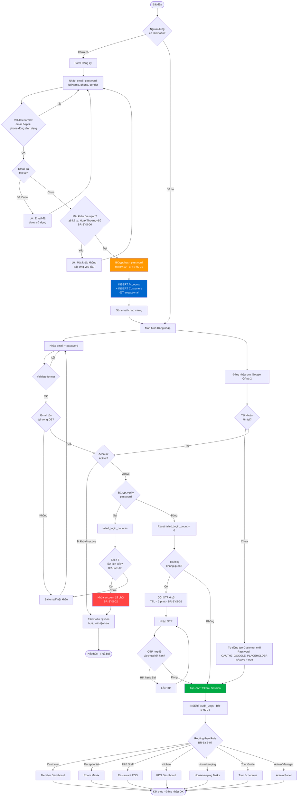

> **Business Rules áp dụng:**
>
> - `BR-SYS-01` — BCrypt hash password; AES-256 mã hóa CCCD
> - `BR-SYS-02` — Khóa 15 phút sau 5 lần sai; OTP TTL 3 phút; Google OAuth2 bỏ qua OTP
> - `BR-SYS-06` — Mật khẩu ≥ 8 ký tự, có Hoa + Thường + Số
> - `BR-SYS-07` — Routing theo RBAC role sau login


---

## WF-02 — Đặt phòng & Thanh toán Cọc trực tuyến

**Use Cases:** UC10, UC11, UC12.1
**Business Rules:** BR-FO-01, BR-FO-02, BR-FIN-06
**Actors:** Customer, System, VNPay Gateway

```mermaid
flowchart TD
    START([Khách tìm phòng]) --> B1[Nhập bộ lọc:\ncheckin / checkout / số khách]
    B1 --> B2{Validate ngày:\ncheckin >= hôm nay\ncheckout > checkin}
    B2 -->|Không hợp lệ| B1
    B2 -->|OK| B3[Query Room Availability\nSELECT...FOR UPDATE\nBR-FO-01]
    B3 --> B4{Có phòng\ntrống?}
    B4 -->|Không| NO_ROOM[Thông báo:\nHết phòng trong khoảng ngày]
    NO_ROOM --> DONE_NOROOM([Kết thúc])
    B4 -->|Có| B5[Hiển thị danh sách\nhạng phòng + giá Daily_Rates]

    B5 --> B6[Khách chọn hạng phòng\nvà số lượng phòng]
    B6 --> B7{Đã đăng nhập?}
    B7 -->|Chưa| B7L[Chuyển Login / Register]
    B7L --> B7
    B7 -->|Rồi| B8[Nhập: số khách,\nyêu cầu đặc biệt]

    B8 --> VOC{Nhập mã\nVoucher?}
    VOC -->|Có| VOC1[Kiểm tra Promotions:\nis_active, valid_to, max_uses\nBR-FIN-06]
    VOC1 -->|Hợp lệ| VOC2[Áp dụng giảm giá]
    VOC1 -->|Không hợp lệ| VOC_ERR[Lỗi: Voucher không\nhợp lệ hoặc hết hạn]
    VOC_ERR --> VOC
    VOC2 --> TOTAL
    VOC -->|Không| TOTAL[Tính tổng tiền\nvà tiền cọc 30%]

    TOTAL --> CONFIRM[Khách xác nhận\nthông tin booking]
    CONFIRM --> INS[INSERT Bookings status=Pending\n+ Room_Booking_Details]
    INS --> LOCK[Kích hoạt Cart Lock 2 phút\nBR-FO-02: TTL 2 phút]
    LOCK --> VNP[Tạo VNPay Payment URL\n+ HMAC Signature]
    VNP --> PAY_PAGE[Chuyển sang VNPay\nPayment Page]

    PAY_PAGE --> TIMEOUT{Khách thanh toán\ntrong 2 phút?}
    TIMEOUT -->|Quá 2 phút| SCHED[Scheduler phát hiện\nBooking Pending > 2 phút]
    SCHED --> CANCEL[UPDATE Bookings\nstatus = Cancelled]
    CANCEL --> FREE[Giải phóng Cart Lock]
    FREE --> NOTIFY_CANCEL[Thông báo: Booking hết hạn\ndo chưa thanh toán]
    NOTIFY_CANCEL --> DONE_TIMEOUT([Kết thúc - Hủy tự động])

    TIMEOUT -->|Trong 2 phút| VNPAY_PROC[VNPay xử lý giao dịch]
    VNPAY_PROC --> WEBHOOK{VNPay Webhook\nCallback}
    WEBHOOK -->|Thất bại| PAY_FAIL[Hiển thị lỗi thanh toán]
    PAY_FAIL --> PAY_PAGE
    WEBHOOK -->|Thành công| VERIFY[Verify HMAC Signature\nWebhook VNPay]
    VERIFY --> TX[INSERT Payment_Transactions\ntransaction_type=DEPOSIT]
    TX --> CONFIRMED[UPDATE Bookings\nstatus = Confirmed]
    CONFIRMED --> MAIL[Email xác nhận\nBooking thành công]
    MAIL --> DONE_OK([Kết thúc - Đặt phòng OK])

    style INS fill:#0066cc,color:#fff
    style LOCK fill:#ff9900,color:#fff
    style CANCEL fill:#ff4444,color:#fff
    style CONFIRMED fill:#00aa44,color:#fff
    style VERIFY fill:#ff9900,color:#fff
```

> **Business Rules áp dụng:**
>
> - `BR-FO-01` — SELECT...FOR UPDATE; @Version Optimistic Lock chống overbooking
> - `BR-FO-02` — Cart Lock 2 phút; Scheduler tự động hủy Booking Pending quá hạn
> - `BR-FIN-06` — 1 voucher/booking; kiểm tra is_active, valid_to, max_uses


---

## WF-03 — Check-in Tiền sảnh

**Use Cases:** UC12.2, UC12.3, UC12.4
**Business Rules:** BR-FO-03, BR-FO-04, BR-FO-06, BR-DATA-02
**Actors:** Receptionist, Customer

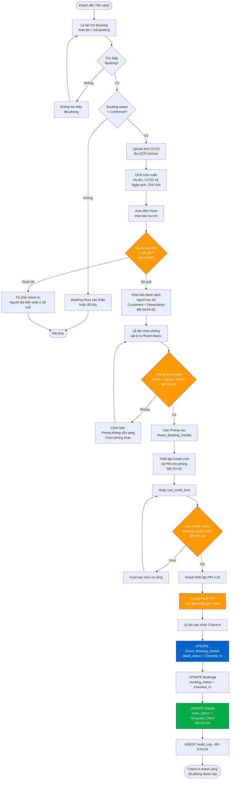

> **Business Rules áp dụng:**
>
> - `BR-FO-03` — Người đại diện ≥ 18 tuổi; xuất trình giấy tờ hợp lệ
> - `BR-FO-04` — Chỉ gán phòng Vacant_Clean; cập nhật → Occupied_Clean
> - `BR-FO-06` — sub_credit_limit ≤ credit_limit; BCrypt hash PIN
> - `BR-DATA-02` — Thu thập đủ: Họ tên, Ngày sinh, CCCD, Giới tính, Quốc tịch

---

## WF-04 — Check-out & Tổng hợp Hóa đơn

**Use Cases:** UC12.6, UC26.5, UC27.4
**Business Rules:** BR-FIN-01, BR-FO-04, BR-HK-01
**Actors:** Receptionist, Customer, System

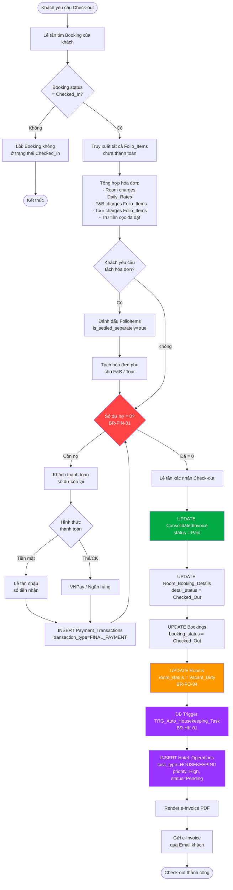

> **Business Rules áp dụng:**
>
> - `BR-FIN-01` — Số dư nợ phải = 0 trước khi cho phép check-out
> - `BR-FO-04` — Phòng chuyển sang Vacant_Dirty sau check-out
> - `BR-HK-01` — DB Trigger tự động tạo task dọn phòng priority = High

---

## WF-05 — F&B / POS / Ghi nợ Folio

**Use Cases:** UC14, UC16, UC17, UC18, UC19
**Business Rules:** BR-FB-01, BR-FB-02, BR-FB-04, BR-FO-06
**Actors:** Customer, F&B Staff, Kitchen Staff

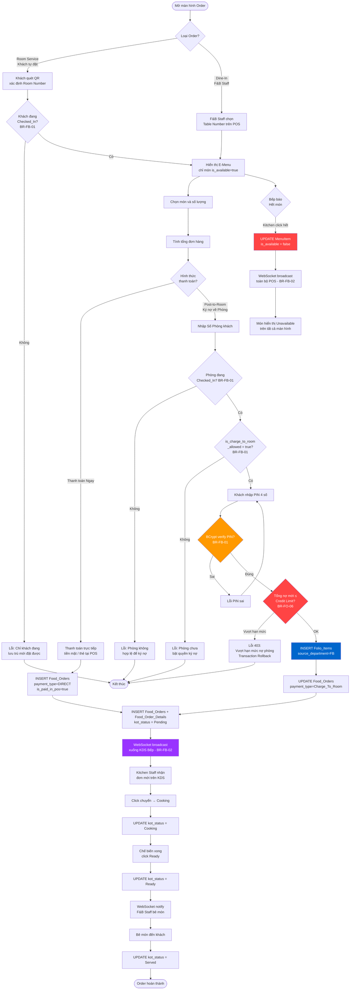

> **Business Rules áp dụng:**
>
> - `BR-FB-01` — Checked_In + is_charge_allowed + PIN verify + Credit Limit check
> - `BR-FB-02` — WebSocket broadcast KOT; real-time khi món hết hàng
> - `BR-FO-06` — TRG_Folio_Credit_Limit_Check rollback nếu vượt hạn mức

---

## WF-06 — Đặt Tour & Điểm danh AI

**Use Cases:** UC20, UC21, UC22
**Business Rules:** BR-TR-01, BR-TR-02, BR-TR-05
**Actors:** Customer, Tour Guide, Admin, System

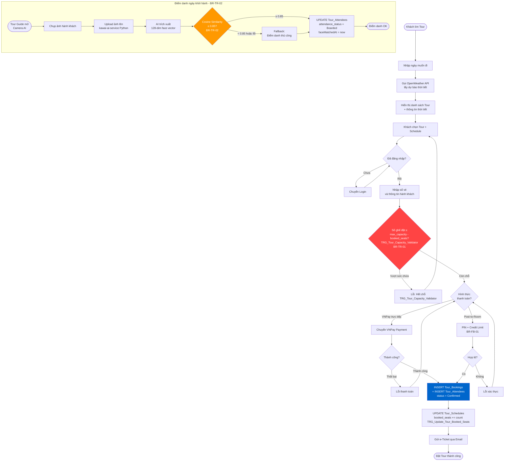

> **Business Rules áp dụng:**
>
> - `BR-TR-01` — TRG_Tour_Capacity_Validator chặn overbooking tour
> - `BR-TR-02` — Cosine Similarity ≥ 0.85; fallback manual điểm danh
> - `BR-TR-05` — Auto-cancel 24h trước nếu dưới ngưỡng min_participants

---

## WF-07 — Room Status Lifecycle

**Use Cases:** UC13
**Business Rules:** BR-FO-04, BR-FO-05, BR-HK-01, BR-HK-02
**Actors:** Housekeeping, Maintenance, Receptionist, System

### State Machine — Vòng đời Trạng thái Phòng

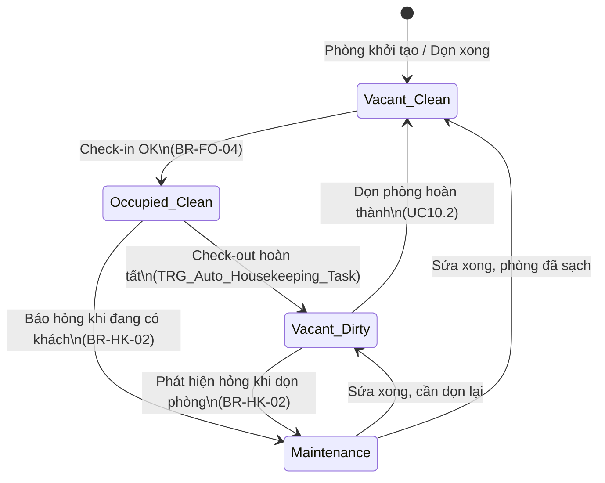

### Luồng chi tiết Housekeeping & Bảo trì

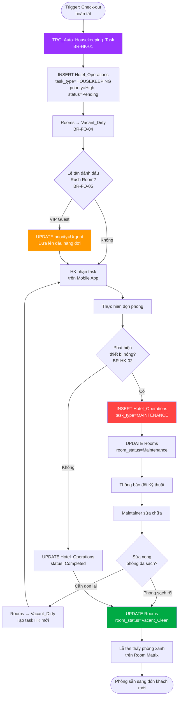

> **Business Rules áp dụng:**
>
> - `BR-FO-04` — Vòng đời phòng Vacant_Clean → Occupied → Vacant_Dirty → Vacant_Clean
> - `BR-FO-05` — Rush Room ưu tiên priority = Urgent
> - `BR-HK-01` — Trigger tự động tạo task dọn phòng sau check-out
> - `BR-HK-02` — Báo hỏng tự động chuyển phòng sang Maintenance

---

## WF-08 — Night Audit (Kiểm toán Đêm)

**Use Cases:** UC27.1, UC27.2
**Business Rules:** BR-FIN-03, BR-FIN-04
**Actors:** System (Automated Scheduler)

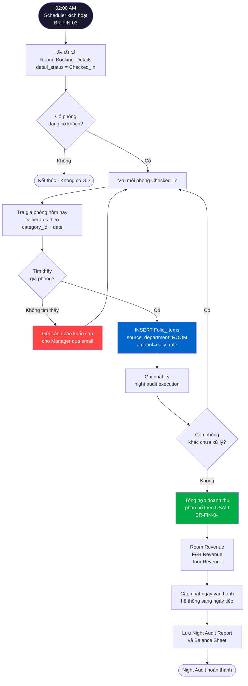

> **Business Rules áp dụng:**
>
> - `BR-FIN-03` — Chạy tự động lúc 02:00 AM; đóng sổ ngày; post room charges
> - `BR-FIN-04` — Phân bổ doanh thu theo USALI: Room / F&B / Tour

---

## WF-09 — Hủy Đặt phòng & Hoàn tiền

**Use Cases:** UC12 (Hủy đặt phòng), UC27
**Business Rules:** BR-FIN-02
**Actors:** Customer

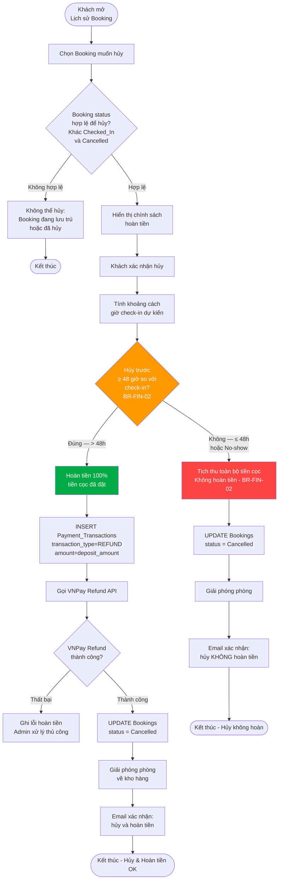

> **Business Rules áp dụng:**
>
> - `BR-FIN-02` — Hủy > 48h: hoàn 100%; Hủy ≤ 48h hoặc No-show: mất cọc

---

## WF-10 — Hủy Tour & Hoàn tiền Tự động

**Use Cases:** UC22.4, UC27
**Business Rules:** BR-TR-05
**Actors:** System (Scheduler), Admin, Tour Guide

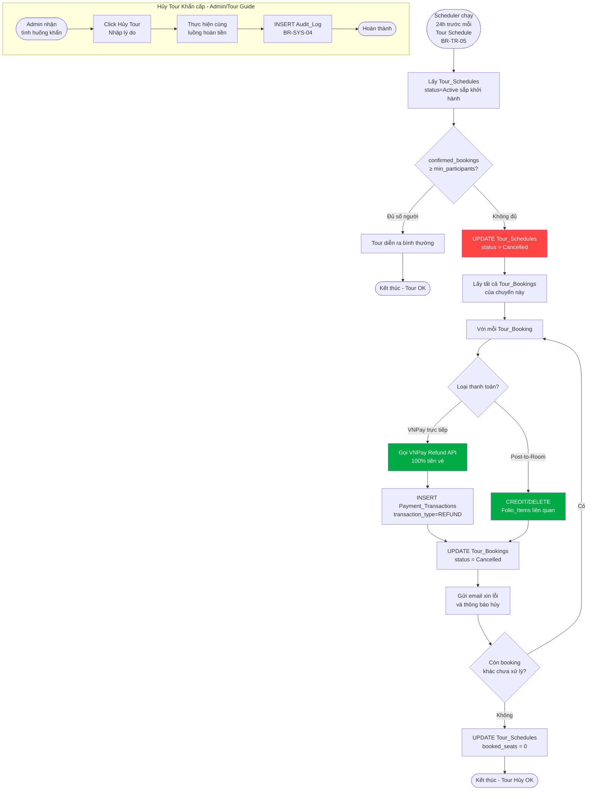

> **Business Rules áp dụng:**
>
> - `BR-TR-05` — Kiểm tra 24h trước; auto-cancel nếu < min_participants; hoàn 100%

---

## WF-11 — Đánh giá Dịch vụ & Kiểm duyệt

**Use Cases:** UC24, UC25
**Business Rules:** BR-TR-03, BR-TR-04, BR-SYS-04
**Actors:** Customer, Admin

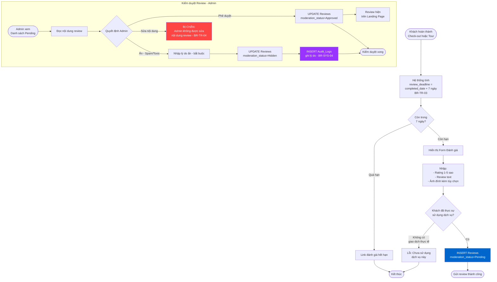

> **Business Rules áp dụng:**
>
> - `BR-TR-03` — Chỉ review trong 7 ngày sau hoàn thành dịch vụ
> - `BR-TR-04` — Admin CHỈ ẩn/hiện; không sửa nội dung; ghi audit log
> - `BR-SYS-04` — Mọi hành động kiểm duyệt phải ghi Audit_Logs

---

## WF-12 — Quản lý Nhân viên & Phân quyền

**Use Cases:** UC01.2, UC05.1, UC05.2
**Business Rules:** BR-SYS-04, BR-SYS-07, BR-DATA-03
**Actors:** Admin

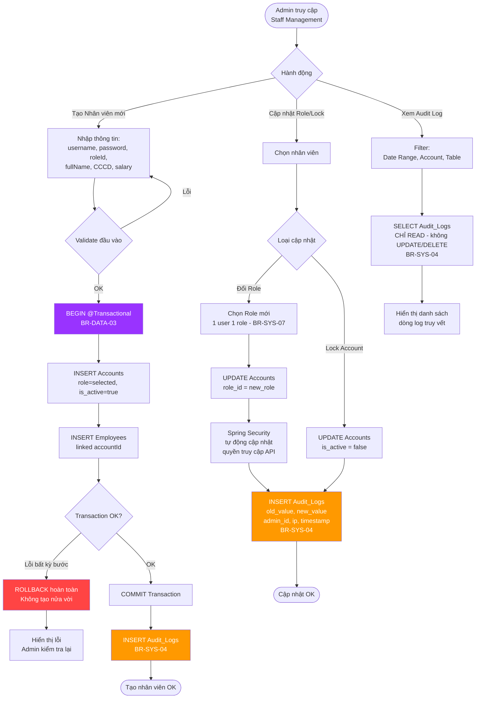

> **Business Rules áp dụng:**
>
> - `BR-SYS-07` — Mỗi nhân viên chỉ có 1 role; RBAC routing tự động
> - `BR-SYS-04` — Ghi Audit_Log cho mọi thay đổi phân quyền
> - `BR-DATA-03` — @Transactional bắt buộc khi tạo Account + Employee

---

## WF-13 — Master Flow — Vận hành Tổng thể
| WF-14 | [Walk-in Check-in](#wf-14--walk-in-check-in)                                       | Front Office   | CRITICAL |
| WF-15 | [Remote CCCD Scan](#wf-15--remote-cccd-scan)                                       | Front Office   |   HIGH   |
| WF-16 | [Tour Itinerary & GPS Checkpoint](#wf-16--tour-itinerary--gps-checkpoint)      | Tour           |   HIGH   |
| WF-17 | [Đổi Hạng Phòng](#wf-17--đổi-hạng-phòng)                                           | Front Office   |   HIGH   |
| WF-18 | [Membership Tier & Loyalty Points](#wf-18--membership-tier--loyalty-points)     | Membership     |  MEDIUM  |
| WF-19 | [Refund Request Flow (Manual)](#wf-19--refund-request-flow-manual)                 | Finance        |  MEDIUM  |
| WF-20 | [Add-On Hotel Service](#wf-20--add-on-hotel-service)                               | F&B            |  MEDIUM  |
| WF-21 | [Staff Scheduling](#wf-21--staff-scheduling)                                       | Admin          |  MEDIUM  |
| WF-22 | [Workflow Engine (Dynamic BPMN)](#wf-22--workflow-engine-dynamic-bpmn)             | System         |   HIGH   |
| WF-23 | [Đặt Bàn Trực Tuyến](#wf-23--đặt-bàn-trực-tuyến)                                 | F&B            |   HIGH   |
| WF-24 | [Hủy Đơn Hàng F&B & Hoàn Tiền](#wf-24--hủy-đơn-hàng-fb--hoàn-tiền)     | F&B            |   HIGH   |
| WF-25 | [Chốt Ca & Báo Cáo F&B](#wf-25--chốt-ca--báo-cáo-fb)                         | F&B            |   HIGH   |
| WF-26 | [Phê duyệt Thiết bị Vận hành](#wf-26--phê-duyệt-thiết-bị-vận-hành)               | Admin          |  MEDIUM  |

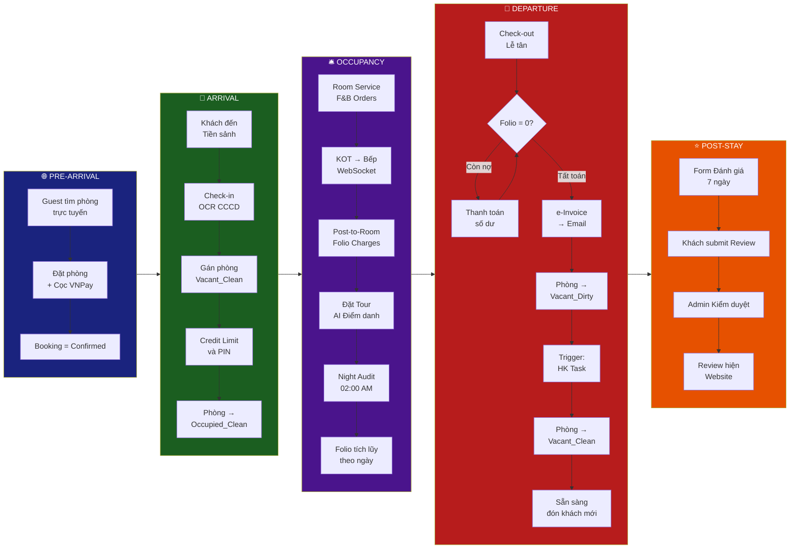

---

## WF-14 — Walk-in Check-in

**Use Cases:** Use Case "Walk-in Check-in"
**Business Rules:** BR-FO-08, BR-FO-03, BR-FO-04, BR-FO-06
**Actors:** Receptionist

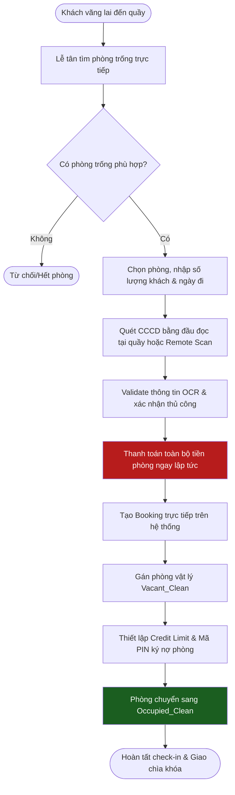

> **Business Rules áp dụng:**
>
> - `BR-FO-08` — Walk-in phải thanh toán ngay lập tức trước khi nhận phòng.
> - `BR-FO-04` — Chỉ gán phòng ở trạng thái Vacant_Clean.
> - `BR-FO-06` — Thiết lập hạn mức chi tiêu phụ (sub_credit_limit) và mã PIN.

---

## WF-15 — Remote CCCD Scan

**Use Cases:** Use Case "Remote CCCD Scan"
**Business Rules:** BR-FIN-07
**Actors:** Customer, Receptionist

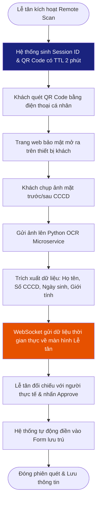

> **Business Rules áp dụng:**
>
> - `BR-FIN-07` — Dữ liệu CCCD được mã hóa AES-256; Phiên quét tự hủy sau TTL 2 phút để bảo mật.

---

## WF-16 — Tour Itinerary & GPS Checkpoint

**Use Cases:** Use Case "Tour Attendance & GPS Tracking"
**Business Rules:** BR-TR-02, BR-TR-06, BR-TR-07, BR-TR-08, BR-TR-09
**Actors:** Tour Guide, Tour Attendee, System

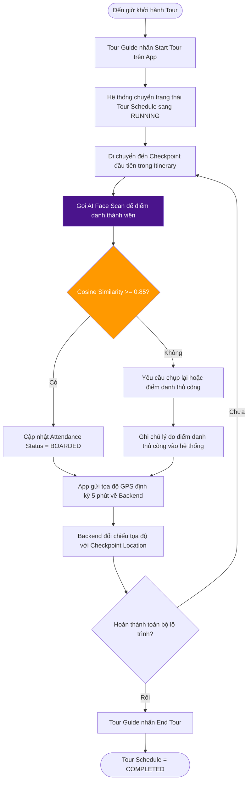

> **Business Rules áp dụng:**
>
> - `BR-TR-02` — Điểm danh AI Face Scan với ngưỡng khớp vector >= 0.85.
> - `BR-TR-06/07/08/09` — Đảm bảo định vị GPS chính xác, tuân thủ lịch trình và điểm danh tại mỗi trạm dừng.

---

## WF-17 — Đổi Hạng Phòng (Change Room Category)

**Use Cases:** Use Case "Change Room Category"
**Business Rules:** BR-FO-07, BR-FO-04
**Actors:** Receptionist, Customer

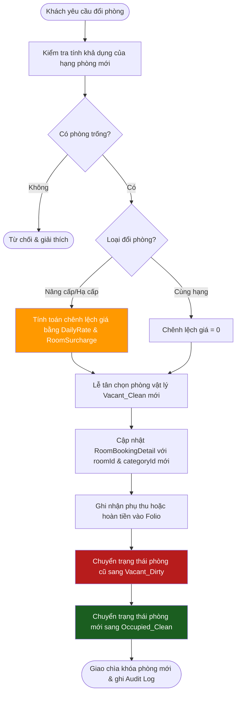

> **Business Rules áp dụng:**
>
> - `BR-FO-07` — Đổi hạng phòng phải tính toán phụ thu dựa trên daily_rates của hạng mới.
> - `BR-FO-04` — Phòng mới phải ở trạng thái Vacant_Clean.

---

## WF-18 — Membership Tier & Loyalty Points

**Use Cases:** Use Case "Membership Tier Calculation"
**Business Rules:** BR-MEM-01
**Actors:** System, Customer

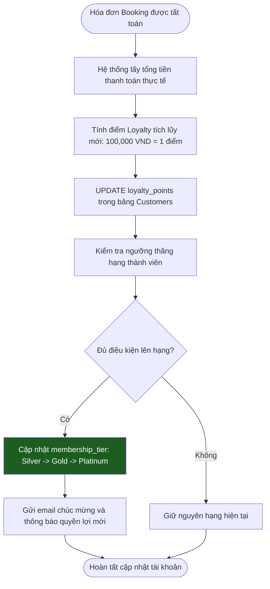

> **Business Rules áp dụng:**
>
> - `BR-MEM-01` — Tích điểm tự động dựa trên hóa đơn checkout và nâng hạng thành viên theo thang điểm cố định.

---

## WF-19 — Refund Request Flow (Manual)

**Use Cases:** Use Case "Refund Processing"
**Business Rules:** BR-FIN-08, BR-FIN-02
**Actors:** Receptionist, Manager, System

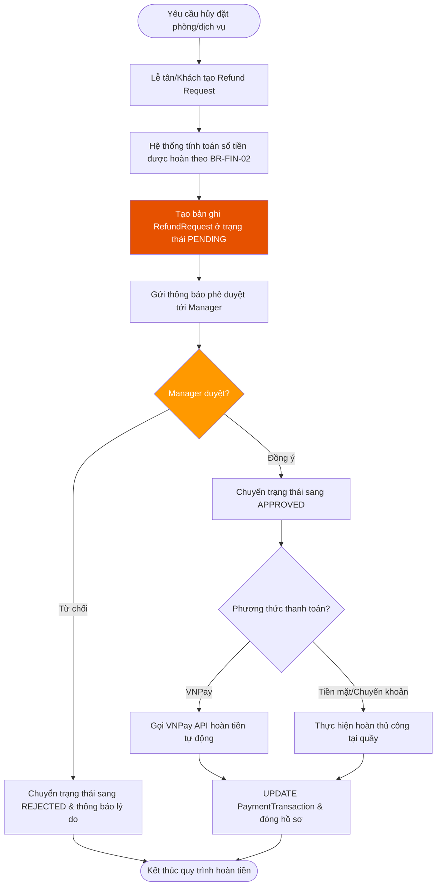

> **Business Rules áp dụng:**
>
> - `BR-FIN-02` — Quy định thời gian hủy phòng để tính tỷ lệ hoàn tiền (100% hoặc mất cọc).
> - `BR-FIN-08` — Mọi yêu cầu hoàn tiền thủ công phải được Manager phê duyệt trực tiếp.

---

## WF-20 — Add-On Hotel Service

**Use Cases:** Use Case "Add-On Service Order"
**Business Rules:** BR-FB-05, BR-FO-06
**Actors:** Customer, Receptionist, F&B Staff

```mermaid
flowchart TD
    START([Khách yêu cầu dịch vụ gia tăng]) --> S1[Tìm kiếm dịch vụ: Spa, Thuê xe, Hồ bơi...]
    S1 --> S2[Chọn dịch vụ & số lượng]
    S2 --> S3{Phương thức thanh toán?}
    S3 -->|Thanh toán ngay| S4[Tạo VNPay Payment Link hoặc thu tiền mặt]
    S4 --> S5[Giao dịch thành công -> Tạo BookingService]
    S3 -->|Ký nợ về phòng| S6[Xác thực mã PIN của phòng]
    S6 --> S7[Kiểm tra Credit Limit của phòng]
    S7 --> S8{Còn hạn mức?}
    S8 -->|Không| S9[Từ chối ký nợ, yêu cầu thanh toán ngay]
    S8 -->|Có| S10[Tạo FolioItem cho dịch vụ & cộng vào ví nợ phòng]
    S9 --> S3
    S5 & S10 --> END([Cung cấp dịch vụ & Ghi log])

    style S8 fill:#ff9900,color:#fff
```

> **Business Rules áp dụng:**
>
> - `BR-FB-05` — Quản lý dịch vụ gia tăng của khách sạn (Add-On Services).
> - `BR-FO-06` — Enforce Credit Limit khi ký nợ dịch vụ về phòng.

---

## WF-21 — Staff Scheduling

**Use Cases:** Use Case "Staff Shift Scheduling"
**Business Rules:** BR-STAFF-01
**Actors:** Manager, Admin, Employees

```mermaid
flowchart TD
    START([Manager truy cập Staff Scheduling]) --> S1[Chọn Tuần / Tháng cần lên lịch]
    S1 --> S2[Chọn nhân viên & gán vào Shift tương ứng]
    S2 --> S3[Hệ thống kiểm tra xung đột lịch trình]
    S3 --> S4{Có xung đột? \n(Overlapping/Double-booking)}
    S4 -->|Có| S5[Hiển thị cảnh báo xung đột & yêu cầu đổi lịch]
    S5 --> S2
    S4 -->|Không| S6[Lưu lịch làm việc ở trạng thái DRAFT]
    S6 --> S7[Manager nhấn Publish Schedule]
    S7 --> S8[Gửi thông báo lịch làm việc mới cho nhân viên]
    S8 --> END([Nhân viên xem lịch làm việc trên portal])

    style S4 fill:#ff9900,color:#fff
```

> **Business Rules áp dụng:**
>
> - `BR-STAFF-01` — Ràng buộc lịch làm việc của nhân viên, chống trùng lịch làm việc hoặc trùng chuyến đi tour.

---

## WF-22 — Workflow Engine (Dynamic BPMN)

**Use Cases:** Use Case "Workflow Configuration & Execution"
**Business Rules:** BR-WF-01, BR-WF-02, BR-SYS-09
**Actors:** System, Admin

```mermaid
flowchart TD
    START([Hệ thống phát sinh sự kiện]) --> S1[Workflow Engine nhận Event Signal]
    S1 --> S2[Tải cấu hình JSON của Workflow đang hoạt động]
    S2 --> S3[Phân tích điều kiện conditions_json]
    S3 --> S4{Điều kiện thỏa mãn?}
    S4 -->|Không| END_N([Bỏ qua & thực hiện luồng mặc định])
    S4 -->|Có| S5[Tạo tiến trình chạy Workflow Instance]
    S5 --> S6[Thực thi actions_json: chuyển trạng thái thành Pending_Approval]
    S6 --> S7[Gửi thông báo phê duyệt tới Manager/Admin]
    S7 --> S8{Approver duyệt?}
    S8 -->|Từ chối| S9[Chuyển trạng thái sang REJECTED & Rollback/Hủy]
    S8 -->|Phê duyệt| S10[Chuyển trạng thái sang APPROVED & Commit giao dịch]
    S9 & S10 --> END_S([Ghi nhật ký Workflow Instance và hoàn tất])

    style S4 fill:#ff9900,color:#fff
    style S8 fill:#ff9900,color:#fff
```

> **Business Rules áp dụng:**
>
> - `BR-SYS-09` — Chỉ Admin được cấu hình Workflow qua JSON.
> - `BR-WF-01/02` — Tự động hóa quy trình phê duyệt các giao dịch vượt hạn mức khuyến mãi hoặc ngoại lệ hệ thống.

---

## WF-23 — Đặt Bàn Trực Tuyến

<<<<<<< HEAD
<<<<<<< HEAD
**Use Cases:** UC21, UC16
**Business Rules:** TABLE-002, TABLE-003, TABLE-005, TABLE-008
=======
**Use Cases:** UC21, UC16  
**Business Rules:** TABLE-002, TABLE-003, TABLE-005, TABLE-008  
>>>>>>> 7414e299dc9443033140483710eb1236086b60de
=======
**Use Cases:** UC21, UC16
**Business Rules:** TABLE-002, TABLE-003, TABLE-005, TABLE-008
>>>>>>> origin/dev
**Actors:** Customer, F&B Staff, System

```mermaid
flowchart TD
    START([Khách tìm bàn ăn]) --> B1[Nhập số khách\nvà ngày giờ mong muốn]
    B1 --> B2[Hiển thị danh sách bàn\ntrạng thái Available]
    B2 --> B3[Khách chọn bàn và xác nhận]
    B3 --> V1{Số khách vượt\nCapacity bàn?\nTABLE-002}
    V1 -->|Vượt quá| E1[Lỗi: Số khách vượt\nsức chứa của bàn]
    E1 --> B2
    V1 -->|OK| V2{Thời gian bị\ntrùng lịch Overlap?\nTABLE-003}
    V2 -->|Trùng lịch| E2[Lỗi: Thời gian đặt bàn\nbị trùng lặp với lịch đã có]
    E2 --> B2
    V2 -->|OK| SAVE[INSERT Table_Reservations\nstatus = Confirmed]
    SAVE --> MAIL[Gửi Email xác nhận đặt bàn\nTABLE-008]
    MAIL --> DONE_OK([Đặt bàn thành công])

    subgraph ARRIVE["Khi khách đến nhà hàng"]
        A1([F&B Staff kiểm tra mã đặt bàn]) --> A2[UPDATE Table_Reservations\nstatus = Seated]
        A2 --> A3[UPDATE Restaurant_Tables\nstatus = Occupied]
        A3 --> A4([Check-in bàn hoàn tất])
    end

    style V1 fill:#ff9900,color:#fff
    style V2 fill:#ff4444,color:#fff
    style SAVE fill:#00aa44,color:#fff
    style MAIL fill:#0066cc,color:#fff
```

> **Business Rules áp dụng:**
<<<<<<< HEAD
<<<<<<< HEAD
>
=======
>>>>>>> 7414e299dc9443033140483710eb1236086b60de
=======
>
>>>>>>> origin/dev
> - `TABLE-002` — Không cho phép đặt bàn nếu số khách vượt quá sức chứa (capacity).
> - `TABLE-003` — Chặn đặt bàn nếu thời gian bị trùng lặp (Overlap) với lịch đã có.
> - `TABLE-008` — Gửi email xác nhận tự động sau khi đặt bàn thành công.

---

## WF-24 — Hủy Đơn Hàng F&B & Hoàn Tiền

<<<<<<< HEAD
<<<<<<< HEAD
**Use Cases:** UC19
**Business Rules:** POS-004, POS-006
=======
**Use Cases:** UC19  
**Business Rules:** POS-004, POS-006  
>>>>>>> 7414e299dc9443033140483710eb1236086b60de
=======
**Use Cases:** UC19
**Business Rules:** POS-004, POS-006
>>>>>>> origin/dev
**Actors:** Customer, F&B Staff, System

```mermaid
flowchart TD
    START([Yêu cầu Hủy Đơn Hàng]) --> Q1[Lấy thông tin Order từ hệ thống]
    Q1 --> Q2{Order đang\nPREPARING?\nPOS-004}
    Q2 -->|Có - Bếp đang nấu| ERR1[Lỗi 403: Không thể hủy\nđơn đang được chế biến]
    ERR1 --> DONE_FAIL([Kết thúc - Từ chối Hủy])

    Q2 -->|Không| Q3{Phương thức\nthanh toán?}

    Q3 -->|CHARGE_TO_ROOM| R1[Lấy Folio_Items\nliên kết với đơn hàng]
    R1 --> R2[DELETE Folio_Items\nhoàn lại Credit Limit cho phòng]
    R2 --> R3[Cập nhật sub_credit_limit\ncộng lại số tiền đã ghi nợ]
    R3 --> CANCEL

    Q3 -->|VNPay| V1[Tính số tiền đã thanh toán]
    V1 --> V2[Gọi VNPay Refund API\ntạo RefundRequest]
    V2 --> V3{Refund\nthành công?}
    V3 -->|Thất bại| ERR2[Ghi lỗi Refund\nAdmin xử lý thủ công]
    ERR2 --> DONE_FAIL
    V3 -->|Thành công| CANCEL

    Q3 -->|Chưa thanh toán| CANCEL

    CANCEL[UPDATE Food_Orders\norder_status = Cancelled] --> KOT[UPDATE Food_Order_Details\nkot_status = Cancelled]
    KOT --> WS[WebSocket broadcast\nHủy KOT xuống bếp - BR-FB-02]
    WS --> DONE_OK([Hủy đơn thành công])

    style Q2 fill:#ff4444,color:#fff
    style R2 fill:#0066cc,color:#fff
    style V2 fill:#0066cc,color:#fff
    style CANCEL fill:#ff9900,color:#fff
    style WS fill:#9933ff,color:#fff
```

> **Business Rules áp dụng:**
<<<<<<< HEAD
<<<<<<< HEAD
>
=======
>>>>>>> 7414e299dc9443033140483710eb1236086b60de
=======
>
>>>>>>> origin/dev
> - `POS-004` — Không được hủy đơn nếu trạng thái đang là `PREPARING` (bếp đang nấu).
> - `POS-006` — Đảm bảo tính nhất quán hoàn tiền: Charge-to-Room xóa Folio; VNPay gọi Refund API.

---

## WF-25 — Chốt Ca & Báo Cáo F&B

<<<<<<< HEAD
<<<<<<< HEAD
**Use Cases:** UC18
**Business Rules:** BR-FIN-15, BR-SYS-04
=======
**Use Cases:** UC18  
**Business Rules:** BR-FIN-15, BR-SYS-04  
>>>>>>> 7414e299dc9443033140483710eb1236086b60de
=======
**Use Cases:** UC18
**Business Rules:** BR-FIN-15, BR-SYS-04
>>>>>>> origin/dev
**Actors:** F&B Manager

```mermaid
flowchart TD
    START([F&B Manager bấm Chốt Ca]) --> S1[Nhập ngày cần chốt\nMặc định: hôm nay]
    S1 --> S2{Ngày này đã\nchốt trước đó?\nIdempotent Guard}
    S2 -->|Đã chốt rồi| ERR1[Lỗi: Báo cáo ngày\nhôm nay đã được chốt]
    ERR1 --> DONE_FAIL([Kết thúc - Bị chặn])

    S2 -->|Chưa chốt| S3[Query toàn bộ Food_Orders\ncủa ngày được chọn]
    S3 --> S4[Lọc đơn hàng\nis_paid_in_pos = true\nBR-FIN-15]
    S4 --> S5[Tính tổng doanh thu\ntotal_revenue = SUM đơn đã lọc]
    S5 --> S6[INSERT FnB_Daily_Reports\nLưu Snapshot cố định]
    S6 --> AUDIT[INSERT Audit_Logs\nghi nhận hành động chốt ca\nBR-SYS-04]
    AUDIT --> DONE_OK([Chốt ca thành công])

    style S2 fill:#ff9900,color:#fff
    style S4 fill:#ff9900,color:#fff
    style S6 fill:#00aa44,color:#fff
    style AUDIT fill:#9933ff,color:#fff
```

<<<<<<< HEAD
<<<<<<< HEAD
=======
>>>>>>> origin/dev
> **Business Rules áp dụng:**
>
> - `BR-FIN-15` — Báo cáo doanh thu chỉ tính đơn hàng `isPaidInPos = true`.
> - Idempotent: 1 ngày chỉ được chốt 1 lần duy nhất, tránh ghi đúp dữ liệu.
> - `BR-SYS-04` — Mọi hành động chốt ca ảnh hưởng tài chính phải ghi Audit_Logs.

<<<<<<< HEAD
## WF-26 — Phê duyệt Thiết bị Vận hành (Ops Device Authorization)

**Use Cases:** UC05.4
**Business Rules:** BR-SYS-02, BR-SYS-04
=======
## WF-26 — Phê duyệt Thiết bị Vận hành (Ops Device Authorization)

**Use Cases:** UC05.4  
**Business Rules:** BR-SYS-02, BR-SYS-04  
>>>>>>> 7414e299dc9443033140483710eb1236086b60de
=======
## WF-26 — Phê duyệt Thiết bị Vận hành (Ops Device Authorization)

**Use Cases:** UC05.4
**Business Rules:** BR-SYS-02, BR-SYS-04
>>>>>>> origin/dev
**Actors:** Admin, Toàn bộ nhân viên Ops, System

```mermaid
flowchart TD
    START([Nhân viên đăng nhập /ops-login]) --> S1[Nhập username + password\n+ gửi device_id tự động]
    S1 --> S2{Tài khoản thuộc\nnhóm Ops/Nhân viên?\nROLE_ADMIN, ROLE_RECEPTIONIST...}
    S2 -->|Không - Là Khách| S3[Bỏ qua check thiết bị\nĐăng nhập theo luồng thường]
    S3 --> DONE_FAIL([Đăng nhập OK])
<<<<<<< HEAD
<<<<<<< HEAD
  
    S2 -->|Có - Là Ops| S4{Thiết bị device_id\nđã được đăng ký?}
    S4 -->|Chưa đăng ký| S5[Hệ thống tự động đăng ký thiết bị\nisApproved = true - Chạy Dev]
    S5 --> DONE_OK([Đăng nhập thành công])
  
=======
    
    S2 -->|Có - Là Ops| S4{Thiết bị device_id\nđã được đăng ký?}
    S4 -->|Chưa đăng ký| S5[Hệ thống tự động đăng ký thiết bị\nisApproved = true - Chạy Dev]
    S5 --> DONE_OK([Đăng nhập thành công])
    
>>>>>>> 7414e299dc9443033140483710eb1236086b60de
=======
  
    S2 -->|Có - Là Ops| S4{Thiết bị device_id\nđã được đăng ký?}
    S4 -->|Chưa đăng ký| S5[Hệ thống tự động đăng ký thiết bị\nisApproved = true - Chạy Dev]
    S5 --> DONE_OK([Đăng nhập thành công])
  
>>>>>>> origin/dev
    S4 -->|Đã đăng ký| S6{Được duyệt?\nisApproved = true}
    S6 -->|Đã duyệt| DONE_OK
    S6 -->|Chưa duyệt/Bị khóa| S7["Hủy Session và Logout ngay lập tức\nrequest.getSession().invalidate()"]
    S7 --> S8[Redirect về /ops-login\nHiển thị lỗi thiết bị không được cấp phép]
    S8 --> DONE_FAIL

    subgraph ADMIN_CONTROL["Quản lý Thiết bị - Admin"]
        A1([Admin vào Device Management]) --> A2[Xem danh sách thiết bị Ops]
        A2 --> ACT{Hành động}
        ACT -->|Duyệt/Khóa| A3[UPDATE AuthorizedDevice\nisApproved = !isApproved]
        ACT -->|Xóa| A4[DELETE AuthorizedDevice]
        A3 & A4 --> AUDIT[INSERT Audit_Logs\nBR-SYS-04]
    end

    style S6 fill:#ff9900,color:#fff
    style S7 fill:#ff4444,color:#fff
    style S5 fill:#00aa44,color:#fff
    style A3 fill:#ff9900,color:#fff
    style A4 fill:#ff4444,color:#fff
```

> **Business Rules áp dụng:**
<<<<<<< HEAD
<<<<<<< HEAD
>
=======
>>>>>>> 7414e299dc9443033140483710eb1236086b60de
=======
>
>>>>>>> origin/dev
> - `BR-SYS-02` — Chỉ thiết bị Ops được phê duyệt (Approved) mới có quyền duy trì Session làm việc.
> - `BR-SYS-04` — Ghi log mọi hành động thay đổi quyền phê duyệt thiết bị của Admin.

---

## Bảng Tóm tắt — Tất cả Workflows

<<<<<<< HEAD
<<<<<<< HEAD
=======
>>>>>>> origin/dev
| Workflow                                | UC Liên quan                  | Business Rules chính           | Actors                 | Mức độ |
| :-------------------------------------- | :----------------------------- | :------------------------------ | :--------------------- | :-------: |
| WF-01 Xác thực & Đăng ký           | UC01, UC02, UC03               | BR-SYS-01,02,06,07              | Guest, All Users       |   HIGH   |
| WF-02 Đặt phòng & Cọc               | UC10, UC11, UC12.1             | BR-FO-01,02; BR-FIN-06          | Customer, System       | CRITICAL |
| WF-03 Check-in                          | UC12.2, UC12.3, UC12.4         | BR-FO-03,04,06; BR-DATA-02      | Receptionist           | CRITICAL |
| WF-04 Check-out & Invoice               | UC12.6, UC26.5, UC27.4         | BR-FIN-01; BR-FO-04; BR-HK-01   | Receptionist           | CRITICAL |
| WF-05 F&B / Post-to-Room                | UC14, UC16, UC17, UC18, UC19   | BR-FB-01,02,04; BR-FO-06        | Customer, F&B, Kitchen | CRITICAL |
| WF-06 Tour & AI Attendance              | UC20, UC21, UC22               | BR-TR-01,02,05                  | Customer, Tour Guide   | CRITICAL |
| WF-07 Room Lifecycle                    | UC13                           | BR-FO-04,05; BR-HK-01,02        | HK, Maintenance        |   HIGH   |
| WF-08 Night Audit                       | UC27.1, UC27.2                 | BR-FIN-03,04                    | System (Scheduler)     | CRITICAL |
| WF-09 Hủy Phòng & Hoàn tiền         | UC12 (Hủy đặt phòng), UC27 | BR-FIN-02                       | Customer               |   HIGH   |
| WF-10 Hủy Tour & Hoàn tiền           | UC22.4, UC27                   | BR-TR-05                        | System, Admin          |   HIGH   |
| WF-11 Review & Kiểm duyệt             | UC24, UC25                     | BR-TR-03,04; BR-SYS-04          | Customer, Admin        |  MEDIUM  |
| WF-12 Quản lý Nhân viên             | UC01.2, UC05.1, UC05.2         | BR-SYS-04,07; BR-DATA-03        | Admin                  |   HIGH   |
| WF-13 Master Flow                       | All                            | All                             | All Actors             |    —    |
<<<<<<< HEAD
| WF-14 Walk-in Check-in                  | UC12.7                         | BR-FO-08                        | Receptionist           | CRITICAL |
| WF-15 Remote CCCD Scan                  | UC04.2, UC12.3                 | BR-FIN-07                       | Customer               |   HIGH   |
| WF-16 Tour GPS & Itinerary              | UC22.3, UC22.4                 | BR-TR-06,07,08,09               | Tour Guide             |   HIGH   |
| WF-17 Đổi Hạng Phòng                | UC12.5, UC09.3                 | BR-FO-07                        | Receptionist           |   HIGH   |
| WF-18 Membership Tier & Loyalty         | UC26.6                         | BR-MEM-01                       | System                 |  MEDIUM  |
| WF-19 Refund Request                    | UC27                           | BR-FIN-08                       | Manager                |  MEDIUM  |
| WF-20 Add-On Services                   | UC23                           | BR-FB-05                        | Customer               |  MEDIUM  |
| WF-21 Staff Scheduling                  | UC22.2                         | BR-STAFF-01                     | Admin, Manager         |  MEDIUM  |
| WF-22 Workflow Engine                   | UC09.8                         | BR-WF-01,02                     | System, Admin          |   HIGH   |
| WF-23 Đặt bàn trực tuyến           | UC21, UC16                     | TABLE-002, TABLE-003, TABLE-008 | Customer, F&B Staff    |   HIGH   |
| WF-24 Hủy đơn F&B & Hoàn tiền      | UC19                           | POS-004, POS-006                | Customer, F&B Staff    |   HIGH   |
| WF-25 Chốt ca & Báo cáo F&B          | UC18                           | BR-FIN-15, BR-SYS-04            | F&B Manager            |   HIGH   |
| WF-26 Phê duyệt Thiết bị Vận hành | UC05.4                         | BR-SYS-02, BR-SYS-04            | Admin                  |  MEDIUM  |
=======
| Workflow | UC Liên quan | Business Rules chính | Actors | Mức độ |
|:---------|:------------|:--------------------|:-------|:------:|
| WF-01 Xác thực & Đăng ký | UC01, UC02, UC03 | BR-SYS-01,02,06,07 | Guest, All Users | HIGH |
| WF-02 Đặt phòng & Cọc | UC10, UC11, UC12.1 | BR-FO-01,02; BR-FIN-06 | Customer, System | CRITICAL |
| WF-03 Check-in | UC12.2, UC12.3, UC12.4 | BR-FO-03,04,06; BR-DATA-02 | Receptionist | CRITICAL |
| WF-04 Check-out & Invoice | UC12.6, UC26.5, UC27.4 | BR-FIN-01; BR-FO-04; BR-HK-01 | Receptionist | CRITICAL |
| WF-05 F&B / Post-to-Room | UC14, UC16, UC17, UC18, UC19 | BR-FB-01,02,04; BR-FO-06 | Customer, F&B, Kitchen | CRITICAL |
| WF-06 Tour & AI Attendance | UC20, UC21, UC22 | BR-TR-01,02,05 | Customer, Tour Guide | CRITICAL |
| WF-07 Room Lifecycle | UC13 | BR-FO-04,05; BR-HK-01,02 | HK, Maintenance | HIGH |
| WF-08 Night Audit | UC27.1, UC27.2 | BR-FIN-03,04 | System (Scheduler) | CRITICAL |
| WF-09 Hủy Phòng & Hoàn tiền | UC12 (Hủy đặt phòng), UC27 | BR-FIN-02 | Customer | HIGH |
| WF-10 Hủy Tour & Hoàn tiền | UC22.4, UC27 | BR-TR-05 | System, Admin | HIGH |
| WF-11 Review & Kiểm duyệt | UC24, UC25 | BR-TR-03,04; BR-SYS-04 | Customer, Admin | MEDIUM |
| WF-12 Quản lý Nhân viên | UC01.2, UC05.1, UC05.2 | BR-SYS-04,07; BR-DATA-03 | Admin | HIGH |
| WF-13 Master Flow | All | All | All Actors | — |
| WF-14 Walk-in Check-in | UC12.7 | BR-FO-08 | Receptionist | CRITICAL |
| WF-15 Remote CCCD Scan | UC04.2, UC12.3 | BR-FIN-07 | Customer | HIGH |
| WF-16 Tour GPS & Itinerary | UC22.3, UC22.4 | BR-TR-06,07,08,09 | Tour Guide | HIGH |
| WF-17 Đổi Hạng Phòng | UC12.5, UC09.3 | BR-FO-07 | Receptionist | HIGH |
| WF-18 Membership Tier & Loyalty | UC26.6 | BR-MEM-01 | System | MEDIUM |
| WF-19 Refund Request | UC27 | BR-FIN-08 | Manager | MEDIUM |
| WF-20 Add-On Services | UC23 | BR-FB-05 | Customer | MEDIUM |
| WF-21 Staff Scheduling | UC22.2 | BR-STAFF-01 | Admin, Manager | MEDIUM |
| WF-22 Workflow Engine | UC09.8 | BR-WF-01,02 | System, Admin | HIGH |
| WF-23 Đặt bàn trực tuyến | UC21, UC16 | TABLE-002, TABLE-003, TABLE-008 | Customer, F&B Staff | HIGH |
| WF-24 Hủy đơn F&B & Hoàn tiền | UC19 | POS-004, POS-006 | Customer, F&B Staff | HIGH |
| WF-25 Chốt ca & Báo cáo F&B | UC18 | BR-FIN-15, BR-SYS-04 | F&B Manager | HIGH |
| WF-26 Phê duyệt Thiết bị Vận hành | UC05.4 | BR-SYS-02, BR-SYS-04 | Admin | MEDIUM |
>>>>>>> 7414e299dc9443033140483710eb1236086b60de
=======
| WF-14 | [Walk-in Check-in](#wf-14--walk-in-check-in)                                       | Front Office   | CRITICAL |
| WF-15 | [Remote CCCD Scan](#wf-15--remote-cccd-scan)                                       | Front Office   |   HIGH   |
| WF-16 | [Tour Itinerary & GPS Checkpoint](#wf-16--tour-itinerary--gps-checkpoint)      | Tour           |   HIGH   |
| WF-17 | [Đổi Hạng Phòng](#wf-17--đổi-hạng-phòng)                                           | Front Office   |   HIGH   |
| WF-18 | [Membership Tier & Loyalty Points](#wf-18--membership-tier--loyalty-points)     | Membership     |  MEDIUM  |
| WF-19 | [Refund Request Flow (Manual)](#wf-19--refund-request-flow-manual)                 | Finance        |  MEDIUM  |
| WF-20 | [Add-On Hotel Service](#wf-20--add-on-hotel-service)                               | F&B            |  MEDIUM  |
| WF-21 | [Staff Scheduling](#wf-21--staff-scheduling)                                       | Admin          |  MEDIUM  |
| WF-22 | [Workflow Engine (Dynamic BPMN)](#wf-22--workflow-engine-dynamic-bpmn)             | System         |   HIGH   |
| WF-23 | [Đặt Bàn Trực Tuyến](#wf-23--đặt-bàn-trực-tuyến)                                 | F&B            |   HIGH   |
| WF-24 | [Hủy Đơn Hàng F&B & Hoàn Tiền](#wf-24--hủy-đơn-hàng-fb--hoàn-tiền)     | F&B            |   HIGH   |
| WF-25 | [Chốt Ca & Báo Cáo F&B](#wf-25--chốt-ca--báo-cáo-fb)                         | F&B            |   HIGH   |
| WF-26 | [Phê duyệt Thiết bị Vận hành](#wf-26--phê-duyệt-thiết-bị-vận-hành)               | Admin          |  MEDIUM  |
>>>>>>> origin/dev

---

*Tài liệu Business Workflows được xây dựng từ BusinessRule.md và RequirementsTraceabilityMatrix.md của dự án **Kawai Retreat Resort & Hub**, Group 2 — SWP391 SE2023.*
