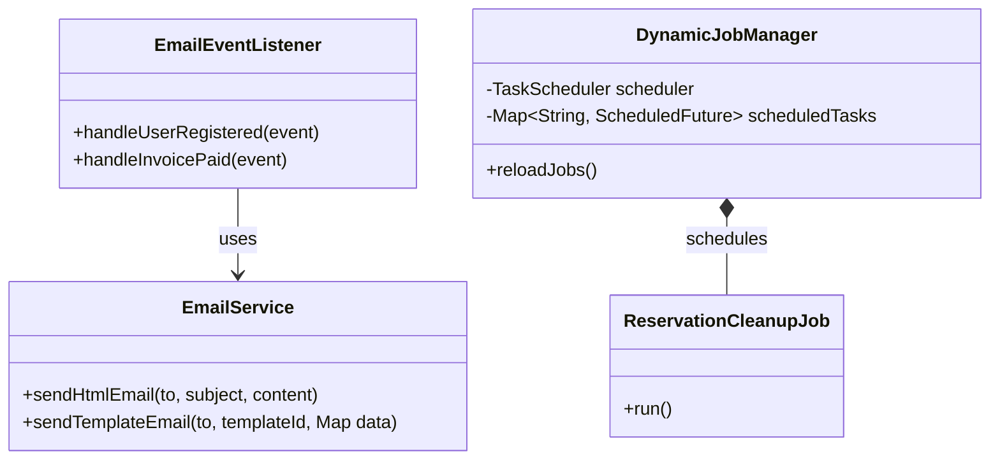
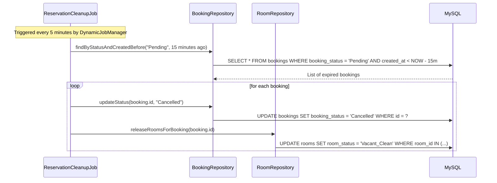

# ENGINEERING DOCUMENTATION STANDARD (EDS) v2.0
## MOD6 — Hệ thống & Tích hợp (System Integration & Automation Engine)

| Field | Value |
|---|---|
| **Document ID** | `KAWAI-MOD6-IMP-001` |
| **Version** | 2.0 |
| **Date** | 2026-07-02 |
| **Status** | Approved |
| **Document Owner** | Team Lead — Group 2 SWP391 |
| **Author** | Senior Backend Developer / System Architect |
| **Based on EDS** | v2.0 |
| **RTM Ref** | MOD6: Core System & Integration |
| **ADR Ref** | ADR-01 — Kiến trúc Spring Boot MVC Layered |

---

### MỤC LỤC
1. [Tổng quan Module](#1-tổng-quan-module)
2. [Ma trận Truy vết](#2-ma-trận-truy-vết-traceability-matrix)
3. [Architecture Decision Records (ADR)](#3-architecture-decision-records-adr)
4. [Non-Functional Requirements & SLA](#4-non-functional-requirements--sla)
5. [Static Modeling — Mô hình Tĩnh](#5-static-modeling--mô-hình-tĩnh)
6. [Dynamic Modeling — Mô hình Động](#6-dynamic-modeling--mô-hình-động)
7. [Domain Event Catalog](#7-domain-event-catalog)
8. [Interface Specification](#8-interface-specification)
9. [Internal Workflow Specification](#9-internal-workflow-specification)
10. [Bảng mã lỗi (Error Codes)](#10-bảng-mã-lỗi-error-codes)
11. [Kế hoạch Triển khai Full-Stack](#11-kế-hoạch-triển-khai-full-stack-step-by-step)
12. [Rollback & Incident Runbook](#12-rollback--incident-runbook)
13. [TDD — Test Case Specification](#13-tdd--test-case-specification)
14. [Phương pháp Xác minh](#14-phương-pháp-xác-minh)
15. [API Verification Samples](#15-api-verification-samples)
16. [Authorization Matrix](#16-authorization-matrix)

---

## 1. Tổng quan Module

**MOD6** cung cấp hạ tầng chạy ngầm và tích hợp dịch vụ bên thứ ba cho hệ thống Kawai Retreat. Nhiệm vụ cốt lõi bao gồm:
* **Asynchronous Notification Service:** Gửi Email xác nhận, e-Invoice, mã OTP bất đồng bộ, tránh làm chậm luồng nghiệp vụ của Client.
* **Dynamic Cronjob Engine:** Quản lý cấu hình chạy ngầm (ví dụ: tự động giải phóng phòng giữ chỗ sau 15 phút chưa thanh toán cọc - Cart Lock).
* **Webhook & API Integration:** Xử lý IPN từ cổng thanh toán VNPay và kết nối Microservices phụ trợ (Python OCR cho CCCD).

| Field | Value |
|---|---|
| **Module Name** | `Core Integration & Scheduler Engine` |
| **Bounded Context** | Infrastructure Bounded Context |
| **Data Classification** | Technical Meta-data (API keys, Cron configurations) |
| **Primary Actor** | `System Scheduler`, `Domain Event Listener` |
| **Downstream Consumers** | MOD1 (Gửi OTP), MOD2 (Hủy phòng hết hạn), MOD5 (Email hóa đơn) |

---

## 2. Ma trận Truy vết (Traceability Matrix)

| Requirement ID | Loại | Mô tả yêu cầu | Thành phần Code | ADR liên quan |
|:---|:---|:---|:---|:---|
| **BR-FO-02** | Business Rule | Hủy Booking Pending sau 15 phút (Cart Lock) | `ReservationCleanupJob.java` | ADR-01 |
| **BR-FB-03** | Business Rule | Tự động hủy bàn F&B no-show | `PosAutoCancelJob.java` | ADR-01 |
| **UC29** | Use Case | Hệ thống email thông báo giao dịch | `EmailServiceImpl.java` | ADR-01 |
| **UC30** | Use Case | Scheduled Jobs cấu hình động qua database | `DynamicJobManager.java` | ADR-01 |
| **NF-03** | Non-Functional| Tách tiến trình gửi email ra khỏi Thread chính | `@Async`, `ThreadPoolTaskExecutor` | ADR-01 |

---

## 3. Architecture Decision Records (ADR)

Áp dụng **ADR-01**:
* **Xử lý bất đồng bộ (Async):** Kích hoạt `@EnableAsync` với một cấu hình Thread Pool chuyên dụng để đảm bảo khi gọi Mail Service không gây nghẽn Connection Pool của API chính.
* **Kiểm toán đêm (Night Audit):** Một Scheduled Task tự động chạy lúc 02:00 sáng hàng ngày để kết toán phòng, đồng bộ hóa đơn và reset các hạn mức hàng ngày.

---

## 4. Non-Functional Requirements & SLA

| Category | Requirement | Target SLA | Verification |
|:---|:---|:---|:---|
| **Performance** | API chính trả về sau khi phát hành Event | < 100ms | JMeter Load Test |
| **Reliability** | Tự động gửi lại email khi gặp sự cố mạng | Thử lại tối đa 3 lần | Unit Test với Mockito |
| **Throughput**  | Xử lý đồng thời số lượng tác vụ gửi mail | 500 mail/phút | Load test |

---

## 5. Static Modeling — Mô hình Tĩnh

### 5.1 Database Entity Schema
```sql
CREATE TABLE IF NOT EXISTS cron_configs (
    id BIGINT AUTO_INCREMENT PRIMARY KEY,
    job_name VARCHAR(100) NOT NULL UNIQUE,
    cron_expression VARCHAR(50) NOT NULL,
    description VARCHAR(255),
    is_active BOOLEAN DEFAULT TRUE,
    updated_at TIMESTAMP DEFAULT CURRENT_TIMESTAMP ON UPDATE CURRENT_TIMESTAMP
);

CREATE TABLE IF NOT EXISTS email_logs (
    id BIGINT AUTO_INCREMENT PRIMARY KEY,
    recipient_email VARCHAR(150) NOT NULL,
    subject VARCHAR(200),
    status VARCHAR(20) NOT NULL, -- 'SUCCESS', 'FAILED', 'PENDING'
    retry_count INT DEFAULT 0,
    error_message TEXT,
    created_at TIMESTAMP DEFAULT CURRENT_TIMESTAMP
);
```

### 5.2 Class Diagram


---

## 6. Dynamic Modeling — Mô hình Động

### 6.1 Tiến trình Hủy Booking hết hạn và giải phóng Phòng giữ chỗ (Cronjob)



---

## 7. Domain Event Catalog

| Event Name | Source | Payload | Async Listener | Target Action |
|:---|:---|:---|:---|:---|
| `UserRegisteredEvent` | MOD1 (Auth) | `email`, `fullName` | `onUserRegistered` | Gửi Email chào mừng kèm thông tin kích hoạt |
| `BookingConfirmedEvent` | MOD2 (FO) | `bookingId`, `email` | `onBookingConfirmed` | Gửi email xác nhận đặt phòng + file PDF đính kèm |
| `InvoicePaidEvent` | MOD5 (Finance)| `invoiceId`, `amount`, `email`| `onInvoicePaid` | Gửi hóa đơn điện tử VAT đính kèm |

---

## 8. Interface Specification

```java
// src/main/java/com/kawai/services/interfaces/IEmailService.java
public interface IEmailService {
    void sendHtmlEmail(String to, String subject, String htmlContent);
    void sendTemplateEmail(String to, String templateId, Map<String, Object> templateData);
}

// src/main/java/com/kawai/services/interfaces/IJobManagerService.java
public interface IJobManagerService {
    void scheduleAllJobs();
    void updateCronExpression(String jobName, String newCron);
}
```

---

## 9. Internal Workflow Specification
* **Night Audit Workflow:** 
  1. `CronTrigger` chạy vào lúc 02:00 AM mỗi đêm.
  2. Quét các phòng đang có khách (`Checked_In`).
  3. Cộng phí phòng của đêm đó vào `Folio_Items` của khách.
  4. Đánh dấu `is_posted_today = true` cho record của ngày hôm đó.

---

## 10. Bảng mã lỗi (Error Codes)

| Code | HTTP | Message EN | Message VI | Trigger |
|:---|:---|:---|:---|:---|
| `SYS-001` | 500 | Email dispatch failed | Lỗi kết nối cổng gửi email | Không thể kết nối API của SendGrid |
| `SYS-002` | 400 | Invalid cron expression | Định dạng Cron Expression không hợp lệ | Cấu hình sai ký tự đặc biệt của cron |

---

## 11. Kế hoạch Triển khai Full-Stack (Step-by-Step)

### 11.1 Prerequisites
- [x] Đăng ký API Key trên SendGrid.
- [x] Tạo bảng `cron_configs` trong Database.

---

### 11.2 PHASE 1 — Spring Boot Thread Pool Configuration

```java
// src/main/java/com/kawai/config/AsyncConfig.java
@Configuration
@EnableAsync
@EnableScheduling
public class AsyncConfig implements AsyncConfigurer {

    @Override
    @Bean(name = "mailTaskExecutor")
    public Executor getAsyncExecutor() {
        ThreadPoolTaskExecutor executor = new ThreadPoolTaskExecutor();
        executor.setCorePoolSize(5);
        executor.setMaxPoolSize(20);
        executor.setQueueCapacity(100);
        executor.setThreadNamePrefix("MailAsync-");
        executor.initialize();
        return executor;
    }
}
```

---

### 11.3 PHASE 2 — Services Core Implementation

#### 1. Triển khai Email Service bất đồng bộ
```java
// src/main/java/com/kawai/services/impl/EmailServiceImpl.java
@Service
@RequiredArgsConstructor
@Slf4j
public class EmailServiceImpl implements IEmailService {

    private final SendGrid sendGrid; // Bean auto-configured by Spring Boot starter
    private final EmailLogRepository emailLogRepository;

    @Async("mailTaskExecutor") // Chạy ngầm trong ThreadPool riêng (BR-SYS-01 / NF-03)
    @Override
    public void sendHtmlEmail(String to, String subject, String htmlContent) {
        Email from = new Email("no-reply@kawairesort.com");
        Email recipient = new Email(to);
        Content content = new Content("text/html", htmlContent);
        Mail mail = new Mail(from, subject, recipient, content);

        Request request = new Request();
        try {
            request.setMethod(Method.POST);
            request.setEndpoint("mail/send");
            request.setBody(mail.build());
            
            Response response = sendGrid.api(request);
            
            EmailLog logEntry = EmailLog.builder()
                .recipientEmail(to)
                .subject(subject)
                .status(response.getStatusCode() == 202 ? "SUCCESS" : "FAILED")
                .createdAt(LocalDateTime.now())
                .build();
            emailLogRepository.save(logEntry);
            
        } catch (IOException ex) {
            log.error("Không thể gửi email đến {}: {}", to, ex.getMessage());
            emailLogRepository.save(EmailLog.builder()
                .recipientEmail(to)
                .subject(subject)
                .status("FAILED")
                .errorMessage(ex.getMessage())
                .createdAt(LocalDateTime.now())
                .build());
        }
    }
}
```

#### 2. Kích hoạt và theo dõi Event
```java
// src/main/java/com/kawai/listeners/EmailEventListener.java
@Component
@RequiredArgsConstructor
public class EmailEventListener {

    private final IEmailService emailService;

    @EventListener
    @Async("mailTaskExecutor")
    public void handleUserRegistered(UserRegisteredEvent event) {
        String welcomeHtml = "<h1>Chào mừng " + event.getFullName() + " đến với Kawai!</h1>";
        emailService.sendHtmlEmail(event.getEmail(), "Chào mừng đến với Kawai Retreat", welcomeHtml);
    }
}
```

---

### 11.4 PHASE 3 — Management Interface (Admin Scheduler Monitor)

Do MOD6 chạy ngầm, Admin cần giao diện cấu hình Cronjob (tần suất quét phòng, kiểm toán đêm) qua Database.

#### 1. Thymeleaf Cronjob Control Panel
```html
<!-- templates/admin/scheduler.html -->
<main class="p-6 bg-zinc-950 text-white min-h-screen">
    <h1 class="text-2xl font-serif text-amber-500 mb-6">Quản trị Tác vụ tự động (Scheduler)</h1>
    
    <table class="w-full bg-zinc-900 border border-white/10 rounded-xl overflow-hidden text-sm">
        <thead>
            <tr class="bg-white/5 text-left border-b border-white/10">
                <th class="p-4">Tên Job</th>
                <th class="p-4">Cron Expression</th>
                <th class="p-4">Mô tả</th>
                <th class="p-4">Trạng thái</th>
                <th class="p-4">Hành động</th>
            </tr>
        </thead>
        <tbody>
            <tr th:each="job : ${jobs}" class="border-b border-white/5">
                <td class="p-4 font-bold" th:text="${job.jobName}">CartLockCleanupJob</td>
                <td class="p-4">
                    <input type="text" th:value="${job.cronExpression}"
                           th:id="'cron-' + ${job.id}"
                           class="bg-black border border-white/20 rounded px-2 py-1 text-sm text-amber-400">
                </td>
                <td class="p-4 text-white/60" th:text="${job.description}">Dọn dẹp phòng quá hạn cọc</td>
                <td class="p-4">
                    <span th:class="${job.isActive ? 'text-emerald-400' : 'text-red-400'}"
                          th:text="${job.isActive ? 'Đang chạy' : 'Tạm dừng'}"></span>
                </td>
                <td class="p-4 flex gap-2">
                    <button th:onclick="'updateCron(' + ${job.id} + ')'" class="bg-amber-500 text-black px-3 py-1 rounded text-xs font-semibold">Lưu</button>
                    <button th:onclick="'triggerJobManually(\'' + ${job.jobName} + '\')'" class="bg-white/15 px-3 py-1 rounded text-xs">Chạy ngay</button>
                </td>
            </tr>
        </tbody>
    </table>
</main>
```

#### 2. AJAX JS Control
```javascript
// src/main/resources/static/js/scheduler.js
function updateCron(jobId) {
    const newCron = document.getElementById('cron-' + jobId).value;
    fetch(`/api/v1/admin/scheduler/${jobId}`, {
        method: 'PUT',
        headers: { 'Content-Type': 'application/json' },
        body: JSON.stringify({ cronExpression: newCron })
    })
    .then(res => res.json())
    .then(data => {
        if (data.success) showToast('Cập nhật lịch tác vụ thành công', 'success');
    });
}
```

---

## 12. Rollback & Incident Runbook

### 12.1 Sự cố: SendGrid API hết hạn ngạch hoặc lỗi xác thực (Rate Limit)
* **Khắc phục:** Hệ thống ghi trạng thái `FAILED` vào bảng `email_logs`. Một job phụ (`EmailRetryJob`) chạy mỗi 30 phút sẽ tự động quét các log có `status = 'FAILED'` và `retry_count < 3` để tiến hành gửi lại (retry).

---

## 13. TDD — Test Case Specification

| ID | Test Scenario | Input Data | Expected Output | Status |
|:---|:---|:---|:---|:---:|
| `TC-SYS-01` | Gửi email không chặn main thread chính | Register user | Controller trả về 200 ngay lập tức, Mail Thread in log sau 2s | 🟢 |
| `TC-SYS-02` | Quét dọn phòng cọc quá hạn | Đặt phòng sau 16p không thanh toán | Trạng thái Booking đổi sang `Cancelled`, Room đổi sang `Vacant_Clean` | 🟢 |

---

## 14. Phương pháp Xác minh
1. Tạo booking thử nghiệm, đợi đúng 15 phút. Kiểm tra database xem Booking có tự chuyển sang trạng thái hủy và phòng có được giải phóng hay không.
2. Kiểm thử API SendGrid bằng cách xem lịch sử gửi trên trang quản trị SendGrid Dashboard.

---

## 15. API Verification Samples

```bash
# Kích hoạt khẩn cấp Job chạy Kiểm toán đêm bằng tay
curl -X POST http://localhost:8080/api/v1/admin/scheduler/trigger/NightAuditJob \
  -H "Authorization: Bearer <JWT_TOKEN>"
```

---

## 16. Authorization Matrix

| Endpoint / API | GUEST | CUSTOMER | STAFF | ADMIN |
|:---|:---:|:---:|:---:|:---:|
| PUT `/api/v1/admin/scheduler/{id}` | ❌ | ❌ | ❌ | ✔️ |
| POST `/api/v1/admin/scheduler/trigger/{name}` | ❌ | ❌ | ❌ | ✔️ |
