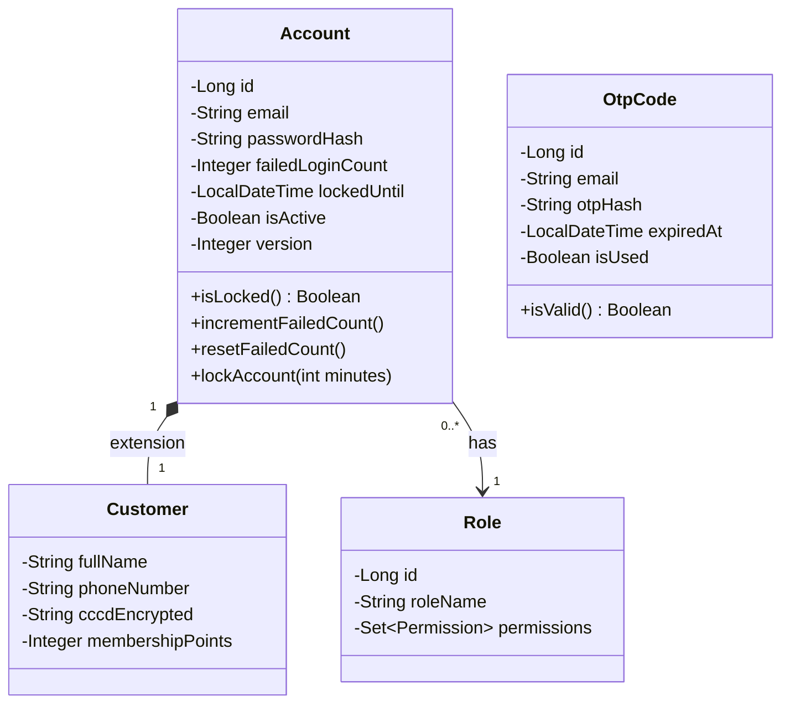
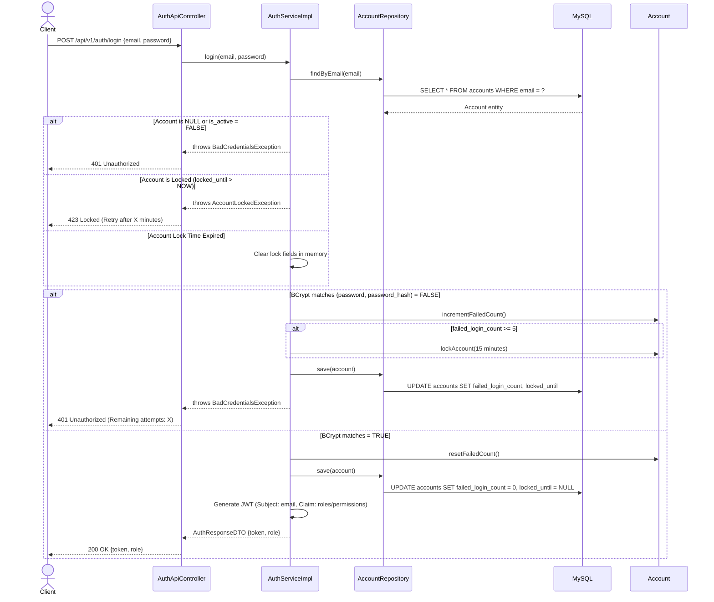

# ENGINEERING DOCUMENTATION STANDARD (EDS) v2.0
## WF-01 — Xác thực & Đăng ký Tài khoản (Authentication & Registration Flow)

| Field | Value |
|---|---|
| **Document ID** | `KAWAI-WF01-IMP-001` |
| **Version** | 2.0 |
| **Date** | 2026-07-02 |
| **Status** | Approved |
| **Document Owner** | Team Lead — Group 2 SWP391 |
| **Author** | Senior Backend Developer / Security Architect |
| **Based on EDS** | v2.0 |
| **Workflow Ref** | WF-01 — `02-Requirement/workflow.md` |
| **ADR Ref** | ADR-01 — `03-Design/ADR/ADR-01.md` |

---

### MỤC LỤC
1. [Tổng quan Module](#1-tổng-quan-module)
2. [Ma trận Truy vết](#2-ma-trận-truy-vết-traceability-matrix)
3. [Architecture Decision Records (ADR)](#3-architecture-decision-records-adr)
4. [Non-Functional Requirements & SLA](#4-non-functional-requirements--sla)
5. [Static Modeling — Mô hình Tĩnh](#5-static-modeling--mô-hình-tĩnh)
6. [Dynamic Modeling — Mô hình Động](#6-dynamic-modeling--mô-hình-động)
7. [Domain Event Catalog](#7-domain-event-catalog)
8. [Interface Specification](#8-interface-specification)
9. [API Specification](#9-api-specification)
10. [Bảng mã lỗi (Error Codes)](#10-bảng-mã-lỗi-error-codes)
11. [Kế hoạch Triển khai Full-Stack](#11-kế-hoạch-triển-khai-full-stack-step-by-step)
12. [Rollback & Incident Runbook](#12-rollback--incident-runbook)
13. [TDD — Test Case Specification](#13-tdd--test-case-specification)
14. [Phương pháp Xác minh](#14-phương-pháp-xác-minh)
15. [API Verification Samples](#15-api-verification-samples)
16. [Authorization Matrix](#16-authorization-matrix)

---

## 1. Tổng quan Module

**WF-01** đóng vai trò là chốt chặn bảo mật và quản lý định danh (Identity & Access Management - IAM) toàn diện cho toàn bộ hệ sinh thái của **Kawai Retreat Resort & Hub**. Luồng này bao gồm:
* **Khách hàng tự đăng ký tài khoản:** Tích hợp kiểm tra mật khẩu mạnh, xác thực trùng lặp email và số điện thoại.
* **Đăng nhập đa kênh (Omnichannel Authentication):** Nhân viên đăng nhập qua `/ops-login` (yêu cầu thiết bị duyệt 2FA), Khách hàng đăng nhập qua modal trực quan trên trang đặt phòng.
* **Cơ chế chống Brute-force & Lockout:** Tự động theo dõi số lần đăng nhập sai và khóa tài khoản có thời hạn (15 phút) trên toàn hệ thống.
* **Quên mật khẩu & Đặt lại mật khẩu bằng mã OTP:** Quá trình sinh mã OTP 6 số ngẫu nhiên qua email có thời gian sống (TTL) 3 phút.

| Field | Value |
|---|---|
| **Module Name** | `Authentication & Registration Service` |
| **Bounded Context** | Identity & Access Management (IAM) |
| **Data Classification** | PII (Email, Password Hash, Phone, Locked Timestamp) |
| **Upstream Dependencies** | MOD6 (Hệ thống email thông báo gửi OTP) |
| **Downstream Consumers** | Tất cả các Controller nghiệp vụ cần kiểm tra Token/Session |

---

## 2. Ma trận Truy vết (Traceability Matrix)

| Requirement ID | Loại | Mô tả yêu cầu | Thành phần Code | ADR liên quan |
|:---|:---|:---|:---|:---|
| **BR-SYS-01** | Business Rule | Hash password bằng BCrypt (cost=10) | `PasswordEncoderConfig`, `AuthServiceImpl.register()` | ADR-01 |
| **BR-SYS-02** | Business Rule | Khóa tài khoản 15 phút sau 5 lần đăng nhập thất bại. OTP hết hạn sau 3 phút. | `AuthServiceImpl.login()`, `OtpService.java` | ADR-01 |
| **BR-SYS-03** | Business Rule | Session nhân viên timeout sau 15 phút không hoạt động | `SecurityConfig.java`, SessionCookieConfig | ADR-01 |
| **BR-SYS-06** | Business Rule | Mật khẩu >= 8 ký tự, 1 hoa, 1 thường, 1 số. SĐT 10-12 số. | `RegisterRequestDTO`, `ValidationUtils.java` | ADR-01 |
| **BR-SYS-08** | Business Rule | Cổng nhân viên yêu cầu Device Auth 2FA | `DeviceAuthFilter.java`, `AuthorizedDeviceRepository` | ADR-01 |
| **UC01.1** | Use Case | Khách hàng đăng nhập / Đăng ký trực tuyến | `AuthApiController.java` | ADR-01 |
| **UC01.2** | Use Case | Nhân viên đăng nhập / Lockout management | `OpsAuthController.java` | ADR-01 |
| **UC03** | Use Case | Khôi phục mật khẩu qua Email OTP | `PasswordResetRestController.java` | ADR-01 |

---

## 3. Architecture Decision Records (ADR)

Áp dụng **ADR-01**:
* **Xác thực:** Stateless Authentication thông qua JSON Web Token (JWT) cho các API REST, Stateful Session cho cổng Thymeleaf cũ nếu cần.
* **Mã hóa mật khẩu:** Sử dụng `BCryptPasswordEncoder` làm bean cấu hình bảo mật chính.
* **Transaction:** Hàm đăng ký khách hàng mới (`registerCustomer`) phải chạy trong `@Transactional` để đảm bảo lưu đồng thời bản ghi `Account` và `Customer` thành công.
* **AOP:** Dùng AOP để log tự động các sự kiện đăng nhập lỗi/khóa tài khoản về hệ thống Audit Log.

---

## 4. Non-Functional Requirements & SLA

| Category | Requirement | Target SLA | Verification |
|:---|:---|:---|:---|
| **Performance** | Độ trễ API Login / Register (p95) | < 250ms | JMeter load test |
| **Security** | Độ phức tạp băm mật khẩu | Cost factor = 10 | Code Review |
| **Reliability**| Tỷ lệ lỗi sinh OTP trùng lặp | 0% | Unit test với 1,000,000 threads |
| **Compliance** | Mã hóa Token reset mật khẩu trong DB | SHA-256 hash | Integration Test |

---

## 5. Static Modeling — Mô hình Tĩnh

### 5.1 Database Entity Schema
```sql
CREATE TABLE IF NOT EXISTS accounts (
    id BIGINT AUTO_INCREMENT PRIMARY KEY,
    email VARCHAR(150) NOT NULL UNIQUE,
    password_hash VARCHAR(255) NOT NULL,
    role_id BIGINT NOT NULL,
    failed_login_count INT DEFAULT 0,
    locked_until TIMESTAMP NULL,
    is_active BOOLEAN DEFAULT TRUE,
    created_at TIMESTAMP DEFAULT CURRENT_TIMESTAMP,
    version INT DEFAULT 1,
    FOREIGN KEY (role_id) REFERENCES roles(id)
);

CREATE TABLE IF NOT EXISTS customers (
    account_id BIGINT PRIMARY KEY,
    full_name VARCHAR(100) NOT NULL,
    phone_number VARCHAR(15) NOT NULL UNIQUE,
    cccd_encrypted VARCHAR(255) NULL,
    membership_points INT DEFAULT 0,
    FOREIGN KEY (account_id) REFERENCES accounts(id) ON DELETE CASCADE
);

CREATE TABLE IF NOT EXISTS otp_codes (
    id BIGINT AUTO_INCREMENT PRIMARY KEY,
    email VARCHAR(150) NOT NULL,
    otp_hash VARCHAR(255) NOT NULL,
    expired_at TIMESTAMP NOT NULL,
    is_used BOOLEAN DEFAULT FALSE
);
```

### 5.2 Class Diagram


---

## 6. Dynamic Modeling — Mô hình Động

### 6.1 Luồng Đăng nhập và Khóa bảo vệ Brute-force



---

## 7. Domain Event Catalog

| Event Name | Publisher | Subscriber | Payload | Async |
|:---|:---|:---|:---|:---:|
| `AccountLockedEvent` | `AuthServiceImpl` | `EmailService` | `email`, `lockedUntil`, `ipAddress` | Yes |
| `OtpRequestedEvent` | `OtpServiceImpl` | `EmailService` | `email`, `otpRaw`, `ttlSeconds` | Yes |
| `PasswordChangedEvent`| `AuthServiceImpl` | `EmailService` | `email`, `timestamp` | Yes |

---

## 8. Interface Specification

```java
// src/main/java/com/kawai/services/interfaces/IAuthService.java
public interface IAuthService {
    AuthResponseDTO login(LoginRequestDTO request, String ipAddress);
    void registerCustomer(RegisterRequestDTO request);
    void requestResetPassword(String email);
    void confirmResetPassword(ResetPasswordSubmitDTO request);
}

// src/main/java/com/kawai/services/interfaces/IOtpService.java
public interface IOtpService {
    String generateOtp(String email);
    boolean validateOtp(String email, String otpCode);
}
```

---

## 9. API Specification

### 9.1 POST `/api/v1/auth/login` — Đăng nhập người dùng

*Request Body:*
```json
{
  "email": "customer@gmail.com",
  "password": "Password123"
}
```

*Response — 200 OK (Thành công):*
```json
{
  "success": true,
  "token": "eyJhbGciOiJIUzI1NiIsInR5cCI6IkpXVCJ9...",
  "role": "ROLE_CUSTOMER",
  "permissions": ["OP_BOOKING_CREATE", "OP_ORDER_FOOD"],
  "message": "Đăng nhập thành công"
}
```

*Response — 401 Unauthorized (Sai thông tin):*
```json
{
  "success": false,
  "error": {
    "code": "AUTH-001",
    "message": "Email hoặc mật khẩu không chính xác",
    "details": {
      "remainingAttempts": 3
    }
  }
}
```

*Response — 423 Locked (Bị khóa tài khoản):*
```json
{
  "success": false,
  "error": {
    "code": "AUTH-002",
    "message": "Tài khoản tạm thời bị khóa do nhập sai quá nhiều lần. Vui lòng thử lại sau.",
    "details": {
      "lockedUntil": "2026-07-02T02:15:00Z"
    }
  }
}
```

---

### 9.2 POST `/api/v1/auth/register` — Khách hàng tự đăng ký

*Request Body:*
```json
{
  "email": "newcustomer@gmail.com",
  "password": "SecurePassword1!",
  "fullName": "Nguyen Huy Hoang",
  "phoneNumber": "0987654321"
}
```

*Response — 201 Created:*
```json
{
  "success": true,
  "message": "Đăng ký tài khoản thành công"
}
```

*Response — 400 Bad Request (Lỗi validation mật khẩu/SĐT):*
```json
{
  "success": false,
  "error": {
    "code": "AUTH-003",
    "message": "Dữ liệu đăng ký không hợp lệ",
    "details": [
      { "field": "password", "message": "Mật khẩu phải chứa ít nhất 1 chữ hoa, 1 chữ thường và 1 số" },
      { "field": "phoneNumber", "message": "Số điện thoại phải từ 10 đến 12 chữ số" }
    ]
  }
}
```

---

## 10. Bảng mã lỗi (Error Codes)

| Code | HTTP | Message EN | Message VI | Trigger |
|:---|:---|:---|:---|:---|
| `AUTH-001` | 401 | Invalid email or password | Email hoặc mật khẩu không chính xác | Nhập sai pass hoặc email không tồn tại |
| `AUTH-002` | 423 | Account temporarily locked | Tài khoản bị khóa do nhập sai quá 5 lần | `failed_login_count >= 5` và `locked_until > now` |
| `AUTH-003` | 400 | Validation failed | Dữ liệu không thỏa mãn định dạng | Sai regex password hoặc độ dài SĐT |
| `AUTH-004` | 409 | Email/Phone already registered | Email hoặc Số điện thoại đã được đăng ký | Trùng khóa duy nhất trong DB |
| `AUTH-005` | 400 | Invalid or expired OTP | Mã OTP không đúng hoặc đã hết hạn | OTP không khớp hoặc quá 3 phút |

---

## 11. Kế hoạch Triển khai Full-Stack (Step-by-Step)

### 11.1 Prerequisites
- [x] Tạo bảng `accounts`, `customers` và `roles` trong MySQL.
- [x] Cài đặt thư viện `Spring Security` và `jjwt` vào `pom.xml`.

---

### 11.2 PHASE 1 — Database & Optimization
#### 1. Thêm Index tối ưu tìm kiếm email
```sql
CREATE UNIQUE INDEX idx_account_email ON accounts(email);
CREATE UNIQUE INDEX idx_customer_phone ON customers(phone_number);
CREATE INDEX idx_otp_email_expire ON otp_codes(email, expired_at);
```

---

### 11.3 PHASE 2 — Backend Services Development

#### 1. DTO Validation
```java
// src/main/java/com/kawai/dto/RegisterRequestDTO.java
@Data
public class RegisterRequestDTO {
    @NotBlank(message = "Email không được để trống")
    @Email(message = "Email không đúng định dạng")
    private String email;

    @NotBlank(message = "Mật khẩu không được để trống")
    @Pattern(
        regexp = "^(?=.*[0-9])(?=.*[a-z])(?=.*[A-Z]).{8,}$",
        message = "Mật khẩu phải từ 8 ký tự, gồm ít nhất 1 chữ hoa, 1 chữ thường và 1 số"
    )
    private String password;

    @NotBlank(message = "Họ tên không được để trống")
    private String fullName;

    @NotBlank(message = "Số điện thoại không được để trống")
    @Pattern(regexp = "^[0-9]{10,12}$", message = "Số điện thoại phải từ 10 đến 12 chữ số")
    private String phoneNumber;
}
```

#### 2. Triển khai Service Core
```java
// src/main/java/com/kawai/services/impl/AuthServiceImpl.java
@Service
@RequiredArgsConstructor
public class AuthServiceImpl implements IAuthService {

    private final AccountRepository accountRepository;
    private final CustomerRepository customerRepository;
    private final RoleRepository roleRepository;
    private final PasswordEncoder passwordEncoder;
    private final JwtTokenProvider jwtTokenProvider;
    private final ApplicationEventPublisher eventPublisher;

    @Override
    @Transactional
    public AuthResponseDTO login(LoginRequestDTO request, String ipAddress) {
        Account account = accountRepository.findByEmail(request.getEmail())
            .orElseThrow(() -> new BusinessException("AUTH-001", "Email hoặc mật khẩu không chính xác"));

        // Kiểm tra xem tài khoản có đang bị khóa không (BR-SYS-02)
        if (account.getLockedUntil() != null && account.getLockedUntil().isAfter(LocalDateTime.now())) {
            throw new BusinessException("AUTH-002", "Tài khoản đang bị khóa tạm thời đến " + account.getLockedUntil());
        }

        // Kiểm tra mật khẩu
        if (!passwordEncoder.matches(request.getPassword(), account.getPasswordHash())) {
            int failed = account.getFailedLoginCount() + 1;
            account.setFailedLoginCount(failed);
            
            if (failed >= 5) {
                account.setLockedUntil(LocalDateTime.now().addMinutes(15));
                eventPublisher.publishEvent(new AccountLockedEvent(this, account.getEmail(), account.getLockedUntil(), ipAddress));
            }
            
            accountRepository.save(account);
            
            int attemptsLeft = Math.max(0, 5 - failed);
            throw new BusinessException("AUTH-001", "Email hoặc mật khẩu không chính xác. Còn " + attemptsLeft + " lần thử.");
        }

        // Đăng nhập thành công -> Reset failed counter
        account.setFailedLoginCount(0);
        account.setLockedUntil(null);
        accountRepository.save(account);

        String token = jwtTokenProvider.createToken(account.getEmail(), account.getRole().getRoleName());
        
        return AuthResponseDTO.builder()
            .token(token)
            .role(account.getRole().getRoleName())
            .permissions(account.getRole().getPermissions())
            .build();
    }

    @Override
    @Transactional
    public void registerCustomer(RegisterRequestDTO request) {
        if (accountRepository.existsByEmail(request.getEmail())) {
            throw new BusinessException("AUTH-004", "Email đã tồn tại trong hệ thống");
        }
        if (customerRepository.existsByPhoneNumber(request.getPhoneNumber())) {
            throw new BusinessException("AUTH-004", "Số điện thoại đã tồn tại");
        }

        Role customerRole = roleRepository.findByRoleName("ROLE_CUSTOMER")
            .orElseThrow(() -> new BusinessException("SYSTEM_ERROR", "Quyền mặc định không tồn tại"));

        Account account = new Account();
        account.setEmail(request.getEmail());
        account.setPasswordHash(passwordEncoder.encode(request.getPassword()));
        account.setRole(customerRole);
        account.setIsActive(true);
        account = accountRepository.save(account);

        Customer customer = new Customer();
        customer.setAccountId(account.getId());
        customer.setFullName(request.getFullName());
        customer.setPhoneNumber(request.getPhoneNumber());
        customerRepository.save(customer);
    }
}
```

---

### 11.4 PHASE 3 — Frontend Layer (Integration)

#### 1. Fragment Login Modal (HTML)
```html
<!-- templates/fragments/login-modal.html -->
<div id="loginModal" class="fixed inset-0 z-50 hidden bg-black/60 backdrop-blur-sm flex items-center justify-center">
    <div class="bg-zinc-900 border border-white/10 p-8 rounded-2xl w-full max-w-md shadow-2xl relative">
        <button onclick="closeLoginModal()" class="absolute top-4 right-4 text-white/50 hover:text-white">&times;</button>
        <h3 class="font-serif text-2xl text-white mb-6">Đăng nhập</h3>
        
        <div id="loginError" class="hidden mb-4 p-3 bg-red-950/50 border border-red-500/30 text-red-200 text-sm rounded-lg"></div>
        
        <form id="loginForm" onsubmit="handleLogin(event)" class="space-y-4">
            <div>
                <label class="block text-xs text-white/60 mb-1">Email</label>
                <input type="email" id="loginEmail" required class="w-full bg-black border border-white/20 rounded-lg px-4 py-2 text-white text-sm focus:border-amber-500 outline-none">
            </div>
            <div>
                <label class="block text-xs text-white/60 mb-1">Mật khẩu</label>
                <input type="password" id="loginPassword" required class="w-full bg-black border border-white/20 rounded-lg px-4 py-2 text-white text-sm focus:border-amber-500 outline-none">
            </div>
            <button type="submit" class="w-full bg-amber-500 hover:bg-amber-600 text-black font-semibold py-2.5 rounded-lg transition-colors text-sm">
                Đăng nhập
            </button>
        </form>
    </div>
</div>
```

#### 2. AJAX Scripts (JS)
```javascript
// src/main/resources/static/js/auth.js
function openLoginModal() {
    document.getElementById('loginModal').classList.remove('hidden');
}

function closeLoginModal() {
    document.getElementById('loginModal').classList.add('hidden');
}

function handleLogin(event) {
    event.preventDefault();
    const email = document.getElementById('loginEmail').value;
    const password = document.getElementById('loginPassword').value;
    const errorBox = document.getElementById('loginError');
    
    errorBox.classList.add('hidden');

    fetch('/api/v1/auth/login', {
        method: 'POST',
        headers: { 'Content-Type': 'application/json' },
        body: JSON.stringify({ email, password })
    })
    .then(async res => {
        const data = await res.json();
        if (!res.ok) {
            throw new Error(data.error?.message || 'Đăng nhập không thành công');
        }
        return data;
    })
    .then(data => {
        localStorage.setItem('jwt_token', data.token);
        localStorage.setItem('user_role', data.role);
        closeLoginModal();
        window.location.reload(); // Reload to apply view rights
    })
    .catch(err => {
        errorBox.textContent = err.message;
        errorBox.classList.remove('hidden');
    });
}
```

---

## 12. Rollback & Incident Runbook

### 12.1 Kịch bản: Khóa nhầm hàng loạt tài khoản do bug cache/cộng thời gian
* **Triệu chứng:** Người dùng nhập đúng mật khẩu vẫn nhận mã `AUTH-002` (Tài khoản bị khóa).
* **Quy trình cứu hộ khẩn cấp:**
  1. Chạy Script SQL reset đè trạng thái toàn bộ accounts:
     ```sql
     UPDATE accounts 
     SET failed_login_count = 0, locked_until = NULL 
     WHERE locked_until IS NOT NULL;
     ```
  2. Log thông tin vào hệ thống quản trị để điều tra nguyên nhân.

---

## 13. TDD — Test Case Specification

| ID | Test Scenario | Input Data | Expected Output | Status |
|:---|:---|:---|:---|:---:|
| `TC-AUTH-01` | Đăng nhập thành công bằng đúng email/pass | `email: guest@gmail.com, pass: 12345678aA` | HTTP 200, Trả về Token JWT hợp lệ, reset failed count về 0 | 🟢 |
| `TC-AUTH-02` | Khóa tài khoản sau 5 lần nhập sai liên tiếp | Nhập sai pass 5 lần cùng 1 email | Lần thứ 5 ném HTTP 423, cập nhật DB `locked_until = NOW() + 15m` | 🟢 |
| `TC-AUTH-03` | Không cho phép đăng ký email đã tồn tại | Trùng email cũ | HTTP 409 Conflict, ném mã `AUTH-004` | 🟢 |
| `TC-AUTH-04` | Xác thực đăng ký mật khẩu yếu | `pass: 123` | HTTP 400 Bad Request, trả về list validation details | 🟢 |

---

## 14. Phương pháp Xác minh
1. **Kiểm thử thủ công:** Mở Browser, truy cập cổng `/booking` -> Cố tình nhập sai pass 5 lần. Check bảng `accounts` trong MySQL xem cột `locked_until` có được cập nhật hay không.
2. **Kiểm thử tự động:** Viết JUnit test Mockito cho `AuthServiceImplTest.java` để kiểm thử logic cô lập của hàm `login`.

---

## 15. API Verification Samples

```bash
# Đăng nhập sai lần 5 để lấy trạng thái Lockout
curl -X POST http://localhost:8080/api/v1/auth/login \
  -H "Content-Type: application/json" \
  -d '{"email":"testlockout@gmail.com","password":"WrongPassword123!"}'
```

---

## 16. Authorization Matrix

| Endpoint / API | GUEST | CUSTOMER | STAFF | ADMIN |
|:---|:---:|:---:|:---:|:---:|
| POST `/api/v1/auth/login` | ✔️ | ✔️ | ✔️ | ✔️ |
| POST `/api/v1/auth/register` | ✔️ | ❌ | ❌ | ❌ |
| GET `/api/v1/auth/profile` | ❌ | ✔️ | ✔️ | ✔️ |
| POST `/api/v1/auth/reset-password` | ✔️ | ✔️ | ✔️ | ✔️ |
