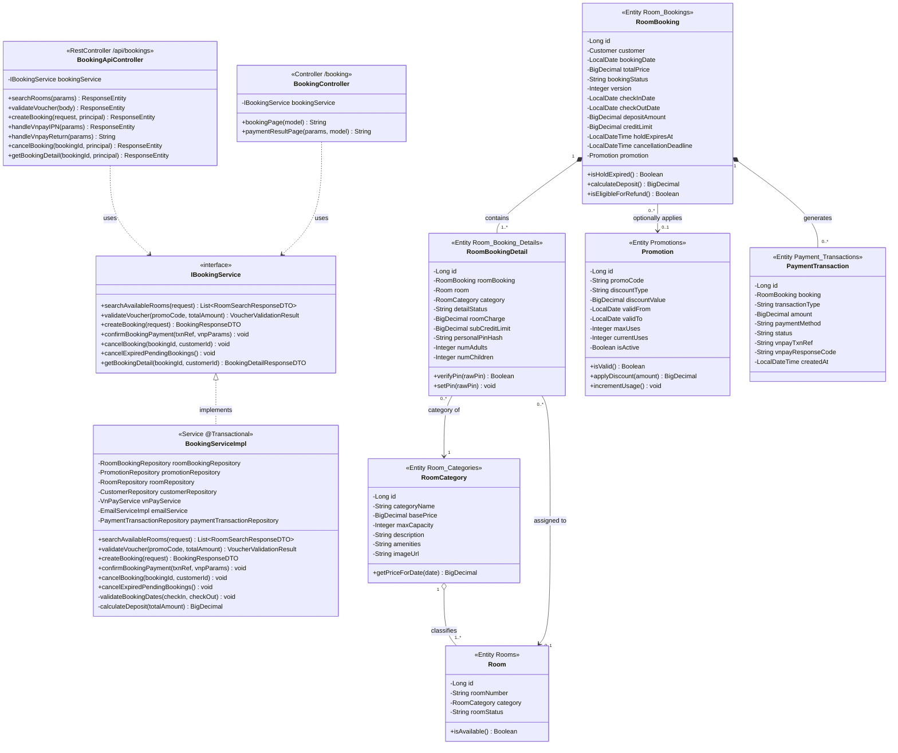
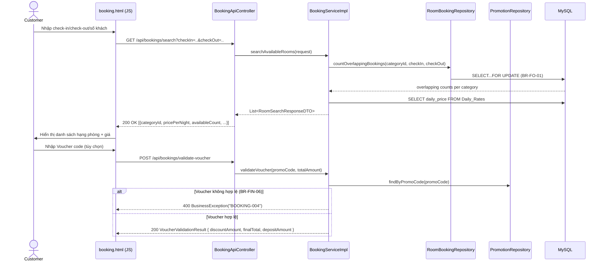
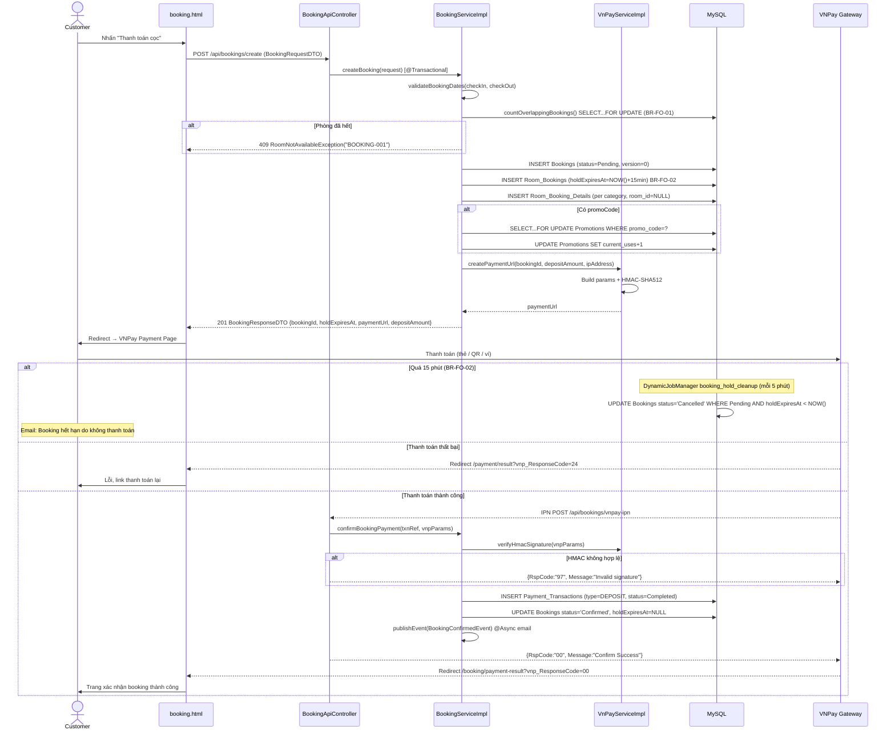
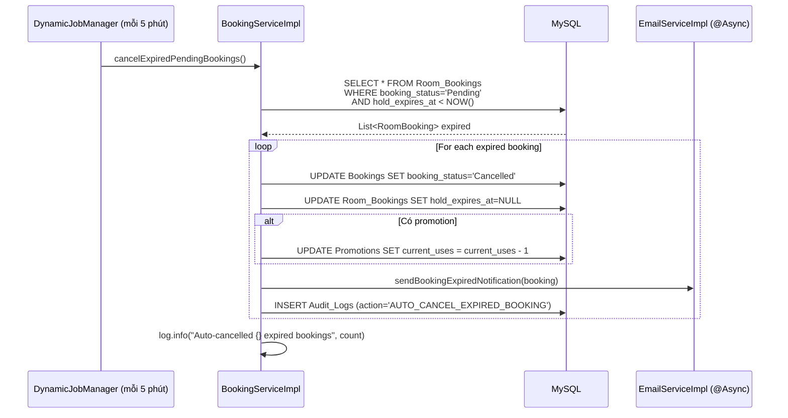

# ENGINEERING DOCUMENTATION STANDARD (EDS) v2.0

## WF-02 — Đặt phòng & Thanh toán Cọc trực tuyến (Online Room Booking & Deposit Payment)

| Field                       | Value                                      |
| --------------------------- | ------------------------------------------ |
| **Document ID**       | `KAWAI-WF02-IMP-001`                     |
| **Version**           | 1.0                                        |
| **Date**              | 2026-07-02                                 |
| **Status**            | Approved                                   |
| **Document Owner**    | Chu Xuân Dũng                            |
| **Author**            | Chu Xuân Dũng                            |
| **Based on EDS**      | v2.0                                       |
| **Workflow Ref**      | WF-02 —`02-Requirement/workflow.md`     |
| **ADR Ref**           | ADR-01 —`03-Design/ADR/ADR-01.md`       |
| **Class Diagram Ref** | CD-02 —`02-Requirement/classdiagram.md` |

---

### MỤC LỤC

1. [Tổng quan Module](#1-tổng-quan-module)
2. [Ma trận Truy vết](#2-ma-trận-truy-vết-traceability-matrix)
3. [Architecture Decision Records (ADR)](#3-architecture-decision-records-adr)
4. [Non-Functional Requirements &amp; SLA](#4-non-functional-requirements--sla)
5. [Static Modeling — Mô hình Tĩnh](#5-static-modeling--mô-hình-tĩnh)
6. [Dynamic Modeling — Mô hình Động](#6-dynamic-modeling--mô-hình-động)
7. [Domain Event Catalog](#7-domain-event-catalog)
8. [Interface Specification](#8-interface-specification)
9. [API Specification](#9-api-specification)
10. [Bảng mã lỗi (Error Codes)](#10-bảng-mã-lỗi-error-codes)
11. [Kế hoạch Triển khai Full-Stack](#11-kế-hoạch-triển-khai-full-stack-step-by-step)
12. [Rollback &amp; Incident Runbook](#12-rollback--incident-runbook)
13. [TDD — Test Case Specification](#13-tdd--test-case-specification)
14. [Phương pháp Xác minh](#14-phương-pháp-xác-minh)
15. [API Verification Samples](#15-api-verification-samples)
16. [Authorization Matrix](#16-authorization-matrix)

---

## 1. Tổng quan Module

**WF-02** là luồng nghiệp vụ cốt lõi **CRITICAL** của hệ thống Kawai Retreat Resort & Hub, xử lý toàn bộ vòng đời đặt phòng trực tuyến từ khi khách tìm kiếm phòng trống đến khi thanh toán cọc thành công qua cổng VNPay.

Luồng này bao gồm 5 giai đoạn chính:

* **Tìm kiếm & Lọc phòng:** Khách nhập ngày check-in/check-out, số khách → hệ thống query phòng trống theo ngày tránh overbooking (BR-FO-01).
* **Lựa chọn hạng phòng & Áp dụng Voucher:** Hiển thị danh sách hạng phòng kèm giá `Daily_Rates`, hỗ trợ mã khuyến mãi kiểm tra `Promotions` (BR-FIN-06).
* **Tạo Booking & Cart Lock:** INSERT `Bookings` status=Pending, , tạo URL thanh toán VNPay chống overbooking.
* **Xử lý thanh toán VNPay:** Khách thanh toán cọc 30% trên trang VNPay, hệ thống verify HMAC webhook callback.
* **Xác nhận & Thông báo:** UPDATE status=Confirmed, INSERT `Payment_Transactions`, gửi email xác nhận booking.

> **Đặc điểm kỹ thuật quan trọng:** Codebase hiện có (`BookingServiceImpl.java`, 59KB) đã triển khai phần lớn logic core. Tài liệu này chuẩn hóa, bổ sung thiếu sót, và đặt nền tảng test coverage đầy đủ.

| Field                           | Value                                                                           |
| ------------------------------- | ------------------------------------------------------------------------------- |
| **Module Name**           | `Online Room Booking & Deposit Service`                                       |
| **Bounded Context**       | Front Office — Room Reservation                                                |
| **Data Classification**   | Financial (Deposit Amount, Payment Transaction), PII (Customer Info)            |
| **Upstream Dependencies** | WF-01 (IAM — Customer phải đăng nhập), MOD6 (Email Service), VNPay Gateway |
| **Downstream Consumers**  | WF-03 (Check-in), WF-04 (Check-out), WF-08 (Night Audit), WF-09 (Hủy phòng)   |

---

## 2. Ma trận Truy vết (Traceability Matrix)

| Requirement ID      | Loại         | Mô tả yêu cầu                                                                                                            | Thành phần Code                                                                                      | ADR liên quan |
| :------------------ | :------------ | :--------------------------------------------------------------------------------------------------------------------------- | :----------------------------------------------------------------------------------------------------- | :------------- |
| **BR-FO-01**  | Business Rule | CRITICAL — Chống overbooking:`SELECT...FOR UPDATE`; `@Version` Optimistic Lock; DB Trigger `TRG_Prevent_Overbooking` | `BookingServiceImpl.countOverlappingBookings()`, `RoomBooking.@Version`, `RoomBookingRepository` | ADR-01 §6     |
| **BR-FO-02**  | Business Rule | CRITICAL —  Lock 2 phút; Scheduler tự động hủy Booking Pending_Payment quá hạn                                     | `BookingServiceImpl.cancelExpiredPendingBookings()`, `DynamicJobManager` schedule                  | ADR-01 §5     |
| **BR-FIN-06** | Business Rule | MEDIUM — 1 voucher/booking; kiểm tra is_active, valid_to, max_uses                                                         | `BookingServiceImpl.applyPromotion()`, `PromotionRepository`, `Promotion.isValid()`              | ADR-01         |
| **BR-SYS-04** | Business Rule | CRITICAL — Ghi Audit Log cho mọi hành động tạo/hủy booking                                                            | `@LogActivity` on `BookingServiceImpl`, `AuditLogAspect`                                         | ADR-01 §4     |
| **BR-FIN-02** | Business Rule | HIGH — Hoàn tiền: hủy trước 48h → 100%; trong 48h → mất cọc                                                        | `BookingServiceImpl.cancelBooking()`, `RoomBooking.isEligibleForRefund()`                          | ADR-01         |
| **UC10**      | Use Case      | Tìm kiếm phòng trống & giá theo ngày                                                                                   | `RoomApiController`, `RoomServiceImpl.searchAvailableRooms()`                                      | ADR-01         |
|                     |               |                                                                                                                              |                                                                                                        |                |
| **UC11**      | Use Case      | Đặt phòng & thanh toán cọc online                                                                                       | `BookingApiController`, `VnPayServiceImpl.createPaymentUrl()`                                      | ADR-01, ADR-03 |

---

## 3. Architecture Decision Records (ADR)

Áp dụng **ADR-01 (Spring Boot MVC Layered Architecture)**:

* **Controller Layer (Dual):**

  - `BookingController` (`/booking/**`) — `@Controller`, SSR Thymeleaf, render trang tìm phòng và booking wizard cho guest.
  - `BookingApiController` (`/api/bookings/**`) — `@RestController`, REST JSON cho AJAX calls từ booking page.
* **Service Layer:**

  - `BookingService` interface + `BookingServiceImpl` — toàn bộ business logic booking.
  - `VnPayService` interface + `VnPayServiceImpl` — tạo payment URL, verify HMAC webhook, hoàn tiền.
* **Transaction:**

  - `createBooking()` chạy trong `@Transactional` — atomic: INSERT Booking + Details hoặc rollback.
  - Dùng Soft Lock Strategy: INSERT `RoomBooking(status="HOLD")` làm Cart Lock thay vì bảng riêng.
* **Optimistic Lock:**

  - `RoomBooking.@Version` — Hibernate tự tăng version mỗi UPDATE. Nếu 2 transaction concurrent → `OptimisticLockException` → bắt và throw `BusinessException("BOOKING-009")`.
* **AOP Audit:**

  - Annotate `@LogActivity(action="CREATE_BOOKING", module="BOOKING")` trên method service.
* **Scheduling:**

  - `DynamicJobManager` đăng ký job `booking_hold_cleanup` chạy mỗi 1phút, quét và hủy `Pending_Payment > 2 phút`.

---

## 4. Non-Functional Requirements & SLA

| Category               | Requirement                                         | Target SLA | Verification                        |
| :--------------------- | :-------------------------------------------------- | :--------- | :---------------------------------- |
| **Performance**  | API tìm kiếm phòng (p95)                         | < 300ms    | JMeter với 100 concurrent users    |
| **Performance**  | API tạo booking (p95)                              | < 500ms    | JMeter load test                    |
| **Reliability**  | Tỷ lệ overbooking                                 | 0%         | Integration test concurrent booking |
| **Security**     | VNPay HMAC verify bắt buộc trước khi confirm    | 100%       | Code review + unit test             |
| **Availability** | Cart Lock cleanup job uptime                        | 99.9%      | Monitoring`DynamicJobManager`     |
| **Compliance**   | Deposit 30% ghi chính xác`Payment_Transactions` | 100%       | Reconciliation report               |

---

## 5. Static Modeling — Mô hình Tĩnh

### 5.1 Database Entity Schema

```sql
-- CORE BOOKING TABLES

-- Bookings (supertype @Inheritance JOINED)
CREATE TABLE IF NOT EXISTS Bookings (
    id              BIGINT AUTO_INCREMENT PRIMARY KEY,
    customer_id     BIGINT NOT NULL,
    booking_date    DATE NOT NULL DEFAULT (CURRENT_DATE),
    total_price     DECIMAL(15,2) NOT NULL DEFAULT 0.00,
    booking_status  VARCHAR(30) NOT NULL DEFAULT 'Pending',
    -- Pending | Confirmed | Checked_In | Checked_Out | Cancelled
    booking_source  VARCHAR(30) NOT NULL DEFAULT 'Online',
    promotion_id    BIGINT NULL,
    version         INT NOT NULL DEFAULT 0,       -- @Version Optimistic Lock (BR-FO-01)
    created_at      DATETIME NOT NULL DEFAULT NOW(),
    updated_at      DATETIME NULL ON UPDATE NOW(),
    FOREIGN KEY (customer_id) REFERENCES Customers(id),
    FOREIGN KEY (promotion_id) REFERENCES Promotions(id),
    INDEX idx_bookings_customer (customer_id),
    INDEX idx_bookings_status   (booking_status),
    INDEX idx_bookings_date     (booking_date)
);

-- Room_Bookings — subtype (JOINED inheritance)
CREATE TABLE IF NOT EXISTS Room_Bookings (
    id                    BIGINT PRIMARY KEY,
    check_in_date         DATE NOT NULL,
    check_out_date        DATE NOT NULL,
    deposit_amount        DECIMAL(15,2) NOT NULL DEFAULT 0.00,
    credit_limit          DECIMAL(15,2) NOT NULL DEFAULT 0.00,
    hold_expires_at       DATETIME NULL,           -- Cart Lock TTL 15 min (BR-FO-02)
    cancellation_deadline DATETIME NULL,           -- checkInDate - 48h (BR-FIN-02)
    special_requests      TEXT NULL,
    FOREIGN KEY (id) REFERENCES Bookings(id) ON DELETE CASCADE,
    INDEX idx_rb_checkin  (check_in_date),
    INDEX idx_rb_checkout (check_out_date),
    INDEX idx_rb_hold     (booking_status, hold_expires_at)
);

-- Room_Booking_Details
CREATE TABLE IF NOT EXISTS Room_Booking_Details (
    id                        BIGINT AUTO_INCREMENT PRIMARY KEY,
    booking_id                BIGINT NOT NULL,
    room_id                   BIGINT NULL,   -- NULL until check-in assignment
    category_id               BIGINT NOT NULL,
    guest_customer_id         BIGINT NULL,
    detail_status             VARCHAR(30) NOT NULL DEFAULT 'Pending',
    room_charge               DECIMAL(15,2) NOT NULL DEFAULT 0.00,
    sub_credit_limit          DECIMAL(15,2) NOT NULL DEFAULT 0.00,
    personal_pin_hash         VARCHAR(255) NULL,
    is_charge_to_room_allowed BOOLEAN NOT NULL DEFAULT TRUE,
    num_adults                INT NOT NULL DEFAULT 1,
    num_children              INT NOT NULL DEFAULT 0,
    FOREIGN KEY (booking_id) REFERENCES Room_Bookings(id) ON DELETE CASCADE,
    FOREIGN KEY (room_id) REFERENCES Rooms(id),
    FOREIGN KEY (category_id) REFERENCES Room_Categories(id),
    INDEX idx_rbd_booking (booking_id),
    INDEX idx_rbd_status  (detail_status),
    INDEX idx_rbd_avail   (category_id, detail_status)
);

-- Payment_Transactions
CREATE TABLE IF NOT EXISTS Payment_Transactions (
    id                  BIGINT AUTO_INCREMENT PRIMARY KEY,
    booking_id          BIGINT NOT NULL,
    transaction_type    VARCHAR(30) NOT NULL, -- DEPOSIT | FINAL_PAYMENT | REFUND
    amount              DECIMAL(15,2) NOT NULL,
    payment_method      VARCHAR(30) NOT NULL DEFAULT 'VNPay',
    status              VARCHAR(20) NOT NULL DEFAULT 'Pending',
    vnpay_txn_ref       VARCHAR(100) NULL UNIQUE,
    vnpay_response_code VARCHAR(10) NULL,
    created_at          DATETIME NOT NULL DEFAULT NOW(),
    FOREIGN KEY (booking_id) REFERENCES Bookings(id),
    INDEX idx_pt_booking (booking_id),
    INDEX idx_pt_type    (transaction_type)
);

-- Promotions — mã giảm giá (BR-FIN-06)
CREATE TABLE IF NOT EXISTS Promotions (
    id             BIGINT AUTO_INCREMENT PRIMARY KEY,
    promo_code     VARCHAR(50) NOT NULL UNIQUE,
    discount_type  VARCHAR(20) NOT NULL,  -- PERCENTAGE | FIXED_AMOUNT
    discount_value DECIMAL(10,2) NOT NULL,
    valid_from     DATE NOT NULL,
    valid_to       DATE NOT NULL,
    max_uses       INT NOT NULL DEFAULT 1,
    current_uses   INT NOT NULL DEFAULT 0,
    is_active      BOOLEAN NOT NULL DEFAULT TRUE,
    INDEX idx_promo_code   (promo_code),
    INDEX idx_promo_active (is_active, valid_to)
);

-- OPTIMIZATION INDEXES
CREATE INDEX IF NOT EXISTS idx_rb_hold_status
    ON Room_Bookings(booking_status, hold_expires_at);

-- DB Trigger — safety net chống overbooking tầng DB (BR-FO-01)
DELIMITER $$
DROP TRIGGER IF EXISTS TRG_Prevent_Overbooking$$
CREATE TRIGGER TRG_Prevent_Overbooking
BEFORE INSERT ON Room_Booking_Details
FOR EACH ROW
BEGIN
    DECLARE conflict_count INT DEFAULT 0;
    DECLARE new_checkin  DATE;
    DECLARE new_checkout DATE;
    IF NEW.room_id IS NOT NULL THEN
        SELECT rb.check_in_date, rb.check_out_date
        INTO new_checkin, new_checkout
        FROM Room_Bookings rb WHERE rb.id = NEW.booking_id;
        SELECT COUNT(*) INTO conflict_count
        FROM Room_Booking_Details rbd
        JOIN Room_Bookings rb2 ON rbd.booking_id = rb2.id
        JOIN Bookings b2 ON rb2.id = b2.id
        WHERE rbd.room_id = NEW.room_id
          AND b2.booking_status NOT IN ('Cancelled')
          AND rbd.detail_status NOT IN ('Cancelled', 'Checked_Out')
          AND rb2.check_in_date  < new_checkout
          AND rb2.check_out_date > new_checkin;
        IF conflict_count > 0 THEN
            SIGNAL SQLSTATE '45000'
                SET MESSAGE_TEXT = '[BR-FO-01] Overbooking prevented at DB level';
        END IF;
    END IF;
END$$
DELIMITER ;
```

### 5.2 Class Diagram (CD-02 — Booking & Front Office)



---

## 6. Dynamic Modeling — Mô hình Động

### 6.1 Luồng Tìm kiếm Phòng & Tạo Booking



### 6.2 Luồng Tạo Booking & Thanh toán VNPay



### 6.3 Scheduler Auto-Cancel Expired Bookings (BR-FO-02)



---

## 7. Domain Event Catalog

| Event Name                | Publisher                  | Subscriber                     | Payload                                                             | Async |
| :------------------------ | :------------------------- | :----------------------------- | :------------------------------------------------------------------ | :---: |
| `BookingCreatedEvent`   | `BookingServiceImpl`     | `EmailService`               | `bookingId`, `customerId`, `holdExpiresAt`, `paymentUrl`    |  Yes  |
| `BookingConfirmedEvent` | `BookingServiceImpl`     | `EmailService`, `AuditLog` | `bookingId`, `depositAmount`, `checkInDate`, `checkOutDate` |  Yes  |
| `BookingCancelledEvent` | `BookingServiceImpl`     | `EmailService`, `AuditLog` | `bookingId`, `reason`, `refundAmount`                         |  Yes  |
| `VoucherAppliedEvent`   | `BookingServiceImpl`     | `PromotionRepository`        | `promoCode`, `bookingId`, `discountAmount`                    |  No  |
| `PaymentReceivedEvent`  | `VnPayServiceImpl` (IPN) | `BookingServiceImpl`         | `txnRef`, `amount`, `responseCode`                            |  No  |

---

## 8. Interface Specification

```java
// src/main/java/com/kawai/services/interfaces/BookingService.java
public interface BookingService {

    /**
     * Tìm kiếm phòng còn trống theo ngày và số khách (UC10).
     * SELECT...FOR UPDATE để tránh race condition (BR-FO-01).
     */
    List<RoomSearchResponseDTO> searchAvailableRooms(RoomSearchRequestDTO request);

    /**
     * Kiểm tra voucher hợp lệ (BR-FIN-06):
     * is_active=true, valid_to >= today, current_uses < max_uses.
     */
    VoucherValidationResult validateVoucher(String promoCode, BigDecimal totalAmount);

    /**
     * Tạo booking với Cart Lock 15 phút (UC11, BR-FO-02).
     * @Transactional — atomic INSERT Booking + Details.
     * Trả về paymentUrl để redirect sang VNPay.
     */
    BookingResponseDTO createBooking(BookingRequestDTO request);

    /**
     * Xác nhận thanh toán từ VNPay IPN webhook (UC12.1).
     * Verify HMAC-SHA512, INSERT Payment_Transaction, UPDATE Booking=Confirmed.
     */
    void confirmBookingPayment(String txnRef, Map<String, String> vnpParams);

    /**
     * Hủy booking — kiểm tra BR-FIN-02:
     * Hủy trước 48h → hoàn 100%; hủy trong 48h → mất cọc.
     */
    void cancelBooking(Long bookingId, Long customerId);

    /**
     * Scheduled: hủy Pending bookings quá 15 phút (BR-FO-02).
     * DynamicJobManager gọi mỗi 5 phút.
     */
    void cancelExpiredPendingBookings();

    /**
     * Lấy chi tiết booking theo ID (chỉ owner hoặc staff).
     */
    BookingDetailResponseDTO getBookingDetail(Long bookingId, Long customerId);
}
```

---

## 9. API Specification

### 9.1 GET `/api/bookings/search` — Tìm phòng trống

```
GET /api/bookings/search?checkInDate=2026-08-01&checkOutDate=2026-08-05&numAdults=2&numChildren=0
```

**Response 200 OK:**

```json
[
  {
    "categoryId": 1,
    "categoryName": "Deluxe Ocean View",
    "description": "Phòng Deluxe view biển, 45m²",
    "amenities": "WiFi, Mini-bar, Balcony, Sea View",
    "imageUrl": "/images/rooms/deluxe-ocean.jpg",
    "maxCapacity": 3,
    "pricePerNight": 2500000,
    "totalNights": 4,
    "subtotal": 10000000,
    "availableCount": 5
  }
]
```

**Response 400 (ngày không hợp lệ):**

```json
{ "success": false, "error": { "code": "BOOKING-002", "message": "Ngày check-in phải từ hôm nay trở đi" } }
```

---

### 9.2 POST `/api/bookings/validate-voucher` — Kiểm tra Voucher (BR-FIN-06)

**Request:**

```json
{ "promoCode": "SUMMER2026", "totalAmount": 10000000 }
```

**Response 200 (hợp lệ):**

```json
{
  "success": true,
  "promoCode": "SUMMER2026",
  "discountType": "PERCENTAGE",
  "discountValue": 10.0,
  "discountAmount": 1000000,
  "finalTotal": 9000000,
  "depositAmount": 2700000
}
```

**Response 400 (không hợp lệ):**

```json
{ "success": false, "error": { "code": "BOOKING-004", "message": "Mã voucher đã hết hạn sử dụng" } }
```

---

### 9.3 POST `/api/bookings/create` — Tạo Booking mới

**Request:**

```json
{
  "customerId": 42,
  "checkInDate": "2026-08-01",
  "checkOutDate": "2026-08-05",
  "numAdults": 2,
  "numChildren": 0,
  "roomSelections": [
    { "categoryId": 1, "categoryName": "Deluxe Ocean View", "quantity": 1, "numAdults": 2, "numChildren": 0 }
  ],
  "promoCode": "SUMMER2026",
  "specialRequests": "Tầng cao, view biển"
}
```

**Response 201 (Thành công):**

```json
{
  "success": true,
  "data": {
    "bookingId": 1001,
    "bookingStatus": "Pending",
    "totalAmount": 9000000,
    "depositAmount": 2700000,
    "holdExpiresAt": "2026-07-02T10:15:00",
    "paymentUrl": "https://sandbox.vnpayment.vn/paymentv2/vpcpay.html?...",
    "message": "Booking tạo thành công. Vui lòng thanh toán trong 15 phút."
  }
}
```

**Response 409 (phòng hết — BR-FO-01):**

```json
{
  "success": false,
  "error": { "code": "BOOKING-001", "message": "Phòng 'Deluxe Ocean View' đã hết trong khoảng ngày 01/08 - 05/08" }
}
```

---

### 9.4 POST `/api/bookings/vnpay-ipn` — VNPay IPN Webhook

VNPay gọi qua Query Parameters. Hệ thống luôn trả HTTP 200 với JSON body.

| vnp_ResponseCode         | Hành động                        | Trả về                                          |
| :----------------------- | :---------------------------------- | :------------------------------------------------ |
| `00`                   | Thanh toán thành công → Confirm | `{"RspCode":"00","Message":"Confirm Success"}`  |
| Khác                    | Thanh toán thất bại → chỉ log  | `{"RspCode":"00","Message":"ACK"}`              |
| HMAC sai                 | Bảo mật vi phạm → từ chối     | `{"RspCode":"97","Message":"Invalid Checksum"}` |
| Booking không tồn tại |                                     | `{"RspCode":"01","Message":"Order Not Found"}`  |

---

### 9.5 POST `/api/bookings/{bookingId}/cancel` — Hủy Booking

**Response 200 (trước 48h — hoàn tiền 100%, BR-FIN-02):**

```json
{
  "success": true,
  "bookingId": 1001,
  "bookingStatus": "Cancelled",
  "refundAmount": 2700000,
  "refundPolicy": "FULL_REFUND",
  "message": "Đặt phòng đã hủy. Tiền cọc 2,700,000đ sẽ hoàn trong 3-5 ngày làm việc."
}
```

**Response 200 (trong 48h — mất cọc, BR-FIN-02):**

```json
{
  "success": true,
  "bookingStatus": "Cancelled",
  "refundAmount": 0,
  "refundPolicy": "NO_REFUND",
  "message": "Hủy trong vòng 48 giờ trước check-in — tiền cọc không được hoàn theo chính sách."
}
```

---

## 10. Bảng mã lỗi (Error Codes)

| Code            | HTTP | Message VI                                          | Trigger                                                   |
| :-------------- | :--- | :-------------------------------------------------- | :-------------------------------------------------------- |
| `BOOKING-001` | 409  | Phòng đã hết trong khoảng ngày đã chọn     | `countOverlappingBookings() > 0` hoặc DB Trigger       |
| `BOOKING-002` | 400  | Ngày check-in/out không hợp lệ                  | `checkIn < today` hoặc `checkOut <= checkIn`         |
| `BOOKING-003` | 400  | Số đêm tối thiểu không đạt yêu cầu        | `nights < 1`                                            |
| `BOOKING-004` | 400  | Mã voucher không hợp lệ hoặc đã hết hạn    | `!promotion.isValid()` hoặc `currentUses >= maxUses` |
| `BOOKING-005` | 400  | Xác minh chữ ký thanh toán thất bại           | `verifyHmacSignature()` = false                         |
| `BOOKING-006` | 404  | Không tìm thấy đặt phòng                      | `bookingRepository.findById()` empty                    |
| `BOOKING-007` | 403  | Không có quyền hủy đặt phòng này            | `booking.customerId != current customerId`              |
| `BOOKING-008` | 422  | Booking không thể hủy ở trạng thái hiện tại | `status != Pending && status != Confirmed`              |
| `BOOKING-009` | 409  | Xung đột dữ liệu — vui lòng thử lại         | `OptimisticLockException` (@Version conflict)           |

---

## 11. Kế hoạch Triển khai Full-Stack (Step-by-Step)

### 11.1 Prerequisites

- [X] MySQL schema `Bookings`, `Room_Bookings`, `Room_Booking_Details`, `Payment_Transactions`, `Promotions` đã tồn tại.
- [X] `BookingServiceImpl.java` cơ bản đã có (59KB).
- [X] `VnPayServiceImpl.java` đã có (30KB).
- [X] `EmailServiceImpl.java` đã có (32KB).
- [ ] Thêm DB index tối ưu query.
- [ ] Thêm DB Trigger `TRG_Prevent_Overbooking`.
- [ ] Bổ sung method `searchAvailableRooms()`, `validateVoucher()`, `confirmBookingPayment()`.
- [ ] Bổ sung email template `booking-confirmation.html`.
- [ ] Bổ sung JS AJAX cho `booking.html`.
- [ ] Tạo trang `payment-result.html`.
- [ ] Đăng ký job `booking_hold_cleanup` trong `DynamicJobManager`.

---

### 11.2 PHASE 1 — Database & Optimization

#### 1.1 Thêm Index

```sql
ALTER TABLE Room_Booking_Details
    ADD INDEX IF NOT EXISTS idx_rbd_avail (category_id, detail_status);

ALTER TABLE Room_Bookings
    ADD INDEX IF NOT EXISTS idx_rb_hold_status (booking_status, hold_expires_at);
```

#### 1.2 DB Trigger TRG_Prevent_Overbooking

```sql
-- (Xem full SQL ở mục 5.1)
DELIMITER $$
CREATE TRIGGER TRG_Prevent_Overbooking
BEFORE INSERT ON Room_Booking_Details ...
$$
DELIMITER ;
```

---

### 11.3 PHASE 2 — Backend: DTOs

#### 2.1 RoomSearchRequestDTO

```java
// src/main/java/com/kawai/dto/RoomSearchRequestDTO.java
@Data @NoArgsConstructor @AllArgsConstructor
public class RoomSearchRequestDTO {
    @NotNull(message = "Ngày check-in không được để trống")
    @FutureOrPresent(message = "Ngày check-in phải từ hôm nay trở đi")
    private LocalDate checkInDate;

    @NotNull(message = "Ngày check-out không được để trống")
    private LocalDate checkOutDate;

    @Min(1) @Max(10) private Integer numAdults = 1;
    @Min(0) @Max(5)  private Integer numChildren = 0;
}
```

#### 2.2 RoomSearchResponseDTO

```java
// src/main/java/com/kawai/dto/RoomSearchResponseDTO.java
@Data @Builder @NoArgsConstructor @AllArgsConstructor
public class RoomSearchResponseDTO {
    private Long categoryId;
    private String categoryName;
    private String description;
    private String amenities;
    private String imageUrl;
    private Integer maxCapacity;
    private BigDecimal pricePerNight;
    private Long totalNights;
    private BigDecimal subtotal;
    private Integer availableCount;
}
```

#### 2.3 VoucherValidationResult

```java
// src/main/java/com/kawai/dto/VoucherValidationResult.java
@Data @Builder
public class VoucherValidationResult {
    private String promoCode;
    private String discountType;
    private BigDecimal discountValue;
    private BigDecimal discountAmount;
    private BigDecimal finalTotal;
    private BigDecimal depositAmount;
}
```

#### 2.4 BookingResponseDTO (bổ sung paymentUrl, holdExpiresAt)

```java
// src/main/java/com/kawai/dto/BookingResponseDTO.java
@Data @Builder @NoArgsConstructor @AllArgsConstructor
public class BookingResponseDTO {
    private Long bookingId;
    private String bookingStatus;
    private BigDecimal totalAmount;
    private BigDecimal depositAmount;
    private LocalDateTime holdExpiresAt;  // Cart Lock expiry (BR-FO-02)
    private String paymentUrl;            // VNPay redirect URL
    private String message;
}
```

---

### 11.4 PHASE 3 — Backend: Service Methods

#### 3.1 searchAvailableRooms()

```java
// Thêm vào BookingServiceImpl.java
@Override
public List<RoomSearchResponseDTO> searchAvailableRooms(RoomSearchRequestDTO request) {
    LocalDate checkIn  = request.getCheckInDate();
    LocalDate checkOut = request.getCheckOutDate();

    if (!checkIn.isBefore(checkOut))
        throw new BusinessException("BOOKING-002", "Ngày check-out phải sau ngày check-in");
    if (checkIn.isBefore(LocalDate.now()))
        throw new BusinessException("BOOKING-002", "Ngày check-in phải từ hôm nay trở đi");

    long nights = ChronoUnit.DAYS.between(checkIn, checkOut);
    List<RoomCategory> categories = roomCategoryRepository.findAll();
    List<RoomSearchResponseDTO> results = new ArrayList<>();

    for (RoomCategory category : categories) {
        // BR-FO-01: Đếm số phòng đang overlap trong khoảng ngày
        long overlapping = roomBookingRepository.countOverlappingBookings(
                category.getId(), checkIn, checkOut);
        long totalRooms = roomRepository.countByCategoryIdAndRoomStatusNot(
                category.getId(), "Maintenance");
        long available = totalRooms - overlapping;

        if (available > 0) {
            BigDecimal price = dailyRateRepository
                    .findByCategoryIdAndRateDate(category.getId(), checkIn)
                    .map(DailyRate::getDailyPrice)
                    .orElse(category.getBasePrice());

            results.add(RoomSearchResponseDTO.builder()
                    .categoryId(category.getId())
                    .categoryName(category.getCategoryName())
                    .description(category.getDescription())
                    .amenities(category.getAmenities())
                    .imageUrl(category.getImageUrl())
                    .maxCapacity(category.getMaxCapacity())
                    .pricePerNight(price)
                    .totalNights(nights)
                    .subtotal(price.multiply(BigDecimal.valueOf(nights)))
                    .availableCount((int) available)
                    .build());
        }
    }
    return results;
}
```

#### 3.2 validateVoucher() — BR-FIN-06

```java
@Override
public VoucherValidationResult validateVoucher(String promoCode, BigDecimal totalAmount) {
    if (promoCode == null || promoCode.isBlank())
        throw new BusinessException("BOOKING-004", "Mã voucher không được để trống");

    Promotion p = promotionRepository.findByPromoCode(promoCode.toUpperCase())
            .orElseThrow(() -> new BusinessException("BOOKING-004",
                    "Mã voucher '" + promoCode + "' không tồn tại"));

    // BR-FIN-06: Ba điều kiện đồng thời
    if (!p.getIsActive())
        throw new BusinessException("BOOKING-004", "Mã voucher đã bị vô hiệu hóa");
    if (LocalDate.now().isAfter(p.getValidTo()))
        throw new BusinessException("BOOKING-004", "Mã voucher đã hết hạn sử dụng");
    if (p.getCurrentUses() >= p.getMaxUses())
        throw new BusinessException("BOOKING-004", "Mã voucher đã đạt giới hạn lượt sử dụng");

    BigDecimal discountAmount = p.applyDiscount(totalAmount);
    BigDecimal finalTotal     = totalAmount.subtract(discountAmount);
    BigDecimal depositAmount  = finalTotal.multiply(new BigDecimal("0.30"))
            .setScale(0, RoundingMode.HALF_UP);

    return VoucherValidationResult.builder()
            .promoCode(p.getPromoCode())
            .discountType(p.getDiscountType())
            .discountValue(p.getDiscountValue())
            .discountAmount(discountAmount)
            .finalTotal(finalTotal)
            .depositAmount(depositAmount)
            .build();
}
```

#### 3.3 confirmBookingPayment() — VNPay IPN

```java
@Override
@Transactional
@LogActivity(action = "CONFIRM_BOOKING_PAYMENT", module = "BOOKING")
public void confirmBookingPayment(String txnRef, Map<String, String> vnpParams) {
    // STEP 1: Verify HMAC (bắt buộc — BR bảo mật VNPay)
    if (!vnPayService.verifyHmacSignature(vnpParams)) {
        log.error("[WF-02] VNPay HMAC FAILED txnRef={}", txnRef);
        throw new BusinessException("BOOKING-005", "VNPay HMAC verification failed");
    }

    // STEP 2: Tìm booking
    Long bookingId = extractBookingIdFromTxnRef(txnRef);
    RoomBooking booking = roomBookingRepository.findById(bookingId)
            .orElseThrow(() -> new BusinessException("BOOKING-006", "Booking không tồn tại: " + bookingId));

    // STEP 3: Idempotency check
    if ("Confirmed".equals(booking.getBookingStatus())) {
        log.warn("[WF-02] Booking {} đã Confirmed — duplicate IPN, bỏ qua", bookingId);
        return;
    }

    String responseCode = vnpParams.get("vnp_ResponseCode");
    BigDecimal amount = new BigDecimal(vnpParams.get("vnp_Amount"))
            .divide(new BigDecimal("100"), 0, RoundingMode.DOWN);

    // STEP 4: INSERT Payment_Transaction
    PaymentTransaction tx = new PaymentTransaction();
    tx.setBooking(booking);
    tx.setTransactionType("DEPOSIT");
    tx.setAmount(amount);
    tx.setPaymentMethod("VNPay");
    tx.setStatus("00".equals(responseCode) ? "Completed" : "Failed");
    tx.setVnpayTxnRef(txnRef);
    tx.setVnpayResponseCode(responseCode);
    paymentTransactionRepository.save(tx);

    if (!"00".equals(responseCode)) return; // Thanh toán thất bại — không confirm

    // STEP 5: UPDATE Booking = Confirmed, clear Cart Lock
    booking.setBookingStatus("Confirmed");
    booking.setHoldExpiresAt(null); // BR-FO-02: giải phóng Cart Lock
    roomBookingRepository.save(booking);

    log.info("[WF-02] Booking {} CONFIRMED — deposit={}VND", bookingId, amount);

    // STEP 6: Gửi email xác nhận async
    applicationEventPublisher.publishEvent(new BookingConfirmedEvent(this, booking));
}
```

#### 3.4 cancelExpiredPendingBookings() — Scheduler

```java
@Override
@Transactional
@LogActivity(action = "AUTO_CANCEL_EXPIRED_BOOKING", module = "BOOKING")
public void cancelExpiredPendingBookings() {
    LocalDateTime now = LocalDateTime.now();
    List<RoomBooking> expired = roomBookingRepository
            .findByBookingStatusAndHoldExpiresAtBefore("Pending", now);

    int count = 0;
    for (RoomBooking booking : expired) {
        try {
            booking.setBookingStatus("Cancelled");
            booking.setHoldExpiresAt(null);
            roomBookingRepository.save(booking);

            // Rollback voucher usage
            if (booking.getPromotion() != null) {
                Promotion promo = booking.getPromotion();
                promo.setCurrentUses(Math.max(0, promo.getCurrentUses() - 1));
                promotionRepository.save(promo);
            }

            applicationEventPublisher.publishEvent(
                    new BookingCancelledEvent(this, booking, "AUTO_CANCEL_PAYMENT_TIMEOUT", BigDecimal.ZERO));
            count++;
        } catch (Exception e) {
            log.error("[WF-02] Failed to auto-cancel booking {}: {}", booking.getId(), e.getMessage());
        }
    }
    if (count > 0) log.info("[WF-02] Auto-cancelled {} expired bookings", count);
}
```

---

### 11.5 PHASE 4 — Backend: Controller

#### 4.1 BookingApiController (bổ sung các endpoint)

```java
// src/main/java/com/kawai/controllers/api/BookingApiController.java

@RestController
@RequestMapping("/api/bookings")
@RequiredArgsConstructor
public class BookingApiController {

    private final BookingService bookingService;
    private final AccountRepository accountRepository;

    @GetMapping("/search")
    public ResponseEntity<?> searchRooms(
            @RequestParam @DateTimeFormat(iso = DateTimeFormat.ISO.DATE) LocalDate checkInDate,
            @RequestParam @DateTimeFormat(iso = DateTimeFormat.ISO.DATE) LocalDate checkOutDate,
            @RequestParam(defaultValue = "1") Integer numAdults,
            @RequestParam(defaultValue = "0") Integer numChildren) {
        var request = new RoomSearchRequestDTO(checkInDate, checkOutDate, numAdults, numChildren);
        return ResponseEntity.ok(bookingService.searchAvailableRooms(request));
    }

    @PostMapping("/validate-voucher")
    public ResponseEntity<?> validateVoucher(@RequestBody Map<String, Object> body) {
        String promoCode = (String) body.get("promoCode");
        BigDecimal totalAmount = new BigDecimal(body.get("totalAmount").toString());
        var result = bookingService.validateVoucher(promoCode, totalAmount);
        return ResponseEntity.ok(Map.of("success", true, "data", result));
    }

    @PostMapping("/create")
    @PreAuthorize("isAuthenticated()")
    public ResponseEntity<?> createBooking(
            @Valid @RequestBody BookingRequestDTO request, Principal principal) {
        // ADR-01 §6: lấy identity từ Principal, KHÔNG dùng session
        Account account = accountRepository.findByEmail(principal.getName())
                .orElseThrow(() -> new BusinessException("AUTH-001", "Không tìm thấy tài khoản"));
        request.setCustomerId(account.getCustomer().getId());
        var response = bookingService.createBooking(request);
        return ResponseEntity.status(HttpStatus.CREATED).body(Map.of("success", true, "data", response));
    }

    // VNPay IPN — LUÔN trả HTTP 200 (VNPay yêu cầu)
    @PostMapping("/vnpay-ipn")
    public ResponseEntity<Map<String, String>> handleVnpayIPN(@RequestParam Map<String, String> params) {
        try {
            String txnRef = params.get("vnp_TxnRef");
            bookingService.confirmBookingPayment(txnRef, params);
            return ResponseEntity.ok(Map.of("RspCode", "00", "Message", "Confirm Success"));
        } catch (BusinessException e) {
            String code = switch (e.getErrorCode()) {
                case "BOOKING-006" -> "01"; // Order not found
                case "BOOKING-005" -> "97"; // Invalid checksum
                default -> "02";
            };
            return ResponseEntity.ok(Map.of("RspCode", code, "Message", e.getMessage()));
        } catch (Exception e) {
            log.error("[WF-02] IPN error: {}", e.getMessage(), e);
            return ResponseEntity.ok(Map.of("RspCode", "99", "Message", "Unknown Error"));
        }
    }

    @PostMapping("/{bookingId}/cancel")
    @PreAuthorize("isAuthenticated()")
    public ResponseEntity<?> cancelBooking(
            @PathVariable Long bookingId, Principal principal) {
        Account account = accountRepository.findByEmail(principal.getName())
                .orElseThrow(() -> new BusinessException("AUTH-001", "Không tìm thấy tài khoản"));
        bookingService.cancelBooking(bookingId, account.getCustomer().getId());
        return ResponseEntity.ok(Map.of("success", true, "message", "Đặt phòng đã được hủy thành công"));
    }

    @GetMapping("/{bookingId}")
    @PreAuthorize("isAuthenticated()")
    public ResponseEntity<?> getBookingDetail(@PathVariable Long bookingId, Principal principal) {
        Account account = accountRepository.findByEmail(principal.getName())
                .orElseThrow(() -> new BusinessException("AUTH-001", "Không tìm thấy tài khoản"));
        var detail = bookingService.getBookingDetail(bookingId, account.getCustomer().getId());
        return ResponseEntity.ok(detail);
    }
}
```

#### 4.2 BookingController (Web — Thymeleaf)

```java
// src/main/java/com/kawai/controllers/web/BookingController.java

@Controller
@RequestMapping("/booking")
@RequiredArgsConstructor
public class BookingController {

    private final BookingService bookingService;

    @GetMapping
    public String bookingPage(Model model) {
        model.addAttribute("pageTitle", "Đặt phòng — Kawai Retreat Resort");
        return "guest/booking"; // Thymeleaf wizard
    }

    @GetMapping("/payment-result")
    public String paymentResultPage(@RequestParam Map<String, String> params, Model model) {
        model.addAttribute("success", "00".equals(params.get("vnp_ResponseCode")));
        model.addAttribute("responseCode", params.get("vnp_ResponseCode"));
        model.addAttribute("txnRef", params.getOrDefault("vnp_TxnRef", ""));
        model.addAttribute("pageTitle", "Kết quả thanh toán — Kawai Retreat Resort");
        return "guest/payment-result";
    }
}
```

---

### 11.6 PHASE 5 — Scheduler Registration

```java
// Thêm vào DynamicJobManager.java trong @PostConstruct init()

// BR-FO-02: Cart Lock cleanup — mỗi 5 phút
registerJob("booking_hold_cleanup",
    () -> bookingService.cancelExpiredPendingBookings(),
    "0 */5 * * * ?");
```

---

### 11.7 PHASE 6 — Frontend: Booking Wizard (booking.html + booking.js)

#### 6.1 booking.html — Multi-step Wizard Structure

```html
<!-- src/main/resources/templates/guest/booking.html -->
<!DOCTYPE html>
<html xmlns:th="http://www.thymeleaf.org" lang="vi">
<head>
    <meta charset="UTF-8"/>
    <title th:text="${pageTitle}">Đặt phòng — Kawai Retreat Resort</title>
    <meta name="description" content="Đặt phòng trực tuyến tại Kawai Retreat Resort"/>
</head>
<body class="booking-page">

<!-- STEP 1: Tìm kiếm -->
<section id="step-search" class="booking-step active">
    <h1>Tìm phòng trống</h1>
    <form id="searchForm" onsubmit="handleSearch(event)">
        <label for="checkInDate">Ngày nhận phòng</label>
        <input type="date" id="checkInDate" required/>
        <label for="checkOutDate">Ngày trả phòng</label>
        <input type="date" id="checkOutDate" required/>
        <label for="numAdults">Người lớn</label>
        <input type="number" id="numAdults" value="1" min="1" max="10"/>
        <label for="numChildren">Trẻ em</label>
        <input type="number" id="numChildren" value="0" min="0" max="5"/>
        <button type="submit" id="btnSearch">Tìm phòng</button>
    </form>
    <div id="searchError" class="error-message hidden"></div>
</section>

<!-- STEP 2: Chọn phòng -->
<section id="step-rooms" class="booking-step hidden">
    <h2>Chọn hạng phòng</h2>
    <div id="roomList" class="room-grid"><!-- JS render --></div>
    <button onclick="goToStep('step-search')">← Quay lại</button>
    <button id="btnProceedToDetails" onclick="goToDetails()" disabled>Tiếp tục →</button>
</section>

<!-- STEP 3: Thông tin & Voucher -->
<section id="step-details" class="booking-step hidden">
    <h2>Thông tin đặt phòng</h2>
    <div id="orderSummary"></div>
    <div class="voucher-section">
        <input type="text" id="voucherCode" placeholder="Nhập mã voucher..."
               oninput="this.value = this.value.toUpperCase()"/>
        <button id="btnApplyVoucher" onclick="applyVoucher()">Áp dụng</button>
        <div id="voucherMessage" class="hidden"></div>
    </div>
    <textarea id="specialRequests" placeholder="Yêu cầu đặc biệt..."></textarea>
    <div class="price-summary">
        <div>Tổng tiền: <span id="totalAmount">0 đ</span></div>
        <div id="discountRow" class="hidden">Giảm giá: <span id="discountAmount">-0 đ</span></div>
        <div>Sau giảm: <span id="finalTotal">0 đ</span></div>
        <div class="deposit-highlight">Tiền cọc (30%): <span id="depositAmount">0 đ</span></div>
    </div>
    <div id="detailError" class="error-message hidden"></div>
    <button id="btnProceedToPayment" onclick="proceedToPayment()">Thanh toán cọc →</button>
</section>

<!-- STEP 4: Đang xử lý -->
<section id="step-processing" class="booking-step hidden">
    <div class="spinner"></div>
    <p>Đang kết nối VNPay... Giữ chỗ còn: <span id="holdCountdown">15:00</span></p>
</section>

<script src="/guest/js/booking.js"></script>
</body>
</html>
```

#### 6.2 booking.js — Core AJAX Logic

```javascript
// src/main/resources/static/guest/js/booking.js

const bookingState = {
    checkInDate: null, checkOutDate: null, numAdults: 1, numChildren: 0,
    selectedRooms: [], promoCode: null,
    totalAmount: 0, discountAmount: 0, finalTotal: 0, depositAmount: 0,
    holdExpiresAt: null, holdInterval: null
};

// STEP 1: Tìm kiếm phòng
async function handleSearch(event) {
    event.preventDefault();
    clearError('searchError');
    const checkIn  = document.getElementById('checkInDate').value;
    const checkOut = document.getElementById('checkOutDate').value;
    const adults   = +document.getElementById('numAdults').value || 1;
    const children = +document.getElementById('numChildren').value || 0;

    if (new Date(checkIn) >= new Date(checkOut)) {
        showError('searchError', 'Ngày trả phòng phải sau ngày nhận phòng.'); return;
    }
    bookingState.checkInDate = checkIn; bookingState.checkOutDate = checkOut;
    bookingState.numAdults = adults; bookingState.numChildren = children;

    setLoading('btnSearch', true);
    try {
        const params = new URLSearchParams({ checkInDate:checkIn, checkOutDate:checkOut, numAdults:adults, numChildren:children });
        const resp = await fetch(`/api/bookings/search?${params}`);
        const data = await resp.json();
        if (!resp.ok) throw new Error(data.error?.message || 'Lỗi tìm kiếm phòng');
        if (!data.length) { showError('searchError', 'Không có phòng trống. Vui lòng thử ngày khác.'); return; }
        renderRoomList(data);
        window.availableRooms = data;
        goToStep('step-rooms');
    } catch(e) { showError('searchError', e.message); }
    finally { setLoading('btnSearch', false); }
}

function renderRoomList(rooms) {
    const nights = calcNights(bookingState.checkInDate, bookingState.checkOutDate);
    document.getElementById('roomList').innerHTML = rooms.map(r => `
        <div class="room-card" data-id="${r.categoryId}">
            
            <div class="room-info">
                <h3>${esc(r.categoryName)}</h3>
                <p>${esc(r.description || '')}</p>
                <p>Tối đa ${r.maxCapacity} người | ${fmt(r.pricePerNight)}/đêm</p>
                <p>Còn ${r.availableCount} phòng</p>
                <div>
                    <button onclick="changeQty(${r.categoryId}, -1)">−</button>
                    <span id="qty-${r.categoryId}">0</span>
                    <button onclick="changeQty(${r.categoryId}, 1, ${r.availableCount})">+</button>
                </div>
            </div>
        </div>`).join('');
}

function changeQty(categoryId, delta, max) {
    const el = document.getElementById(`qty-${categoryId}`);
    const newQty = Math.max(0, Math.min(+el.textContent + delta, max || 99));
    el.textContent = newQty;
    const room = window.availableRooms.find(r => r.categoryId == categoryId);
    const nights = calcNights(bookingState.checkInDate, bookingState.checkOutDate);
    const idx = bookingState.selectedRooms.findIndex(r => r.categoryId == categoryId);
    if (newQty === 0) { if (idx > -1) bookingState.selectedRooms.splice(idx, 1); }
    else {
        const sel = { categoryId:room.categoryId, categoryName:room.categoryName,
                      quantity:newQty, pricePerNight:room.pricePerNight,
                      subtotal:room.pricePerNight * newQty * nights,
                      numAdults:bookingState.numAdults, numChildren:bookingState.numChildren };
        if (idx > -1) bookingState.selectedRooms[idx] = sel; else bookingState.selectedRooms.push(sel);
    }
    document.getElementById('btnProceedToDetails').disabled = !bookingState.selectedRooms.length;
}

function goToDetails() {
    if (!bookingState.selectedRooms.length) { alert('Vui lòng chọn ít nhất 1 phòng.'); return; }
    bookingState.totalAmount = bookingState.selectedRooms.reduce((s,r) => s + r.subtotal, 0);
    bookingState.finalTotal = bookingState.totalAmount;
    bookingState.depositAmount = Math.round(bookingState.totalAmount * 0.30);
    bookingState.discountAmount = 0; bookingState.promoCode = null;
    renderOrderSummary(); updatePriceUI(); goToStep('step-details');
}

async function applyVoucher() {
    clearError('voucherMessage');
    const code = document.getElementById('voucherCode').value.trim().toUpperCase();
    if (!code) return;
    setLoading('btnApplyVoucher', true);
    try {
        const resp = await fetch('/api/bookings/validate-voucher', {
            method:'POST', headers:{'Content-Type':'application/json'},
            body:JSON.stringify({ promoCode:code, totalAmount:bookingState.totalAmount })
        });
        const res = await resp.json();
        if (!resp.ok || !res.success) throw new Error(res.error?.message || 'Voucher không hợp lệ');
        const d = res.data;
        bookingState.promoCode = code; bookingState.discountAmount = d.discountAmount;
        bookingState.finalTotal = d.finalTotal; bookingState.depositAmount = d.depositAmount;
        updatePriceUI();
        showMessage('voucherMessage', `✅ Giảm ${fmt(d.discountAmount)}`, 'success');
    } catch(e) {
        bookingState.promoCode = null; bookingState.discountAmount = 0;
        bookingState.finalTotal = bookingState.totalAmount;
        bookingState.depositAmount = Math.round(bookingState.totalAmount * 0.30);
        updatePriceUI(); showMessage('voucherMessage', e.message, 'error');
    } finally { setLoading('btnApplyVoucher', false); }
}

async function proceedToPayment() {
    clearError('detailError');
    // Kiểm tra đăng nhập
    const loginCheck = await fetch('/api/v1/auth/me');
    if (!loginCheck.ok) { if(typeof openLoginModal==='function') openLoginModal(); return; }
    const user = await loginCheck.json();

    setLoading('btnProceedToPayment', true);
    goToStep('step-processing');

    try {
        const payload = {
            customerId: user.customerId,
            checkInDate: bookingState.checkInDate, checkOutDate: bookingState.checkOutDate,
            numAdults: bookingState.numAdults, numChildren: bookingState.numChildren,
            roomSelections: bookingState.selectedRooms.map(r => ({
                categoryId:r.categoryId, categoryName:r.categoryName, quantity:r.quantity,
                numAdults:r.numAdults, numChildren:r.numChildren
            })),
            promoCode: bookingState.promoCode,
            specialRequests: document.getElementById('specialRequests')?.value || ''
        };
        const resp = await fetch('/api/bookings/create', {
            method:'POST', headers:{'Content-Type':'application/json'}, body:JSON.stringify(payload)
        });
        const res = await resp.json();
        if (!resp.ok || !res.success) throw new Error(res.error?.message || 'Không thể tạo đặt phòng');

        bookingState.holdExpiresAt = new Date(res.data.holdExpiresAt);
        startCountdown();
        setTimeout(() => { window.location.href = res.data.paymentUrl; }, 1500);
    } catch(e) {
        goToStep('step-details'); showError('detailError', e.message);
        setLoading('btnProceedToPayment', false);
    }
}

// Helpers
const calcNights = (a,b) => Math.max(1, Math.round((new Date(b)-new Date(a))/86400000));
const fmt = v => new Intl.NumberFormat('vi-VN',{style:'currency',currency:'VND'}).format(v);
const esc = s => { const d=document.createElement('div'); d.appendChild(document.createTextNode(s||'')); return d.innerHTML; };
const goToStep = id => {
    document.querySelectorAll('.booking-step').forEach(s => { s.classList.add('hidden'); s.classList.remove('active'); });
    const t = document.getElementById(id); if(t) { t.classList.remove('hidden'); t.classList.add('active'); }
};
const showError = (id,msg) => { const e=document.getElementById(id); if(e){e.textContent=msg;e.className='error-message';e.classList.remove('hidden');} };
const clearError = id => { const e=document.getElementById(id); if(e){e.textContent='';e.classList.add('hidden');} };
const showMessage = (id,msg,type) => { const e=document.getElementById(id); if(e){e.textContent=msg;e.className=type+'-message';e.classList.remove('hidden');} };
const setLoading = (id,v) => { const b=document.getElementById(id); if(b){b.disabled=v;b.dataset.orig=b.dataset.orig||b.textContent;b.textContent=v?'Đang xử lý...':b.dataset.orig;} };
function updatePriceUI() {
    document.getElementById('totalAmount').textContent  = fmt(bookingState.totalAmount);
    document.getElementById('finalTotal').textContent   = fmt(bookingState.finalTotal);
    document.getElementById('depositAmount').textContent = fmt(bookingState.depositAmount);
    const dr = document.getElementById('discountRow'), da = document.getElementById('discountAmount');
    if(bookingState.discountAmount>0){da.textContent=`- ${fmt(bookingState.discountAmount)}`;dr?.classList.remove('hidden');}
    else dr?.classList.add('hidden');
}
function renderOrderSummary() {
    const nights = calcNights(bookingState.checkInDate, bookingState.checkOutDate);
    let html = `<p><b>Check-in:</b> ${bookingState.checkInDate} → <b>Check-out:</b> ${bookingState.checkOutDate} (${nights} đêm)</p><ul>`;
    bookingState.selectedRooms.forEach(r => { html += `<li>${esc(r.categoryName)} × ${r.quantity} — ${fmt(r.subtotal)}</li>`; });
    document.getElementById('orderSummary').innerHTML = html + '</ul>';
}
function startCountdown() {
    clearInterval(bookingState.holdInterval);
    bookingState.holdInterval = setInterval(() => {
        const rem = bookingState.holdExpiresAt - Date.now();
        const el = document.getElementById('holdCountdown');
        if(!el) return;
        if(rem<=0){clearInterval(bookingState.holdInterval);el.textContent='00:00';return;}
        const m=Math.floor(rem/60000), s=Math.floor((rem%60000)/1000);
        el.textContent=`${m}:${s.toString().padStart(2,'0')}`;
    }, 1000);
}
```

#### 6.3 Payment Result Page — payment-result.html

```html
<!-- src/main/resources/templates/guest/payment-result.html -->
<!DOCTYPE html>
<html xmlns:th="http://www.thymeleaf.org" lang="vi">
<head>
    <meta charset="UTF-8"/>
    <title th:text="${success} ? 'Đặt phòng thành công' : 'Thanh toán thất bại'">Kết quả</title>
</head>
<body>
    <div th:if="${success}" class="result-success">
        <h1>✅ Đặt phòng thành công!</h1>
        <p>Email xác nhận đã được gửi đến hộp thư của bạn.</p>
        <p>Mã giao dịch: <strong th:text="${txnRef}">-</strong></p>
        <a href="/profile#bookings">Xem lịch sử đặt phòng</a>
        <a href="/">Về trang chủ</a>
    </div>
    <div th:unless="${success}" class="result-failed">
        <h1>❌ Thanh toán không thành công</h1>
        <p th:text="${responseCode == '24'} ? 'Bạn đã hủy thanh toán.' :
                    (responseCode == '09'  ? 'Tài khoản không đủ số dư.' : 'Giao dịch thất bại.')">
        </p>
        <a href="/booking">Thử đặt phòng lại</a>
        <a href="/">Về trang chủ</a>
    </div>
</body>
</html>
```

---

### 11.8 PHASE 7 — Email Template Xác nhận Booking

```html
<!-- src/main/resources/templates/email/booking-confirmation.html -->
<!DOCTYPE html>
<html xmlns:th="http://www.thymeleaf.org" lang="vi">
<head><meta charset="UTF-8"/><title>Xác nhận đặt phòng</title></head>
<body style="font-family:Arial,sans-serif;background:#f5f5f5;padding:20px;">
<div style="max-width:600px;margin:auto;background:#fff;border-radius:8px;">
    <div style="background:#1a1a2e;padding:24px;text-align:center;">
        <h1 style="color:#d4af37;margin:0;">Kawai Retreat Resort & Hub</h1>
        <p style="color:#ccc;">Xác nhận đặt phòng thành công</p>
    </div>
    <div style="padding:24px;">
        <p>Kính gửi <strong th:text="${customerName}">Khách hàng</strong>,</p>
        <table style="width:100%;border-collapse:collapse;">
            <tr><td style="padding:8px;color:#666;">Mã booking:</td>
                <td style="padding:8px;font-weight:bold;" th:text="${bookingId}">-</td></tr>
            <tr style="background:#f9f9f9;">
                <td style="padding:8px;color:#666;">Ngày nhận phòng:</td>
                <td style="padding:8px;" th:text="${checkInDate}">-</td></tr>
            <tr><td style="padding:8px;color:#666;">Ngày trả phòng:</td>
                <td style="padding:8px;" th:text="${checkOutDate}">-</td></tr>
            <tr style="background:#f9f9f9;">
                <td style="padding:8px;color:#666;">Tổng tiền:</td>
                <td style="padding:8px;" th:text="${totalAmount}">-</td></tr>
            <tr><td style="padding:8px;color:#666;">Tiền cọc đã thanh toán:</td>
                <td style="padding:8px;color:#27ae60;font-weight:bold;" th:text="${depositAmount}">-</td></tr>
            <tr style="background:#f9f9f9;">
                <td style="padding:8px;color:#666;">Số dư cần trả khi check-out:</td>
                <td style="padding:8px;" th:text="${remainingBalance}">-</td></tr>
        </table>
        <div style="background:#fff3cd;border:1px solid #ffc107;border-radius:6px;padding:16px;margin:20px 0;">
            <strong>⚠️ Chính sách hủy phòng:</strong><br/>
            Hủy trước <strong th:text="${cancellationDeadline}">-</strong>: hoàn 100% tiền cọc.<br/>
            Hủy sau hoặc No-show: mất toàn bộ tiền cọc.
        </div>
        <p>Trân trọng,<br/><strong>Kawai Retreat Resort & Hub</strong></p>
    </div>
</div>
</body>
</html>
```

---

## 12. Rollback & Incident Runbook

### 12.1 Kịch bản: Booking Confirmed nhưng VNPay không thu tiền thực

**Nguyên nhân:** Chỉ dùng Return URL thay vì IPN để confirm (sai thiết kế).

**Phòng ngừa:** Chỉ `confirmBookingPayment()` từ IPN `/api/bookings/vnpay-ipn` mới được phép confirm.

**Cứu hộ:**

```sql
-- Tìm Confirmed không có Payment_Transaction Completed
SELECT b.id, b.booking_status, rb.check_in_date
FROM Bookings b
LEFT JOIN Payment_Transactions pt
    ON pt.booking_id = b.id AND pt.transaction_type='DEPOSIT' AND pt.status='Completed'
WHERE b.booking_status = 'Confirmed' AND pt.id IS NULL
  AND b.created_at >= NOW() - INTERVAL 24 HOUR;

-- Rollback về Pending để xử lý thủ công
UPDATE Bookings SET booking_status = 'Pending' WHERE id = ?;
```

### 12.2 Kịch bản: Overbooking xảy ra

```sql
-- Phát hiện conflict
SELECT rbd.room_id, rb.check_in_date, rb.check_out_date, COUNT(*) conflict_count
FROM Room_Booking_Details rbd
JOIN Room_Bookings rb ON rbd.booking_id = rb.id
JOIN Bookings b ON rb.id = b.id
WHERE b.booking_status = 'Confirmed'
  AND rbd.detail_status NOT IN ('Cancelled','Checked_Out')
GROUP BY rbd.room_id, rb.check_in_date, rb.check_out_date
HAVING conflict_count > 1;
```

→ Liên hệ khách, đề xuất upgrade phòng hoặc hoàn tiền 100% + bồi thường.

### 12.3 Kịch bản: Scheduler không chạy

```sql
-- Cleanup thủ công
UPDATE Bookings b
JOIN Room_Bookings rb ON rb.id = b.id
SET b.booking_status = 'Cancelled', rb.hold_expires_at = NULL
WHERE b.booking_status = 'Pending'
  AND rb.hold_expires_at < NOW() - INTERVAL 15 MINUTE;
```

---

## 13. TDD — Test Case Specification

### 13.1 Unit Test — BookingServiceImplTest

| ID             | Scenario                                          | Input                                     | Expected                                                                          | Priority |
| :------------- | :------------------------------------------------ | :---------------------------------------- | :-------------------------------------------------------------------------------- | :------: |
| `TC-WF02-01` | Tìm phòng thành công                          | checkIn=next week, checkOut=+5d, adults=2 | List không rỗng, availableCount > 0                                             |    🔴    |
| `TC-WF02-02` | Tìm phòng thất bại — checkIn trong quá khứ | checkIn=yesterday                         | `BusinessException("BOOKING-002")`                                              |    🔴    |
| `TC-WF02-03` | Tìm phòng thất bại — checkOut<=checkIn       | checkIn=checkOut                          | `BusinessException("BOOKING-002")`                                              |    🔴    |
| `TC-WF02-04` | Voucher PERCENTAGE hợp lệ                       | promoCode="SUMMER2026", total=10M, 10%    | discountAmount=1M, depositAmount=2.7M                                             |    🔴    |
| `TC-WF02-05` | Voucher FIXED_AMOUNT hợp lệ                     | promoCode="FIXED500K", total=5M           | discountAmount=500K, finalTotal=4.5M                                              |    🔴    |
| `TC-WF02-06` | Voucher expired                                   | valid_to < today                          | `BusinessException("BOOKING-004")`                                              |    🔴    |
| `TC-WF02-07` | Voucher maxed out                                 | currentUses >= maxUses                    | `BusinessException("BOOKING-004")`                                              |    🔴    |
| `TC-WF02-08` | Voucher inactive                                  | isActive=false                            | `BusinessException("BOOKING-004")`                                              |    🔴    |
| `TC-WF02-09` | Tạo booking thành công                         | Valid request, rooms available            | BookingResponseDTO {bookingId, status=Pending, paymentUrl, holdExpiresAt≈+15min} |    🔴    |
| `TC-WF02-10` | Tạo booking có voucher                          | promoCode="SUMMER2026"                    | depositAmount = (total - discount) * 0.30                                         |    🔴    |
| `TC-WF02-11` | Booking thất bại — phòng hết                 | Category đã đặt đủ                  | `RoomNotAvailableException("BOOKING-001")`                                      |    🔴    |
| `TC-WF02-12` | Booking thất bại — Customer không tồn tại   | customerId=99999                          | `BusinessException("CUSTOMER_NOT_FOUND")`                                       |    🟡    |
| `TC-WF02-13` | Confirm payment thành công                      | vnp_ResponseCode=00, HMAC valid           | status=Confirmed, holdExpiresAt=null, PaymentTx inserted                          |    🔴    |
| `TC-WF02-14` | Confirm payment thất bại — HMAC sai            | tampered signature                        | `BusinessException("BOOKING-005")`                                              |    🔴    |
| `TC-WF02-15` | Confirm idempotency (duplicate IPN)               | Booking đã Confirmed                    | Không lỗi, không insert duplicate                                              |    🔴    |
| `TC-WF02-16` | Auto-cancel expired bookings                      | 3 Pending holdExpiresAt<now               | 3 → Cancelled, voucher usage rollback                                            |    🔴    |
| `TC-WF02-17` | Hủy trước 48h (hoàn 100%)                     | checkIn > now+2days                       | status=Cancelled, refundAmount=depositAmount                                      |    🟡    |
| `TC-WF02-18` | Hủy trong 48h (mất cọc, BR-FIN-02)             | checkIn < now+48h                         | status=Cancelled, refundAmount=0                                                  |    🟡    |
| `TC-WF02-19` | Hủy booking của người khác                   | bookingId của A, request từ B           | `BusinessException("BOOKING-007")`                                              |    🔴    |
| `TC-WF02-20` | Concurrent booking — Optimistic Lock             | 2 concurrent cho cùng last slot          | 1 OK, 1`BusinessException("BOOKING-009")`                                       |    🔴    |

### 13.2 Repository Test

| ID              | Scenario                                            | Expected                |
| :-------------- | :-------------------------------------------------- | :---------------------- |
| `TC-WF02-R01` | `countOverlappingBookings()` — không overlap    | count=0                 |
| `TC-WF02-R02` | `countOverlappingBookings()` — overlap giữa     | count=1                 |
| `TC-WF02-R03` | `countOverlappingBookings()` — bỏ qua Cancelled | count=0                 |
| `TC-WF02-R04` | `findByBookingStatusAndHoldExpiresAtBefore()`     | 2 expired Pending found |

### 13.3 Integration Test — Controller Level

| ID              | Scenario                        | Endpoint                                | Expected HTTP           |
| :-------------- | :------------------------------ | :-------------------------------------- | :---------------------- |
| `TC-WF02-C01` | Search rooms                    | GET /api/bookings/search                | 200 OK                  |
| `TC-WF02-C02` | Create booking — anonymous     | POST /api/bookings/create               | 401 Unauthorized        |
| `TC-WF02-C03` | Create booking — authenticated | POST /api/bookings/create + JWT         | 201 Created             |
| `TC-WF02-C04` | VNPay IPN — HMAC valid         | POST /api/bookings/vnpay-ipn            | 200`{"RspCode":"00"}` |
| `TC-WF02-C05` | VNPay IPN — HMAC invalid       | POST /api/bookings/vnpay-ipn (tampered) | 200`{"RspCode":"97"}` |
| `TC-WF02-C06` | Cancel — wrong user            | POST /api/bookings/{id}/cancel          | 403 Forbidden           |

---

## 14. Phương pháp Xác minh

1. **Kiểm thử thủ công:**

   - Mở `/booking` → thực hiện toàn bộ 4 bước wizard.
   - Dùng VNPay Sandbox (card: `9704198526191432198`, OTP: `123456`).
   - Kiểm tra bảng `Bookings`, `Room_Bookings`, `Payment_Transactions` trong MySQL Workbench.
   - Verify email xác nhận nhận được.
2. **Kiểm thử tự động (Unit):**

   - JUnit 5 + Mockito cho `BookingServiceImplTest.java`.
   - Chạy: `mvn test -Dtest=BookingServiceImplTest`
3. **Kiểm thử tích hợp:**

   - H2 in-memory `@DataJpaTest` cho Repository tests.
   - `ExecutorService` 10 threads test concurrent booking (TC-WF02-20).
4. **Kiểm thử Scheduler:**

   - Tạo Pending booking với `holdExpiresAt = NOW() - 1 minute`.
   - Trigger manual: `POST /api/v1/admin/trigger-job?jobName=booking_hold_cleanup`.
   - Verify: `SELECT booking_status FROM Bookings WHERE id = ?` → `Cancelled`.

---

## 15. API Verification Samples

```bash
# 1. Tìm phòng trống
curl "http://localhost:8080/api/bookings/search?checkInDate=2026-08-01&checkOutDate=2026-08-05&numAdults=2"

# 2. Kiểm tra voucher
curl -X POST http://localhost:8080/api/bookings/validate-voucher \
  -H "Content-Type: application/json" \
  -d '{"promoCode":"SUMMER2026","totalAmount":10000000}'

# 3. Tạo booking (cần JWT)
curl -X POST http://localhost:8080/api/bookings/create \
  -H "Content-Type: application/json" \
  -H "Authorization: Bearer <JWT_TOKEN>" \
  -d '{
    "customerId":1,"checkInDate":"2026-08-01","checkOutDate":"2026-08-05",
    "numAdults":2,"numChildren":0,
    "roomSelections":[{"categoryId":1,"categoryName":"Deluxe Ocean View","quantity":1,"numAdults":2,"numChildren":0}],
    "promoCode":"SUMMER2026"
  }'

# 4. VNPay IPN test (HMAC cần đúng để Confirm)
curl -X POST "http://localhost:8080/api/bookings/vnpay-ipn?vnp_TxnRef=1001-1688300000&vnp_Amount=270000000&vnp_ResponseCode=00&vnp_SecureHash=<VALID_HMAC>"

# 5. Hủy booking
curl -X POST http://localhost:8080/api/bookings/1001/cancel \
  -H "Authorization: Bearer <JWT_TOKEN>" \
  -H "Content-Type: application/json" \
  -d '{"reason":"Thay đổi kế hoạch"}'
```

---

## 16. Authorization Matrix

| Endpoint / Action                      |         GUEST         |    CUSTOMER    | RECEPTIONIST |   ADMIN/MANAGER   |
| :------------------------------------- | :--------------------: | :-------------: | :----------: | :----------------: |
| GET`/api/bookings/search`            |          ✔️          |      ✔️      |     ✔️     |        ✔️        |
| POST`/api/bookings/validate-voucher` |          ✔️          |      ✔️      |     ✔️     |        ✔️        |
| POST`/api/bookings/create`           |     ❌ (→ Login)     |      ✔️      |     ✔️     |        ✔️        |
| GET`/api/bookings/{id}`              |           ❌           | ✔️ (own only) |     ✔️     |        ✔️        |
| POST`/api/bookings/{id}/cancel`      |           ❌           | ✔️ (own only) |     ✔️     |        ✔️        |
| POST`/api/bookings/vnpay-ipn`        | ✔️ (VNPay Server IP) |       ❌       |      ❌      |         ❌         |
| GET`/api/bookings/vnpay-return`      |          ✔️          |      ✔️      |      ❌      |         ❌         |
| GET`/booking` (Thymeleaf)            |          ✔️          |      ✔️      |      ❌      |         ❌         |
| `cancelExpiredPendingBookings()`     |           —           |       —       |      —      | System (Scheduler) |

---

*Tài liệu EDS v2.0 — WF-02 Đặt phòng & Thanh toán Cọc*
*Kawai Retreat Resort & Hub — Group 2 SWP391 SE2023*
*Ngày: 2026-07-02 | Phiên bản: 1.0*
