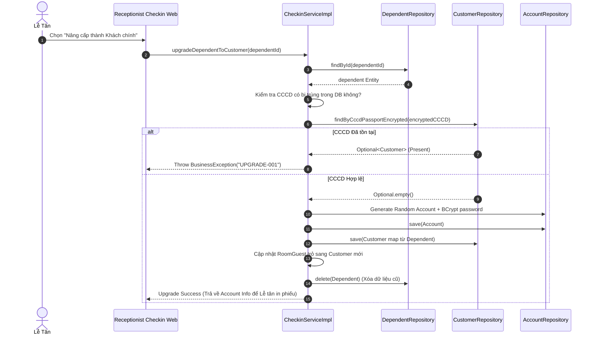

# ENGINEERING DOCUMENTATION STANDARD (EDS) v2.0

## WF-03 — Check-in Tiền sảnh (Front Office Check-in & Room Assignment)

| Field                       | Value                                      |
| --------------------------- | ------------------------------------------ |
| **Document ID**       | `KAWAI-WF03-IMP-001`                     |
| **Version**           | 1.0                                        |
| **Date**              | 2026-07-02                                 |
| **Status**            | Approved                                   |
| **Document Owner**    | Group 2 — SWP391 SE2023                   |
| **Author**            | Chu Xuân Dũng                            |
| **Based on EDS**      | v2.0                                       |
| **Workflow Ref**      | WF-03 —`02-Requirement/workflow.md`     |
| **ADR Ref**           | ADR-01 —`03-Design/ADR/ADR-01.md`       |
| **Class Diagram Ref** | CD-02 —`02-Requirement/classdiagram.md` |

---

### MỤC LỤC

1. [Tổng quan Module](#1-tổng-quan-module)
2. [Ma trận Truy vết (Traceability Matrix)](#2-ma-trận-truy-vết-traceability-matrix)
3. [Architecture Decision Records (ADR)](#3-architecture-decision-records-adr)
4. [Non-Functional Requirements &amp; SLA](#4-non-functional-requirements--sla)
5. [Static Modeling — Mô hình Tĩnh](#5-static-modeling--mô-hình-tĩnh)
6. [Dynamic Modeling — Mô hình Động](#6-dynamic-modeling--mô-hình-động)
7. [Domain Event Catalog](#7-domain-event-catalog)
8. [Interface Specification](#8-interface-specification)
9. [API Specification](#9-api-specification)
10. [Bảng mã lỗi (Error Codes)](#10-bảng-mã-lỗi-error-codes)
11. [Kế hoạch Triển khai Full-Stack (Step-by-Step)](#11-kế-hoạch-triển-khai-full-stack-step-by-step)
12. [Rollback &amp; Incident Runbook](#12-rollback--incident-runbook)
13. [TDD — Test Case Specification](#13-tdd--test-case-specification)
14. [Phương pháp Xác minh](#14-phương-pháp-xác-minh)
15. [API Verification Samples](#15-api-verification-samples)
16. [Authorization Matrix](#16-authorization-matrix)

---

## 1. Tổng quan Module

**WF-03 (Check-in Tiền sảnh)** là quy trình tiếp đón khách hàng thực tế tại khu nghỉ dưỡng Kawai Retreat Resort & Hub. Nghiệp vụ này có tầm quan trọng **CRITICAL** vì nó trực tiếp thay đổi trạng thái của phòng vật lý, thu thập dữ liệu nhạy cảm (PII) theo Luật Cư trú 2020, và khởi tạo vòng đời chi tiêu của khách (Credit Limit) thông qua hệ thống Folio.

Luồng này bao gồm các giai đoạn chính:

* **Tìm kiếm & Xác nhận Đơn hàng:** Lễ tân tìm Booking bằng mã số, tên hoặc số điện thoại. Đảm bảo trạng thái booking là `CONFIRMED`.
* **Khai báo Lưu trú (Guest Registry):** Thu thập CCCD/Hộ chiếu (sử dụng OCR tự động) để trích xuất Họ tên, Ngày sinh, Giới tính, CCCD số. Quản lý cả Khách hàng chính (Primary Contact) và Người đi kèm (Dependents).
* **Gán Phòng Vật lý:** Lễ tân chọn phòng từ Room Matrix. Hệ thống kiểm tra điều kiện `Vacant_Clean` (BR-FO-04).
* **Thiết lập Hạn mức Nợ (Credit Limit & PIN):** Phân bổ hạn mức chi tiêu cho từng phòng con từ tổng hạn mức booking. Khách hàng thiết lập mã PIN 4 số (BR-FO-06).
* **Xác nhận Check-in:** Cập nhật trạng thái phòng thành `Occupied_Clean`, `Room_Booking_Details` thành `CHECKED_IN` và ghi nhận Audit Log.

| Field                           | Value                                                                                     |
| ------------------------------- | ----------------------------------------------------------------------------------------- |
| **Module Name**           | `Front Office Check-in Service`                                                         |
| **Bounded Context**       | Front Office / Guest Services                                                             |
| **Data Classification**   | Sensitive PII (Căn cước công dân, Passport, Date of birth), Financial (Credit Limit) |
| **Upstream Dependencies** | WF-02 (Booking Online), OCR Engine API                                                    |
| **Downstream Consumers**  | WF-05 (F&B POS - ghi nợ Folio), WF-07 (Housekeeping), WF-04 (Check-out)                  |

---

## 2. Ma trận Truy vết (Traceability Matrix)

| Requirement ID       | Loại         | Mô tả yêu cầu                                                                                                                  | Thành phần Code                                                            | ADR liên quan |
| :------------------- | :------------ | :--------------------------------------------------------------------------------------------------------------------------------- | :--------------------------------------------------------------------------- | :------------- |
| **BR-FO-03**   | Business Rule | CRITICAL — Người đại diện pháp lý nhận phòng phải ≥ 18 tuổi                                                           | `ReceptionistCheckinWebController` validation, `CheckinServiceImpl`      | ADR-01         |
| **BR-FO-04**   | Business Rule | CRITICAL — Trạng thái phòng phải là`Vacant_Clean` mới được phép check-in. Khi xong chuyển thành `Occupied_Clean`. | `CheckinServiceImpl.validateRoomAvailableForCheckin()`                     | ADR-01         |
| **BR-FO-06**   | Business Rule | HIGH — Tổng hạn mức phòng con (`sub_credit_limit`) không vượt hạn mức của Booking tổng (`credit_limit`).           | `CheckinServiceImpl.updateCreditLimit()`, `TRG_Folio_Credit_Limit_Check` | ADR-01         |
| **BR-DATA-02** | Business Rule | CRITICAL — Tuân thủ Luật Cư trú: thu thập Họ tên, Ngày sinh, CCCD, Giới tính.                                          | `DependentRegistrationDTO`, `DependentServiceImpl`, OCR integration      | ADR-01         |
| **BR-SYS-01**  | Business Rule | CRITICAL — Mã hóa AES-256 cho CCCD/Passport và BCrypt cho PIN phòng.                                                          | `EncryptionUtils.encrypt()`, `PasswordEncoder.encode()`                  | ADR-01         |
| **UC12**       | Use Case      | Lễ tân tiền sảnh xử lý check-in.                                                                                             | `ReceptionistCheckinWebController.completeCheckin()`                       | ADR-01         |

---

## 3. Architecture Decision Records (ADR)

Áp dụng **ADR-01 (Spring Boot MVC Layered Architecture)**:

* **Controller Layer (Dual Mode):**
  * `ReceptionistCheckinWebController` (@Controller): Chịu trách nhiệm render Thymeleaf Views và nhận submit form phức tạp chứa nhiều phòng, nhiều khách hàng.
  * `CheckinApiController` (@RestController): Phục vụ các API bất đồng bộ như gọi OCR, validate CCCD real-time.
* **Service Layer (`CheckinServiceImpl`):**
  * Xử lý mọi logic kinh doanh cốt lõi (gán phòng, validate trạng thái, tính tổng credit).
  * Đảm bảo Atomicity (`@Transactional`) khi nâng cấp một Dependent thành Customer (tạo Account, Customer, cập nhật RoomGuest).
* **Security & Encryption:**
  * PIN phòng lưu trữ dưới dạng Hash (BCrypt).
  * Sử dụng `@PreAuthorize` kiểm soát quyền của Role `OP_RECEPTION_CHECKIN`.
* **Audit Logging:**
  * Hành động Check-in phải ghi lại bằng AOP `@LogActivity`.

---

## 4. Non-Functional Requirements & SLA

| Category              | Requirement                                                   | Target SLA | Verification                                  |
| :-------------------- | :------------------------------------------------------------ | :--------- | :-------------------------------------------- |
| **Performance** | Giao dịch Submit Check-in tổng hợp (p95)                   | < 800ms    | JMeter / k6                                   |
| **Performance** | Gọi API OCR bóc tách giấy tờ tùy thân (p95)            | < 3000ms   | APM tracing                                   |
| **Security**    | 100% PII CCCD lưu trong DB dưới dạng Encrypted String     | 100%       | Database query validation                     |
| **Integrity**   | Không cho phép lưu trùng CCCD trên 2 Customer khác nhau | 100%       | Constraint`UNIQUE(cccd_passport_encrypted)` |

---

## 5. Static Modeling — Mô hình Tĩnh

### 5.1 Database Entity Schema (Trọng điểm cho Check-in)

```sql
-- Bảng chứa chi tiết đặt phòng (1 dòng = 1 phòng con)
CREATE TABLE IF NOT EXISTS Room_Booking_Details (
    id                    BIGINT AUTO_INCREMENT PRIMARY KEY,
    room_booking_id       BIGINT NOT NULL,
    room_id               BIGINT NULL,          -- Được cập nhật khi Check-in
    detail_status         VARCHAR(30) NOT NULL DEFAULT 'PENDING', -- PENDING, CHECKED_IN, CHECKED_OUT
    sub_credit_limit      DECIMAL(15,2) DEFAULT 0.00,
    personal_pin_hash     VARCHAR(255) NULL,    -- BCrypt hash mã PIN 4 số
    FOREIGN KEY (room_booking_id) REFERENCES Room_Bookings(id),
    FOREIGN KEY (room_id) REFERENCES Rooms(id)
);

-- Khai báo thông tin người đi kèm (Dependent - Chưa có tài khoản)
CREATE TABLE IF NOT EXISTS Dependents (
    id                    BIGINT AUTO_INCREMENT PRIMARY KEY,
    customer_id           BIGINT NOT NULL,      -- Người bảo lãnh
    full_name             VARCHAR(255) NOT NULL,
    birth_date            DATE NULL,
    gender                VARCHAR(10) NULL,
    guest_type            VARCHAR(20) NOT NULL DEFAULT 'ADULT', -- ADULT, CHILD, INFANT
    cccd_passport_encrypted VARCHAR(512) NULL,  -- PII Data
    FOREIGN KEY (customer_id) REFERENCES Customers(id)
);

-- Bảng trung gian ánh xạ Người lưu trú vào Phòng cụ thể
CREATE TABLE IF NOT EXISTS Room_Guests (
    id                      BIGINT AUTO_INCREMENT PRIMARY KEY,
    room_booking_detail_id  BIGINT NOT NULL,
    customer_id             BIGINT NULL,
    dependent_id            BIGINT NULL,
    is_primary_contact      BOOLEAN NOT NULL DEFAULT FALSE,
    FOREIGN KEY (room_booking_detail_id) REFERENCES Room_Booking_Details(id),
    FOREIGN KEY (customer_id) REFERENCES Customers(id),
    FOREIGN KEY (dependent_id) REFERENCES Dependents(id),
    CHECK ((customer_id IS NOT NULL AND dependent_id IS NULL) OR 
           (customer_id IS NULL AND dependent_id IS NOT NULL))
);
```

---

## 6. Dynamic Modeling — Mô hình Động

### 6.1 Sequence Diagram: Nâng cấp Người đi kèm (Dependent) thành Khách hàng (Customer)



---

## 7. Domain Event Catalog

| Event Name             | Publisher              | Sync/Async | Consumer                                          | Trigger Cause                                   | Payload                          |
| :--------------------- | :--------------------- | :--------- | :------------------------------------------------ | :---------------------------------------------- | :------------------------------- |
| `RoomCheckedInEvent` | `CheckinServiceImpl` | Async      | `KDSWebsocketController`, `NightAuditService` | Check-in 1 phòng thành công                  | `bookingDetailId`, `roomId`  |
| `AuditLogEvent`      | `AuditLogAspect`     | Sync       | `AuditLogRepository`                            | Gọi method Service đánh dấu`@LogActivity` | `action`, `username`, `ip` |

---

## 8. Interface Specification

Giao diện `CheckinService` cốt lõi:

```java
package com.kawai.services.interfaces;

import com.kawai.models.RoomBookingDetail;
import java.math.BigDecimal;
import java.util.Map;

public interface CheckinService {
    /**
     * Check-in cho 1 phòng vật lý.
     * Cập nhật trạng thái phòng, hạn mức credit.
     * @throws IllegalStateException Nếu phòng không Vacant_Clean.
     */
    RoomBookingDetail checkIn(Long bookingDetailId, Long roomId, BigDecimal allocatedCreditLimit);

    /**
     * Nâng cấp người đi kèm lên thành tài khoản khách hàng để họ làm chủ hóa đơn (Split Folio).
     */
    Map<String, Object> upgradeDependentToCustomer(Long dependentId);

    /**
     * Điều chỉnh hạn mức phòng con (Validation BR-FO-06).
     */
    void updateCreditLimit(Long bookingDetailId, BigDecimal newCreditLimit);
}
```

---

## 9. API Specification

### 9.1 Web Endpoint (Form Submission)

* **URL:** `POST /receptionist/checkin/complete`
* **Method:** POST (application/x-www-form-urlencoded)
* **Security:** `@PreAuthorize("hasAnyAuthority('ROLE_ADMIN', 'ROLE_MANAGER', 'OP_RECEPTION_CHECKIN')")`

**Request Payload (qua `CheckinSubmitFormDTO`):**

```json
{
  "bookingId": 1045,
  "guestName": "Nguyen Van A",
  "phone": "0901234567",
  "assignedRoomNumbers": [101, 102],
  "assignedRoomCredits": [5000000, 2000000],
  "roomPinCodes": ["1234", "5678"],
  "dependents": [
    {
      "fullName": "Nguyen Thi B",
      "birthDate": "2010-05-15",
      "cccd": "",
      "guestType": "CHILD"
    }
  ]
}
```

**Response Flow:**

* **Thành công:** Redirect về `/receptionist/in-house` với FlashAttribute chứa thông báo "Check-in thành công".
* **Thất bại:** Redirect về `/receptionist/walk-in` hoặc trang Check-in cũ kèm theo mã lỗi (Validation error).

---

## 10. Bảng mã lỗi (Error Codes)

| Error Code         | HTTP Status | Message (Thông báo cho Lễ Tân)                                            | Cách xử lý (Runbook)                                     |
| :----------------- | :---------- | :---------------------------------------------------------------------------- | :---------------------------------------------------------- |
| `CHECKIN-001`    | 404         | Không tìm thấy Đơn hàng/Booking!                                        | Kiểm tra lại mã số booking.                             |
| `CHECKIN-VAL-01` | 400         | Số điện thoại không hợp lệ (phải bắt đầu bằng 0, 10 số).         | Xác nhận lại SĐT khách hàng.                          |
| `ROOM-001`       | 400         | Phòng đang trạng thái DIRTY/MAINTENANCE, không thể check-in. (BR-FO-04) | Đổi sang phòng`Vacant_Clean` khác trên hệ thống.   |
| `UPGRADE-001`    | 400         | Người đi kèm đã tồn tại trên hệ thống (Trùng CCCD).               | Không cần nâng cấp, chọn thẳng Khách hàng có sẵn. |
| `MOD2-UC14-016`  | 400         | Tổng hạn mức phân bổ vượt quá hạn mức của Đơn hàng. (BR-FO-06)  | Giảm`sub_credit_limit` hoặc yêu cầu nạp thêm cọc.  |

---

## 11. Kế hoạch Triển khai Full-Stack (Step-by-Step)

### Phase 1: Database & Entity Layer Update

Cập nhật các Entity JPA để hỗ trợ khai báo mã hóa CCCD và PIN phòng.

```java
// 1. RoomBookingDetail.java
@Entity
@Table(name = "Room_Booking_Details")
public class RoomBookingDetail {
    // ...
    @Column(name = "detail_status")
    private String detailStatus = "PENDING"; // PENDING, CHECKED_IN, CHECKED_OUT
  
    @Column(name = "sub_credit_limit")
    private BigDecimal subCreditLimit;
  
    @Column(name = "personal_pin_hash")
    private String personalPinHash;
}

// 2. Dependent.java
@Entity
@Table(name = "Dependents")
public class Dependent {
    // ...
    @Column(name = "cccd_passport_encrypted", length = 512)
    private String cccdPassportEncrypted;
}
```

### Phase 2: DTOs & Validation Layer

Tạo `CheckinSubmitFormDTO` để hứng dữ liệu từ View HTML.

```java
@Data
public class CheckinSubmitFormDTO {
    @NotNull(message = "Thiếu ID Booking")
    private Long bookingId;

    @NotBlank(message = "Họ tên người đặt không được để trống")
    private String guestName;

    @Pattern(regexp = "^0\\d{9}$", message = "SĐT không hợp lệ")
    private String phone;

    private List<Long> assignedRoomNumbers = new ArrayList<>();
    private List<BigDecimal> assignedRoomCredits = new ArrayList<>();
    private List<String> roomPinCodes = new ArrayList<>();
    private List<DependentRegistrationDTO> dependents = new ArrayList<>();
}
```

### Phase 3: Service Layer (Business Logic)

Triển khai `CheckinServiceImpl.java` để xử lý giao dịch.

```java
@Service
public class CheckinServiceImpl implements CheckinService {

    @Override
    @Transactional
    @LogActivity(action = "CHECKIN_ROOM", module = "FRONT_OFFICE")
    public RoomBookingDetail checkIn(Long detailId, Long roomId, BigDecimal creditLimit, String rawPin) {
        RoomBookingDetail detail = roomBookingDetailRepo.findById(detailId).orElseThrow();
        Room room = roomRepo.findById(roomId).orElseThrow();

        // BR-FO-04
        if (!"Vacant_Clean".equalsIgnoreCase(room.getRoomStatus())) {
            throw new BusinessException("ROOM-001", "Phòng chưa dọn dẹp, không thể Check-in.");
        }

        // Setup PIN
        if (rawPin != null && !rawPin.isEmpty()) {
            detail.setPersonalPinHash(passwordEncoder.encode(rawPin));
        }
  
        detail.setRoom(room);
        detail.setSubCreditLimit(creditLimit);
        detail.setDetailStatus("CHECKED_IN");
  
        room.setRoomStatus("Occupied_Clean");
        room.setCurrentBookingDetailId(detail.getId());
  
        // Auto update Booking status
        updateParentBookingStatus(detail.getRoomBooking());
  
        return roomBookingDetailRepo.save(detail);
    }
}
```

### Phase 4: Web Controller

Xử lý submit form từ giao diện Lễ tân.

```java
@Controller
@RequestMapping("/receptionist/checkin")
@PreAuthorize("hasAnyAuthority('ROLE_ADMIN', 'OP_RECEPTION_CHECKIN')")
public class ReceptionistCheckinWebController {

    @PostMapping("/complete")
    @Transactional
    public String completeCheckin(@Valid @ModelAttribute CheckinSubmitFormDTO form, 
                                  BindingResult bindingResult, 
                                  RedirectAttributes redirectAttributes) {
        if (bindingResult.hasErrors()) {
            redirectAttributes.addFlashAttribute("error", bindingResult.getAllErrors().get(0).getDefaultMessage());
            return "redirect:/receptionist/walk-in";
        }
  
        try {
            // Process Dependents & PII Encryption
            dependentService.saveDependents(form.getBookingId(), form.getDependents());
      
            // Iterate over selected rooms and check-in
            for (int i = 0; i < form.getAssignedRoomNumbers().size(); i++) {
                checkinService.checkIn(
                    // Lấy detail ID tương ứng với logic mapping
                    getDetailIdForRoomIndex(form.getBookingId(), i), 
                    form.getAssignedRoomNumbers().get(i),
                    form.getAssignedRoomCredits().get(i),
                    form.getRoomPinCodes().get(i)
                );
            }
      
            redirectAttributes.addFlashAttribute("success", "Check-in thành công!");
            return "redirect:/receptionist/in-house";
      
        } catch (BusinessException ex) {
            redirectAttributes.addFlashAttribute("error", ex.getMessage());
            return "redirect:/receptionist/walk-in";
        }
    }
}
```

### Phase 5: Giao diện Lễ Tân (Thymeleaf & JS)

Trang `/src/main/resources/templates/receptionist/check-in.html`.

```html
<form th:action="@{/receptionist/checkin/complete}" method="post" th:object="${checkinForm}">
    <!-- Thông tin khách chính -->
    <input type="hidden" th:field="*{bookingId}" />
    <input type="text" th:field="*{guestName}" class="form-control" required />
    <input type="text" th:field="*{phone}" class="form-control" />

    <!-- OCR Scanner Button -->
    <button type="button" id="btn-scan-cccd" class="btn btn-info">Quét CCCD (Auto-fill)</button>

    <!-- Danh sách Phòng & PIN -->
    <div id="room-list">
        <!-- JS động thêm các cụm input: assignedRoomNumbers[], assignedRoomCredits[], roomPinCodes[] -->
    </div>

    <!-- Người đi cùng -->
    <div id="dependent-list">
        <!-- JS động thêm dependents[i].fullName, birthDate, guestType -->
    </div>

    <button type="submit" class="btn btn-primary">Xác nhận Check-in</button>
</form>

<script>
    // Logic gọi API OCR và auto-fill data vào form
    document.getElementById('btn-scan-cccd').addEventListener('click', async () => {
        // ... OCR integration
    });
</script>
```

---

## 12. Rollback & Incident Runbook

### 12.1. Lỗi Overbooking do Race Condition

* **Triệu chứng:** Hai Lễ tân cùng lúc ấn nút Check-in gán cùng một số phòng (`Vacant_Clean`) cho hai khách khác nhau.
* **Xử lý (Runbook):**
  * Hệ thống dựa trên DB transaction isolation để báo lỗi khóa lạc quan (Optimistic Lock) đối với `Room`.
  * Giao dịch thứ 2 sẽ bị throw `ObjectOptimisticLockingFailureException`.
  * **Fallback UI:** Hiển thị thông báo "Phòng này vừa được Lễ tân khác cấp phát. Vui lòng tải lại trang Room Matrix và chọn phòng khác."

### 12.2. Lỗi OCR Service Timeout

* **Triệu chứng:** Hệ thống OCR của bên thứ 3 (API Python FaceID/OCR) không phản hồi.
* **Xử lý (Runbook):**
  * Lễ tân bỏ qua nút "Quét CCCD" và tiến hành nhập liệu thủ công (Manual Type) vào Form. Trải nghiệm khách hàng chậm hơn nhưng nghiệp vụ không bị gián đoạn.

### 12.3. Cảnh báo Vi phạm BR-FO-06 (Credit Limit)

* **Triệu chứng:** Lễ tân gõ nhầm hạn mức phân bổ cho phòng con quá lớn (Ví dụ: 10 triệu trong khi Booking gốc chỉ có nợ trần 5 triệu).
* **Xử lý:** `CheckinServiceImpl` throw lỗi 400. Transaction rollback, màn hình giữ nguyên data để Lễ tân sửa lại con số.

---

## 13. TDD — Test Case Specification

| Test Case ID  | Hàm Unit Test                     | Đầu Vào (Given)                                              | Hành Động (When)                  | Kết quả Kỳ vọng (Then)                                                            |
| :------------ | :--------------------------------- | :-------------------------------------------------------------- | :----------------------------------- | :------------------------------------------------------------------------------------ |
| `TC-FO-001` | `checkIn_Success`                | Room =`Vacant_Clean`, Booking = `CONFIRMED`, PIN = `1234` | Gọi`checkIn(...)`                 | Trạng thái phòng ->`Occupied_Clean`, detail -> `CHECKED_IN`, PIN hash matches. |
| `TC-FO-002` | `checkIn_Fails_When_Dirty`       | Room =`Vacant_Dirty`                                          | Gọi`checkIn(...)`                 | Ném`BusinessException("ROOM-001")`.                                                |
| `TC-FO-003` | `checkIn_Fails_When_Maintenance` | Room =`Maintenance`                                           | Gọi`checkIn(...)`                 | Ném`BusinessException("ROOM-001")`.                                                |
| `TC-FO-004` | `upgradeDependent_Success`       | Dependent không có CCCD trùng                                | Gọi`upgradeDependentToCustomer()` | Trả về Customer Account mới, RoomGuest cập nhật.                                 |
| `TC-FO-005` | `upgradeDependent_Fails_Dup`     | Dependent có CCCD đã map với Customer khác                 | Gọi`upgradeDependentToCustomer()` | Ném`BusinessException("UPGRADE-001")`.                                             |
| `TC-FO-006` | `creditLimit_Exceeds`            | `newLimit` = 5000, `parentLimit` = 3000                     | Gọi`updateCreditLimit()`          | Ném`BusinessException("MOD2-UC14-016")`.                                           |

---

## 14. Phương pháp Xác minh

| Tầng (Layer)                | Phương pháp                                                                                                                                    | Công cụ             | Trách nhiệm |
| :--------------------------- | :------------------------------------------------------------------------------------------------------------------------------------------------ | :-------------------- | :------------ |
| **Bảo mật PII**      | Truy xuất trực tiếp DB, đảm bảo cột`cccd_passport_encrypted` chứa dữ liệu không đọc được (Ciphertext).                          | MySQL Client          | Tech Lead     |
| **Logic Phân quyền** | `@WithMockUser(roles = "RECEPTIONIST")` để chạy các endpoint API                                                                            | JUnit 5 / Spring Test | Backend Dev   |
| **Nghiệp vụ E2E**    | Kịch bản duyệt UI: Tạo booking -> Tìm kiếm booking màn checkin -> Gán phòng -> Ấn submit. Báo phòng sang màu đỏ trên Room Matrix. | Cypress E2E           | QA Engineer   |

---

## 15. API Verification Samples

(Dành cho Tester mô phỏng Form Submission mà không cần qua giao diện)

```bash
# Gửi yêu cầu Check-in thông qua cURL (Form x-www-form-urlencoded)
curl -X POST "http://localhost:8080/receptionist/checkin/complete" \
  -H "Cookie: JSESSIONID=ABCD1234XYZ" \
  -H "Content-Type: application/x-www-form-urlencoded" \
  --data-urlencode "bookingId=9901" \
  --data-urlencode "guestName=Tran Van C" \
  --data-urlencode "phone=0987654321" \
  --data-urlencode "assignedRoomNumbers[0]=205" \
  --data-urlencode "assignedRoomCredits[0]=2000000" \
  --data-urlencode "roomPinCodes[0]=8888" \
  --data-urlencode "dependents[0].fullName=Tran Thi D" \
  --data-urlencode "dependents[0].birthDate=2015-10-10" \
  --data-urlencode "dependents[0].guestType=CHILD"
```

---

## 16. Authorization Matrix (Bảng chặn phân quyền)

| Endpoint / Action                       | GUEST | CUSTOMER | RECEPTIONIST | ADMIN/MANAGER |
| :-------------------------------------- | :---: | :------: | :----------: | :-----------: |
| `GET /receptionist/walk-in`           |  ❌  |    ❌    |     ✔️     |     ✔️     |
| `POST /receptionist/checkin/complete` |  ❌  |    ❌    |     ✔️     |     ✔️     |
