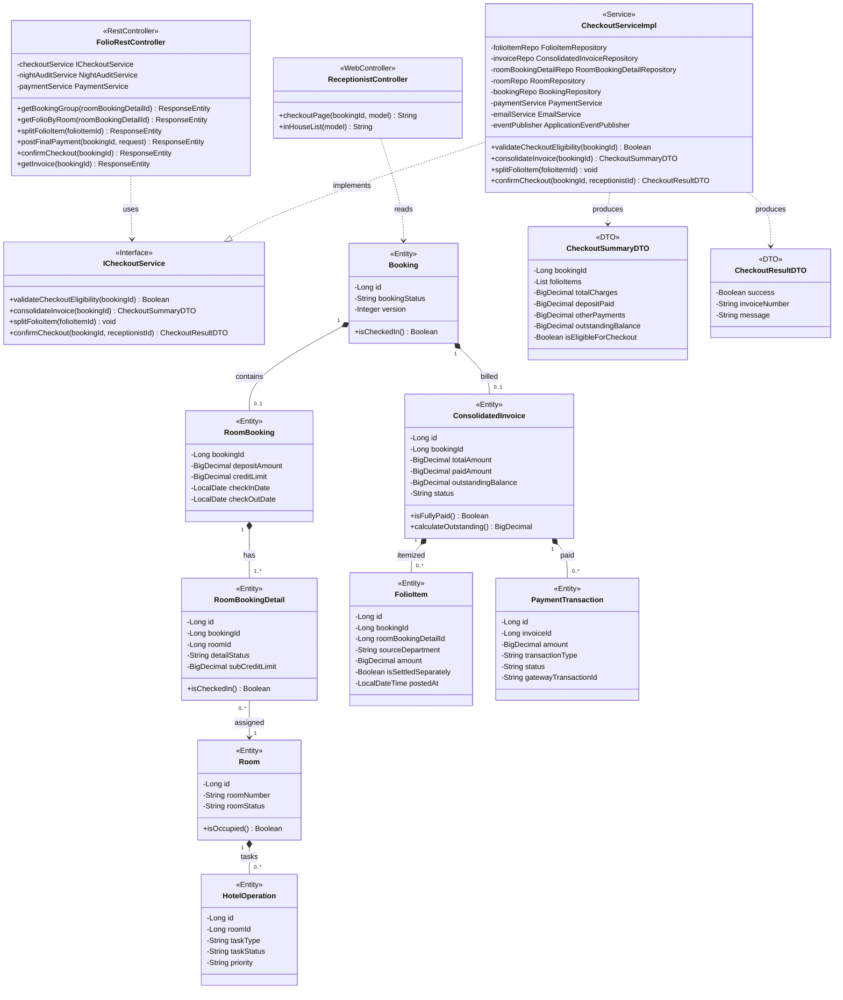
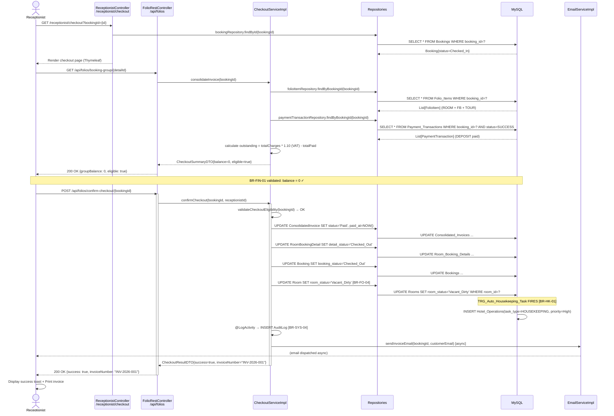
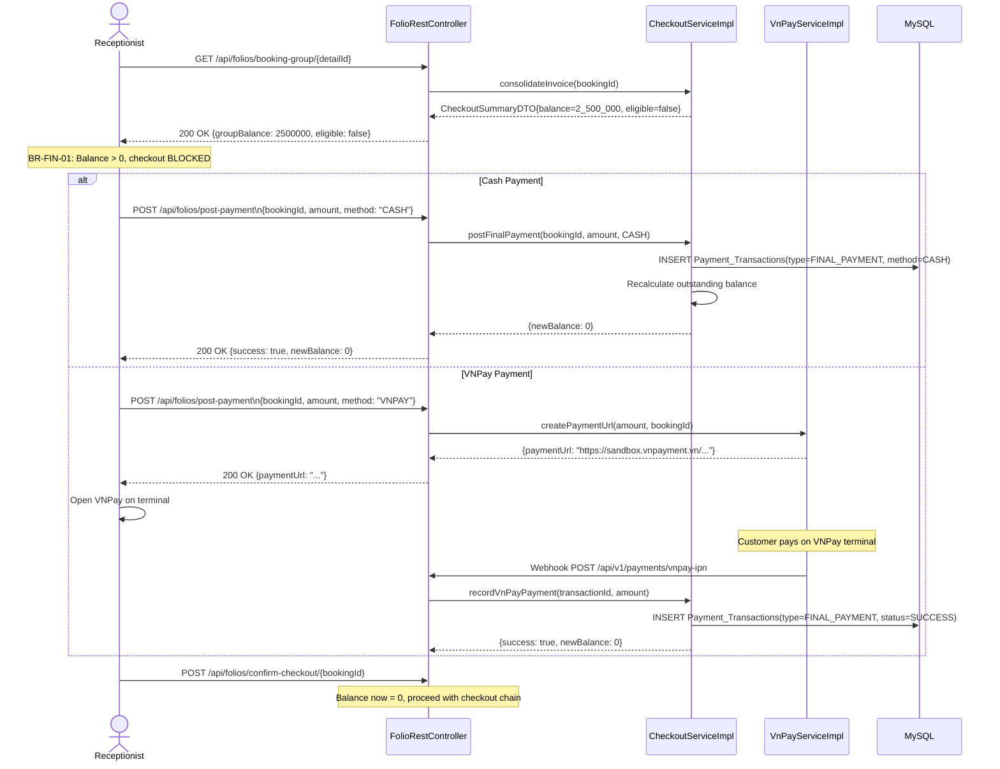
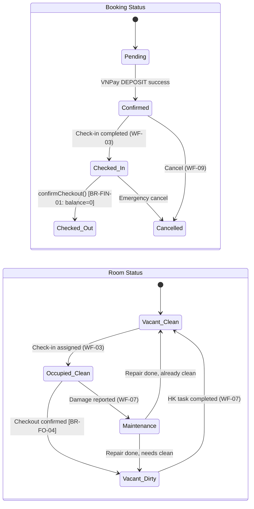

# ENGINEERING DOCUMENTATION STANDARD (EDS) v2.0
## WF-04 — Check-out & Tổng hợp Hóa đơn

| Field | Value |
|---|---|
| **Document ID** | `KAWAI-CHECKOUT-IMP-001` |
| **Version** | 1.0 |
| **Date** | 2026-06-29 |
| **Status** | Draft |
| **Document Owner** | Team Lead — Group 2 SWP391 |
| **Author** | Business Analyst + Tech Lead |
| **Reviewed by** | Principal Architect |
| **DPO Sign-off** | `[ ] Pending` |
| **Approved by** | `[ ] Pending` |
| **Last Review** | 2026-06-29 |
| **Based on EDS** | v2.0 |
| **Workflow Ref** | WF-04 — `02-Requirement/workflow.md` |
| **ADR Ref** | ADR-01 — `03-Design/ADR/ADR-01.md` |

---

### CHANGELOG

> [!IMPORTANT]
> **Policy 4.4 — Immutable History:** Không bao giờ xóa thông tin cũ.

| Ngày | Người thực hiện | Nội dung thay đổi |
|---|---|---|
| 2026-06-29 | `Tech Lead — Group 2` | Tạo tài liệu lần đầu — EDS + TDD spec cho WF-04 Check-out |

---

### MỤC LỤC

1. [Tổng quan Module](#1-tổng-quan-module)
2. [Ma trận Truy vết](#2-ma-trận-truy-vết-traceability-matrix)
3. [Architecture Decision Records](#3-architecture-decision-records-adr)
4. [Non-Functional Requirements & SLA](#4-non-functional-requirements--sla)
5. [Static Modeling — Mô hình Tĩnh](#5-static-modeling-mô-hình-tĩnh)
6. [Dynamic Modeling — Mô hình Động](#6-dynamic-modeling-mô-hình-động)
7. [Domain Event Catalog](#7-domain-event-catalog)
8. [Interface Specification](#8-interface-specification-đặc-tả-giao-diện)
9. [API Specification](#9-api-specification)
10. [Bảng mã lỗi](#10-bảng-mã-lỗi-error-codes)
11. [Kế hoạch Triển khai Full-Stack](#11-kế-hoạch-triển-khai-full-stack-step-by-step)
12. [Rollback & Incident Runbook](#12-rollback--incident-runbook)
13. [TDD — Test Case Specification](#13-tdd--test-case-specification)
14. [Phương pháp Xác minh](#14-phương-pháp-xác-minh)
15. [API Verification Samples](#15-api-verification-samples)
16. [Authorization Matrix](#16-authorization-matrix)

---

## 1. Tổng quan Module

### 1.1 Mô tả nghiệp vụ

**WF-04 — Check-out & Tổng hợp Hóa đơn** là quy trình kết thúc lưu trú của khách tại **Kawai Retreat Resort & Hub**. Đây là điểm cuối của Guest Journey từ Booking → Check-in → Occupancy → **Check-out**.

**Phạm vi nghiệp vụ:**
- Lễ tân tra cứu và xác nhận trạng thái Booking đang `Checked_In`
- Truy xuất toàn bộ `FolioItems` (Room charges, F&B, Tour) chưa thanh toán
- Tổng hợp `ConsolidatedInvoice`: tính số dư nợ = charges - deposit - payments
- Tùy chọn tách hóa đơn (`is_settled_separately`) cho F&B hoặc Tour
- Khách thanh toán số dư còn lại (Cash / VNPay)
- Khi balance = 0: thực hiện chuỗi UPDATE → Trigger HK → Gửi e-Invoice email

| Field | Value |
|---|---|
| **Module Name** | `Checkout & Invoice Consolidation` |
| **Bounded Context** | Front Office / Finance |
| **Data Classification** | Confidential / PII (thông tin thanh toán, thông tin khách) |
| **Compliance Scope** | Luật Kế toán Việt Nam 88/2015/QH13; Luật Cư trú 2020 |
| **Upstream Dependencies** | WF-03 Check-in, WF-05 F&B Post-to-Room, WF-06 Tour Booking, WF-08 Night Audit |
| **Downstream Consumers** | WF-07 Housekeeping (Room Status), WF-11 Review (Review Deadline) |

### 1.2 Actors & Roles

| Actor | Role | Hành động chính |
|:------|:-----|:----------------|
| **Receptionist** | `ROLE_RECEPTIONIST` / `OP_RECEPTION_CHECKOUT` | Tra cứu booking, xem folio, xác nhận checkout |
| **Customer** | Authenticated Session | Theo dõi hóa đơn, nhận e-Invoice email |
| **System** | Scheduler / DB Trigger | Trigger tạo HK task, gửi email, Night Audit |
| **Manager** | `ROLE_MANAGER` | Xem báo cáo checkout, override nếu cần |

---

## 2. Ma trận Truy vết (Traceability Matrix)

> [!NOTE]
> **Policy:** Không viết code nếu không biết code đó phục vụ Rule nào.

| Requirement ID | Loại | Mô tả yêu cầu | Thành phần Code | ADR liên quan |
|:---|:---|:---|:---|:---|
| **BR-FIN-01** | Business Rule | Balance = 0 bắt buộc trước checkout | `FolioService.validateCheckoutEligibility()` | ADR-01 |
| **BR-FO-04** | Business Rule | Phòng → `Vacant_Dirty` sau checkout | `RoomService.transitionToVacantDirty()` | ADR-01 |
| **BR-HK-01** | Business Rule | DB Trigger tạo HK Task priority=High | `TRG_Auto_Housekeeping_Task` (DB) | ADR-01 |
| **BR-SYS-04** | Business Rule | Ghi Audit Log mọi hành động checkout | `@LogActivity` AOP Aspect | ADR-01 |
| **BR-FIN-04** | Business Rule | FolioItems phân loại USALI (ROOM/FB/TOUR) | `FolioItem.sourceDepartment` | ADR-01 |
| **UC-08** | Use Case | Check-out Booking | `FolioRestController.POST /api/folios/checkout` | ADR-01 |
| **UC-28** | Use Case | Xem Consolidated Invoice | `FolioRestController.GET /api/folios/invoice/{id}` | ADR-01 |
| **UC-29** | Use Case | Tách hóa đơn (Split Invoice) | `FolioRestController.POST /api/folios/split` | ADR-01 |
| **UC21.3** (Spec) | Use Case | Post final payment | `PaymentService.postFinalPayment()` | ADR-01 |
| **UC22.1** (Spec) | Use Case | Render và gửi e-Invoice | `EmailService.sendInvoiceEmail()` | ADR-01 |

---

## 3. Architecture Decision Records (ADR)

### ADR-01 — Spring Boot MVC Layered (Kế thừa từ 03-Design/ADR/ADR-01.md)

| Field | Value |
|---|---|
| **Status** | Accepted |
| **Date** | 2026-06-29 |
| **Supersedes** | N/A |

**Bối cảnh:** WF-04 cần phối hợp nhiều layer: Web Controller (Thymeleaf page) + REST API (AJAX calls từ folio panel) + Service business logic + Repository. Phải tuân theo kiến trúc đã thiết lập trong ADR-01.

**Quyết định áp dụng cho WF-04:**
- **Web Controller** (`ReceptionistController`): Serve Thymeleaf page `/receptionist/checkout`
- **REST Controller** (`FolioRestController`): Handle AJAX — lấy folio, tính balance, confirm checkout
- **Service** (`FolioService`, `PaymentService`, `RoomService`, `EmailService`): Business logic
- **Repository**: JPA queries
- **DB Trigger**: `TRG_Auto_Housekeeping_Task` sau `UPDATE Rooms SET room_status = 'Vacant_Dirty'`

**Hệ quả:**
- **Tích cực:** Nhất quán với codebase hiện tại; Receptionist dùng cùng portal
- **Tiêu cực:** FolioRestController đã 49KB — cần tách thêm Service layer, không thêm logic vào Controller

---

## 4. Non-Functional Requirements & SLA

### 4.1 Performance & Availability

| Category | Requirement | Target SLA | Measurement | Compliance |
|:---|:---|:---|:---|:---|
| **Latency** | API response folio load (p99) | < 500ms | Manual test / JMeter | — |
| **Latency** | Checkout confirm end-to-end | < 2s | Manual test | — |
| **Availability** | Checkout module uptime | 99.9% | Uptime monitor | — |
| **Email delivery** | e-Invoice email sau checkout | < 60 giây | SendGrid webhook | — |

### 4.2 Data Integrity & Retention

| Category | Requirement | Target | Verification | Compliance |
|:---|:---|:---|:---|:---|
| **Durability** | Không mất giao dịch thanh toán | RPO = 0 | @Transactional + DB log | Luật Kế toán |
| **Retention** | Audit Log checkout actions | 7 năm | DB backup policy | Luật KT 88/2015 |
| **Consistency** | Balance = 0 trước khi checkout được phép | 100% | Unit test + DB check | BR-FIN-01 |
| **Atomicity** | Checkout chuỗi UPDATE atomic | 100% | @Transactional | ADR-01 |

### 4.3 Security

| Category | Requirement | Target | Verification |
|:---|:---|:---|:---|
| **Access control** | Chỉ RECEPTIONIST / ADMIN được checkout | RBAC | `@PreAuthorize` |
| **Audit** | Mọi checkout action ghi AuditLog | 100% | `@LogActivity` AOP |
| **No PII in logs** | Không log số thẻ / PIN | Zero tolerance | Log review |

### 4.4 Scalability

Dự kiến: 50-100 checkout/ngày. Không cần horizontal scaling. MySQL connection pool 10-20 connections là đủ.

---

## 5. Static Modeling — Mô hình Tĩnh

### 5.1 Class Diagram — WF-04 Checkout Module



### 5.2 Database Schema — Các bảng liên quan WF-04

```sql
-- ═══════════════════════════════════════════════
-- TABLES INVOLVED IN WF-04 CHECKOUT
-- ═══════════════════════════════════════════════

-- 1. Bookings — Trạng thái booking lifecycle
-- booking_status: Pending | Confirmed | Checked_In | Checked_Out | Cancelled
CREATE TABLE Bookings (
    booking_id      BIGINT PRIMARY KEY AUTO_INCREMENT,
    customer_id     BIGINT NOT NULL,
    booking_date    DATE NOT NULL,
    total_price     DECIMAL(15,2) NOT NULL,
    booking_status  VARCHAR(30) NOT NULL DEFAULT 'Pending',
    booking_source  VARCHAR(30) NOT NULL DEFAULT 'Direct_Web',
    version         INT NOT NULL DEFAULT 1,     -- Optimistic Lock (BR-FO-01)
    notes           TEXT,
    CONSTRAINT fk_booking_customer FOREIGN KEY (customer_id) REFERENCES Customers(customer_id)
);

-- 2. Room_Bookings — Chi tiết đặt phòng (extends Booking via JOINED inheritance)
CREATE TABLE Room_Bookings (
    booking_id          BIGINT PRIMARY KEY,
    deposit_amount      DECIMAL(15,2),
    credit_limit        DECIMAL(15,2),
    check_in_date       DATE,
    check_out_date      DATE,
    cancellation_deadline DATETIME,
    CONSTRAINT fk_rb_booking FOREIGN KEY (booking_id) REFERENCES Bookings(booking_id)
);

-- 3. Room_Booking_Details — Từng phòng trong booking
-- detail_status: Pending | Confirmed | Checked_In | Checked_Out | Cancelled
CREATE TABLE Room_Booking_Details (
    detail_id               BIGINT PRIMARY KEY AUTO_INCREMENT,
    booking_id              BIGINT NOT NULL,
    room_id                 BIGINT,
    category_id             BIGINT,
    guest_customer_id       BIGINT,
    detail_status           VARCHAR(30) NOT NULL DEFAULT 'Pending',
    room_charge             DECIMAL(15,2),
    sub_credit_limit        DECIMAL(15,2),
    personal_pin_hash       VARCHAR(255),
    is_charge_to_room_allowed BOOLEAN DEFAULT FALSE,
    CONSTRAINT fk_rbd_booking FOREIGN KEY (booking_id) REFERENCES Bookings(booking_id),
    CONSTRAINT fk_rbd_room FOREIGN KEY (room_id) REFERENCES Rooms(room_id)
);

-- 4. Consolidated_Invoices — Hóa đơn tổng hợp
-- status: Open | Paid | Voided
CREATE TABLE Consolidated_Invoices (
    invoice_id          BIGINT PRIMARY KEY AUTO_INCREMENT,
    booking_id          BIGINT NOT NULL UNIQUE,
    subtotal_amount     DECIMAL(15,2) DEFAULT 0,
    vat_amount          DECIMAL(15,2) DEFAULT 0,
    discount_amount     DECIMAL(15,2) DEFAULT 0,
    total_amount        DECIMAL(15,2) DEFAULT 0,
    paid_amount         DECIMAL(15,2) DEFAULT 0,
    outstanding_balance DECIMAL(15,2) DEFAULT 0,
    status              VARCHAR(20) NOT NULL DEFAULT 'Open',
    promo_code          VARCHAR(50),
    issued_at           DATETIME,
    paid_at             DATETIME,
    CONSTRAINT fk_inv_booking FOREIGN KEY (booking_id) REFERENCES Bookings(booking_id)
);

-- 5. Folio_Items — Dòng phí chi tiết
-- source_department: ROOM | FB | TOUR | OTHER
CREATE TABLE Folio_Items (
    folio_item_id       BIGINT PRIMARY KEY AUTO_INCREMENT,
    booking_id          BIGINT NOT NULL,
    room_booking_detail_id BIGINT,
    source_department   VARCHAR(20) NOT NULL,   -- BR-FIN-04 USALI
    description         VARCHAR(255),
    amount              DECIMAL(15,2) NOT NULL,
    signature_img_url   VARCHAR(500),
    is_settled_separately BOOLEAN DEFAULT FALSE, -- UC-29 Split Invoice
    posted_at           DATETIME DEFAULT NOW(),
    CONSTRAINT fk_fi_booking FOREIGN KEY (booking_id) REFERENCES Bookings(booking_id),
    CONSTRAINT fk_fi_rbd FOREIGN KEY (room_booking_detail_id) REFERENCES Room_Booking_Details(detail_id)
);

-- 6. Payment_Transactions — Các giao dịch thanh toán
-- transaction_type: DEPOSIT | FINAL_PAYMENT | REFUND | ROOM_BOOKING
-- status: SUCCESS | FAILED | PENDING
CREATE TABLE Payment_Transactions (
    transaction_id      BIGINT PRIMARY KEY AUTO_INCREMENT,
    booking_id          BIGINT NOT NULL,
    invoice_id          BIGINT,
    amount              DECIMAL(15,2) NOT NULL,
    payment_method      VARCHAR(30),   -- CASH | VNPAY | BANK_TRANSFER
    transaction_type    VARCHAR(30) NOT NULL,
    status              VARCHAR(20) NOT NULL,
    gateway_transaction_id VARCHAR(100),
    processed_at        DATETIME DEFAULT NOW(),
    CONSTRAINT fk_pt_booking FOREIGN KEY (booking_id) REFERENCES Bookings(booking_id)
);

-- 7. Rooms — Trạng thái phòng vật lý
-- room_status: Vacant_Clean | Occupied_Clean | Vacant_Dirty | Maintenance
CREATE TABLE Rooms (
    room_id                 BIGINT PRIMARY KEY AUTO_INCREMENT,
    room_number             VARCHAR(10) NOT NULL UNIQUE,
    category_id             BIGINT,
    room_status             VARCHAR(30) NOT NULL DEFAULT 'Vacant_Clean',
    active_booking_detail_id BIGINT,
    CONSTRAINT fk_room_category FOREIGN KEY (category_id) REFERENCES Room_Categories(category_id)
);

-- 8. Hotel_Operations — Housekeeping & Maintenance tasks
-- task_type: HOUSEKEEPING | MAINTENANCE
-- task_status: Pending | In_Progress | Completed | Cancelled
-- priority: Low | Normal | High | Urgent
CREATE TABLE Hotel_Operations (
    operation_id    BIGINT PRIMARY KEY AUTO_INCREMENT,
    room_id         BIGINT NOT NULL,
    staff_id        BIGINT,
    task_type       VARCHAR(30) NOT NULL,
    task_status     VARCHAR(30) NOT NULL DEFAULT 'Pending',
    priority        VARCHAR(20) NOT NULL DEFAULT 'Normal',
    description     TEXT,
    scheduled_at    DATETIME,
    completed_at    DATETIME,
    CONSTRAINT fk_ho_room FOREIGN KEY (room_id) REFERENCES Rooms(room_id)
);

-- ═══════════════════════════════════════════════
-- DB TRIGGER — BR-HK-01: Auto-create Housekeeping Task after checkout
-- ═══════════════════════════════════════════════
DELIMITER $$
CREATE TRIGGER TRG_Auto_Housekeeping_Task
AFTER UPDATE ON Rooms
FOR EACH ROW
BEGIN
    -- Khi phòng chuyển sang Vacant_Dirty (sau check-out)
    IF NEW.room_status = 'Vacant_Dirty' AND OLD.room_status = 'Occupied_Clean' THEN
        INSERT INTO Hotel_Operations (
            room_id, task_type, task_status, priority, description, scheduled_at
        ) VALUES (
            NEW.room_id,
            'HOUSEKEEPING',
            'Pending',
            'High',        -- BR-HK-01: priority = High sau check-out
            CONCAT('Auto-generated after checkout for Room ', NEW.room_number),
            NOW()
        );
    END IF;
END$$
DELIMITER ;

-- ═══════════════════════════════════════════════
-- INDEX — Optimize checkout queries
-- ═══════════════════════════════════════════════
CREATE INDEX idx_bookings_status ON Bookings(booking_status);
CREATE INDEX idx_rbd_booking ON Room_Booking_Details(booking_id, detail_status);
CREATE INDEX idx_folio_booking ON Folio_Items(booking_id, is_settled_separately);
CREATE INDEX idx_payment_booking ON Payment_Transactions(booking_id, status, transaction_type);
CREATE INDEX idx_rooms_status ON Rooms(room_status);
```

---

## 6. Dynamic Modeling — Mô hình Động

### 6.1 Sequence Diagram — Happy Path (Balance = 0 ngay)



### 6.2 Sequence Diagram — Error Path (Balance > 0, cần thanh toán thêm)



### 6.3 State Machine — Booking Status & Room Status



> [!WARNING]
> **Invariants bất biến — không được vi phạm:**
> 1. `booking_status = Checked_Out` KHÔNG thể quay lại bất kỳ trạng thái nào khác
> 2. `room_status = Vacant_Dirty` chỉ được chuyển về `Vacant_Clean` khi HK task = `Completed`
> 3. `ConsolidatedInvoice.outstanding_balance` phải = 0 trước khi `booking_status → Checked_Out`
> 4. `FolioItem` và `PaymentTransaction` là Append-only — không UPDATE/DELETE sau khi đã `Checked_Out`

---

## 7. Domain Event Catalog

### 7.1 Events Published (WF-04 phát ra)

| Event Name | Trigger | Publisher | Subscriber(s) | Async? |
|:---|:---|:---|:---|:---|
| `BookingCheckedOut` | `confirmCheckout()` success | `CheckoutServiceImpl` | `HousekeepingService`, `ReviewService` | Yes |
| `InvoicePaid` | `ConsolidatedInvoice.status = Paid` | `CheckoutServiceImpl` | `EmailService` (gửi e-Invoice) | Yes |
| `RoomStatusChanged` | `Room.roomStatus = Vacant_Dirty` | `RoomServiceImpl` | `HousekeepingService` (tạo task) | Sync (DB Trigger) |
| `AuditLogCreated` | Mọi action checkout | `AuditLogAspect` | `AuditLogRepository` | Sync |

### 7.2 Events Consumed (WF-04 tiêu thụ)

| Event Name | Source | Handler | Action |
|:---|:---|:---|:---|
| `FolioItemPosted` | WF-05 F&B, WF-06 Tour | `FolioRestController` | Cập nhật balance real-time |
| `NightAuditCompleted` | WF-08 Scheduler | `CheckoutService` | Folio đã có đầy đủ room charges |

### 7.3 Payload Schema — BookingCheckedOut

```java
// BookingCheckedOutEvent.java
public class BookingCheckedOutEvent extends ApplicationEvent {
    private final Long bookingId;
    private final Long roomBookingDetailId;
    private final Long receptionistAccountId;
    private final LocalDateTime checkedOutAt;
    private final String invoiceNumber;
    private final BigDecimal finalAmount;
    // getters...
}
```

---

## 8. Interface Specification — Đặc tả Giao diện

### 8.1 Service Interface — ICheckoutService

```java
// ICheckoutService.java — @version 1.0
public interface ICheckoutService {

    /**
     * Kiểm tra đủ điều kiện checkout: balance = 0, booking đang Checked_In
     * @throws BusinessException("CHECKOUT-001") nếu balance > 0
     * @throws BusinessException("CHECKOUT-002") nếu booking không ở Checked_In
     */
    boolean validateCheckoutEligibility(Long bookingId);

    /**
     * Tổng hợp hóa đơn: folio items + payments + deposit → outstanding balance
     */
    CheckoutSummaryDTO consolidateInvoice(Long bookingId);

    /**
     * Đánh dấu folio item là thanh toán riêng (Split Invoice - UC-29)
     * @throws BusinessException("CHECKOUT-003") nếu folio item không tồn tại
     */
    void splitFolioItem(Long folioItemId, boolean isSettledSeparately);

    /**
     * Ghi nhận thanh toán cuối (CASH/VNPAY) trước khi checkout
     * @throws BusinessException("CHECKOUT-004") nếu amount không hợp lệ
     */
    PaymentTransaction postFinalPayment(Long bookingId, BigDecimal amount, String paymentMethod);

    /**
     * Xác nhận checkout: UPDATE chain → Trigger HK → Send email
     * @throws BusinessException("CHECKOUT-001") nếu balance > 0
     * @throws OptimisticLockException nếu concurrent update xảy ra
     */
    @Transactional
    @LogActivity(action = "CHECKOUT_CONFIRMED", module = "FRONT_OFFICE")
    CheckoutResultDTO confirmCheckout(Long bookingId, Long receptionistAccountId);
}
```

### 8.2 Repository Interfaces cần thiết

```java
// FolioItemRepository
List<FolioItem> findByBookingId(Long bookingId);
List<FolioItem> findByBookingIdAndIsSettledSeparately(Long bookingId, Boolean isSettledSeparately);

// ConsolidatedInvoiceRepository
Optional<ConsolidatedInvoice> findByBookingId(Long bookingId);

// RoomBookingDetailRepository
List<RoomBookingDetail> findByRoomBookingId(Long bookingId);
Optional<RoomBookingDetail> findByRoomBookingIdAndDetailStatus(Long bookingId, String status);

// PaymentTransactionRepository
List<PaymentTransaction> findByBookingIdAndStatus(Long bookingId, PaymentStatus status);
BigDecimal sumAmountByBookingIdAndStatus(Long bookingId, PaymentStatus status);

// BookingRepository
Optional<Booking> findByIdAndBookingStatus(Long id, String status);

// RoomRepository
void updateRoomStatus(Long roomId, String status);
```

### 8.3 DTO Classes

```java
// CheckoutSummaryDTO.java
public class CheckoutSummaryDTO {
    private Long bookingId;
    private Long invoiceId;
    private List<FolioItemDTO> folioItems;    // All items grouped by department
    private BigDecimal roomCharges;           // USALI: ROOM
    private BigDecimal fbCharges;             // USALI: FB
    private BigDecimal tourCharges;           // USALI: TOUR
    private BigDecimal subtotal;
    private BigDecimal vatAmount;             // 10% VAT
    private BigDecimal discountAmount;
    private BigDecimal totalCharges;
    private BigDecimal depositPaid;
    private BigDecimal otherPayments;
    private BigDecimal outstandingBalance;    // BR-FIN-01: must be 0
    private Boolean isEligibleForCheckout;   // = outstandingBalance == 0
    private String checkInDate;
    private String checkOutDate;
    private String guestName;
    private String roomNumber;
}

// CheckoutResultDTO.java
public class CheckoutResultDTO {
    private Boolean success;
    private String invoiceNumber;
    private String message;
    private LocalDateTime checkedOutAt;
    private String emailSentTo;
}

// FolioItemDTO.java
public class FolioItemDTO {
    private Long id;
    private String sourceDepartment; // ROOM | FB | TOUR
    private String description;
    private BigDecimal amount;
    private Boolean isSettledSeparately;
    private String postedAt;
}
```

---

## 9. API Specification

### 9.1 Endpoints Table

| Method | Path | Auth Level | Required Roles | Idempotent? |
|:---|:---|:---|:---|:---|
| `GET` | `/receptionist/checkout` | Session | `OP_RECEPTION_CHECKOUT`, `ROLE_ADMIN` | Yes |
| `GET` | `/api/folios/booking-group/{detailId}` | Session | `OP_RECEPTION_CHECKOUT`, `ROLE_ADMIN` | Yes |
| `GET` | `/api/folios/room/{roomBookingDetailId}` | Session | `OP_RECEPTION_CHECKOUT` | Yes |
| `POST` | `/api/folios/split/{folioItemId}` | Session | `OP_RECEPTION_CHECKOUT` | Yes |
| `POST` | `/api/folios/post-payment` | Session | `OP_RECEPTION_CHECKOUT` | No |
| `POST` | `/api/folios/confirm-checkout/{bookingId}` | Session | `OP_RECEPTION_CHECKOUT` | No |
| `GET` | `/api/folios/invoice/{bookingId}` | Session | `OP_RECEPTION_CHECKOUT`, `ROLE_MANAGER` | Yes |

### 9.2 Request / Response Schemas

#### GET `/receptionist/checkout?bookingId={id}` — Trang Checkout

*Web controller — returns Thymeleaf view `receptionist/checkout`*

Model attributes:
```java
model.addAttribute("booking", booking);
model.addAttribute("checkoutSummary", checkoutService.consolidateInvoice(bookingId));
model.addAttribute("rooms", roomBookingDetails);
```

---

#### GET `/api/folios/booking-group/{detailId}` — Lấy tổng hợp folio

*Response — 200 OK:*
```json
{
  "success": true,
  "rooms": [
    {"id": 101, "roomNumber": "201"},
    {"id": 102, "roomNumber": "202"}
  ],
  "groupTotalCharges": 5500000,
  "groupTotalPayments": 3000000,
  "prePaidDeposit": 2000000,
  "otherPayments": 1000000,
  "groupBalance": 2500000
}
```

*Response — 400 Bad Request:*
```json
{
  "success": false,
  "message": "RoomBookingDetail không tồn tại"
}
```

---

#### POST `/api/folios/post-payment` — Ghi nhận thanh toán cuối

*Request Body:*
```json
{
  "bookingId": 1001,
  "amount": 2500000,
  "paymentMethod": "CASH",
  "note": "Thanh toán tiền mặt tại quầy"
}
```

*Response — 200 OK:*
```json
{
  "success": true,
  "transactionId": "TXN-20260629-001",
  "newBalance": 0,
  "message": "Ghi nhận thanh toán thành công"
}
```

*Response — 400 — Amount không hợp lệ:*
```json
{
  "success": false,
  "error": {
    "code": "CHECKOUT-004",
    "message": "Số tiền thanh toán không hợp lệ",
    "details": [{"field": "amount", "message": "Amount phải > 0"}]
  }
}
```

---

#### POST `/api/folios/confirm-checkout/{bookingId}` — Xác nhận Check-out

*Response — 200 OK:*
```json
{
  "success": true,
  "invoiceNumber": "INV-2026-001",
  "checkedOutAt": "2026-06-29T14:30:00",
  "emailSentTo": "guest@example.com",
  "message": "Check-out thành công. E-Invoice đã được gửi."
}
```

*Response — 409 Conflict — Balance > 0:*
```json
{
  "success": false,
  "error": {
    "code": "CHECKOUT-001",
    "message": "Không thể check-out khi còn số dư nợ chưa thanh toán",
    "details": {"outstandingBalance": 2500000}
  }
}
```

*Response — 409 Conflict — Booking không ở Checked_In:*
```json
{
  "success": false,
  "error": {
    "code": "CHECKOUT-002",
    "message": "Booking không ở trạng thái Checked_In",
    "details": {"currentStatus": "Checked_Out"}
  }
}
```

---

## 10. Bảng mã lỗi (Error Codes)

| Code | HTTP | Message EN | Message VI | Trigger |
|:---|:---|:---|:---|:---|
| `CHECKOUT-001` | 409 | Outstanding balance exists | Còn dư nợ chưa thanh toán | `outstandingBalance > 0` khi confirm checkout |
| `CHECKOUT-002` | 409 | Booking not in Checked_In status | Booking chưa ở Checked_In | `booking_status != Checked_In` |
| `CHECKOUT-003` | 404 | FolioItem not found | Không tìm thấy dòng phí | `folioItemId` không tồn tại |
| `CHECKOUT-004` | 400 | Invalid payment amount | Số tiền không hợp lệ | `amount <= 0` hoặc null |
| `CHECKOUT-005` | 404 | Booking not found | Không tìm thấy booking | `bookingId` không tồn tại |
| `CHECKOUT-006` | 403 | Insufficient permissions | Không đủ quyền thực hiện | User thiếu role `OP_RECEPTION_CHECKOUT` |
| `CHECKOUT-007` | 409 | Concurrent modification | Xung đột cập nhật đồng thời | `OptimisticLockException` (`@Version`) |
| `CHECKOUT-008` | 500 | Email dispatch failed | Lỗi gửi email | `EmailService` exception |

---

## 11. Kế hoạch Triển khai Full-Stack (Step-by-Step)

### 11.1 Prerequisites

- [x] ADR-01 đã được Accepted
- [x] WF-03 Check-in đã hoàn chỉnh (Booking ở Checked_In)
- [x] DB Trigger `TRG_Auto_Housekeeping_Task` đã tồn tại
- [x] `FolioRestController.java` đã có framework (cần bổ sung methods)
- [ ] `ICheckoutService` interface chưa được tạo riêng
- [ ] `CheckoutSummaryDTO`, `CheckoutResultDTO` chưa được tạo

---

### 11.2 PHASE 1 — Database Layer

#### 1.1 Kiểm tra DB Trigger

```sql
-- Verify trigger đã tồn tại
SHOW TRIGGERS LIKE 'TRG_Auto_Housekeeping_Task';

-- Nếu chưa có, tạo trigger:
DELIMITER $$
CREATE TRIGGER TRG_Auto_Housekeeping_Task
AFTER UPDATE ON Rooms
FOR EACH ROW
BEGIN
    IF NEW.room_status = 'Vacant_Dirty' AND OLD.room_status = 'Occupied_Clean' THEN
        INSERT INTO Hotel_Operations (room_id, task_type, task_status, priority, description, scheduled_at)
        VALUES (NEW.room_id, 'HOUSEKEEPING', 'Pending', 'High',
                CONCAT('Auto checkout cleanup - Room ', NEW.room_number), NOW());
    END IF;
END$$
DELIMITER ;
```

#### 1.2 Thêm index tối ưu

```sql
-- Tối ưu query checkout
CREATE INDEX IF NOT EXISTS idx_folio_booking_settled
  ON Folio_Items(booking_id, is_settled_separately);

CREATE INDEX IF NOT EXISTS idx_payment_type_status
  ON Payment_Transactions(booking_id, transaction_type, status);
```

#### 1.3 Verify schema

```sql
-- Kiểm tra cột is_settled_separately tồn tại
DESCRIBE Folio_Items;

-- Kiểm tra outstanding_balance column trong Consolidated_Invoices
DESCRIBE Consolidated_Invoices;
```

---

### 11.3 PHASE 2 — Backend Layer (Model → Repository → Service → Controller)

#### 2.1 Model — Cập nhật entities nếu cần

```java
// Kiểm tra FolioItem.java — phải có isSettledSeparately
@Entity
@Table(name = "Folio_Items")
public class FolioItem {
    // ... existing fields ...

    @Column(name = "is_settled_separately")
    private Boolean isSettledSeparately = false;  // UC-29 Split Invoice

    @Column(name = "source_department")
    private String sourceDepartment;  // BR-FIN-04: ROOM | FB | TOUR

    // getters/setters...
}
```

```java
// Kiểm tra Booking.java — phải có @Version
@Entity
@Table(name = "Bookings")
public class Booking {
    // ...
    @Version
    @Column(nullable = false)
    private Integer version = 1;  // Optimistic Lock (ADR-01)
    // ...
}
```

#### 2.2 Repository — Thêm query methods

```java
// FolioItemRepository.java — thêm:
@Query("SELECT f FROM FolioItem f WHERE f.bookingId = :bookingId " +
       "ORDER BY f.sourceDepartment, f.postedAt")
List<FolioItem> findByBookingIdOrderByDepartment(@Param("bookingId") Long bookingId);

@Query("SELECT SUM(f.amount) FROM FolioItem f WHERE f.bookingId = :bookingId " +
       "AND f.isSettledSeparately = false")
BigDecimal sumChargesByBookingId(@Param("bookingId") Long bookingId);

// PaymentTransactionRepository.java — thêm:
@Query("SELECT SUM(pt.amount) FROM PaymentTransaction pt " +
       "WHERE pt.bookingId = :bookingId AND pt.status = 'SUCCESS'")
BigDecimal sumSuccessfulPayments(@Param("bookingId") Long bookingId);

// RoomRepository.java — thêm:
@Modifying
@Query("UPDATE Room r SET r.roomStatus = :status WHERE r.id = :roomId")
void updateRoomStatus(@Param("roomId") Long roomId, @Param("status") String status);

// BookingRepository.java — thêm:
Optional<Booking> findByIdAndBookingStatus(Long id, String bookingStatus);
```

#### 2.3 DTO — Tạo mới

```java
// src/main/java/com/kawai/dto/CheckoutSummaryDTO.java
@Data
@Builder
@NoArgsConstructor
@AllArgsConstructor
public class CheckoutSummaryDTO {
    private Long bookingId;
    private Long invoiceId;
    private String guestName;
    private String roomNumber;
    private String checkInDate;
    private String checkOutDate;

    private List<FolioItemDTO> folioItems;
    private BigDecimal roomCharges;
    private BigDecimal fbCharges;
    private BigDecimal tourCharges;
    private BigDecimal subtotal;
    private BigDecimal vatAmount;
    private BigDecimal discountAmount;
    private BigDecimal totalCharges;
    private BigDecimal depositPaid;
    private BigDecimal otherPayments;
    private BigDecimal outstandingBalance;
    private Boolean isEligibleForCheckout;
}

// src/main/java/com/kawai/dto/CheckoutResultDTO.java
@Data
@Builder
@NoArgsConstructor
@AllArgsConstructor
public class CheckoutResultDTO {
    private Boolean success;
    private String invoiceNumber;
    private String message;
    private LocalDateTime checkedOutAt;
    private String emailSentTo;
    private String errorCode;
}
```

#### 2.4 Service Interface

```java
// src/main/java/com/kawai/services/interfaces/ICheckoutService.java
public interface ICheckoutService {
    boolean validateCheckoutEligibility(Long bookingId);
    CheckoutSummaryDTO consolidateInvoice(Long bookingId);
    void splitFolioItem(Long folioItemId, boolean isSettledSeparately);
    PaymentTransaction postFinalPayment(Long bookingId, BigDecimal amount, String method);

    @Transactional
    CheckoutResultDTO confirmCheckout(Long bookingId, Long receptionistAccountId);
}
```

#### 2.5 Service Implementation

```java
// src/main/java/com/kawai/services/impl/CheckoutServiceImpl.java
@Service
@RequiredArgsConstructor
@Transactional
public class CheckoutServiceImpl implements ICheckoutService {

    private final FolioItemRepository folioItemRepository;
    private final ConsolidatedInvoiceRepository invoiceRepository;
    private final RoomBookingDetailRepository roomBookingDetailRepository;
    private final RoomRepository roomRepository;
    private final BookingRepository bookingRepository;
    private final RoomBookingRepository roomBookingRepository;
    private final PaymentTransactionRepository paymentTransactionRepository;
    private final EmailService emailService;
    private final AuditLogRepository auditLogRepository;
    private final ApplicationEventPublisher eventPublisher;

    @Override
    @Transactional(readOnly = true)
    public boolean validateCheckoutEligibility(Long bookingId) {
        // 1. Kiểm tra booking tồn tại và đang Checked_In
        Booking booking = bookingRepository.findById(bookingId)
            .orElseThrow(() -> new BusinessException("CHECKOUT-005", "Booking không tồn tại"));

        if (!"Checked_In".equals(booking.getBookingStatus())) {
            throw new BusinessException("CHECKOUT-002",
                "Booking không ở trạng thái Checked_In. Hiện tại: " + booking.getBookingStatus());
        }

        // 2. Kiểm tra outstanding balance = 0 (BR-FIN-01)
        CheckoutSummaryDTO summary = consolidateInvoice(bookingId);
        if (summary.getOutstandingBalance().compareTo(BigDecimal.ZERO) > 0) {
            throw new BusinessException("CHECKOUT-001",
                "Còn dư nợ: " + summary.getOutstandingBalance() + " VNĐ");
        }

        return true;
    }

    @Override
    @Transactional(readOnly = true)
    public CheckoutSummaryDTO consolidateInvoice(Long bookingId) {
        // Tổng hợp folio items theo USALI department (BR-FIN-04)
        List<FolioItem> items = folioItemRepository.findByBookingId(bookingId);

        BigDecimal roomCharges = items.stream()
            .filter(i -> "ROOM".equalsIgnoreCase(i.getSourceDepartment()))
            .filter(i -> !Boolean.TRUE.equals(i.getIsSettledSeparately()))
            .map(FolioItem::getAmount).reduce(BigDecimal.ZERO, BigDecimal::add);

        BigDecimal fbCharges = items.stream()
            .filter(i -> "FB".equalsIgnoreCase(i.getSourceDepartment()))
            .filter(i -> !Boolean.TRUE.equals(i.getIsSettledSeparately()))
            .map(FolioItem::getAmount).reduce(BigDecimal.ZERO, BigDecimal::add);

        BigDecimal tourCharges = items.stream()
            .filter(i -> "TOUR".equalsIgnoreCase(i.getSourceDepartment()))
            .filter(i -> !Boolean.TRUE.equals(i.getIsSettledSeparately()))
            .map(FolioItem::getAmount).reduce(BigDecimal.ZERO, BigDecimal::add);

        BigDecimal subtotal = roomCharges.add(fbCharges).add(tourCharges);
        BigDecimal vat = subtotal.multiply(new BigDecimal("0.10")); // 10% VAT
        BigDecimal totalCharges = subtotal.add(vat);

        // Tổng payments đã nhận (DEPOSIT + FINAL_PAYMENT)
        BigDecimal totalPaid = paymentTransactionRepository
            .sumSuccessfulPayments(bookingId);
        if (totalPaid == null) totalPaid = BigDecimal.ZERO;

        BigDecimal depositPaid = paymentTransactionRepository
            .sumByBookingAndType(bookingId, "DEPOSIT");
        if (depositPaid == null) depositPaid = BigDecimal.ZERO;

        BigDecimal outstanding = totalCharges.subtract(totalPaid);
        if (outstanding.compareTo(BigDecimal.ZERO) < 0) outstanding = BigDecimal.ZERO;

        return CheckoutSummaryDTO.builder()
            .bookingId(bookingId)
            .roomCharges(roomCharges)
            .fbCharges(fbCharges)
            .tourCharges(tourCharges)
            .subtotal(subtotal)
            .vatAmount(vat)
            .totalCharges(totalCharges)
            .depositPaid(depositPaid)
            .otherPayments(totalPaid.subtract(depositPaid))
            .outstandingBalance(outstanding)
            .isEligibleForCheckout(outstanding.compareTo(BigDecimal.ZERO) == 0)
            .build();
    }

    @Override
    @LogActivity(action = "CHECKOUT_CONFIRMED", module = "FRONT_OFFICE")
    public CheckoutResultDTO confirmCheckout(Long bookingId, Long receptionistAccountId) {
        // 1. Validate eligibility
        validateCheckoutEligibility(bookingId);

        // 2. UPDATE ConsolidatedInvoice status = Paid
        ConsolidatedInvoice invoice = invoiceRepository.findByBookingId(bookingId)
            .orElseThrow(() -> new BusinessException("CHECKOUT-005", "Invoice không tồn tại"));
        invoice.setStatus("Paid");
        invoice.setPaidAt(LocalDateTime.now());
        invoiceRepository.save(invoice);

        // 3. UPDATE RoomBookingDetail detail_status = Checked_Out
        List<RoomBookingDetail> details = roomBookingDetailRepository
            .findByRoomBookingId(bookingId);
        for (RoomBookingDetail detail : details) {
            if ("Checked_In".equals(detail.getDetailStatus())) {
                detail.setDetailStatus("Checked_Out");
                roomBookingDetailRepository.save(detail);

                // 4. UPDATE Room room_status = Vacant_Dirty (BR-FO-04)
                // → This triggers TRG_Auto_Housekeeping_Task (BR-HK-01)
                if (detail.getRoom() != null) {
                    Room room = detail.getRoom();
                    room.setRoomStatus("Vacant_Dirty");
                    roomRepository.save(room);
                }
            }
        }

        // 5. UPDATE Booking booking_status = Checked_Out
        Booking booking = bookingRepository.findById(bookingId).get();
        booking.setBookingStatus("Checked_Out");
        bookingRepository.save(booking);

        // 6. Publish domain event (async email)
        String invoiceNumber = "INV-" + LocalDate.now().getYear() + "-" + bookingId;
        eventPublisher.publishEvent(new BookingCheckedOutEvent(
            this, bookingId, receptionistAccountId, LocalDateTime.now(), invoiceNumber
        ));

        return CheckoutResultDTO.builder()
            .success(true)
            .invoiceNumber(invoiceNumber)
            .checkedOutAt(LocalDateTime.now())
            .message("Check-out thành công. E-Invoice đã được gửi qua email.")
            .build();
    }
}
```

#### 2.6 Web Controller — Thymeleaf Page

```java
// ReceptionistController.java — thêm mapping:
@GetMapping("/checkout")
@PreAuthorize("hasAnyAuthority('OP_RECEPTION_CHECKOUT', 'ROLE_ADMIN', 'ROLE_MANAGER')")
public String checkoutPage(
        @RequestParam(required = false) Long bookingId,
        @RequestParam(required = false) Long detailId,
        Model model) {

    // Load in-house list nếu chưa chọn booking
    List<RoomBookingDetail> inHouseDetails = roomBookingDetailRepository
        .findByDetailStatus("Checked_In");
    model.addAttribute("inHouseList", inHouseDetails);

    // Nếu đã chọn booking, load folio summary
    if (bookingId != null) {
        try {
            CheckoutSummaryDTO summary = checkoutService.consolidateInvoice(bookingId);
            model.addAttribute("checkoutSummary", summary);
            model.addAttribute("selectedBookingId", bookingId);
        } catch (Exception e) {
            model.addAttribute("error", e.getMessage());
        }
    }

    return "receptionist/checkout";  // Thymeleaf template
}
```

#### 2.7 REST Controller — API Endpoints

```java
// FolioRestController.java — thêm endpoints:

/**
 * UC-08 — Xác nhận Check-out (BR-FIN-01 validation)
 */
@PostMapping("/confirm-checkout/{bookingId}")
@PreAuthorize("hasAnyAuthority('OP_RECEPTION_CHECKOUT', 'ROLE_ADMIN')")
public ResponseEntity<?> confirmCheckout(
        @PathVariable Long bookingId,
        Authentication authentication) {

    try {
        // Get receptionist account
        String username = authentication.getName();
        Account account = accountRepository.findByUsername(username)
            .orElseThrow(() -> new BusinessException("CHECKOUT-006", "Không xác định được nhân viên"));

        CheckoutResultDTO result = checkoutService.confirmCheckout(bookingId, account.getId());
        return ResponseEntity.ok(result);

    } catch (BusinessException ex) {
        return ResponseEntity.status(HttpStatus.CONFLICT)
            .body(Map.of("success", false,
                "error", Map.of("code", ex.getErrorCode(), "message", ex.getMessage())));
    } catch (OptimisticLockException ex) {
        return ResponseEntity.status(HttpStatus.CONFLICT)
            .body(Map.of("success", false,
                "error", Map.of("code", "CHECKOUT-007", "message", "Xung đột cập nhật đồng thời. Vui lòng thử lại.")));
    }
}

/**
 * UC-29 — Tách hóa đơn (Split Invoice)
 */
@PostMapping("/split/{folioItemId}")
@PreAuthorize("hasAnyAuthority('OP_RECEPTION_CHECKOUT', 'ROLE_ADMIN')")
public ResponseEntity<?> splitFolioItem(
        @PathVariable Long folioItemId,
        @RequestParam(defaultValue = "true") boolean isSplit) {

    checkoutService.splitFolioItem(folioItemId, isSplit);
    return ResponseEntity.ok(Map.of("success", true,
        "message", "Đã " + (isSplit ? "tách" : "gộp lại") + " dòng phí thành công"));
}

/**
 * UC21.3 — Ghi nhận thanh toán cuối
 */
@PostMapping("/post-payment")
@PreAuthorize("hasAnyAuthority('OP_RECEPTION_CHECKOUT', 'ROLE_ADMIN')")
public ResponseEntity<?> postFinalPayment(@RequestBody Map<String, Object> request) {
    Long bookingId = Long.parseLong(request.get("bookingId").toString());
    BigDecimal amount = new BigDecimal(request.get("amount").toString());
    String method = request.getOrDefault("paymentMethod", "CASH").toString();

    if (amount.compareTo(BigDecimal.ZERO) <= 0) {
        return ResponseEntity.badRequest().body(Map.of("success", false,
            "error", Map.of("code", "CHECKOUT-004", "message", "Số tiền không hợp lệ")));
    }

    PaymentTransaction tx = checkoutService.postFinalPayment(bookingId, amount, method);
    CheckoutSummaryDTO newSummary = checkoutService.consolidateInvoice(bookingId);

    return ResponseEntity.ok(Map.of(
        "success", true,
        "transactionId", "TXN-" + tx.getId(),
        "newBalance", newSummary.getOutstandingBalance(),
        "message", "Ghi nhận thanh toán " + amount + " VNĐ thành công"
    ));
}
```

---

### 11.4 PHASE 3 — Frontend Layer (Thymeleaf + JavaScript)

#### 3.1 Thymeleaf Template Structure

```
src/main/resources/templates/receptionist/
├── checkout.html           ← Main checkout page (NEW / MODIFY)
├── folio-panel.html        ← Fragment: folio items table
├── payment-modal.html      ← Fragment: payment form modal
└── invoice-preview.html    ← Fragment: invoice preview
```

#### 3.2 checkout.html — Thymeleaf Template

```html
<!-- templates/receptionist/checkout.html -->
<!DOCTYPE html>
<html xmlns:th="http://www.thymeleaf.org"
      xmlns:sec="http://www.thymeleaf.org/extras/springsecurity6">
<head>
    <title>Check-out — Kawai Resort</title>
    <link rel="stylesheet" th:href="@{/css/receptionist.css}">
</head>
<body>
<!-- Navigation -->
<div th:replace="~{fragments/sidebar :: sidebar('checkout')}"></div>

<main class="checkout-container">
    <h1>Check-out & Tổng hợp Hóa đơn</h1>

    <!-- Step 1: Tìm kiếm Booking -->
    <section id="search-section">
        <form th:action="@{/receptionist/checkout}" method="get">
            <input type="text" id="search-booking"
                   name="search" placeholder="Tên khách / Số phòng / Mã booking..."
                   th:value="${param.search}"/>
            <button type="submit">Tìm kiếm</button>
        </form>

        <!-- Danh sách in-house -->
        <table class="in-house-table" th:if="${inHouseList != null}">
            <thead>
                <tr>
                    <th>Số Phòng</th>
                    <th>Tên Khách</th>
                    <th>Ngày Check-in</th>
                    <th>Ngày Check-out dự kiến</th>
                    <th>Hành động</th>
                </tr>
            </thead>
            <tbody>
                <tr th:each="detail : ${inHouseList}">
                    <td th:text="${detail.room?.roomNumber}">201</td>
                    <td th:text="${detail.roomBooking?.booking?.customer?.fullName}">Nguyễn Văn A</td>
                    <td th:text="${detail.roomBooking?.checkInDate}">2026-06-27</td>
                    <td th:text="${detail.roomBooking?.checkOutDate}">2026-06-29</td>
                    <td>
                        <a th:href="@{/receptionist/checkout(bookingId=${detail.roomBooking?.id})}"
                           class="btn-checkout-select">Xem Folio</a>
                    </td>
                </tr>
            </tbody>
        </table>
    </section>

    <!-- Step 2: Folio Panel (hiện khi đã chọn booking) -->
    <section id="folio-section" th:if="${checkoutSummary != null}">
        <div id="guest-info">
            <h2>Khách: <span th:text="${checkoutSummary.guestName}">Nguyễn Văn A</span></h2>
            <p>Phòng: <strong th:text="${checkoutSummary.roomNumber}">201</strong></p>
            <p>Check-in: <span th:text="${checkoutSummary.checkInDate}"></span></p>
            <p>Check-out: <span th:text="${checkoutSummary.checkOutDate}"></span></p>
        </div>

        <!-- Folio Items Table -->
        <table class="folio-table" id="folio-items-table">
            <thead>
                <tr>
                    <th>Bộ phận</th>
                    <th>Mô tả</th>
                    <th>Số tiền</th>
                    <th>Tách HĐ</th>
                    <th>Hành động</th>
                </tr>
            </thead>
            <tbody>
                <tr th:each="item : ${checkoutSummary.folioItems}"
                    th:classappend="${item.isSettledSeparately ? 'split-item' : ''}">
                    <td>
                        <span th:class="'badge badge-' + ${#strings.toLowerCase(item.sourceDepartment)}"
                              th:text="${item.sourceDepartment}">ROOM</span>
                    </td>
                    <td th:text="${item.description}">Tiền phòng ngày 29/06</td>
                    <td th:text="${#numbers.formatDecimal(item.amount, 0, 'COMMA', 0, 'POINT')} + ' VNĐ'">
                        500,000 VNĐ
                    </td>
                    <td>
                        <input type="checkbox"
                               th:checked="${item.isSettledSeparately}"
                               th:data-item-id="${item.id}"
                               class="split-checkbox"
                               onchange="toggleSplit(this)"/>
                    </td>
                    <td>—</td>
                </tr>
            </tbody>
            <tfoot>
                <tr class="subtotal-row">
                    <td colspan="2">Tổng cộng (chưa VAT)</td>
                    <td th:text="${#numbers.formatDecimal(checkoutSummary.subtotal, 0, 'COMMA', 0, 'POINT')} + ' VNĐ'"></td>
                    <td colspan="2"></td>
                </tr>
                <tr>
                    <td colspan="2">VAT 10%</td>
                    <td th:text="${#numbers.formatDecimal(checkoutSummary.vatAmount, 0, 'COMMA', 0, 'POINT')} + ' VNĐ'"></td>
                    <td colspan="2"></td>
                </tr>
                <tr class="total-row">
                    <td colspan="2">TỔNG HÓA ĐƠN</td>
                    <td th:text="${#numbers.formatDecimal(checkoutSummary.totalCharges, 0, 'COMMA', 0, 'POINT')} + ' VNĐ'"></td>
                    <td colspan="2"></td>
                </tr>
                <tr class="payment-row">
                    <td colspan="2">Đã thanh toán (Cọc)</td>
                    <td th:text="'-' + ${#numbers.formatDecimal(checkoutSummary.depositPaid, 0, 'COMMA', 0, 'POINT')} + ' VNĐ'"></td>
                    <td colspan="2"></td>
                </tr>
                <tr class="balance-row"
                    th:classappend="${checkoutSummary.outstandingBalance > 0 ? 'debt' : 'clear'}">
                    <td colspan="2"><strong>SỐ DƯ CÒN LẠI</strong></td>
                    <td><strong th:text="${#numbers.formatDecimal(checkoutSummary.outstandingBalance, 0, 'COMMA', 0, 'POINT')} + ' VNĐ'"></strong></td>
                    <td colspan="2"></td>
                </tr>
            </tfoot>
        </table>

        <!-- Step 3: Action Buttons -->
        <div id="action-buttons">
            <!-- Thanh toán thêm nếu còn nợ -->
            <button id="btn-payment"
                    th:if="${!checkoutSummary.isEligibleForCheckout}"
                    onclick="openPaymentModal()"
                    class="btn btn-primary">
                Thanh toán số dư
            </button>

            <!-- Xác nhận checkout nếu balance = 0 -->
            <button id="btn-confirm-checkout"
                    th:if="${checkoutSummary.isEligibleForCheckout}"
                    th:data-booking-id="${checkoutSummary.bookingId}"
                    onclick="confirmCheckout(this)"
                    class="btn btn-success">
                ✓ Xác nhận Check-out
            </button>

            <button onclick="window.print()" class="btn btn-secondary">In Hóa đơn</button>
        </div>
    </section>

    <!-- Payment Modal -->
    <div id="payment-modal" class="modal" style="display:none;">
        <div class="modal-content">
            <h3>Thanh toán số dư</h3>
            <label>Hình thức:</label>
            <select id="payment-method">
                <option value="CASH">Tiền mặt</option>
                <option value="VNPAY">VNPay</option>
                <option value="BANK_TRANSFER">Chuyển khoản</option>
            </select>
            <label>Số tiền (VNĐ):</label>
            <input type="number" id="payment-amount" min="1"/>
            <button onclick="submitPayment()">Xác nhận Thanh toán</button>
            <button onclick="closePaymentModal()">Hủy</button>
        </div>
    </div>
</main>

<script th:src="@{/js/receptionist/checkout.js}"></script>
</body>
</html>
```

#### 3.3 checkout.js — JavaScript / AJAX

```javascript
// src/main/resources/static/js/receptionist/checkout.js

const CURRENT_BOOKING_ID = document.querySelector('[data-booking-id]')
    ?.dataset?.bookingId || null;

/**
 * UC-29 — Toggle Split Invoice cho folio item
 */
function toggleSplit(checkbox) {
    const folioItemId = checkbox.dataset.itemId;
    const isSplit = checkbox.checked;

    fetch(`/api/folios/split/${folioItemId}?isSplit=${isSplit}`, {
        method: 'POST',
        headers: { 'Content-Type': 'application/json' }
    })
    .then(res => res.json())
    .then(data => {
        if (data.success) {
            showToast(data.message, 'success');
            refreshFolioSummary();
        } else {
            checkbox.checked = !isSplit; // Revert
            showToast('Lỗi: ' + data.error?.message, 'error');
        }
    })
    .catch(() => {
        checkbox.checked = !isSplit;
        showToast('Lỗi kết nối server', 'error');
    });
}

/**
 * UC21.3 — Submit thanh toán cuối
 */
function submitPayment() {
    const method = document.getElementById('payment-method').value;
    const amount = parseFloat(document.getElementById('payment-amount').value);

    if (!amount || amount <= 0) {
        showToast('Vui lòng nhập số tiền hợp lệ', 'warning');
        return;
    }

    fetch('/api/folios/post-payment', {
        method: 'POST',
        headers: { 'Content-Type': 'application/json' },
        body: JSON.stringify({
            bookingId: CURRENT_BOOKING_ID,
            amount: amount,
            paymentMethod: method
        })
    })
    .then(res => res.json())
    .then(data => {
        closePaymentModal();
        if (data.success) {
            showToast(`Thanh toán ${amount.toLocaleString()} VNĐ thành công!`, 'success');
            // Reload page to show updated balance
            setTimeout(() => location.reload(), 1000);
        } else {
            showToast('Lỗi: ' + (data.error?.message || 'Unknown error'), 'error');
        }
    });
}

/**
 * UC-08 — Xác nhận Check-out
 */
function confirmCheckout(button) {
    const bookingId = button.dataset.bookingId;

    if (!confirm('Xác nhận Check-out cho booking này?\nHành động này KHÔNG THỂ hoàn tác.')) {
        return;
    }

    button.disabled = true;
    button.textContent = 'Đang xử lý...';

    fetch(`/api/folios/confirm-checkout/${bookingId}`, {
        method: 'POST',
        headers: { 'Content-Type': 'application/json' }
    })
    .then(res => res.json())
    .then(data => {
        if (data.success) {
            showToast(`Check-out thành công! Mã HĐ: ${data.invoiceNumber}`, 'success');
            // Redirect về dashboard sau 2 giây
            setTimeout(() => {
                window.location.href = '/receptionist/dashboard';
            }, 2000);
        } else {
            button.disabled = false;
            button.textContent = '✓ Xác nhận Check-out';
            showToast('Lỗi: ' + (data.error?.message || data.message), 'error');
        }
    })
    .catch(() => {
        button.disabled = false;
        button.textContent = '✓ Xác nhận Check-out';
        showToast('Lỗi kết nối server. Vui lòng thử lại.', 'error');
    });
}

function refreshFolioSummary() {
    window.location.reload();
}

function openPaymentModal() {
    document.getElementById('payment-modal').style.display = 'flex';
}

function closePaymentModal() {
    document.getElementById('payment-modal').style.display = 'none';
}

function showToast(message, type = 'info') {
    const toast = document.createElement('div');
    toast.className = `toast toast-${type}`;
    toast.textContent = message;
    document.body.appendChild(toast);
    setTimeout(() => toast.remove(), 3000);
}
```

---

### 11.5 PHASE 4 — Email Service (UC22.1)

```java
// EmailServiceImpl.java — thêm method:
@Override
@Async
public void sendInvoiceEmail(Long bookingId, String toEmail, String invoiceNumber) {
    try {
        // Load folio summary
        CheckoutSummaryDTO summary = checkoutService.consolidateInvoice(bookingId);

        // Build HTML email content
        String htmlContent = buildInvoiceEmailHtml(summary, invoiceNumber);

        // Send via SendGrid / Spring Mail
        MimeMessage message = mailSender.createMimeMessage();
        MimeMessageHelper helper = new MimeMessageHelper(message, true, "UTF-8");
        helper.setTo(toEmail);
        helper.setSubject("[Kawai Resort] Hóa đơn Check-out - " + invoiceNumber);
        helper.setText(htmlContent, true);
        mailSender.send(message);

        log.info("e-Invoice sent to {} for booking {}", toEmail, bookingId);
    } catch (Exception e) {
        log.error("Failed to send invoice email for booking {}: {}", bookingId, e.getMessage());
        // Non-blocking: không throw exception, checkout vẫn thành công
    }
}
```

---

### 11.6 PHASE 5 — Deployment Checklist

- [ ] Unit tests pass (xem §13)
- [ ] Integration tests pass
- [ ] DB Trigger `TRG_Auto_Housekeeping_Task` verified trên staging
- [ ] Email template render đúng trên staging
- [ ] Checkout flow E2E test trên staging (xem §15)
- [ ] Thymeleaf template render đúng trên mọi screen size
- [ ] `@PreAuthorize` security test pass
- [ ] AuditLog entries được tạo sau checkout
- [ ] `Room.roomStatus = Vacant_Dirty` sau checkout
- [ ] `HotelOperation` record được tạo tự động sau checkout

---

## 12. Rollback & Incident Runbook

### 12.1 Điều kiện kích hoạt Rollback

| Điều kiện | Ngưỡng | Người quyết định |
|:---|:---|:---|
| Checkout confirm trả lỗi 500 liên tiếp | > 3 lần trong 5 phút | On-call Engineer |
| Room không chuyển sang Vacant_Dirty | > 2 case | Tech Lead |
| Email không được gửi | > 10 case/giờ | On-call Engineer |
| AuditLog không được tạo | Bất kỳ case nào | Tech Lead |

### 12.2 Rollback Procedure

```sql
-- EMERGENCY: Revert checkout nếu data bị lỗi (chỉ trong 30 phút sau checkout)
-- Bước 1: Revert Booking status
UPDATE Bookings SET booking_status = 'Checked_In', version = version + 1
WHERE booking_id = [BOOKING_ID] AND booking_status = 'Checked_Out';

-- Bước 2: Revert Room_Booking_Details
UPDATE Room_Booking_Details SET detail_status = 'Checked_In'
WHERE booking_id = [BOOKING_ID] AND detail_status = 'Checked_Out';

-- Bước 3: Revert Room status
UPDATE Rooms SET room_status = 'Occupied_Clean'
WHERE room_id = [ROOM_ID] AND room_status = 'Vacant_Dirty';

-- Bước 4: Revert ConsolidatedInvoice
UPDATE Consolidated_Invoices SET status = 'Open', paid_at = NULL
WHERE booking_id = [BOOKING_ID] AND status = 'Paid';

-- Bước 5: Cancel HK task tự động
UPDATE Hotel_Operations SET task_status = 'Cancelled'
WHERE room_id = [ROOM_ID] AND task_status = 'Pending'
  AND created_at >= NOW() - INTERVAL 1 HOUR;

-- Bước 6: Ghi audit về revert
INSERT INTO Audit_Logs (account_id, table_name, action, old_value, new_value, ip_address, timestamp)
VALUES ([ADMIN_ID], 'Bookings', 'EMERGENCY_REVERT',
        '{"status":"Checked_Out"}', '{"status":"Checked_In"}',
        '[ADMIN_IP]', NOW());
```

### 12.3 Notification Protocol

| Thời điểm | Người nhận | Kênh | Template |
|:---|:---|:---|:---|
| Ngay khi phát hiện | On-call team | Slack `#incident` | `"🚨 CHECKOUT incident: [mô tả]"` |
| Trong 1 giờ | Manager | Email | Báo cáo tình trạng |
| Sau resolve | Tech Lead | GitHub Issue | Post-incident review |

---

## 13. TDD — Test Case Specification

**Chuẩn:** ISO/IEC/IEEE 29119-3:2021

| Field | Value |
|---|---|
| **Feature** | `WF-04 — Checkout & Invoice Consolidation` |
| **Module** | `Front Office / Finance` |
| **Priority** | 🔴 P0 — CRITICAL |
| **Spec gốc** | `KAWAI-CHECKOUT-IMP-001` |
| **Data Classification** | Internal (test data SYNTHETIC only) |

### 2. Logic Issues Resolved

| # | Spec gốc | Thực tế | Fix trong test |
|:---|:---|:---|:---|
| **L1** | Balance kiểm tra đơn giản | VAT 10% phải được cộng vào total trước khi tính outstanding | Test dùng `subtotal * 1.10 - totalPaid` |
| **L2** | Split invoice bỏ qua VAT | FolioItem `is_settled_separately=true` vẫn phải hiện trên hóa đơn nhưng không tính vào total | Test separate vs. consolidated views |
| **L3** | @Transactional rollback | Nếu Room update thành công nhưng Booking update lỗi → cả chain phải rollback | Test bằng mock exception sau Room update |

### 3. Test Design Specification

#### TDS-03 — Test Conditions

| Condition ID | Test Condition | Coverage | Test Cases |
|:---|:---|:---|:---|
| `TC-COND-001` | balance = 0 → checkout allowed | `validateCheckoutEligibility()` | `CO-TC-001` |
| `TC-COND-002` | balance > 0 → checkout blocked | `validateCheckoutEligibility()` | `CO-TC-002` |
| `TC-COND-003` | booking not Checked_In → error | `validateCheckoutEligibility()` | `CO-TC-003` |
| `TC-COND-004` | USALI grouping: ROOM/FB/TOUR | `consolidateInvoice()` | `CO-TC-004` |
| `TC-COND-005` | Split invoice exclusion | `consolidateInvoice()` | `CO-TC-005` |
| `TC-COND-006` | Room → Vacant_Dirty after confirm | `confirmCheckout()` | `CO-TC-006` |
| `TC-COND-007` | HK Task created by Trigger | DB Trigger `TRG_Auto_HK` | `CO-TC-007` |
| `TC-COND-008` | AuditLog entry created | `@LogActivity` AOP | `CO-TC-008` |
| `TC-COND-009` | Transactional rollback on error | `@Transactional` | `CO-TC-009` |
| `TC-COND-010` | Unauthorized user blocked | `@PreAuthorize` | `CO-TC-SEC-001` |

#### TDS-05 — Test Data Fixtures

| Fixture ID | Type | Value | Mục đích |
|:---|:---|:---|:---|
| **FX-001** | DB seed | `Booking{id=1001, status=Checked_In}` | Happy path checkout |
| **FX-002** | DB seed | `Booking{id=1002, status=Checked_Out}` | Already checked out error |
| **FX-003** | DB seed | `FolioItem{bookingId=1001, dept=ROOM, amount=1_000_000}` | Room charge |
| **FX-004** | DB seed | `FolioItem{bookingId=1001, dept=FB, amount=500_000}` | FB charge |
| **FX-005** | DB seed | `FolioItem{bookingId=1001, dept=TOUR, amount=300_000, isSettledSeparately=true}` | Split item |
| **FX-006** | DB seed | `PaymentTransaction{bookingId=1001, type=DEPOSIT, amount=2_000_000, status=SUCCESS}` | Pre-paid deposit |
| **FX-007** | DB seed | `Room{id=201, status=Occupied_Clean, bookingDetailId=1}` | Occupied room |
| **FX-008** | JWT | `{role=RECEPTIONIST, authority=OP_RECEPTION_CHECKOUT}` | Auth context |
| **FX-009** | JWT | `{role=CUSTOMER}` | Unauthorized context |

---

### 4. Test Case Specification

#### `CO-TC-001` — Checkout hợp lệ khi balance = 0

- **Severity:** `CRITICAL`
- **Feature Under Test:** `CheckoutServiceImpl.validateCheckoutEligibility(bookingId=1001)`
- **Test File:** `src/test/java/com/kawai/services/CheckoutServiceTest.java`
- **TDD Phase:** 🔴 RED — chưa implement
- **Condition Ref:** `TC-COND-001`

**Preconditions:**
- Seed FX-001, FX-003, FX-004, FX-006 (total charges = 1_650_000 với VAT; deposit = 2_000_000 → balance = 0)

**Test Steps:**
```java
// 1. Arrange
when(bookingRepository.findById(1001L))
    .thenReturn(Optional.of(booking_Checked_In));
when(folioItemRepository.findByBookingId(1001L))
    .thenReturn(List.of(folioRoom_1M, folioFB_500k));
when(paymentTransactionRepository.sumSuccessfulPayments(1001L))
    .thenReturn(new BigDecimal("1650000")); // covers exactly

// 2. Act
boolean result = checkoutService.validateCheckoutEligibility(1001L);

// 3. Assert
assertTrue(result);
```

**Expected PASS:**
- `validateCheckoutEligibility()` returns `true`
- No `BusinessException` thrown

**Expected FAIL (dấu hiệu lỗi):**
- `BusinessException` với code `CHECKOUT-001` bị throw không đúng chỗ

**Current Status:** 🔴 Not written

---

#### `CO-TC-002` — Checkout bị chặn khi balance > 0

- **Severity:** `CRITICAL`
- **Feature Under Test:** `CheckoutServiceImpl.validateCheckoutEligibility(bookingId=1001)`
- **Condition Ref:** `TC-COND-002`

**Preconditions:**
- Booking Checked_In nhưng deposit chỉ 500_000 (thiếu)

**Test Steps:**
```java
// Arrange: balance = 1_650_000 - 500_000 = 1_150_000 > 0
when(paymentTransactionRepository.sumSuccessfulPayments(1001L))
    .thenReturn(new BigDecimal("500000"));

// Act & Assert
BusinessException ex = assertThrows(BusinessException.class,
    () -> checkoutService.validateCheckoutEligibility(1001L));

assertEquals("CHECKOUT-001", ex.getErrorCode());
assertTrue(ex.getMessage().contains("dư nợ"));
```

**Current Status:** 🔴 Not written

---

#### `CO-TC-003` — Checkout bị chặn khi Booking không Checked_In

- **Severity:** `CRITICAL`
- **Feature Under Test:** `CheckoutServiceImpl.validateCheckoutEligibility(bookingId=1002)`
- **Condition Ref:** `TC-COND-003`

**Test Steps:**
```java
// Arrange: booking đã Checked_Out
when(bookingRepository.findById(1002L))
    .thenReturn(Optional.of(booking_CheckedOut));

// Act & Assert
BusinessException ex = assertThrows(BusinessException.class,
    () -> checkoutService.validateCheckoutEligibility(1002L));

assertEquals("CHECKOUT-002", ex.getErrorCode());
```

**Current Status:** 🔴 Not written

---

#### `CO-TC-004` — USALI Revenue Grouping đúng (BR-FIN-04)

- **Severity:** `HIGH`
- **Feature Under Test:** `CheckoutServiceImpl.consolidateInvoice(1001L)`
- **Condition Ref:** `TC-COND-004`

**Test Steps:**
```java
// Arrange: 3 folio items ROOM/FB/TOUR
List<FolioItem> items = List.of(
    folioRoom(1_000_000),
    folioFb(500_000),
    folioTour(300_000)
);
when(folioItemRepository.findByBookingId(1001L)).thenReturn(items);

// Act
CheckoutSummaryDTO summary = checkoutService.consolidateInvoice(1001L);

// Assert
assertEquals(new BigDecimal("1000000"), summary.getRoomCharges());
assertEquals(new BigDecimal("500000"), summary.getFbCharges());
assertEquals(new BigDecimal("300000"), summary.getTourCharges());
assertEquals(new BigDecimal("1800000"), summary.getSubtotal());
assertEquals(new BigDecimal("180000"), summary.getVatAmount()); // 10% VAT
assertEquals(new BigDecimal("1980000"), summary.getTotalCharges());
```

**Current Status:** 🔴 Not written

---

#### `CO-TC-005` — Split Invoice item bị loại khỏi tổng (UC-29)

- **Severity:** `HIGH`
- **Feature Under Test:** `CheckoutServiceImpl.consolidateInvoice()` với split item
- **Condition Ref:** `TC-COND-005`

**Test Steps:**
```java
// Arrange: TOUR item is_settled_separately = true
FolioItem splitTour = folioTour(300_000);
splitTour.setIsSettledSeparately(true);

when(folioItemRepository.findByBookingId(1001L))
    .thenReturn(List.of(folioRoom(1_000_000), folioFb(500_000), splitTour));

// Act
CheckoutSummaryDTO summary = checkoutService.consolidateInvoice(1001L);

// Assert: Tour không được tính vào tổng chính
assertEquals(new BigDecimal("0"), summary.getTourCharges()); // Split = excluded
assertEquals(new BigDecimal("1500000"), summary.getSubtotal()); // Only ROOM + FB
```

**Current Status:** 🔴 Not written

---

#### `CO-TC-006` — Room chuyển sang Vacant_Dirty sau checkout (BR-FO-04)

- **Severity:** `CRITICAL`
- **Feature Under Test:** `CheckoutServiceImpl.confirmCheckout()` → Room status transition
- **Condition Ref:** `TC-COND-006`

**Test Steps:**
```java
// Arrange: balance = 0, Booking Checked_In
when(checkoutService.validateCheckoutEligibility(1001L)).thenReturn(true);
ArgumentCaptor<Room> roomCaptor = ArgumentCaptor.forClass(Room.class);

// Act
checkoutService.confirmCheckout(1001L, receptionistId);

// Assert
verify(roomRepository).save(roomCaptor.capture());
assertEquals("Vacant_Dirty", roomCaptor.getValue().getRoomStatus());
```

**Current Status:** 🔴 Not written

---

#### `CO-TC-007` — HK Task được tạo bởi DB Trigger (BR-HK-01)

- **Severity:** `CRITICAL`
- **Feature Under Test:** DB Trigger `TRG_Auto_Housekeeping_Task`
- **Test File:** `src/test/java/com/kawai/integration/CheckoutTriggerIntegrationTest.java`
- **TDD Phase:** 🔴 RED (Integration test)

**Preconditions:**
- H2 in-memory DB với trigger (hoặc MySQL Testcontainer)
- Room 201 ở status `Occupied_Clean`

**Test Steps:**
```java
// 1. Arrange: seed Room{id=201, status=Occupied_Clean}
roomRepository.save(room201_OccupiedClean);
long hkCountBefore = hotelOperationRepository.count();

// 2. Act: trigger checkout flow
checkoutService.confirmCheckout(1001L, receptionistId);

// 3. Assert: HK task was created by trigger
long hkCountAfter = hotelOperationRepository.count();
assertEquals(hkCountBefore + 1, hkCountAfter);

HotelOperation hkTask = hotelOperationRepository.findLatestByRoomId(201L);
assertEquals("HOUSEKEEPING", hkTask.getTaskType());
assertEquals("Pending", hkTask.getTaskStatus());
assertEquals("High", hkTask.getPriority()); // BR-HK-01
```

**DB Assertion:**
```sql
SELECT task_type, task_status, priority FROM Hotel_Operations
WHERE room_id = 201 ORDER BY operation_id DESC LIMIT 1;
-- Expected: HOUSEKEEPING | Pending | High
```

**Current Status:** 🔴 Not written

---

#### `CO-TC-008` — AuditLog được tạo sau checkout (BR-SYS-04)

- **Severity:** `HIGH`
- **Feature Under Test:** `@LogActivity(action="CHECKOUT_CONFIRMED")` AOP
- **Condition Ref:** `TC-COND-008`

**Test Steps:**
```java
// Act
checkoutService.confirmCheckout(1001L, receptionistId);

// Assert: AuditLog entry created
verify(auditLogRepository).save(auditLogCaptor.capture());
AuditLog log = auditLogCaptor.getValue();
assertEquals("CHECKOUT_CONFIRMED", log.getAction());
assertEquals("FRONT_OFFICE", log.getTableName());
assertNotNull(log.getTimestamp());
assertNotNull(log.getIpAddress());
```

**Current Status:** 🔴 Not written

---

#### `CO-TC-009` — @Transactional Rollback khi Room update lỗi

- **Severity:** `CRITICAL`
- **Feature Under Test:** `@Transactional` trong `confirmCheckout()`
- **Condition Ref:** `TC-COND-009`

**Test Steps:**
```java
// Arrange: Room update ném exception
when(roomRepository.save(any(Room.class)))
    .thenThrow(new RuntimeException("DB connection lost"));

// Act & Assert
assertThrows(RuntimeException.class,
    () -> checkoutService.confirmCheckout(1001L, receptionistId));

// Assert: Booking status NOT changed (rollback)
verify(bookingRepository, never()).save(any(Booking.class));
// ConsolidatedInvoice also NOT changed
verify(invoiceRepository, never()).save(any(ConsolidatedInvoice.class));
```

**Current Status:** 🔴 Not written

---

### SECURITY TEST CASES

#### `CO-TC-SEC-001` — Customer không có quyền checkout

- **Severity:** `CRITICAL`
- **OWASP:** `A01:2021 — Broken Access Control`
- **Feature Under Test:** `POST /api/folios/confirm-checkout/{bookingId}`
- **TDD Phase:** 🔴 RED

**Test Steps:**
```java
// 1. Authenticate as CUSTOMER (no OP_RECEPTION_CHECKOUT)
mockMvc.perform(post("/api/folios/confirm-checkout/1001")
    .with(user("customer@test.com").authorities(
        new SimpleGrantedAuthority("ROLE_CUSTOMER"))))

// 2. Assert 403
.andExpect(status().isForbidden())
.andExpect(jsonPath("$.error.code").value("CHECKOUT-006"));
```

**Expected PASS (hệ thống an toàn):** `403 Forbidden`
**Expected FAIL (lỗ hổng):** `200 OK` — checkout được thực hiện bởi Customer

**Current Status:** 🔴 Not written

---

#### `CO-TC-SEC-002` — SQL Injection trong bookingId

- **Severity:** `HIGH`
- **OWASP:** `A03:2021 — Injection`
- **Feature Under Test:** `GET /api/folios/booking-group/{detailId}`

**Test Steps:**
```java
mockMvc.perform(get("/api/folios/booking-group/1 OR 1=1")
    .with(user("receptionist").authorities(new SimpleGrantedAuthority("OP_RECEPTION_CHECKOUT"))))
    .andExpect(status().isBadRequest()); // Spring auto-rejects invalid path variable
```

**Current Status:** 🔴 Not written

---

### 5. Red-Green-Refactor Tracker

| TC ID | Test File | 🔴 RED confirmed | 🟢 GREEN (commit) | 🔵 REFACTOR note |
|:---|:---|:---:|:---|:---|
| `CO-TC-001` | `CheckoutServiceTest.java:L45` | `[ ]` | — | — |
| `CO-TC-002` | `CheckoutServiceTest.java:L90` | `[ ]` | — | — |
| `CO-TC-003` | `CheckoutServiceTest.java:L130` | `[ ]` | — | — |
| `CO-TC-004` | `CheckoutServiceTest.java:L175` | `[ ]` | — | — |
| `CO-TC-005` | `CheckoutServiceTest.java:L230` | `[ ]` | — | — |
| `CO-TC-006` | `CheckoutServiceTest.java:L280` | `[ ]` | — | — |
| `CO-TC-007` | `CheckoutTriggerIntegrationTest.java:L30` | `[ ]` | — | Dùng H2 hoặc MySQL Testcontainer |
| `CO-TC-008` | `CheckoutAuditTest.java:L15` | `[ ]` | — | — |
| `CO-TC-009` | `CheckoutTransactionTest.java:L20` | `[ ]` | — | — |
| `CO-TC-SEC-001` | `CheckoutSecurityTest.java:L15` | `[ ]` | — | — |
| `CO-TC-SEC-002` | `CheckoutSecurityTest.java:L50` | `[ ]` | — | — |

---

### 6. Entry / Exit Criteria

#### Entry Criteria
- [ ] WF-03 Check-in hoàn chỉnh và Booking ở `Checked_In`
- [ ] `ICheckoutService` interface được tạo
- [ ] DTOs `CheckoutSummaryDTO`, `CheckoutResultDTO` được tạo
- [ ] DB Trigger `TRG_Auto_Housekeeping_Task` verified trên dev DB
- [ ] Test fixtures FX-001 đến FX-009 được chuẩn bị

#### Exit Criteria (Definition of Done)
- [ ] Tất cả 11 test cases `CO-TC-*` PASS (`npm test` / `mvn test` xanh)
- [ ] Test coverage ≥ 80% cho `CheckoutServiceImpl.java`
- [ ] E2E checkout flow trên staging thành công
- [ ] AuditLog entry tạo đúng sau mỗi checkout
- [ ] Room chuyển sang `Vacant_Dirty` sau checkout
- [ ] `Hotel_Operations` task được tạo với `priority=High`
- [ ] e-Invoice email gửi thành công (kiểm tra SendGrid dashboard)
- [ ] Không có PII trong application logs

#### Suspension Criteria
- DB Trigger không hoạt động trên H2 in-memory (cần MySQL Testcontainer)
- VNPay sandbox unavailable (bỏ qua CO-TC-VNPAY, test Cash only)

---

### 7. Rollback Plan

```bash
# Revert implementation files
git checkout -- src/main/java/com/kawai/services/impl/CheckoutServiceImpl.java
git checkout -- src/main/java/com/kawai/dto/CheckoutSummaryDTO.java
git checkout -- src/main/java/com/kawai/dto/CheckoutResultDTO.java
git checkout -- src/main/resources/templates/receptionist/checkout.html
git checkout -- src/main/resources/static/js/receptionist/checkout.js
```

---

## 14. Phương pháp Xác minh

### 14.1 Database Inspection

```sql
-- 1. Verify checkout đã hoàn thành đúng
SELECT b.booking_status, ci.status AS invoice_status,
       ci.outstanding_balance, r.room_status
FROM Bookings b
JOIN Room_Bookings rb ON b.booking_id = rb.booking_id
JOIN Room_Booking_Details rbd ON rb.booking_id = rbd.booking_id
JOIN Rooms r ON rbd.room_id = r.room_id
JOIN Consolidated_Invoices ci ON b.booking_id = ci.booking_id
WHERE b.booking_id = 1001;
-- Expected: Checked_Out | Paid | 0.00 | Vacant_Dirty

-- 2. Verify HK task được tạo (BR-HK-01)
SELECT task_type, task_status, priority, scheduled_at
FROM Hotel_Operations
WHERE room_id = 201 ORDER BY operation_id DESC LIMIT 1;
-- Expected: HOUSEKEEPING | Pending | High | <recent timestamp>

-- 3. Verify AuditLog (BR-SYS-04)
SELECT action, table_name, ip_address, timestamp
FROM Audit_Logs
WHERE action = 'CHECKOUT_CONFIRMED'
ORDER BY timestamp DESC LIMIT 5;

-- 4. Verify FolioItems USALI grouping (BR-FIN-04)
SELECT source_department, SUM(amount) AS total, COUNT(*) AS count
FROM Folio_Items
WHERE booking_id = 1001
GROUP BY source_department;
-- Expected rows: ROOM | FB | TOUR

-- 5. Verify Payment_Transactions (no PII)
SELECT transaction_type, amount, payment_method, status
FROM Payment_Transactions
WHERE booking_id = 1001 ORDER BY processed_at;
```

### 14.2 Log / Audit Verification

```bash
# Verify AuditLog Aspect hoạt động
grep "CHECKOUT_CONFIRMED" application.log | tail -10

# Verify email dispatch
grep "e-Invoice sent" application.log | tail -5

# Verify NO PII in logs
grep -i "pin\|cccd\|password\|card" application.log
# Expected: No output
```

---

## 15. API Verification Samples

### 15.1 Happy Path — Full Checkout Flow

```bash
# Bước 1: Lấy folio summary
curl -X GET http://localhost:8080/api/folios/booking-group/101 \
  -H "Cookie: JSESSIONID=[SESSION_TOKEN]"

# Expected Response (200):
# {
#   "success": true,
#   "groupBalance": 0,
#   "groupTotalCharges": 1650000,
#   "prePaidDeposit": 2000000
# }

# Bước 2: Confirm checkout (balance = 0)
curl -X POST http://localhost:8080/api/folios/confirm-checkout/1001 \
  -H "Cookie: JSESSIONID=[SESSION_TOKEN]" \
  -H "Content-Type: application/json"

# Expected Response (200):
# {
#   "success": true,
#   "invoiceNumber": "INV-2026-1001",
#   "checkedOutAt": "2026-06-29T14:30:00",
#   "emailSentTo": "guest@example.com",
#   "message": "Check-out thành công. E-Invoice đã được gửi."
# }
```

### 15.2 Error Path — Balance > 0

```bash
# Confirm checkout khi còn nợ 2,500,000 VNĐ
curl -X POST http://localhost:8080/api/folios/confirm-checkout/1002 \
  -H "Cookie: JSESSIONID=[SESSION_TOKEN]"

# Expected Response (409 Conflict):
# {
#   "success": false,
#   "error": {
#     "code": "CHECKOUT-001",
#     "message": "Không thể check-out khi còn số dư nợ chưa thanh toán",
#     "details": {"outstandingBalance": 2500000}
#   }
# }
```

### 15.3 Error Path — Unauthorized

```bash
# Customer cố checkout
curl -X POST http://localhost:8080/api/folios/confirm-checkout/1001 \
  -H "Cookie: JSESSIONID=[CUSTOMER_SESSION]"

# Expected Response (403 Forbidden):
# {
#   "error": {
#     "code": "CHECKOUT-006",
#     "message": "Không đủ quyền thực hiện"
#   }
# }
```

---

## 16. Authorization Matrix

> [!NOTE]
> **Nguyên tắc Least Privilege:** Mỗi Role chỉ có quyền tối thiểu cần thiết.

| Endpoint | CUSTOMER | RECEPTIONIST | MANAGER | ADMIN | SYSTEM |
|:---|:---:|:---:|:---:|:---:|:---:|
| `GET /receptionist/checkout` | ❌ | ✔️ | ✔️ | ✔️ | ❌ |
| `GET /api/folios/booking-group/{id}` | ❌ | ✔️ | ✔️ | ✔️ | ❌ |
| `GET /api/folios/room/{id}` | ❌ | ✔️ | ✔️ | ✔️ | ❌ |
| `POST /api/folios/split/{id}` | ❌ | ✔️ | ✔️ | ✔️ | ❌ |
| `POST /api/folios/post-payment` | ❌ | ✔️ | ✔️ | ✔️ | ❌ |
| `POST /api/folios/confirm-checkout/{id}` | ❌ | ✔️ | ❌ | ✔️ | ❌ |
| `GET /api/folios/invoice/{id}` | Own✔️ | ✔️ | ✔️ | ✔️ | ✔️ |

**Chú thích:**
- ✔️ = Được phép
- ❌ = Bị từ chối (403)
- **Own** = Chỉ được phép với booking của chính mình

---

### PHỤ LỤC

#### A. Glossary

| Thuật ngữ | Định nghĩa |
|:---|:---|
| **Folio** | Sổ theo dõi chi tiêu của khách trong suốt kỳ lưu trú |
| **Outstanding Balance** | Số tiền còn nợ = Total Charges - Total Paid |
| **Split Invoice** | Tách dòng phí F&B hoặc Tour ra khỏi hóa đơn chính để khách tự thanh toán |
| **Vacant_Dirty** | Trạng thái phòng sau check-out, chờ dọn dẹp |
| **USALI** | Uniform System of Accounts for the Lodging Industry — chuẩn kế toán khách sạn |
| **Night Audit** | Quy trình đóng sổ cuối ngày, post room charges vào Folio |
| **@LogActivity** | Custom annotation kích hoạt AOP Audit Log |
| **TRG_Auto_HK** | DB Trigger tự động tạo Housekeeping task sau check-out |

#### B. Tài liệu tham chiếu

| Document | Path |
|:---|:---|
| WF-04 Business Workflow | `02-Requirement/workflow.md` |
| ADR-01 Architecture | `03-Design/ADR/ADR-01.md` |
| Business Rules | `02-Requirement/BusinessRule.md` |
| RTM | `02-Requirement/RequirementsTraceabilityMatrix.md` |
| Class Diagram | `02-Requirement/classdiagram.md` |
| EDS Template v2.0 | `06-Testing/templates/EDS_TEMPLATE_V2.0.md` |
| TDD Template v1.0 | `06-Testing/templates/TDD_TEMPLATE_V1.md` |
| FolioRestController | `05-Development/kawai-backend/.../FolioRestController.java` |
| ReceptionistController | `05-Development/kawai-backend/.../ReceptionistController.java` |

---

*EDS v2.0 + TDD v1.0 — Kawai Retreat Resort & Hub — Group 2 SWP391 SE2023*
*Document: KAWAI-CHECKOUT-IMP-001 — WF-04 Check-out & Invoice Consolidation*
*Ngày: 2026-06-29*
