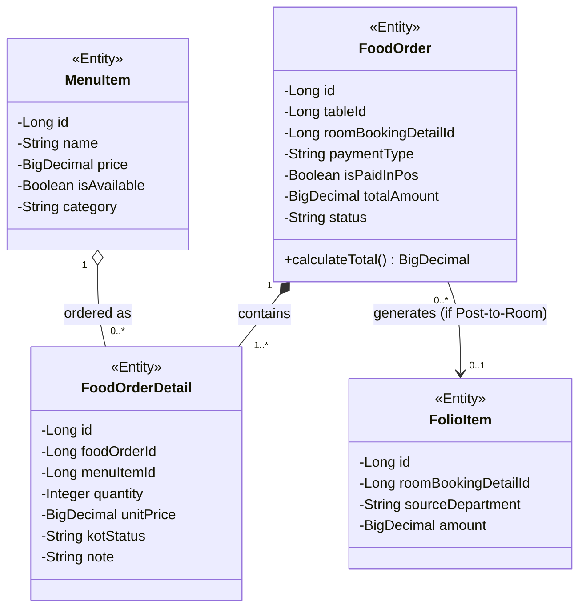
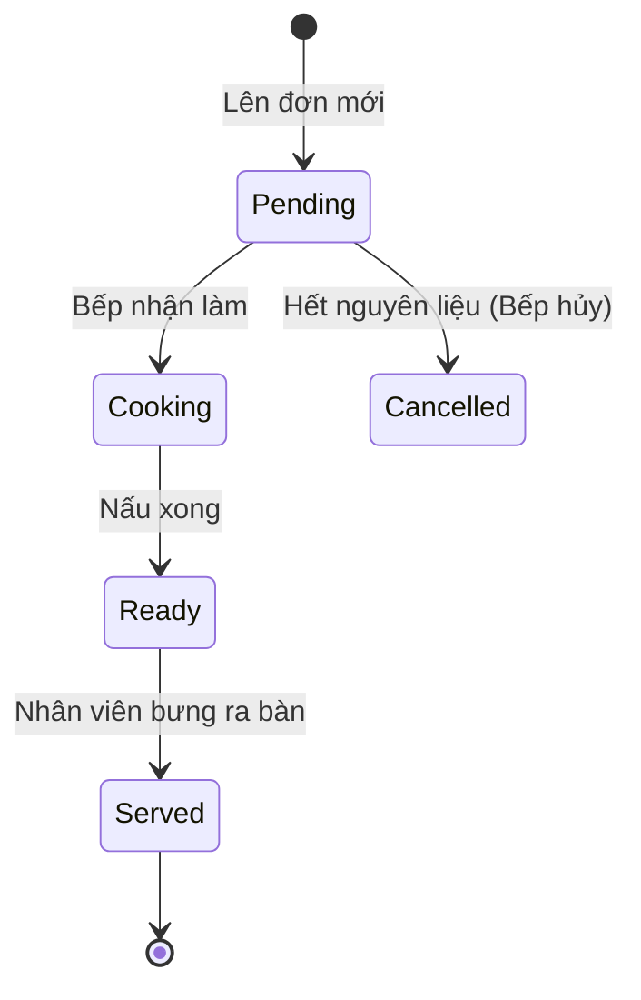
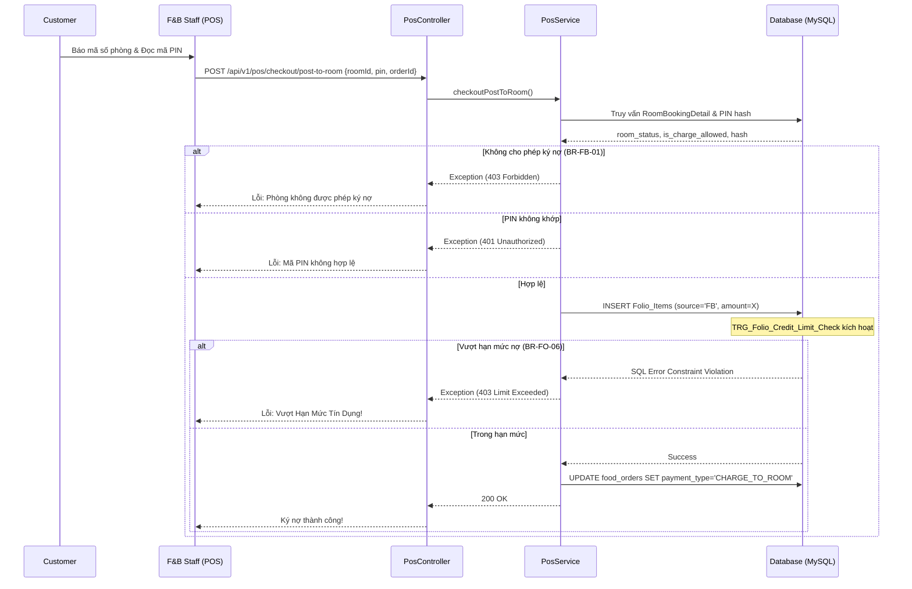

# ENGINEERING DOCUMENTATION STANDARD (EDS) v2.0
## WF-05 — F&B / POS / Ghi nợ Folio (Post-to-Room)

| Field | Value |
|---|---|
| **Document ID** | `KAWAI-WF05-FNB-IMP-001` |
| **Version** | 1.0 |
| **Date** | 2026-07-02 |
| **Status** | Draft |
| **Document Owner** | Team Lead — Group 2 SWP391 |
| **Author** | Business Analyst + Tech Lead |
| **Reviewed by** | Principal Architect |
| **DPO Sign-off** | `[ ] Pending` |
| **Approved by** | `[ ] Pending` |
| **Last Review** | 2026-07-02 |
| **Based on EDS** | v2.0 |
| **Workflow Ref** | WF-05 — `02-Requirement/workflow.md` §WF-05 |
| **ADR Ref** | ADR-04 (WebSocket cho KDS) — `03-Design/ADR` |
| **TDD Standard** | ISO/IEC/IEEE 29119-3:2021 |

---

### CHANGELOG

> [!IMPORTANT]
> **Policy 4.4 — Immutable History:** Không bao giờ xóa thông tin cũ.

| Ngày | Người thực hiện | Nội dung thay đổi |
|---|---|---|
| 2026-07-02 | `Tech Lead — Group 2` | Tạo tài liệu lần đầu — EDS + TDD spec cho WF-05 F&B, POS, KDS và Post-to-Room |

---

### MỤC LỤC

1. [Tổng quan Module](#1-tổng-quan-module)
2. [Ma trận Truy vết](#2-ma-trận-truy-vết-traceability-matrix)
3. [Architecture Decision Records](#3-architecture-decision-records-adr)
4. [Non-Functional Requirements & SLA](#4-non-functional-requirements--sla)
5. [Static Modeling — Mô hình Tĩnh](#5-static-modeling-mô-hình-tĩnh)
6. [Dynamic Modeling — Mô hình Động](#6-dynamic-modeling-mô-hình-động)
7. [Domain Event Catalog](#7-domain-event-catalog)
8. [Interface Specification](#8-interface-specification-đặc-tả-giao-diện)
9. [API Specification](#9-api-specification)
10. [Database Schema & Migration](#10-database-schema--migration)
11. [Kế hoạch Triển khai Full-Stack MVC Step-by-Step](#11-kế-hoạch-triển-khai-full-stack-mvc-step-by-step)
12. [Rollback & Incident Runbook](#12-rollback--incident-runbook)
13. [TDD — Test Case Specification](#13-tdd--test-case-specification)
14. [Phương pháp Xác minh](#14-phương-pháp-xác-minh)
15. [API Verification Samples](#15-api-verification-samples)
16. [Authorization Matrix](#16-authorization-matrix)

---

## 1. Tổng quan Module

### 1.1 Mô tả nghiệp vụ

**WF-05 — F&B / POS / Post-to-Room** quản lý quy trình vận hành nhà hàng (F&B) từ lúc khách gọi món, bếp chế biến, cho đến thanh toán. Nó hỗ trợ hai luồng thanh toán chính: thanh toán trực tiếp tại quầy POS, hoặc Ký nợ về phòng (Post-to-Room).

**Phạm vi nghiệp vụ:**
- Lên đơn tại bàn (Dine-In) hoặc qua Room Service (Khách tự đặt).
- Tính năng Ký nợ về phòng (Post-to-Room) yêu cầu kiểm tra kỹ càng: Phòng đang Checked_In, được phép ký nợ, nhập đúng mã PIN 4 số và không vượt hạn mức Credit Limit (BR-FB-01, BR-FO-06).
- Màn hình bếp KDS (Kitchen Display System) hiển thị real-time các món cần làm (Pending -> Cooking -> Ready -> Served) qua WebSocket (BR-FB-02, BR-FB-04).
- Đồng bộ trạng thái hết món (Out of stock) real-time đến tất cả POS và menu của khách (BR-FB-02).

| Field | Value |
|---|---|
| **Module Name** | `F&B and Point of Sale` |
| **Bounded Context** | Restaurant Operations / Folio Billing |
| **Data Classification** | Financial & Operational |
| **Upstream Dependencies** | WF-03 Check-in (Thiết lập mã PIN & Hạn mức nợ phòng) |
| **Downstream Consumers** | WF-04 Check-out (Thanh toán Folio), Dashboard (Revenue) |

### 1.2 Actors & Roles

| Actor | Role | Hành động chính |
|:------|:-----|:----------------|
| **Customer/Guest** | End User | Đặt món Room Service, Nhập mã PIN để ký nợ |
| **F&B Staff / Cashier** | POS Operator | Mở bàn, Lên đơn, Chuyển trạng thái Served, Thanh toán |
| **Kitchen Staff** | KDS Operator | Nhận KOT, chuyển trạng thái Cooking -> Ready, Báo hết món |

---

## 2. Ma trận Truy vết (Traceability Matrix)

| Requirement ID | Loại | Mô tả yêu cầu | Thành phần Code |
|:---|:---:|:---|:---|
| **BR-FB-01** | Business Rule | 4 Điều kiện ký nợ phòng (Checked_In, Allowed, PIN, Limit) | `PosServiceImpl`, `CreditLimitValidator` |
| **BR-FB-02** | Business Rule | WebSocket đồng bộ KOT và trạng thái Out-of-Stock | `KdsWebSocketHandler` |
| **BR-FB-04** | Business Rule | Vòng đời trạng thái món ăn KDS | `KdsService`, Enum `KotStatus` |
| **BR-FO-06** | Business Rule | Rollback nếu nợ vượt quá Hạn mức tổng của Booking | SQL Trigger `TRG_Folio_Credit_Limit_Check` |
| **UC16, 17, 18**| Use Case | Đặt món Room Service, Lên đơn POS, Tất toán / Ký nợ | `PosApiController`, Frontend POS UI |
| **UC19** | Use Case | Màn hình bếp KDS | `KdsApiController`, Frontend KDS UI |

---

## 3. Architecture Decision Records (ADR)

### ADR-04 — Lựa chọn Công nghệ Thời gian thực cho KDS & POS

**Bối cảnh:** Khi bếp báo hết món hoặc khách đặt thêm món, các màn hình KDS trong bếp và POS ngoài sảnh phải được cập nhật ngay lập tức mà không cần F5 tải lại trang.

**Quyết định:** Sử dụng **Spring WebSockets (STOMP qua SockJS)** thay vì HTTP Polling hay Server-Sent Events (SSE).
- Topic cho Bếp (KDS): `/topic/kds/orders`
- Topic cho Sảnh (POS): `/topic/pos/menu`

**Hệ quả:**
- ✅ Real-time, độ trễ thấp (< 100ms).
- ✅ Băng thông mạng được tối ưu do không có overhead HTTP header liên tục như Polling.
- ⚠️ Yêu cầu xử lý reconnect ở tầng Frontend nếu mất mạng tạm thời.

---

## 4. Non-Functional Requirements & SLA

| Category | Requirement | Target SLA | Verification Method |
|:---|:---|:---|:---|
| **Latency** | WebSocket Message Delivery | < 100ms | WebSocket Load Test (JMeter) |
| **Data Integrity** | Không thể Ký nợ vượt Hạn mức | 100% | TDD & Database Trigger Constraint |
| **Security** | Mã PIN Ký nợ | Băm BCrypt (Salted) | Security Code Scan |

---

## 5. Static Modeling (Mô hình Tĩnh)

### 5.1 Class Diagram — F&B & POS (Trích xuất từ CD-03)



---

## 6. Dynamic Modeling (Mô hình Động)

### 6.1 State Machine — KOT Status Lifecycle (BR-FB-04)



### 6.2 Sequence Diagram — Luồng Ghi Nợ Phòng (Post-to-Room)



---

## 7. Domain Event Catalog

| Event Name | Publisher | Payload | Subscriber |
|:---|:---|:---|:---|
| `MenuItemOutOfStock` | `MenuService` | menuItemId, isAvailable | KDS & POS WebSocket (Tắt nút chọn món) |
| `KotCreated` | `PosService` | orderId, list of items | KDS WebSocket (Hiện chuông báo bếp) |
| `KotStatusUpdated` | `KdsService` | detailId, oldStatus, newStatus | POS WebSocket (Báo F&B Staff đi bưng món) |

---

## 8. Interface Specification (Đặc tả Giao diện)

### 8.1 Service Interface

```java
// IPosService.java
public interface IPosService {
    FoodOrder createOrder(Long tableId, List<OrderDetailDTO> items);
    void checkoutDirect(Long orderId, String paymentMethod); // Tiền mặt/Thẻ tại quầy
    void checkoutPostToRoom(Long orderId, Long roomBookingDetailId, String pin); // Ký nợ (BR-FB-01)
}

// IKdsService.java
public interface IKdsService {
    List<FoodOrderDetail> getPendingAndCookingItems();
    void updateKotStatus(Long detailId, String newStatus); // Pending->Cooking->Ready
    void markMenuItemOutOfStock(Long menuItemId); // (BR-FB-02)
}
```

---

## 9. API Specification

| Method | Path | Auth | Roles | Chức năng |
|:---|:---|:---|:---|:---|
| `POST` | `/api/v1/pos/orders` | JWT | `FNB` | Tạo đơn hàng mới |
| `POST` | `/api/v1/pos/orders/{id}/post-to-room` | JWT | `FNB` | Thanh toán bằng Ký nợ về phòng (truyền `pin` trong body) |
| `GET` | `/api/v1/kds/tickets` | JWT | `KITCHEN` | Lấy danh sách phiếu bếp cần làm |
| `PUT` | `/api/v1/kds/tickets/{id}/status` | JWT | `KITCHEN` | Đổi trạng thái KOT món ăn |
| `PUT` | `/api/v1/kds/menu/{id}/availability` | JWT | `KITCHEN` | Đánh dấu hết/còn món ăn (Tự động bắn WebSocket) |

---

## 10. Database Schema & Migration

### 10.1 V013__create_fb_tables.sql

```sql
CREATE TABLE menu_items (
    id BIGINT AUTO_INCREMENT PRIMARY KEY,
    name VARCHAR(100) NOT NULL,
    price DECIMAL(15,2) NOT NULL,
    is_available BOOLEAN DEFAULT TRUE,
    category VARCHAR(50)
);

CREATE TABLE food_orders (
    id BIGINT AUTO_INCREMENT PRIMARY KEY,
    table_id BIGINT NULL,
    room_booking_detail_id BIGINT NULL,
    payment_type VARCHAR(50) DEFAULT 'UNPAID',
    is_paid_in_pos BOOLEAN DEFAULT FALSE,
    total_amount DECIMAL(15,2) DEFAULT 0,
    created_at DATETIME DEFAULT CURRENT_TIMESTAMP
);

CREATE TABLE food_order_details (
    id BIGINT AUTO_INCREMENT PRIMARY KEY,
    food_order_id BIGINT NOT NULL,
    menu_item_id BIGINT NOT NULL,
    quantity INT NOT NULL,
    unit_price DECIMAL(15,2) NOT NULL,
    kot_status VARCHAR(50) DEFAULT 'PENDING',
    FOREIGN KEY (food_order_id) REFERENCES food_orders(id),
    FOREIGN KEY (menu_item_id) REFERENCES menu_items(id)
);
```

### 10.2 V014__trg_folio_credit_limit.sql (BR-FO-06)

```sql
DELIMITER //

CREATE TRIGGER TRG_Folio_Credit_Limit_Check
BEFORE INSERT ON folio_items
FOR EACH ROW
BEGIN
    DECLARE total_debt DECIMAL(15,2);
    DECLARE limit_amount DECIMAL(15,2);
    
    -- Lấy tổng nợ hiện tại của booking
    SELECT COALESCE(SUM(amount), 0) INTO total_debt
    FROM folio_items 
    WHERE room_booking_detail_id = NEW.room_booking_detail_id;
    
    -- Lấy giới hạn tín dụng
    SELECT credit_limit INTO limit_amount
    FROM bookings b
    JOIN room_booking_details rbd ON rbd.booking_id = b.id
    WHERE rbd.id = NEW.room_booking_detail_id;
    
    -- Kiểm tra vượt mức
    IF (total_debt + NEW.amount) > limit_amount THEN
        SIGNAL SQLSTATE '45000'
        SET MESSAGE_TEXT = 'Khong the ghi no: Vuot han muc tin dung cua booking';
    END IF;
END;
//
DELIMITER ;
```

---

## 11. Kế hoạch Triển khai Full-Stack MVC Step-by-Step

### STEP 1: Database Migration
- Chạy Flyway scripts tạo bảng `menu_items`, `food_orders`, và Trigger kiểm tra Credit Limit.

### STEP 2: Cấu hình WebSocket (STOMP)
- Backend: Tạo `WebSocketConfig.java` map endpoint `/ws`. Bật Simple Broker cho `/topic`.
- Tạo `NotificationService` wrap `SimpMessagingTemplate.convertAndSend()`.

### STEP 3: API & Services Backend
- Implement `PosServiceImpl`: Xử lý tạo Order, logic Post-to-room (BCrypt verify PIN, check cờ hợp lệ).
- Implement `KdsServiceImpl`: Xử lý luồng trạng thái món ăn.

### STEP 4: Frontend POS (F&B Staff)
- Thymeleaf/VueJS MVC View: Giao diện POS dạng lưới chọn món.
- Nút "Post to Room": Bật modal nhập Số Phòng và PIN Code 4 số. (Mã PIN bị che `type="password"`).

### STEP 5: Frontend KDS (Kitchen Staff)
- Màn hình đen tối giản cho nhà bếp (Dark mode), hiển thị các thẻ Ticket.
- Lắng nghe WebSocket `/topic/kds/orders`: Món mới tự động pop-up trên màn hình kèm âm thanh (beep).
- Nút "Hết món" (Out of Stock) bắn API gọi về BE, BE bắn lại WebSocket `/topic/pos/menu` tắt món trên POS.

---

## 12. Rollback & Incident Runbook

| Tình huống | Hành động khắc phục |
|:---|:---|
| Lỗi mạng WebSocket ngắt kết nối liên tục | Chuyển sang fallback mode (tải lại trang bằng tay hoặc short-polling dự phòng nếu WebSocket timeout). |
| Khách quên mã PIN ký nợ | Lễ tân thực hiện Reset PIN trên màn hình Lễ Tân (Customer Profile). Gửi mã PIN mới về Email khách. |
| Trigger hạn mức tín dụng chặn nhầm | Manager nâng `credit_limit` của booking đó lên cao hơn bằng đặc quyền Override. |

---

## 13. TDD — Test Case Specification

### Điều kiện Kiểm thử

| ID | Test Condition | Action |
|:---|:---|:---|
| FB-TC-01 | BR-FB-01: Ký nợ sai mã PIN | API trả về 401 Unauthorized, giao dịch rollback. |
| FB-TC-02 | BR-FB-01: Ký nợ phòng chưa check-in | Trả lỗi: Phòng không khả dụng để ký nợ. |
| FB-TC-03 | BR-FO-06: Ký nợ vượt hạn mức tín dụng | Trigger DB ném lỗi `45000`, API bắt Exception trả về 403. |
| FB-TC-04 | BR-FB-04: Luồng trạng thái KOT (Pending -> Ready) | Chuyển state hợp lệ. Cố chuyển từ Pending thẳng sang Served ném lỗi. |
| FB-TC-05 | WebSocket Publish Message | Gọi API đánh dấu hết món, kiểm tra mock `SimpMessagingTemplate` có được gọi với đúng topic. |

---

## 14. Phương pháp Xác minh

1. **POS Ký Nợ Verification**:
   - Dùng tài khoản F&B, chọn món, chọn thanh toán Post-to-Room.
   - Nhập sai PIN -> Failed. Nhập đúng PIN -> Success.
   - Vào màn hình Folio của Lễ Tân, kiểm tra xem khoản tiền nhà hàng có xuất hiện ngay lập tức không.
2. **Real-time Sync Verification**:
   - Mở 2 trình duyệt: 1 cái POS, 1 cái KDS.
   - Bên KDS bấm "Hết món" -> Trình duyệt bên POS lập tức mờ đi nút đặt món đó mà không cần tải lại.

---

## 15. API Verification Samples

```bash
# === F&B Ghi nợ về phòng (Post-to-room) ===
curl -X POST "http://localhost:8080/api/v1/pos/orders/55/post-to-room" \
  -H "Authorization: Bearer $FNB_TOKEN" \
  -H "Content-Type: application/json" \
  -d '{
        "roomBookingDetailId": 105,
        "pinCode": "1234"
      }'

# === KDS Bếp báo Hết món (Out of stock) ===
curl -X PUT "http://localhost:8080/api/v1/kds/menu/88/availability" \
  -H "Authorization: Bearer $KITCHEN_TOKEN" \
  -H "Content-Type: application/json" \
  -d '{"isAvailable": false}'
```

---

## 16. Authorization Matrix

| Endpoint | F&B Staff | Bếp (Kitchen) | Lễ Tân | Quản lý |
|:---|:---:|:---:|:---:|:---:|
| `POST /pos/orders` | ✅ | ❌ | ❌ | ✅ |
| `POST /pos/orders/{id}/post-to-room` | ✅ | ❌ | ❌ | ✅ |
| `GET /kds/tickets` | ❌ | ✅ | ❌ | ✅ |
| `PUT /kds/tickets/{id}/status` | ❌ | ✅ | ❌ | ✅ |
| `PUT /kds/menu/{id}/availability` | ❌ | ✅ | ❌ | ✅ |

---

*Tài liệu WF05-FnB-POS-IMP-001 v1.0 — Kawai Resort & Hub — Group 2 SWP391 SE2023*
