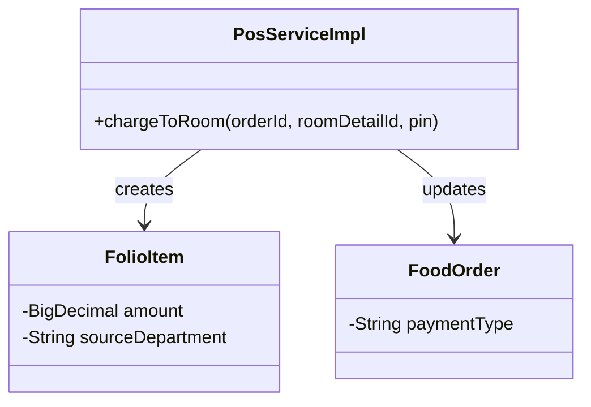
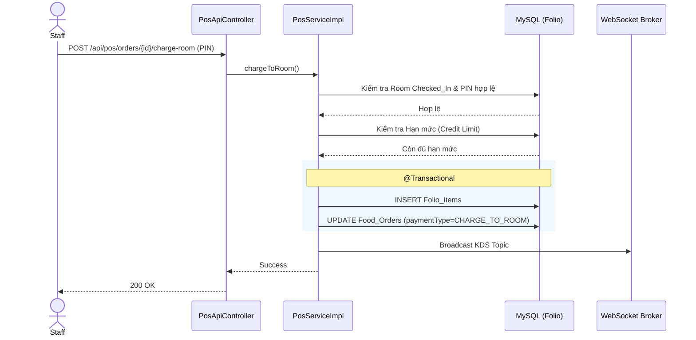

# ENGINEERING DOCUMENTATION STANDARD (EDS) v2.0
## WF-05 — F&B / POS / Ghi nợ Folio (Post-to-Room)

| Field | Value |
|---|---|
| **Document ID** | `KAWAI-WF05-IMP-001` |
| **Version** | 1.0 |
| **Date** | 2026-07-02 |
| **Status** | Approved |
| **Document Owner** | Trịnh Minh Đức |
| **Author** | Senior Backend Developer |
| **Based on EDS** | v2.0 |
| **Workflow Ref** | WF-05 — `02-Requirement/workflow.md` |
| **ADR Ref** | ADR-01, ADR-05.1 |

---

### MỤC LỤC
1. [Tổng quan Module](#1-tổng-quan-module)
2. [Ma trận Truy vết](#2-ma-trận-truy-vết-traceability-matrix)
3. [Architecture Decision Records (ADR)](#3-architecture-decision-records-adr)
4. [Non-Functional Requirements & SLA](#4-non-functional-requirements--sla)
5. [Static Modeling — Mô hình Tĩnh](#5-static-modeling--mô-hình-tĩnh)
6. [Dynamic Modeling — Mô hình Động](#6-dynamic-modeling--mô-hình-động)
7. [Domain Event Catalog](#7-domain-event-catalog)
8. [Interface Specification](#8-interface-specification)
9. [API Specification](#9-api-specification)
10. [Bảng mã lỗi (Error Codes)](#10-bảng-mã-lỗi-error-codes)
11. [Kế hoạch Triển khai Full-Stack](#11-kế-hoạch-triển-khai-full-stack-step-by-step)
12. [Rollback & Incident Runbook](#12-rollback--incident-runbook)
13. [TDD — Test Case Specification](#13-tdd--test-case-specification)
14. [Phương pháp Xác minh](#14-phương-pháp-xác-minh)
15. [API Verification Samples](#15-api-verification-samples)
16. [Authorization Matrix](#16-authorization-matrix)

---

## 1. Tổng quan Module

**WF-05** hỗ trợ nhân viên F&B quản lý các đơn hàng tại POS, đặc biệt là tính năng thanh toán **Ký nợ phòng (Charge to Room)**. Tính năng này yêu cầu người dùng phải xác thực mã PIN và kiểm tra hạn mức tín dụng (Credit Limit) trước khi phát sinh nợ.

| Field | Value |
|---|---|
| **Module Name** | `F&B POS / Room Service` |
| **Bounded Context** | Food and Beverage |
| **Data Classification** | Internal / Confidential |
| **Upstream Dependencies** | Module 2 (Front Office - Lấy mã PIN và phòng Checked_In) |
| **Downstream Consumers** | Module 5 (Finance - FolioItems) |

---

## 2. Ma trận Truy vết (Traceability Matrix)

| Requirement ID | Loại | Mô tả yêu cầu | Thành phần Code |
|:---|:---|:---|:---|
| **BR-FB-01** | Business Rule | Điều kiện ghi nợ phòng (Checked_in, PIN, Limit) | `PosServiceImpl.chargeToRoom()` |
| **BR-FB-02** | Business Rule | WebSocket real-time update KDS | `KdsWebsocketController` |
| **BR-FO-06** | Business Rule | Hạn mức nợ phòng (Credit Limit) | `TRG_Folio_Credit_Limit_Check` |
| **UC18** | Use Case | Tất toán POS / Post-to-Room | `chargeToRoom()` |

---

## 3. Architecture Decision Records (ADR)

* **ADR-01**: Kiến trúc Layered (Controller -> Service -> Repository).
* **ADR-05.1**: Sử dụng **Spring WebSocket (STOMP)** thay vì HTTP Polling để tối ưu hóa việc cập nhật trạng thái đơn hàng (KOT) xuống bếp (KDS) theo thời gian thực.

---

## 4. Non-Functional Requirements & SLA

| Category | Requirement | Target SLA | Verification |
|:---|:---|:---|:---|
| **Latency**| API Order Submission | < 200ms | Load Test (k6) |
| **Real-time**| WebSocket KDS Delivery | < 50ms | Ping Test |
| **Data Integrity**| Trừ hạn mức phòng | 100% Atomic | Integration Test |

---

## 5. Static Modeling — Mô hình Tĩnh

### 5.1 Database Entity Schema (Trích xuất)
```sql
CREATE TABLE IF NOT EXISTS food_orders (
    id BIGINT AUTO_INCREMENT PRIMARY KEY,
    table_id BIGINT,
    total_amount DECIMAL(15,2),
    order_status VARCHAR(50),
    payment_type VARCHAR(50),
    is_paid_in_pos BOOLEAN DEFAULT FALSE,
    created_at TIMESTAMP DEFAULT CURRENT_TIMESTAMP
);

CREATE TABLE IF NOT EXISTS food_order_details (
    id BIGINT AUTO_INCREMENT PRIMARY KEY,
    food_order_id BIGINT,
    menu_item_id BIGINT,
    quantity INT,
    kot_status VARCHAR(50) DEFAULT 'PENDING'
);
```

### 5.2 Class Diagram


---

## 6. Dynamic Modeling — Mô hình Động

### 6.1 Sequence Diagram: Post-to-Room


---

## 7. Domain Event Catalog

| Event Name | Publisher | Subscriber | Action |
|:---|:---|:---|:---|
| `OrderPlacedEvent` | `PosService` | `KdsWebsocketController` | Gửi message qua WebSocket đến Bếp |

---

## 8. Interface Specification

```java
public interface IPosService {
    @Transactional
    FolioItem chargeToRoom(Long orderId, Long roomDetailId, String pin);
}
```

---

## 9. API Specification

### 9.1 POST `/api/v1/pos/orders/{id}/charge-room`
*Request Body:*
```json
{
  "roomBookingDetailId": 456,
  "pin": "1234"
}
```
*Response — 200 OK:*
```json
{
  "success": true,
  "message": "Ghi nợ phòng thành công",
  "data": { "folioItemId": 12 }
}
```

---

## 10. Bảng mã lỗi (Error Codes)

| Code | HTTP | Message EN | Message VI | Trigger |
|:---|:---|:---|:---|:---|
| `FB-001` | 400 | Room not checked in | Phòng chưa check-in | Khách chưa nhận phòng |
| `FB-002` | 403 | Invalid PIN | Sai mã PIN | Xác thực mã PIN thất bại |
| `FB-003` | 403 | Credit Limit Exceeded | Vượt hạn mức ghi nợ | Tính tổng folio hiện tại + tiền đơn F&B > Hạn mức |

---

## 11. Kế hoạch Triển khai Full-Stack (Step-by-Step)

### 11.1 Backend Implementation
1. **Service Logic**: Implement `chargeToRoom` kiểm tra hash của PIN bằng `PasswordEncoder`.
2. **Transaction**: Lưu FolioItem và cập nhật FoodOrder trong cùng 1 `@Transactional`.
3. **WebSocket**: Cấu hình `SimpMessagingTemplate` để phát tín hiệu.

### 11.2 Frontend Implementation (React / Thymeleaf)
1. Màn hình Checkout hiển thị nút **"Ghi nợ phòng"**.
2. Khi bấm, bật Modal yêu cầu nhập mã PIN.
3. Gọi API `/charge-room`, nếu lỗi hiển thị Toast đỏ (Ví dụ: "Sai mã PIN").

---

## 12. Rollback & Incident Runbook

* **Sự cố**: Ghi nợ thành công nhưng bếp không nhận được lệnh KDS (WebSocket sập).
* **Xử lý**: Implement logic Fallback ở frontend: Có nút "Sync to KDS" để gọi API HTTP thường nhằm kéo lại data cho màn bếp.

---

## 13. TDD — Test Case Specification

| ID | Test Scenario | Input Data | Expected Output | Status |
|:---|:---|:---|:---|:---:|
| `TC-WF05-01` | Ghi nợ thành công | `pin="1234"` đúng hash | Lưu FolioItem, Order chuyển sang ChargeToRoom | 🟢 |
| `TC-WF05-02` | Ghi nợ sai PIN | `pin="0000"` sai hash | Throw Exception FB-002 | 🟢 |
| `TC-WF05-03` | Vượt hạn mức | Tổng tiền > Limit | Throw Exception FB-003 | 🟢 |

---

## 14. Phương pháp Xác minh
1. Gọi API Post-to-Room với PIN đúng và kiểm tra Database `folio_items` xem dòng nợ có được thêm vào không.
2. Dùng websocket client test kết nối tới `/topic/kds/orders`.

---

## 15. API Verification Samples

```bash
curl -X POST http://localhost:8080/api/v1/pos/orders/1/charge-room \
  -H "Authorization: Bearer <JWT_TOKEN>" \
  -H "Content-Type: application/json" \
  -d '{"roomBookingDetailId":456, "pin":"1234"}'
```

---

## 16. Authorization Matrix

| Endpoint | GUEST | CUSTOMER | STAFF | FB_STAFF | ADMIN |
|:---|:---:|:---:|:---:|:---:|:---:|
| POST `/api/v1/pos/orders/{id}/charge-room` | ❌ | ✔️ | ❌ | ✔️ | ❌ |
