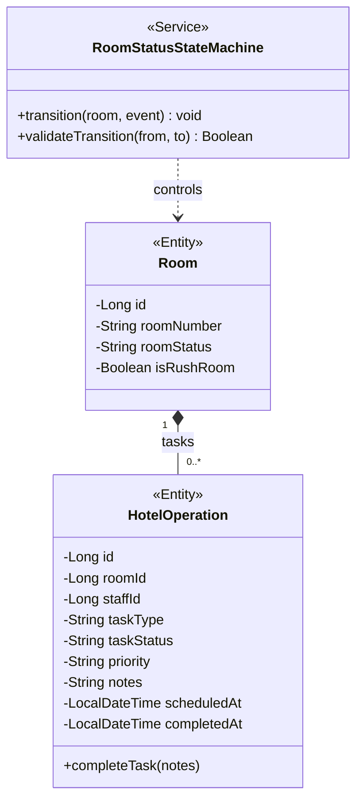
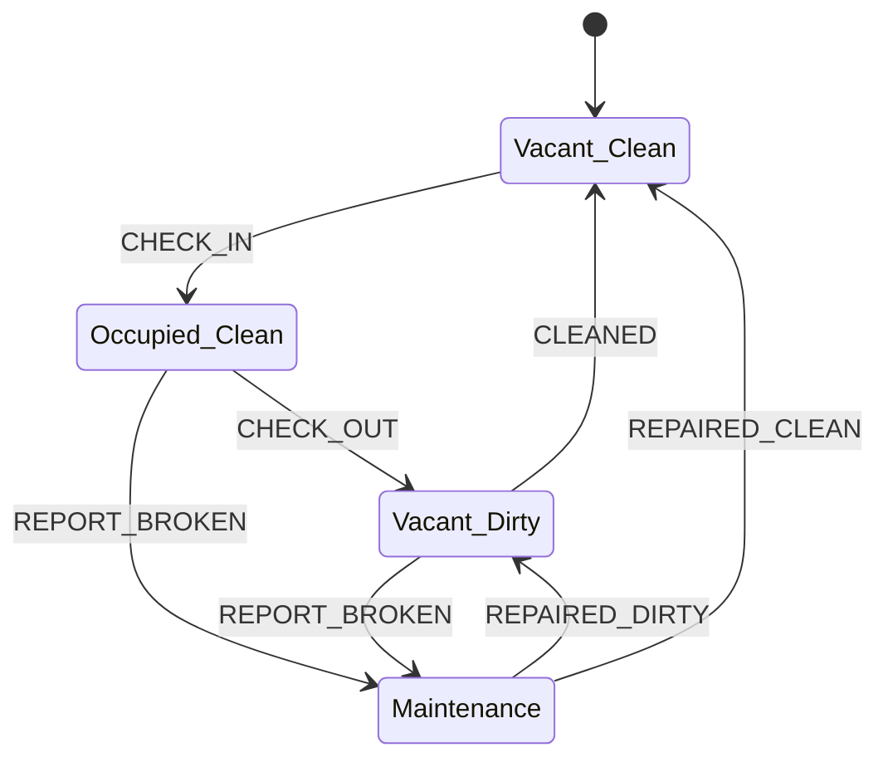
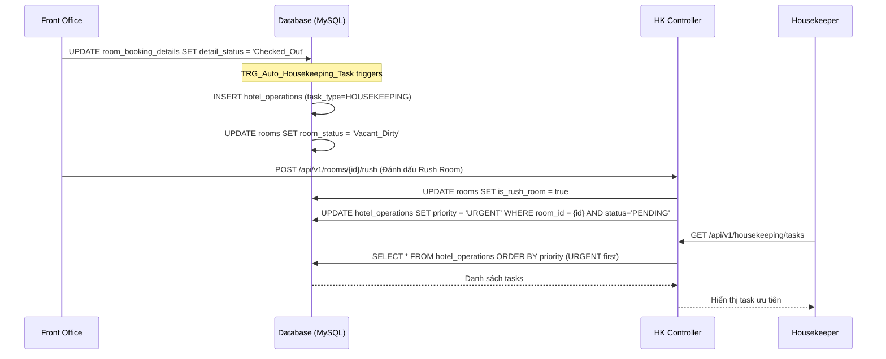

# ENGINEERING DOCUMENTATION STANDARD (EDS) v2.0
## WF-07 — Room Status Lifecycle (Housekeeping & Maintenance)

| Field | Value |
|---|---|
| **Document ID** | `KAWAI-WF07-HK-IMP-001` |
| **Version** | 1.0 |
| **Date** | 2026-07-02 |
| **Status** | Draft |
| **Document Owner** | Team Lead — Group 2 SWP391 |
| **Author** | Business Analyst + Tech Lead |
| **Reviewed by** | Principal Architect |
| **DPO Sign-off** | `[ ] Pending` |
| **Approved by** | `[ ] Pending` |
| **Last Review** | 2026-07-02 |
| **Based on EDS** | v2.0 |
| **Workflow Ref** | WF-07 — `02-Requirement/workflow.md` §WF-07 |
| **ADR Ref** | ADR-01 — `03-Design/ADR/ADR-01.md` |
| **TDD Standard** | ISO/IEC/IEEE 29119-3:2021 |

---

### CHANGELOG

> [!IMPORTANT]
> **Policy 4.4 — Immutable History:** Không bao giờ xóa thông tin cũ.

| Ngày | Người thực hiện | Nội dung thay đổi |
|---|---|---|
| 2026-07-02 | `Tech Lead — Group 2` | Tạo tài liệu lần đầu — EDS + TDD spec cho WF-07 Housekeeping & Maintenance |

---

### MỤC LỤC

1. [Tổng quan Module](#1-tổng-quan-module)
2. [Ma trận Truy vết](#2-ma-trận-truy-vết-traceability-matrix)
3. [Architecture Decision Records](#3-architecture-decision-records-adr)
4. [Non-Functional Requirements & SLA](#4-non-functional-requirements--sla)
5. [Static Modeling — Mô hình Tĩnh](#5-static-modeling-mô-hình-tĩnh)
6. [Dynamic Modeling — Mô hình Động](#6-dynamic-modeling-mô-hình-động)
7. [Domain Event Catalog](#7-domain-event-catalog)
8. [Interface Specification](#8-interface-specification-đặc-tả-giao-diện)
9. [API Specification](#9-api-specification)
10. [Database Schema & Migration](#10-database-schema--migration)
11. [Kế hoạch Triển khai Full-Stack MVC Step-by-Step](#11-kế-hoạch-triển-khai-full-stack-mvc-step-by-step)
12. [Rollback & Incident Runbook](#12-rollback--incident-runbook)
13. [TDD — Test Case Specification](#13-tdd--test-case-specification)
14. [Phương pháp Xác minh](#14-phương-pháp-xác-minh)
15. [API Verification Samples](#15-api-verification-samples)
16. [Authorization Matrix](#16-authorization-matrix)

---

## 1. Tổng quan Module

### 1.1 Mô tả nghiệp vụ

**WF-07 — Room Status Lifecycle** quản lý vòng đời trạng thái phòng vật lý và quy trình phối hợp giữa các bộ phận: Tiền sảnh (Receptionist), Buồng phòng (Housekeeping), và Bảo trì (Maintenance). 

**Phạm vi nghiệp vụ:**
- Tự động hóa phân công dọn phòng thông qua Database Trigger khi Lễ tân hoàn tất Check-out (BR-HK-01).
- Quản lý trạng thái vật lý của phòng qua State Machine (`Vacant_Clean`, `Occupied_Clean`, `Vacant_Dirty`, `Maintenance`).
- Cho phép Lễ tân đánh dấu phòng `Rush Room` (ưu tiên dọn gấp) cho khách VIP hoặc đến sớm (BR-FO-05).
- Tự động cầu nối xử lý lỗi kỹ thuật khi Housekeeping phát hiện hỏng hóc, chuyển sang Maintenance (BR-HK-02).
- Dashboard cho nhân viên buồng phòng nhận task và báo cáo hoàn thành.

| Field | Value |
|---|---|
| **Module Name** | `Housekeeping & Room State Engine` |
| **Bounded Context** | Room Operations / Task Management |
| **Data Classification** | Internal Operations |
| **Upstream Dependencies** | WF-04 Check-out (trigger sinh task dọn dẹp) |
| **Downstream Consumers** | WF-03 Check-in (chỉ check-in được khi phòng `Vacant_Clean`) |

### 1.2 Actors & Roles

| Actor | Role | Hành động chính |
|:------|:-----|:----------------|
| **Housekeeping** | Task Executor | Nhận task trên mobile/web, báo hỏng, hoàn thành dọn phòng |
| **Maintenance** | Task Executor | Sửa chữa thiết bị hỏng, cập nhật tiến độ |
| **Receptionist** | Observer/Trigger | Check-in/out (chuyển đổi state gián tiếp), đánh dấu Rush Room |
| **System Trigger**| Auto Dispatcher | Bắn Trigger SQL tạo bản ghi `Hotel_Operations` |

---

## 2. Ma trận Truy vết (Traceability Matrix)

| Requirement ID | Loại | Mô tả yêu cầu | Thành phần Code |
|:---|:---:|:---|:---|
| **BR-HK-01** | Business Rule | Tự động tạo task dọn phòng khi check-out (Vacant_Dirty) | SQL Trigger `TRG_Auto_Housekeeping_Task` |
| **BR-HK-02** | Business Rule | Báo cáo hỏng hóc -> Tạo task MAINTENANCE, phòng chuyển state | `RoomStatusStateMachine`, `HousekeepingService` |
| **BR-FO-04** | Business Rule | Đổi state phòng khi Check-in / Check-out / Dọn xong | `RoomStatusStateMachine` |
| **BR-FO-05** | Business Rule | Cờ "Rush Room" đẩy độ ưu tiên task lên Urgent | `HotelOperationRepository` (Order By) |
| **UC13.1** | Use Case | Auto housekeeping task | Triggers + Web Socket / API |
| **UC13.2** | Use Case | UI Housekeeping/Maintenance | Web View / Mobile WebView |

---

## 3. Architecture Decision Records (ADR)

### ADR-HK-01 — Database Trigger vs Application Event cho Auto-Task

**Bối cảnh:** Khi booking chuyển sang `Checked_Out`, cần tạo ngay task HK. Việc này có thể làm ở tầng Java Code (Spring Event) hoặc tầng Database (Trigger).

**Quyết định:** Chọn **Database Trigger (`TRG_Auto_Housekeeping_Task`)** (như đã quy định trong Requirement & Class Diagram).

**Hệ quả:**
- ✅ Đảm bảo tính nhất quán 100%: Dù check-out từ API, job, hay tool ngoài, task vẫn sinh ra.
- ⚠️ Logic nằm ở Database, cần viết script Flyway kỹ càng. Khi cần lấy ID của task để notify qua WebSockets, phải dùng kỹ thuật lắng nghe DB (hoặc query bù ở Application layer).

---

## 4. Non-Functional Requirements & SLA

| Category | Requirement | Target SLA | Verification Method |
|:---|:---|:---|:---|
| **Latency** | Room status update API | < 200ms | K6 Load Test |
| **Concurrency** | Cập nhật cùng 1 task bởi 2 staff | Khóa Optimistic Locking (`@Version`) | Unit Test |
| **Data Integrity** | Không thể Check-in phòng Dirty | Constraint / Invariant Check | TDD Test Cases |

---

## 5. Static Modeling (Mô hình Tĩnh)

### 5.1 Class Diagram — Housekeeping (Trích xuất từ CD-06)



### 5.2 Database Schema (Prisma / SQL)

```sql
-- Các state hợp lệ của Room: 'Vacant_Clean', 'Occupied_Clean', 'Vacant_Dirty', 'Maintenance'

CREATE TABLE hotel_operations (
    id BIGINT AUTO_INCREMENT PRIMARY KEY,
    room_id BIGINT NOT NULL,
    staff_id BIGINT NULL,
    task_type ENUM('HOUSEKEEPING', 'MAINTENANCE') NOT NULL,
    task_status ENUM('PENDING', 'IN_PROGRESS', 'COMPLETED', 'CANCELLED') DEFAULT 'PENDING',
    priority ENUM('LOW', 'NORMAL', 'HIGH', 'URGENT') DEFAULT 'NORMAL',
    notes TEXT NULL,
    created_at DATETIME DEFAULT CURRENT_TIMESTAMP,
    completed_at DATETIME NULL,
    FOREIGN KEY (room_id) REFERENCES rooms(id)
);
```

---

## 6. Dynamic Modeling (Mô hình Động)

### 6.1 State Machine — Room Status Lifecycle



> [!WARNING]
> **Invariant bất biến:** Không bao giờ được đổi trực tiếp từ `Vacant_Dirty` sang `Occupied_Clean` (không cho phép giao phòng bẩn cho khách).

### 6.2 Sequence Diagram — Luồng Check-out Trigger HK & Đánh dấu Rush Room



---

## 7. Domain Event Catalog

| Event Name | Publisher | Payload | Subscriber |
|:---|:---|:---|:---|
| `RoomStatusChanged` | `RoomStatusStateMachine` | roomId, oldStatus, newStatus | WebSockets (Báo Lễ tân Matrix update) |
| `MaintenanceTaskCreated` | `HousekeepingService` | roomId, notes | Cảnh báo Admin/Maintainer |

---

## 8. Interface Specification (Đặc tả Giao diện)

### 8.1 Service Interface

```java
// IRoomStatusStateMachine.java
public interface IRoomStatusStateMachine {
    void onCheckIn(Long roomId);
    void onCheckOut(Long roomId);
    void onCleaned(Long roomId, Long staffId, String notes);
    void reportBroken(Long roomId, Long staffId, String issueDescription);
    void onRepaired(Long roomId, Long staffId, boolean requiresCleaning);
}

// IHousekeepingService.java
public interface IHousekeepingService {
    List<HotelOperationDTO> getPendingTasks(String taskType);
    void assignTask(Long taskId, Long staffId);
    void startTask(Long taskId, Long staffId);
    void completeTask(Long taskId, Long staffId, String notes);
    void markAsRushRoom(Long roomId);
}
```

---

## 9. API Specification

| Method | Path | Auth | Roles | Chức năng |
|:---|:---|:---|:---|:---|
| `GET` | `/api/v1/operations/tasks` | JWT | `HK`, `MAINT` | Lấy danh sách task chưa hoàn thành (sort theo Priority) |
| `POST` | `/api/v1/operations/tasks/{id}/start` | JWT | `HK`, `MAINT` | Nhận / bắt đầu làm task |
| `POST` | `/api/v1/operations/tasks/{id}/complete` | JWT | `HK`, `MAINT` | Hoàn thành dọn / sửa |
| `POST` | `/api/v1/operations/rooms/{id}/report-issue` | JWT | `HK` | Báo hỏng (BR-HK-02) -> Sinh task Maintenance |
| `POST` | `/api/v1/operations/rooms/{id}/rush` | JWT | `RECEP`, `MANAGER` | Đánh dấu Rush Room (BR-FO-05) |

---

## 10. Database Schema & Migration

### 10.1 V011__create_hotel_operations.sql

```sql
CREATE TABLE hotel_operations (
    id BIGINT AUTO_INCREMENT PRIMARY KEY,
    room_id BIGINT NOT NULL,
    staff_id BIGINT NULL,
    task_type VARCHAR(50) NOT NULL COMMENT 'HOUSEKEEPING, MAINTENANCE',
    task_status VARCHAR(50) NOT NULL DEFAULT 'PENDING' COMMENT 'PENDING, IN_PROGRESS, COMPLETED',
    priority VARCHAR(50) NOT NULL DEFAULT 'NORMAL' COMMENT 'LOW, NORMAL, HIGH, URGENT',
    notes TEXT,
    created_at DATETIME DEFAULT CURRENT_TIMESTAMP,
    completed_at DATETIME NULL,
    CONSTRAINT fk_ho_room FOREIGN KEY (room_id) REFERENCES rooms(id)
);

-- Thêm cột is_rush_room vào rooms nếu chưa có
ALTER TABLE rooms ADD COLUMN is_rush_room BOOLEAN DEFAULT FALSE;
```

### 10.2 V012__trg_auto_housekeeping.sql (BR-HK-01)

```sql
DELIMITER //

CREATE TRIGGER TRG_Auto_Housekeeping_Task
AFTER UPDATE ON room_booking_details
FOR EACH ROW
BEGIN
    -- Nếu trạng thái detail chuyển sang Checked_Out
    IF NEW.detail_status = 'Checked_Out' AND OLD.detail_status != 'Checked_Out' THEN
        -- 1. Đổi state phòng thành Vacant_Dirty
        UPDATE rooms SET room_status = 'Vacant_Dirty' WHERE id = NEW.room_id;
        
        -- 2. Sinh task HK
        INSERT INTO hotel_operations (room_id, task_type, priority, task_status)
        VALUES (NEW.room_id, 'HOUSEKEEPING', 'HIGH', 'PENDING');
    END IF;
END;
//
DELIMITER ;
```

---

## 11. Kế hoạch Triển khai Full-Stack MVC Step-by-Step

### STEP 1: Database Migration
- Tạo script Flyway `V011` và `V012` như trên.
- Run Flyway để tạo bảng `hotel_operations` và Trigger DB.

### STEP 2: Entities & Repositories
- Tạo entity `HotelOperation.java`.
- Tạo repository `HotelOperationRepository` với custom query:
  `findByTaskTypeAndTaskStatusInOrderByPriorityDescCreatedAtAsc(type, statuses)`
  (Sắp xếp `URGENT` lên đầu).

### STEP 3: State Machine Service (`RoomStatusStateMachineImpl.java`)
- Implement strict validation cho các logic transition.
- Quăng Exception nếu vi phạm Invariant.
- VD: `onCleaned()`: `room.setStatus(VACANT_CLEAN); room.setRushRoom(false);`

### STEP 4: REST Controllers cho Mobile/Staff Web
- Tạo `OperationsController.java`.
- `/tasks`: Trả về DTO danh sách phòng cần dọn.

### STEP 5: Chức năng Rush Room cho Lễ Tân (Thymeleaf/API)
- Cập nhật Web Lễ Tân: Nút **"Đánh dấu Dọn gấp"**.
- Nút này gọi API `POST /api/v1/operations/rooms/{id}/rush`.
- Logic Backend: set `is_rush_room = true`, update mọi HK task đang PENDING của room đó thành `priority = URGENT`.

### STEP 6: UI Housekeeping (Frontend MVC)
- Tạo Web View (Mobile responsive) bằng Thymeleaf: `staff/housekeeping/tasks.html`.
- Hiển thị Grid các phòng cần dọn. Cờ Đỏ nếu là URGENT.
- Có nút "Báo Hỏng" mở modal điền ghi chú -> gọi API `/report-issue`.

---

## 12. Rollback & Incident Runbook

| Tình huống | Hành động khắc phục |
|:---|:---|
| Trigger DB lỗi do foreign key | Tắt trigger, tạo thủ công task bằng API backup script. `DROP TRIGGER TRG_Auto_Housekeeping_Task;` |
| Phòng bị kẹt ở `Vacant_Dirty` | Gọi admin API override status hoặc Admin sửa trực tiếp qua DB `UPDATE rooms SET room_status='Vacant_Clean' WHERE id=?` |

---

## 13. TDD — Test Case Specification

### Điều kiện Kiểm thử

| ID | Test Condition | Action |
|:---|:---|:---|
| HK-TC-01 | Kiểm tra Invariant: Vacant_Dirty -> Occupied_Clean | `stateMachine.validateTransition(DIRTY, OCCUPIED)` phải return False / Throw Exception |
| HK-TC-02 | BR-FO-05: Đánh dấu Rush Room | Task liên quan đổi priority thành URGENT |
| HK-TC-03 | BR-HK-02: Báo hỏng khi dọn | Task MAINTENANCE mới được tạo, room status -> MAINTENANCE |
| HK-TC-04 | Trigger Mock test | Gọi trigger logic (integration DB test) khi Check-out -> Tồn tại record trong `hotel_operations` |

---

## 14. Phương pháp Xác minh

1. **DB Level Verification**:
   - Chạy SQL update 1 booking sang `Checked_Out`.
   - Verify: `SELECT * FROM hotel_operations` có sinh thêm record không.
   - Verify: `SELECT room_status FROM rooms` có đổi sang `Vacant_Dirty` không.
2. **Logic API Verification**:
   - Lễ tân gọi `/rush` -> verify thứ tự khi gọi API GET Tasks.

---

## 15. API Verification Samples

```bash
# === Lấy danh sách nhiệm vụ dọn phòng (Mobile App) ===
curl -X GET "http://localhost:8080/api/v1/operations/tasks?type=HOUSEKEEPING" \
  -H "Authorization: Bearer $HK_TOKEN"

# === HK Báo Hỏng Kỹ Thuật (BR-HK-02) ===
curl -X POST "http://localhost:8080/api/v1/operations/rooms/101/report-issue" \
  -H "Authorization: Bearer $HK_TOKEN" \
  -H "Content-Type: application/json" \
  -d '{"issueDescription": "Bồn cầu bị rỉ nước liên tục"}'

# === Lễ Tân đánh dấu RUSH ROOM ===
curl -X POST "http://localhost:8080/api/v1/operations/rooms/101/rush" \
  -H "Authorization: Bearer $RECEP_TOKEN"
```

---

## 16. Authorization Matrix

| Endpoint | HK | Maint | Lễ Tân | Quản lý | Admin | Khách hàng |
|:---|:---:|:---:|:---:|:---:|:---:|:---:|
| `GET /operations/tasks` | ✅ | ✅ | ❌ | ✅ | ✅ | ❌ |
| `POST /operations/tasks/{id}/complete` | ✅ | ✅ | ❌ | ✅ | ✅ | ❌ |
| `POST /operations/rooms/{id}/report-issue` | ✅ | ❌ | ❌ | ✅ | ✅ | ❌ |
| `POST /operations/rooms/{id}/rush` | ❌ | ❌ | ✅ | ✅ | ✅ | ❌ |
| View DB Trigger Auto Generate | — | — | — | — | — | — |

---

*Tài liệu WF07-RoomStatusLifecycle-IMP-001 v1.0 — Kawai Resort & Hub — Group 2 SWP391 SE2023*
