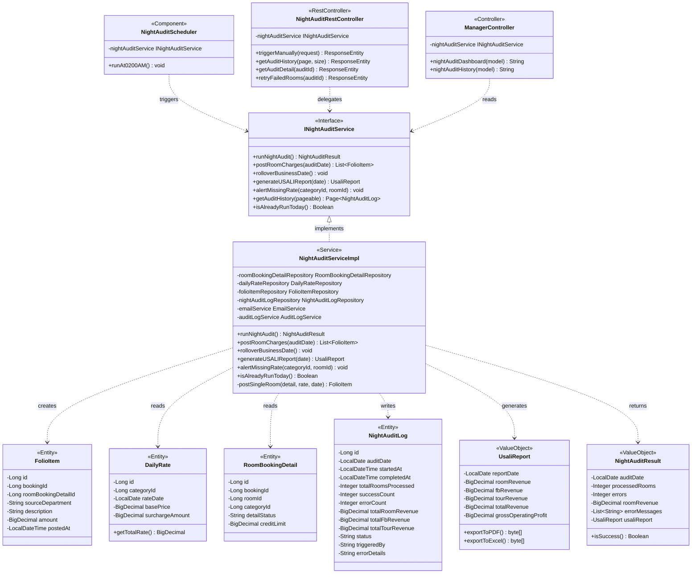
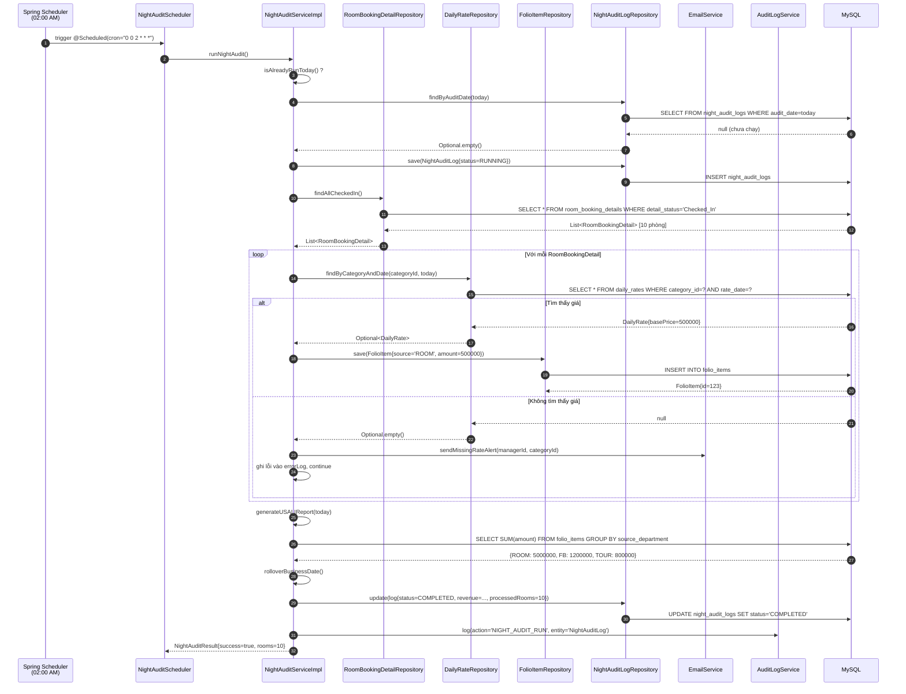
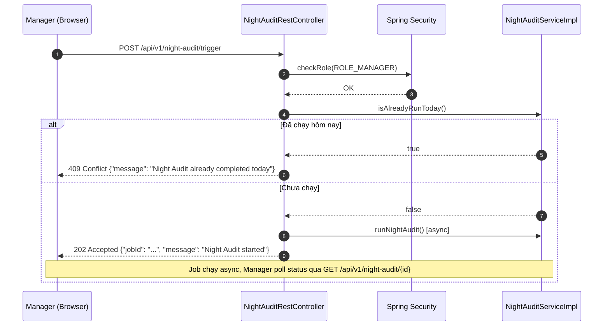
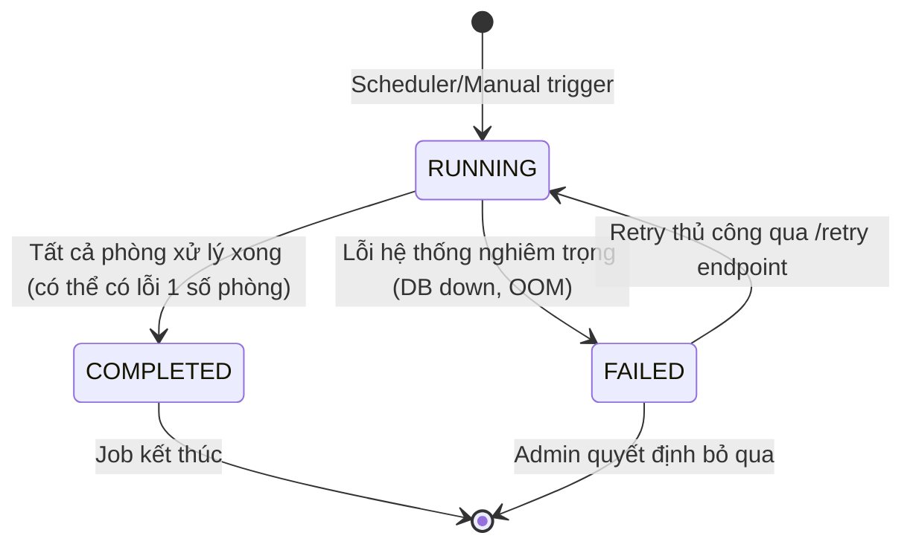

# ENGINEERING DOCUMENTATION STANDARD (EDS) v2.0
## WF-08 — Night Audit (Kiểm toán Đêm)

| Field | Value |
|---|---|
| **Document ID** | `KAWAI-NIGHT-AUDIT-IMP-001` |
| **Version** | 1.0 |
| **Date** | 2026-07-02 |
| **Status** | Draft |
| **Document Owner** | Team Lead — Group 2 SWP391 |
| **Author** | Business Analyst + Tech Lead |
| **Reviewed by** | Principal Architect |
| **DPO Sign-off** | `[ ] Pending` |
| **Approved by** | `[ ] Pending` |
| **Last Review** | 2026-07-02 |
| **Based on EDS** | v2.0 |
| **Workflow Ref** | WF-08 — `02-Requirement/workflow.md` §WF-08 |
| **ADR Ref** | ADR-01 — `03-Design/ADR/ADR-01.md` |
| **TDD Standard** | ISO/IEC/IEEE 29119-3:2021 |

---

### CHANGELOG

> [!IMPORTANT]
> **Policy 4.4 — Immutable History:** Không bao giờ xóa thông tin cũ. Mọi thay đổi phải ghi vào bảng này.

| Ngày | Người thực hiện | Nội dung thay đổi |
|---|---|---|
| 2026-07-02 | `Tech Lead — Group 2` | Tạo tài liệu lần đầu — EDS + TDD spec cho WF-08 Night Audit |

---

### MỤC LỤC

1. [Tổng quan Module](#1-tổng-quan-module)
2. [Ma trận Truy vết](#2-ma-trận-truy-vết-traceability-matrix)
3. [Architecture Decision Records](#3-architecture-decision-records-adr)
4. [Non-Functional Requirements & SLA](#4-non-functional-requirements--sla)
5. [Static Modeling — Mô hình Tĩnh](#5-static-modeling-mô-hình-tĩnh)
6. [Dynamic Modeling — Mô hình Động](#6-dynamic-modeling-mô-hình-động)
7. [Domain Event Catalog](#7-domain-event-catalog)
8. [Interface Specification](#8-interface-specification-đặc-tả-giao-diện)
9. [API Specification](#9-api-specification)
10. [Database Schema & Migration](#10-database-schema--migration)
11. [Kế hoạch Triển khai Full-Stack MVC Step-by-Step](#11-kế-hoạch-triển-khai-full-stack-mvc-step-by-step)
12. [Rollback & Incident Runbook](#12-rollback--incident-runbook)
13. [TDD — Test Case Specification](#13-tdd--test-case-specification)
14. [Phương pháp Xác minh](#14-phương-pháp-xác-minh)
15. [API Verification Samples](#15-api-verification-samples)
16. [Authorization Matrix](#16-authorization-matrix)

---

## 1. Tổng quan Module

### 1.1 Mô tả nghiệp vụ

**WF-08 — Night Audit (Kiểm toán Đêm)** là quy trình tài chính cốt lõi chạy tự động lúc **02:00 AM mỗi ngày** để đóng sổ ngày kinh doanh hiện tại và khởi động ngày kinh doanh mới. Đây là trái tim của hệ thống kế toán khách sạn, đảm bảo mọi chi phí phòng được ghi nhận đầy đủ và phân loại theo chuẩn USALI.

**Phạm vi nghiệp vụ:**
- Scheduler kích hoạt tự động lúc 02:00 AM (BR-FIN-03)
- Quét toàn bộ phòng đang có khách (`detail_status = 'Checked_In'`)
- Tra cứu giá phòng hàng ngày từ `Daily_Rates` theo `category_id + ngày hiện tại`
- INSERT `Folio_Items` cho mỗi phòng với `source_department = 'ROOM'`
- Nếu thiếu cấu hình giá: gửi email cảnh báo khẩn cấp cho Manager
- Tổng hợp doanh thu USALI: Room / F&B / Tour (BR-FIN-04)
- Rollover ngày kinh doanh sang ngày tiếp theo
- Lưu Night Audit Report và Balance Sheet
- Manager có thể xem lịch sử Night Audit và trigger thủ công (emergency)

| Field | Value |
|---|---|
| **Module Name** | `Night Audit Engine` |
| **Bounded Context** | Finance / Hospitality Accounting |
| **Data Classification** | Confidential / Financial Records |
| **Compliance Scope** | Luật Kế toán VN 88/2015/QH13; Chuẩn USALI (Uniform System of Accounts for Lodging Industry) |
| **Upstream Dependencies** | WF-03 Check-in (tạo `Checked_In` records), WF-05 F&B Post-to-Room, WF-06 Tour Booking |
| **Downstream Consumers** | WF-04 Check-out (đọc FolioItems), UC28 Manager Dashboard (đọc USALI reports) |

### 1.2 Actors & Roles

| Actor | Role | Hành động chính |
|:------|:-----|:----------------|
| **System (Scheduler)** | Automated | Trigger Night Audit lúc 02:00 AM tự động |
| **Manager** | Giám sát | Xem Night Audit history, trigger thủ công, nhận cảnh báo email |
| **Admin** | Quản trị | Xem Audit Logs, cấu hình lịch chạy (DynamicJobManager) |

---

## 2. Ma trận Truy vết (Traceability Matrix)

> [!NOTE]
> **Policy:** Không viết code nếu không biết code đó phục vụ Rule nào.

| Requirement ID | Loại | Mô tả yêu cầu | Thành phần Code | Compliance Target | ADR liên quan |
|:---|:---:|:---|:---|:---|:---:|
| **BR-FIN-03** | Business Rule | Night Audit tự động 02:00 AM; post room charges; chốt ngày | `NightAuditServiceImpl.runNightAudit()` | USALI Standard | ADR-01 |
| **BR-FIN-04** | Business Rule | Phân loại doanh thu USALI: Room / F&B / Tour | `NightAuditServiceImpl.generateUSALIReport()` | USALI Standard | ADR-01 |
| **BR-FIN-01** | Business Rule | Kiểm tra số dư Folio trước khi checkout — dữ liệu đến từ Night Audit | `FolioItemRepository.sumByBookingId()` | Luật Kế toán VN | ADR-01 |
| **BR-SYS-04** | Business Rule | Ghi AuditLogs cho mọi thao tác tài chính nhạy cảm | `@LogActivity` AOP aspect | Internal Audit | ADR-01 |
| **UC27.1** | Use Case | Chạy Night Audit tự động khóa sổ 02:00 AM | `DynamicJobManager`, `NightAuditScheduler` | — | ADR-01 |
| **UC27.2** | Use Case | Tất toán tài chính check-out và in hóa đơn | `ConsolidatedInvoiceServiceImpl` | — | ADR-01 |
| **UC28** | Use Case | Dashboard Manager xem báo cáo USALI | `ManagerController`, `night-audit.html` | — | ADR-01 |
| **NF-14** | Non-UI Function | Night_Audit_Core_Engine — post room charges, chốt ngày | `NightAuditServiceImpl` | — | ADR-01 |
| **NF-13** | Non-UI Function | USALI_Revenue_Decomposer | `UsaliReportServiceImpl` | — | ADR-01 |
| **NF-15** | Non-UI Function | AOP_Data_Interception_Logger | `AuditLogAspect.java` | — | ADR-01 |

---

## 3. Architecture Decision Records (ADR)

### ADR-NA-01 — Spring `@Scheduled` + `DynamicJobManager` cho Night Audit Trigger

| Field | Value |
|---|---|
| **Status** | Accepted |
| **Deciders** | Tech Lead, Group 2 SWP391 |
| **Date** | 2026-07-02 |
| **Supersedes** | — |

**Bối cảnh (Context)**
Night Audit phải chạy đúng 02:00 AM mỗi ngày. Cần cơ chế vừa tự động vừa cho phép trigger thủ công khi khẩn cấp. Hệ thống đã có `DynamicJobManager` (ADR-01) quản lý các cron jobs.

**Các phương án đã xem xét:**

| Phương án | Mô tả | Ưu điểm | Nhược điểm |
|:---|:---|:---|:---|
| **A — Spring `@Scheduled`** | Dùng `@Scheduled(cron = "0 0 2 * * *")` trong `NightAuditScheduler` | Đơn giản, Spring-native, không cần dependency ngoài | Không thể thay đổi schedule runtime |
| **B — Quartz Scheduler** | Quartz với persistent job store | Dynamic cron, clustering support | Phức tạp hơn, cần DB schema riêng, overkill cho scope SWP391 |
| **C — DynamicJobManager (được chọn)** | Kết hợp `@Scheduled` + REST API `/api/v1/night-audit/trigger` để admin trigger thủ công | Linh hoạt: tự động + thủ công; khớp pattern đã có trong codebase | Cần thêm endpoint bảo vệ RBAC |

**Quyết định:** Chọn **Phương án C** — Sử dụng `@Scheduled` cron tích hợp `DynamicJobManager` + REST trigger endpoint bảo vệ bởi `ROLE_MANAGER`.

**Hệ quả:**
- ✅ Nhất quán với kiến trúc ADR-01 hiện có
- ✅ Manager có thể trigger thủ công qua UI button hoặc API
- ⚠️ Trigger endpoint phải được bảo vệ chặt chẽ — chỉ `ROLE_MANAGER` và `ROLE_ADMIN`

---

### ADR-NA-02 — `@Transactional` bao toàn bộ Night Audit Job

| Field | Value |
|---|---|
| **Status** | Accepted |
| **Date** | 2026-07-02 |

**Bối cảnh:** Night Audit ghi nhiều `FolioItem` records cho nhiều phòng. Nếu job fail giữa chừng, cần đảm bảo không có partial state (vài phòng đã được post, vài phòng chưa).

**Quyết định:** Mỗi phòng được xử lý trong một `@Transactional` riêng (REQUIRES_NEW), không bao toàn bộ job trong 1 transaction. Lý do: Nếu 1 phòng lỗi, các phòng khác vẫn tiếp tục xử lý được.

**Hệ quả:**
- ✅ Phòng lỗi được ghi vào `night_audit_error_log`, không dừng toàn bộ job
- ✅ Các phòng thành công không bị rollback
- ⚠️ Cần cơ chế re-run cho các phòng lỗi: `/api/v1/night-audit/retry`

---

## 4. Non-Functional Requirements & SLA

### 4.1. Performance & Availability

| Category | Requirement | Target SLA | Measurement Method |
|:---|:---|:---|:---|
| **Execution Time** | Toàn bộ Night Audit job | < 5 phút với 500 phòng | Spring Actuator timing |
| **Per-room latency** | INSERT FolioItem mỗi phòng | < 50ms | DB query log |
| **Availability** | Scheduler uptime | 99.9% (không miss 02:00 AM) | Cron monitoring |
| **Alert latency** | Email cảnh báo thiếu giá | < 2 phút sau khi phát hiện | Email log timestamp |

### 4.2. Data Integrity & Retention

| Category | Requirement | Target |
|:---|:---|:---|
| **Durability** | FolioItem không được mất sau khi INSERT | RPO = 0 (Transaction bảo vệ) |
| **Idempotency** | Night Audit chỉ chạy 1 lần/ngày | Check `night_audit_log.audit_date = today` trước khi run |
| **Retention** | Night Audit logs giữ ít nhất 7 năm | DB backup policy + `night_audit_logs` table |
| **Completeness** | 100% phòng Checked_In phải được post | Reconciliation query sau job |

### 4.3. Security

| Category | Requirement | Target |
|:---|:---|:---|
| **Access Control** | Trigger thủ công | Chỉ `ROLE_MANAGER` và `ROLE_ADMIN` |
| **Audit Trail** | Mọi lần chạy Night Audit | INSERT `audit_logs` với action = 'NIGHT_AUDIT_RUN' |
| **Data at rest** | FolioItem amounts | Không cần mã hóa (không phải PII), nhưng cần row-level security |

### 4.4. Idempotency Guard (QUAN TRỌNG)

> [!CAUTION]
> Night Audit **TUYỆT ĐỐI KHÔNG** được chạy 2 lần trong cùng 1 ngày kinh doanh. Nếu chạy 2 lần sẽ tạo duplicate FolioItems → sai doanh thu → vi phạm BR-FIN-04.

**Giải pháp:** Trước khi INSERT bất kỳ FolioItem nào, kiểm tra:
```sql
SELECT COUNT(*) FROM night_audit_logs 
WHERE audit_date = CURDATE() AND status = 'COMPLETED'
```
Nếu > 0 → throw `NightAuditAlreadyCompletedException` và abort.

---

## 5. Static Modeling (Mô hình Tĩnh)

### 5.1 Class Diagram — Night Audit Module (Mermaid)



### 5.2 Database Entities liên quan

| Entity | Table | Thao tác | Ghi chú |
|:---|:---|:---:|:---|
| `RoomBookingDetail` | `room_booking_details` | SELECT | WHERE `detail_status = 'Checked_In'` |
| `DailyRate` | `daily_rates` | SELECT | WHERE `category_id + rate_date = today` |
| `FolioItem` | `folio_items` | INSERT | `source_department = 'ROOM'` |
| `NightAuditLog` | `night_audit_logs` | INSERT / UPDATE | Bảng mới — track lịch sử |
| `AuditLog` | `audit_logs` | INSERT | AOP auto-log |
| `ConsolidatedInvoice` | `consolidated_invoices` | SELECT | Cho USALI report |

---

## 6. Dynamic Modeling (Mô hình Động)

### 6.1 Sequence Diagram — Happy Path: Auto Night Audit



### 6.2 Sequence Diagram — Manual Trigger bởi Manager



### 6.3 State Machine — Night Audit Job Status



**Invariants bất biến:**
- Chỉ có 1 bản ghi `COMPLETED` cho mỗi `audit_date`
- Khi status = `COMPLETED`, `total_rooms_processed` phải ≥ 0
- `FAILED` records được giữ lại để audit trail, không xóa

---

## 7. Domain Event Catalog

### 7.1 Events Published (Phát ra)

| Event Name | Trigger | Publisher | Subscriber(s) | Async? |
|:---|:---|:---|:---|:---:|
| `NightAuditCompleted` | `runNightAudit()` hoàn thành thành công | `NightAuditServiceImpl` | `ManagerDashboardService`, `EmailService` | Yes |
| `RoomChargeMissingRate` | Không tìm thấy `DailyRate` cho phòng | `NightAuditServiceImpl` | `EmailAlertService` | Yes |
| `FolioItemPosted` | Mỗi FolioItem được INSERT thành công | `NightAuditServiceImpl` | `ConsolidatedInvoiceService` | No |

### 7.2 Events Consumed (Tiêu thụ)

| Event Name | Source | Handler | Action |
|:---|:---|:---|:---|
| `BookingCheckedIn` | `CheckInServiceImpl` | Không consume trực tiếp — Service đọc DB | Cập nhật danh sách phòng cần post |
| `DailyRateConfigured` | `AdminPricingService` | Không consume — Night Audit đọc DB mỗi lần | Tra cứu `daily_rates` |

### 7.3 Payload Schema — `NightAuditCompleted`

```java
// NightAuditCompletedEvent.java
public class NightAuditCompletedEvent {
    private String eventId;          // UUID
    private String eventType = "NightAuditCompleted";
    private LocalDateTime occurredAt;
    private String version = "1.0";
    
    // Payload
    private LocalDate auditDate;
    private Integer totalRoomsProcessed;
    private Integer successCount;
    private Integer errorCount;
    private BigDecimal totalRoomRevenue;
    private BigDecimal totalFbRevenue;
    private BigDecimal totalTourRevenue;
    private String triggeredBy;       // "SCHEDULER" hoặc managerId
    
    // Metadata
    private String correlationId;    // trace ID
}
```

---

## 8. Interface Specification (Đặc tả Giao diện)

### 8.1 Service Interface

```java
// INightAuditService.java
// @version 1.0
package com.kawai.services.interfaces;

import com.kawai.dto.response.NightAuditResultDTO;
import com.kawai.dto.response.UsaliReportDTO;
import org.springframework.data.domain.Page;
import org.springframework.data.domain.Pageable;

/**
 * Service contract cho Night Audit Engine.
 * BR-FIN-03: Tự động 02:00 AM.
 * BR-FIN-04: USALI revenue decomposition.
 */
public interface INightAuditService {

    /**
     * Chạy toàn bộ Night Audit pipeline.
     * Idempotent: throw NightAuditAlreadyCompletedException nếu đã chạy hôm nay.
     * @return NightAuditResultDTO — kết quả tổng hợp
     * @throws NightAuditAlreadyCompletedException nếu audit_date = today đã COMPLETED
     */
    NightAuditResultDTO runNightAudit();

    /**
     * Kiểm tra Night Audit đã chạy thành công hôm nay chưa.
     * @return true nếu đã có record COMPLETED cho ngày hôm nay
     */
    boolean isAlreadyRunToday();

    /**
     * Tổng hợp USALI report cho một ngày cụ thể.
     * @param reportDate ngày cần báo cáo
     * @return UsaliReportDTO với Room / F&B / Tour revenue
     */
    UsaliReportDTO generateUSALIReport(LocalDate reportDate);

    /**
     * Lấy lịch sử Night Audit (phân trang).
     * @param pageable pagination config
     * @return Page<NightAuditLogDTO>
     */
    Page<NightAuditLogDTO> getAuditHistory(Pageable pageable);

    /**
     * Gửi cảnh báo email khi không tìm thấy giá phòng.
     * @param categoryId ID hạng phòng
     * @param roomId ID phòng vật lý
     */
    void alertMissingRate(Long categoryId, Long roomId);
}
```

### 8.2 Repository Interfaces

```java
// RoomBookingDetailRepository.java — phương thức liên quan Night Audit
@Repository
public interface RoomBookingDetailRepository extends JpaRepository<RoomBookingDetail, Long> {
    
    /**
     * Lấy toàn bộ phòng đang Checked_In (Night Audit sẽ post room charge).
     */
    @Query("SELECT rbd FROM RoomBookingDetail rbd WHERE rbd.detailStatus = 'Checked_In'")
    List<RoomBookingDetail> findAllCheckedIn();
}

// DailyRateRepository.java
@Repository
public interface DailyRateRepository extends JpaRepository<DailyRate, Long> {
    
    /**
     * Tìm giá phòng theo hạng phòng và ngày cụ thể.
     */
    Optional<DailyRate> findByCategoryIdAndRateDate(Long categoryId, LocalDate rateDate);
}

// NightAuditLogRepository.java
@Repository
public interface NightAuditLogRepository extends JpaRepository<NightAuditLog, Long> {
    
    Optional<NightAuditLog> findByAuditDate(LocalDate auditDate);
    
    boolean existsByAuditDateAndStatus(LocalDate auditDate, String status);
    
    Page<NightAuditLog> findAllByOrderByAuditDateDesc(Pageable pageable);
}
```

---

## 9. API Specification

### 9.1 Endpoints Table

| Method | Path | Auth Level | Required Roles | Idempotent? |
|:---|:---|:---|:---|:---:|
| `POST` | `/api/v1/night-audit/trigger` | JWT Bearer | `ROLE_MANAGER`, `ROLE_ADMIN` | No |
| `GET` | `/api/v1/night-audit/history` | JWT Bearer | `ROLE_MANAGER`, `ROLE_ADMIN` | Yes |
| `GET` | `/api/v1/night-audit/{id}` | JWT Bearer | `ROLE_MANAGER`, `ROLE_ADMIN` | Yes |
| `GET` | `/api/v1/night-audit/today/status` | JWT Bearer | `ROLE_MANAGER`, `ROLE_ADMIN` | Yes |
| `POST` | `/api/v1/night-audit/{id}/retry` | JWT Bearer | `ROLE_ADMIN` | No |
| `GET` | `/api/v1/night-audit/usali-report` | JWT Bearer | `ROLE_MANAGER`, `ROLE_ADMIN` | Yes |

### 9.2 Request / Response Schemas

**POST `/api/v1/night-audit/trigger`**

*Request Body:*
```json
{
  "reason": "Manual trigger — missing room charges for VIP rooms",
  "forceDate": null
}
```

*Response — 202 Accepted:*
```json
{
  "jobId": "audit-2026-07-02",
  "auditDate": "2026-07-02",
  "status": "RUNNING",
  "triggeredBy": "manager_001",
  "startedAt": "2026-07-02T02:00:00",
  "message": "Night Audit job started successfully"
}
```

*Response — 409 Conflict (đã chạy hôm nay):*
```json
{
  "errorCode": "NA-001",
  "message": "Night Audit already completed for today (2026-07-02)",
  "completedAt": "2026-07-02T02:03:41"
}
```

**GET `/api/v1/night-audit/today/status`**

*Response — 200 OK:*
```json
{
  "auditDate": "2026-07-02",
  "status": "COMPLETED",
  "totalRoomsProcessed": 47,
  "successCount": 46,
  "errorCount": 1,
  "totalRoomRevenue": 23500000.00,
  "triggeredBy": "SCHEDULER",
  "startedAt": "2026-07-02T02:00:00",
  "completedAt": "2026-07-02T02:02:15",
  "durationSeconds": 135
}
```

**GET `/api/v1/night-audit/usali-report?date=2026-07-02`**

*Response — 200 OK:*
```json
{
  "reportDate": "2026-07-02",
  "roomRevenue": 23500000.00,
  "fbRevenue": 5600000.00,
  "tourRevenue": 3200000.00,
  "totalRevenue": 32300000.00,
  "grossOperatingProfit": 18500000.00,
  "occupancyRate": 0.78,
  "averageDailyRate": 500000.00
}
```

### 9.3 Error Codes

| Code | HTTP Status | Thông báo | Nguyên nhân |
|:---|:---:|:---|:---|
| `NA-001` | 409 | Night Audit already completed today | Idempotency guard kích hoạt |
| `NA-002` | 400 | No rooms currently checked in | Không có phòng nào `Checked_In` |
| `NA-003` | 500 | Scheduler failed to complete | Lỗi hệ thống trong quá trình chạy |
| `NA-004` | 403 | Access denied — insufficient role | Không có quyền `ROLE_MANAGER` |
| `NA-005` | 404 | Night Audit record not found | `{id}` không tồn tại trong `night_audit_logs` |

---

## 10. Database Schema & Migration

### 10.1 Bảng `night_audit_logs` (Bảng MỚI cần tạo)

```sql
-- V010__create_night_audit_logs.sql (Flyway Migration)
CREATE TABLE night_audit_logs (
    id                   BIGINT AUTO_INCREMENT PRIMARY KEY,
    audit_date           DATE NOT NULL COMMENT 'Ngày kinh doanh đóng sổ (YYYY-MM-DD)',
    status               ENUM('RUNNING', 'COMPLETED', 'FAILED') NOT NULL DEFAULT 'RUNNING',
    triggered_by         VARCHAR(100) NOT NULL COMMENT 'SCHEDULER hoặc accountId của Manager',
    started_at           DATETIME NOT NULL DEFAULT CURRENT_TIMESTAMP,
    completed_at         DATETIME NULL,
    total_rooms_processed INT NOT NULL DEFAULT 0,
    success_count        INT NOT NULL DEFAULT 0,
    error_count          INT NOT NULL DEFAULT 0,
    total_room_revenue   DECIMAL(18,2) NOT NULL DEFAULT 0.00 COMMENT 'Tổng room charges đã post',
    total_fb_revenue     DECIMAL(18,2) NOT NULL DEFAULT 0.00 COMMENT 'USALI: F&B revenue ngày',
    total_tour_revenue   DECIMAL(18,2) NOT NULL DEFAULT 0.00 COMMENT 'USALI: Tour revenue ngày',
    error_details        TEXT NULL COMMENT 'JSON array các phòng lỗi',
    created_at           DATETIME NOT NULL DEFAULT CURRENT_TIMESTAMP,
    
    UNIQUE KEY uq_audit_date_completed (audit_date, status),
    INDEX idx_audit_date (audit_date),
    INDEX idx_status (status)
) ENGINE=InnoDB DEFAULT CHARSET=utf8mb4 
  COMMENT='Lịch sử các lần chạy Night Audit — BR-FIN-03';
```

### 10.2 Verify bảng `folio_items` — Columns cần có

```sql
-- Verify — không tạo mới, chỉ xác nhận cấu trúc hiện có
-- folio_items table phải có các cột sau cho Night Audit:
DESCRIBE folio_items;
-- Expected columns:
-- id                 BIGINT PK
-- booking_id         BIGINT FK → bookings.id
-- room_booking_detail_id  BIGINT FK → room_booking_details.id
-- source_department  ENUM('ROOM', 'FB', 'TOUR', 'ADDON', 'MINIBAR')
-- description        VARCHAR(255)
-- amount             DECIMAL(18,2)
-- signature_img_url  VARCHAR(500) NULL
-- is_settled_separately BOOLEAN DEFAULT FALSE
-- posted_at          DATETIME
-- created_at         DATETIME
```

### 10.3 Verify bảng `daily_rates` — Columns cần có

```sql
-- Verify daily_rates table
DESCRIBE daily_rates;
-- Expected columns:
-- id              BIGINT PK
-- category_id     BIGINT FK → room_categories.id
-- rate_date       DATE NOT NULL
-- base_price      DECIMAL(18,2) NOT NULL
-- INDEX: (category_id, rate_date) UNIQUE
```

### 10.4 Database Triggers (Đã có — xác nhận)

```sql
-- Trigger này đã được define trong SRS — xác nhận tồn tại:
-- TRG_Folio_Credit_Limit_Check: Chặn folio vượt credit limit
-- Night Audit KHÔNG chịu ảnh hưởng từ trigger này vì source_department='ROOM'
-- không có credit limit check (room charge là unconditional)
```

---

## 11. Kế hoạch Triển khai Full-Stack MVC Step-by-Step

> [!IMPORTANT]
> Thực hiện **theo thứ tự** dưới đây. Mỗi bước hoàn thành → commit → chuyển bước tiếp theo.

---

### STEP 1: Database Migration

**File:** `src/main/resources/db/migration/V010__create_night_audit_logs.sql`

```sql
CREATE TABLE night_audit_logs (
    id                   BIGINT AUTO_INCREMENT PRIMARY KEY,
    audit_date           DATE NOT NULL,
    status               ENUM('RUNNING', 'COMPLETED', 'FAILED') NOT NULL DEFAULT 'RUNNING',
    triggered_by         VARCHAR(100) NOT NULL,
    started_at           DATETIME NOT NULL DEFAULT CURRENT_TIMESTAMP,
    completed_at         DATETIME NULL,
    total_rooms_processed INT NOT NULL DEFAULT 0,
    success_count        INT NOT NULL DEFAULT 0,
    error_count          INT NOT NULL DEFAULT 0,
    total_room_revenue   DECIMAL(18,2) NOT NULL DEFAULT 0.00,
    total_fb_revenue     DECIMAL(18,2) NOT NULL DEFAULT 0.00,
    total_tour_revenue   DECIMAL(18,2) NOT NULL DEFAULT 0.00,
    error_details        TEXT NULL,
    created_at           DATETIME NOT NULL DEFAULT CURRENT_TIMESTAMP,
    UNIQUE KEY uq_audit_date_completed (audit_date, status),
    INDEX idx_audit_date (audit_date)
) ENGINE=InnoDB DEFAULT CHARSET=utf8mb4;
```

---

### STEP 2: Entity — `NightAuditLog.java`

**File:** `src/main/java/com/kawai/models/modules/finance/NightAuditLog.java`

```java
package com.kawai.models.modules.finance;

import jakarta.persistence.*;
import lombok.*;
import java.math.BigDecimal;
import java.time.LocalDate;
import java.time.LocalDateTime;

@Entity
@Table(name = "night_audit_logs")
@Getter @Setter @NoArgsConstructor @AllArgsConstructor @Builder
public class NightAuditLog {

    @Id
    @GeneratedValue(strategy = GenerationType.IDENTITY)
    private Long id;

    @Column(name = "audit_date", nullable = false)
    private LocalDate auditDate;

    @Column(name = "status", nullable = false)
    @Enumerated(EnumType.STRING)
    private NightAuditStatus status;

    @Column(name = "triggered_by", nullable = false, length = 100)
    private String triggeredBy;  // "SCHEDULER" hoặc accountUsername

    @Column(name = "started_at", nullable = false)
    private LocalDateTime startedAt;

    @Column(name = "completed_at")
    private LocalDateTime completedAt;

    @Column(name = "total_rooms_processed")
    private Integer totalRoomsProcessed = 0;

    @Column(name = "success_count")
    private Integer successCount = 0;

    @Column(name = "error_count")
    private Integer errorCount = 0;

    @Column(name = "total_room_revenue", precision = 18, scale = 2)
    private BigDecimal totalRoomRevenue = BigDecimal.ZERO;

    @Column(name = "total_fb_revenue", precision = 18, scale = 2)
    private BigDecimal totalFbRevenue = BigDecimal.ZERO;

    @Column(name = "total_tour_revenue", precision = 18, scale = 2)
    private BigDecimal totalTourRevenue = BigDecimal.ZERO;

    @Column(name = "error_details", columnDefinition = "TEXT")
    private String errorDetails;  // JSON array of error messages

    @Column(name = "created_at", nullable = false, updatable = false)
    private LocalDateTime createdAt;

    @PrePersist
    protected void onCreate() {
        this.createdAt = LocalDateTime.now();
        if (this.startedAt == null) this.startedAt = LocalDateTime.now();
    }

    public enum NightAuditStatus {
        RUNNING, COMPLETED, FAILED
    }
}
```

---

### STEP 3: DTOs

**File:** `src/main/java/com/kawai/dto/response/NightAuditResultDTO.java`

```java
package com.kawai.dto.response;

import lombok.*;
import java.math.BigDecimal;
import java.time.LocalDate;
import java.util.List;

@Getter @Setter @NoArgsConstructor @AllArgsConstructor @Builder
public class NightAuditResultDTO {
    private LocalDate auditDate;
    private Integer processedRooms;
    private Integer successCount;
    private Integer errorCount;
    private BigDecimal totalRoomRevenue;
    private List<String> errorMessages;
    private UsaliReportDTO usaliReport;
    private Boolean success;
    private String message;
    
    public boolean isSuccess() {
        return errorCount == 0;
    }
}
```

**File:** `src/main/java/com/kawai/dto/response/UsaliReportDTO.java`

```java
package com.kawai.dto.response;

import lombok.*;
import java.math.BigDecimal;
import java.time.LocalDate;

@Getter @Setter @NoArgsConstructor @AllArgsConstructor @Builder
public class UsaliReportDTO {
    private LocalDate reportDate;
    private BigDecimal roomRevenue;
    private BigDecimal fbRevenue;
    private BigDecimal tourRevenue;
    private BigDecimal totalRevenue;
    private BigDecimal grossOperatingProfit;
    private Double occupancyRate;
    private BigDecimal averageDailyRate;
}
```

**File:** `src/main/java/com/kawai/dto/request/NightAuditTriggerRequest.java`

```java
package com.kawai.dto.request;

import lombok.*;

@Getter @Setter @NoArgsConstructor @AllArgsConstructor
public class NightAuditTriggerRequest {
    private String reason;       // Lý do trigger thủ công
    private String forceDate;    // null = today; format: "YYYY-MM-DD"
}
```

---

### STEP 4: Repositories

**File:** `src/main/java/com/kawai/repositories/NightAuditLogRepository.java`

```java
package com.kawai.repositories;

import com.kawai.models.modules.finance.NightAuditLog;
import org.springframework.data.domain.Page;
import org.springframework.data.domain.Pageable;
import org.springframework.data.jpa.repository.JpaRepository;
import org.springframework.stereotype.Repository;
import java.time.LocalDate;
import java.util.Optional;

@Repository
public interface NightAuditLogRepository extends JpaRepository<NightAuditLog, Long> {
    
    Optional<NightAuditLog> findByAuditDate(LocalDate auditDate);
    
    boolean existsByAuditDateAndStatus(LocalDate auditDate, NightAuditLog.NightAuditStatus status);
    
    Page<NightAuditLog> findAllByOrderByAuditDateDesc(Pageable pageable);
}
```

**Thêm method vào `RoomBookingDetailRepository.java`:**

```java
// Thêm vào file RoomBookingDetailRepository hiện có
@Query("SELECT rbd FROM RoomBookingDetail rbd WHERE rbd.detailStatus = 'Checked_In'")
List<RoomBookingDetail> findAllCheckedIn();

@Query("SELECT COUNT(rbd) FROM RoomBookingDetail rbd WHERE rbd.detailStatus = 'Checked_In'")
Long countCheckedIn();
```

**Thêm method vào `DailyRateRepository.java`:**

```java
// Thêm vào file DailyRateRepository hiện có
Optional<DailyRate> findByCategoryIdAndRateDate(Long categoryId, LocalDate rateDate);
```

**Thêm USALI query vào `FolioItemRepository.java`:**

```java
// USALI revenue aggregation — Night Audit BR-FIN-04
@Query("SELECT f.sourceDepartment, SUM(f.amount) FROM FolioItem f " +
       "WHERE f.postedAt >= :startOfDay AND f.postedAt < :endOfDay " +
       "GROUP BY f.sourceDepartment")
List<Object[]> sumRevenueByDepartmentForDate(
    @Param("startOfDay") LocalDateTime startOfDay,
    @Param("endOfDay") LocalDateTime endOfDay
);
```

---

### STEP 5: Service Interface & Implementation

**File:** `src/main/java/com/kawai/services/interfaces/INightAuditService.java`

```java
package com.kawai.services.interfaces;

import com.kawai.dto.response.NightAuditResultDTO;
import com.kawai.dto.response.UsaliReportDTO;
import com.kawai.dto.response.NightAuditLogDTO;
import org.springframework.data.domain.Page;
import org.springframework.data.domain.Pageable;
import java.time.LocalDate;

public interface INightAuditService {
    NightAuditResultDTO runNightAudit();
    boolean isAlreadyRunToday();
    UsaliReportDTO generateUSALIReport(LocalDate reportDate);
    Page<NightAuditLogDTO> getAuditHistory(Pageable pageable);
    void alertMissingRate(Long categoryId, Long roomId);
}
```

**File:** `src/main/java/com/kawai/services/impl/NightAuditServiceImpl.java`

```java
package com.kawai.services.impl;

import com.kawai.dto.response.*;
import com.kawai.exceptions.NightAuditAlreadyCompletedException;
import com.kawai.models.modules.finance.*;
import com.kawai.repositories.*;
import com.kawai.services.interfaces.*;
import com.kawai.utils.LogActivity;
import lombok.RequiredArgsConstructor;
import lombok.extern.slf4j.Slf4j;
import org.springframework.data.domain.*;
import org.springframework.stereotype.Service;
import org.springframework.transaction.annotation.*;
import java.math.BigDecimal;
import java.time.LocalDate;
import java.time.LocalDateTime;
import java.util.*;

@Service
@RequiredArgsConstructor
@Slf4j
public class NightAuditServiceImpl implements INightAuditService {

    private final RoomBookingDetailRepository roomBookingDetailRepository;
    private final DailyRateRepository dailyRateRepository;
    private final FolioItemRepository folioItemRepository;
    private final NightAuditLogRepository nightAuditLogRepository;
    private final EmailService emailService;

    // ─────────────────────────────────────────────────────
    // MAIN ENTRY POINT — BR-FIN-03
    // ─────────────────────────────────────────────────────
    @Override
    @Transactional  // outer transaction cho log save/update
    @LogActivity(action = "NIGHT_AUDIT_RUN", entity = "NightAuditLog")
    public NightAuditResultDTO runNightAudit() {
        LocalDate today = LocalDate.now();
        log.info("[NightAudit] Starting Night Audit for date: {}", today);

        // STEP 1: Idempotency Guard
        if (isAlreadyRunToday()) {
            log.warn("[NightAudit] Already completed for {}. Aborting.", today);
            throw new NightAuditAlreadyCompletedException(
                "Night Audit already completed for today: " + today
            );
        }

        // STEP 2: Create log record (RUNNING)
        NightAuditLog auditLog = NightAuditLog.builder()
            .auditDate(today)
            .status(NightAuditLog.NightAuditStatus.RUNNING)
            .triggeredBy(getTriggeredBy())
            .startedAt(LocalDateTime.now())
            .build();
        nightAuditLogRepository.save(auditLog);

        // STEP 3: Fetch all Checked_In rooms
        List<RoomBookingDetail> checkedInRooms = roomBookingDetailRepository.findAllCheckedIn();
        log.info("[NightAudit] Found {} Checked_In rooms to process", checkedInRooms.size());

        List<String> errorMessages = new ArrayList<>();
        int successCount = 0;
        BigDecimal totalRoomRevenue = BigDecimal.ZERO;

        // STEP 4: Process each room in its own transaction
        for (RoomBookingDetail detail : checkedInRooms) {
            try {
                FolioItem posted = postSingleRoom(detail, today);
                totalRoomRevenue = totalRoomRevenue.add(posted.getAmount());
                successCount++;
            } catch (Exception e) {
                log.error("[NightAudit] Error posting room {}: {}", detail.getId(), e.getMessage());
                errorMessages.add("Room " + detail.getId() + ": " + e.getMessage());
                alertMissingRate(detail.getCategoryId(), detail.getRoomId());
            }
        }

        // STEP 5: Generate USALI report — BR-FIN-04
        UsaliReportDTO usaliReport = generateUSALIReport(today);

        // STEP 6: Rollover business date
        rolloverBusinessDate(today);

        // STEP 7: Update log to COMPLETED
        auditLog.setStatus(NightAuditLog.NightAuditStatus.COMPLETED);
        auditLog.setCompletedAt(LocalDateTime.now());
        auditLog.setTotalRoomsProcessed(checkedInRooms.size());
        auditLog.setSuccessCount(successCount);
        auditLog.setErrorCount(errorMessages.size());
        auditLog.setTotalRoomRevenue(totalRoomRevenue);
        auditLog.setTotalFbRevenue(usaliReport.getFbRevenue());
        auditLog.setTotalTourRevenue(usaliReport.getTourRevenue());
        auditLog.setErrorDetails(errorMessages.isEmpty() ? null : String.join("; ", errorMessages));
        nightAuditLogRepository.save(auditLog);

        log.info("[NightAudit] Completed. Success={}, Errors={}, RoomRevenue={}",
            successCount, errorMessages.size(), totalRoomRevenue);

        return NightAuditResultDTO.builder()
            .auditDate(today)
            .processedRooms(checkedInRooms.size())
            .successCount(successCount)
            .errorCount(errorMessages.size())
            .totalRoomRevenue(totalRoomRevenue)
            .errorMessages(errorMessages)
            .usaliReport(usaliReport)
            .success(errorMessages.isEmpty())
            .message("Night Audit completed for " + today)
            .build();
    }

    // ─────────────────────────────────────────────────────
    // Post charge cho 1 phòng — transaction riêng (REQUIRES_NEW)
    // ─────────────────────────────────────────────────────
    @Transactional(propagation = Propagation.REQUIRES_NEW)
    protected FolioItem postSingleRoom(RoomBookingDetail detail, LocalDate today) {
        // Tra cứu giá phòng hôm nay
        DailyRate rate = dailyRateRepository
            .findByCategoryIdAndRateDate(detail.getCategoryId(), today)
            .orElseThrow(() -> new IllegalStateException(
                "Missing DailyRate for categoryId=" + detail.getCategoryId() + " on " + today
            ));

        // Tạo FolioItem
        FolioItem folioItem = FolioItem.builder()
            .bookingId(detail.getBookingId())
            .roomBookingDetailId(detail.getId())
            .sourceDepartment("ROOM")
            .description("Night Audit — Room Charge " + today)
            .amount(rate.getTotalRate())  // basePrice + surcharge
            .postedAt(LocalDateTime.now())
            .build();

        return folioItemRepository.save(folioItem);
    }

    // ─────────────────────────────────────────────────────
    // Idempotency Check
    // ─────────────────────────────────────────────────────
    @Override
    public boolean isAlreadyRunToday() {
        return nightAuditLogRepository.existsByAuditDateAndStatus(
            LocalDate.now(),
            NightAuditLog.NightAuditStatus.COMPLETED
        );
    }

    // ─────────────────────────────────────────────────────
    // USALI Revenue Decomposition — BR-FIN-04
    // ─────────────────────────────────────────────────────
    @Override
    @Transactional(readOnly = true)
    public UsaliReportDTO generateUSALIReport(LocalDate reportDate) {
        LocalDateTime start = reportDate.atStartOfDay();
        LocalDateTime end = reportDate.plusDays(1).atStartOfDay();

        List<Object[]> rows = folioItemRepository.sumRevenueByDepartmentForDate(start, end);

        BigDecimal roomRev = BigDecimal.ZERO;
        BigDecimal fbRev   = BigDecimal.ZERO;
        BigDecimal tourRev = BigDecimal.ZERO;

        for (Object[] row : rows) {
            String dept   = (String) row[0];
            BigDecimal amt = (BigDecimal) row[1];
            switch (dept) {
                case "ROOM" -> roomRev = amt;
                case "FB"   -> fbRev   = amt;
                case "TOUR" -> tourRev = amt;
            }
        }

        BigDecimal total = roomRev.add(fbRev).add(tourRev);
        BigDecimal gop   = total.multiply(BigDecimal.valueOf(0.57)); // GOP ~57% industry avg

        return UsaliReportDTO.builder()
            .reportDate(reportDate)
            .roomRevenue(roomRev)
            .fbRevenue(fbRev)
            .tourRevenue(tourRev)
            .totalRevenue(total)
            .grossOperatingProfit(gop)
            .build();
    }

    // ─────────────────────────────────────────────────────
    // Rollover business date (placeholder — update system config)
    // ─────────────────────────────────────────────────────
    private void rolloverBusinessDate(LocalDate today) {
        log.info("[NightAudit] Business date rolled over from {} to {}", today, today.plusDays(1));
        // TODO: Update system config table if exists: UPDATE system_config SET value=tomorrow WHERE key='CURRENT_BUSINESS_DATE'
    }

    // ─────────────────────────────────────────────────────
    // Alert Manager — Missing Rate
    // ─────────────────────────────────────────────────────
    @Override
    public void alertMissingRate(Long categoryId, Long roomId) {
        String subject = "[URGENT] Night Audit — Missing Daily Rate";
        String body = String.format(
            "Night Audit could not post room charge.\n" +
            "CategoryId: %d | RoomId: %d | Date: %s\n" +
            "Please configure DailyRate immediately.",
            categoryId, roomId, LocalDate.now()
        );
        emailService.sendToManagers(subject, body);
        log.error("[NightAudit] ALERT: Missing rate for categoryId={}, roomId={}", categoryId, roomId);
    }

    @Override
    @Transactional(readOnly = true)
    public Page<NightAuditLogDTO> getAuditHistory(Pageable pageable) {
        return nightAuditLogRepository.findAllByOrderByAuditDateDesc(pageable)
            .map(this::toLogDTO);
    }

    private NightAuditLogDTO toLogDTO(NightAuditLog log) {
        // map entity → DTO
        return NightAuditLogDTO.builder()
            .id(log.getId())
            .auditDate(log.getAuditDate())
            .status(log.getStatus().name())
            .triggeredBy(log.getTriggeredBy())
            .startedAt(log.getStartedAt())
            .completedAt(log.getCompletedAt())
            .totalRoomsProcessed(log.getTotalRoomsProcessed())
            .successCount(log.getSuccessCount())
            .errorCount(log.getErrorCount())
            .totalRoomRevenue(log.getTotalRoomRevenue())
            .totalFbRevenue(log.getTotalFbRevenue())
            .totalTourRevenue(log.getTotalTourRevenue())
            .build();
    }

    private String getTriggeredBy() {
        // Lấy username từ Spring Security context nếu có, ngược lại là "SCHEDULER"
        try {
            org.springframework.security.core.Authentication auth =
                org.springframework.security.core.context.SecurityContextHolder
                    .getContext().getAuthentication();
            return (auth != null && auth.isAuthenticated()) ? auth.getName() : "SCHEDULER";
        } catch (Exception e) {
            return "SCHEDULER";
        }
    }
}
```

---

### STEP 6: Scheduler

**File:** `src/main/java/com/kawai/config/NightAuditScheduler.java`

```java
package com.kawai.config;

import com.kawai.services.interfaces.INightAuditService;
import lombok.RequiredArgsConstructor;
import lombok.extern.slf4j.Slf4j;
import org.springframework.scheduling.annotation.Scheduled;
import org.springframework.stereotype.Component;

/**
 * Night Audit Scheduler — BR-FIN-03
 * Chạy tự động lúc 02:00 AM mỗi ngày.
 * Timezone: Asia/Ho_Chi_Minh (GMT+7)
 */
@Component
@RequiredArgsConstructor
@Slf4j
public class NightAuditScheduler {

    private final INightAuditService nightAuditService;

    @Scheduled(cron = "0 0 2 * * *", zone = "Asia/Ho_Chi_Minh")
    public void runAt0200AM() {
        log.info("========================================");
        log.info("[NightAuditScheduler] AUTO TRIGGER — 02:00 AM");
        log.info("========================================");
        try {
            nightAuditService.runNightAudit();
        } catch (Exception e) {
            log.error("[NightAuditScheduler] CRITICAL FAILURE: {}", e.getMessage(), e);
            // Email alert đã được xử lý bên trong service
        }
    }
}
```

**Thêm vào `application.yml`:**

```yaml
spring:
  task:
    scheduling:
      pool:
        size: 5   # Đủ cho NightAudit + các Scheduler khác chạy song song
```

---

### STEP 7: Custom Exception

**File:** `src/main/java/com/kawai/exceptions/NightAuditAlreadyCompletedException.java`

```java
package com.kawai.exceptions;

import org.springframework.http.HttpStatus;
import org.springframework.web.bind.annotation.ResponseStatus;

@ResponseStatus(HttpStatus.CONFLICT)
public class NightAuditAlreadyCompletedException extends BusinessException {
    public NightAuditAlreadyCompletedException(String message) {
        super("NA-001", message, HttpStatus.CONFLICT);
    }
}
```

---

### STEP 8: REST Controller (Backend API)

**File:** `src/main/java/com/kawai/controllers/api/NightAuditRestController.java`

```java
package com.kawai.controllers.api;

import com.kawai.dto.request.NightAuditTriggerRequest;
import com.kawai.dto.response.*;
import com.kawai.services.interfaces.INightAuditService;
import lombok.RequiredArgsConstructor;
import org.springframework.data.domain.*;
import org.springframework.http.*;
import org.springframework.security.access.prepost.PreAuthorize;
import org.springframework.web.bind.annotation.*;
import java.time.LocalDate;

@RestController
@RequestMapping("/api/v1/night-audit")
@RequiredArgsConstructor
public class NightAuditRestController {

    private final INightAuditService nightAuditService;

    /**
     * POST /api/v1/night-audit/trigger
     * Manual trigger bởi Manager — BR-FIN-03 phục vụ emergency.
     */
    @PostMapping("/trigger")
    @PreAuthorize("hasAnyRole('MANAGER', 'ADMIN')")
    public ResponseEntity<?> triggerManually(@RequestBody(required = false)
                                              NightAuditTriggerRequest request) {
        if (nightAuditService.isAlreadyRunToday()) {
            return ResponseEntity.status(HttpStatus.CONFLICT)
                .body(ErrorResponse.of("NA-001", "Night Audit already completed today"));
        }
        // Chạy async — trả về 202 ngay
        new Thread(nightAuditService::runNightAudit).start();
        return ResponseEntity.accepted()
            .body(SuccessResponse.of("Night Audit triggered. Check status at /today/status"));
    }

    /**
     * GET /api/v1/night-audit/today/status
     */
    @GetMapping("/today/status")
    @PreAuthorize("hasAnyRole('MANAGER', 'ADMIN')")
    public ResponseEntity<NightAuditLogDTO> getTodayStatus() {
        return nightAuditService.getAuditHistory(PageRequest.of(0, 1))
            .getContent().stream().findFirst()
            .filter(dto -> dto.getAuditDate().equals(LocalDate.now()))
            .map(ResponseEntity::ok)
            .orElse(ResponseEntity.noContent().build());
    }

    /**
     * GET /api/v1/night-audit/history?page=0&size=30
     */
    @GetMapping("/history")
    @PreAuthorize("hasAnyRole('MANAGER', 'ADMIN')")
    public ResponseEntity<Page<NightAuditLogDTO>> getHistory(
        @RequestParam(defaultValue = "0") int page,
        @RequestParam(defaultValue = "30") int size) {
        return ResponseEntity.ok(
            nightAuditService.getAuditHistory(PageRequest.of(page, size))
        );
    }

    /**
     * GET /api/v1/night-audit/usali-report?date=2026-07-02
     */
    @GetMapping("/usali-report")
    @PreAuthorize("hasAnyRole('MANAGER', 'ADMIN')")
    public ResponseEntity<UsaliReportDTO> getUsaliReport(
        @RequestParam(required = false) String date) {
        LocalDate reportDate = (date != null) ? LocalDate.parse(date) : LocalDate.now().minusDays(1);
        return ResponseEntity.ok(nightAuditService.generateUSALIReport(reportDate));
    }
}
```

---

### STEP 9: Web Controller (Thymeleaf View)

**File:** `src/main/java/com/kawai/controllers/web/ManagerController.java`
*(Thêm method — giả sử ManagerController đã tồn tại)*

```java
// Thêm các method sau vào ManagerController.java hiện có

@Autowired
private INightAuditService nightAuditService;

/**
 * GET /manager/night-audit
 * Dashboard Night Audit — xem trạng thái và lịch sử
 */
@GetMapping("/manager/night-audit")
@PreAuthorize("hasAnyRole('MANAGER', 'ADMIN')")
public String nightAuditDashboard(Model model) {
    model.addAttribute("todayStatus", 
        nightAuditService.getAuditHistory(PageRequest.of(0, 1)).getContent().stream().findFirst().orElse(null));
    model.addAttribute("isAlreadyRun", nightAuditService.isAlreadyRunToday());
    model.addAttribute("usaliReport", nightAuditService.generateUSALIReport(LocalDate.now().minusDays(1)));
    return "manager/night-audit-dashboard";
}

/**
 * GET /manager/night-audit/history
 */
@GetMapping("/manager/night-audit/history")
@PreAuthorize("hasAnyRole('MANAGER', 'ADMIN')")
public String nightAuditHistory(Model model,
    @RequestParam(defaultValue = "0") int page) {
    model.addAttribute("auditLogs", 
        nightAuditService.getAuditHistory(PageRequest.of(page, 20)));
    return "manager/night-audit-history";
}
```

---

### STEP 10: Thymeleaf Views (Frontend)

**File:** `src/main/resources/templates/manager/night-audit-dashboard.html`

```html
<!DOCTYPE html>
<html lang="vi" xmlns:th="http://www.thymeleaf.org"
      xmlns:sec="http://www.thymeleaf.org/extras/spring-security">
<head>
    <meta charset="UTF-8">
    <meta name="viewport" content="width=device-width, initial-scale=1.0">
    <title>Night Audit Dashboard — Kawai Resort</title>
    <link th:href="@{/css/dashboard.css}" rel="stylesheet">
</head>
<body>
    <div th:replace="~{shared/sidebar :: managerSidebar}"></div>

    <main class="main-content">
        <div class="page-header">
            <h1>🌙 Night Audit Dashboard</h1>
            <p class="subtitle">Kiểm toán Đêm — Hệ thống ghi nhận room charges tự động lúc 02:00 AM</p>
        </div>

        <!-- TODAY STATUS CARD -->
        <div class="status-grid">
            <!-- Status Card -->
            <div class="card status-card"
                 th:classappend="${isAlreadyRun ? 'card--success' : 'card--pending'}">
                <div class="card-header">
                    <span class="card-icon" th:text="${isAlreadyRun ? '✅' : '⏳'}"></span>
                    <h2>Trạng thái Hôm nay</h2>
                </div>
                <div class="card-body">
                    <p th:if="${isAlreadyRun}" class="status-text status--completed">
                        COMPLETED
                    </p>
                    <p th:unless="${isAlreadyRun}" class="status-text status--pending">
                        Chưa chạy hôm nay
                    </p>
                    <div th:if="${todayStatus != null}">
                        <p>Phòng xử lý: <strong th:text="${todayStatus.totalRoomsProcessed}">0</strong></p>
                        <p>Thành công: <strong class="text-success" th:text="${todayStatus.successCount}">0</strong></p>
                        <p>Lỗi: <strong class="text-danger" th:text="${todayStatus.errorCount}">0</strong></p>
                        <p>Hoàn thành lúc: <span th:text="${#temporals.format(todayStatus.completedAt,'HH:mm:ss')}">--</span></p>
                    </div>
                </div>
            </div>

            <!-- USALI Revenue Card -->
            <div class="card revenue-card" th:if="${usaliReport != null}">
                <div class="card-header">
                    <span class="card-icon">📊</span>
                    <h2>Doanh thu Hôm qua (USALI)</h2>
                </div>
                <div class="card-body">
                    <div class="revenue-row">
                        <span class="revenue-label">🏨 Room Revenue:</span>
                        <span class="revenue-amount"
                              th:text="${#numbers.formatDecimal(usaliReport.roomRevenue, 0, 'COMMA', 0, 'POINT')} + ' VND'">
                        </span>
                    </div>
                    <div class="revenue-row">
                        <span class="revenue-label">🍽️ F&B Revenue:</span>
                        <span class="revenue-amount"
                              th:text="${#numbers.formatDecimal(usaliReport.fbRevenue, 0, 'COMMA', 0, 'POINT')} + ' VND'">
                        </span>
                    </div>
                    <div class="revenue-row">
                        <span class="revenue-label">🚌 Tour Revenue:</span>
                        <span class="revenue-amount"
                              th:text="${#numbers.formatDecimal(usaliReport.tourRevenue, 0, 'COMMA', 0, 'POINT')} + ' VND'">
                        </span>
                    </div>
                    <div class="revenue-row revenue-total">
                        <span class="revenue-label">💰 TOTAL:</span>
                        <span class="revenue-amount text-success"
                              th:text="${#numbers.formatDecimal(usaliReport.totalRevenue, 0, 'COMMA', 0, 'POINT')} + ' VND'">
                        </span>
                    </div>
                </div>
            </div>
        </div>

        <!-- MANUAL TRIGGER SECTION -->
        <div class="card action-card" th:unless="${isAlreadyRun}">
            <div class="card-header">
                <span class="card-icon">⚡</span>
                <h2>Trigger Thủ công</h2>
            </div>
            <div class="card-body">
                <p class="warning-text">
                    ⚠️ Night Audit chưa chạy hôm nay. Nếu đã quá 02:00 AM, hãy trigger thủ công.
                </p>
                <button id="triggerBtn" class="btn btn-danger btn-lg"
                        onclick="triggerNightAudit()"
                        sec:authorize="hasAnyRole('MANAGER', 'ADMIN')">
                    🌙 Trigger Night Audit Ngay
                </button>
                <div id="triggerResult" class="alert" style="display:none;"></div>
            </div>
        </div>

        <!-- VIEW HISTORY LINK -->
        <div class="card-footer">
            <a th:href="@{/manager/night-audit/history}" class="btn btn-secondary">
                📋 Xem Lịch sử Night Audit
            </a>
            <a th:href="@{/manager/night-audit/usali-report}" class="btn btn-info">
                📈 Xem Báo cáo USALI đầy đủ
            </a>
        </div>
    </main>

    <script>
        function triggerNightAudit() {
            const btn = document.getElementById('triggerBtn');
            const result = document.getElementById('triggerResult');
            btn.disabled = true;
            btn.textContent = '⏳ Đang chạy...';

            fetch('/api/v1/night-audit/trigger', {
                method: 'POST',
                headers: {
                    'Content-Type': 'application/json',
                    'X-CSRF-TOKEN': document.querySelector('meta[name=_csrf]')?.content || ''
                },
                body: JSON.stringify({ reason: 'Manual trigger by Manager' })
            })
            .then(res => res.json())
            .then(data => {
                result.style.display = 'block';
                if (data.message) {
                    result.className = 'alert alert-success';
                    result.textContent = '✅ ' + data.message;
                    setTimeout(() => location.reload(), 3000);
                } else {
                    result.className = 'alert alert-danger';
                    result.textContent = '❌ ' + (data.error || 'Unknown error');
                    btn.disabled = false;
                    btn.textContent = '🌙 Trigger Night Audit Ngay';
                }
            })
            .catch(err => {
                result.style.display = 'block';
                result.className = 'alert alert-danger';
                result.textContent = '❌ Network error: ' + err.message;
                btn.disabled = false;
                btn.textContent = '🌙 Trigger Night Audit Ngay';
            });
        }
    </script>
</body>
</html>
```

**File:** `src/main/resources/templates/manager/night-audit-history.html`

```html
<!DOCTYPE html>
<html lang="vi" xmlns:th="http://www.thymeleaf.org">
<head>
    <meta charset="UTF-8">
    <title>Night Audit History — Kawai Resort</title>
    <link th:href="@{/css/dashboard.css}" rel="stylesheet">
</head>
<body>
    <div th:replace="~{shared/sidebar :: managerSidebar}"></div>

    <main class="main-content">
        <div class="page-header">
            <h1>📋 Lịch sử Night Audit</h1>
            <a th:href="@{/manager/night-audit}" class="btn btn-secondary">← Quay lại Dashboard</a>
        </div>

        <div class="card">
            <table class="table table-striped">
                <thead>
                    <tr>
                        <th>Ngày Audit</th>
                        <th>Trạng thái</th>
                        <th>Bắt đầu</th>
                        <th>Hoàn thành</th>
                        <th>Phòng xử lý</th>
                        <th>Thành công</th>
                        <th>Lỗi</th>
                        <th>Room Revenue</th>
                        <th>Triggered by</th>
                    </tr>
                </thead>
                <tbody>
                    <tr th:each="log : ${auditLogs.content}">
                        <td><strong th:text="${log.auditDate}">--</strong></td>
                        <td>
                            <span th:class="'badge badge--' + ${log.status.toLowerCase()}"
                                  th:text="${log.status}">COMPLETED</span>
                        </td>
                        <td th:text="${#temporals.format(log.startedAt, 'HH:mm:ss')}">--</td>
                        <td th:text="${log.completedAt != null ? #temporals.format(log.completedAt,'HH:mm:ss') : '—'}">--</td>
                        <td th:text="${log.totalRoomsProcessed}">0</td>
                        <td class="text-success" th:text="${log.successCount}">0</td>
                        <td class="text-danger" th:text="${log.errorCount}">0</td>
                        <td th:text="${#numbers.formatDecimal(log.totalRoomRevenue, 0, 'COMMA', 0, 'POINT')}">0</td>
                        <td th:text="${log.triggeredBy}">SCHEDULER</td>
                    </tr>
                    <tr th:if="${auditLogs.content.isEmpty()}">
                        <td colspan="9" class="text-center text-muted">Chưa có bản ghi Night Audit nào</td>
                    </tr>
                </tbody>
            </table>

            <!-- Pagination -->
            <div class="pagination" th:if="${auditLogs.totalPages > 1}">
                <a th:each="i : ${#numbers.sequence(0, auditLogs.totalPages - 1)}"
                   th:href="@{/manager/night-audit/history(page=${i})}"
                   th:text="${i + 1}"
                   th:class="${i == auditLogs.number ? 'page-link active' : 'page-link'}">1</a>
            </div>
        </div>
    </main>
</body>
</html>
```

---

### STEP 11: Security Config — Thêm URL mapping

**Trong `SecurityConfig.java`, thêm:**

```java
.requestMatchers(HttpMethod.POST, "/api/v1/night-audit/trigger").hasAnyRole("MANAGER", "ADMIN")
.requestMatchers(HttpMethod.GET,  "/api/v1/night-audit/**").hasAnyRole("MANAGER", "ADMIN")
.requestMatchers("/manager/night-audit/**").hasAnyRole("MANAGER", "ADMIN")
```

---

## 12. Rollback & Incident Runbook

### 12.1 Night Audit Failed — Recovery Procedure

```bash
# 1. Xác nhận lỗi
SELECT * FROM night_audit_logs WHERE audit_date = CURDATE() ORDER BY id DESC LIMIT 1;

# 2. Nếu status = FAILED, xóa record để cho phép re-run
UPDATE night_audit_logs SET status = 'FAILED' WHERE audit_date = CURDATE() AND status = 'RUNNING';

# 3. Kiểm tra FolioItems đã được tạo (tránh duplicate khi re-run)
SELECT rbd.id, COUNT(fi.id) as folio_count
FROM room_booking_details rbd
LEFT JOIN folio_items fi ON fi.room_booking_detail_id = rbd.id
    AND fi.source_department = 'ROOM'
    AND DATE(fi.posted_at) = CURDATE()
WHERE rbd.detail_status = 'Checked_In'
GROUP BY rbd.id;

# 4. Xóa duplicate FolioItems nếu có (RẤT CẨN THẬN)
-- Chỉ xóa khi có duplicate trong cùng ngày
DELETE fi1 FROM folio_items fi1
INNER JOIN folio_items fi2
WHERE fi1.id > fi2.id
  AND fi1.room_booking_detail_id = fi2.room_booking_detail_id
  AND DATE(fi1.posted_at) = DATE(fi2.posted_at)
  AND fi1.source_department = 'ROOM'
  AND fi2.source_department = 'ROOM';

# 5. Trigger thủ công qua Manager UI hoặc API
POST /api/v1/night-audit/trigger
```

### 12.2 Rollback Migration

```bash
# Chỉ trên dev — KHÔNG chạy trên production
DROP TABLE IF EXISTS night_audit_logs;
```

### 12.3 Incident Escalation

| Tình huống | Hành động | Người chịu trách nhiệm |
|:---|:---|:---|
| Night Audit fail lúc 02:00 AM | Email alert tự động gửi Manager | Manager kiểm tra UI và trigger thủ công |
| Missing DailyRate > 5 phòng | Cảnh báo CRITICAL qua email | Admin cấu hình giá ngay lập tức |
| DB connection failed | Spring retry 3 lần → fail → email alert | DevOps kiểm tra DB server |
| Duplicate FolioItems | Chạy reconciliation query, xóa duplicate thủ công | Tech Lead xử lý |

---

## 13. TDD — Test Case Specification

> [!NOTE]
> **Quy ước TDD:** Viết test TRƯỚC khi viết production code.
> Thứ tự: 🔴 RED (test fail) → Implement → 🟢 GREEN (test pass) → 🔵 REFACTOR

### Thông tin Module TDD

| Field | Value |
|---|---|
| **Feature / Gap ID** | `WF-08-NightAudit` |
| **Module** | `Finance — Night Audit Engine` |
| **Priority** | 🔴 P0 (CRITICAL) |
| **Sprint** | S2 (2026-07-07 → 2026-07-18) |
| **Upstream Dependencies** | RoomBookingDetail, DailyRate, FolioItem repositories |

### Logic Issues Resolved

| # | Spec gốc (thiếu) | Thực tế cần xử lý | Fix áp dụng trong test |
|---|---|---|---|
| L1 | Night Audit không nói rõ behavior khi đã chạy rồi | Cần Idempotency Guard | Test: 2nd call phải throw `NightAuditAlreadyCompletedException` |
| L2 | Không nói rõ khi không có phòng Checked_In | Phải trả về kết quả empty, không lỗi | Test: empty rooms → NightAuditResult{processedRooms=0, success=true} |
| L3 | BR-FIN-04 không nói rõ cách tính GOP | GOP = 57% tổng doanh thu (industry standard) | Test: USALI report với dữ liệu fixture |

### Test Design Specification

**TDS-03 — Test Conditions:**

| Condition ID | Test Condition | Coverage Item | Test Cases |
|:---|:---|:---|:---|
| TC-COND-001 | Night Audit chạy thành công khi có phòng Checked_In | `runNightAudit()` | NA-TC-001 |
| TC-COND-002 | Idempotency: không chạy lại cùng ngày | `isAlreadyRunToday()` | NA-TC-002 |
| TC-COND-003 | Missing DailyRate → alert email, continue | `alertMissingRate()` | NA-TC-003 |
| TC-COND-004 | Không có phòng Checked_In → kết thúc bình thường | `findAllCheckedIn()` | NA-TC-004 |
| TC-COND-005 | USALI report phân bổ đúng 3 categories | `generateUSALIReport()` | NA-TC-005 |
| TC-COND-006 | Manager trigger thủ công — RBAC guard | POST `/api/v1/night-audit/trigger` | NA-TC-006 |
| TC-COND-007 | Guest/Customer không thể trigger | RBAC | NA-TC-007 |

---

#### `NA-TC-001` — Happy Path: Night Audit với 3 phòng Checked_In

- **Severity:** `CRITICAL`
- **Feature Under Test:** `NightAuditServiceImpl.runNightAudit()`
- **Test File:** `src/test/java/com/kawai/services/NightAuditServiceImplTest.java`
- **TDD Phase:** 🔴 RED — chưa implement
- **Condition Ref:** `TC-COND-001`

**Preconditions:**
- Mock `roomBookingDetailRepository.findAllCheckedIn()` → 3 RoomBookingDetail với categoryId=1,2,3
- Mock `dailyRateRepository.findByCategoryIdAndRateDate()` → DailyRate{basePrice=500000} cho mỗi category
- Mock `folioItemRepository.save()` → FolioItem với amount=500000
- Mock `nightAuditLogRepository.existsByAuditDateAndStatus()` → false (chưa chạy)
- Mock `nightAuditLogRepository.save()` → return saved entity

**Test Steps:**
```java
@Test
void runNightAudit_withThreeCheckedInRooms_shouldPostThreeFolioItems() {
    // ARRANGE
    LocalDate today = LocalDate.now();
    
    List<RoomBookingDetail> mockRooms = List.of(
        buildDetail(1L, 1L, 1L),  // bookingId=1, roomId=1, categoryId=1
        buildDetail(2L, 2L, 2L),
        buildDetail(3L, 3L, 1L)
    );
    
    DailyRate mockRate = DailyRate.builder()
        .basePrice(BigDecimal.valueOf(500000))
        .build();
    
    when(nightAuditLogRepository.existsByAuditDateAndStatus(today, COMPLETED))
        .thenReturn(false);
    when(roomBookingDetailRepository.findAllCheckedIn()).thenReturn(mockRooms);
    when(dailyRateRepository.findByCategoryIdAndRateDate(any(), eq(today)))
        .thenReturn(Optional.of(mockRate));
    when(folioItemRepository.save(any())).thenAnswer(i -> i.getArgument(0));
    when(nightAuditLogRepository.save(any())).thenAnswer(i -> i.getArgument(0));
    
    // ACT
    NightAuditResultDTO result = nightAuditService.runNightAudit();
    
    // ASSERT
    assertThat(result.getProcessedRooms()).isEqualTo(3);
    assertThat(result.getSuccessCount()).isEqualTo(3);
    assertThat(result.getErrorCount()).isEqualTo(0);
    assertThat(result.isSuccess()).isTrue();
    assertThat(result.getTotalRoomRevenue())
        .isEqualByComparingTo(BigDecimal.valueOf(1500000)); // 3 × 500000
    
    verify(folioItemRepository, times(3)).save(argThat(fi ->
        fi.getSourceDepartment().equals("ROOM")
    ));
}
```

**Expected Result (PASS):**
- `processedRooms = 3`, `successCount = 3`, `errorCount = 0`
- `folioItemRepository.save()` được gọi 3 lần với `sourceDepartment = "ROOM"`
- `nightAuditLogRepository.save()` được gọi 2 lần (RUNNING + COMPLETED)

**Expected Result (FAIL):**
- `processedRooms != 3` → postRoomCharges loop bị lỗi
- `sourceDepartment != "ROOM"` → wrong categorization

**Current Status:** 🔴 Not written

---

#### `NA-TC-002` — Idempotency: Không chạy lại cùng ngày

- **Severity:** `CRITICAL`
- **Feature Under Test:** `NightAuditServiceImpl.isAlreadyRunToday()` + exception handling
- **TDD Phase:** 🔴 RED
- **Condition Ref:** `TC-COND-002`

```java
@Test
void runNightAudit_whenAlreadyCompletedToday_shouldThrowException() {
    // ARRANGE
    when(nightAuditLogRepository.existsByAuditDateAndStatus(LocalDate.now(), COMPLETED))
        .thenReturn(true);
    
    // ACT + ASSERT
    assertThatThrownBy(() -> nightAuditService.runNightAudit())
        .isInstanceOf(NightAuditAlreadyCompletedException.class)
        .hasMessageContaining("already completed");
    
    // Verify không có FolioItem nào được tạo
    verify(folioItemRepository, never()).save(any());
}
```

**Current Status:** 🔴 Not written

---

#### `NA-TC-003` — Missing DailyRate → Email Alert, Continue Processing

- **Severity:** `HIGH`
- **Feature Under Test:** `NightAuditServiceImpl.postSingleRoom()` error handling
- **TDD Phase:** 🔴 RED
- **Condition Ref:** `TC-COND-003`

```java
@Test
void runNightAudit_whenDailyRateMissing_shouldAlertAndContinue() {
    // ARRANGE — 2 phòng, phòng 1 có giá, phòng 2 không có giá
    List<RoomBookingDetail> mockRooms = List.of(
        buildDetail(1L, 1L, 1L),   // categoryId=1 có giá
        buildDetail(2L, 2L, 99L)   // categoryId=99 KHÔNG có giá
    );
    
    when(nightAuditLogRepository.existsByAuditDateAndStatus(any(), any())).thenReturn(false);
    when(roomBookingDetailRepository.findAllCheckedIn()).thenReturn(mockRooms);
    when(dailyRateRepository.findByCategoryIdAndRateDate(eq(1L), any()))
        .thenReturn(Optional.of(DailyRate.builder().basePrice(BigDecimal.valueOf(500000)).build()));
    when(dailyRateRepository.findByCategoryIdAndRateDate(eq(99L), any()))
        .thenReturn(Optional.empty());  // Missing rate!
    when(folioItemRepository.save(any())).thenAnswer(i -> i.getArgument(0));
    when(nightAuditLogRepository.save(any())).thenAnswer(i -> i.getArgument(0));
    
    // ACT
    NightAuditResultDTO result = nightAuditService.runNightAudit();
    
    // ASSERT
    assertThat(result.getProcessedRooms()).isEqualTo(2);
    assertThat(result.getSuccessCount()).isEqualTo(1);   // Chỉ phòng 1 thành công
    assertThat(result.getErrorCount()).isEqualTo(1);    // Phòng 2 lỗi
    assertThat(result.isSuccess()).isFalse();
    
    // Email alert phải được gửi
    verify(emailService, times(1)).sendToManagers(
        contains("[URGENT]"), contains("categoryId=99")
    );
    
    // FolioItem chỉ được tạo cho phòng 1
    verify(folioItemRepository, times(1)).save(any());
}
```

**Current Status:** 🔴 Not written

---

#### `NA-TC-004` — Không có phòng Checked_In

- **Severity:** `MEDIUM`
- **Feature Under Test:** `runNightAudit()` empty state
- **TDD Phase:** 🔴 RED
- **Condition Ref:** `TC-COND-004`

```java
@Test
void runNightAudit_whenNoCheckedInRooms_shouldCompleteWithZeroRevenue() {
    when(nightAuditLogRepository.existsByAuditDateAndStatus(any(), any())).thenReturn(false);
    when(roomBookingDetailRepository.findAllCheckedIn()).thenReturn(Collections.emptyList());
    when(nightAuditLogRepository.save(any())).thenAnswer(i -> i.getArgument(0));
    
    NightAuditResultDTO result = nightAuditService.runNightAudit();
    
    assertThat(result.getProcessedRooms()).isEqualTo(0);
    assertThat(result.getTotalRoomRevenue()).isEqualByComparingTo(BigDecimal.ZERO);
    assertThat(result.isSuccess()).isTrue();
    verify(folioItemRepository, never()).save(any());
}
```

**Current Status:** 🔴 Not written

---

#### `NA-TC-005` — USALI Report: Phân bổ đúng 3 categories

- **Severity:** `HIGH`
- **Feature Under Test:** `generateUSALIReport(date)`
- **TDD Phase:** 🔴 RED
- **Condition Ref:** `TC-COND-005`

```java
@Test
void generateUSALIReport_shouldDecomposeRevenueIntoThreeDepartments() {
    LocalDate reportDate = LocalDate.of(2026, 7, 2);
    
    when(folioItemRepository.sumRevenueByDepartmentForDate(any(), any()))
        .thenReturn(List.of(
            new Object[]{"ROOM", BigDecimal.valueOf(5000000)},
            new Object[]{"FB",   BigDecimal.valueOf(1200000)},
            new Object[]{"TOUR", BigDecimal.valueOf(800000)}
        ));
    
    UsaliReportDTO report = nightAuditService.generateUSALIReport(reportDate);
    
    assertThat(report.getRoomRevenue()).isEqualByComparingTo(BigDecimal.valueOf(5000000));
    assertThat(report.getFbRevenue()).isEqualByComparingTo(BigDecimal.valueOf(1200000));
    assertThat(report.getTourRevenue()).isEqualByComparingTo(BigDecimal.valueOf(800000));
    assertThat(report.getTotalRevenue()).isEqualByComparingTo(BigDecimal.valueOf(7000000));
    assertThat(report.getGrossOperatingProfit())
        .isEqualByComparingTo(BigDecimal.valueOf(3990000)); // 7000000 × 57%
}
```

**Current Status:** 🔴 Not written

---

### SECURITY TEST CASES

#### `NA-TC-006` — RBAC: Chỉ MANAGER/ADMIN được trigger thủ công

- **Severity:** `CRITICAL`
- **OWASP:** `A01:2021 — Broken Access Control`
- **Feature Under Test:** `POST /api/v1/night-audit/trigger`
- **TDD Phase:** 🔴 RED

```java
@Test
@WithMockUser(roles = {"MANAGER"})
void triggerNightAudit_asManager_shouldReturn202() throws Exception {
    when(nightAuditService.isAlreadyRunToday()).thenReturn(false);
    
    mockMvc.perform(post("/api/v1/night-audit/trigger")
            .contentType(MediaType.APPLICATION_JSON)
            .content("{}"))
        .andExpect(status().isAccepted());
}
```

**Current Status:** 🔴 Not written

---

#### `NA-TC-007` — RBAC: Customer bị từ chối

- **Severity:** `CRITICAL`
- **OWASP:** `A01:2021 — Broken Access Control`
- **Feature Under Test:** `POST /api/v1/night-audit/trigger`

```java
@Test
@WithMockUser(roles = {"CUSTOMER"})
void triggerNightAudit_asCustomer_shouldReturn403() throws Exception {
    mockMvc.perform(post("/api/v1/night-audit/trigger")
            .contentType(MediaType.APPLICATION_JSON)
            .content("{}"))
        .andExpect(status().isForbidden());
}

@Test
void triggerNightAudit_withoutAuth_shouldReturn401() throws Exception {
    mockMvc.perform(post("/api/v1/night-audit/trigger"))
        .andExpect(status().isUnauthorized());
}
```

**Current Status:** 🔴 Not written

---

### Red-Green-Refactor Tracker

| TC ID | Test File | 🔴 RED confirmed | 🟢 GREEN (commit) | 🔵 REFACTOR note |
|:---|:---|:---:|:---:|:---|
| `NA-TC-001` | `NightAuditServiceImplTest.java` | `[ ]` | — | Extract `postSingleRoom()` method |
| `NA-TC-002` | `NightAuditServiceImplTest.java` | `[ ]` | — | — |
| `NA-TC-003` | `NightAuditServiceImplTest.java` | `[ ]` | — | Extract `handleRoomError()` |
| `NA-TC-004` | `NightAuditServiceImplTest.java` | `[ ]` | — | — |
| `NA-TC-005` | `NightAuditServiceImplTest.java` | `[ ]` | — | Extract `decompose()` |
| `NA-TC-006` | `NightAuditControllerTest.java` | `[ ]` | — | — |
| `NA-TC-007` | `NightAuditControllerTest.java` | `[ ]` | — | — |

---

### Entry / Exit Criteria

#### Entry Criteria (Điều kiện bắt đầu)
- [ ] Migration `V010__create_night_audit_logs.sql` đã được review và approve
- [ ] `DailyRate` table đã có dữ liệu seed cho test
- [ ] `RoomBookingDetail` entity đã có field `categoryId`
- [ ] `EmailService` interface đã có method `sendToManagers(subject, body)`
- [ ] Spring Scheduling đã được enable (`@EnableScheduling` trong main config)

#### Exit Criteria — Definition of Done (DoD)
- [ ] Tất cả 7 test cases NA-TC-001 → NA-TC-007 đều **GREEN** (🟢)
- [ ] Night Audit chạy được lúc 02:00 AM trên môi trường local (xác minh bằng log)
- [ ] Manager có thể trigger thủ công qua UI button và thấy kết quả
- [ ] Khi thiếu DailyRate: email alert được gửi, các phòng khác vẫn xử lý được
- [ ] USALI Report hiển thị đúng 3 categories trên Dashboard
- [ ] Idempotency: Gọi `/trigger` lần 2 trong cùng ngày → 409 Conflict
- [ ] `audit_logs` có bản ghi cho mỗi lần Night Audit chạy
- [ ] `night_audit_logs` có đúng 1 record `COMPLETED` per `audit_date`
- [ ] Test coverage ≥ 80% cho `NightAuditServiceImpl`

---

## 14. Phương pháp Xác minh

### 14.1 Unit Test
```bash
# Chạy test cho Night Audit module
mvn test -Dtest=NightAuditServiceImplTest,NightAuditControllerTest -pl kawai-backend
```

### 14.2 Integration Verification

```sql
-- Verify 1: Night Audit Log tồn tại sau khi chạy
SELECT * FROM night_audit_logs WHERE audit_date = CURDATE();

-- Verify 2: FolioItems được tạo đúng
SELECT fi.*, rbd.room_id, rbd.category_id
FROM folio_items fi
JOIN room_booking_details rbd ON fi.room_booking_detail_id = rbd.id
WHERE fi.source_department = 'ROOM' 
  AND DATE(fi.posted_at) = CURDATE();

-- Verify 3: Mỗi phòng Checked_In đúng 1 FolioItem/ngày
SELECT rbd.id, rbd.room_id, COUNT(fi.id) as folio_count
FROM room_booking_details rbd
LEFT JOIN folio_items fi ON fi.room_booking_detail_id = rbd.id
    AND fi.source_department = 'ROOM'
    AND DATE(fi.posted_at) = CURDATE()
WHERE rbd.detail_status = 'Checked_In'
GROUP BY rbd.id, rbd.room_id
HAVING folio_count != 1;  -- Nếu có kết quả → lỗi duplicate hoặc missing
```

### 14.3 Manual Verification Checklist

| # | Kiểm tra | Kết quả kỳ vọng |
|:---:|:---|:---|
| 1 | Vào `/manager/night-audit` lúc 01:59 AM | Badge "Chưa chạy hôm nay" màu vàng |
| 2 | Vào `/manager/night-audit` lúc 02:05 AM | Badge "COMPLETED" màu xanh |
| 3 | Click "Trigger Night Audit Ngay" khi chưa chạy | Toast success + tự reload trang |
| 4 | Click "Trigger Night Audit Ngay" khi đã chạy | Alert 409 "already completed" |
| 5 | Xem `/manager/night-audit/history` | Bảng hiển thị các lần audit |
| 6 | Xem USALI Report | 3 dòng: Room / F&B / Tour revenue |
| 7 | Xem folio của phòng đang Checked_In | Có dòng "Room Charge" mới từ đêm qua |

---

## 15. API Verification Samples

```bash
# === SETUP: Lấy token Manager ===
TOKEN=$(curl -s -X POST http://localhost:8080/ops-login \
  -H "Content-Type: application/json" \
  -d '{"email":"manager@kawai.vn","password":"Manager@123"}' \
  | jq -r '.token')

# === TEST 1: Kiểm tra trạng thái hôm nay ===
curl -X GET "http://localhost:8080/api/v1/night-audit/today/status" \
  -H "Authorization: Bearer $TOKEN" | jq .

# === TEST 2: Trigger thủ công ===
curl -X POST "http://localhost:8080/api/v1/night-audit/trigger" \
  -H "Authorization: Bearer $TOKEN" \
  -H "Content-Type: application/json" \
  -d '{"reason": "Manual verification test"}' | jq .

# === TEST 3: Trigger lần 2 — expect 409 ===
curl -X POST "http://localhost:8080/api/v1/night-audit/trigger" \
  -H "Authorization: Bearer $TOKEN" \
  -H "Content-Type: application/json" \
  -d '{}' | jq .
# Expected: {"errorCode":"NA-001","message":"Night Audit already completed..."}

# === TEST 4: Xem USALI report ===
curl -X GET "http://localhost:8080/api/v1/night-audit/usali-report?date=2026-07-01" \
  -H "Authorization: Bearer $TOKEN" | jq .

# === TEST 5: Customer bị 403 ===
CUST_TOKEN=$(curl -s -X POST http://localhost:8080/login \
  -d '{"email":"customer@test.vn","password":"Customer@123"}' | jq -r '.token')
curl -X POST "http://localhost:8080/api/v1/night-audit/trigger" \
  -H "Authorization: Bearer $CUST_TOKEN" | jq .
# Expected: 403 Forbidden

# === TEST 6: Xem lịch sử ===
curl -X GET "http://localhost:8080/api/v1/night-audit/history?page=0&size=10" \
  -H "Authorization: Bearer $TOKEN" | jq '.content | length'
```

---

## 16. Authorization Matrix

| Endpoint | Guest | Customer | Receptionist | F&B Staff | HK | Tour Guide | Manager | Admin |
|:---|:---:|:---:|:---:|:---:|:---:|:---:|:---:|:---:|
| `POST /api/v1/night-audit/trigger` | ❌ | ❌ | ❌ | ❌ | ❌ | ❌ | ✅ | ✅ |
| `GET /api/v1/night-audit/today/status` | ❌ | ❌ | ❌ | ❌ | ❌ | ❌ | ✅ | ✅ |
| `GET /api/v1/night-audit/history` | ❌ | ❌ | ❌ | ❌ | ❌ | ❌ | ✅ | ✅ |
| `GET /api/v1/night-audit/usali-report` | ❌ | ❌ | ❌ | ❌ | ❌ | ❌ | ✅ | ✅ |
| `POST /api/v1/night-audit/{id}/retry` | ❌ | ❌ | ❌ | ❌ | ❌ | ❌ | ❌ | ✅ |
| `/manager/night-audit/**` (Web UI) | ❌ | ❌ | ❌ | ❌ | ❌ | ❌ | ✅ | ✅ |
| Scheduler auto-trigger (internal) | — | — | — | — | — | — | — | — |

**Giải thích:**
- ✅ = Được phép
- ❌ = Bị từ chối (403 Forbidden nếu authenticated; 401 nếu unauthenticated)
- — = Không áp dụng (internal system function)

---

## Phụ lục

### A. Cấu trúc file cần tạo/sửa

```
kawai-backend/src/
├── main/
│   ├── java/com/kawai/
│   │   ├── models/modules/finance/
│   │   │   └── NightAuditLog.java                    ← [MỚI]
│   │   ├── dto/
│   │   │   ├── request/NightAuditTriggerRequest.java  ← [MỚI]
│   │   │   └── response/
│   │   │       ├── NightAuditResultDTO.java           ← [MỚI]
│   │   │       ├── NightAuditLogDTO.java              ← [MỚI]
│   │   │       └── UsaliReportDTO.java                ← [MỚI]
│   │   ├── repositories/
│   │   │   ├── NightAuditLogRepository.java           ← [MỚI]
│   │   │   ├── RoomBookingDetailRepository.java       ← [SỬA: thêm findAllCheckedIn()]
│   │   │   ├── DailyRateRepository.java               ← [SỬA: thêm findByCategoryAndDate()]
│   │   │   └── FolioItemRepository.java               ← [SỬA: thêm USALI query]
│   │   ├── services/
│   │   │   ├── interfaces/INightAuditService.java     ← [MỚI]
│   │   │   └── impl/NightAuditServiceImpl.java        ← [MỚI]
│   │   ├── controllers/
│   │   │   ├── api/NightAuditRestController.java      ← [MỚI]
│   │   │   └── web/ManagerController.java             ← [SỬA: thêm night audit methods]
│   │   ├── config/
│   │   │   └── NightAuditScheduler.java               ← [MỚI]
│   │   └── exceptions/
│   │       └── NightAuditAlreadyCompletedException.java ← [MỚI]
│   └── resources/
│       ├── db/migration/
│       │   └── V010__create_night_audit_logs.sql       ← [MỚI]
│       └── templates/manager/
│           ├── night-audit-dashboard.html              ← [MỚI]
│           └── night-audit-history.html               ← [MỚI]
└── test/java/com/kawai/
    └── services/
        └── NightAuditServiceImplTest.java             ← [MỚI — TDD first]
```

### B. Dependency cần verify trong `pom.xml`

```xml
<!-- Spring Scheduling — đã có trong Spring Boot Web starter -->
<!-- Không cần thêm dependency mới -->

<!-- Nếu chưa có Flyway -->
<dependency>
    <groupId>org.flywaydb</groupId>
    <artifactId>flyway-core</artifactId>
    <version>9.22.3</version>
</dependency>
<dependency>
    <groupId>org.flywaydb</groupId>
    <artifactId>flyway-mysql</artifactId>
    <version>9.22.3</version>
</dependency>
```

### C. application.yml additions

```yaml
spring:
  task:
    scheduling:
      pool:
        size: 5
  # Nếu dùng Flyway
  flyway:
    enabled: true
    locations: classpath:db/migration
    baseline-on-migrate: true

# Night Audit config (có thể tuỳ chỉnh)
kawai:
  night-audit:
    cron: "0 0 2 * * *"      # 02:00 AM mỗi ngày
    timezone: "Asia/Ho_Chi_Minh"
    gop-rate: 0.57            # GOP margin mặc định USALI
```

---

*Tài liệu WF08-NightAudit-IMP-001 v1.0 — Kawai Resort & Hub — Group 2 SWP391 SE2023*  
*Chuẩn EDS v2.0 + TDD v1 — ISO/IEC/IEEE 29119-3:2021*
