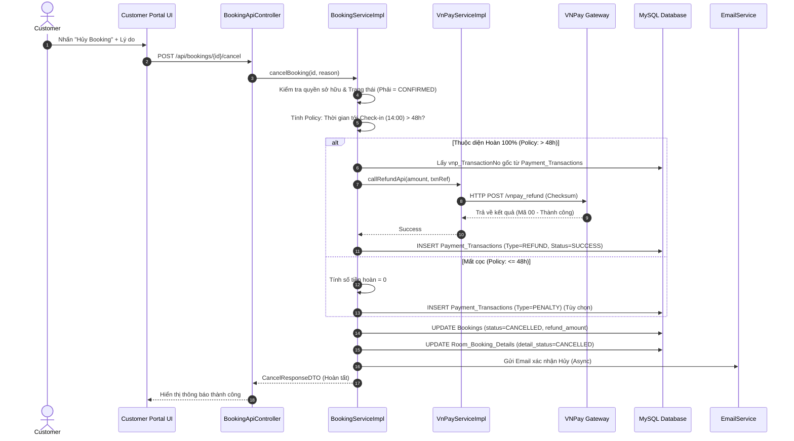

# ENGINEERING DOCUMENTATION STANDARD (EDS) v2.0

## WF-09 — Hủy Đặt phòng & Hoàn tiền (Booking Cancellation & VNPay Refund)

| Field                       | Value                                      |
| --------------------------- | ------------------------------------------ |
| **Document ID**       | `KAWAI-WF09-IMP-001`                     |
| **Version**           | 1.0                                        |
| **Date**              | 2026-07-02                                 |
| **Status**            | Approved                                   |
| **Document Owner**    | Group 2 — SWP391 SE2023                            |
| **Author**            | Antigravity (AI Assistant)                            |
| **Based on EDS**      | v2.0                                       |
| **Workflow Ref**      | WF-09 —`02-Requirement/workflow.md`     |
| **ADR Ref**           | ADR-01 —`03-Design/ADR/ADR-01.md`       |
| **Class Diagram Ref** | CD-02 —`02-Requirement/classdiagram.md` |

---

### MỤC LỤC

1. [Tổng quan Module](#1-tổng-quan-module)
2. [Ma trận Truy vết (Traceability Matrix)](#2-ma-trận-truy-vết-traceability-matrix)
3. [Architecture Decision Records (ADR)](#3-architecture-decision-records-adr)
4. [Non-Functional Requirements & SLA](#4-non-functional-requirements--sla)
5. [Static Modeling — Mô hình Tĩnh](#5-static-modeling--mô-hình-tĩnh)
6. [Dynamic Modeling — Mô hình Động](#6-dynamic-modeling--mô-hình-động)
7. [Domain Event Catalog](#7-domain-event-catalog)
8. [Interface Specification](#8-interface-specification)
9. [API Specification](#9-api-specification)
10. [Bảng mã lỗi (Error Codes)](#10-bảng-mã-lỗi-error-codes)
11. [Kế hoạch Triển khai Full-Stack (Step-by-Step)](#11-kế-hoạch-triển-khai-full-stack-step-by-step)
12. [Rollback & Incident Runbook](#12-rollback--incident-runbook)
13. [TDD — Test Case Specification](#13-tdd--test-case-specification)
14. [Phương pháp Xác minh](#14-phương-pháp-xác-minh)
15. [API Verification Samples](#15-api-verification-samples)
16. [Authorization Matrix](#16-authorization-matrix)

---

## 1. Tổng quan Module

**WF-09 (Hủy Đặt phòng & Hoàn tiền)** là quy trình cho phép khách hàng tự chủ động hủy đơn đặt phòng của mình trực tuyến, hoặc Lễ tân/Quản lý hủy giúp khách hàng. Quy trình này kết hợp với cổng thanh toán VNPay để tự động hoàn tiền dựa trên chính sách (Cancellation Policy).
Mức độ quan trọng: **HIGH**, liên quan trực tiếp đến dòng tiền, trải nghiệm khách hàng và giải phóng quỹ phòng (Room Inventory).

Luồng xử lý gồm 4 bước chính:
*   **Kiểm tra tính hợp lệ:** Chỉ các đơn hàng chưa Check-in (`CONFIRMED` hoặc `PENDING`) mới được phép hủy.
*   **Kiểm tra chính sách (BR-FIN-02):** Khách hủy trước giờ Check-in tiêu chuẩn (14:00) ít nhất 48 tiếng -> Hoàn 100% cọc. Nếu <= 48 tiếng hoặc No-show -> Tịch thu toàn bộ cọc.
*   **Xử lý Hoàn tiền (Refund API):** Nếu đủ điều kiện hoàn tiền, hệ thống kết nối VNPay Refund API để trả tiền về tài khoản ngân hàng của khách.
*   **Cập nhật hệ thống:** Chuyển Booking sang `CANCELLED`, giải phóng quỹ phòng (Room Allocation), ghi Audit Log, gửi Email xác nhận.

| Field                           | Value                                                                           |
| ------------------------------- | ------------------------------------------------------------------------------- |
| **Module Name**           | `Booking Cancellation & Refund Service`                                       |
| **Bounded Context**       | Front Office / Payment Management                                                |
| **Data Classification**   | Financial Data (Payment Transactions), PII (Customer Email/Phone) |
| **Upstream Dependencies** | WF-02 (Booking Online), VNPay API Gateway                               |
| **Downstream Consumers**  | Night Audit, Financial Reports, Room Inventory Matrix   |

---

## 2. Ma trận Truy vết (Traceability Matrix)

| Requirement ID      | Loại         | Mô tả yêu cầu                                                                                                            | Thành phần Code                                                                                      | ADR liên quan |
| :------------------ | :------------ | :--------------------------------------------------------------------------------------------------------------------------- | :----------------------------------------------------------------------------------------------------- | :------------- |
| **BR-FIN-02** | Business Rule | HIGH — Hủy > 48h: hoàn 100%; Hủy ≤ 48h hoặc No-show: mất cọc. | `BookingServiceImpl.cancelBooking()`, `VnPayServiceImpl.refund()` | ADR-01, ADR-03 |
| **BR-SYS-04** | Business Rule | CRITICAL — Ghi Audit Log cho hành động Hủy phòng và Hoàn tiền. Không thể xóa. | `@LogActivity` trên `cancelBooking` | ADR-01 |
| **UC12**      | Use Case      | Hủy đặt phòng (Khách hàng tự thao tác hoặc Lễ tân thao tác giúp). | `CustomerBookingWebController` | ADR-01     |

---

## 3. Architecture Decision Records (ADR)

Áp dụng **ADR-01 (Spring Boot MVC) và Tích hợp Thanh Toán**:

*   **Service Layer (`BookingServiceImpl` & `VnPayServiceImpl`):**
    *   Tách biệt logic tính toán phí hủy (Cancellation Penalty) và logic gọi API bên thứ 3 (VNPay).
    *   Mẫu thiết kế *Saga/Compensating Transaction* mô phỏng: Lưu `PaymentTransaction` trạng thái `REFUND_PENDING`, gọi VNPay, sau đó update thành `REFUND_SUCCESS`. Tránh mất dấu dòng tiền nếu mất kết nối mạng.
*   **Transactional Boundary:**
    *   Hành vi đổi status Booking sang `CANCELLED` và giải phóng phòng con diễn ra trong 1 transaction ACID duy nhất.
*   **Security:**
    *   Khách hàng chỉ có quyền hủy `Booking` của chính mình (`@PreAuthorize` + Resource-level check).
*   **AOP Audit:**
    *   Sử dụng `@LogActivity(action="CANCEL_BOOKING")` lưu vào DB MongoDB hoặc bảng Audit_Logs riêng (Write-Only).

---

## 4. Non-Functional Requirements & SLA

| Category               | Requirement                                         | Target SLA | Verification                        |
| :--------------------- | :-------------------------------------------------- | :--------- | :---------------------------------- |
| **Reliability**  | Đảm bảo VNPay Refund Request chỉ được gọi đúng 1 lần (Idempotent) | 100% | Unit Test Mocking VNPay API |
| **Performance**  | Giao dịch hủy phòng hoàn tất và phản hồi UI | < 1200ms | APM |
| **Audit & Compliance** | Không thể thay đổi trạng thái của Booking đã `CANCELLED` | 100% | Entity Listener Check |

---

## 5. Static Modeling — Mô hình Tĩnh

### 5.1 Database Entity Schema (Trọng điểm)

```sql
-- Lưu trữ giao dịch thanh toán và hoàn tiền
CREATE TABLE IF NOT EXISTS Payment_Transactions (
    id                    BIGINT AUTO_INCREMENT PRIMARY KEY,
    booking_id            BIGINT NOT NULL,
    transaction_type      VARCHAR(20) NOT NULL,  -- DEPOSIT, REFUND, FINAL_PAYMENT
    amount                DECIMAL(15,2) NOT NULL,
    payment_method        VARCHAR(30) DEFAULT 'VNPAY',
    gateway_txn_ref       VARCHAR(255) NULL,     -- Mã giao dịch VNPay gốc (vnp_TransactionNo)
    status                VARCHAR(20) NOT NULL,  -- SUCCESS, PENDING, FAILED
    created_at            DATETIME DEFAULT NOW(),
    FOREIGN KEY (booking_id) REFERENCES Bookings(id)
);

-- Cập nhật Bookings
ALTER TABLE Bookings ADD COLUMN cancellation_reason VARCHAR(255) NULL;
ALTER TABLE Bookings ADD COLUMN refund_amount DECIMAL(15,2) DEFAULT 0.00;
```

---

## 6. Dynamic Modeling — Mô hình Động

### 6.1 Sequence Diagram: Luồng Hủy Booking & Gọi VNPay Refund



---

## 7. Domain Event Catalog

| Event Name | Publisher | Sync/Async | Consumer | Trigger Cause | Payload |
| :--- | :--- | :--- | :--- | :--- | :--- |
| `BookingCancelledEvent` | `BookingServiceImpl` | Async | `EmailServiceImpl`, `InventoryService` | Trạng thái Booking chuyển sang Cancelled | `bookingId`, `refundAmount` |
| `RefundProcessedEvent` | `VnPayServiceImpl` | Async | `NightAuditService` | VNPay xác nhận refund thành công | `txnRef`, `amount` |

---

## 8. Interface Specification

Giao diện `BookingService`:

```java
package com.kawai.services.interfaces;

public interface BookingService {
    /**
     * Hủy đơn đặt phòng.
     * @param bookingId ID của đơn đặt phòng.
     * @param reason Lý do hủy (Từ khách hàng hoặc lễ tân).
     * @param requestedByUserId ID người thực hiện hủy (Để Audit).
     * @return true nếu hủy thành công.
     */
    boolean cancelBooking(Long bookingId, String reason, Long requestedByUserId);
}
```

Giao diện `VnPayService` (Mở rộng cho tính năng Refund):

```java
package com.kawai.services.interfaces;

public interface VnPayService {
    /**
     * Gọi API Hoàn tiền của VNPay.
     * @param originalTxnRef Mã giao dịch thanh toán cọc ban đầu.
     * @param amount Số tiền cần hoàn.
     * @param createdBy Người khởi tạo lệnh hoàn.
     * @return Mã phản hồi từ VNPay (00 là thành công).
     */
    String processRefund(String originalTxnRef, BigDecimal amount, String createdBy);
}
```

---

## 9. API Specification

### 9.1 REST API Endpoint (Xử lý AJAX từ UI Khách hàng)

*   **URL:** `POST /api/v1/customer/bookings/{id}/cancel`
*   **Method:** POST
*   **Security:** `@PreAuthorize("hasRole('ROLE_CUSTOMER')")`

**Request Payload:**

```json
{
  "reason": "Lịch trình cá nhân bị thay đổi đột xuất."
}
```

**Response (Thành công Hoàn tiền):**

```json
{
  "status": "SUCCESS",
  "message": "Đơn đặt phòng đã được hủy. Số tiền 2,000,000 VND sẽ được hoàn về tài khoản của bạn trong 3-5 ngày làm việc.",
  "data": {
    "bookingId": 1045,
    "status": "CANCELLED",
    "refundAmount": 2000000
  }
}
```

---

## 10. Bảng mã lỗi (Error Codes)

| Error Code       | HTTP Status | Message (Thông báo cho Khách/Lễ tân)                                     | Cách xử lý (Runbook)                               |
| :--------------- | :---------- | :------------------------------------------------------------------------ | :------------------------------------------------- |
| `CANCEL-001`     | 400         | Booking đã được Check-in, không thể hủy!                               | Phải làm thủ tục Check-out sớm. Không áp dụng luồng này. |
| `CANCEL-002`     | 403         | Bạn không có quyền hủy đơn đặt phòng này.                               | Chặn Hacker sửa ID trên URL.                      |
| `REFUND-ERR-01`  | 502         | Lỗi kết nối cổng thanh toán VNPay. Không thể xử lý hoàn tiền.          | Booking tạm khóa. Yêu cầu khách thử lại hoặc NV đối soát VNPay Merchant. |

---

## 11. Kế hoạch Triển khai Full-Stack (Step-by-Step)

### Phase 1: Database & Entity Updates
Khai báo bảng `Payment_Transactions` và liên kết JPA.

```java
@Entity
@Table(name = "Payment_Transactions")
public class PaymentTransaction {
    @Id @GeneratedValue(strategy = GenerationType.IDENTITY)
    private Long id;
    
    @ManyToOne
    @JoinColumn(name = "booking_id")
    private RoomBooking booking;
    
    @Column(name = "transaction_type")
    private String transactionType; // DEPOSIT, REFUND
    
    private BigDecimal amount;
    
    @Column(name = "gateway_txn_ref")
    private String gatewayTxnRef;
    
    private String status; // SUCCESS, FAILED
}
```

### Phase 2: DTOs & Validation
Tạo `CancelRequestDTO`.

```java
@Data
public class CancelRequestDTO {
    @NotBlank(message = "Vui lòng chọn lý do hủy phòng.")
    private String reason;
}
```

### Phase 3: Service Layer (Business Logic)
Mã hóa `cancelBooking()` áp dụng Policy BR-FIN-02.

```java
@Service
public class BookingServiceImpl implements BookingService {

    @Override
    @Transactional(rollbackFor = Exception.class)
    @LogActivity(action = "CANCEL_BOOKING", module = "BOOKING")
    public boolean cancelBooking(Long bookingId, String reason, Long userId) {
        RoomBooking booking = bookingRepo.findById(bookingId).orElseThrow();
        
        // Kiểm tra quyền (Nếu gọi từ API Khách hàng)
        if (!booking.getCustomer().getAccount().getId().equals(userId)) {
            throw new BusinessException("CANCEL-002");
        }
        
        // Chỉ Booking đang Pending hoặc Confirmed mới được hủy
        if (!Arrays.asList("PENDING", "CONFIRMED").contains(booking.getBookingStatus())) {
            throw new BusinessException("CANCEL-001");
        }
        
        // Tính giờ đến Check-in (Mặc định check-in 14:00 ngày lưu trú)
        LocalDateTime checkinTime = booking.getBookingDate().atTime(14, 0);
        long hoursUntilCheckin = ChronoUnit.HOURS.between(LocalDateTime.now(), checkinTime);
        
        BigDecimal refundAmount = BigDecimal.ZERO;
        
        // Policy BR-FIN-02
        if (hoursUntilCheckin > 48) {
            // Đủ điều kiện hoàn cọc
            PaymentTransaction depositTx = txnRepo.findByBookingIdAndType(bookingId, "DEPOSIT");
            if (depositTx != null && "SUCCESS".equals(depositTx.getStatus())) {
                String vnpResult = vnPayService.processRefund(depositTx.getGatewayTxnRef(), depositTx.getAmount(), "SYSTEM");
                
                if ("00".equals(vnpResult)) {
                    refundAmount = depositTx.getAmount();
                    
                    // Ghi lại giao dịch hoàn
                    PaymentTransaction refundTx = new PaymentTransaction();
                    refundTx.setBooking(booking);
                    refundTx.setTransactionType("REFUND");
                    refundTx.setAmount(refundAmount);
                    refundTx.setStatus("SUCCESS");
                    txnRepo.save(refundTx);
                } else {
                    throw new BusinessException("REFUND-ERR-01");
                }
            }
        }
        
        // Cập nhật Entity
        booking.setBookingStatus("CANCELLED");
        booking.setCancellationReason(reason);
        booking.setRefundAmount(refundAmount);
        
        // Cập nhật toàn bộ phòng con
        booking.getDetails().forEach(detail -> detail.setDetailStatus("CANCELLED"));
        
        bookingRepo.save(booking);
        
        // Publish Event
        eventPublisher.publishEvent(new BookingCancelledEvent(bookingId, refundAmount));
        
        return true;
    }
}
```

### Phase 4: API Controller
Expose REST API.

```java
@RestController
@RequestMapping("/api/v1/customer/bookings")
public class BookingApiController {

    @PostMapping("/{id}/cancel")
    @PreAuthorize("hasRole('ROLE_CUSTOMER')")
    public ResponseEntity<ApiResponse> cancelBooking(@PathVariable Long id, @RequestBody @Valid CancelRequestDTO dto) {
        Long currentUserId = SecurityUtils.getCurrentUserId(); // Lấy từ JWT Context
        
        boolean success = bookingService.cancelBooking(id, dto.getReason(), currentUserId);
        
        return ResponseEntity.ok(ApiResponse.success("Hủy thành công"));
    }
}
```

### Phase 5: Giao diện Khách hàng (Thymeleaf/Vue.js)
Nút "Hủy Booking" hiển thị Popup xác nhận chứa Logic Check Policy ảo ở phía Frontend (Để báo trước cho khách).

```html
<!-- Nút Hủy hiển thị trên trang Chi tiết Booking -->
<button class="btn btn-danger" onclick="openCancelModal(1045, '2026-07-10')">Hủy Đơn Này</button>

<!-- Modal Hủy -->
<div class="modal" id="cancelModal">
   <h5>Xác nhận Hủy Đặt phòng</h5>
   <p id="policyWarning" class="text-warning"></p>
   <textarea id="cancelReason" placeholder="Vui lòng cho chúng tôi biết lý do..."></textarea>
   <button onclick="submitCancel()">Đồng ý Hủy</button>
</div>

<script>
function openCancelModal(id, checkinDate) {
    const diffHours = (new Date(checkinDate + 'T14:00:00') - new Date()) / 36e5;
    if(diffHours > 48) {
        document.getElementById('policyWarning').innerText = "Bạn hủy trước 48h. Bạn sẽ được hoàn 100% tiền cọc.";
    } else {
        document.getElementById('policyWarning').innerText = "CẢNH BÁO: Hủy sau thời hạn an toàn. Bạn sẽ mất toàn bộ tiền cọc.";
    }
    $('#cancelModal').modal('show');
}
</script>
```

---

## 12. Rollback & Incident Runbook

### 12.1. Lỗi Cổng VNPay (Mạng chậm, Bảo trì)
*   **Triệu chứng:** Hành động bấm "Hủy" bị treo hoặc trả về lỗi 502/504 (`REFUND-ERR-01`).
*   **Cơ chế bảo vệ:** API chạy trong `@Transactional`. Throw exception sẽ tự động hủy việc Update trạng thái Booking. Khách hàng vẫn còn Booking nguyên vẹn, tiền không bị thất thoát.
*   **Runbook:** Khách gọi Hotline, Lễ tân ghi nhận và báo Kế toán thao tác hoàn tiền tay trên màn hình VNPAY Merchant, sau đó Admin đổi status Booking trên tool DB nội bộ.

### 12.2. Lỗi Hệ thống Email
*   **Triệu chứng:** Booking đã chuyển sang Cancelled, tiền đã hoàn, nhưng khách báo không nhận được email.
*   **Cơ chế:** Gửi email là hành động Async (`@Async`) trong `BookingCancelledEvent`. Transaction cốt lõi không bị ảnh hưởng.
*   **Runbook:** Có chức năng "Resend Cancellation Email" trên trang Quản lý Booking của Admin.

---

## 13. TDD — Test Case Specification

| Test Case ID | Hàm Unit Test | Đầu Vào (Given) | Hành Động (When) | Kết quả Kỳ vọng (Then) |
| :--- | :--- | :--- | :--- | :--- |
| `TC-CANCEL-01` | `cancelBooking_Refund` | Booking lúc Now() cách Checkin > 48h | Gọi `cancelBooking()` | Gọi mock `VnPay.refund()` 1 lần. Status = `CANCELLED`, `refundAmount` = 100% cọc. |
| `TC-CANCEL-02` | `cancelBooking_Forfeit` | Booking lúc Now() cách Checkin = 24h | Gọi `cancelBooking()` | KHÔNG gọi mock VNPay. Status = `CANCELLED`, `refundAmount` = 0. |
| `TC-CANCEL-03` | `cancelBooking_WrongUser`| `userId` truyền vào không khớp `booking.customer.id` | Gọi `cancelBooking()` | Ném `BusinessException("CANCEL-002")`. |
| `TC-CANCEL-04` | `cancelBooking_CheckedIn`| Booking status = `CHECKED_IN` | Gọi `cancelBooking()` | Ném `BusinessException("CANCEL-001")`. |

---

## 14. Phương pháp Xác minh

| Tầng (Layer) | Phương pháp | Công cụ | Trách nhiệm |
| :--- | :--- | :--- | :--- |
| **Logic Policy Hoàn Tiền** | Unit Test với `@MockBean` giả lập `LocalDateTime.now()` để ép thời gian > và < 48h. | JUnit 5 + Mockito | Backend Dev |
| **Transaction ACID** | Viết Test Case cố tình quăng lỗi ở dòng Gửi Email (nếu để code send email trong khối Sync), DB không được lưu trạng thái CANCEL. | Spring `@DataJpaTest` | Tech Lead |
| **Tích hợp VNPay** | Dùng thẻ Test VNPay. Thực hiện thanh toán -> gọi API Cancel -> Check Sandbox Dashboard xem có giao dịch Refund. | VNPay Sandbox | QA/Tester |

---

## 15. API Verification Samples

```bash
# Hủy đặt phòng qua cURL (Giả lập Khách hàng)
curl -X POST "http://localhost:8080/api/v1/customer/bookings/1045/cancel" \
  -H "Authorization: Bearer <JWT_TOKEN>" \
  -H "Content-Type: application/json" \
  -d '{
        "reason": "Chuyến bay bị hủy, tôi không thể bay vào Nha Trang được nữa."
      }'
```

---

## 16. Authorization Matrix (Bảng chặn phân quyền)

| Endpoint / Action                      |         GUEST         |    CUSTOMER    | RECEPTIONIST |   ADMIN/MANAGER   |
| :------------------------------------- | :--------------------: | :-------------: | :----------: | :----------------: |
| `POST /api/v1/customer/bookings/{id}/cancel` |           ❌           | ✔️ (own only) |      ❌      |         ❌         |
| `POST /admin/bookings/{id}/force-cancel` |           ❌           |       ❌       |      ✔️      |         ✔️         |
| VNPay Refund Callback (IPN/System)     | ✔️ (VNPay Server IP) |       ❌       |      ❌      |         ❌         |
