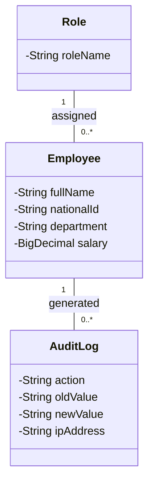
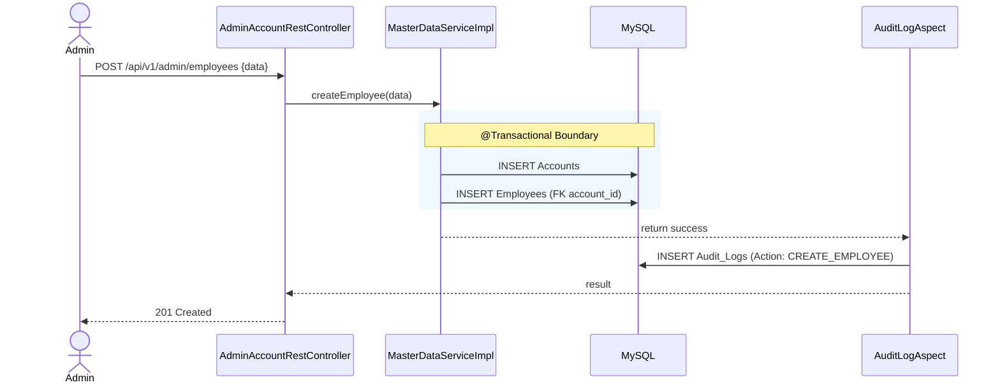

# ENGINEERING DOCUMENTATION STANDARD (EDS) v2.0
## WF-12 — Quản lý Nhân viên & Phân quyền (Staff Management & RBAC Flow)

| Field | Value |
|---|---|
| **Document ID** | `KAWAI-WF12-IMP-001` |
| **Version** | 2.0 |
| **Date** | 2026-07-02 |
| **Status** | Approved |
| **Document Owner** | Team Lead — Group 2 SWP391 |
| **Author** | Senior Backend Developer / Security Architect |
| **Based on EDS** | v2.0 |
| **Workflow Ref** | WF-12 — `02-Requirement/workflow.md` |
| **ADR Ref** | ADR-01 — `03-Design/ADR/ADR-01.md` |

---

### MỤC LỤC
1. [Tổng quan Module](#1-tổng-quan-module)
2. [Ma trận Truy vết](#2-ma-trận-truy-vết-traceability-matrix)
3. [Architecture Decision Records (ADR)](#3-architecture-decision-records-adr)
4. [Non-Functional Requirements & SLA](#4-non-functional-requirements--sla)
5. [Static Modeling — Mô hình Tĩnh](#5-static-modeling--mô-hình-tĩnh)
6. [Dynamic Modeling — Mô hình Động](#6-dynamic-modeling--mô-hình-động)
7. [Domain Event Catalog](#7-domain-event-catalog)
8. [Interface Specification](#8-interface-specification)
9. [API Specification](#9-api-specification)
10. [Bảng mã lỗi (Error Codes)](#10-bảng-mã-lỗi-error-codes)
11. [Kế hoạch Triển khai Full-Stack](#11-kế-hoạch-triển-khai-full-stack-step-by-step)
12. [Rollback & Incident Runbook](#12-rollback--incident-runbook)
13. [TDD — Test Case Specification](#13-tdd--test-case-specification)
14. [Phương pháp Xác minh](#14-phương-pháp-xác-minh)
15. [API Verification Samples](#15-api-verification-samples)
16. [Authorization Matrix](#16-authorization-matrix)

---

## 1. Tổng quan Module

**WF-12** hỗ trợ các tính năng quản trị tài khoản nội bộ (Admin/Manager): thêm mới nhân sự vào hệ thống, cấu hình Role (Quyền), khóa và mở khóa tài khoản, đồng thời lưu vết truy cập (Audit Logging).

| Field | Value |
|---|---|
| **Module Name** | `Staff & Role Management` |
| **Bounded Context** | Admin / Master Data |
| **Data Classification** | Confidential |
| **Upstream Dependencies** | WF-01 (Đăng nhập Admin) |
| **Downstream Consumers** | Module khác sử dụng RBAC |

---

## 2. Ma trận Truy vết (Traceability Matrix)

| Requirement ID | Loại | Mô tả yêu cầu | Thành phần Code | ADR liên quan |
|:---|:---|:---|:---|:---|
| **BR-SYS-04** | Business Rule | Ghi Audit_Logs mọi thao tác phân quyền | `@LogActivity` | ADR-01 |
| **BR-SYS-07** | Business Rule | 1 Employee chỉ có 1 Role tại 1 thời điểm | `AdminAccountRestController` | ADR-01 |
| **BR-DATA-03**| Business Rule | `Account` + `Employee` insert phải Atomic | `@Transactional` | ADR-01 |
| **UC05.1** | Use Case | Tạo tài khoản nhân viên | `createEmployee()` | ADR-01 |
| **UC05.2** | Use Case | Đổi Role nhân viên | `updateEmployeeRole()` | ADR-01 |

---

## 3. Architecture Decision Records (ADR)

Áp dụng **ADR-01**:
* Sử dụng Spring AOP (`AuditLogAspect.java`) bắt annotation `@LogActivity` để ghi log tự động mà không can thiệp logic của Controller/Service.
* Sử dụng `@Transactional` bắt buộc ở tầng Service.

---

## 4. Non-Functional Requirements & SLA

| Category | Requirement | Target SLA | Verification |
|:---|:---|:---|:---|
| **Data Integrity**| Tạo Account + Employee | 100% Atomic | Integration Test |
| **Audit Compliance**| Ghi log không bị sót | 100% Coverage | Code Review |

---

## 5. Static Modeling — Mô hình Tĩnh

### 5.1 Database Entity Schema
```sql
CREATE TABLE IF NOT EXISTS roles (
    id BIGINT AUTO_INCREMENT PRIMARY KEY,
    role_name VARCHAR(50) NOT NULL UNIQUE
);

CREATE TABLE IF NOT EXISTS permissions (
    id BIGINT AUTO_INCREMENT PRIMARY KEY,
    permission_code VARCHAR(100) NOT NULL UNIQUE,
    description VARCHAR(255)
);

CREATE TABLE IF NOT EXISTS role_permissions (
    role_id BIGINT,
    permission_id BIGINT,
    PRIMARY KEY (role_id, permission_id),
    FOREIGN KEY (role_id) REFERENCES roles(id) ON DELETE CASCADE,
    FOREIGN KEY (permission_id) REFERENCES permissions(id) ON DELETE CASCADE
);

CREATE TABLE IF NOT EXISTS employees (
    account_id BIGINT PRIMARY KEY,
    full_name VARCHAR(100) NOT NULL,
    national_id VARCHAR(20) NOT NULL UNIQUE,
    department VARCHAR(50) NOT NULL,
    salary DECIMAL(15, 2) NOT NULL,
    FOREIGN KEY (account_id) REFERENCES accounts(id) ON DELETE CASCADE
);

CREATE TABLE IF NOT EXISTS audit_logs (
    id BIGINT AUTO_INCREMENT PRIMARY KEY,
    action_type VARCHAR(100) NOT NULL,
    impacted_table VARCHAR(100) NOT NULL,
    old_value TEXT,
    new_value TEXT,
    actor_id BIGINT,
    ip_address VARCHAR(45) NOT NULL,
    created_at TIMESTAMP DEFAULT CURRENT_TIMESTAMP
);
```

### 5.2 Class Diagram


---

## 6. Dynamic Modeling — Mô hình Động

### 6.1 Sequence Diagram: WF-12 Create Employee



---

## 7. Domain Event Catalog

| Event Name | Publisher | Subscriber | Action |
|:---|:---|:---|:---|
| `EmployeeCreated` | `MasterDataService` | `AuditLogAspect` | Ghi Audit_Logs (Sync) |

---

## 8. Interface Specification

```java
// src/main/java/com/kawai/services/interfaces/IMasterDataService.java
public interface IMasterDataService {
    @Transactional
    @LogActivity(action = "CREATE_EMPLOYEE", module = "ADMIN")
    EmployeeDTO createEmployee(EmployeeCreateDTO request);
    
    @Transactional
    @LogActivity(action = "UPDATE_ROLE", module = "ADMIN")
    void updateEmployeeRole(Long accountId, Long newRoleId);
    
    @Transactional
    @LogActivity(action = "LOCK_ACCOUNT", module = "ADMIN")
    void toggleAccountLock(Long accountId, boolean lock);
}
```

---

## 9. API Specification

### 9.1 POST `/api/v1/admin/employees` — Admin tạo nhân viên mới

*Request Body:*
```json
{
  "email": "employee1@kawairesort.com",
  "password": "TempPassword123!",
  "fullName": "Le Van Luyen",
  "nationalId": "037201009999",
  "department": "FRONT_OFFICE",
  "salary": 12000000.00,
  "roleId": 2
}
```

*Response — 201 Created:*
```json
{
  "success": true,
  "employeeId": 12,
  "message": "Tạo tài khoản nhân viên thành công"
}
```

*Response — 400 Bad Request:*
```json
{
  "success": false,
  "error": {
    "code": "ADM-002",
    "message": "Role ID không tồn tại"
  }
}
```

---

### 9.2 PUT `/api/v1/admin/accounts/{id}/role` — Đổi Role nhân viên

*Request Body:*
```json
{
  "newRoleId": 3
}
```

*Response — 200 OK:*
```json
{
  "success": true,
  "message": "Cập nhật phân quyền nhân viên thành công"
}
```

---

## 10. Bảng mã lỗi (Error Codes)

| Code | HTTP | Message EN | Message VI | Trigger |
|:---|:---|:---|:---|:---|
| `ADM-001`  | 403 | Insufficient permissions | Không có quyền quản trị | Người gọi API không phải là Admin |
| `ADM-002`  | 400 | Role ID not found | Vai trò không hợp lệ | Cung cấp roleId không tồn tại trong DB |
| `ADM-003`  | 404 | Employee not found | Không tìm thấy nhân viên | Truy vấn theo ID không có kết quả |
| `ADM-004`  | 409 | Duplicate National ID | Trùng số CCCD/National ID | Trùng dữ liệu National ID |

---

## 11. Kế hoạch Triển khai Full-Stack (Step-by-Step)

### 11.1 Prerequisites
- [x] Chạy script khởi tạo bảng dữ liệu RBAC.
- [x] Đảm bảo cấu hình AOP trong Spring Boot được kích hoạt (`@EnableAspectJAutoProxy`).

---

### 11.2 PHASE 1 — Database & Roles Seeder
Đảm bảo Roles và Permissions mặc định đã được khởi tạo trong `RolePermissionSeeder.java`.
```sql
CREATE UNIQUE INDEX idx_employee_national_id ON employees(national_id);
```

---

### 11.3 PHASE 2 — Backend Implementation

#### 1. Triển khai Aspect ghi log tự động
```java
// src/main/java/com/kawai/security/AuditLogAspect.java
@Aspect
@Component
@RequiredArgsConstructor
public class AuditLogAspect {

    private final AuditLogRepository auditLogRepository;
    private final HttpServletRequest request;

    @Around("@annotation(logActivity)")
    public Object logActivity(ProceedingJoinPoint joinPoint, LogActivity logActivity) throws Throwable {
        String action = logActivity.action();
        String module = logActivity.module();
        
        // Nhận context của user hiện tại
        Authentication auth = SecurityContextHolder.getContext().getAuthentication();
        String actor = (auth != null) ? auth.getName() : "SYSTEM";
        String ipAddress = request.getRemoteAddr();

        Object result = joinPoint.proceed(); // Thực thi Business Logic chính

        // Lưu log sau khi execution thành công
        AuditLog auditLog = AuditLog.builder()
            .actionType(action)
            .impactedTable(module)
            .actorName(actor)
            .ipAddress(ipAddress)
            .createdAt(LocalDateTime.now())
            .build();
        auditLogRepository.save(auditLog);

        return result;
    }
}
```

#### 2. Triển khai Service logic tạo nhân viên
```java
// src/main/java/com/kawai/services/impl/MasterDataServiceImpl.java
@Service
@RequiredArgsConstructor
public class MasterDataServiceImpl implements IMasterDataService {

    private final AccountRepository accountRepository;
    private final EmployeeRepository employeeRepository;
    private final RoleRepository roleRepository;
    private final PasswordEncoder passwordEncoder;

    @Override
    @Transactional
    @LogActivity(action = "CREATE_EMPLOYEE", module = "ADMIN")
    public EmployeeDTO createEmployee(EmployeeCreateDTO request) {
        if (accountRepository.existsByEmail(request.getEmail())) {
            throw new BusinessException("AUTH-004", "Email đã tồn tại");
        }
        if (employeeRepository.existsByNationalId(request.getNationalId())) {
            throw new BusinessException("ADM-004", "Số CCCD đã tồn tại");
        }

        Role role = roleRepository.findById(request.getRoleId())
            .orElseThrow(() -> new BusinessException("ADM-002", "Vai trò không hợp lệ"));

        // Tạo tài khoản liên đới
        Account account = new Account();
        account.setEmail(request.getEmail());
        account.setPasswordHash(passwordEncoder.encode(request.getPassword()));
        account.setRole(role);
        account.setIsActive(true);
        account = accountRepository.save(account);

        // Lưu thông tin nhân sự
        Employee employee = new Employee();
        employee.setAccountId(account.getId());
        employee.setFullName(request.getFullName());
        employee.setNationalId(request.getNationalId());
        employee.setDepartment(request.getDepartment());
        employee.setSalary(request.getSalary());
        employeeRepository.save(employee);

        return EmployeeDTO.from(employee);
    }
}
```

---

### 11.4 PHASE 3 — Frontend Layer (Staff Management Screen)

#### 1. Thymeleaf Giao diện Phân quyền & Quản lý nhân viên
```html
<!-- templates/admin/staff.html -->
<main class="p-6 bg-zinc-950 text-white min-h-screen">
    <div class="flex justify-between items-center mb-6">
        <h1 class="text-2xl font-serif text-amber-500">Quản lý Nhân sự & Phân quyền</h1>
        <button onclick="openCreateEmployeeModal()" class="bg-amber-500 text-black px-4 py-2 rounded-lg font-semibold text-sm">
            Thêm nhân viên
        </button>
    </div>

    <!-- Danh sách nhân sự -->
    <table class="w-full bg-zinc-900 border border-white/10 rounded-xl overflow-hidden text-sm">
        <thead>
            <tr class="bg-white/5 text-left border-b border-white/10">
                <th class="p-4">Họ và tên</th>
                <th class="p-4">Email</th>
                <th class="p-4">Phòng ban</th>
                <th class="p-4">Vai trò (Role)</th>
                <th class="p-4">Hành động</th>
            </tr>
        </thead>
        <tbody>
            <tr th:each="emp : ${employees}" class="border-b border-white/5">
                <td class="p-4" th:text="${emp.fullName}">Nguyen Van A</td>
                <td class="p-4" th:text="${emp.email}">a@kawai.com</td>
                <td class="p-4" th:text="${emp.department}">F&B</td>
                <td class="p-4">
                    <select th:onchange="'changeEmployeeRole(' + ${emp.accountId} + ', this.value)'"
                            class="bg-black border border-white/20 rounded px-2 py-1 text-xs">
                        <option th:each="role : ${roles}" th:value="${role.id}" th:text="${role.roleName}" th:selected="${role.roleName == emp.roleName}"></option>
                    </select>
                </td>
                <td class="p-4">
                    <button th:onclick="'toggleLockAccount(' + ${emp.accountId} + ', ' + ${!emp.isActive} + ')'"
                            th:text="${emp.isActive ? 'Khóa' : 'Mở khóa'}"
                            class="text-red-400 hover:underline text-xs"></button>
                </td>
            </tr>
        </tbody>
    </table>
</main>
```

#### 2. AJAX Scripts (JS)
```javascript
// src/main/resources/static/js/admin-staff.js
function changeEmployeeRole(accountId, newRoleId) {
    fetch(`/api/v1/admin/accounts/${accountId}/role`, {
        method: 'PUT',
        headers: {
            'Content-Type': 'application/json',
            'Authorization': 'Bearer ' + localStorage.getItem('jwt_token')
        },
        body: JSON.stringify({ newRoleId })
    })
    .then(async res => {
        if (!res.ok) {
            const data = await res.json();
            throw new Error(data.error?.message || 'Không thể đổi quyền');
        }
        showToast('Cập nhật quyền thành công', 'success');
    })
    .catch(err => {
        showToast(err.message, 'error');
    });
}
```

---

## 12. Rollback & Incident Runbook

### 12.1 Sự cố: Tạo nhân viên bị lỗi nửa chừng (lưu Account thành công nhưng lưu Employee thất bại)
* **Xử lý:** Do đã được đánh dấu `@Transactional` ở hàm `createEmployee`, cơ chế của Spring Boot Hibernate sẽ tự động rollback lại transaction, xóa sạch bản ghi `Account` tương ứng. Không xảy ra rác mồ côi.

---

## 13. TDD — Test Case Specification

| ID | Test Scenario | Input Data | Expected Output | Status |
|:---|:---|:---|:---|:---:|
| `TC-ADM-01` | Tạo nhân viên thành công | `email: levan@gmail.com, roleId: 2` | DB lưu Account & Employee. AOP ghi 1 dòng log. | 🟢 |
| `TC-ADM-02` | Rollback khi lỗi Employee | `nationalId` bị trùng | Cả Account & Employee không được lưu. | 🟢 |

---

## 14. Phương pháp Xác minh
1. Tạo nhân viên bằng Postman -> Kiểm tra bảng `audit_logs` có bản ghi `CREATE_EMPLOYEE`.
2. Kiểm tra `accounts` xem mật khẩu của nhân viên mới đã được mã hóa bằng đầu băm `$2a$` của BCrypt chưa.

---

## 15. API Verification Samples

```bash
# Thay đổi role nhân viên sang MANAGER (roleId = 3)
curl -X PUT http://localhost:8080/api/v1/admin/accounts/12/role \
  -H "Authorization: Bearer <JWT_TOKEN>" \
  -H "Content-Type: application/json" \
  -d '{"newRoleId":3}'
```

---

## 16. Authorization Matrix

| Endpoint / API | GUEST | CUSTOMER | STAFF | ADMIN |
|:---|:---:|:---:|:---:|:---:|
| POST `/api/v1/admin/employees` | ❌ | ❌ | ❌ | ✔️ |
| PUT `/api/v1/admin/accounts/{id}/role` | ❌ | ❌ | ❌ | ✔️ |
| PUT `/api/v1/admin/accounts/{id}/lock` | ❌ | ❌ | ❌ | ✔️ |
