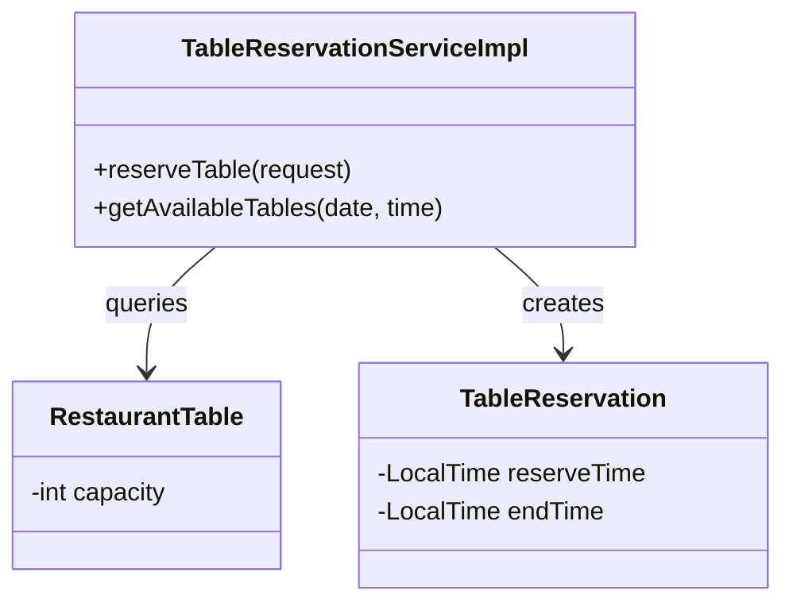
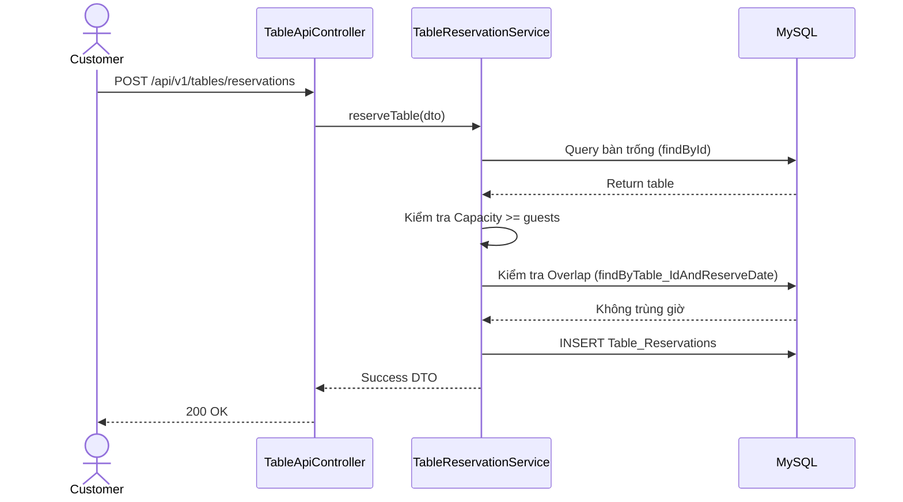

# ENGINEERING DOCUMENTATION STANDARD (EDS) v2.0
## WF-23 — Đặt Bàn Trực Tuyến (Table Reservation)

| Field | Value |
|---|---|
| **Document ID** | `KAWAI-WF23-IMP-001` |
| **Version** | 1.0 |
| **Date** | 2026-07-02 |
| **Status** | Approved |
| **Document Owner** | Trịnh Minh Đức |
| **Author** | Senior Backend Developer |
| **Based on EDS** | v2.0 |
| **Workflow Ref** | WF-23 — `02-Requirement/workflow.md` |
| **ADR Ref** | ADR-01 |

---

### MỤC LỤC
1. [Tổng quan Module](#1-tổng-quan-module)
2. [Ma trận Truy vết](#2-ma-trận-truy-vết-traceability-matrix)
3. [Architecture Decision Records (ADR)](#3-architecture-decision-records-adr)
4. [Non-Functional Requirements & SLA](#4-non-functional-requirements--sla)
5. [Static Modeling — Mô hình Tĩnh](#5-static-modeling--mô-hình-tĩnh)
6. [Dynamic Modeling — Mô hình Động](#6-dynamic-modeling--mô-hình-động)
7. [Domain Event Catalog](#7-domain-event-catalog)
8. [Interface Specification](#8-interface-specification)
9. [API Specification](#9-api-specification)
10. [Bảng mã lỗi (Error Codes)](#10-bảng-mã-lỗi-error-codes)
11. [Kế hoạch Triển khai Full-Stack](#11-kế-hoạch-triển-khai-full-stack-step-by-step)
12. [Rollback & Incident Runbook](#12-rollback--incident-runbook)
13. [TDD — Test Case Specification](#13-tdd--test-case-specification)
14. [Phương pháp Xác minh](#14-phương-pháp-xác-minh)
15. [API Verification Samples](#15-api-verification-samples)
16. [Authorization Matrix](#16-authorization-matrix)

---

## 1. Tổng quan Module

**WF-23** xử lý quy trình đặt bàn trực tuyến trước cho nhà hàng tại resort. Nó ngăn chặn các trường hợp đặt trùng giờ (Overlap) và đảm bảo số lượng khách không vượt quá sức chứa của bàn (Capacity).

| Field | Value |
|---|---|
| **Module Name** | `Table Reservation (F&B)` |
| **Bounded Context** | Food and Beverage |
| **Data Classification** | Public / Internal |

---

## 2. Ma trận Truy vết (Traceability Matrix)

| Requirement ID | Loại | Mô tả yêu cầu | Thành phần Code |
|:---|:---|:---|:---|
| **BR-FB-03** | Business Rule | Thời gian giữ bàn & Chống Overlap | `TableReservationService` |
| **UC14, UC21**| Use Case | Đặt bàn & lọc bàn trống | `TableApiController` |

---

## 3. Architecture Decision Records (ADR)

* **ADR-01**: Cấu trúc Layered Architecture truyền thống của Spring Boot.
* **Database Constraints**: Sử dụng Optimistic Locking (hoặc truy vấn chống Overlap cẩn thận) để đảm bảo không double-booking cùng 1 bàn trong cùng 1 thời gian.

---

## 4. Non-Functional Requirements & SLA

| Category | Requirement | Target SLA | Verification |
|:---|:---|:---|:---|
| **Latency**| API quét bàn trống | < 150ms | k6 Load Test |
| **Concurrency**| Chống Double Booking | 100% | Multi-thread Test |

---

## 5. Static Modeling — Mô hình Tĩnh

### 5.1 Database Entity Schema
```sql
CREATE TABLE IF NOT EXISTS restaurant_tables (
    id BIGINT AUTO_INCREMENT PRIMARY KEY,
    table_name VARCHAR(50),
    capacity INT,
    status VARCHAR(50) DEFAULT 'AVAILABLE'
);

CREATE TABLE IF NOT EXISTS table_reservations (
    id BIGINT AUTO_INCREMENT PRIMARY KEY,
    table_id BIGINT,
    customer_id BIGINT,
    reserve_date DATE,
    reserve_time TIME,
    end_time TIME,
    guests_count INT,
    status VARCHAR(50) DEFAULT 'CONFIRMED'
);
```

### 5.2 Class Diagram


---

## 6. Dynamic Modeling — Mô hình Động

### 6.1 Sequence Diagram: Đặt Bàn


---

## 7. Domain Event Catalog

| Event Name | Publisher | Subscriber | Action |
|:---|:---|:---|:---|
| `TableReservedEvent` | `TableReservationService` | (Chưa có) | Gửi notification cho khách hàng (Tương lai) |

---

## 8. Interface Specification

```java
public interface ITableReservationService {
    @Transactional
    TableReservationDTO reserveTable(TableReservationRequest request);
    
    List<RestaurantTableDTO> getAvailableTables(LocalDate date, LocalTime startTime, LocalTime endTime);
}
```

---

## 9. API Specification

### 9.1 POST `/api/v1/tables/reservations`
*Request Body:*
```json
{
  "tableId": 1,
  "reserveDate": "2026-10-10",
  "startTime": "19:00:00",
  "endTime": "21:00:00",
  "partySize": 4
}
```

---

## 10. Bảng mã lỗi (Error Codes)

| Code | HTTP | Message EN | Message VI |
|:---|:---|:---|:---|
| `FB-010` | 400 | Table already reserved in this slot | Bàn đã bị đặt trong khung giờ này |
| `FB-011` | 400 | Guests exceed capacity | Số lượng khách vượt quá sức chứa |

---

## 11. Kế hoạch Triển khai Full-Stack (Step-by-Step)

### 11.1 Backend
1. **Repository**: Viết query lọc overlap `endTime > :startTime AND reserveTime < :endTime`.
2. **Service**: Ràng buộc kiểm tra null và ném Exception nếu overlap.

### 11.2 Frontend
1. Màn hình chọn bàn: Lọc danh sách bàn sau khi user chọn Ngày & Giờ.
2. Gửi request tạo lịch hẹn.

---

## 12. Rollback & Incident Runbook

* **Sự cố**: Overbooking do Race Condition (2 người cùng lúc bấm nút đặt).
* **Giải pháp**: Phụ thuộc vào `Synchronized` lock hoặc Optimistic Locking ở cấp Database. Nếu bị, hiển thị lỗi 400 và yêu cầu user chọn bàn khác.

---

## 13. TDD — Test Case Specification

| ID | Test Scenario | Input Data | Expected Output | Status |
|:---|:---|:---|:---|:---:|
| `TC-WF23-01` | Đặt bàn hợp lệ | Capacity=4, Guests=4, Khung giờ trống | Lưu vào DB thành công | 🟢 |
| `TC-WF23-02` | Trùng giờ (Overlap) | Bàn đã có booking lúc 19:00 | Báo lỗi FB-010 | 🟢 |
| `TC-WF23-03` | Vượt số lượng | Capacity=2, Guests=4 | Báo lỗi FB-011 | 🟢 |

---

## 14. Phương pháp Xác minh
Chạy trực tiếp Unit Test `TableApiControllerTest` và verify các logic Exception.

---

## 15. API Verification Samples
```bash
curl -X POST http://localhost:8080/api/v1/tables/reservations \
  -H "Authorization: Bearer <JWT_TOKEN>" \
  -H "Content-Type: application/json" \
  -d '{"tableId": 1, "partySize": 2, "reserveDate": "2026-10-10", "startTime": "19:00:00", "endTime": "21:00:00"}'
```

---

## 16. Authorization Matrix

| Endpoint | GUEST | CUSTOMER | STAFF | ADMIN |
|:---|:---:|:---:|:---:|:---:|
| POST `/api/v1/tables/reservations` | ❌ | ✔️ | ✔️ | ❌ |
