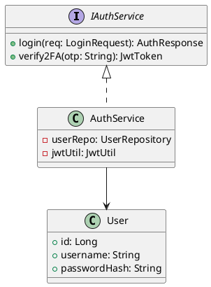
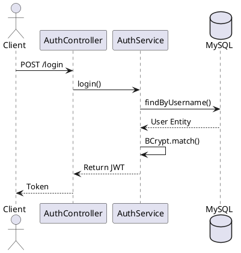

# ENGINEERING DOCUMENTATION STANDARD (EDS) v2.0
## Quy chuẩn Tài liệu Kỹ thuật và Đặc tả Hiện thực hóa

| Field | Value |
| --- | --- |
| **Document ID** | `KAWAI-MOD1-IMP-001` |
| **Version** | 1.0 |
| **Date** | 2026-06-12 |
| **Status** | Approved |
| **Document Owner** | Chu Xuân Dũng |
| **Author** | Chu Xuân Dũng - Tech Lead |
| **Reviewed by** | Nguyễn Xuân Lưu |
| **DPO Sign-off** | `[x] Approved – 2026-06-12` |
| **Based on EDS** | v2.0 |

---

### CHANGELOG
| Ngày | Người thực hiện | Nội dung thay đổi |
| --- | --- | --- |
| 2026-06-12 | Chu Xuân Dũng | Hoàn thiện đặc tả chi tiết toàn bộ 17 section theo chuẩn EDS v2.0 |

---

### MỤC LỤC
1. [Tổng quan Module](#1-tong-quan-module)
2. [Ma trận Truy vết (Traceability Matrix)](#2-ma-tran-truy-vet-traceability-matrix)
3. [Architecture Decision Records (ADR)](#3-architecture-decision-records-adr)
4. [Non-Functional Requirements & SLA](#4-non-functional-requirements--sla)
5. [Static Modeling (Mô hình Tĩnh)](#5-static-modeling-mo-hinh-tinh)
6. [Dynamic Modeling (Mô hình Động)](#6-dynamic-modeling-mo-hinh-dong)
7. [Domain Event Catalog](#7-domain-event-catalog)
8. [Interface Specification (Đặc tả Giao diện)](#8-interface-specification-dac-ta-giao-dien)
9. [API Specification](#9-api-specification)
10. [Bảng mã lỗi (Error Codes)](#10-bang-ma-loi-error-codes)
11. [Quy trình Triển khai (Step-by-Step)](#11-quy-trinh-trien-khai-step-by-step)
12. [Rollback & Incident Runbook](#12-rollback--incident-runbook)
13. [Kịch bản Kiểm thử Chi tiết](#13-kich-ban-kiem-thu-chi-tiet)
14. [Phương pháp Xác minh](#14-phuong-phap-xac-minh)
15. [Mẫu thử thực tế (API Verification Samples)](#15-mau-thu-thuc-te-api-verification-samples)
16. [Bảng tổng hợp phân quyền (Authorization Matrix)](#16-bang-tong-hop-phan-quyen-authorization-matrix)
17. [Phụ lục](#17-phu-luc)

---

### 1. Tổng quan Module
Module quản lý vòng đời tài khoản người dùng, xác thực đa yếu tố (2FA), phân quyền RBAC và ẩn danh hóa dữ liệu (PII) tuân thủ luật bảo vệ dữ liệu cá nhân.

| Field | Value |
| --- | --- |
| **Module Name** | Xác thực, 2FA & Bảo mật PII |
| **Data Classification** | Confidential / PII |
| **Compliance Scope** | Nghị định 13/2023/NĐ-CP (Bảo vệ dữ liệu cá nhân) |

---

### 2. Ma trận Truy vết (Traceability Matrix)
| Requirement ID | Loại | Mô tả yêu cầu | Thành phần Code | Compliance Target |
| --- | --- | --- | --- | --- |
| BR-SYS-01 | Business Rule | Mật khẩu phải được hash an toàn | `AuthService.register()` | OWASP Top 10 |
| BR-SYS-05 | Business Rule | Ẩn danh hóa PII khi yêu cầu | `UserService.anonymize()` | NĐ 13/2023 |

---

### 3. Architecture Decision Records (ADR)
#### ADR-001 — Thuật toán Hash Mật khẩu
**Bối cảnh:** Cần một thuật toán chống lại tấn công Brute-force và Rainbow table.
**Quyết định:** Sử dụng **BCrypt** với cost factor = 12 thay vì SHA-256.
**Hệ quả:** Tăng thời gian tính toán hash, nhưng bảo mật an toàn tuyệt đối.

#### ADR-002 — Lưu trữ JWT
**Quyết định:** JWT được gửi qua Header `Authorization: Bearer <token>` để linh hoạt với Mobile App và Web SPA.

---

### 4. Non-Functional Requirements & SLA
| Category | Requirement | Target SLA | Measurement Method |
| --- | --- | --- | --- |
| **Latency** | Login API response | < 400ms | JMeter Load Test |
| **Availability** | Uptime hệ thống | 99.99% | Prometheus/Grafana |
| **Security** | Mã hóa tại DB | AES-256 | Kiểm tra log DB |

---

### 5. Static Modeling (Mô hình Tĩnh)
#### 5.1. Class Diagram


#### 5.2. Data Structure (JPA Entity)
```java
@Entity
@Table(name = "users")
public class User {
    @Id @GeneratedValue
    private Long id;
    @Column(nullable = false)
    private String password; // Bcrypt hashed
    @Convert(converter = AesEncryptor.class)
    private String cccd; // Encrypted PII
}
```

---

### 6. Dynamic Modeling (Mô hình Động)
#### 6.1. Sequence Diagram — Happy Path


---

### 7. Domain Event Catalog
| Event Name | Trigger | Publisher | Subscriber | Action |
| --- | --- | --- | --- | --- |
| `UserRegisteredEvent` | User tạo tài khoản | `AuthService` | `EmailService` | Gửi email Welcome |
| `AccountLockedEvent` | Đăng nhập sai 5 lần | `AuthService` | `SecurityAudit` | Ghi log hệ thống |

---

### 8. Interface Specification (Đặc tả Giao diện)
#### 8.1. Service Interface
```typescript
export interface IAuthService {
  /**
   * Đăng nhập và trả về JWT
   * @throws {AuthException} Khi sai mật khẩu
   */
  login(input: LoginInput): Promise<AuthOutput>;
}
```

---

### 9. API Specification
### 🔹 API 001: Đăng nhập hệ thống (Login with Password)
- **HTTP Method:** `POST`
- **URL Path:** `/api/v1/auth/login`
- **Phân quyền:** `Public`

---

### 10. Bảng mã lỗi (Error Codes)
| Code | HTTP Status | Message (VI) | Trigger Condition |
| --- | --- | --- | --- |
| `AUTH-001` | 401 | Sai tên đăng nhập | BCrypt match trả về false |
| `AUTH-002` | 403 | Tài khoản đã bị khóa | `isLocked = true` |

---

### 11. Quy trình Triển khai (Step-by-Step)
#### 11.1. Pre-Migration Checklist
- [x] Đã backup DB production
- [x] Đã test rollback script trên Staging

#### 11.2. Implementation Steps
```bash
# Chạy migration cho bảng users
npx prisma migrate deploy
```

---

### 12. Rollback & Incident Runbook
#### 12.1. Điều kiện kích hoạt Rollback
| Điều kiện | Ngưỡng |
| --- | --- |
| **Error rate tăng đột biến** | > 5% trong 5 phút |

#### 12.2. Rollback Procedure
```bash
# Revert deployment
kubectl rollout undo deployment/kawai-backend
```

---

### 13. Kịch bản Kiểm thử Chi tiết
**TC-UNIT-001 — Login Success**
- **Feature:** `AuthServiceImpl.login()`
- **Scenario:** Đăng nhập đúng mật khẩu trả về JWT hợp lệ.
- **Expected:** Token không null, HTTP 200.

---

### 14. Phương pháp Xác minh
#### 14.1. Database Inspection
```sql
-- Verify append-only cho audit table
SELECT * FROM audit_logs WHERE entity_id = 'user-123';
```

---

### 15. Mẫu thử thực tế (API Verification Samples)
#### 15.1. Happy Path
```bash
curl -X POST https://api.kawairesort.com/api/v1/auth/login \
  -H "Content-Type: application/json" \
  -d '{"username": "admin", "password": "123"}'
```

---

### 16. Bảng tổng hợp phân quyền (Authorization Matrix)
| Endpoint | GUEST | USER | ADMIN |
| --- | :---: | :---: | :---: |
| POST `/auth/login` | ✔️ | ✔️ | ✔️ |
| POST `/users/anonymize` | ❌ | Own | ✔️ |

---

### 17. Phụ lục
#### A. Glossary
| Thuật ngữ | Định nghĩa |
| --- | --- |
| **PII** | Personally Identifiable Information |
| **RBAC** | Role-Based Access Control |
