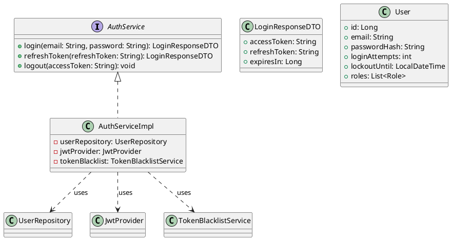
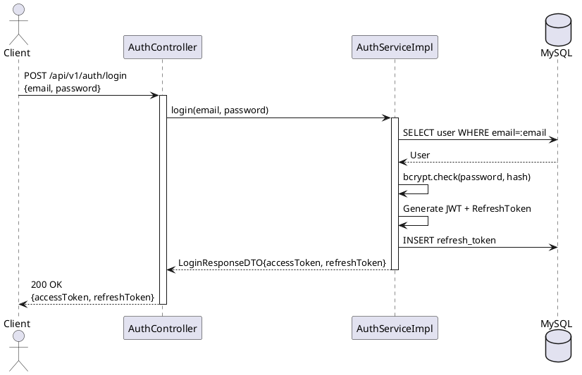
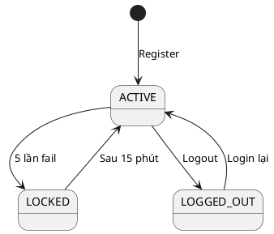

# ENGINEERING DOCUMENTATION STANDARD (EDS) v2.0

## UC01 — Đăng nhập / Đăng xuất (AuthService)

| Field | Value |
|-------|-------|
| **Document ID** | `KAWAI-EDS-MOD1-UC01-001` |
| **Version** | 1.0 |
| **Date** | 2026-06-14 |
| **Status** | Approved |
| **Document Owner** | Nguyễn Xuân Lưu |
| **Author** | Nguyễn Xuân Lưu — Developer |
| **Reviewed by** | Nguyễn Xuân Lưu — Tech Lead |
| **DPO Sign-off** | `[x] Approved – 2026-06-14 – Nguyễn Xuân Lưu` |
| **Approved by** | `[x] Nguyễn Xuân Lưu – 2026-06-14` |
| **Last Review** | 2026-06-14 |
| **Based on EDS** | v2.0 |

---

### CHANGELOG
| Ngày | Người thực hiện | Nội dung thay đổi |
|------|-----------------|-------------------|
| 2026-06-14 | Nguyễn Xuân Lưu | Tạo tài liệu lần đầu |

---

### MỤC LỤC
1. [Tổng quan Module](#1)
2. [Ma trận Truy vết](#2)
3. [ADR](#3)
4. [Non-Functional & SLA](#4)
5. [Static Modeling](#5)
6. [Dynamic Modeling](#6)
7. [Domain Event Catalog](#7)
8. [Interface Specification](#8)
9. [API Specification](#9)
10. [Bảng mã lỗi](#10)
11. [Quy trình Triển khai](#11)
12. [Rollback & Incident Runbook](#12)
13. [Kịch bản Kiểm thử](#13)
14. [Phương pháp Xác minh](#14)
15. [Mẫu thử thực tế](#15)
16. [Authorization Matrix](#16)
17. [Phụ lục](#17)

---

### 1. Tổng quan Module

| Field | Value |
|-------|-------|
| **Module Name** | Đăng nhập / Đăng xuất (UC01) |
| **Bounded Context** | Auth & Identity |
| **Use Case** | UC01: Đăng nhập JWT, refresh token, đăng xuất |
| **Data Classification** | PII (email, password) |
| **Compliance Scope** | Nghị định 13/2023/NĐ-CP |
| **Upstream Dependencies** | — |
| **Downstream Consumers** | Tất cả UC khác (JWT required) |

---

### 2. Ma trận Truy vết

| Requirement ID | Loại | Mô tả | Thành phần Code | Compliance | ADR |
|----------------|------|-------|-----------------|------------|-----|
| UC01.1 | US | Đăng nhập JWT | `AuthService.login()` | Nghị định 13/2023 | ADR-001 |
| UC01.2 | US | Refresh token rotation | `AuthService.refreshToken()` | — | — |
| UC01.3 | US | Logout invalidate | `AuthService.logout()` | — | — |
| BR-AUTH-01 | BR | Lock 15 phút sau 5 lần fail | `AuthService.login()` | — | — |

---

### 3. Architecture Decision Records (ADR)

#### ADR-001 — JWT Authentication Strategy

| Field | Value |
|-------|-------|
| **Status** | Accepted |
| **Deciders** | Nguyễn Xuân Lưu |
| **Date** | 2026-06-09 |

**Bối cảnh:** Cần xác thực người dùng an toàn, hỗ trợ refresh token rotation.

**Quyết định:** JWT RS256 + refresh token rotation + brute-force lock 15 phút.

**Hệ quả:** Token stateless, refresh rotation tăng bảo mật, lockout chống brute-force.

---

### 4. Non-Functional Requirements & SLA

#### 4.1. Performance & Availability

| Category | Requirement | Target SLA | Measurement |
|----------|-------------|------------|-------------|
| **Latency** | Login response (p99) | < 200ms | k6 load test |
| **Availability** | Uptime (monthly) | 99.9% | Uptime monitor |

#### 4.2. Security

| Category | Requirement | Target | Verification |
|----------|-------------|--------|-------------|
| **Encryption** | Password | bcrypt | Unit test |
| **Token** | JWT RS256 | 15 min expiry | Unit test |
| **Brute-force** | Lock 15 phút sau 5 fail | — | Unit test |

---

### 5. Static Modeling

#### 5.1. Class Diagram



#### 5.2. Data Structure

```sql
CREATE TABLE user_account (
    id BIGINT AUTO_INCREMENT PRIMARY KEY,
    email VARCHAR(255) UNIQUE NOT NULL,
    password_hash VARCHAR(255) NOT NULL,
    login_attempts INT DEFAULT 0,
    lockout_until TIMESTAMP NULL,
    created_at TIMESTAMP DEFAULT CURRENT_TIMESTAMP
);

CREATE TABLE refresh_token (
    id BIGINT AUTO_INCREMENT PRIMARY KEY,
    user_id BIGINT NOT NULL,
    token_hash VARCHAR(255) NOT NULL,
    expires_at TIMESTAMP NOT NULL,
    revoked BOOLEAN DEFAULT FALSE,
    FOREIGN KEY (user_id) REFERENCES user_account(id)
);
```

---

### 6. Dynamic Modeling

#### 6.1. Sequence Diagram — Happy Path: Login



#### 6.2. State Machine



---

### 7. Domain Event Catalog

| Event Name | Trigger | Publisher | Subscriber(s) | Async? |
|------------|---------|-----------|---------------|--------|
| `UserLoggedIn` | Login thành công | `AuthService` | `AuditService` | Yes |
| `UserLoggedOut` | Logout | `AuthService` | `AuditService` | Yes |
| `AccountLocked` | 5 lần fail | `AuthService` | `NotificationService` | Yes |

---

### 8. Interface Specification

```java
// AuthService.java
// @version 1.0

public interface AuthService {
    LoginResponseDTO login(String email, String password)
        throws AuthenticationException, AccountLockedException;
    LoginResponseDTO refreshToken(String refreshToken)
        throws InvalidTokenException;
    void logout(String accessToken);
}
```

---

### 9. API Specification

| Method | Path | Auth | Roles | Rate Limit | Idempotent? |
|--------|------|------|-------|------------|-------------|
| POST | `/api/v1/auth/login` | None | All | 10/min | No |
| POST | `/api/v1/auth/refresh` | None | All | 30/min | No |
| POST | `/api/v1/auth/logout` | JWT | All | 30/min | Yes |

**POST `/api/v1/auth/login`**
*Request:* `{"email": "test@gmail.com", "password": "123456"}`
*Response 200:* `{"accessToken": "eyJ...", "refreshToken": "abc...", "expiresIn": 900}`
*Response 401:* `{"error": {"code": "AUTH-002", "message": "Invalid credentials"}}`
*Response 423:* `{"error": {"code": "AUTH-003", "message": "Account locked"}}`

---

### 10. Bảng mã lỗi

| Code | HTTP | Message (EN) | Message (VI) | Trigger |
|------|------|--------------|--------------|---------|
| `AUTH-001` | 401 | Authentication required | Cần xác thực | Thiếu JWT |
| `AUTH-002` | 401 | Invalid credentials | Sai email hoặc password | Sai thông tin |
| `AUTH-003` | 423 | Account locked | Tài khoản bị khóa | 5 lần fail |
| `AUTH-004` | 401 | Token expired | Token hết hạn | JWT hết hạn |
| `AUTH-005` | 401 | Invalid refresh token | Token refresh không hợp lệ | Token sai/hết hạn |

---

### 11. Quy trình Triển khai

#### 11.1. Prerequisites
- [x] Database đã có bảng user_account, refresh_token

#### 11.2. Deployment
```bash
mvn clean package -DskipTests
java -jar target/kawai-backend-1.0.jar --spring.profiles.active=staging
```

#### 11.3. Verification
```bash
curl -X POST http://localhost:8080/api/v1/auth/login \
  -H "Content-Type: application/json" \
  -d '{"email":"test@gmail.com","password":"123456"}'
```

---

### 12. Rollback & Incident Runbook

| Điều kiện | Ngưỡng | Người quyết định |
|-----------|--------|-------------------|
| Login fail liên tục | > 10% trong 5 phút | On-call Engineer |
| JWT không validate | Bất kỳ case nào | Tech Lead |

**Rollback:** `git checkout tags/v1.0.0 && mvn clean package`

---

### 13. Kịch bản Kiểm thử

**[Policy]** Test Data: SYNTHETIC. ❌ KHÔNG dùng Production PII.

#### 13.1. Unit Tests
- TC-UNIT-UC01-001: Login success → JWT + refresh token
- TC-UNIT-UC01-002: Wrong email → 401
- TC-UNIT-UC01-003: Wrong password → 401 + lock after 5
- TC-UNIT-UC01-004: Account locked → 423
- TC-UNIT-UC01-005: Refresh token rotation
- TC-UNIT-UC01-006: Refresh expired → 401
- TC-UNIT-UC01-007: Logout → invalidate

#### 13.2. E2E Tests
- TC-E2E-UC01-001: Login → Refresh → Logout flow

---

### 14. Phương pháp Xác minh

```sql
SELECT id, email, login_attempts, lockout_until FROM user_account WHERE email = :email;
SELECT COUNT(*) FROM refresh_token WHERE user_id = :userId AND revoked = FALSE;
```

---

### 15. Mẫu thử thực tế

```bash
# Login
curl -X POST https://api.kawairesort.com/api/v1/auth/login \
  -H "Content-Type: application/json" \
  -d '{"email":"test@gmail.com","password":"123456"}'

# Refresh
curl -X POST https://api.kawairesort.com/api/v1/auth/refresh \
  -H "Content-Type: application/json" \
  -d '{"refreshToken":"abc..."}'

# Logout
curl -X POST https://api.kawairesort.com/api/v1/auth/logout \
  -H "Authorization: Bearer [JWT]"
```

---

### 16. Authorization Matrix

| Endpoint | GUEST | CUSTOMER | RECEPTIONIST | ADMIN |
|----------|:-----:|:--------:|:------------:|:-----:|
| POST `/api/v1/auth/login` | ✔️ | ✔️ | ✔️ | ✔️ |
| POST `/api/v1/auth/refresh` | ✔️ | ✔️ | ✔️ | ✔️ |
| POST `/api/v1/auth/logout` | ❌ | ✔️ | ✔️ | ✔️ |

---

### PHỤ LỤC

#### A. Glossary
| Thuật ngữ | Định nghĩa |
|-----------|------------|
| **JWT** | JSON Web Token — token xác thực stateless |
| **Refresh Token** | Token dùng để lấy lại access token |
| **Brute-force** | Tấn công thử password liên tiếp |

#### B. Tài liệu tham chiếu
| Document | Path |
|----------|------|
| TDD UC01 | `06-Testing/mod1_auth/uc01/TDD_UC01_SPEC.md` |
| ADR-001 | `06-Testing/MASTER_EDS_SPEC.md` |

---

*EDS v2.0*