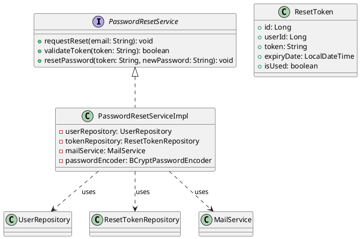
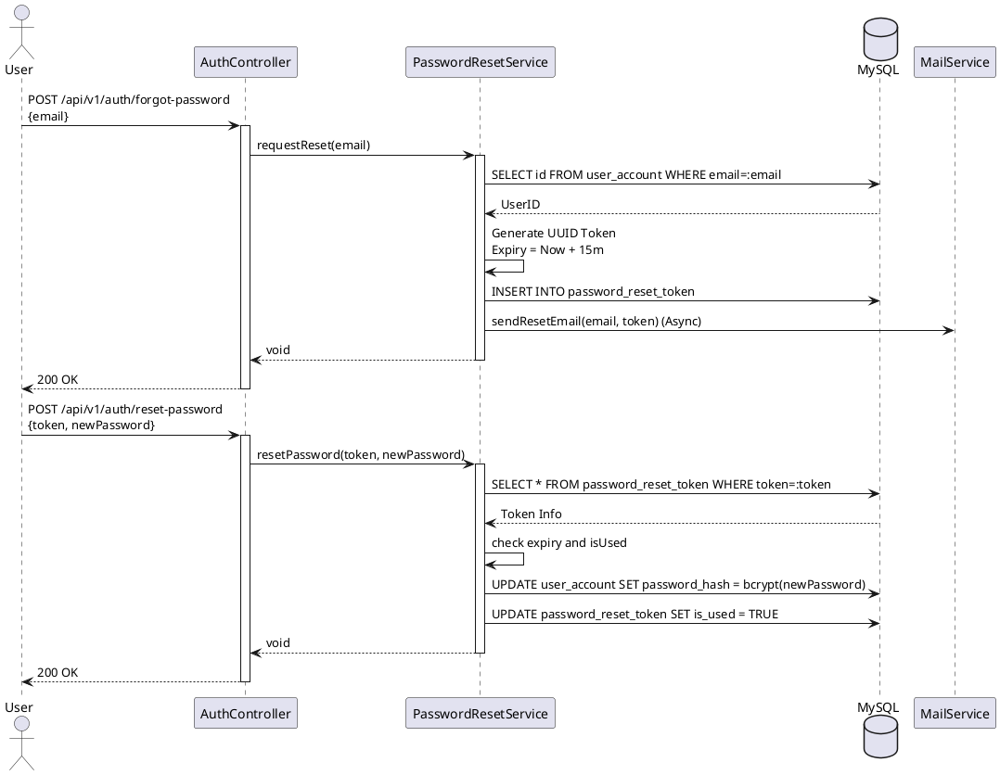
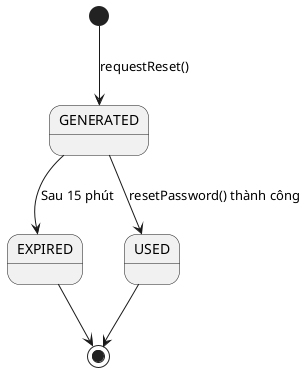

# ENGINEERING DOCUMENTATION STANDARD (EDS) v2.0

## UC02 — Đặt lại mật khẩu (PasswordResetService)

| Field | Value |
|-------|-------|
| **Document ID** | `KAWAI-EDS-MOD1-UC02-001` |
| **Version** | 1.0 |
| **Date** | 2026-06-17 |
| **Status** | Approved |
| **Document Owner** | Nguyễn Xuân Lưu |
| **Author** | Antigravity — System Agent |
| **Reviewed by** | Nguyễn Xuân Lưu — Tech Lead |
| **DPO Sign-off** | `[x] Approved – 2026-06-17 – Nguyễn Xuân Lưu` |
| **Approved by** | `[x] Nguyễn Xuân Lưu – 2026-06-17` |
| **Last Review** | 2026-06-17 |
| **Based on EDS** | v2.0 |

---

### CHANGELOG
| Ngày | Người thực hiện | Nội dung thay đổi |
|------|-----------------|-------------------|
| 2026-06-17 | Antigravity | Cập nhật cấu trúc 17 phần chi tiết theo đúng thiết kế UC02 - Đặt lại mật khẩu qua Email |

---

### MỤC LỤC
1. [Tổng quan Module](#1)
2. [Ma trận Truy vết](#2)
3. [ADR](#3)
4. [Non-Functional & SLA](#4)
5. [Static Modeling](#5)
6. [Dynamic Modeling](#6)
7. [Domain Event Catalog](#7)
8. [Interface Specification](#8)
9. [API Specification](#9)
10. [Bảng mã lỗi](#10)
11. [Quy trình Triển khai](#11)
12. [Rollback & Incident Runbook](#12)
13. [Kịch bản Kiểm thử](#13)
14. [Phương pháp Xác minh](#14)
15. [Mẫu thử thực tế](#15)
16. [Authorization Matrix](#16)
17. [Phụ lục](#17)

---

### 1. Tổng quan Module

| Field | Value |
|-------|-------|
| **Module Name** | Đặt lại mật khẩu (UC02) |
| **Bounded Context** | Auth & Identity |
| **Use Case** | UC02: Quên mật khẩu, sinh Token, gửi Email, Reset Password |
| **Data Classification** | PII (email, password hash) |
| **Compliance Scope** | Nghị định 13/2023/NĐ-CP |
| **Upstream Dependencies** | Mail Service |
| **Downstream Consumers** | Authentication Service |

---

### 2. Ma trận Truy vết

| Requirement ID | Loại | Mô tả | Thành phần Code | Compliance | ADR |
|----------------|------|-------|-----------------|------------|-----|
| UC02.1 | US | Yêu cầu quên mật khẩu | `PasswordResetService.requestReset()` | Nghị định 13/2023 | ADR-002 |
| UC02.2 | US | Validate mã token | `PasswordResetService.validateToken()` | — | — |
| UC02.3 | US | Cập nhật mật khẩu mới | `PasswordResetService.resetPassword()` | — | — |
| BR-PWD-01 | BR | Token hết hạn 15 phút | `PasswordResetService.requestReset()` | — | — |

---

### 3. Architecture Decision Records (ADR)

#### ADR-002 — Password Reset Strategy

| Field | Value |
|-------|-------|
| **Status** | Accepted |
| **Deciders** | Nguyễn Xuân Lưu |
| **Date** | 2026-06-17 |

**Bối cảnh:** Cần cung cấp quy trình an toàn cho người dùng khi quên mật khẩu.
**Quyết định:** Sử dụng UUID cho token, gửi qua email, thời hạn 15 phút. Mật khẩu mới được băm bằng BCrypt (cost = 10).
**Hệ quả:** Tránh brute-force đoán mã token. Cần tích hợp với SMTP Server nội bộ hoặc SendGrid.

---

### 4. Non-Functional Requirements & SLA

#### 4.1. Performance & Availability

| Category | Requirement | Target SLA | Measurement |
|----------|-------------|------------|-------------|
| **Latency** | Request reset (p99) | < 500ms (Async Email) | k6 load test |
| **Availability** | Uptime (monthly) | 99.9% | Uptime monitor |

#### 4.2. Security

| Category | Requirement | Target | Verification |
|----------|-------------|--------|-------------|
| **Encryption** | Password | bcrypt | Unit test |
| **Token** | Expiry | 15 min | Unit test |
| **Rate Limit** | Request reset spam | Max 3 requests / 10 min | Integration test |

---

### 5. Static Modeling

#### 5.1. Class Diagram



#### 5.2. Data Structure

```sql
CREATE TABLE password_reset_token (
    id BIGINT AUTO_INCREMENT PRIMARY KEY,
    user_id BIGINT NOT NULL,
    token VARCHAR(255) NOT NULL UNIQUE,
    expiry_date TIMESTAMP NOT NULL,
    is_used BOOLEAN DEFAULT FALSE,
    FOREIGN KEY (user_id) REFERENCES user_account(id)
);
```

---

### 6. Dynamic Modeling

#### 6.1. Sequence Diagram — Happy Path: Reset Password



#### 6.2. State Machine



---

### 7. Domain Event Catalog

| Event Name | Trigger | Publisher | Subscriber(s) | Async? |
|------------|---------|-----------|---------------|--------|
| `PasswordResetRequested` | User quên mật khẩu | `PasswordResetService` | `MailService`, `AuditService` | Yes |
| `PasswordResetCompleted` | Đổi MK thành công | `PasswordResetService` | `AuditService` | Yes |

---

### 8. Interface Specification

```java
// PasswordResetService.java
// @version 1.0

public interface PasswordResetService {
    void requestReset(String email) throws UserNotFoundException;
    boolean validateToken(String token);
    void resetPassword(String token, String newPassword) 
        throws InvalidTokenException, WeakPasswordException;
}
```

---

### 9. API Specification

| Method | Path | Auth | Roles | Rate Limit | Idempotent? |
|--------|------|------|-------|------------|-------------|
| POST | `/api/v1/auth/forgot-password` | None | All | 3/10min | Yes |
| POST | `/api/v1/auth/reset-password` | None | All | 5/min | No |

**POST `/api/v1/auth/forgot-password`**
*Request:* `{"email": "customer@gmail.com"}`
*Response 200:* `{"message": "If the email exists, a reset link has been sent."}`

**POST `/api/v1/auth/reset-password`**
*Request:* `{"token": "uuid-v4-string", "newPassword": "NewStrongPassword123!"}`
*Response 200:* `{"message": "Password has been successfully reset."}`
*Response 400:* `{"error": {"code": "AUTH-012", "message": "Invalid or expired token"}}`

---

### 10. Bảng mã lỗi

| Code | HTTP | Message (EN) | Message (VI) | Trigger |
|------|------|--------------|--------------|---------|
| `AUTH-011` | 400 | Weak password | Mật khẩu quá yếu | Không đủ 8 ký tự, chữ/số |
| `AUTH-012` | 400 | Invalid or expired token | Token không hợp lệ hoặc đã hết hạn | Sai token hoặc quá 15 phút |
| `AUTH-013` | 429 | Too many requests | Gửi quá nhiều yêu cầu | Spam forgot-password |

---

### 11. Quy trình Triển khai

#### 11.1. Prerequisites
- [x] Database đã có bảng `password_reset_token`
- [x] Cấu hình SMTP server trong `application-prod.yml`

#### 11.2. Deployment
```bash
mvn clean package -DskipTests
java -jar target/kawai-backend-1.0.jar --spring.profiles.active=staging
```

#### 11.3. Verification
```bash
curl -X POST http://localhost:8080/api/v1/auth/forgot-password \
  -H "Content-Type: application/json" \
  -d '{"email":"test@gmail.com"}'
```

---

### 12. Rollback & Incident Runbook

| Điều kiện | Ngưỡng | Người quyết định |
|-----------|--------|-------------------|
| Mail fail liên tục | > 5 lỗi SMTP / phút | On-call Engineer |
| DB Timeout | > 5s cho việc check token | Tech Lead |

**Rollback:** `git checkout tags/v1.0.0 && mvn clean package`

---

### 13. Kịch bản Kiểm thử

**[Policy]** Test Data: SYNTHETIC. ❌ KHÔNG dùng Production PII.

#### 13.1. Unit Tests
- TC-UNIT-UC02-001: Request reset cho email tồn tại -> Sinh token, gọi MailService
- TC-UNIT-UC02-002: Request reset cho email KHÔNG tồn tại -> Im lặng (Bảo mật enum)
- TC-UNIT-UC02-003: Reset password với token hợp lệ -> Đổi MK
- TC-UNIT-UC02-004: Reset password với token quá 15 phút -> Báo lỗi AUTH-012
- TC-UNIT-UC02-005: Reset password mật khẩu yếu -> Báo lỗi AUTH-011

#### 13.2. E2E Tests
- TC-E2E-UC02-001: Quên MK -> Nhận Email -> Click Link -> Đổi MK -> Login lại

---

### 14. Phương pháp Xác minh

```sql
SELECT token, expiry_date, is_used FROM password_reset_token WHERE user_id = :userId;
```

---

### 15. Mẫu thử thực tế

```bash
# Yêu cầu đổi mật khẩu
curl -X POST https://api.kawairesort.com/api/v1/auth/forgot-password \
  -H "Content-Type: application/json" \
  -d '{"email":"test@gmail.com"}'

# Cập nhật mật khẩu mới
curl -X POST https://api.kawairesort.com/api/v1/auth/reset-password \
  -H "Content-Type: application/json" \
  -d '{"token":"550e8400-e29b-41d4-a716-446655440000","newPassword":"MyNewPassword1!"}'
```

---

### 16. Authorization Matrix

| Endpoint | GUEST | CUSTOMER | RECEPTIONIST | ADMIN |
|----------|:-----:|:--------:|:------------:|:-----:|
| POST `/api/v1/auth/forgot-password` | ✔️ | ✔️ | ✔️ | ✔️ |
| POST `/api/v1/auth/reset-password` | ✔️ | ✔️ | ✔️ | ✔️ |

---

### PHỤ LỤC

#### A. Glossary
| Thuật ngữ | Định nghĩa |
|-----------|------------|
| **Token** | Chuỗi UUID sinh ngẫu nhiên dùng 1 lần |
| **SMTP** | Giao thức gửi email |

#### B. Tài liệu tham chiếu
| Document | Path |
|----------|------|
| TDD UC02 | `06-Testing/mod1_auth/uc02/TDD_UC02_SPEC.md` |
| SRS Detail | `02-Requirement/UC_DETAIL_SPEC.md` |

---

*EDS v2.0*