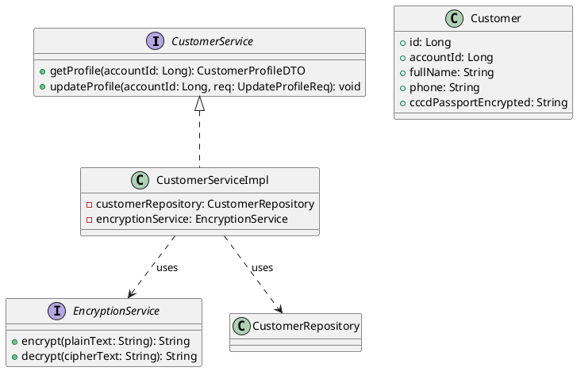
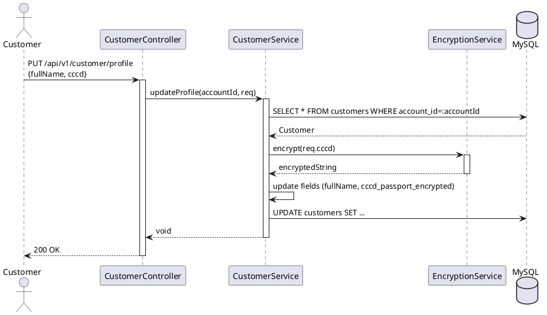

# ENGINEERING DOCUMENTATION STANDARD (EDS) v2.0

## UC03 — Quản lý hồ sơ cá nhân & Mã hóa giấy tờ định danh

| Field | Value |
|-------|-------|
| **Document ID** | `KAWAI-EDS-MOD1-UC03-001` |
| **Version** | 1.0 |
| **Date** | 2026-06-17 |
| **Status** | Approved |
| **Document Owner** | Nguyễn Xuân Lưu |
| **Author** | Antigravity — System Agent |
| **Reviewed by** | Nguyễn Xuân Lưu — Tech Lead |
| **DPO Sign-off** | `[x] Approved – 2026-06-17 – Nguyễn Xuân Lưu` |
| **Approved by** | `[x] Nguyễn Xuân Lưu – 2026-06-17` |
| **Last Review** | 2026-06-17 |
| **Based on EDS** | v2.0 |

---

### CHANGELOG
| Ngày | Người thực hiện | Nội dung thay đổi |
|------|-----------------|-------------------|
| 2026-06-17 | Antigravity | Cập nhật cấu trúc 17 phần cho UC03 (Quản lý hồ sơ & mã hóa AES-256) |

---

### MỤC LỤC
1. [Tổng quan Module](#1)
2. [Ma trận Truy vết](#2)
3. [ADR](#3)
4. [Non-Functional & SLA](#4)
5. [Static Modeling](#5)
6. [Dynamic Modeling](#6)
7. [Domain Event Catalog](#7)
8. [Interface Specification](#8)
9. [API Specification](#9)
10. [Bảng mã lỗi](#10)
11. [Quy trình Triển khai](#11)
12. [Rollback & Incident Runbook](#12)
13. [Kịch bản Kiểm thử](#13)
14. [Phương pháp Xác minh](#14)
15. [Mẫu thử thực tế](#15)
16. [Authorization Matrix](#16)
17. [Phụ lục](#17)

---

### 1. Tổng quan Module

| Field | Value |
|-------|-------|
| **Module Name** | Quản lý hồ sơ cá nhân (UC03) |
| **Bounded Context** | Customer Identity |
| **Use Case** | UC03: Cập nhật hồ sơ, mã hóa AES-256 cho CCCD/Passport |
| **Data Classification** | PII (CCCD, Passport, số điện thoại) |
| **Compliance Scope** | Nghị định 13/2023/NĐ-CP (Bảo vệ dữ liệu cá nhân) |
| **Upstream Dependencies** | Auth Service |
| **Downstream Consumers** | Lễ tân (Front Desk), Đặt phòng |

---

### 2. Ma trận Truy vết

| Requirement ID | Loại | Mô tả | Thành phần Code | Compliance | ADR |
|----------------|------|-------|-----------------|------------|-----|
| UC03.1 | US | Xem thông tin hồ sơ | `CustomerService.getProfile()` | — | — |
| UC03.2 | US | Sửa thông tin cá nhân | `CustomerService.updateProfile()` | — | — |
| UC03.3 | US | Cập nhật CCCD mã hóa | `EncryptionService.encrypt()` | Nghị định 13/2023 | ADR-003 |

---

### 3. Architecture Decision Records (ADR)

#### ADR-003 — PII Encryption at Rest

| Field | Value |
|-------|-------|
| **Status** | Accepted |
| **Deciders** | Nguyễn Xuân Lưu |
| **Date** | 2026-06-17 |

**Bối cảnh:** Theo NĐ 13/2023, giấy tờ định danh (CCCD/Passport) là dữ liệu nhạy cảm cao, không được lưu plain-text trong CSDL đề phòng rò rỉ (Data breach).
**Quyết định:** Sử dụng thuật toán AES-256 (Advanced Encryption Standard) với khóa bí mật lưu trong biến môi trường (Environment Variable) để mã hóa hai chiều cột `cccd_passport_encrypted`.
**Hệ quả:** Dữ liệu an toàn, nhưng không thể dùng truy vấn `LIKE` trên DB cho CCCD. Phải thiết kế masking khi trả API.

---

### 4. Non-Functional Requirements & SLA

#### 4.1. Performance & Availability

| Category | Requirement | Target SLA | Measurement |
|----------|-------------|------------|-------------|
| **Latency** | Profile update (p99) | < 300ms | k6 load test |
| **Availability** | Uptime (monthly) | 99.9% | Uptime monitor |

#### 4.2. Security

| Category | Requirement | Target | Verification |
|----------|-------------|--------|-------------|
| **Encryption** | Thuật toán | AES-256/GCM | Unit test |
| **Masking** | Hiển thị CCCD | `***` ẩn số đầu/giữa | Unit test |

---

### 5. Static Modeling

#### 5.1. Class Diagram



#### 5.2. Data Structure

```sql
CREATE TABLE customers (
    id BIGINT AUTO_INCREMENT PRIMARY KEY,
    account_id BIGINT UNIQUE NOT NULL,
    full_name VARCHAR(100) NOT NULL,
    phone VARCHAR(20),
    cccd_passport_encrypted VARCHAR(500),
    created_at TIMESTAMP DEFAULT CURRENT_TIMESTAMP,
    updated_at TIMESTAMP DEFAULT CURRENT_TIMESTAMP ON UPDATE CURRENT_TIMESTAMP,
    FOREIGN KEY (account_id) REFERENCES user_account(id)
);
```

---

### 6. Dynamic Modeling

#### 6.1. Sequence Diagram — Happy Path: Update Profile with CCCD



#### 6.2. State Machine

*(Không có State Machine phức tạp cho Profile)*

---

### 7. Domain Event Catalog

| Event Name | Trigger | Publisher | Subscriber(s) | Async? |
|------------|---------|-----------|---------------|--------|
| `ProfileUpdated` | Cập nhật hồ sơ | `CustomerService` | `AuditService` | Yes |

---

### 8. Interface Specification

```java
// CustomerService.java
// @version 1.0

public interface CustomerService {
    CustomerProfileDTO getProfile(Long accountId) throws ResourceNotFoundException;
    void updateProfile(Long accountId, UpdateProfileReq req) throws ValidationException;
}
```

---

### 9. API Specification

| Method | Path | Auth | Roles | Rate Limit | Idempotent? |
|--------|------|------|-------|------------|-------------|
| GET | `/api/v1/customer/profile` | JWT | CUSTOMER | 30/min | Yes |
| PUT | `/api/v1/customer/profile` | JWT | CUSTOMER | 10/min | No |

**GET `/api/v1/customer/profile`**
*Response 200:* `{"fullName": "Nguyen Van A", "phone": "0901234567", "cccd": "0010********56"}`
*(Lưu ý: API tự động decrypt trong code và mask dữ liệu khi trả về Frontend)*

**PUT `/api/v1/customer/profile`**
*Request:* `{"fullName": "Nguyen Van A", "phone": "0901234567", "cccd": "001012345678"}`
*Response 200:* `{"message": "Profile updated successfully"}`

---

### 10. Bảng mã lỗi

| Code | HTTP | Message (EN) | Message (VI) | Trigger |
|------|------|--------------|--------------|---------|
| `CUST-001` | 400 | Invalid ID format | Định dạng CCCD không đúng | CCCD không phải 9 hoặc 12 số |
| `CUST-002` | 400 | Invalid phone | Số điện thoại không đúng | RegEx phone fail |

---

### 11. Quy trình Triển khai

#### 11.1. Prerequisites
- [x] Khai báo `AES_SECRET_KEY` trong môi trường sản xuất (Docker / K8s).

#### 11.2. Deployment
```bash
mvn clean package -DskipTests
java -jar target/kawai-backend-1.0.jar --spring.profiles.active=staging
```

---

### 12. Rollback & Incident Runbook

| Điều kiện | Ngưỡng | Người quyết định |
|-----------|--------|-------------------|
| Encryption/Decryption Fail | Bất kỳ | Tech Lead |

**Rollback:** Đảm bảo `AES_SECRET_KEY` không bị đổi so với phiên bản cũ, nếu bị mất key thì toàn bộ CCCD sẽ không thể khôi phục.

---

### 13. Kịch bản Kiểm thử

**[Policy]** Test Data: SYNTHETIC. ❌ KHÔNG dùng Production PII.

#### 13.1. Unit Tests
- TC-UNIT-UC03-001: Encrypt và Decrypt phải ra kết quả ban đầu (Symmetric).
- TC-UNIT-UC03-002: Đọc Profile tự động giải mã và Masking (ẩn đi 8 số).
- TC-UNIT-UC03-003: Cập nhật thông tin lưu dạng mã hóa xuống Mock DB.

#### 13.2. E2E Tests
- TC-E2E-UC03-001: Login -> PUT Profile -> Database check chuỗi 암호 hóa -> GET Profile check Masked.

---

### 14. Phương pháp Xác minh

```sql
-- Dữ liệu hiển thị trong DB phải là chuỗi byte mã hóa (nhìn không hiểu)
SELECT cccd_passport_encrypted FROM customers WHERE account_id = :accountId;
```

---

### 15. Mẫu thử thực tế

```bash
# Update profile
curl -X PUT https://api.kawairesort.com/api/v1/customer/profile \
  -H "Authorization: Bearer [JWT]" \
  -H "Content-Type: application/json" \
  -d '{"fullName":"Tran Thi B","cccd":"001099887766","phone":"0987654321"}'
```

---

### 16. Authorization Matrix

| Endpoint | GUEST | CUSTOMER | RECEPTIONIST | ADMIN |
|----------|:-----:|:--------:|:------------:|:-----:|
| GET `/api/v1/customer/profile` | ❌ | Own | ❌ | ❌ |
| PUT `/api/v1/customer/profile` | ❌ | Own | ❌ | ❌ |

*(Lễ tân cần lấy CCCD thì qua API của Front Desk)*

---

### PHỤ LỤC

#### A. Glossary
| Thuật ngữ | Định nghĩa |
|-----------|------------|
| **AES-256** | Chuẩn mã hóa dữ liệu cao cấp |
| **Masking** | Che giấu một phần dữ liệu nhạy cảm khi hiển thị |

#### B. Tài liệu tham chiếu
| Document | Path |
|----------|------|
| TDD UC03 | `06-Testing/mod1_auth/uc03/TDD_UC03_SPEC.md` |

---

*EDS v2.0*
