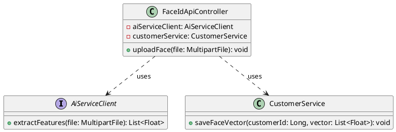
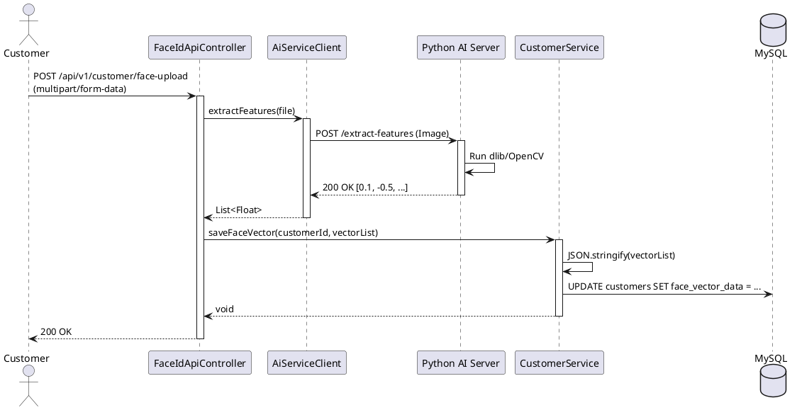

# ENGINEERING DOCUMENTATION STANDARD (EDS) v2.0

## UC04 — Đăng tải & Trích xuất dữ liệu khuôn mặt FaceID

| Field | Value |
|-------|-------|
| **Document ID** | `KAWAI-EDS-MOD1-UC04-001` |
| **Version** | 1.0 |
| **Date** | 2026-06-17 |
| **Status** | Approved |
| **Document Owner** | Nguyễn Xuân Lưu |
| **Author** | Antigravity — System Agent |
| **Reviewed by** | Nguyễn Xuân Lưu — Tech Lead |
| **DPO Sign-off** | `[x] Approved – 2026-06-17 – Nguyễn Xuân Lưu` |
| **Approved by** | `[x] Nguyễn Xuân Lưu – 2026-06-17` |
| **Last Review** | 2026-06-17 |
| **Based on EDS** | v2.0 |

---

### CHANGELOG
| Ngày | Người thực hiện | Nội dung thay đổi |
|------|-----------------|-------------------|
| 2026-06-17 | Antigravity | Cập nhật cấu trúc 17 phần cho UC04 FaceID |

---

### MỤC LỤC
1. [Tổng quan Module](#1)
2. [Ma trận Truy vết](#2)
3. [ADR](#3)
4. [Non-Functional & SLA](#4)
5. [Static Modeling](#5)
6. [Dynamic Modeling](#6)
7. [Domain Event Catalog](#7)
8. [Interface Specification](#8)
9. [API Specification](#9)
10. [Bảng mã lỗi](#10)
11. [Quy trình Triển khai](#11)
12. [Rollback & Incident Runbook](#12)
13. [Kịch bản Kiểm thử](#13)
14. [Phương pháp Xác minh](#14)
15. [Mẫu thử thực tế](#15)
16. [Authorization Matrix](#16)
17. [Phụ lục](#17)

---

### 1. Tổng quan Module

| Field | Value |
|-------|-------|
| **Module Name** | Đăng tải FaceID (UC04) |
| **Bounded Context** | Face Recognition |
| **Use Case** | UC04: Khách/Lễ tân tải ảnh, trích xuất Vector qua AI Service |
| **Data Classification** | Biometric Data (PII Cấp độ cao) |
| **Compliance Scope** | Nghị định 13/2023/NĐ-CP (Bảo mật sinh trắc học) |
| **Upstream Dependencies** | `kawai-ai-service` (Python/FastAPI) |
| **Downstream Consumers** | Hệ thống Check-in điểm danh Tour (MOD4) |

---

### 2. Ma trận Truy vết

| Requirement ID | Loại | Mô tả | Thành phần Code | Compliance | ADR |
|----------------|------|-------|-----------------|------------|-----|
| UC04.1 | US | Đăng tải ảnh chân dung | `FaceIdApiController.uploadFace()` | NĐ 13/2023 | ADR-004 |
| UC04.2 | US | Gọi AI trích xuất Vector | `AiServiceClient.extractFeatures()` | — | — |
| UC04.3 | US | Lưu chuỗi JSON 128 số | `CustomerService.saveFaceVector()` | — | — |

---

### 3. Architecture Decision Records (ADR)

#### ADR-004 — Face Recognition Integration Strategy

| Field | Value |
|-------|-------|
| **Status** | Accepted |
| **Deciders** | Nguyễn Xuân Lưu |
| **Date** | 2026-06-17 |

**Bối cảnh:** Cần xử lý ảnh bằng các thư viện AI (dlib, OpenCV) vốn chạy tốt nhất trên Python, nhưng backend chính là Java Spring Boot.
**Quyết định:** Viết một AI Microservice độc lập bằng Python (FastAPI). Java Backend sẽ gọi REST API chuyển ảnh sang Python lấy kết quả mảng Vector 128 số. Không lưu trữ ảnh gốc trên DB (để tuân thủ GDPR/PII), chỉ lưu mảng số JSON.
**Hệ quả:** Tăng độ phức tạp khi deploy (cần 2 container), độ trễ call qua lại. Nhưng giúp tách bạch nghiệp vụ và dễ mở rộng.

---

### 4. Non-Functional Requirements & SLA

#### 4.1. Performance & Availability

| Category | Requirement | Target SLA | Measurement |
|----------|-------------|------------|-------------|
| **Latency** | Upload & Extract | < 3000ms | Load test (AI delay) |
| **Availability** | Uptime AI Service | 99% | Uptime monitor |

#### 4.2. Security

| Category | Requirement | Target | Verification |
|----------|-------------|--------|-------------|
| **Storage** | Ảnh gốc | Không lưu DB | Code Review |
| **Data Format** | Vector | JSON String | Unit test |

---

### 5. Static Modeling

#### 5.1. Class Diagram



#### 5.2. Data Structure

```sql
-- Cập nhật bảng customers
ALTER TABLE customers ADD COLUMN face_vector_data TEXT;
```

---

### 6. Dynamic Modeling

#### 6.1. Sequence Diagram — Happy Path: Upload Face



#### 6.2. State Machine

*(Không có State Machine phức tạp)*

---

### 7. Domain Event Catalog

| Event Name | Trigger | Publisher | Subscriber(s) | Async? |
|------------|---------|-----------|---------------|--------|
| `FaceDataRegistered` | Vector lưu thành công | `CustomerService` | `AuditService` | Yes |

---

### 8. Interface Specification

```java
// AiServiceClient.java
public interface AiServiceClient {
    List<Float> extractFeatures(MultipartFile file) throws AiServiceException, NoFaceDetectedException;
}
```

---

### 9. API Specification

| Method | Path | Auth | Roles | Rate Limit | Idempotent? |
|--------|------|------|-------|------------|-------------|
| POST | `/api/v1/customer/face-upload` | JWT | CUSTOMER, RECEPTIONIST | 5/min | No |

**POST `/api/v1/customer/face-upload`**
*Request:* Form-data chứa `file` (Ảnh JPG/PNG < 5MB).
*Response 200:* `{"message": "Face data registered successfully."}`
*Response 400:* `{"error": {"code": "FACE-001", "message": "No face detected in the image"}}`

---

### 10. Bảng mã lỗi

| Code | HTTP | Message (EN) | Message (VI) | Trigger |
|------|------|--------------|--------------|---------|
| `FACE-001` | 400 | No face detected | Không phát hiện khuôn mặt | Python service báo lỗi |
| `FACE-002` | 400 | Multiple faces detected | Phát hiện nhiều khuôn mặt | Khách up ảnh nhóm |
| `FACE-003` | 503 | AI Service unavailable | Dịch vụ nhận diện bận | Không gọi được Python |

---

### 11. Quy trình Triển khai

#### 11.1. Prerequisites
- [x] Triển khai thành công `kawai-ai-service` tại cổng 8000.
- [x] Config URL `ai.service.url=http://localhost:8000` trong `application.yml`.

#### 11.2. Deployment
```bash
# Backend Java
mvn clean package -DskipTests
java -jar target/kawai-backend-1.0.jar
```

---

### 12. Rollback & Incident Runbook

| Điều kiện | Ngưỡng | Người quyết định |
|-----------|--------|-------------------|
| Python Service sập | Timeout liên tục | On-call Engineer |

**Rollback:** Disable API Face Upload, hệ thống sẽ tự fallback về check-in tay ở MOD4.

---

### 13. Kịch bản Kiểm thử

#### 13.1. Unit Tests
- TC-UNIT-UC04-001: Extract success -> Trả về array 128 số.
- TC-UNIT-UC04-002: Lỗi No Face -> Bắn NoFaceDetectedException.
- TC-UNIT-UC04-003: Lưu array Float -> Convert JSON chuỗi dài.

#### 13.2. E2E Tests
- TC-E2E-UC04-001: Upload ảnh -> Call Python Mock -> DB cập nhật JSON.

---

### 14. Phương pháp Xác minh

```sql
SELECT face_vector_data FROM customers WHERE id = :customerId;
-- Kết quả mong đợi: Chuỗi '[0.0123, -0.456, ...]'
```

---

### 15. Mẫu thử thực tế

```bash
curl -X POST https://api.kawairesort.com/api/v1/customer/face-upload \
  -H "Authorization: Bearer [JWT]" \
  -F "file=@/path/to/my_face.jpg"
```

---

### 16. Authorization Matrix

| Endpoint | GUEST | CUSTOMER | RECEPTIONIST | ADMIN |
|----------|:-----:|:--------:|:------------:|:-----:|
| POST `/face-upload` | ❌ | Own | ✔️ (Hỗ trợ khách) | ❌ |

---

### PHỤ LỤC

#### A. Glossary
| Thuật ngữ | Định nghĩa |
|-----------|------------|
| **Vector** | Mảng số đại diện cho các điểm nút trên khuôn mặt |
| **FastAPI** | Framework Python chạy AI backend |

#### B. Tài liệu tham chiếu
| Document | Path |
|----------|------|
| TDD UC04 | `06-Testing/mod1_auth/uc04/TDD_UC04_SPEC.md` |

---
*EDS v2.0*
