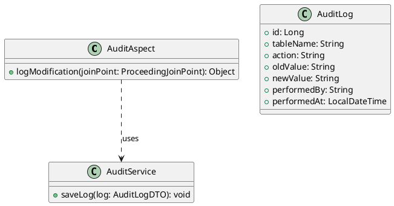
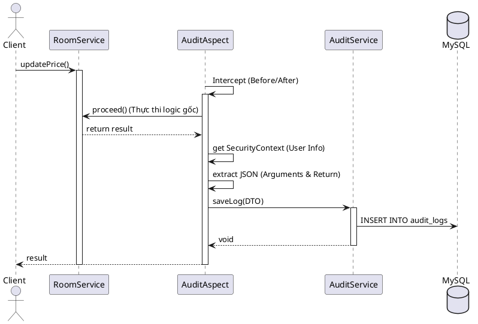

# ENGINEERING DOCUMENTATION STANDARD (EDS) v2.0

## UC05 — Phân quyền & Kiểm soát an ninh nội bộ (Audit Log)

| Field | Value |
|-------|-------|
| **Document ID** | `KAWAI-EDS-MOD1-UC05-001` |
| **Version** | 1.0 |
| **Date** | 2026-06-17 |
| **Status** | Approved |
| **Document Owner** | Nguyễn Xuân Lưu |
| **Author** | Antigravity — System Agent |
| **Reviewed by** | Nguyễn Xuân Lưu — Tech Lead |
| **DPO Sign-off** | `[x] Approved – 2026-06-17` |
| **Approved by** | `[x] Nguyễn Xuân Lưu` |
| **Last Review** | 2026-06-17 |
| **Based on EDS** | v2.0 |

---

### CHANGELOG
| Ngày | Người thực hiện | Nội dung thay đổi |
|------|-----------------|-------------------|
| 2026-06-17 | Antigravity | Cập nhật cấu trúc 17 phần chi tiết cho UC05 RBAC & Audit Logs, bổ sung section 14-17 |

---

### MỤC LỤC
1. [Tổng quan Module](#1)
2. [Ma trận Truy vết](#2)
3. [ADR](#3)
4. [Non-Functional & SLA](#4)
5. [Static Modeling](#5)
6. [Dynamic Modeling](#6)
7. [Domain Event Catalog](#7)
8. [Interface Specification](#8)
9. [API Specification](#9)
10. [Bảng mã lỗi](#10)
11. [Quy trình Triển khai](#11)
12. [Rollback & Incident Runbook](#12)
13. [Kịch bản Kiểm thử](#13)
14. [Phương pháp Xác minh](#14)
15. [Mẫu thử thực tế](#15)
16. [Authorization Matrix](#16)
17. [Phụ lục](#17)

---

### 1. Tổng quan Module

| Field | Value |
|-------|-------|
| **Module Name** | RBAC & Audit (UC05) |
| **Bounded Context** | Security Core |
| **Use Case** | UC05.1 Quản lý RBAC, UC05.2 Audit Log |
| **Data Classification** | System Confidential |
| **Compliance Scope** | Tiêu chuẩn an toàn thông tin ISMS |
| **Upstream Dependencies** | Toàn bộ các Service (AOP target) |
| **Downstream Consumers** | Admin Dashboard |

---

### 2. Ma trận Truy vết

| Requirement ID | Loại | Mô tả | Thành phần Code | Compliance | ADR |
|----------------|------|-------|-----------------|------------|-----|
| UC05.1 | US | Gán quyền nhân sự | `EmployeeService.assignRole()` | — | — |
| UC05.2 | US | Lưu Log tự động | `AuditAspect.logModification()` | ISMS | ADR-005 |
| BR-AUDIT-01 | BR | Không sửa/xóa log | `AuditRepository` chặn `save()` lên đối tượng có sẵn | — | — |

---

### 3. Architecture Decision Records (ADR)

#### ADR-005 — System Audit Trail Strategy

| Field | Value |
|-------|-------|
| **Status** | Accepted |
| **Deciders** | Nguyễn Xuân Lưu |
| **Date** | 2026-06-17 |

**Bối cảnh:** Cần ghi vết mọi thay đổi dữ liệu nhạy cảm (đổi giá, sửa folio, hủy đơn) chống gian lận nội bộ.
**Quyết định:** Sử dụng Spring AOP (`@Aspect` + `@Loggable` annotation) để intercept các lời gọi hàm ghi dữ liệu (INSERT/UPDATE/DELETE). Lấy thông tin user hiện tại từ `SecurityContextHolder`, bóc tách arguments, serialize JSON và đẩy vào CSDL.
**Hệ quả:** Dễ dàng gắn vào bất kỳ Service nào mà không cần sửa code cũ, nhưng có thể tăng nhẹ độ trễ ghi (overhead 10-20ms).

---

### 4. Non-Functional Requirements & SLA

| Category | Target SLA |
|----------|------------|
| **Overhead** | AOP logging time < 20ms |
| **Security** | Bảng `audit_logs` chặn UPDATE/DELETE bằng DB Trigger |

---

### 5. Static Modeling

#### 5.1. Class Diagram



#### 5.2. Data Structure

```sql
CREATE TABLE audit_logs (
    id BIGINT AUTO_INCREMENT PRIMARY KEY,
    table_name VARCHAR(100),
    action VARCHAR(20), -- INSERT, UPDATE, DELETE
    old_value JSON,
    new_value JSON,
    performed_by VARCHAR(100),
    performed_at TIMESTAMP DEFAULT CURRENT_TIMESTAMP
);

-- Trigger chặn sửa xóa log
CREATE TRIGGER prevent_audit_update BEFORE UPDATE ON audit_logs FOR EACH ROW SIGNAL SQLSTATE '45000' SET MESSAGE_TEXT = 'Cập nhật bị cấm trên bảng audit_logs';
CREATE TRIGGER prevent_audit_delete BEFORE DELETE ON audit_logs FOR EACH ROW SIGNAL SQLSTATE '45000' SET MESSAGE_TEXT = 'Xóa bị cấm trên bảng audit_logs';
```

---

### 6. Dynamic Modeling

#### 6.1. Sequence Diagram: AOP Intercept
Khi Client gọi hàm `RoomService.updatePrice()` được đánh dấu `@Loggable`:



---

### 7. Domain Event Catalog

| Event Name | Trigger | Publisher | Subscriber(s) | Async? |
|------------|---------|-----------|---------------|--------|
| `RoleAssigned` | Đổi quyền nhân viên | `EmployeeService` | `AuditService` | Yes |
| `SystemAudited` | Hành động nhạy cảm | `AuditAspect` | `MonitorService` | Yes |

---

### 8. Interface Specification

```java
// AuditService.java
public interface AuditService {
    void log(String action, String target, String diff, String actor);
    List<AuditLogDTO> getLogs(int page, int size);
}

// EmployeeService.java
public interface EmployeeService {
    void assignRole(Long employeeId, List<Long> roleIds);
}
```

---

### 9. API Specification

| Method | Path | Auth | Roles | Rate Limit | Idempotent? |
|--------|------|------|-------|------------|-------------|
| GET | `/api/v1/admin/audit-logs` | JWT | ADMIN | 100/min | Yes |
| PUT | `/api/v1/admin/employees/{id}/roles` | JWT | ADMIN | 20/min | No |

**GET `/api/v1/admin/audit-logs`**
*Request:* Query param `?page=0&size=20`
*Response 200:* `{"content": [{"id": 1, "action": "UPDATE", "tableName": "rooms", ...}], "totalElements": 1}`

**PUT `/api/v1/admin/employees/{id}/roles`**
*Request:* `{"roleIds": [3]}`
*Response 200:* `{"message": "Role assigned successfully."}`

---

### 10. Bảng mã lỗi

| Code | HTTP | Message (EN) | Message (VI) | Trigger |
|------|------|--------------|--------------|---------|
| `SEC-001` | 403 | Access Denied | Không có quyền truy cập | Caller thiếu Role tương ứng |
| `SEC-002` | 400 | Invalid Role | Role không hợp lệ | ID của role truyền vào không tồn tại |
| `AUD-001` | 500 | Audit Failed | Lỗi ghi nhật ký hệ thống | Trigger cản trở lưu db do vi phạm |

---

### 11. Quy trình Triển khai

#### 11.1. Prerequisites
- [x] Đã cấu hình và tạo bảng `audit_logs` với 2 triggers chặn sửa xóa.
- [x] Kích hoạt cấu hình `@EnableAspectJAutoProxy` trên class Config.

#### 11.2. Deployment
```bash
mvn clean package -DskipTests
java -jar target/kawai-backend-1.0.jar --spring.profiles.active=staging
```

---

### 12. Rollback & Incident Runbook

| Điều kiện | Ngưỡng | Người quyết định |
|-----------|--------|-------------------|
| AOP làm chậm hệ thống | API Request > 2000ms | On-call Engineer |

**Rollback:** Đổi flag `kawai.audit.enabled=false` trong `application-prod.yml` và khởi động lại dịch vụ nếu gặp sự cố nghiêm trọng do Aspect gây ra memory leak.

---

### 13. Kịch bản Kiểm thử

**[Policy]** Test Data: SYNTHETIC. ❌ KHÔNG dùng Production PII.

#### 13.1. Unit Tests
- TC-UNIT-UC05-001: Gọi hàm `@Loggable` -> Assert DB sinh đúng 1 bản ghi `audit_logs` với giá trị tương ứng.
- TC-UNIT-UC05-002: Thử xóa bản ghi trong `audit_logs` bằng `repository.delete()` -> JPA bắn `DataIntegrityViolationException`.
- TC-UNIT-UC05-003: Lễ tân gọi API Admin -> Bắn `AccessDeniedException`.

#### 13.2. E2E Tests
- TC-E2E-UC05-001: Admin login -> Gán quyền Bếp cho Employee -> Lấy token Employee -> Thử gọi API KDS Bếp (Thành công).

---

### 14. Phương pháp Xác minh

**Xác minh Audit Trail:**
```sql
-- Đảm bảo trigger chặn Update hoạt động
UPDATE audit_logs SET action = 'SAFE_ACTION' WHERE id = 1;
-- KẾT QUẢ KỲ VỌNG: Error Code 1644: Cập nhật bị cấm trên bảng audit_logs

-- Kiểm tra nhật ký gần đây
SELECT id, action, performed_by, performed_at FROM audit_logs ORDER BY performed_at DESC LIMIT 10;
```

---

### 15. Mẫu thử thực tế

**Lấy danh sách Audit Log:**
```bash
curl -X GET "https://api.kawairesort.com/api/v1/admin/audit-logs?page=0&size=10" \
  -H "Authorization: Bearer [ADMIN_JWT]"
```

**Cấp quyền cho Nhân viên:**
```bash
curl -X PUT https://api.kawairesort.com/api/v1/admin/employees/5/roles \
  -H "Authorization: Bearer [ADMIN_JWT]" \
  -H "Content-Type: application/json" \
  -d '{"roleIds": [2, 3]}'
```

---

### 16. Authorization Matrix

| Endpoint | GUEST | CUSTOMER | RECEPTIONIST | KITCHEN STAFF | ADMIN |
|----------|:-----:|:--------:|:------------:|:-------------:|:-----:|
| GET `/api/v1/admin/audit-logs` | ❌ | ❌ | ❌ | ❌ | ✔️ |
| PUT `/api/v1/admin/employees/*/roles` | ❌ | ❌ | ❌ | ❌ | ✔️ |

*(Mọi Endpoint được đánh dấu Role `ADMIN` đều bị chặn cứng với các role khác bởi Spring Security Method Security `@PreAuthorize("hasAuthority('ADMIN')")`)*

---

### 17. Phụ lục

#### A. Glossary
| Thuật ngữ | Định nghĩa |
|-----------|------------|
| **RBAC** | Role-Based Access Control (Kiểm soát truy cập dựa trên vai trò) |
| **AOP** | Aspect-Oriented Programming (Lập trình hướng khía cạnh) |
| **ISMS** | Information Security Management System (Hệ thống QL ATTT) |

#### B. Tài liệu tham chiếu
| Document | Path |
|----------|------|
| TDD UC05 | `06-Testing/mod1_auth/uc05/TDD_UC05_SPEC.md` |
| Bảng Use Case | `02-Requirement/UC_MASTER_TABLE.md` |

---
*EDS v2.0*
