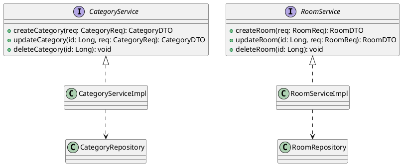
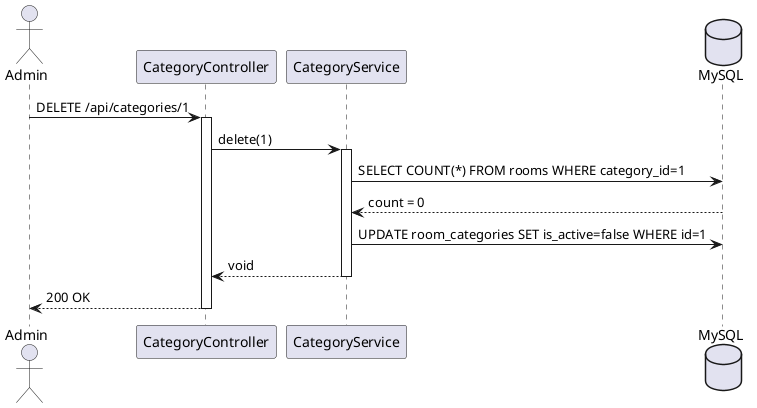

# ENGINEERING DOCUMENTATION STANDARD (EDS) v2.0

## UC06 — Quản lý Dữ liệu nền Hạng phòng & Phòng vật lý

| Field | Value |
|-------|-------|
| **Document ID** | `KAWAI-EDS-MOD1-UC06-001` |
| **Version** | 1.0 |
| **Date** | 2026-06-17 |
| **Status** | Approved |
| **Document Owner** | Nguyễn Xuân Lưu |
| **Author** | Antigravity — System Agent |
| **Reviewed by** | Nguyễn Xuân Lưu — Tech Lead |
| **DPO Sign-off** | `[x] Approved – 2026-06-17` |
| **Approved by** | `[x] Nguyễn Xuân Lưu` |
| **Last Review** | 2026-06-17 |
| **Based on EDS** | v2.0 |

---

### CHANGELOG
| Ngày | Người thực hiện | Nội dung thay đổi |
|------|-----------------|-------------------|
| 2026-06-17 | Antigravity | Cập nhật cấu trúc 17 phần cho UC06 CRUD Hạng phòng & Phòng |

---

### MỤC LỤC
1. [Tổng quan Module](#1)
2. [Ma trận Truy vết](#2)
3. [ADR](#3)
4. [Non-Functional & SLA](#4)
5. [Static Modeling](#5)
6. [Dynamic Modeling](#6)
7. [Domain Event Catalog](#7)
8. [Interface Specification](#8)
9. [API Specification](#9)
10. [Bảng mã lỗi](#10)
11. [Quy trình Triển khai](#11)
12. [Rollback & Incident Runbook](#12)
13. [Kịch bản Kiểm thử](#13)
14. [Phương pháp Xác minh](#14)
15. [Mẫu thử thực tế](#15)
16. [Authorization Matrix](#16)
17. [Phụ lục](#17)

---

### 1. Tổng quan Module

| Field | Value |
|-------|-------|
| **Module Name** | Cấu hình dữ liệu nền (UC06) |
| **Bounded Context** | Core Data |
| **Use Case** | UC06.1 CRUD Hạng phòng ảo, UC06.2 CRUD Phòng vật lý |
| **Data Classification** | Internal Public |
| **Upstream Dependencies** | RBAC/Admin Auth |
| **Downstream Consumers** | Tìm kiếm phòng, Booking, Dashboard sơ đồ |

---

### 2. Ma trận Truy vết

| Requirement ID | Loại | Mô tả | Thành phần Code |
|----------------|------|-------|-----------------|
| UC06.1 | US | Quản lý `Room_Categories` | `CategoryService.createCategory()` |
| UC06.2 | US | Quản lý `Rooms` vật lý | `RoomService.createRoom()` |
| BR-DEL-01 | BR | Chặn xóa nếu có Booking | `CategoryService.deleteCategory()` |

---

### 3. Architecture Decision Records (ADR)

#### ADR-006 — Soft Delete vs Hard Delete for Core Data

| Field | Value |
|-------|-------|
| **Status** | Accepted |
| **Deciders** | Nguyễn Xuân Lưu |
| **Date** | 2026-06-17 |

**Quyết định:** Sử dụng Soft Delete (`is_active = false`) cho cả `Room_Categories` và `Rooms` thay vì lệnh `DELETE` cứng.
**Hệ quả:** Dữ liệu lịch sử Booking không bị mồ côi (orphan), dễ khôi phục. Các API GET thông thường sẽ mặc định thêm `WHERE is_active = true`.

---

### 4. Non-Functional Requirements & SLA

| Category | Requirement | Target SLA |
|----------|-------------|------------|
| **Latency** | Cache Read | < 50ms |
| **Consistency**| FK Check | Tuyệt đối (Database level) |

---

### 5. Static Modeling

#### 5.1. Class Diagram



#### 5.2. Data Structure

```sql
CREATE TABLE room_categories (
    id BIGINT AUTO_INCREMENT PRIMARY KEY,
    name VARCHAR(100) NOT NULL,
    base_price DECIMAL(10,2) NOT NULL,
    max_adults INT,
    max_children INT,
    is_active BOOLEAN DEFAULT TRUE
);

CREATE TABLE rooms (
    id BIGINT AUTO_INCREMENT PRIMARY KEY,
    category_id BIGINT,
    room_number VARCHAR(20) UNIQUE NOT NULL,
    floor_level INT,
    is_active BOOLEAN DEFAULT TRUE,
    FOREIGN KEY (category_id) REFERENCES room_categories(id)
);
```

---

### 6. Dynamic Modeling

#### Sequence Diagram: Delete Category



---

### 7. Domain Event Catalog

| Event Name | Trigger | Publisher | Subscriber(s) | Async? |
|------------|---------|-----------|---------------|--------|
| `RoomCreated` | Tạo phòng mới | `RoomService` | `AuditService` | Yes |
| `CategoryDeactivated` | Xóa hạng phòng | `CategoryService` | `AuditService` | Yes |

---

### 8. Interface Specification

```java
// CategoryService.java
public interface CategoryService {
    CategoryDTO create(CategoryReq req);
    void deactivate(Long categoryId) throws ResourceInUseException;
}
```

---

### 9. API Specification

| Method | Path | Auth | Roles |
|--------|------|------|-------|
| POST | `/api/v1/admin/categories` | JWT | ADMIN, MANAGER |
| PUT | `/api/v1/admin/categories/{id}`| JWT | ADMIN, MANAGER |
| DELETE | `/api/v1/admin/categories/{id}`| JWT | ADMIN |
| POST | `/api/v1/admin/rooms` | JWT | ADMIN, MANAGER |

**POST `/api/v1/admin/categories`**
*Request:* `{"name": "Deluxe Sea View", "basePrice": 1500000, "maxAdults": 2}`
*Response 200:* DTO của category.

---

### 10. Bảng mã lỗi

| Code | HTTP | Message (EN) | Message (VI) | Trigger |
|------|------|--------------|--------------|---------|
| `CORE-001` | 409 | Category in use | Đang có phòng thuộc hạng này | Xóa hạng phòng khi vẫn còn Room vật lý |
| `CORE-002` | 409 | Room in use | Phòng đang có khách | Xóa/Vô hiệu hóa phòng có Booking Pending/Confirmed |

---

### 11. Quy trình Triển khai

```bash
mvn clean package -DskipTests
java -jar target/kawai-backend.jar
```

---

### 12. Rollback & Incident Runbook

**Incident:** Xóa nhầm hạng phòng.
**Runbook:** Admin có thể bật lại bằng cách gọi `PUT /api/v1/admin/categories/{id}/activate`.

---

### 13. Kịch bản Kiểm thử

- TC-UNIT-UC06-001: Xóa Category đang rỗng -> OK
- TC-UNIT-UC06-002: Xóa Category đang chứa phòng -> CORE-001
- TC-UNIT-UC06-003: Vô hiệu hóa phòng vật lý đang có booking -> CORE-002

---

### 14. Phương pháp Xác minh

```sql
SELECT * FROM room_categories WHERE is_active = true;
```

---

### 15. Mẫu thử thực tế

```bash
curl -X DELETE https://api.kawairesort.com/api/v1/admin/categories/1 \
  -H "Authorization: Bearer [JWT]"
```

---

### 16. Authorization Matrix

| Endpoint | GUEST | CUSTOMER | RECEPTIONIST | ADMIN |
|----------|:-----:|:--------:|:------------:|:-----:|
| POST `/admin/categories` | ❌ | ❌ | ❌ | ✔️ |

---

### 17. Phụ lục
- **Tham chiếu:** TDD UC06

---
*EDS v2.0*
