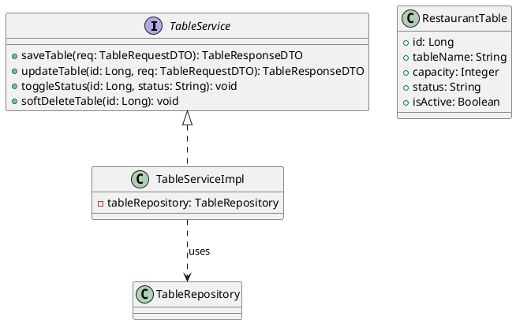
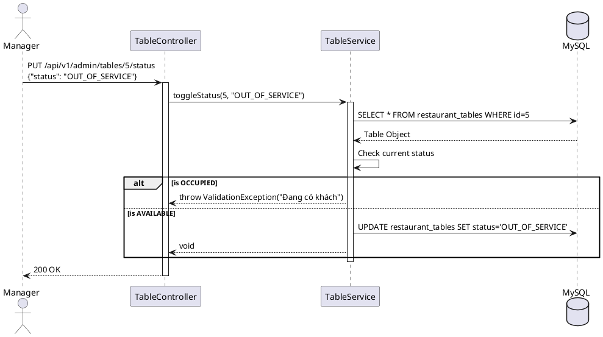

# ENGINEERING DOCUMENTATION STANDARD (EDS) v2.0

## UC07 — Quản lý Dữ liệu nền Sơ đồ Bàn ăn (CRUD Tables)

| Field | Value |
|-------|-------|
| **Document ID** | `KAWAI-EDS-MOD1-UC07-001` |
| **Version** | 1.0 |
| **Date** | 2026-06-17 |
| **Status** | Approved |
| **Document Owner** | Nguyễn Xuân Lưu |
| **Author** | Antigravity — System Agent |
| **Reviewed by** | Nguyễn Xuân Lưu — Tech Lead |
| **DPO Sign-off** | `[x] Approved – 2026-06-17` |
| **Approved by** | `[x] Nguyễn Xuân Lưu` |
| **Last Review** | 2026-06-17 |
| **Based on EDS** | v2.0 |

---

### CHANGELOG
| Ngày | Người thực hiện | Nội dung thay đổi |
|------|-----------------|-------------------|
| 2026-06-17 | Antigravity | Viết lại chi tiết 17 phần cấu trúc tài liệu EDS cho UC07 CRUD Bàn ăn |

---

### MỤC LỤC
1. [Tổng quan Module](#1)
2. [Ma trận Truy vết](#2)
3. [ADR](#3)
4. [Non-Functional & SLA](#4)
5. [Static Modeling](#5)
6. [Dynamic Modeling](#6)
7. [Domain Event Catalog](#7)
8. [Interface Specification](#8)
9. [API Specification](#9)
10. [Bảng mã lỗi](#10)
11. [Quy trình Triển khai](#11)
12. [Rollback & Incident Runbook](#12)
13. [Kịch bản Kiểm thử](#13)
14. [Phương pháp Xác minh](#14)
15. [Mẫu thử thực tế](#15)
16. [Authorization Matrix](#16)
17. [Phụ lục](#17)

---

### 1. Tổng quan Module

| Field | Value |
|-------|-------|
| **Module Name** | Quản lý Sơ đồ Bàn ăn (UC07) |
| **Bounded Context** | Restaurant Core |
| **Use Case** | UC07.1 CRUD Bàn, UC07.2 Thay đổi trạng thái bàn |
| **Data Classification** | Internal Public |
| **Upstream Dependencies** | Core Security (Xác thực Admin/Manager) |
| **Downstream Consumers** | POS App nhà hàng, F&B Service, Customer Web (đặt bàn) |

---

### 2. Ma trận Truy vết

| Requirement ID | Loại | Mô tả | Thành phần Code | Compliance | ADR |
|----------------|------|-------|-----------------|------------|-----|
| UC07.1 | US | Thêm mới / Cập nhật cấu hình bàn ăn | `TableService.saveTable()` | — | — |
| UC07.2 | US | Đổi trạng thái bàn (Sẵn sàng/Bảo trì) | `TableService.toggleStatus()` | — | ADR-007 |
| BR-TBL-01 | BR | Tên bàn phải là duy nhất | `TableRepository` (Constraint) | — | — |

---

### 3. Architecture Decision Records (ADR)

#### ADR-007 — Soft Delete vs Active Status for Restaurant Tables

| Field | Value |
|-------|-------|
| **Status** | Accepted |
| **Deciders** | Nguyễn Xuân Lưu |
| **Date** | 2026-06-17 |

**Bối cảnh:** Sơ đồ bàn ăn liên tục bị thay đổi theo sắp xếp của nhà hàng. Khi xóa một bàn đã từng có hóa đơn, việc gọi SQL DELETE sẽ gây lỗi khóa ngoại với bảng ghi nợ F&B.
**Quyết định:** Bảng `restaurant_tables` sử dụng trường `is_active` boolean cho mục đích xóa mềm (không xuất hiện trên màn hình quản trị nữa) và trường `status` (AVAILABLE, OCCUPIED, OUT_OF_SERVICE) cho mục đích vận hành theo thời gian thực.
**Hệ quả:** Dữ liệu hóa đơn cũ vẫn truy xuất được tên bàn. Cần phân biệt rõ giữa việc xóa hoàn toàn khỏi DB và việc tạm thời đóng bàn.

---

### 4. Non-Functional Requirements & SLA

| Category | Requirement | Target SLA | Measurement |
|----------|-------------|------------|-------------|
| **Latency** | Load sơ đồ bàn (p99) | < 100ms | k6 load test |
| **Availability** | Data Store | 99.9% | Database Uptime |
| **Consistency**| Không ghi đè đồng thời | Strict | Optimistic Locking |

---

### 5. Static Modeling

#### 5.1. Class Diagram



#### 5.2. Data Structure

```sql
CREATE TABLE restaurant_tables (
    id BIGINT AUTO_INCREMENT PRIMARY KEY,
    table_name VARCHAR(50) UNIQUE NOT NULL,
    capacity INT NOT NULL,
    status VARCHAR(20) DEFAULT 'AVAILABLE', -- Trạng thái: AVAILABLE, OCCUPIED, OUT_OF_SERVICE
    is_active BOOLEAN DEFAULT TRUE, -- Dành cho xóa mềm
    created_at TIMESTAMP DEFAULT CURRENT_TIMESTAMP,
    updated_at TIMESTAMP DEFAULT CURRENT_TIMESTAMP ON UPDATE CURRENT_TIMESTAMP
);
```

---

### 6. Dynamic Modeling

#### 6.1. Sequence Diagram — Update Table Status



---

### 7. Domain Event Catalog

| Event Name | Trigger | Publisher | Subscriber(s) | Async? |
|------------|---------|-----------|---------------|--------|
| `TableCreated` | Khởi tạo bàn mới | `TableService` | `AuditService` | Yes |
| `TableStatusChanged`| Admin đổi trạng thái | `TableService` | `WebSocketService` | Yes |

---

### 8. Interface Specification

```java
// TableService.java
// @version 1.0

public interface TableService {
    TableResponseDTO saveTable(TableRequestDTO req);
    TableResponseDTO updateTable(Long tableId, TableRequestDTO req) throws ResourceNotFoundException;
    void toggleStatus(Long tableId, String newStatus) throws InvalidTableStatusException;
    void softDeleteTable(Long tableId) throws ResourceInUseException;
}
```

---

### 9. API Specification

| Method | Path | Auth | Roles | Rate Limit | Idempotent? |
|--------|------|------|-------|------------|-------------|
| POST | `/api/v1/admin/tables` | JWT | ADMIN, MANAGER | 30/min | No |
| PUT | `/api/v1/admin/tables/{id}` | JWT | ADMIN, MANAGER | 30/min | Yes |
| PUT | `/api/v1/admin/tables/{id}/status` | JWT | ADMIN, MANAGER | 60/min | Yes |
| DELETE | `/api/v1/admin/tables/{id}` | JWT | ADMIN, MANAGER | 10/min | Yes |

**POST `/api/v1/admin/tables`**
*Request:* `{"tableName": "T-01", "capacity": 4}`
*Response 200:* `{"id": 1, "tableName": "T-01", "capacity": 4, "status": "AVAILABLE"}`

---

### 10. Bảng mã lỗi

| Code | HTTP | Message (EN) | Message (VI) | Trigger |
|------|------|--------------|--------------|---------|
| `TBL-001` | 400 | Table name exists | Tên bàn đã tồn tại | Gửi trùng tên bàn |
| `TBL-002` | 409 | Table is currently occupied | Bàn đang có khách | Chuyển sang OUT_OF_SERVICE khi đang OCCUPIED |
| `TBL-003` | 404 | Table not found | Không tìm thấy bàn | ID bàn không tồn tại hoặc is_active = false |

---

### 11. Quy trình Triển khai

#### 11.1. Prerequisites
- [x] Database Schema đã được đồng bộ `restaurant_tables`.
- [x] Cấu hình Admin Role.

#### 11.2. Deployment
```bash
mvn clean package -DskipTests
java -jar target/kawai-backend-1.0.jar --spring.profiles.active=staging
```

---

### 12. Rollback & Incident Runbook

| Điều kiện | Ngưỡng | Người quyết định |
|-----------|--------|-------------------|
| API Lỗi Database Constraint | Dữ liệu trùng lặp nhiều | On-call Engineer |

**Rollback:** `git checkout tags/v1.0.0 && mvn clean package`

---

### 13. Kịch bản Kiểm thử

**[Policy]** Test Data: SYNTHETIC.

#### 13.1. Unit Tests
- TC-UNIT-UC07-001: Tạo bàn thành công.
- TC-UNIT-UC07-002: Tạo trùng tên bàn -> Bắn DataIntegrityViolationException.
- TC-UNIT-UC07-003: Đổi status từ AVAILABLE sang OUT_OF_SERVICE -> Thành công.
- TC-UNIT-UC07-004: Đổi status từ OCCUPIED sang OUT_OF_SERVICE -> Bắn lỗi TBL-002.

#### 13.2. E2E Tests
- TC-E2E-UC07-001: Login Manager -> Tạo 5 bàn -> Cập nhật sức chứa bàn 1 -> Đóng bảo trì bàn 2.

---

### 14. Phương pháp Xác minh

```sql
-- Lấy tất cả danh sách bàn đang khả dụng trên màn hình POS
SELECT * FROM restaurant_tables WHERE is_active = true ORDER BY table_name ASC;

-- Lấy danh sách các bàn đang bị bảo trì
SELECT * FROM restaurant_tables WHERE status = 'OUT_OF_SERVICE';
```

---

### 15. Mẫu thử thực tế

```bash
# Tạo bàn mới
curl -X POST https://api.kawairesort.com/api/v1/admin/tables \
  -H "Authorization: Bearer [JWT]" \
  -H "Content-Type: application/json" \
  -d '{"tableName":"VIP-01","capacity":8}'

# Đổi trạng thái bàn
curl -X PUT https://api.kawairesort.com/api/v1/admin/tables/1/status \
  -H "Authorization: Bearer [JWT]" \
  -H "Content-Type: application/json" \
  -d '{"status":"OUT_OF_SERVICE"}'
```

---

### 16. Authorization Matrix

| Endpoint | GUEST | CUSTOMER | CASHIER | MANAGER | ADMIN |
|----------|:-----:|:--------:|:-------:|:-------:|:-----:|
| POST `/admin/tables` | ❌ | ❌ | ❌ | ✔️ | ✔️ |
| PUT `/admin/tables/{id}` | ❌ | ❌ | ❌ | ✔️ | ✔️ |
| PUT `/admin/tables/{id}/status`| ❌ | ❌ | ✔️ | ✔️ | ✔️ |
| DELETE `/admin/tables/{id}` | ❌ | ❌ | ❌ | ✔️ | ✔️ |

*(Lưu ý: Nhân viên thu ngân Cashier được phép đổi trạng thái bàn trong thực tế vận hành).*

---

### 17. Phụ lục

#### A. Glossary
| Thuật ngữ | Định nghĩa |
|-----------|------------|
| **Capacity** | Sức chứa tối đa của một bàn |
| **OUT_OF_SERVICE** | Bàn bị hỏng, đang bảo trì, không xếp khách |

#### B. Tài liệu tham chiếu
| Document | Path |
|----------|------|
| TDD UC07 | `06-Testing/mod1_auth/uc07/TDD_UC07_SPEC.md` |

---
*EDS v2.0*
