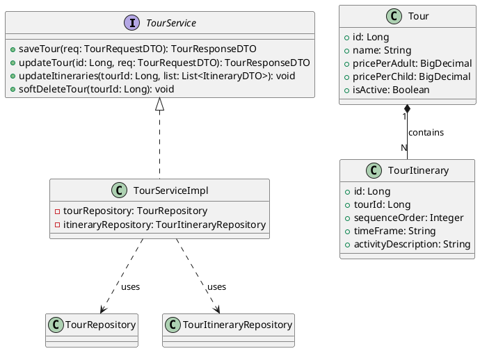
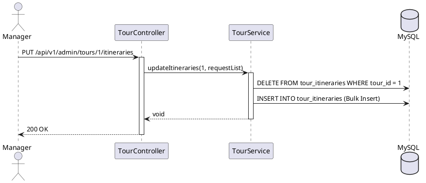

# ENGINEERING DOCUMENTATION STANDARD (EDS) v2.0

## UC08 — Quản lý Dữ liệu nền Hành trình Tour (CRUD Tours)

| Field | Value |
|-------|-------|
| **Document ID** | `KAWAI-EDS-MOD1-UC08-001` |
| **Version** | 1.0 |
| **Date** | 2026-06-17 |
| **Status** | Approved |
| **Document Owner** | Nguyễn Xuân Lưu |
| **Author** | Antigravity — System Agent |
| **Reviewed by** | Nguyễn Xuân Lưu — Tech Lead |
| **DPO Sign-off** | `[x] Approved – 2026-06-17` |
| **Approved by** | `[x] Nguyễn Xuân Lưu` |
| **Last Review** | 2026-06-17 |
| **Based on EDS** | v2.0 |

---

### CHANGELOG
| Ngày | Người thực hiện | Nội dung thay đổi |
|------|-----------------|-------------------|
| 2026-06-17 | Antigravity | Cập nhật cấu trúc 17 phần đầy đủ chi tiết cho UC08 CRUD Tours & Itineraries |

---

### MỤC LỤC
1. [Tổng quan Module](#1)
2. [Ma trận Truy vết](#2)
3. [ADR](#3)
4. [Non-Functional & SLA](#4)
5. [Static Modeling](#5)
6. [Dynamic Modeling](#6)
7. [Domain Event Catalog](#7)
8. [Interface Specification](#8)
9. [API Specification](#9)
10. [Bảng mã lỗi](#10)
11. [Quy trình Triển khai](#11)
12. [Rollback & Incident Runbook](#12)
13. [Kịch bản Kiểm thử](#13)
14. [Phương pháp Xác minh](#14)
15. [Mẫu thử thực tế](#15)
16. [Authorization Matrix](#16)
17. [Phụ lục](#17)

---

### 1. Tổng quan Module

| Field | Value |
|-------|-------|
| **Module Name** | Quản lý Hành trình Tour (UC08) |
| **Bounded Context** | Core Tours & Activities |
| **Use Case** | UC08.1 Thêm/Sửa Tour chung, UC08.2 Sửa đổi chi tiết Lịch trình (Itinerary) |
| **Data Classification** | Internal Public |
| **Upstream Dependencies** | Security Config (RBAC) |
| **Downstream Consumers** | Guest/Customer Booking Tours (MOD4) |

---

### 2. Ma trận Truy vết

| Requirement ID | Loại | Mô tả | Thành phần Code | Compliance | ADR |
|----------------|------|-------|-----------------|------------|-----|
| UC08.1 | US | Quản lý thông tin chung gói Tour (Tên, giá vé, mô tả) | `TourService.saveTour()` | — | ADR-008.1 |
| UC08.2 | US | Quản lý lịch trình các điểm đến (Itinerary) | `TourService.updateItineraries()` | — | ADR-008.2 |
| BR-TOUR-01 | BR | Soft Delete thay vì xóa vật lý | `TourService.deactivateTour()` | — | — |

---

### 3. Architecture Decision Records (ADR)

#### ADR-008.1 — Soft Delete cho Tour Operations
**Quyết định:** Giống các dữ liệu nền khác, `tours` sử dụng `is_active = false` để ẩn tour không cung cấp nữa, đảm bảo không làm mất dữ liệu hóa đơn `Tour_Bookings` cũ.

#### ADR-008.2 — Cập nhật Lịch trình (Itinerary) Replace All
**Quyết định:** Thay vì cập nhật riêng lẻ từng điểm đến trong lịch trình (rất dễ gây sai lệch thứ tự `sequence_order`), API update itinerary sẽ sử dụng cơ chế "Xóa toàn bộ cái cũ, Insert toàn bộ cái mới" theo danh sách JSON truyền lên.
**Hệ quả:** Dữ liệu luôn đồng bộ thứ tự chính xác, Transaction xử lý gọn.

---

### 4. Non-Functional Requirements & SLA

| Category | Requirement | Target SLA | Measurement |
|----------|-------------|------------|-------------|
| **Latency** | Đọc danh sách Tour | < 100ms | k6 load test |
| **Transaction**| Replace Itineraries | All-or-nothing | Transactional log |

---

### 5. Static Modeling

#### 5.1. Class Diagram



#### 5.2. Data Structure

```sql
CREATE TABLE tours (
    id BIGINT AUTO_INCREMENT PRIMARY KEY,
    name VARCHAR(200) NOT NULL,
    description TEXT,
    duration_hours INT,
    price_per_adult DECIMAL(10,2) NOT NULL,
    price_per_child DECIMAL(10,2) NOT NULL,
    is_active BOOLEAN DEFAULT TRUE,
    created_at TIMESTAMP DEFAULT CURRENT_TIMESTAMP
);

CREATE TABLE tour_itineraries (
    id BIGINT AUTO_INCREMENT PRIMARY KEY,
    tour_id BIGINT NOT NULL,
    sequence_order INT NOT NULL,
    time_frame VARCHAR(50), 
    activity_description TEXT,
    location_lat DECIMAL(10,8),
    location_lng DECIMAL(11,8),
    FOREIGN KEY (tour_id) REFERENCES tours(id) ON DELETE CASCADE
);
```

---

### 6. Dynamic Modeling

#### 6.1. Sequence Diagram: Update Itineraries Replace All



---

### 7. Domain Event Catalog

| Event Name | Trigger | Publisher | Subscriber(s) | Async? |
|------------|---------|-----------|---------------|--------|
| `TourCreated` | Tạo Tour | `TourService` | `AuditService` | Yes |
| `TourItineraryChanged` | Sửa lịch trình | `TourService` | `AuditService` | Yes |

---

### 8. Interface Specification

```java
// TourService.java
public interface TourService {
    TourResponseDTO createTour(TourRequestDTO req);
    TourResponseDTO updateTour(Long tourId, TourRequestDTO req) throws ResourceNotFoundException;
    void updateItineraries(Long tourId, List<ItineraryRequestDTO> reqList);
    void softDeleteTour(Long tourId) throws ResourceInUseException;
}
```

---

### 9. API Specification

| Method | Path | Auth | Roles |
|--------|------|------|-------|
| POST | `/api/v1/admin/tours` | JWT | ADMIN, MANAGER |
| PUT | `/api/v1/admin/tours/{id}` | JWT | ADMIN, MANAGER |
| PUT | `/api/v1/admin/tours/{id}/itineraries` | JWT | ADMIN, MANAGER |
| DELETE | `/api/v1/admin/tours/{id}` | JWT | ADMIN, MANAGER |

**PUT `/api/v1/admin/tours/{id}/itineraries`**
*Request:* 
```json
[
  {"sequenceOrder": 1, "timeFrame": "08:00 - 09:00", "activityDescription": "Đón khách tại sảnh"},
  {"sequenceOrder": 2, "timeFrame": "09:30 - 11:30", "activityDescription": "Tham quan vịnh"}
]
```

---

### 10. Bảng mã lỗi

| Code | HTTP | Message (EN) | Message (VI) | Trigger |
|------|------|--------------|--------------|---------|
| `TOUR-001` | 400 | Invalid Sequence | Thứ tự lịch trình sai | `sequenceOrder` không bắt đầu từ 1 hoặc nhảy cóc |
| `TOUR-002` | 409 | Tour has active schedules | Tour đang có lịch chạy | Chặn sửa/xóa Tour đang mở bán |

---

### 11. Quy trình Triển khai
*(Tham khảo quy trình `mvn clean package` tiêu chuẩn).*

---

### 12. Rollback & Incident Runbook

**Runbook:** Nếu lệnh Replace All Itinerary bị ngắt kết nối DB giữa chừng, toàn bộ thao tác sẽ bị Rollback nhờ annotation `@Transactional` trên Service method, đảm bảo dữ liệu Itinerary cũ không bị mất trắng.

---

### 13. Kịch bản Kiểm thử

#### 13.1. Unit Tests
- TC-UNIT-UC08-001: Tạo Tour thành công.
- TC-UNIT-UC08-002: Cập nhật thay thế toàn bộ Itinerary chuẩn xác (Test Transactional Rollback khi lỗi).
- TC-UNIT-UC08-003: Xóa mềm Tour (Soft Delete).

#### 13.2. E2E Tests
- TC-E2E-UC08-001: Login Manager -> Tạo Tour -> Tạo Itinerary -> Lấy chi tiết Tour (bao gồm Itinerary) -> Xóa Tour.

---

### 14. Phương pháp Xác minh

```sql
SELECT t.name, i.sequence_order, i.activity_description
FROM tours t
LEFT JOIN tour_itineraries i ON t.id = i.tour_id
WHERE t.id = 1 ORDER BY i.sequence_order ASC;
```

---

### 15. Mẫu thử thực tế

```bash
# Update lịch trình Tour
curl -X PUT https://api.kawairesort.com/api/v1/admin/tours/1/itineraries \
  -H "Authorization: Bearer [JWT]" \
  -H "Content-Type: application/json" \
  -d '[{"sequenceOrder": 1, "timeFrame": "08:00", "activityDescription": "Pickup"}]'
```

---

### 16. Authorization Matrix

| Endpoint | GUEST | CUSTOMER | MANAGER | ADMIN |
|----------|:-----:|:--------:|:-------:|:-----:|
| POST `/admin/tours` | ❌ | ❌ | ✔️ | ✔️ |
| PUT `/admin/tours/*/itineraries` | ❌ | ❌ | ✔️ | ✔️ |

---

### 17. Phụ lục
- **Tham chiếu:** TDD UC08

---
*EDS v2.0*
