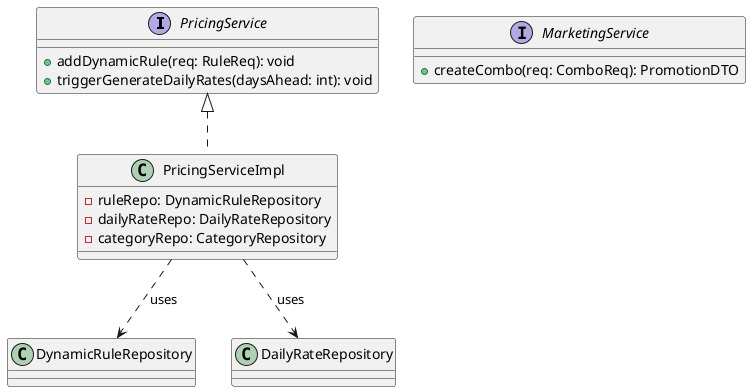
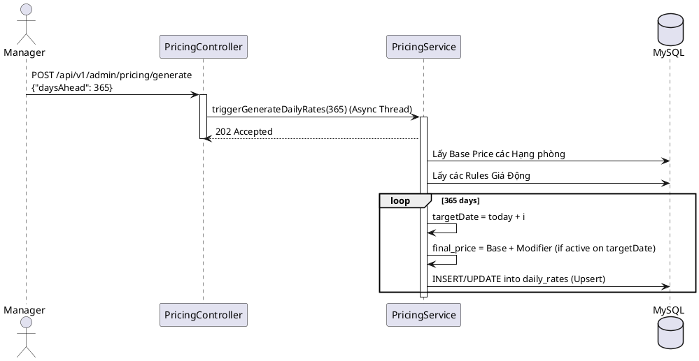

# ENGINEERING DOCUMENTATION STANDARD (EDS) v2.0

## UC09 — Cấu hình Chiến lược Giá & Marketing nâng cao

| Field | Value |
|-------|-------|
| **Document ID** | `KAWAI-EDS-MOD1-UC09-001` |
| **Version** | 1.0 |
| **Date** | 2026-06-17 |
| **Status** | Approved |
| **Document Owner** | Nguyễn Xuân Lưu |
| **Author** | Antigravity — System Agent |
| **Reviewed by** | Nguyễn Xuân Lưu — Tech Lead |
| **DPO Sign-off** | `[x] Approved – 2026-06-17` |
| **Approved by** | `[x] Nguyễn Xuân Lưu` |
| **Last Review** | 2026-06-17 |
| **Based on EDS** | v2.0 |

---

### CHANGELOG
| Ngày | Người thực hiện | Nội dung thay đổi |
|------|-----------------|-------------------|
| 2026-06-17 | Antigravity | Cập nhật cấu trúc 17 phần đầy đủ chi tiết cho UC09 Giá & Marketing |

---

### MỤC LỤC
1. [Tổng quan Module](#1)
2. [Ma trận Truy vết](#2)
3. [ADR](#3)
4. [Non-Functional & SLA](#4)
5. [Static Modeling](#5)
6. [Dynamic Modeling](#6)
7. [Domain Event Catalog](#7)
8. [Interface Specification](#8)
9. [API Specification](#9)
10. [Bảng mã lỗi](#10)
11. [Quy trình Triển khai](#11)
12. [Rollback & Incident Runbook](#12)
13. [Kịch bản Kiểm thử](#13)
14. [Phương pháp Xác minh](#14)
15. [Mẫu thử thực tế](#15)
16. [Authorization Matrix](#16)
17. [Phụ lục](#17)

---

### 1. Tổng quan Module

| Field | Value |
|-------|-------|
| **Module Name** | Cấu hình Chiến lược Giá & Marketing (UC09) |
| **Bounded Context** | Pricing & Marketing Core |
| **Use Case** | UC09.1 Giá động, UC09.2 Sinh giá tĩnh, UC09.3 Phụ thu trẻ em, UC09.4 Đóng gói Combo JSON |
| **Data Classification** | Confidential Business Logic |
| **Upstream Dependencies** | Core Room Categories |
| **Downstream Consumers** | MOD2 Booking (Tìm phòng & Tính giá) |

---

### 2. Ma trận Truy vết

| Requirement ID | Loại | Mô tả | Thành phần Code | Compliance | ADR |
|----------------|------|-------|-----------------|------------|-----|
| UC09.1 | US | Cấu hình giá động biến động (Mùa/Lễ) | `PricingService.addDynamicRule()` | — | — |
| UC09.2 | US | Sinh bảng giá tĩnh `daily_rates` từng ngày | `PricingScheduler.generateDailyRates()` | — | ADR-009 |
| UC09.3 | US | Phụ thu trẻ em | `PricingService.setChildSurcharge()` | — | — |
| UC09.4 | US | Đóng gói Combo cấu hình JSON | `MarketingService.createCombo()` | — | — |

---

### 3. Architecture Decision Records (ADR)

#### ADR-009 — Pre-calculated Daily Rates (Snapshot Pricing Strategy)

| Field | Value |
|-------|-------|
| **Status** | Accepted |
| **Deciders** | Nguyễn Xuân Lưu |
| **Date** | 2026-06-17 |

**Bối cảnh:** Việc tính toán giá phòng real-time lúc khách hàng truy vấn Tìm phòng (giá Base + phụ thu mùa cao điểm + giảm giá + ...) tạo độ phức tạp truy vấn O(N), dẫn đến làm chậm luồng trải nghiệm khách hàng (Customer facing).
**Quyết định:** Sử dụng thiết kế Bảng giá tĩnh `daily_rates`. Scheduler (Quản trị viên) sẽ chạy tính toán bù trừ toán học trước cho 365 ngày tới của toàn bộ các hạng phòng. API cho khách hàng tìm kiếm sẽ chỉ truy vấn thuần túy từ bảng giá tĩnh này để đạt tốc độ O(1).
**Hệ quả:** Mỗi khi có thay đổi trong Quy tắc Giá động (Dynamic Rule), phải kích hoạt tính toán cập nhật lại (Re-generate) toàn bộ bảng Daily Rates tương ứng. Tốc độ update chậm lại đổi lấy tốc độ truy vấn Read siêu nhanh.

---

### 4. Non-Functional Requirements & SLA

| Category | Requirement | Target SLA | Measurement |
|----------|-------------|------------|-------------|
| **Latency** | Khách tìm phòng (Read) | < 50ms | k6 load test |
| **Processing**| Re-generate 365 days | < 5 phút (Async) | Code execution time |

---

### 5. Static Modeling

#### 5.1. Class Diagram



#### 5.2. Data Structure

```sql
CREATE TABLE dynamic_pricing_rules (
    id BIGINT AUTO_INCREMENT PRIMARY KEY,
    category_id BIGINT,
    start_date DATE NOT NULL,
    end_date DATE NOT NULL,
    price_modifier DECIMAL(10,2) NOT NULL, -- Số tiền +/- phụ thu
    reason VARCHAR(100)
);

CREATE TABLE daily_rates (
    id BIGINT AUTO_INCREMENT PRIMARY KEY,
    category_id BIGINT,
    target_date DATE NOT NULL,
    final_price DECIMAL(10,2) NOT NULL,
    UNIQUE KEY uk_category_date (category_id, target_date)
);

CREATE TABLE promotions (
    id BIGINT AUTO_INCREMENT PRIMARY KEY,
    code VARCHAR(20) UNIQUE,
    combo_config JSON, -- Lưu trữ dạng {"room_category_id": 1, "days": 3, "tours": [2]}
    discount_amount DECIMAL(10,2),
    is_active BOOLEAN
);
```

---

### 6. Dynamic Modeling

#### 6.1. Sequence Diagram: Generate Daily Rates



---

### 7. Domain Event Catalog

| Event Name | Trigger | Publisher | Subscriber(s) | Async? |
|------------|---------|-----------|---------------|--------|
| `DynamicRuleChanged` | Manager thêm Rule mới | `PricingService` | `PricingScheduler` | Yes |
| `ComboCreated` | Tạo Combo JSON | `MarketingService` | `AuditService` | Yes |

---

### 8. Interface Specification

```java
// PricingService.java
public interface PricingService {
    void addDynamicRule(DynamicRuleReq req) throws OverlappingDateException;
    void triggerGenerateDailyRates(int daysAhead);
}
```

---

### 9. API Specification

| Method | Path | Auth | Roles | Rate Limit |
|--------|------|------|-------|------------|
| POST | `/api/v1/admin/pricing/rules` | JWT | MANAGER, ADMIN | 10/min |
| POST | `/api/v1/admin/pricing/generate` | JWT | ADMIN | 1/min |
| POST | `/api/v1/admin/marketing/combos` | JWT | MANAGER, ADMIN | 10/min |

**POST `/api/v1/admin/pricing/generate`**
*Response 202 Accepted:* `{"message": "Daily rates generation process started in background."}`

---

### 10. Bảng mã lỗi

| Code | HTTP | Message (EN) | Message (VI) | Trigger |
|------|------|--------------|--------------|---------|
| `PRC-001` | 400 | Overlapping Rules | Các quy tắc giá bị trùng lặp ngày | Cấu hình 2 Rule có khoảng ngày giao nhau |
| `PRC-002` | 400 | Invalid Modifier | Hệ số phụ thu không hợp lệ | Giá final bị tính ra âm |

---

### 11. Quy trình Triển khai
*(Sử dụng CI/CD tiêu chuẩn)*

---

### 12. Rollback & Incident Runbook

**Incident:** API Find Room báo giá sai trầm trọng.
**Runbook:** Có thể có Rule cấu hình sai hoặc Scheduler bị chết. 
1. Sửa lại Rule.
2. Bấm lại nút Generate Daily Rates thủ công (POST `/generate`).

---

### 13. Kịch bản Kiểm thử

#### 13.1. Unit Tests
- TC-UNIT-UC09-001: Hàm tính giá cộng đúng giá Base và Modifier.
- TC-UNIT-UC09-002: Thêm Rule giao ngày -> Bắn `OverlappingDateException`.
- TC-UNIT-UC09-003: Tạo Combo lưu cấu trúc JSON đúng format.

#### 13.2. E2E Tests
- TC-E2E-UC09-001: Tạo Rule tăng 500K lễ 30/4 -> Chạy Generate -> Call API Check giá ngày 30/4 thấy giá tăng đúng 500K.

---

### 14. Phương pháp Xác minh

```sql
-- Lấy bảng giá thực tế của một Hạng phòng (ID=1) trong tháng 4
SELECT target_date, final_price 
FROM daily_rates 
WHERE category_id = 1 AND target_date BETWEEN '2026-04-01' AND '2026-04-30';
```

---

### 15. Mẫu thử thực tế

```bash
# Bật tiến trình sinh giá
curl -X POST https://api.kawairesort.com/api/v1/admin/pricing/generate \
  -H "Authorization: Bearer [JWT]" \
  -H "Content-Type: application/json" \
  -d '{"daysAhead": 365}'
```

---

### 16. Authorization Matrix

| Endpoint | GUEST | CUSTOMER | RECEPTIONIST | MANAGER | ADMIN |
|----------|:-----:|:--------:|:------------:|:-------:|:-----:|
| POST `/admin/pricing/rules` | ❌ | ❌ | ❌ | ✔️ | ✔️ |
| POST `/admin/pricing/generate`| ❌ | ❌ | ❌ | ❌ | ✔️ |

---

### 17. Phụ lục
- **Tham chiếu:** TDD UC09

---
*EDS v2.0*
