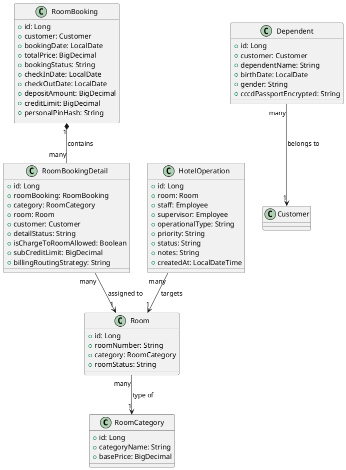
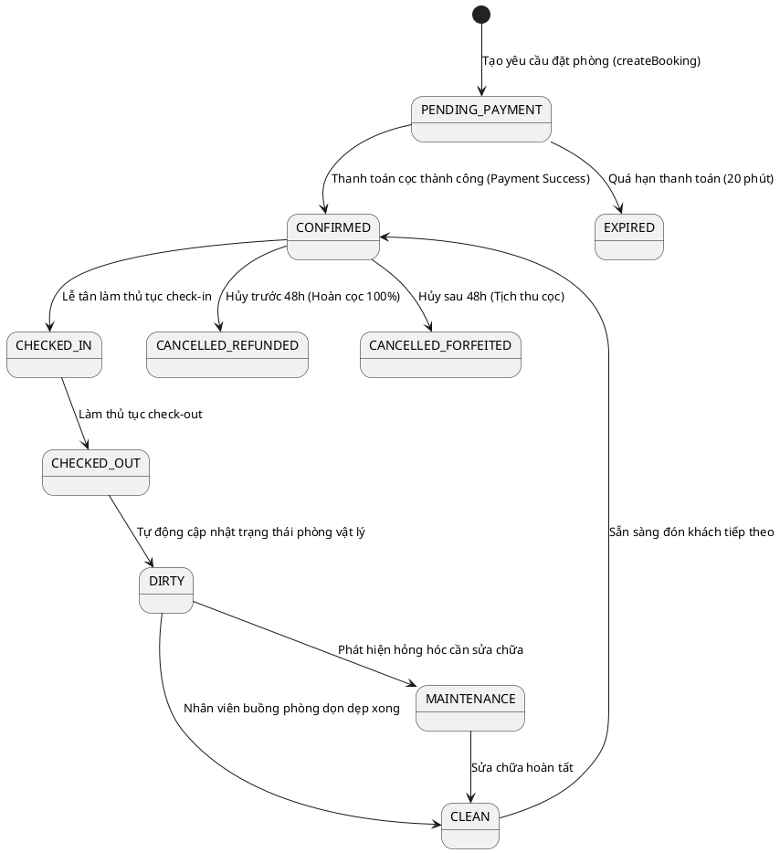

# ENGINEERING DOCUMENTATION STANDARD (EDS) v2.0

## Quy chuẩn Tài liệu Kỹ thuật và Đặc tả Hiện thực hóa

| Field                    | Value                                                                                 |
| ------------------------ | ------------------------------------------------------------------------------------- |
| **Document ID**    | `KAWAI-MOD2-IMP-001`                                                                |
| **Version**        | 1.0                                                                                   |
| **Date**           | 2026-06-12                                                                            |
| **Status**         | Approved                                                                              |
| **Document Owner** | `Nguyễn Xuân Lưu`                                                                |
| **Author**         | `Nguyễn Xuân Lưu - Tech Lead`                                                    |
| **Reviewed by**    | `Chu Xuân Dũng`                                                                   |
| **DPO Sign-off**   | `[x] Approved – 2026-06-12 – Nguyễn Xuân Lưu` *(bắt buộc với module PII)* |
| **Approved by**    | `Chu Xuân Dũng`                                                                   |
| **Last Review**    | 2026-06-12*(stale nếu > 2 sprints không cập nhật)*                              |
| **Based on EDS**   | v2.0                                                                                  |

---

### CHANGELOG

> [!IMPORTANT]
> **Policy 4.4 — Immutable History:** Không bao giờ xóa thông tin cũ. Mọi thay đổi phải ghi vào bảng này.

| Ngày      | Người thực hiện | Nội dung thay đổi                                                                            |
| ---------- | ------------------- | ----------------------------------------------------------------------------------------------- |
| 2026-06-12 | Nguyễn Xuân Lưu  | Tạo tài liệu lần đầu và hoàn thiện đặc tả chi tiết 17 section theo chuẩn EDS v2.0 |

---

### MỤC LỤC

1. [Tổng quan Module](#1-tong-quan-module)
2. [Ma trận Truy vết (Traceability Matrix)](#2-ma-tran-truy-vet-traceability-matrix)
3. [Architecture Decision Records (ADR)](#3-architecture-decision-records-adr) ⭐️ *Mới*
4. [Non-Functional Requirements &amp; SLA](#4-non-functional-requirements--sla) ⭐️ *Mới*
5. [Static Modeling (Mô hình Tĩnh)](#5-static-modeling-mo-hinh-tinh)
6. [Dynamic Modeling (Mô hình Động)](#6-dynamic-modeling-mo-hinh-dong)
7. [Domain Event Catalog](#7-domain-event-catalog) ⭐️ *Mới*
8. [Interface Specification (Đặc tả Giao diện)](#8-interface-specification-dac-ta-giao-dien)
9. [API Specification](#9-api-specification)
10. [Bảng mã lỗi (Error Codes)](#10-bang-ma-loi-error-codes)
11. [Quy trình Triển khai (Step-by-Step)](#11-quy-trinh-trien-khai-step-by-step)
12. [Rollback &amp; Incident Runbook](#12-rollback--incident-runbook) ⭐️ *Mới*
13. [Kịch bản Kiểm thử Chi tiết](#13-kich-ban-kiem-thu-chi-tiet)
14. [Phương pháp Xác minh](#14-phuong-phap-xac-minh)
15. [Mẫu thử thực tế (API Verification Samples)](#15-mau-thu-thuc-te-api-verification-samples)
16. [Bảng tổng hợp phân quyền (Authorization Matrix)](#16-bang-tong-hop-phan-quyen-authorization-matrix)
17. [Phụ lục](#phu-luc)

---

### 1. Tổng quan Module

Mô tả ngắn gọn mục đích của module, phạm vi nghiệp vụ và lý do tồn tại.

| Field                           | Value                                          |
| ------------------------------- | ---------------------------------------------- |
| **Module Name**           | `Đặt phòng & Tiền sảnh vận hành`      |
| **Bounded Context**       | `Đặt phòng & Tiền sảnh vận hành`      |
| **Data Classification**   | Confidential / PII                             |
| **Compliance Scope**      | Luật du lịch Việt Nam 2017                  |
| **Upstream Dependencies** | `[Module 1 (Auth)]`                          |
| **Downstream Consumers**  | `[Module 5 (Finance/Folio), Module 3 (POS)]` |

---

### 2. Ma trận Truy vết (Traceability Matrix)

Ánh xạ trực tiếp: `[Mã yêu cầu] -> [Thành phần Code] -> [Mục tiêu Tuân thủ]`.

> [!NOTE]
> **Policy:** Không viết code nếu không biết code đó phục vụ Rule nào.

| Requirement ID | Loại (BR/ADR/US) | Mô tả yêu cầu                                                   | Thành phần Code                                    | Compliance Target             | ADR liên quan |
| -------------- | ----------------- | ------------------------------------------------------------------- | ---------------------------------------------------- | ----------------------------- | -------------- |
| BR-FO-01       | Business Rule     | Chống overbooking phòng vật lý                                  | `RoomBookingRepository.countOverlappingBookings()` | Luật du lịch Việt Nam 2017 | ADR-002        |
| BR-DATE-01     | Business Rule     | Ngày trả phòng (checkOut) phải sau ngày nhận phòng (checkIn) | `BookingServiceImpl.validateBookingDates()`        | Luật du lịch Việt Nam 2017 | —             |
| BR-FIN-02      | Business Rule     | Hủy trước 48h hoàn cọc 100%, hủy trong vòng 48h mất cọc    | `BookingServiceImpl.cancelBooking()`               | Luật dân sự Việt Nam 2015 | ADR-003        |
| BR-STATUS-01   | Business Rule     | Đặt phòng thành công gán trạng thái CONFIRMED               | `BookingServiceImpl.createBooking()`               | Quy trình khách sạn        | —             |

---

### 3. Architecture Decision Records (ADR)

⭐️ **Section mới — EDS v2.0**
Ghi lại lý do đằng sau mỗi quyết định kiến trúc quan trọng. DPO và Auditor cần section này để hiểu tại sao hệ thống được thiết kế như vậy.

#### ADR-001 — Quản lý Trạng thái Phòng & Buồng phòng

| Field                | Value                                |
| -------------------- | ------------------------------------ |
| **Status**     | Accepted                             |
| **Deciders**   | Nguyễn Xuân Lưu + Chu Xuân Dũng |
| **Date**       | 2026-06-12                           |
| **Supersedes** | —                                   |

**Bối cảnh (Context)**
Cần kiểm soát chặt chẽ trạng thái thực tế của từng phòng vật lý (Vacant_Clean, Dirty, Maintenance, Occupied) để đảm bảo lễ tân không giao nhầm phòng chưa dọn xong cho khách hàng.

**Các phương án đã xem xét (Options Considered)**

| Phương án | Mô tả                                                                                                          | Ưu điểm                    | Nhược điểm                                                     |
| ------------ | ---------------------------------------------------------------------------------------------------------------- | ----------------------------- | ------------------------------------------------------------------ |
| **A**  | Cập nhật trạng thái thủ công hoàn toàn qua API                                                           | Đơn giản, dễ code         | Nhân viên dễ quên cập nhật dẫn đến sai lệch trạng thái |
| **B**  | Tự động chuyển phòng sang DIRTY khi Checkout qua trigger DB kết hợp cập nhật CLEAN từ app Housekeeping | Chính xác, thời gian thực | Hệ thống phức tạp hơn, cần xử lý logic đồng bộ          |

**Quyết định (Decision)**
Chọn Phương án **B** để tối ưu hóa quy trình buồng phòng, giảm thiểu lỗi chủ quan của con người.

**Hệ quả (Consequences)**

* **Tích cực:** Trạng thái phòng cập nhật tự động thời gian thực ngay khi làm thủ tục Checkout.
* **Tiêu cực / Trade-offs:** Đòi hỏi triển khai đồng bộ API cho nhân viên buồng phòng dọn dẹp.

#### ADR-002 — Cơ chế Chống Overbooking (Đồng thời)

| Field                | Value                                |
| -------------------- | ------------------------------------ |
| **Status**     | Accepted                             |
| **Deciders**   | Nguyễn Xuân Lưu + Chu Xuân Dũng |
| **Date**       | 2026-06-12                           |
| **Supersedes** | —                                   |

**Bối cảnh (Context)**
Tránh việc 2 khách hàng đặt cùng một phòng vào cùng một thời điểm khi lượng truy cập cao.

**Quyết định (Decision)**
Sử dụng khóa bi quan (Pessimistic Locking / DB Trigger) kết hợp kiểm tra tính sẵn sàng ở mức dịch vụ `countOverlappingBookings`.

**Hệ quả (Consequences)**
Đảm bảo tính nhất quán tuyệt đối, nhưng tăng độ trễ DB khi lượng đặt phòng đồng thời lớn.

#### ADR-003 — Quy tắc Hạn hủy phòng và Hoàn cọc

| Field                | Value                                |
| -------------------- | ------------------------------------ |
| **Status**     | Accepted                             |
| **Deciders**   | Nguyễn Xuân Lưu + Chu Xuân Dũng |
| **Date**       | 2026-06-12                           |
| **Supersedes** | —                                   |

**Quyết định (Decision)**
Thiết lập deadline hủy phòng là 48 tiếng trước giờ check-in (`checkInDate.minusDays(2)`).

* Hủy trước deadline: trạng thái là `Cancelled_Refunded`, hoàn cọc 100%.
* Hủy sau deadline: trạng thái là `Cancelled_Forfeited`, tịch thu tiền cọc.

---

### 4. Non-Functional Requirements & SLA

⭐️ **Section mới — EDS v2.0**
Với module xử lý PII, NFR không chỉ là yêu cầu kỹ thuật — đây là nghĩa vụ pháp lý (GDPR Art. 32).

#### 4.1. Performance & Availability

| Category               | Requirement         | Target SLA | Measurement Method | Compliance Basis |
| ---------------------- | ------------------- | ---------- | ------------------ | ---------------- |
| **Latency**      | API response (p99)  | < 300ms    | k6 load test       | —               |
| **Availability** | Uptime (monthly)    | 99.9%      | Uptime monitor     | —               |
| **Throughput**   | Concurrent requests | 500 req/s  | Load test          | —               |

#### 4.2. Data Integrity & Retention

| Category              | Requirement            | Target  | Verification Method | Compliance Basis |
| --------------------- | ---------------------- | ------- | ------------------- | ---------------- |
| **Durability**  | Zero record loss       | RPO = 0 | Transaction log     | GDPR Art. 5.1(f) |
| **Retention**   | Audit log retention    | 7 năm  | DB backup policy    | GDPR Art. 5.1(e) |
| **Consistency** | Consent <-> Audit sync | 100%    | Reconciliation job  | GDPR Art. 7.1    |

#### 4.3. Security

| Category                        | Requirement   | Target          | Verification Method   | Compliance Basis |
| ------------------------------- | ------------- | --------------- | --------------------- | ---------------- |
| **Encryption at rest**    | PII fields    | AES-256         | `openssl` CLI check | GDPR Art. 32     |
| **Encryption in transit** | All endpoints | TLS 1.3+        | SSL Labs scan         | GDPR Art. 32     |
| **Access control**        | Role-based    | Least privilege | Auth Matrix (§16)    | GDPR Art. 25     |

#### 4.4. Scalability & Capacity Planning

Dự kiến tải trong 12 tháng tới: `100,000` users, `1,000` room bookings/day. Giải pháp scale: `Áp dụng cơ chế cache Redis cho dữ liệu tìm kiếm phòng trống và thiết lập horizontal scaling cho các instance API`.

---

### 5. Static Modeling (Mô hình Tĩnh)

#### 5.1. Class Diagram (PlantUML)



#### 5.2. Data Structure (JPA Entities mapping)

```java
// === ROOM & BOOKING SCHEMAS ===

@Entity
public class Room {
    @Id @GeneratedValue(strategy = GenerationType.IDENTITY)
    private Long id;
    private String roomNumber;
    private String roomStatus; // Vacant_Clean, Dirty, Maintenance, Occupied
    @ManyToOne
    private RoomCategory category;
}

@Entity
public class RoomBooking {
    @Id @GeneratedValue(strategy = GenerationType.IDENTITY)
    private Long id;
    @ManyToOne
    private Customer customer;
    private LocalDate checkInDate;
    private LocalDate checkOutDate;
    private BigDecimal totalPrice;
    private BigDecimal creditLimit;
    private String bookingStatus; // CONFIRMED, CANCELLED
}

@Entity
public class RoomBookingDetail {
    @Id @GeneratedValue(strategy = GenerationType.IDENTITY)
    private Long id;
    @ManyToOne
    private RoomBooking roomBooking;
    @ManyToOne
    private Room room;
    private String detailStatus; // CHECKED_IN, CHECKED_OUT, Pending
}
```

#### 5.3. Software Architecture Class Diagram (Sơ đồ lớp kiến trúc phần mềm)

```plantuml
@startuml
package "Controller Layer" {
    class BookingController {
        -bookingService: BookingService
        +showBookingPage()
    }
    class BookingApiController {
        -bookingService: BookingService
        +createBooking()
        +cancelBooking()
    }
    class CheckinController {
        -checkinService: CheckinService
        +processCheckin()
    }
    class HousekeepingController {
        -housekeepingService: HousekeepingService
        +updateRoomStatus()
    }
}

package "Service Layer" {
    interface BookingService
    class BookingServiceImpl
    interface RoomService
    class RoomServiceImpl
    interface CheckinService
    class CheckinServiceImpl
    interface HousekeepingService
    class HousekeepingServiceImpl
}

package "Repository Layer" {
    interface BookingRepository
    interface RoomRepository
    interface RoomCategoryRepository
    interface RoomBookingDetailRepository
    interface HousekeepingTaskRepository
}

BookingController --> BookingService
BookingApiController --> BookingService
CheckinController --> CheckinService
HousekeepingController --> HousekeepingService

BookingServiceImpl ..|> BookingService
RoomServiceImpl ..|> RoomService
CheckinServiceImpl ..|> CheckinService
HousekeepingServiceImpl ..|> HousekeepingService

BookingServiceImpl --> BookingRepository
BookingServiceImpl --> RoomRepository
BookingServiceImpl --> RoomBookingDetailRepository

RoomServiceImpl --> RoomRepository

CheckinServiceImpl --> BookingRepository
CheckinServiceImpl --> RoomRepository
CheckinServiceImpl --> RoomBookingDetailRepository

HousekeepingServiceImpl --> RoomRepository
HousekeepingServiceImpl --> HousekeepingTaskRepository

@enduml
```



---

### 6. Dynamic Modeling (Mô hình Động)

#### 6.1. Sequence Diagram — Happy Path (PlantUML)



> [!WARNING]
> **Invariant bất biến:** Phòng đang ở trạng thái `DIRTY` hoặc `MAINTENANCE` tuyệt đối không được phép làm thủ tục check-in cho khách mới.

---

### 7. Domain Event Catalog

⭐️ **Section mới — EDS v2.0**
Liệt kê tất cả domain events mà module này phát ra (publish) và tiêu thụ (consume).

#### 7.1. Events Published (Phát ra)

| Event Name         | Trigger                               | Publisher          | Subscriber(s)                           | Payload Schema          | Async? |
| ------------------ | ------------------------------------- | ------------------ | --------------------------------------- | ----------------------- | ------ |
| `RoomBooked`     | Khách đặt phòng thành công      | `BookingService` | `FolioService, EmailService`          | `RoomBookedEvent`     | Yes    |
| `RoomCheckedIn`  | Lễ tân check-in khách thành công | `CheckinService` | `HousekeepingService`                 | `RoomCheckedInEvent`  | Yes    |
| `RoomCheckedOut` | Khách làm thủ tục checkout        | `CheckinService` | `HousekeepingService, FinanceService` | `RoomCheckedOutEvent` | Yes    |

#### 7.2. Events Consumed (Tiêu thụ)

| Event Name         | Source            | Handler                | Action thực hiện                                                 |
| ------------------ | ----------------- | ---------------------- | ------------------------------------------------------------------ |
| `PaymentSuccess` | `FinanceModule` | `BookingServiceImpl` | Cập nhật Booking sang `CONFIRMED` và kích hoạt Folio phòng |

#### 7.3. Payload Schema

```typescript
export interface RoomBookedEvent {
  eventId: string;        // UUID
  eventType: 'RoomBooked';
  occurredAt: string;     // ISO 8601
  version: '1.0';
  payload: {
    bookingId: number;
    customerId: number;
    roomNumber: string;
    checkInDate: string;
    checkOutDate: string;
    depositAmount: number;
  };
  metadata: {
    correlationId: string;
    createdBy: string;
  };
}
```

---

### 8. Interface Specification (Đặc tả Giao diện)

> [!NOTE]
> **Policy (EDS v2.0):** Mỗi interface phải khai báo `@version`. Mọi breaking change phải tạo ADR mới.

#### 8.1. Service Interface

```java
// @version 1.0
public interface BookingService {
    /**
     * Tạo mới đơn đặt phòng cho khách hàng
     * @throws RoomNotAvailableException khi phòng đã được đặt trong khoảng thời gian yêu cầu
     * @throws IllegalArgumentException khi ngày tháng không hợp lệ
     */
    BookingResponseDTO createBooking(BookingRequestDTO request) throws RoomNotAvailableException, IllegalArgumentException;

    /**
     * Hủy đơn đặt phòng và tính toán số tiền hoàn cọc
     * @return Số tiền cọc được hoàn trả
     */
    BigDecimal cancelBooking(Long bookingId);
}
```

#### 8.2. Repository Interface

```java
// @version 1.0
public interface RoomBookingRepository extends JpaRepository<RoomBooking, Long> {
    /**
     * Đếm số lượ### 10. Bảng mã lỗi (Error Codes)

| Code         | HTTP Status | Message (EN)             | Message (VI)              | Trigger Condition  |
| ------------ | ----------- | ------------------------ | ------------------------- | ------------------ |
| `MOD2-001` | 400         | Validation failed        | Dữ liệu không hợp lệ      | Thiếu thông tin bắt buộc hoặc ngày nhận > ngày trả |
| `MOD2-002` | 409         | Resource conflict        | Phòng đã bị đặt           | Phòng đã được đặt trước đó trong cùng khoảng thời gian |
| `MOD2-003` | 404         | Resource not found       | Không tìm thấy thông tin  | ID đặt phòng hoặc mã phòng không tồn tại trong hệ thống |
| `MOD2-004` | 403         | Insufficient permissions | Không có quyền truy cập   | Khách hàng cố gắng hủy đơn đặt phòng của người khác |
| `MOD2-005` | 500         | Internal error           | Lỗi hệ thống phòng        | Lỗi kết nối cơ sở dữ liệu hoặc lỗi xử lý transaction |

---

### 11. Quy trình Triển khai (Step-by-Step)

#### 11.1. Prerequisites

- [x] ADR đã được Accepted (xem §3)
- [x] DPO đã sign-off nếu module xử lý PII (xem header)
- [x] Blueprint đã được Principal Architect approve
- [x] Môi trường staging đã sẵn sàng

#### 11.2. Pre-Migration Checklist *(bắt buộc tick trước khi chạy migration)*

- [x] Đã backup DB production: `mysqldump -u [user] -p [db] > backup_booking_YYYYMMDD.sql`
- [x] Migration đã chạy thành công trên staging >= 24 giờ
- [x] Rollback script đã được test trên staging (xem §12)
- [x] DPO đã sign-off nếu migration thay đổi cấu trúc lưu PII

#### 11.3. Implementation Steps

**Chặng 1 — Database Schema Update**

Chạy liquibase hoặc sql script để tạo các bảng mới và trigger chống overbooking.

```bash
mvn liquibase:update -Dliquibase.changeLogFile=src/main/resources/db/changelog/db.changelog-master.yaml
```

**Chặng 2 — Deploy Backend Application**

Đóng gói và deploy file jar lên server:

```bash
mvn clean package -DskipTests
java -jar target/kawai-backend-1.0.jar --spring.profiles.active=prod
```

**Chặng 3 — Verification sau deploy**

Kiểm tra endpoint sức khỏe của hệ thống đặt phòng:

```bash
curl -X GET http://localhost:8080/actuator/health
```

Expected: `{"status":"UP"}`

#### 11.4. Deployment Checklist

- [X] Migration chạy thành công
- [X] Health check endpoint trả về 200
- [X] Error rate < 1% trong 10 phút đầu
- [X] Audit log đang sinh ra đúng format

---

### 12. Rollback & Incident Runbook

#### 12.1. Điều kiện kích hoạt Rollback (Trigger Conditions)

| Điều kiện                                        | Ngưỡng           | Người quyết định |
| --------------------------------------------------- | ------------------ | --------------------- |
| **Error rate tăng đột biến**              | > 5% trong 5 phút | On-call Engineer      |
| **Latency p99 vượt ngưỡng**               | > 2x baseline      | On-call Engineer      |
| **Trùng lặp đặt phòng (Double booking)** | Bất kỳ case nào | Tech Lead + DPO       |
| **Audit log ngừng hoạt động**             | > 1 phút          | On-call Engineer      |

#### 12.2. Rollback Procedure

**Bước 1: Re-deploy phiên bản cũ**

Revert về commit ổn định trước đó:

```bash
git checkout tags/v1.2.0
mvn clean package -DskipTests
java -jar target/kawai-backend-1.0.jar
```

**Bước 2: Verify rollback thành công**

Kiểm tra API hoạt động bình thường:

```bash
curl -X GET http://localhost:8080/api/bookings
```

#### 12.3. Notification Protocol

| Thời điểm                   | Người nhận | Kênh               | Template                                                                        |
| ------------------------------ | ------------- | ------------------- | ------------------------------------------------------------------------------- |
| **Ngay khi phát hiện** | On-call team  | Slack `#incident` | `"🚨 [BOOKING-SERVICE] incident detected: Overbooking detected on room R102"` |
| **Trong 30 phút**       | DPO           | Email               | Bắt buộc gửi báo cáo nếu thông tin cá nhân khách hàng bị rò rỉ    |

---

### 13. Kịch bản Kiểm thử Chi tiết

> [!IMPORTANT]
> **Policy (EDS v2.0 — Test Data):** Mọi test scenario phải khai báo Test Data Classification.
>
> * **SYNTHETIC** (bắt buộc mặc định) — dữ liệu giả hoàn toàn.
> * ❌ **TUYỆT ĐỐI KHÔNG** dùng Production PII trong test cases.

#### 13.1. Unit Tests

**TC-UNIT-001 — Booking Date Validation**

* **Feature:** `BookingServiceImpl.validateBookingDates()`
* **Background:**
  * Given test data classification: SYNTHETIC
* **Scenario: CheckOut date is after CheckIn date**
  * Given checkIn = today, checkOut = tomorrow
  * When validateBookingDates is called
  * Then no exception is thrown
* **Scenario: CheckOut date is equal or before CheckIn date**
  * Given checkIn = today, checkOut = today
  * When validateBookingDates is called
  * Then throw IllegalArgumentException with message "Check-out date must be after check-in date"

- **Hàm được test:** `BookingServiceImpl.validateBookingDates()`
- **Invariant kiểm tra:** checkOutDate > checkInDate

#### 13.2. Integration Tests

**TC-INT-001 — Concurrency Overbooking Prevention**

* **Scenario: Two users book the same room at the same time**
  * Given test data classification: SYNTHETIC
  * And room R102 is available
  * When Thread 1 and Thread 2 concurrently call `createBooking` for R102 for same dates
  * Then Thread 1 succeeds and creates booking
  * And Thread 2 fails with `RoomNotAvailableException` (or returns HTTP 409)

- **External dependencies:** `PostgreSQL`
- **Mock strategy:** None (sử dụng Testcontainers PostgreSQL thực tế)

---

#### 13.3. E2E / Security Tests

**TC-E2E-001 — Create Booking via API**

* **Scenario: Authenticated Guest creates a booking**
  * Given test data classification: SYNTHETIC
  * And guest has valid JWT
  * When POST `/api/bookings` is called with:
    | Header           | Value            |
    | Authorization    | Bearer [token]   |
    | Content-Type     | application/json |
  * Then response status is 200
  * And booking status in response is "CONFIRMED"

---

### 14. Phương pháp Xác minh

#### 14.1. Database Inspection

```sql
-- Kiểm tra trùng lặp đặt phòng
SELECT room_id, check_in_date, check_out_date, COUNT(*) 
FROM room_booking 
GROUP BY room_id, check_in_date, check_out_date 
HAVING COUNT(*) > 1;
```

#### 14.2. Log / Audit Verification

```bash
# Kiểm tra audit log format ghi nhận đặt phòng
kubectl logs -l app=kawai-backend | grep "RoomBooked"
```

---

### 15. Mẫu thử thực tế (API Verification Samples)

#### 15.1. Happy Path

# [POST] Tạo đặt phòng mới

```bash
curl -X POST https://api.kawairesort.com/api/bookings \
  -H "Authorization: Bearer [JWT_TOKEN]" \
  -H "Content-Type: application/json" \
  -d '{
    "roomNumber": "R102",
    "checkInDate": "2026-06-15",
    "checkOutDate": "2026-06-18",
    "depositAmount": 500000
  }'
```

*Expected Response (200 OK):*

```json
{
  "bookingId": 12,
  "roomNumber": "R102",
  "status": "CONFIRMED",
  "createdAt": "2026-06-13T08:00:00.000Z"
}
```

---

#### 15.2. Error Paths

# [POST] Thiếu required field -> 400

```bash
curl -X POST https://api.kawairesort.com/api/bookings \
  -H "Authorization: Bearer [JWT_TOKEN]" \
  -H "Content-Type: application/json" \
  -d '{}'
```

*Expected Response (400):*

```json
{
  "error": {
    "code": "MOD2-001",
    "message": "Validation failed",
    "details": [
      { "field": "roomNumber", "message": "roomNumber is required" }
    ]
  }
}
```

# [GET] Không có JWT -> 401

```bash
curl -X GET https://api.kawairesort.com/api/bookings
```

*Expected Response (401):*

```json
{
  "error": {
    "code": "AUTH-001",
    "message": "Full authentication is required to access this resource"
  }
}
```

---

### 16. Bảng tổng hợp phân quyền (Authorization Matrix)

> [!NOTE]
> **Nguyên tắc Least Privilege:** Mỗi Role chỉ có quyền tối thiểu cần thiết để thực hiện nhiệm vụ của mình.

| Endpoint                     | GUEST | USER | ADMIN | RECEPTIONIST | HOUSEKEEPING |
| ---------------------------- | :---: | :--: | :---: | :----------: | :----------: |
| GET `/api/bookings`        |  ❌  | Own |  All  |     All     |      ❌      |
| POST `/api/bookings`       |  ❌  | ✔️ | ✔️ |     ✔️     |      ❌      |
| DELETE `/api/bookings/:id` |  ❌  | Own |  All  |     All     |      ❌      |
| PATCH `/api/rooms/status`  |  ❌  |  ❌  |  All  |     All     |     ✔️     |

**Chú thích:**

- ✔️ = Được phép
- ❌ = Bị từ chối
- **Own** = Chỉ được phép với resource của chính mình
- **All** = Được phép với mọi resource

---

### PHỤ LỤC

#### A. Glossary (Thuật ngữ)

| Thuật ngữ            | Định nghĩa                                                                                                     |
| ---------------------- | ----------------------------------------------------------------------------------------------------------------- |
| **Overbooking**  | Tình trạng một phòng bị đặt trùng bởi hai hoặc nhiều khách hàng trong cùng một khoảng thời gian. |
| **Folio**        | Hồ sơ ghi nhận các khoản chi tiêu và thanh toán của khách hàng tại khách sạn.                       |
| **Housekeeping** | Bộ phận buồng phòng phụ trách dọn dẹp và duy trì trạng thái sạch sẽ của phòng.                    |
| **PII**          | Personally Identifiable Information (Thông tin nhận dạng cá nhân)                                            |
| **Append-only**  | Chiến lược lưu trữ không cho phép UPDATE/DELETE, chỉ INSERT                                               |
| **DPO**          | Data Protection Officer (Nhân viên bảo vệ dữ liệu)                                                          |

#### B. Tài liệu tham chiếu

| Document                                 | Link / Path                                  |
| ---------------------------------------- | -------------------------------------------- |
| Luật du lịch Việt Nam 2017            | [Link]                                       |
| Quy trình vận hành tiền sảnh Resort | `04_testing/mod2_booking/TDD_MOD2_SPEC.md` |

---

*EDS v2.0 — Áp dụng ngay lập tức cho toàn bộ repo PrivacyOps.*
*Các sections đánh dấu ⭐️ là bổ sung mới so với EDS v1.0.*
*Câu hỏi hoặc đề xuất sửa đổi: tạo Issue với label `docs-policy`.*
