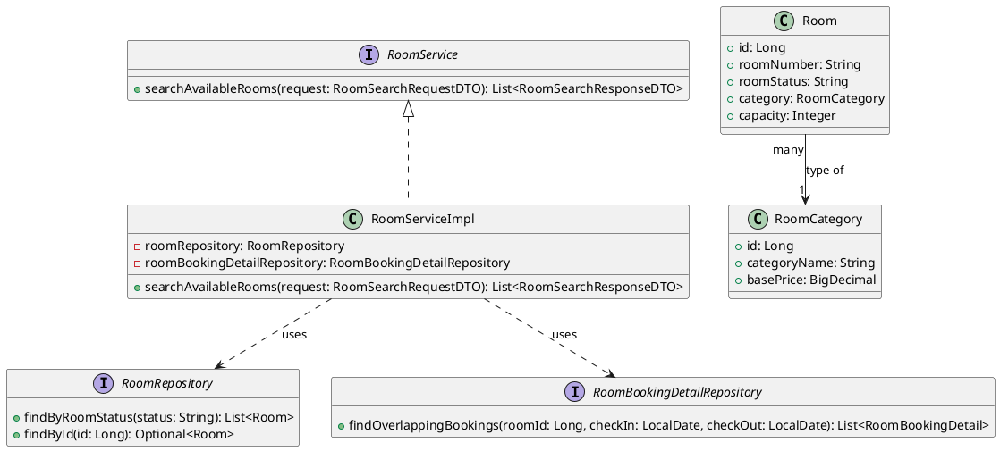
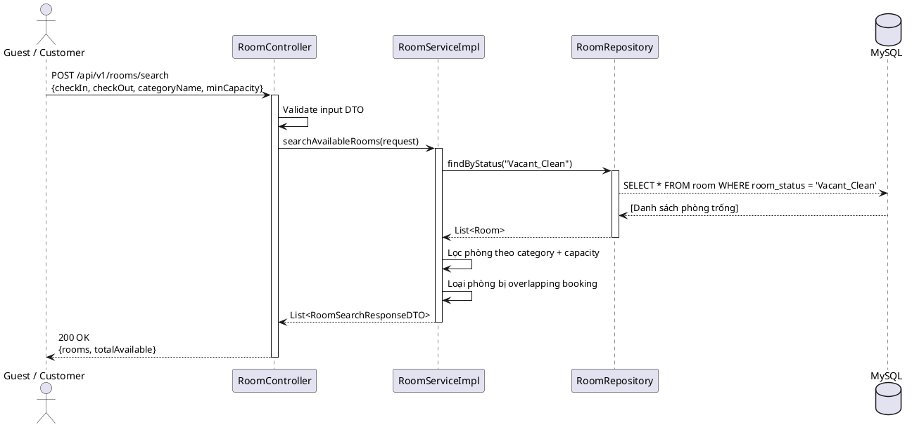
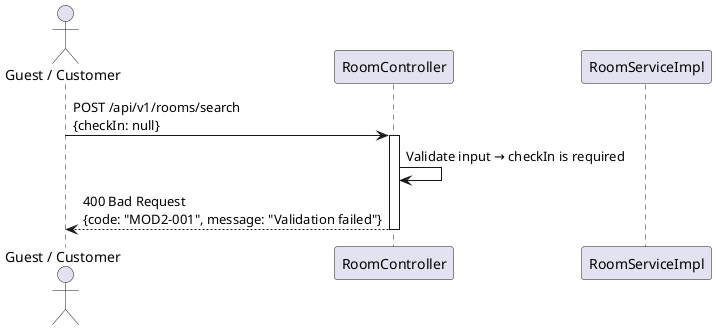

# ENGINEERING DOCUMENTATION STANDARD (EDS) v2.0

## UC09 — Tìm kiếm phòng trống (RoomService)

| Field | Value |
|-------|-------|
| **Document ID** | `KAWAI-EDS-MOD2-UC09-001` |
| **Version** | 1.0 |
| **Date** | 2026-06-14 |
| **Status** | Approved |
| **Document Owner** | Chu Xuân Dũng |
| **Author** | Chu Xuân Dũng — Developer |
| **Reviewed by** | Nguyễn Xuân Lưu — Tech Lead |
| **DPO Sign-off** | `[x] Approved – 2026-06-14 – Chu Xuân Dũng` |
| **Approved by** | [x] Chu Xuân Dũng – 2026-06-14 |
| **Last Review** | 2026-06-14 *(stale nếu > 2 sprints không cập nhật)* |
| **Based on EDS** | v2.0 |

---

### CHANGELOG

> [!IMPORTANT]
> **Policy 4.4 — Immutable History:** Không bao giờ xóa thông tin cũ. Mọi thay đổi phải ghi vào bảng này.

| Ngày | Người thực hiện | Nội dung thay đổi |
|------|-----------------|-------------------|
| 2026-06-14 | Chu Xuân Dũng — Developer | Tạo tài liệu lần đầu |

---

### MỤC LỤC

1. [Tổng quan Module](#1-tong-quan-module)
2. [Ma trận Truy vết (Traceability Matrix)](#2-ma-tran-truy-vet-traceability-matrix)
3. [Architecture Decision Records (ADR)](#3-architecture-decision-records-adr)
4. [Non-Functional Requirements & SLA](#4-non-functional-requirements--sla)
5. [Static Modeling (Mô hình Tĩnh)](#5-static-modeling-mo-hinh-tinh)
6. [Dynamic Modeling (Mô hình Động)](#6-dynamic-modeling-mo-hinh-dong)
7. [Domain Event Catalog](#7-domain-event-catalog)
8. [Interface Specification (Đặc tả Giao diện)](#8-interface-specification-dac-ta-giao-dien)
9. [API Specification](#9-api-specification)
10. [Bảng mã lỗi (Error Codes)](#10-bang-ma-loi-error-codes)
11. [Quy trình Triển khai (Step-by-Step)](#11-quy-trinh-trien-khai-step-by-step)
12. [Rollback & Incident Runbook](#12-rollback--incident-runbook)
13. [Kịch bản Kiểm thử Chi tiết](#13-kich-ban-kiem-thu-chi-tiet)
14. [Phương pháp Xác minh](#14-phuong-phap-xac-minh)
15. [Mẫu thử thực tế (API Verification Samples)](#15-mau-thu-thuc-te-api-verification-samples)
16. [Bảng tổng hợp phân quyền (Authorization Matrix)](#16-bang-tong-hop-phan-quyen-authorization-matrix)
17. [Phụ lục](#phu-luc)

---

### 1. Tổng quan Module

Mô tả ngắn gọn mục đích của UC09, phạm vi nghiệp vụ và lý do tồn tại.

| Field | Value |
|-------|-------|
| **Module Name** | Tìm kiếm phòng trống (UC09) |
| **Bounded Context** | Đặt phòng & Tiền sảnh vận hành |
| **Use Case** | UC09: Guest/Customer tìm kiếm phòng trống dựa trên khoảng ngày, loại phòng, sức chứa |
| **Data Classification** | Internal |
| **Compliance Scope** | Luật du lịch Việt Nam 2017 |
| **Upstream Dependencies** | Module 1 (Auth) — xác thực người dùng |
| **Downstream Consumers** | UC10 (Đặt phòng) — sử dụng kết quả tìm kiếm để đặt phòng |

---

### 2. Ma trận Truy vết (Traceability Matrix)

Ánh xạ trực tiếp: `[Mã yêu cầu] -> [Thành phần Code] -> [Mục tiêu Tuân thủ]`.

> [!NOTE]
> **Policy:** Không viết code nếu không biết code đó phục vụ Rule nào.

| Requirement ID | Loại (BR/ADR/US) | Mô tả yêu cầu | Thành phần Code | Compliance Target | ADR liên quan |
|----------------|-------------------|---------------|-----------------|-------------------|---------------|
| UC09 | Use Case | Tìm phòng trống theo khoảng ngày, loại phòng, sức chứa | `RoomService.searchAvailableRooms()` | Luật du lịch VN 2017 | ADR-002 |
| BR-DATE-01 | Business Rule | Ngày trả phòng (checkOut) phải sau ngày nhận phòng (checkIn) | `BookingServiceImpl.validateBookingDates()` | — | — |

---

### 3. Architecture Decision Records (ADR)

Ghi lại lý do đằng sau mỗi quyết định kiến trúc quan trọng. DPO và Auditor cần section này để hiểu tại sao hệ thống được thiết kế như vậy.

#### ADR-002 — Cơ chế Chống Overbooking (Đồng thời)

| Field | Value |
|-------|-------|
| **Status** | Accepted |
| **Deciders** | Nguyễn Xuân Lưu + Chu Xuân Dũng |
| **Date** | 2026-06-12 |
| **Supersedes** | — |

**Bối cảnh (Context)**
Tránh việc 2 khách hàng đặt cùng một phòng vào cùng một thời điểm khi lượng truy cập cao. UC09 cần đảm bảo kết quả tìm kiếm chỉ trả về phòng thực sự trống.

**Các phương án đã xem xét (Options Considered)**

| Phương án | Mô tả | Ưu điểm | Nhược điểm |
|-----------|-------|---------|------------|
| **A** | Optimistic Locking | Không khóa DB, hiệu năng cao | Dễ xảy ra conflict khi nhiều request đồng thời |
| **B** | Pessimistic Locking | Đảm bảo nhất quán tuyệt đối | Tăng độ trễ DB |

**Quyết định (Decision)**
Chọn Phương án **B** vì độ chính xác là ưu tiên hàng đầu cho module đặt phòng.

**Hệ quả (Consequences)**
- **Tích cực:** Đảm bảo tính nhất quán tuyệt đối, không có double-booking.
- **Tiêu cực / Trade-offs:** Tăng độ trễ DB khi lượng đặt phòng đồng thời lớn.
- **Compliance Impact:** Không có.

---

### 4. Non-Functional Requirements & SLA

Với module xử lý PII, NFR không chỉ là yêu cầu kỹ thuật — đây là nghĩa vụ pháp lý (GDPR Art. 32).

#### 4.1. Performance & Availability

| Category | Requirement | Target SLA | Measurement Method | Compliance Basis |
|----------|-------------|------------|-------------------|------------------|
| **Latency** | API response (p99) | < 300ms | k6 load test | — |
| **Availability** | Uptime (monthly) | 99.9% | Uptime monitor | — |
| **Throughput** | Concurrent requests | 500 req/s | Load test | — |

#### 4.2. Data Integrity & Retention

| Category | Requirement | Target | Verification Method | Compliance Basis |
|----------|-------------|--------|-------------------|------------------|
| **Durability** | Zero record loss | RPO = 0 | Transaction log | GDPR Art. 5.1(f) |
| **Consistency** | Search result khớp DB | 100% | Reconciliation job | — |

#### 4.3. Security

| Category | Requirement | Target | Verification Method | Compliance Basis |
|----------|-------------|--------|-------------------|------------------|
| **Encryption in transit** | All endpoints | TLS 1.3+ | SSL Labs scan | GDPR Art. 32 |
| **Access control** | Role-based | Least privilege | Auth Matrix (§16) | GDPR Art. 25 |

#### 4.4. Scalability & Capacity Planning

Dự kiến tải trong 12 tháng tới: `100,000` users, `1,000` room bookings/day. Giải pháp scale: Áp dụng cơ chế cache Redis cho dữ liệu tìm kiếm phòng trống.

---

### 5. Static Modeling (Mô hình Tĩnh)

#### 5.1. Class Diagram (PlantUML)



#### 5.2. Data Structure (JPA Entities)

```sql
-- === ROOM & BOOKING SCHEMAS ===

CREATE TABLE room_category (
    id BIGINT AUTO_INCREMENT PRIMARY KEY,
    category_name VARCHAR(100) NOT NULL,
    base_price DECIMAL(12,0) NOT NULL,
    created_at TIMESTAMP DEFAULT CURRENT_TIMESTAMP
);

CREATE TABLE room (
    id BIGINT AUTO_INCREMENT PRIMARY KEY,
    room_number VARCHAR(10) NOT NULL UNIQUE,
    room_status VARCHAR(30) NOT NULL DEFAULT 'Vacant_Clean', -- Vacant_Clean, Dirty, Maintenance, Occupied
    category_id BIGINT NOT NULL,
    capacity INT NOT NULL DEFAULT 2,
    amenities VARCHAR(500),
    created_at TIMESTAMP DEFAULT CURRENT_TIMESTAMP,
    FOREIGN KEY (category_id) REFERENCES room_category(id)
);

CREATE INDEX idx_room_status ON room(room_status);
CREATE INDEX idx_room_category ON room(category_id);
```

---

### 6. Dynamic Modeling (Mô hình Động)

#### 6.1. Sequence Diagram — Happy Path (PlantUML)



#### 6.2. Sequence Diagram — Error Path (PlantUML)



#### 6.3. State Machine

UC09 không có state machine riêng vì đây là use case tìm kiếm (read-only). State machine được quản lý bởi UC13 (Housekeeping) cho trạng thái phòng vật lý.

---

### 7. Domain Event Catalog

Liệt kê tất cả domain events mà UC09 phát ra (publish) và tiêu thụ (consume).

#### 7.1. Events Published (Phát ra)

| Event Name | Trigger | Publisher | Subscriber(s) | Payload Schema | Async? |
|------------|---------|-----------|---------------|----------------|--------|
| `RoomsSearched` | Guest/Customer tìm kiếm phòng | `RoomService` | `AnalyticsService` | `RoomsSearchedEvent` | Yes |

#### 7.2. Events Consumed (Tiêu thụ)

| Event Name | Source | Handler | Action thực hiện |
|------------|--------|---------|-----------------|
| `RoomStatusChanged` | UC13 (Housekeeping) | `RoomService` | Refresh cache phòng trống khi có thay đổi trạng thái |

#### 7.3. Payload Schema

```typescript
// RoomsSearchedEvent.ts
export interface RoomsSearchedEvent {
  eventId: string;        // UUID
  eventType: 'RoomsSearched';
  occurredAt: string;     // ISO 8601
  version: '1.0';
  payload: {
    checkInDate: string;
    checkOutDate: string;
    categoryName?: string;
    minCapacity?: number;
    resultCount: number;
    customerId?: number;
  };
  metadata: {
    correlationId: string;
    createdBy: string;
  };
}
```

---

### 8. Interface Specification (Đặc tả Giao diện)

> [!NOTE]
> **Policy (EDS v2.0):** Mỗi interface phải khai báo `@version`. Mọi breaking change phải tạo ADR mới.

#### 8.1. Service Interface

```java
// RoomService.java
// @version 1.0

public interface RoomService {
    /**
     * Tìm kiếm phòng trống dựa trên khoảng ngày, loại phòng và sức chứa
     * @param request Thông tin tìm kiếm (checkIn, checkOut, categoryName, minCapacity)
     * @return Danh sách phòng trống đáp ứng điều kiện
     */
    List<RoomSearchResponseDTO> searchAvailableRooms(RoomSearchRequestDTO request);
}
```

#### 8.2. Repository Interface

```java
// RoomRepository.java
// @version 1.0

public interface RoomRepository extends JpaRepository<Room, Long> {
    List<Room> findByRoomStatus(String roomStatus);
    
    @Query("SELECT r FROM Room r WHERE r.roomStatus = :status AND r.category.categoryName = :category")
    List<Room> findByStatusAndCategory(@Param("status") String status, @Param("category") String category);
}

// RoomBookingDetailRepository.java
// @version 1.0

public interface RoomBookingDetailRepository extends JpaRepository<RoomBookingDetail, Long> {
    @Query("SELECT rbd FROM RoomBookingDetail rbd JOIN rbd.roomBooking rb " +
           "WHERE rbd.room.id = :roomId AND rb.checkInDate < :checkOut AND rb.checkOutDate > :checkIn")
    List<RoomBookingDetail> findOverlappingBookings(@Param("roomId") Long roomId,
                                                     @Param("checkIn") LocalDate checkIn,
                                                     @Param("checkOut") LocalDate checkOut);
}
```

#### 8.3. DTOs

```java
// RoomSearchRequestDTO.java
public class RoomSearchRequestDTO {
    @NotNull(message = "checkInDate is required")
    private LocalDate checkInDate;
    
    @NotNull(message = "checkOutDate is required")
    private LocalDate checkOutDate;
    
    private String categoryName;
    
    @Min(value = 1, message = "minCapacity must be >= 1")
    private Integer minCapacity;
}

// RoomSearchResponseDTO.java
public class RoomSearchResponseDTO {
    private String roomNumber;
    private String categoryName;
    private Integer capacity;
    private BigDecimal basePrice;
    private List<String> amenities;
    private String status;
}
```

---

### 9. API Specification

#### 9.1. Endpoints Table

| Method | Path | Auth Level | Required Roles | Rate Limit | Idempotent? |
|--------|------|------------|----------------|------------|-------------|
| POST | `/api/v1/rooms/search` | JWT Bearer | GUEST, CUSTOMER, RECEPTIONIST, ADMIN | 100/min | Yes |

#### 9.2. Request / Response Schemas

**POST `/api/v1/rooms/search` — Tìm phòng trống**

*Request Body:*

```json
{
  "checkInDate": "2026-08-01",
  "checkOutDate": "2026-08-05",
  "categoryName": "Deluxe",
  "minCapacity": 2
}
```

*Response — 200 OK (Happy Path):*

```json
{
  "rooms": [
    {
      "roomNumber": "R201",
      "categoryName": "Deluxe",
      "capacity": 2,
      "basePrice": 1500000,
      "amenities": ["WiFi", "TV", "Mini Bar"],
      "status": "Vacant_Clean"
    }
  ],
  "totalAvailable": 1
}
```

*Response — 400 Bad Request (Validation Error):*

```json
{
  "error": {
    "code": "MOD2-001",
    "message": "Validation failed",
    "details": [
      { "field": "checkInDate", "message": "checkInDate is required" }
    ]
  }
}
```

*Response — 409 Conflict:*

```json
{
  "error": {
    "code": "MOD2-002",
    "message": "Resource conflict"
  }
}
```

---

### 10. Bảng mã lỗi (Error Codes)

> [!NOTE]
> Tiền tố mã lỗi nhất quán theo module: `MOD2-` cho Module 2 (Booking).

| Code | HTTP Status | Message (EN) | Message (VI) | Trigger Condition |
|------|-------------|--------------|--------------|-------------------|
| `MOD2-001` | 400 | Validation failed | Dữ liệu không hợp lệ | checkOutDate <= checkInDate hoặc thiếu field bắt buộc |
| `MOD2-002` | 409 | Resource conflict | Xung đột tài nguyên | — |
| `MOD2-003` | 404 | Resource not found | Không tìm thấy | Không có phòng nào trong DB |
| `MOD2-005` | 500 | Internal error | Lỗi hệ thống | Lỗi kết nối DB |

---

### 11. Quy trình Triển khai (Step-by-Step)

#### 11.1. Prerequisites

- [x] ADR-002 đã được Accepted (xem §3)
- [ ] Blueprint đã được Principal Architect approve
- [ ] Môi trường staging đã sẵn sàng

#### 11.2. Pre-Migration Checklist *(bắt buộc tick trước khi chạy migration)*

- [ ] Đã backup DB production: `mysqldump -u [user] -p [db] > backup_booking_YYYYMMDD.sql`
- [ ] Migration đã chạy thành công trên staging >= 24 giờ
- [ ] Rollback script đã được test trên staging (xem §12)

#### 11.3. Implementation Steps

**Chặng 1 — Database Schema Update**

Chạy script SQL để tạo bảng room và room_category (nếu chưa có).

```bash
mysql -u root -p kawai_resort < src/main/resources/db/migration/V1__create_room_tables.sql
```

**Chặng 2 — Deploy Backend Application**

```bash
mvn clean package -DskipTests
java -jar target/kawai-backend-1.0.jar --spring.profiles.active=staging
```

**Chặng 3 — Verification sau deploy**

```bash
curl -X POST http://localhost:8080/api/v1/rooms/search \
  -H "Authorization: Bearer [JWT_TOKEN]" \
  -H "Content-Type: application/json" \
  -d '{"checkInDate":"2026-08-01","checkOutDate":"2026-08-05"}'
```

Expected: HTTP 200 kèm danh sách phòng trống.

#### 11.4. Deployment Checklist

- [ ] Migration chạy thành công
- [ ] Health check endpoint trả về 200
- [ ] Error rate < 1% trong 10 phút đầu
- [ ] Audit log đang sinh ra đúng format

---

### 12. Rollback & Incident Runbook

Section này là bắt buộc. Một deploy thiếu rollback plan là deploy chưa hoàn chỉnh.

#### 12.1. Điều kiện kích hoạt Rollback (Trigger Conditions)

| Điều kiện | Ngưỡng | Người quyết định |
|-----------|--------|-------------------|
| **Error rate tăng đột biến** | > 5% trong 5 phút | On-call Engineer |
| **Latency p99 vượt ngưỡng** | > 2x baseline | On-call Engineer |
| **Dữ liệu không nhất quán** | Bất kỳ case nào | Tech Lead + DPO |
| **Audit log ngừng hoạt động** | > 1 phút | On-call Engineer |

#### 12.2. Rollback Procedure

```bash
# Bước 1: Re-deploy phiên bản cũ
git checkout tags/v1.0.0
mvn clean package -DskipTests
java -jar target/kawai-backend-1.0.jar

# Bước 2: Verify rollback thành công
curl -X GET http://localhost:8080/actuator/health
```

#### 12.3. Notification Protocol

| Thời điểm | Người nhận | Kênh | Template |
|-----------|------------|------|----------|
| **Ngay khi phát hiện** | On-call team | Slack `#incident` | `"🚨 [ROOM-SERVICE] incident detected: search API returning errors"` |
| **Trong 30 phút** | DPO | Email | *(Bắt buộc nếu PII bị ảnh hưởng)* |

#### 12.4. Post-Incident Review (PIR)

*Bắt buộc hoàn thành PIR document trong vòng 48 giờ sau khi incident được resolve.*

**PIR Template:**
- **Timeline:** Diễn biến từng bước theo thứ tự thời gian.
- **Root Cause:** Nguyên nhân gốc rễ (5 Whys).
- **Impact:** Số users ảnh hưởng, thời gian downtime.
- **Remediation:** Các bước đã thực hiện để khắc phục.
- **Prevention:** Action items để tránh tái diễn.

---

### 13. Kịch bản Kiểm thử Chi tiết

> [!IMPORTANT]
> **Policy (EDS v2.0 — Test Data):** Mọi test scenario phải khai báo Test Data Classification.
> - **SYNTHETIC** (bắt buộc mặc định) — dữ liệu giả hoàn toàn.
> - ❌ **TUYỆT ĐỐI KHÔNG** dùng Production PII trong test cases.

#### 13.1. Unit Tests

**TC-UNIT-UC09-001 — Tìm phòng trống theo ngày hợp lệ**

* **Feature:** `RoomService.searchAvailableRooms()`
* **Background:**
  * Given test data classification: SYNTHETIC
  * And database có phòng R101 (Deluxe, capacity 2, Vacant_Clean)
  * And phòng R101 không có booking nào trong khoảng 15/06 → 18/06
* **Scenario: Tìm phòng trong khoảng ngày hợp lệ**
  * Given checkIn = 2026-06-15, checkOut = 2026-06-18
  * When `searchAvailableRooms` được gọi
  * Then danh sách trả về chứa phòng R101

- **Hàm được test:** `RoomServiceImpl.searchAvailableRooms()`
- **Invariant kiểm tra:** Chỉ trả về phòng có roomStatus = 'Vacant_Clean' và không bị overlapping booking

**TC-UNIT-UC09-002 — Không có phòng trống → danh sách rỗng**

* **Feature:** `RoomService.searchAvailableRooms()`
* **Background:**
  * Given test data classification: SYNTHETIC
  * And tất cả phòng đều có booking chồng lấn trong khoảng ngày tìm kiếm
* **Scenario: Không có phòng trống**
  * Given checkIn = 2026-06-15, checkOut = 2026-06-18
  * When `searchAvailableRooms` được gọi
  * Then danh sách trả về rỗng

#### 13.2. Integration Tests

**TC-INT-UC09-001 — Service + Repository phối hợp tìm phòng**

* **Scenario: Tìm phòng theo category + capacity**
  * Given test data classification: SYNTHETIC
  * And database có 2 phòng Deluxe và 1 phòng Standard
  * When `searchAvailableRooms` được gọi với categoryName = "Deluxe"
  * Then chỉ trả về phòng Deluxe

- **External dependencies:** MySQL (Testcontainers)
- **Mock strategy:** Không mock — dùng DB thật

#### 13.3. E2E / Security Tests

**TC-E2E-UC09-001 — Tìm phòng qua API**

* **Scenario: Guest có JWT tìm phòng thành công**
  * Given test data classification: SYNTHETIC
  * And guest có JWT hợp lệ
  * When POST `/api/v1/rooms/search` được gọi với:
    | Header | Value |
    |--------|-------|
    | Authorization | Bearer [token] |
    | Content-Type | application/json |
  * Then response status là 200
  * And response body chứa `rooms` array
* **Scenario: Không có JWT → 401**
  * Given user không có token
  * When POST `/api/v1/rooms/search` được gọi
  * Then response status là 401

---

### 14. Phương pháp Xác minh

#### 14.1. Database Inspection

```sql
-- Kiểm tra phòng trống trong khoảng ngày
SELECT r.id, r.room_number, r.room_status
FROM room r
WHERE r.room_status = 'Vacant_Clean'
  AND r.id NOT IN (
    SELECT rbd.room_id FROM room_booking_detail rbd
    JOIN room_booking rb ON rbd.room_booking_id = rb.id
    WHERE rb.check_in_date < :checkOut AND rb.check_out_date > :checkIn
  );

-- Kiểm tra không có PII leak trong log
SELECT query FROM pg_stat_activity WHERE query ILIKE '%room%';
```

#### 14.2. Log / Audit Verification

```bash
# Kiểm tra audit log format
kubectl logs -l app=kawai-backend | grep "RoomsSearched" | head -5

# Kiểm tra không có PII trong Log
kubectl logs -l app=kawai-backend | grep -i "password\|secret\|cccd"
# Expected: No output
```

#### 14.3. Tool-based Verification

```bash
# Verify JWT signature
echo "[JWT_TOKEN]" | cut -d'.' -f2 | base64 -d | jq .

# Verify TLS version
openssl s_client -connect api.kawairesort.com:443 -tls1_3 2>&1 | grep "Protocol"
# Expected Protocol: TLSv1.3
```

---

### 15. Mẫu thử thực tế (API Verification Samples)

#### 15.1. Happy Path

```bash
# [POST] Tìm phòng trống
curl -X POST https://api.kawairesort.com/api/v1/rooms/search \
  -H "Authorization: Bearer [JWT_TOKEN]" \
  -H "Content-Type: application/json" \
  -d '{
    "checkInDate": "2026-08-01",
    "checkOutDate": "2026-08-05",
    "categoryName": "Deluxe",
    "minCapacity": 2
  }'
```

*Expected Response (200):*

```json
{
  "rooms": [
    {
      "roomNumber": "R201",
      "categoryName": "Deluxe",
      "capacity": 2,
      "basePrice": 1500000,
      "amenities": ["WiFi", "TV", "Mini Bar"],
      "status": "Vacant_Clean"
    }
  ],
  "totalAvailable": 1
}
```

#### 15.2. Error Paths

```bash
# [POST] Thiếu required field -> 400
curl -X POST https://api.kawairesort.com/api/v1/rooms/search \
  -H "Authorization: Bearer [JWT_TOKEN]" \
  -H "Content-Type: application/json" \
  -d '{}'
```

*Expected Response (400):*

```json
{
  "error": {
    "code": "MOD2-001",
    "message": "Validation failed",
    "details": [
      { "field": "checkInDate", "message": "checkInDate is required" }
    ]
  }
}
```

```bash
# [POST] Không có JWT -> 401
curl -X POST https://api.kawairesort.com/api/v1/rooms/search
```

*Expected Response (401):*

```json
{
  "error": {
    "code": "AUTH-001",
    "message": "Full authentication is required to access this resource"
  }
}
```

---

### 16. Bảng tổng hợp phân quyền (Authorization Matrix)

> [!NOTE]
> **Nguyên tắc Least Privilege:** Mỗi Role chỉ có quyền tối thiểu cần thiết để thực hiện nhiệm vụ của mình.

| Endpoint | GUEST | CUSTOMER | RECEPTIONIST | ADMIN | TOUR_GUIDE |
|----------|:-----:|:--------:|:------------:|:-----:|:----------:|
| POST `/api/v1/rooms/search` | ✔️ | ✔️ | ✔️ | ✔️ | ✔️ |
| GET `/api/v1/rooms/dashboard` | ❌ | ❌ | ✔️ | ✔️ | ❌ |

**Chú thích:**
- ✔️ = Được phép
- ❌ = Bị từ chối

---

### PHỤ LỤC

#### A. Glossary (Thuật ngữ)

| Thuật ngữ | Định nghĩa |
|-----------|------------|
| **Overbooking** | Tình trạng một phòng bị đặt trùng bởi hai hoặc nhiều khách hàng trong cùng một khoảng thời gian |
| **Folio** | Hồ sơ ghi nhận các khoản chi tiêu và thanh toán của khách hàng tại khách sạn |
| **PII** | Personally Identifiable Information (Thông tin nhận dạng cá nhân) |
| **Vacant_Clean** | Trạng thái phòng trống, sạch sẽ, sẵn sàng đón khách |

#### B. Tài liệu tham chiếu

| Document | Link / Path |
|----------|-------------|
| SRS UC09 — Tìm kiếm phòng trống | `02-Requirement/SRS_Document_SWP391_G2.md` |
| TDD UC09 | `06-Testing/mod2_booking/uc09/TDD_UC09_SPEC.md` |
| Database Schema | `03-Design/database_schema.md` |
| Luật du lịch Việt Nam 2017 | [Link] |

---

*EDS v2.0 — Áp dụng ngay lập tức cho toàn bộ repo.*
*Các sections đánh dấu ⭐️ là bổ sung mới so với EDS v1.0.*
*Câu hỏi hoặc đề xuất sửa đổi: tạo Issue với label `docs-policy`.*