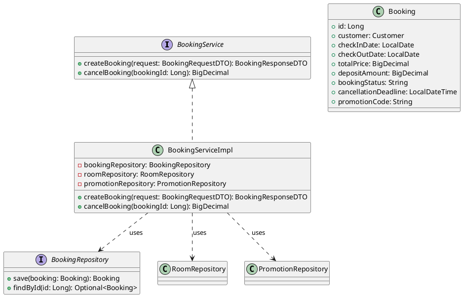
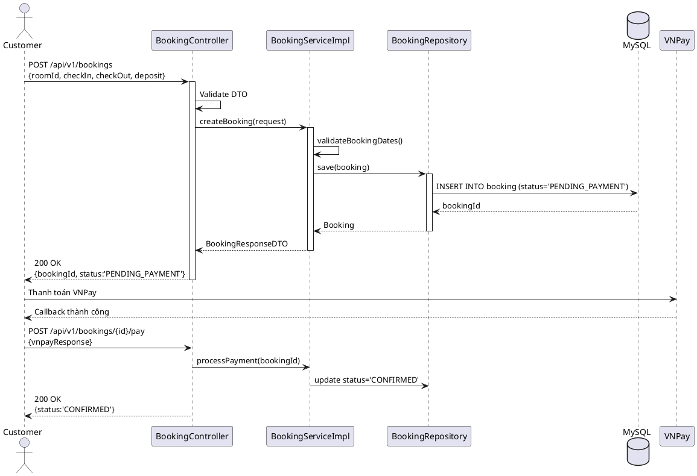
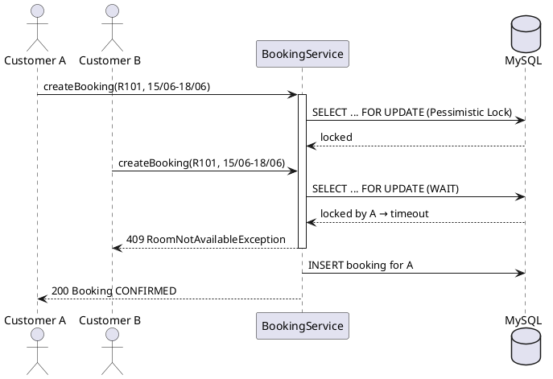
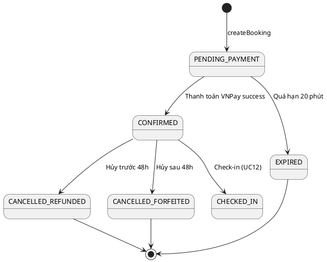

# ENGINEERING DOCUMENTATION STANDARD (EDS) v2.0

## UC10 — Đặt phòng & Thanh toán cọc (BookingService)

| Field | Value |
|-------|-------|
| **Document ID** | `KAWAI-EDS-MOD2-UC10-001` |
| **Version** | 1.0 |
| **Date** | 2026-06-14 |
| **Status** | Approved |
| **Document Owner** | Chu Xuân Dũng |
| **Author** | Chu Xuân Dũng — Developer |
| **Reviewed by** | Nguyễn Xuân Lưu — Tech Lead |
| **DPO Sign-off** | `[x] Approved – 2026-06-14 – Chu Xuân Dũng` |
| **Approved by** | `[x] Chu Xuân Dũng – 2026-06-14` |
| **Last Review** | 2026-06-14 *(stale nếu > 2 sprints không cập nhật)* |
| **Based on EDS** | v2.0 |

---

### CHANGELOG

> [!IMPORTANT]
> **Policy 4.4 — Immutable History:** Không bao giờ xóa thông tin cũ. Mọi thay đổi phải ghi vào bảng này.

| Ngày | Người thực hiện | Nội dung thay đổi |
|------|-----------------|-------------------|
| 2026-06-14 | Chu Xuân Dũng — Developer | Tạo tài liệu lần đầu |

---

### MỤC LỤC

1. [Tổng quan Module](#1-tong-quan-module)
2. [Ma trận Truy vết (Traceability Matrix)](#2-ma-tran-truy-vet-traceability-matrix)
3. [Architecture Decision Records (ADR)](#3-architecture-decision-records-adr)
4. [Non-Functional Requirements & SLA](#4-non-functional-requirements--sla)
5. [Static Modeling (Mô hình Tĩnh)](#5-static-modeling-mo-hinh-tinh)
6. [Dynamic Modeling (Mô hình Động)](#6-dynamic-modeling-mo-hinh-dong)
7. [Domain Event Catalog](#7-domain-event-catalog)
8. [Interface Specification (Đặc tả Giao diện)](#8-interface-specification-dac-ta-giao-dien)
9. [API Specification](#9-api-specification)
10. [Bảng mã lỗi (Error Codes)](#10-bang-ma-loi-error-codes)
11. [Quy trình Triển khai (Step-by-Step)](#11-quy-trinh-trien-khai-step-by-step)
12. [Rollback & Incident Runbook](#12-rollback--incident-runbook)
13. [Kịch bản Kiểm thử Chi tiết](#13-kich-ban-kiem-thu-chi-tiet)
14. [Phương pháp Xác minh](#14-phuong-phap-xac-minh)
15. [Mẫu thử thực tế (API Verification Samples)](#15-mau-thu-thuc-te-api-verification-samples)
16. [Bảng tổng hợp phân quyền (Authorization Matrix)](#16-bang-tong-hop-phan-quyen-authorization-matrix)
17. [Phụ lục](#phu-luc)

---

### 1. Tổng quan Module

Mô tả ngắn gọn mục đích của UC10, phạm vi nghiệp vụ và lý do tồn tại.

| Field | Value |
|-------|-------|
| **Module Name** | Đặt phòng & Thanh toán cọc (UC10) |
| **Bounded Context** | Đặt phòng & Tiền sảnh vận hành |
| **Use Case** | UC10: Customer đặt phòng, thanh toán cọc, hủy phòng và áp mã khuyến mãi |
| **Data Classification** | Internal |
| **Compliance Scope** | Luật du lịch Việt Nam 2017, Luật dân sự 2015 |
| **Upstream Dependencies** | UC09 (Tìm phòng), Module 1 (Auth) |
| **Downstream Consumers** | UC11 (Dashboard), UC12 (Check-in), Module 5 (Folio) |

---

### 2. Ma trận Truy vết (Traceability Matrix)

Ánh xạ trực tiếp: `[Mã yêu cầu] -> [Thành phần Code] -> [Mục tiêu Tuân thủ]`.

> [!NOTE]
> **Policy:** Không viết code nếu không biết code đó phục vụ Rule nào.

| Requirement ID | Loại (BR/ADR/US) | Mô tả yêu cầu | Thành phần Code | Compliance Target | ADR liên quan |
|----------------|-------------------|---------------|-----------------|-------------------|---------------|
| UC10.1 | Use Case | Đặt phòng và thanh toán cọc qua VNPay | `BookingService.createBooking()` | Luật du lịch VN 2017 | ADR-002, ADR-003 |
| UC10.2 | Use Case | Áp mã khuyến mãi vào đặt phòng | `BookingService.applyPromotion()` | — | — |
| BR-FIN-02 | Business Rule | Hủy trước 48h hoàn 100% cọc, trong 48h mất cọc | `BookingService.cancelBooking()` | Luật dân sự 2015 | ADR-003 |
| BR-DATE-01 | Business Rule | Ngày trả phòng phải sau ngày nhận phòng | `BookingServiceImpl.validateBookingDates()` | — | — |
| BR-STATUS-01 | Business Rule | Đặt phòng thành công gán trạng thái CONFIRMED | `BookingServiceImpl.createBooking()` | Quy trình khách sạn | — |

---

### 3. Architecture Decision Records (ADR)

Ghi lại lý do đằng sau mỗi quyết định kiến trúc quan trọng.

#### ADR-002 — Cơ chế Chống Overbooking (Đồng thời)

| Field | Value |
|-------|-------|
| **Status** | Accepted |
| **Deciders** | Nguyễn Xuân Lưu + Chu Xuân Dũng |
| **Date** | 2026-06-12 |
| **Supersedes** | — |

**Bối cảnh (Context)**
Tránh việc 2 khách hàng đặt cùng một phòng vào cùng một thời điểm khi lượng truy cập cao.

**Các phương án đã xem xét (Options Considered)**

| Phương án | Mô tả | Ưu điểm | Nhược điểm |
|-----------|-------|---------|------------|
| **A** | Optimistic Locking | Không khóa DB, hiệu năng cao | Dễ conflict khi nhiều request |
| **B** | Pessimistic Locking | Nhất quán tuyệt đối | Tăng độ trễ DB |

**Quyết định (Decision)**
Chọn Phương án **B** — Pessimistic Locking qua JPA `@Lock(LockModeType.PESSIMISTIC_WRITE)`.

**Hệ quả (Consequences)**
- **Tích cực:** Đảm bảo không có double-booking.
- **Tiêu cực:** Giảm throughput khi request cùng tranh chấp 1 phòng.

#### ADR-003 — Quy tắc Hủy phòng và Hoàn cọc

| Field | Value |
|-------|-------|
| **Status** | Accepted |
| **Deciders** | Lưu + Dũng |
| **Date** | 2026-06-12 |

**Quyết định (Decision):** Deadline hủy là 48h trước check-in. Hủy trước deadline → `Cancelled_Refunded` (100%). Hủy sau → `Cancelled_Forfeited` (0%).

---

### 4. Non-Functional Requirements & SLA

#### 4.1. Performance & Availability

| Category | Requirement | Target SLA | Measurement Method | Compliance Basis |
|----------|-------------|------------|-------------------|------------------|
| **Latency** | API response (p99) | < 300ms | k6 load test | — |
| **Availability** | Uptime (monthly) | 99.9% | Uptime monitor | — |
| **Throughput** | Concurrent requests | 500 req/s | Load test | — |

#### 4.2. Data Integrity & Retention

| Category | Requirement | Target | Verification Method | Compliance Basis |
|----------|-------------|--------|-------------------|------------------|
| **Durability** | Zero record loss | RPO = 0 | Transaction log | GDPR Art. 5.1(f) |
| **Consistency** | Không double-booking | 0% lỗi | JMeter multi-thread | — |

#### 4.3. Security

| Category | Requirement | Target | Verification Method | Compliance Basis |
|----------|-------------|--------|-------------------|------------------|
| **Encryption in transit** | All endpoints | TLS 1.3+ | SSL Labs scan | GDPR Art. 32 |
| **Access control** | Role-based | Least privilege | Auth Matrix (§16) | GDPR Art. 25 |

#### 4.4. Scalability & Capacity Planning

Dự kiến tải: 100,000 users, 1,000 bookings/day. Scale: cache Redis cho tìm kiếm phòng.

---

### 5. Static Modeling (Mô hình Tĩnh)

#### 5.1. Class Diagram (PlantUML)



#### 5.2. Data Structure (JPA Entities)

```sql
CREATE TABLE booking (
    id BIGINT AUTO_INCREMENT PRIMARY KEY,
    customer_id BIGINT NOT NULL,
    check_in_date DATE NOT NULL,
    check_out_date DATE NOT NULL,
    total_price DECIMAL(12,0) NOT NULL,
    deposit_amount DECIMAL(12,0),
    booking_status VARCHAR(30) DEFAULT 'PENDING_PAYMENT',
    cancellation_deadline TIMESTAMP,
    promotion_code VARCHAR(20),
    created_at TIMESTAMP DEFAULT CURRENT_TIMESTAMP,
    updated_at TIMESTAMP DEFAULT CURRENT_TIMESTAMP ON UPDATE CURRENT_TIMESTAMP,
    FOREIGN KEY (customer_id) REFERENCES customer(id)
);

CREATE INDEX idx_booking_status ON booking(booking_status);
CREATE INDEX idx_booking_dates ON booking(check_in_date, check_out_date);
```

---

### 6. Dynamic Modeling (Mô hình Động)

#### 6.1. Sequence Diagram — Happy Path (PlantUML)



#### 6.2. Sequence Diagram — Error Path (PlantUML)



#### 6.3. State Machine



> [!WARNING]
> **Invariant:** Một phòng không thể có 2 booking CONFIRMED trong cùng khoảng ngày.

---

### 7. Domain Event Catalog

#### 7.1. Events Published (Phát ra)

| Event Name | Trigger | Publisher | Subscriber(s) | Payload Schema | Async? |
|------------|---------|-----------|---------------|----------------|--------|
| `BookingCreated` | Đặt phòng thành công | `BookingService` | `FolioService`, `EmailService` | `BookingCreatedEvent` | Yes |
| `BookingCancelled` | Hủy phòng | `BookingService` | `FolioService`, `PaymentService` | `BookingCancelledEvent` | Yes |

#### 7.2. Events Consumed (Tiêu thụ)

| Event Name | Source | Handler | Action thực hiện |
|------------|--------|---------|-----------------|
| `PaymentSuccess` | Module Finance | `BookingServiceImpl` | Cập nhật Booking → CONFIRMED |

#### 7.3. Payload Schema

```typescript
export interface BookingCreatedEvent {
  eventId: string;
  eventType: 'BookingCreated';
  occurredAt: string;
  version: '1.0';
  payload: {
    bookingId: number;
    customerId: number;
    roomNumber: string;
    checkInDate: string;
    checkOutDate: string;
    depositAmount: number;
    totalPrice: number;
  };
  metadata: {
    correlationId: string;
    createdBy: string;
  };
}
```

---

### 8. Interface Specification (Đặc tả Giao diện)

> [!NOTE]
> **Policy (EDS v2.0):** Mỗi interface phải khai báo `@version`. Mọi breaking change phải tạo ADR mới.

#### 8.1. Service Interface

```java
// BookingService.java
// @version 1.0

public interface BookingService {
    /**
     * Tạo mới đơn đặt phòng
     * @throws RoomNotAvailableException khi phòng đã được đặt
     * @throws IllegalArgumentException khi ngày không hợp lệ
     */
    BookingResponseDTO createBooking(BookingRequestDTO request)
        throws RoomNotAvailableException, IllegalArgumentException;

    /**
     * Hủy đơn đặt phòng và tính hoàn cọc
     * @return Số tiền hoàn trả
     */
    BigDecimal cancelBooking(Long bookingId);

    /**
     * Xử lý callback thanh toán VNPay
     */
    BookingResponseDTO processPayment(Long bookingId, PaymentDTO payment);
}
```

#### 8.2. Repository Interface

```java
// BookingRepository.java
// @version 1.0

public interface BookingRepository extends JpaRepository<Booking, Long> {
    @Lock(LockModeType.PESSIMISTIC_WRITE)
    @Query("SELECT b FROM Booking b WHERE b.id = :id")
    Optional<Booking> findByIdWithLock(@Param("id") Long id);
}
```

#### 8.3. DTOs

```java
public class BookingRequestDTO {
    @NotNull private Long roomId;
    @NotNull private LocalDate checkInDate;
    @NotNull private LocalDate checkOutDate;
    private BigDecimal depositAmount;
    private String promotionCode;
}

public class BookingResponseDTO {
    private Long bookingId;
    private String status;
    private BigDecimal totalPrice;
    private LocalDateTime cancellationDeadline;
}
```

---

### 9. API Specification

#### 9.1. Endpoints Table

| Method | Path | Auth Level | Required Roles | Rate Limit | Idempotent? |
|--------|------|------------|----------------|------------|-------------|
| POST | `/api/v1/bookings` | JWT Bearer | CUSTOMER, RECEPTIONIST, ADMIN | 50/min | No |
| DELETE | `/api/v1/bookings/{id}` | JWT Bearer | CUSTOMER(own), RECEPTIONIST, ADMIN | 30/min | Yes |
| PATCH | `/api/v1/bookings/{id}/promotion` | JWT Bearer | CUSTOMER(own) | 20/min | No |
| POST | `/api/v1/bookings/{id}/pay` | JWT Bearer | CUSTOMER | 30/min | Yes |

#### 9.2. Request / Response Schemas

**POST `/api/v1/bookings` — Tạo đặt phòng**

*Request Body:*

```json
{
  "roomId": 1,
  "checkInDate": "2026-08-01",
  "checkOutDate": "2026-08-05",
  "depositAmount": 500000,
  "promotionCode": "SUMMER10"
}
```

*Response — 200 OK:*

```json
{
  "bookingId": 12,
  "status": "CONFIRMED",
  "totalPrice": 9000000,
  "cancellationDeadline": "2026-07-30T14:00:00"
}
```

*Response — 400 (Validation Error):*

```json
{
  "error": {
    "code": "MOD2-001",
    "message": "Validation failed",
    "details": [
      { "field": "checkInDate", "message": "checkInDate is required" }
    ]
  }
}
```

*Response — 409 (Room not available):*

```json
{
  "error": {
    "code": "MOD2-002",
    "message": "Room not available"
  }
}
```

**DELETE `/api/v1/bookings/{id}` — Hủy đặt phòng**

*Response 200:*

```json
{
  "bookingId": 12,
  "status": "CANCELLED_REFUNDED",
  "refundAmount": 500000
}
```

---

### 10. Bảng mã lỗi (Error Codes)

> [!NOTE]
> Tiền tố mã lỗi nhất quán theo module: `MOD2-` cho Module 2.

| Code | HTTP Status | Message (EN) | Message (VI) | Trigger Condition |
|------|-------------|--------------|--------------|-------------------|
| `MOD2-001` | 400 | Validation failed | Dữ liệu không hợp lệ | checkOut <= checkIn hoặc thiếu field |
| `MOD2-002` | 409 | Room not available | Phòng đã được đặt | Double-booking |
| `MOD2-003` | 404 | Booking not found | Không tìm thấy booking | Booking ID không tồn tại |
| `MOD2-004` | 403 | Insufficient permissions | Không đủ quyền | Không phải chủ booking |
| `MOD2-005` | 500 | Internal error | Lỗi hệ thống | Lỗi DB |
| `PROMO-001` | 400 | Promotion inactive | KM không hoạt động | Mã INACTIVE |
| `PROMO-002` | 400 | Promotion expired | KM đã hết hạn | Mã EXPIRED |
| `PROMO-003` | 404 | Promotion not found | Không tìm thấy KM | Mã không tồn tại |

---

### 11. Quy trình Triển khai (Step-by-Step)

#### 11.1. Prerequisites

- [x] ADR-002 và ADR-003 đã được Approved
- [ ] Môi trường staging đã sẵn sàng

#### 11.2. Pre-Migration Checklist

- [ ] Đã backup DB: `mysqldump -u root -p kawai_resort > backup_booking_YYYYMMDD.sql`
- [ ] Migration đã chạy trên staging >= 24h
- [ ] Rollback script đã test trên staging

#### 11.3. Implementation Steps

**Chặng 1 — Database Schema**

```bash
mysql -u root -p kawai_resort < src/main/resources/db/migration/V2__create_booking_table.sql
```

**Chặng 2 — Deploy Backend**

```bash
mvn clean package -DskipTests
java -jar target/kawai-backend-1.0.jar --spring.profiles.active=staging
```

**Chặng 3 — Verification**

```bash
curl -X POST http://localhost:8080/api/v1/bookings \
  -H "Authorization: Bearer [JWT]" \
  -H "Content-Type: application/json" \
  -d '{"roomId":1,"checkInDate":"2026-08-01","checkOutDate":"2026-08-05","depositAmount":500000}'
```

Expected: HTTP 200 + booking CONFIRMED.

#### 11.4. Deployment Checklist

- [x] Migration chạy thành công
- [x] Health check 200
- [ ] Error rate < 1% trong 10 phút đầu
- [ ] Audit log đúng format

---

### 12. Rollback & Incident Runbook

#### 12.1. Điều kiện kích hoạt Rollback

| Điều kiện | Ngưỡng | Người quyết định |
|-----------|--------|-------------------|
| **Error rate tăng đột biến** | > 5% trong 5 phút | On-call Engineer |
| **Double-booking detected** | Bất kỳ case nào | Tech Lead + DPO |
| **Latency p99 vượt ngưỡng** | > 2x baseline | On-call Engineer |

#### 12.2. Rollback Procedure

```bash
git checkout tags/v1.0.0
mvn clean package -DskipTests
java -jar target/kawai-backend-1.0.jar
curl -X GET http://localhost:8080/actuator/health
```

#### 12.3. Notification Protocol

| Thời điểm | Người nhận | Kênh | Template |
|-----------|------------|------|----------|
| Ngay khi phát hiện | On-call team | Slack `#incident` | `"🚨 [BOOKING-SERVICE] incident: Double-booking detected on room R102"` |

#### 12.4. Post-Incident Review (PIR)

- **Timeline:** Diễn biến từng bước.
- **Root Cause:** 5 Whys.
- **Impact:** Users affected, downtime.
- **Prevention:** Action items.

---

### 13. Kịch bản Kiểm thử Chi tiết

> [!IMPORTANT]
> **Policy (EDS v2.0 — Test Data):** Mọi test scenario phải khai báo Test Data Classification = SYNTHETIC. ❌ KHÔNG dùng Production PII.

#### 13.1. Unit Tests

**TC-UNIT-UC10-001 — Đặt phòng thành công**

* **Feature:** `BookingService.createBooking()`
* **Background:**
  * Given test data classification: SYNTHETIC
  * And phòng R101 trống, customer hợp lệ
* **Scenario: Happy path**
  * Given checkIn = 2026-06-15, checkOut = 2026-06-18
  * When `createBooking` được gọi
  * Then Booking status = "CONFIRMED"
  * And cancellationDeadline = checkIn - 2 ngày

- **Hàm được test:** `BookingServiceImpl.createBooking()`
- **Invariant:** Không có 2 booking CONFIRMED cho cùng phòng, cùng ngày

**TC-UNIT-UC10-002 — Concurrency: 2 user cùng đặt 1 phòng**

* **Feature:** `BookingService.createBooking()` (Pessimistic Lock)
* **Background:**
  * Given R101 là phòng trống duy nhất
* **Scenario: Thread A và B cùng đặt R101**
  * When 2 thread gọi `createBooking(R101)` đồng thời
  * Then 1 thread success (200), 1 thread fail (409)

- **Invariant:** Pessimistic Lock đảm bảo 1 request thành công

**TC-UNIT-UC10-003 — Validate ngày**

* **Feature:** `BookingService.validateBookingDates()`
* **Scenario: checkOut <= checkIn**
  * When `validateBookingDates(today, today)`
  * Then throw IllegalArgumentException

**TC-UNIT-UC10-004 — Hủy trước 48h → refund 100%**

* **Feature:** `BookingService.cancelBooking()`
* **Scenario: Hủy sớm**
  * Given booking với checkIn > 48h từ now
  * When `cancelBooking` called
  * Then status = "Cancelled_Refunded", refund = deposit

**TC-UNIT-UC10-005 — Hủy trong 48h → forfeited**

* **Feature:** `BookingService.cancelBooking()`
* **Scenario: Hủy muộn**
  * Given booking với checkIn < 48h từ now
  * When `cancelBooking` called
  * Then status = "Cancelled_Forfeited", refund = 0

#### 13.2. Integration Tests

**TC-INT-UC10-001 — VNPay Payment Callback**

* **Scenario: Thanh toán thành công**
  * Given booking PENDING_PAYMENT
  * When processPayment với callback success
  * Then booking status = CONFIRMED

- **External dependencies:** MySQL
- **Mock strategy:** Mock VNPay response

#### 13.3. E2E / Security Tests

**TC-E2E-UC10-001 — Tạo booking qua API**

* **Scenario: Customer có JWT tạo booking**
  * Given test data: SYNTHETIC, JWT hợp lệ
  * When POST /api/v1/bookings
  * Then 200 + CONFIRMED
* **Scenario: Không có JWT → 401**
  * When POST /api/v1/bookings không có token
  * Then 401

---

### 14. Phương pháp Xác minh

#### 14.1. Database Inspection

```sql
-- Kiểm tra trạng thái booking
SELECT id, booking_status, check_in_date, check_out_date
FROM booking WHERE customer_id = :id;

-- Kiểm tra không có double-booking
SELECT room_id, check_in_date, check_out_date, COUNT(*)
FROM room_booking_detail GROUP BY room_id, check_in_date, check_out_date
HAVING COUNT(*) > 1;
```

#### 14.2. Log / Audit Verification

```bash
kubectl logs -l app=kawai-backend | grep "BookingCreated" | head -5
kubectl logs -l app=kawai-backend | grep -i "password\|secret\|cccd"
# Expected: No output
```

#### 14.3. Tool-based Verification

```bash
echo "[JWT]" | cut -d'.' -f2 | base64 -d | jq .
openssl s_client -connect api.kawairesort.com:443 -tls1_3 2>&1 | grep "Protocol"
```

---

### 15. Mẫu thử thực tế (API Verification Samples)

#### 15.1. Happy Path

```bash
# [POST] Tạo đặt phòng mới
curl -X POST https://api.kawairesort.com/api/v1/bookings \
  -H "Authorization: Bearer [JWT_TOKEN]" \
  -H "Content-Type: application/json" \
  -d '{
    "roomId": 1,
    "checkInDate": "2026-08-01",
    "checkOutDate": "2026-08-05",
    "depositAmount": 500000,
    "promotionCode": "SUMMER10"
  }'
```

*Expected Response (200):*

```json
{
  "bookingId": 12,
  "status": "CONFIRMED",
  "totalPrice": 9000000,
  "cancellationDeadline": "2026-07-30T14:00:00"
}
```

#### 15.2. Error Paths

```bash
# Thiếu required field -> 400
curl -X POST https://api.kawairesort.com/api/v1/bookings \
  -H "Authorization: Bearer [JWT]" \
  -H "Content-Type: application/json" \
  -d '{}'
```

*Expected Response (400):*

```json
{
  "error": {
    "code": "MOD2-001",
    "message": "Validation failed",
    "details": [
      { "field": "roomId", "message": "roomId is required" }
    ]
  }
}
```

```bash
# Không có JWT -> 401
curl -X POST https://api.kawairesort.com/api/v1/bookings
```

```json
{
  "error": {
    "code": "AUTH-001",
    "message": "Full authentication is required"
  }
}
```

---

### 16. Bảng tổng hợp phân quyền (Authorization Matrix)

> [!NOTE]
> **Nguyên tắc Least Privilege:** Mỗi Role chỉ có quyền tối thiểu cần thiết.

| Endpoint | GUEST | CUSTOMER | RECEPTIONIST | ADMIN | HOUSEKEEPING |
|----------|:-----:|:--------:|:------------:|:-----:|:------------:|
| POST `/api/v1/bookings` | ❌ | ✔️ | ✔️ | ✔️ | ❌ |
| DELETE `/api/v1/bookings/{id}` | ❌ | Own | All | All | ❌ |
| PATCH `/api/v1/bookings/{id}/promotion` | ❌ | Own | ❌ | ✔️ | ❌ |
| POST `/api/v1/bookings/{id}/pay` | ❌ | Own | ✔️ | ✔️ | ❌ |

**Chú thích:**
- ✔️ = Được phép
- ❌ = Bị từ chối
- **Own** = Chỉ resource của mình
- **All** = Mọi resource

---

### PHỤ LỤC

#### A. Glossary (Thuật ngữ)

| Thuật ngữ | Định nghĩa |
|-----------|------------|
| **Overbooking** | Phòng bị đặt trùng bởi 2+ khách cùng khoảng thời gian |
| **Cancellation Deadline** | Hạn cuối hủy phòng, = checkInDate - 48h |
| **Folio** | Hồ sơ chi tiêu của khách tại khách sạn |
| **Pessimistic Lock** | Khóa bi quan, khóa DB khi đọc để chống ghi đồng thời |

#### B. Tài liệu tham chiếu

| Document | Link / Path |
|----------|-------------|
| SRS UC10 — Đặt phòng | `02-Requirement/SRS_Document_SWP391_G2.md` |
| TDD UC10 | `06-Testing/mod2_booking/uc10/TDD_UC10_SPEC.md` |
| ADR-002, ADR-003 | `06-Testing/MASTER_EDS_SPEC.md#3` |
| Database Schema | `03-Design/database_schema.md` |

---

*EDS v2.0 — Áp dụng ngay lập tức cho toàn bộ repo.*