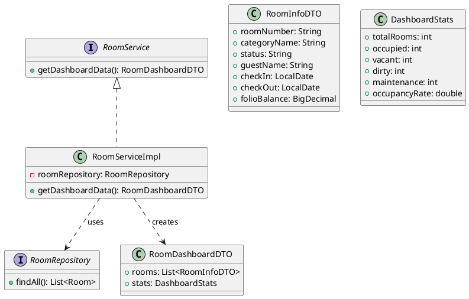
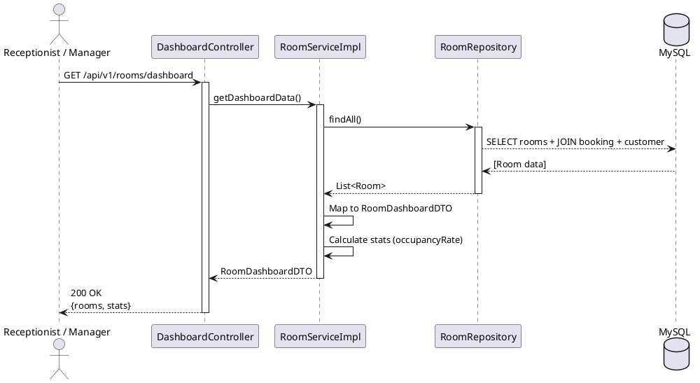

# ENGINEERING DOCUMENTATION STANDARD (EDS) v2.0

## UC11 — Xem sơ đồ Matrix phòng trống (Dashboard)

| Field | Value |
|-------|-------|
| **Document ID** | `KAWAI-EDS-MOD2-UC11-001` |
| **Version** | 1.0 |
| **Date** | 2026-06-14 |
| **Status** | Approved |
| **Document Owner** | Chu Xuân Dũng |
| **Author** | Chu Xuân Dũng — Developer |
| **Reviewed by** | Nguyễn Xuân Lưu — Tech Lead |
| **DPO Sign-off** | `[x] Approved – 2026-06-14 – Chu Xuân Dũng` |
| **Approved by** | `[x] Chu Xuân Dũng – 2026-06-14` |
| **Last Review** | 2026-06-14 *(stale nếu > 2 sprints không cập nhật)* |
| **Based on EDS** | v2.0 |

---

### CHANGELOG

> [!IMPORTANT]
> **Policy 4.4 — Immutable History:** Không bao giờ xóa thông tin cũ. Mọi thay đổi phải ghi vào bảng này.

| Ngày | Người thực hiện | Nội dung thay đổi |
|------|-----------------|-------------------|
| 2026-06-14 | Chu Xuân Dũng — Developer | Tạo tài liệu lần đầu |

---

### MỤC LỤC

1. [Tổng quan Module](#1-tong-quan-module)
2. [Ma trận Truy vết (Traceability Matrix)](#2-ma-tran-truy-vet-traceability-matrix)
3. [Architecture Decision Records (ADR)](#3-architecture-decision-records-adr)
4. [Non-Functional Requirements & SLA](#4-non-functional-requirements--sla)
5. [Static Modeling (Mô hình Tĩnh)](#5-static-modeling-mo-hinh-tinh)
6. [Dynamic Modeling (Mô hình Động)](#6-dynamic-modeling-mo-hinh-dong)
7. [Domain Event Catalog](#7-domain-event-catalog)
8. [Interface Specification (Đặc tả Giao diện)](#8-interface-specification-dac-ta-giao-dien)
9. [API Specification](#9-api-specification)
10. [Bảng mã lỗi (Error Codes)](#10-bang-ma-loi-error-codes)
11. [Quy trình Triển khai (Step-by-Step)](#11-quy-trinh-trien-khai-step-by-step)
12. [Rollback & Incident Runbook](#12-rollback--incident-runbook)
13. [Kịch bản Kiểm thử Chi tiết](#13-kich-ban-kiem-thu-chi-tiet)
14. [Phương pháp Xác minh](#14-phuong-phap-xac-minh)
15. [Mẫu thử thực tế (API Verification Samples)](#15-mau-thu-thuc-te-api-verification-samples)
16. [Bảng tổng hợp phân quyền (Authorization Matrix)](#16-bang-tong-hop-phan-quyen-authorization-matrix)
17. [Phụ lục](#phu-luc)

---

### 1. Tổng quan Module

Mô tả ngắn gọn mục đích của UC11, phạm vi nghiệp vụ và lý do tồn tại.

| Field | Value |
|-------|-------|
| **Module Name** | Dashboard Room Matrix (UC11) |
| **Bounded Context** | Đặt phòng & Tiền sảnh vận hành |
| **Use Case** | UC11: Receptionist/Manager xem sơ đồ phòng real-time |
| **Data Classification** | Internal |
| **Compliance Scope** | — |
| **Upstream Dependencies** | UC10 (Đặt phòng), UC12 (Check-in), UC13 (Housekeeping) |
| **Downstream Consumers** | Receptionist UI, Manager UI |

---

### 2. Ma trận Truy vết (Traceability Matrix)

Ánh xạ trực tiếp: `[Mã yêu cầu] -> [Thành phần Code] -> [Mục tiêu Tuân thủ]`.

| Requirement ID | Loại (BR/ADR/US) | Mô tả yêu cầu | Thành phần Code | Compliance Target | ADR liên quan |
|----------------|-------------------|---------------|-----------------|-------------------|---------------|
| UC11 | Use Case | Xem sơ đồ phòng real-time, thống kê occupancy | `RoomService.getDashboardData()` | — | ADR-001 |

---

### 3. Architecture Decision Records (ADR)

#### ADR-001 — Quản lý Trạng thái Phòng & Buồng phòng

| Field | Value |
|-------|-------|
| **Status** | Accepted |
| **Deciders** | Nguyễn Xuân Lưu + Chu Xuân Dũng |
| **Date** | 2026-06-12 |
| **Supersedes** | — |

**Bối cảnh (Context)**
Cần kiểm soát chặt chẽ trạng thái thực tế của từng phòng vật lý để đảm bảo lễ tân không giao nhầm phòng chưa dọn cho khách.

**Các phương án đã xem xét (Options Considered)**

| Phương án | Mô tả | Ưu điểm | Nhược điểm |
|-----------|-------|---------|------------|
| **A** | Cập nhật thủ công qua API | Đơn giản, dễ code | Nhân viên dễ quên cập nhật |
| **B** | Tự động chuyển DIRTY khi Checkout + HK cập nhật CLEAN | Chính xác, thời gian thực | Phức tạp hơn |

**Quyết định (Decision)**
Chọn Phương án **B**.

**Hệ quả (Consequences)**
- **Tích cực:** Trạng thái phòng cập nhật tự động.
- **Tiêu cực:** Đòi hỏi API đồng bộ cho nhân viên buồng phòng.

---

### 4. Non-Functional Requirements & SLA

#### 4.1. Performance & Availability

| Category | Requirement | Target SLA | Measurement Method |
|----------|-------------|------------|-------------------|
| **Latency** | API response (p99) | < 300ms | k6 load test |
| **Availability** | Uptime (monthly) | 99.9% | Uptime monitor |
| **Throughput** | Concurrent requests | 200 req/s | Load test |

#### 4.2. Security

| Category | Requirement | Target | Verification Method |
|----------|-------------|--------|-------------------|
| **Access control** | Role-based | Least privilege | Auth Matrix (§16) |

---

### 5. Static Modeling (Mô hình Tĩnh)

#### 5.1. Class Diagram (PlantUML)



#### 5.2. Data Structure

```sql
SELECT r.room_number, r.room_status, rc.category_name,
       rb.check_in_date, rb.check_out_date,
       c.full_name as guest_name
FROM room r
JOIN room_category rc ON r.category_id = rc.id
LEFT JOIN room_booking_detail rbd ON r.id = rbd.room_id AND rbd.detail_status = 'CHECKED_IN'
LEFT JOIN room_booking rb ON rbd.room_booking_id = rb.id
LEFT JOIN customer c ON rb.customer_id = c.id;
```

---

### 6. Dynamic Modeling (Mô hình Động)

#### 6.1. Sequence Diagram — Happy Path



#### 6.2. State Machine

UC11 là use case read-only, không có state machine riêng. Trạng thái phòng được quản lý bởi UC13.

---

### 7. Domain Event Catalog

#### 7.1. Events Published

| Event Name | Trigger | Publisher | Subscriber(s) | Async? |
|------------|---------|-----------|---------------|--------|
| `DashboardViewed` | User xem dashboard | `RoomService` | `AnalyticsService` | Yes |

#### 7.2. Payload Schema

```typescript
export interface DashboardViewedEvent {
  eventId: string;
  eventType: 'DashboardViewed';
  occurredAt: string;
  version: '1.0';
  payload: {
    userId: number;
    role: string;
    occupancyRate: number;
  };
  metadata: {
    correlationId: string;
  };
}
```

---

### 8. Interface Specification (Đặc tả Giao diện)

> [!NOTE]
> **Policy:** Mỗi interface phải khai báo `@version`. Mọi breaking change phải tạo ADR mới.

#### 8.1. Service Interface

```java
// RoomService.java
// @version 1.0

public interface RoomService {
    /**
     * Lấy dữ liệu dashboard: danh sách phòng + thống kê
     */
    RoomDashboardDTO getDashboardData();
}
```

#### 8.2. DTOs

```java
public class RoomDashboardDTO {
    private List<RoomInfoDTO> rooms;
    private DashboardStats stats;
}

public class RoomInfoDTO {
    private String roomNumber;
    private String categoryName;
    private String status;
    private String guestName;
    private LocalDate checkIn;
    private LocalDate checkOut;
    private BigDecimal folioBalance;
}

public class DashboardStats {
    private int totalRooms;
    private int occupied;
    private int vacant;
    private int dirty;
    private int maintenance;
    private double occupancyRate;
}
```

---

### 9. API Specification

#### 9.1. Endpoints Table

| Method | Path | Auth Level | Required Roles | Rate Limit | Idempotent? |
|--------|------|------------|----------------|------------|-------------|
| GET | `/api/v1/rooms/dashboard` | JWT Bearer | RECEPTIONIST, ADMIN, MANAGER | 60/min | Yes |

#### 9.2. Request / Response Schemas

**GET `/api/v1/rooms/dashboard`**

*Response — 200 OK:*

```json
{
  "rooms": [
    {
      "roomNumber": "R101",
      "categoryName": "Deluxe",
      "status": "Occupied",
      "guestName": "Nguyen Van A",
      "checkIn": "2026-08-01",
      "checkOut": "2026-08-05",
      "folioBalance": 1500000
    }
  ],
  "stats": {
    "totalRooms": 50,
    "occupied": 32,
    "vacant": 15,
    "dirty": 2,
    "maintenance": 1,
    "occupancyRate": 64.0
  }
}
```

---

### 10. Bảng mã lỗi (Error Codes)

| Code | HTTP Status | Message (EN) | Message (VI) | Trigger Condition |
|------|-------------|--------------|--------------|-------------------|
| `MOD2-003` | 404 | No rooms found | Không tìm thấy phòng | DB không có dữ liệu phòng |
| `MOD2-005` | 500 | Internal error | Lỗi hệ thống | Lỗi kết nối DB |

---

### 11. Quy trình Triển khai (Step-by-Step)

#### 11.1. Prerequisites

- [x] ADR-001 đã được Approved
- [x] Dữ liệu phòng đã có trong DB

#### 11.2. Implementation Steps

**Chặng 1 — Deploy Backend**

```bash
mvn clean package -DskipTests
java -jar target/kawai-backend-1.0.jar --spring.profiles.active=staging
```

**Chặng 2 — Verification**

```bash
curl -X GET http://localhost:8080/api/v1/rooms/dashboard \
  -H "Authorization: Bearer [RECEPTIONIST_TOKEN]"
```

Expected: HTTP 200 + danh sách phòng + thống kê.

#### 11.3. Deployment Checklist

- [x] Health check 200
- [ ] Error rate < 1%
- [ ] Dashboard hiển thị đúng dữ liệu

---

### 12. Rollback & Incident Runbook

#### 12.1. Điều kiện kích hoạt Rollback

| Điều kiện | Ngưỡng | Người quyết định |
|-----------|--------|-------------------|
| **Dashboard không hiển thị dữ liệu** | > 1 phút | On-call Engineer |
| **Latency > 2s** | > 2x baseline | On-call Engineer |

#### 12.2. Rollback Procedure

```bash
git checkout tags/v1.0.0
mvn clean package -DskipTests
java -jar target/kawai-backend-1.0.jar
```

---

### 13. Kịch bản Kiểm thử Chi tiết

> **[Policy] Test Data Classification:** SYNTHETIC. ❌ KHÔNG dùng Production PII.

#### 13.1. Unit Tests

**TC-UNIT-UC11-001 — Dashboard trả đúng danh sách phòng**

* **Feature:** `RoomService.getDashboardData()`
* **Background:**
  * Given test data classification: SYNTHETIC
  * And DB có 3 phòng với trạng thái khác nhau
* **Scenario: Dashboard hiển thị đúng**
  * When `getDashboardData()` được gọi
  * Then danh sách trả về 3 phòng
  * And thống kê totalRooms = 3

- **Hàm được test:** `RoomServiceImpl.getDashboardData()`
- **Invariant:** Dashboard luôn trả về đầy đủ phòng, không thiếu

#### 13.2. E2E Test

**TC-E2E-UC11-001 — Receptionist xem dashboard**

* **Scenario: Có JWT hợp lệ**
  * Given receptionist có JWT
  * When GET /api/v1/rooms/dashboard
  * Then 200 + rooms array
* **Scenario: Guest không có quyền**
  * Given guest JWT
  * When GET /api/v1/rooms/dashboard
  * Then 403

---

### 14. Phương pháp Xác minh

#### 14.1. Database Inspection

```sql
SELECT room_number, room_status,
  (SELECT COUNT(*) FROM room) as total,
  (SELECT COUNT(*) FROM room WHERE room_status = 'Occupied') as occupied
FROM room;
```

#### 14.2. Log / Audit Verification

```bash
kubectl logs -l app=kawai-backend | grep "DashboardViewed" | head -5
```

---

### 15. Mẫu thử thực tế (API Verification Samples)

#### 15.1. Happy Path

```bash
curl -X GET https://api.kawairesort.com/api/v1/rooms/dashboard \
  -H "Authorization: Bearer [RECEPTIONIST_TOKEN]"
```

*Expected Response (200):*

```json
{
  "rooms": [
    {"roomNumber": "R101", "status": "Occupied", "guestName": "Nguyen Van A"}
  ],
  "stats": {
    "totalRooms": 50,
    "occupied": 32,
    "vacant": 15,
    "dirty": 2,
    "maintenance": 1,
    "occupancyRate": 64.0
  }
}
```

#### 15.2. Error Path

```bash
curl -X GET https://api.kawairesort.com/api/v1/rooms/dashboard
```
*Response 401:*
```json
{"error": {"code": "AUTH-001", "message": "Authentication required"}}
```

---

### 16. Bảng tổng hợp phân quyền (Authorization Matrix)

> [!NOTE]
> **Nguyên tắc Least Privilege:** Mỗi Role chỉ có quyền tối thiểu.

| Endpoint | GUEST | CUSTOMER | RECEPTIONIST | ADMIN | MANAGER | HOUSEKEEPING |
|----------|:-----:|:--------:|:------------:|:-----:|:-------:|:------------:|
| GET `/api/v1/rooms/dashboard` | ❌ | ❌ | ✔️ | ✔️ | ✔️ | ❌ |

---

### PHỤ LỤC

#### A. Glossary (Thuật ngữ)

| Thuật ngữ | Định nghĩa |
|-----------|------------|
| **Occupancy Rate** | Tỷ lệ phòng đang có khách / tổng số phòng |
| **Dashboard** | Màn hình tổng quan hiển thị trạng thái tất cả phòng |
| **Room Matrix** | Sơ đồ phòng dạng lưới, mỗi ô là 1 phòng |

#### B. Tài liệu tham chiếu

| Document | Link / Path |
|----------|-------------|
| SRS UC11 | `02-Requirement/SRS_Document_SWP391_G2.md` |
| TDD UC11 | `06-Testing/mod2_booking/uc11/TDD_UC11_SPEC.md` |
| ADR-001 | `06-Testing/MASTER_EDS_SPEC.md#3` |

---

*EDS v2.0 — Áp dụng ngay lập tức cho toàn bộ repo.*