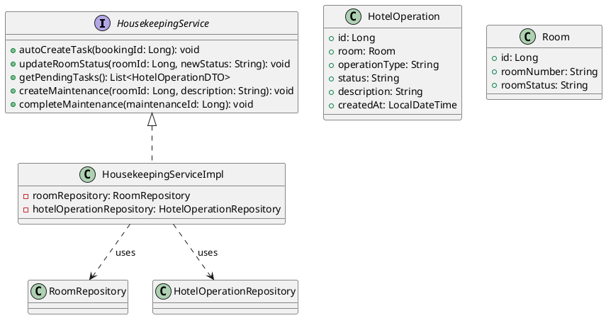
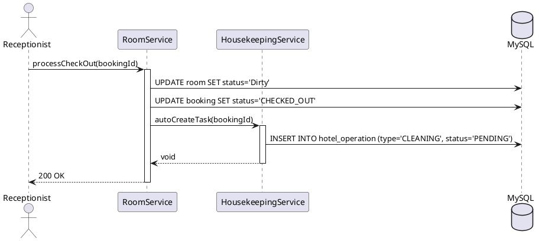
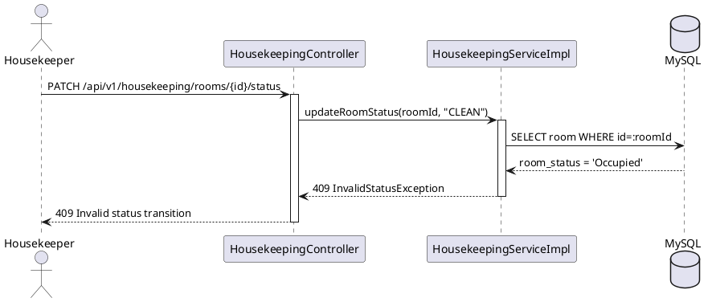
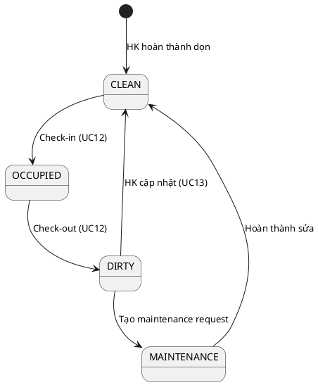

# ENGINEERING DOCUMENTATION STANDARD (EDS) v2.0

## UC13 — Quản lý sơ đồ phòng vật lý (HousekeepingService)

| Field | Value |
|-------|-------|
| **Document ID** | `KAWAI-EDS-MOD2-UC13-001` |
| **Version** | 1.0 |
| **Date** | 2026-06-14 |
| **Status** | Approved |
| **Document Owner** | Chu Xuân Dũng |
| **Author** | Chu Xuân Dũng — Developer |
| **Reviewed by** | Nguyễn Xuân Lưu — Tech Lead |
| **DPO Sign-off** | `[x] Approved – 2026-06-14 – Chu Xuân Dũng` |
| **Approved by** | `[x] Chu Xuân Dũng – 2026-06-14` |
| **Last Review** | 2026-06-14 |
| **Based on EDS** | v2.0 |

---

### CHANGELOG
| Ngày | Người thực hiện | Nội dung thay đổi |
|------|-----------------|-------------------|
| 2026-06-14 | Chu Xuân Dũng | Tạo tài liệu lần đầu |

---

### MỤC LỤC
1. [Tổng quan Module](#1)
2. [Ma trận Truy vết](#2)
3. [ADR](#3)
4. [Non-Functional & SLA](#4)
5. [Static Modeling](#5)
6. [Dynamic Modeling](#6)
7. [Domain Event Catalog](#7)
8. [Interface Specification](#8)
9. [API Specification](#9)
10. [Bảng mã lỗi](#10)
11. [Quy trình Triển khai](#11)
12. [Rollback & Incident Runbook](#12)
13. [Kịch bản Kiểm thử](#13)
14. [Phương pháp Xác minh](#14)
15. [Mẫu thử thực tế](#15)
16. [Authorization Matrix](#16)
17. [Phụ lục](#17)

---

### 1. Tổng quan Module

| Field | Value |
|-------|-------|
| **Module Name** | Quản lý sơ đồ phòng vật lý (UC13) |
| **Bounded Context** | Đặt phòng & Tiền sảnh vận hành |
| **Use Case** | UC13: Housekeeping quản lý trạng thái phòng, auto-task dọn, maintenance |
| **Data Classification** | Internal |
| **Compliance Scope** | — |
| **Upstream Dependencies** | UC12 (Check-in/out) |
| **Downstream Consumers** | Receptionist UI, Housekeeping mobile app |

---

### 2. Ma trận Truy vết (Traceability Matrix)

| Requirement ID | Loại | Mô tả yêu cầu | Thành phần Code | Compliance | ADR |
|----------------|------|---------------|-----------------|------------|-----|
| UC13.1 | US | Auto task dọn sau check-out | `HousekeepingService.autoCreateTask()` | — | ADR-001 |
| UC13.2 | US | HK cập nhật DIRTY → CLEAN | `HousekeepingService.updateRoomStatus()` | — | ADR-001 |
| UC13.3 | US | Xem ds pending tasks | `HousekeepingService.getPendingTasks()` | — | — |
| UC13.4 | US | Tạo maintenance | `HousekeepingService.createMaintenance()` | — | — |
| UC13.5 | US | Maintenance → Available | `HousekeepingService.completeMaintenance()` | — | — |

---

### 3. Architecture Decision Records (ADR)

#### ADR-001 — Quản lý Trạng thái Phòng & Buồng phòng

| Field | Value |
|-------|-------|
| **Status** | Accepted |
| **Deciders** | Nguyễn Xuân Lưu + Chu Xuân Dũng |
| **Date** | 2026-06-12 |

**Bối cảnh (Context):** Kiểm soát trạng thái phòng vật lý (Dirty, Clean, Occupied, Maintenance) để đảm bảo lễ tân không giao nhầm phòng chưa dọn cho khách.

**Các phương án đã xem xét:**

| Phương án | Mô tả | Ưu điểm | Nhược điểm |
|-----------|-------|---------|------------|
| **A** | Cập nhật thủ công qua API | Đơn giản | Nhân viên dễ quên |
| **B** | Tự động chuyển DIRTY khi Checkout + HK cập nhật CLEAN | Chính xác, real-time | Phức tạp hơn |

**Quyết định (Decision):** Chọn Phương án **B**.

**Hệ quả:** Trạng thái phòng cập nhật tự động, giảm sai sót thủ công.

---

### 4. Non-Functional Requirements & SLA

#### 4.1. Performance & Availability

| Category | Requirement | Target SLA | Measurement Method |
|----------|-------------|------------|-------------------|
| **Latency** | API response (p99) | < 300ms | k6 load test |
| **Availability** | Uptime (monthly) | 99.9% | Uptime monitor |
| **Throughput** | Concurrent requests | 100 req/s | Load test |

#### 4.2. Data Integrity

| Category | Requirement | Target | Verification |
|----------|-------------|--------|-------------|
| **Consistency** | Room status phải đồng bộ với HotelOperation task | 0% lỗi | DB constraint |

#### 4.3. Security

| Category | Requirement | Target | Verification |
|----------|-------------|--------|-------------|
| **Access control** | Least privilege | — | Auth Matrix (§16) |

---

### 5. Static Modeling (Mô hình Tĩnh)

#### 5.1. Class Diagram (PlantUML)



#### 5.2. Data Structure

```sql
CREATE TABLE hotel_operation (
    id BIGINT AUTO_INCREMENT PRIMARY KEY,
    room_id BIGINT NOT NULL,
    operation_type VARCHAR(30) NOT NULL,
    status VARCHAR(20) DEFAULT 'PENDING',
    description TEXT,
    created_at TIMESTAMP DEFAULT CURRENT_TIMESTAMP,
    completed_at TIMESTAMP NULL,
    FOREIGN KEY (room_id) REFERENCES room(id)
);

CREATE INDEX idx_hotel_op_status ON hotel_operation(status);
CREATE INDEX idx_hotel_op_room ON hotel_operation(room_id);
```

---

### 6. Dynamic Modeling (Mô hình Động)

#### 6.1. Sequence Diagram — Happy Path: Auto Task sau Check-out



#### 6.2. Sequence Diagram — Error Path: Update status không hợp lệ



#### 6.3. State Machine



> **Invariant:** Phòng DIRTY/MAINTENANCE không được phép check-in.

---

### 7. Domain Event Catalog

#### 7.1. Events Published

| Event Name | Trigger | Publisher | Subscriber(s) | Async? |
|------------|---------|-----------|---------------|--------|
| `RoomStatusChanged` | Trạng thái phòng thay đổi | `HousekeepingService` | `ReceptionistService`, `AnalyticsService` | Yes |
| `MaintenanceCreated` | Tạo maintenance | `HousekeepingService` | `MaintenanceTeam` | Yes |

#### 7.2. Events Consumed

| Event Name | Source | Handler | Action |
|------------|--------|---------|--------|
| `RoomCheckedOut` | UC12 | `HousekeepingService` | Auto-create CLEANING task |

#### 7.3. Payload Schema

```typescript
export interface RoomStatusChangedEvent {
  eventId: string;
  eventType: 'RoomStatusChanged';
  occurredAt: string;
  version: '1.0';
  payload: {
    roomId: number;
    roomNumber: string;
    oldStatus: string;
    newStatus: string;
    changedBy: string;
  };
  metadata: { correlationId: string; };
}
```

---

### 8. Interface Specification (Đặc tả Giao diện)

> **Policy:** Mỗi interface phải khai báo `@version`. Breaking change phải tạo ADR mới.

#### 8.1. Service Interface

```java
// HousekeepingService.java
// @version 1.0

public interface HousekeepingService {
    void autoCreateTask(Long bookingId);
    void updateRoomStatus(Long roomId, String newStatus);
    List<HotelOperationDTO> getPendingTasks();
    void createMaintenance(Long roomId, String description);
    void completeMaintenance(Long maintenanceId);
}
```

#### 8.2. Repository Interface

```java
// @version 1.0
public interface HotelOperationRepository extends JpaRepository<HotelOperation, Long> {
    @Query("SELECT h FROM HotelOperation h WHERE h.status = 'PENDING' ORDER BY h.createdAt ASC")
    List<HotelOperation> findPendingTasks();
}
```

#### 8.3. DTOs

```java
public class HotelOperationDTO {
    private Long id;
    private String roomNumber;
    private String operationType;
    private String status;
    private String description;
    private LocalDateTime createdAt;
}
```

---

### 9. API Specification

#### 9.1. Endpoints Table

| Method | Path | Auth Level | Required Roles | Rate Limit | Idempotent? |
|--------|------|------------|----------------|------------|-------------|
| GET | `/api/v1/housekeeping/tasks` | JWT Bearer | HOUSEKEEPING, ADMIN | 60/min | Yes |
| PATCH | `/api/v1/housekeeping/rooms/{id}/status` | JWT Bearer | HOUSEKEEPING, ADMIN | 30/min | No |
| POST | `/api/v1/housekeeping/maintenance` | JWT Bearer | HOUSEKEEPING, ADMIN | 20/min | No |
| PATCH | `/api/v1/housekeeping/maintenance/{id}/complete` | JWT Bearer | HOUSEKEEPING, ADMIN | 20/min | No |

#### 9.2. Request / Response

**GET `/api/v1/housekeeping/tasks`**

*Response 200:*
```json
{
  "tasks": [
    {
      "id": 1,
      "roomNumber": "R101",
      "operationType": "CLEANING",
      "status": "PENDING",
      "description": "Post-checkout cleaning",
      "createdAt": "2026-06-14T10:30:00"
    }
  ]
}
```

**PATCH `/api/v1/housekeeping/rooms/{id}/status`**

*Request Body:*
```json
{"status": "CLEAN"}
```

*Response 200:*
```json
{"roomId": 1, "roomNumber": "R101", "newStatus": "VACANT_CLEAN"}
```

*Response 409:*
```json
{"error": {"code": "MOD2-006", "message": "Invalid room status transition"}}
```

---

### 10. Bảng mã lỗi (Error Codes)

| Code | HTTP Status | Message (EN) | Message (VI) | Trigger Condition |
|------|-------------|--------------|--------------|-------------------|
| `MOD2-001` | 400 | Validation failed | Dữ liệu không hợp lệ | Thiếu roomId, status |
| `MOD2-003` | 404 | Room not found | Không tìm thấy phòng | roomId không tồn tại |
| `MOD2-005` | 500 | Internal error | Lỗi hệ thống | Lỗi DB |
| `MOD2-006` | 409 | Invalid status transition | Chuyển trạng thái không hợp lệ | DIRTY → OCCUPIED |

---

### 11. Quy trình Triển khai

#### 11.1. Prerequisites
- [x] ADR-001 Approved
- [x] UC12 Check-in/Check-out đã hoạt động

#### 11.2. Deployment
```bash
mvn clean package -DskipTests
java -jar target/kawai-backend-1.0.jar --spring.profiles.active=staging
```

#### 11.3. Verification
```bash
curl -X GET http://localhost:8080/api/v1/housekeeping/tasks \
  -H "Authorization: Bearer [HOUSEKEEPING_TOKEN]"
```

---

### 12. Rollback & Incident Runbook

| Điều kiện | Ngưỡng | Người quyết định |
|-----------|--------|-------------------|
| Task không tự động tạo | > 5 lần trong 5 phút | On-call Engineer |
| Room status không đồng bộ | Bất kỳ case nào | Tech Lead |

**Rollback:** `git checkout tags/v1.0.0 && mvn clean package`

---

### 13. Kịch bản Kiểm thử Chi tiết

**[Policy]** Test Data Classification: SYNTHETIC. ❌ KHÔNG dùng Production PII.

#### 13.1. Unit Tests

**TC-UNIT-UC13-001 — Auto task dọn sau check-out**
* **Feature:** `HousekeepingService.autoCreateTask()`
* **Scenario:** Given booking BK-1001 CHECKED_OUT, room R101 DIRTY → When autoCreateTask → Then HotelOperation type=CLEANING, status=PENDING

**TC-UNIT-UC13-002 — DIRTY → CLEAN**
* **Scenario:** Given room R101 DIRTY → When updateRoomStatus("CLEAN") → Then room = VACANT_CLEAN

**TC-UNIT-UC13-003 — getPendingTasks()**
* **Scenario:** Given 2 tasks PENDING + 1 COMPLETED → When getPendingTasks → Then 2 tasks returned

**TC-UNIT-UC13-004 — createMaintenance**
* **Scenario:** Given room R103 CLEAN → When createMaintenance("Broken AC") → Then room = MAINTENANCE

**TC-UNIT-UC13-005 — completeMaintenance**
* **Scenario:** Given room R103 MAINTENANCE → When completeMaintenance → Then room = VACANT_CLEAN

#### 13.2. E2E Tests

**TC-E2E-UC13-001 — Housekeeper xem tasks**
* Given JWT housekeeper → When GET /api/v1/housekeeping/tasks → Then 200 + tasks

---

### 14. Phương pháp Xác minh

```sql
SELECT r.room_number, r.room_status, h.operation_type, h.status
FROM room r
LEFT JOIN hotel_operation h ON r.id = h.room_id AND h.status = 'PENDING'
WHERE r.room_status IN ('Dirty', 'Maintenance');
```

---

### 15. Mẫu thử thực tế

```bash
# Xem tasks pending
curl -X GET https://api.kawairesort.com/api/v1/housekeeping/tasks \
  -H "Authorization: Bearer [HOUSEKEEPING_TOKEN]"

# Cập nhật trạng thái phòng
curl -X PATCH https://api.kawairesort.com/api/v1/housekeeping/rooms/1/status \
  -H "Authorization: Bearer [HOUSEKEEPING_TOKEN]" \
  -H "Content-Type: application/json" \
  -d '{"status": "CLEAN"}'
```

---

### 16. Authorization Matrix

| Endpoint | GUEST | CUSTOMER | RECEPTIONIST | ADMIN | HOUSEKEEPING |
|----------|:-----:|:--------:|:------------:|:-----:|:------------:|
| GET `/api/v1/housekeeping/tasks` | ❌ | ❌ | ❌ | ✔️ | ✔️ |
| PATCH `/api/v1/housekeeping/rooms/{id}/status` | ❌ | ❌ | ❌ | ✔️ | ✔️ |
| POST `/api/v1/housekeeping/maintenance` | ❌ | ❌ | ❌ | ✔️ | ✔️ |
| PATCH `/api/v1/housekeeping/maintenance/{id}/complete` | ❌ | ❌ | ❌ | ✔️ | ✔️ |

---

### PHỤ LỤC

#### A. Glossary

| Thuật ngữ | Định nghĩa |
|-----------|------------|
| **HotelOperation** | Task dọn phòng hoặc bảo trì |
| **CLEANING** | Loại task dọn phòng sau check-out |
| **MAINTENANCE** | Loại task bảo trì sửa chữa |
| **DIRTY** | Phòng cần dọn sau khi khách trả |

#### B. Tài liệu tham chiếu

| Document | Path |
|----------|------|
| TDD UC13 | `06-Testing/mod2_booking/uc13/TDD_UC13_SPEC.md` |
| ADR-001 | `06-Testing/MASTER_EDS_SPEC.md` |
| Database Schema | `03-Design/database_schema.md` |

---

*EDS v2.0 — Áp dụng ngay lập tức cho toàn bộ repo.*