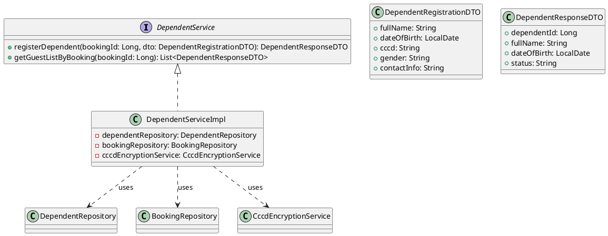
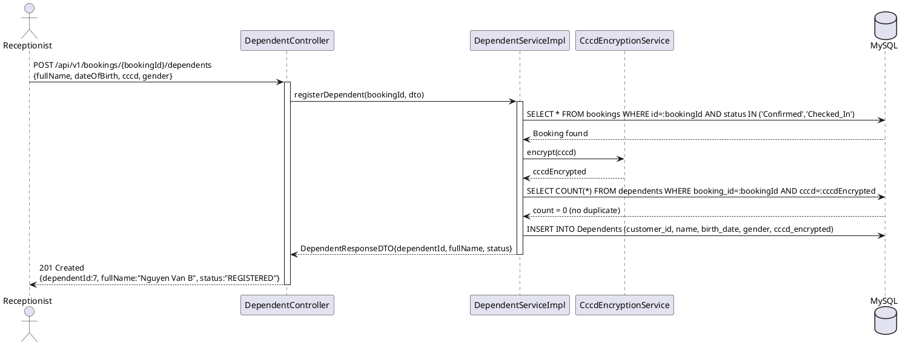
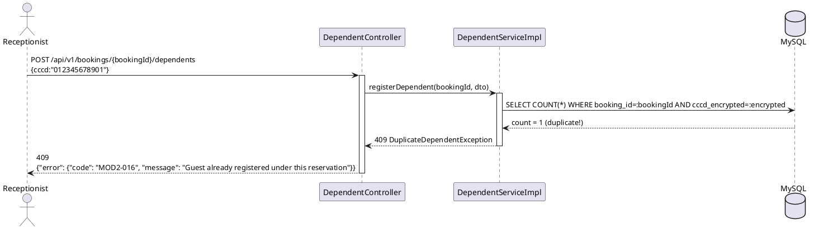
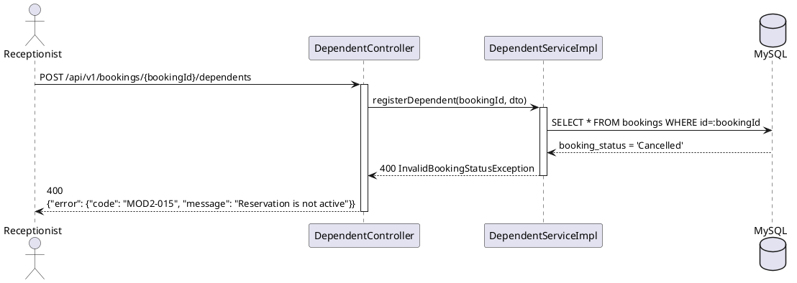
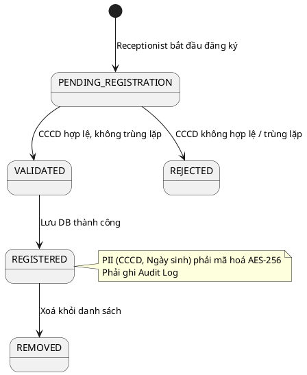

# ENGINEERING DOCUMENTATION STANDARD (EDS) v2.0

## UC16 — Register Accompanying Guests (DependentService)

| Field                    | Value                                                  |
| ------------------------ | ------------------------------------------------------ |
| **Document ID**    | `KAWAI-EDS-MOD2-UC16-001`                            |
| **Version**        | 1.0                                                    |
| **Date**           | 2026-06-18                                             |
| **Status**         | Approved                                               |
| **Document Owner** | Chu Xuân Dũng                                        |
| **Author**         | Chu Xuân Dũng — Developer                           |
| **Reviewed by**    | Nguyễn Xuân Lưu — Tech Lead                        |
| **DPO Sign-off**   | `[ ] Pending`                                        |
| **Approved by**    | `[ ] Pending`                                        |
| **Last Review**    | 2026-06-18*(stale nếu > 2 sprints không cập nhật)* |
| **Based on EDS**   | v2.0                                                   |

---

### CHANGELOG

| Ngày      | Người thực hiện | Nội dung thay đổi                                             |
| ---------- | ------------------- | ---------------------------------------------------------------- |
| 2026-06-18 | Chu Xuân Dũng     | Tạo tài liệu lần đầu cho UC16 Register Accompanying Guests |

---

### MỤC LỤC

1. [Tổng quan Module](#1)
2. [Ma trận Truy vết](#2)
3. [ADR](#3)
4. [Non-Functional &amp; SLA](#4)
5. [Static Modeling](#5)
6. [Dynamic Modeling](#6)
7. [Domain Event Catalog](#7)
8. [Interface Specification](#8)
9. [API Specification](#9)
10. [Bảng mã lỗi](#10)
11. [Quy trình Triển khai](#11)
12. [Rollback &amp; Incident Runbook](#12)
13. [Kịch bản Kiểm thử](#13)
14. [Phương pháp Xác minh](#14)
15. [Mẫu thử thực tế](#15)
16. [Authorization Matrix](#16)
17. [Phụ lục](#17)

---

### 1. Tổng quan Module

| Field                           | Value                                                                                                                                                              |
| ------------------------------- | ------------------------------------------------------------------------------------------------------------------------------------------------------------------ |
| **Module Name**           | Register Accompanying Guests (UC16)                                                                                                                                |
| **Bounded Context**       | Đặt phòng & Tiền sảnh vận hành                                                                                                                              |
| **Use Case**              | UC16: Lễ tân đăng ký khách đi kèm (dependent) cho một reservation đang Confirmed hoặc Checked-In, lưu thông tin tạm trú và liên kết vào Booking |
| **Data Classification**   | PII (Họ tên, Ngày sinh, CCCD/Hộ chiếu)                                                                                                                        |
| **Compliance Scope**      | Nghị định 13/2023/NĐ-CP (Bảo vệ dữ liệu cá nhân), Luật Cư trú 2020 (khai báo tạm trú)                                                              |
| **Upstream Dependencies** | UC13 (Check-in), UC14 (Walk-in Check-in)                                                                                                                           |
| **Downstream Consumers**  | UC17 (Authorize Dependent Service Access), Module 5 (Folio)                                                                                                        |

---

### 2. Ma trận Truy vết (Traceability Matrix)

| Requirement ID | Loại | Mô tả yêu cầu                                                           | Thành phần Code                        | Compliance                                | ADR     |
| -------------- | ----- | --------------------------------------------------------------------------- | ---------------------------------------- | ----------------------------------------- | ------- |
| UC16.1         | US    | Đăng ký khách đi kèm mới vào reservation đang hoạt động         | `DependentService.registerDependent()` | Nghị định 13/2023, Luật Cư trú 2020 | —      |
| UC16.3         | US    | Ngăn chặn đăng ký trùng lặp cùng một khách trong một reservation | `DependentService.registerDependent()` | —                                        | ADR-002 |
| BR-SYS-01      | BR    | CCCD/Hộ chiếu phải mã hoá AES-256 trước khi lưu DB                  | `CccdEncryptionService.encrypt()`      | Nghị định 13/2023                      | —      |

---

### 3. Architecture Decision Records (ADR)

#### ADR-002 — Kiểm tra trùng lặp Dependent trong cùng Reservation

| Field              | Value                                |
| ------------------ | ------------------------------------ |
| **Status**   | Accepted                             |
| **Deciders** | Nguyễn Xuân Lưu + Chu Xuân Dũng |
| **Date**     | 2026-06-18                           |

**Bối cảnh (Context):** Một khách (CCCD X) không được xuất hiện 2 lần trong cùng một Booking để tránh ghi tạm trú sai.

**Quyết định (Decision):** Khi đăng ký dependent, hệ thống truy vấn `Dependents` table theo `booking_id + cccd_encrypted`. Nếu bản ghi đã tồn tại → ném `DuplicateDependentException`.

**Hệ quả:** Đảm bảo tính toàn vẹn dữ liệu tạm trú, tránh xung đột khi xuất báo cáo.

---

### 4. Non-Functional Requirements & SLA

#### 4.1. Performance & Availability

| Category               | Requirement         | Target SLA | Measurement Method |
| ---------------------- | ------------------- | ---------- | ------------------ |
| **Latency**      | API response (p99)  | < 200ms    | k6 load test       |
| **Availability** | Uptime (monthly)    | 99.9%      | Uptime monitor     |
| **Throughput**   | Concurrent requests | 50 req/s   | Load test          |

#### 4.2. Data Integrity

| Category                  | Requirement                                                    | Target      | Verification                         |
| ------------------------- | -------------------------------------------------------------- | ----------- | ------------------------------------ |
| **ACID**            | Đăng ký dependent và cập nhật guest count phải atomic   | RPO = 0     | `@Transactional` + Transaction log |
| **Duplicate Guard** | Không được tồn tại 2 bản ghi cùng CCCD trong 1 booking | 0 duplicate | DB unique constraint check           |

#### 4.3. Security & Compliance

| Category                   | Requirement                                    | Target | Verification        |
| -------------------------- | ---------------------------------------------- | ------ | ------------------- |
| **Encryption (PII)** | CCCD/Hộ chiếu mã hoá AES-256               | 100%   | DB field inspection |
| **Access Control**   | Chỉ Receptionist/Admin                        | —     | Auth Matrix (§16)  |
| **Audit Log**        | Mọi hành động CRUD Dependent ghi audit log | 100%   | AOP interceptor     |

---

### 5. Static Modeling (Mô hình Tĩnh)

#### 5.1. Class Diagram (PlantUML)



#### 5.2. Data Structure

```sql
-- Dependent table schema (relevant fields)
-- Dependents (dependent_id, customer_id, dependent_name, birth_date, gender, cccd_passport_encrypted)

-- Register new dependent linked to a booking customer
INSERT INTO Dependents (customer_id, dependent_name, birth_date, gender, cccd_passport_encrypted)
VALUES (:customerId, :fullName, :birthDate, :gender, AES_ENCRYPT(:cccd, :key));

-- Check for duplicate dependent in same booking
SELECT COUNT(*) FROM Dependents d
JOIN Customers c ON d.customer_id = c.customer_id
JOIN Room_Bookings rb ON rb.booking_id = :bookingId
WHERE c.customer_id = rb.customer_id
AND d.cccd_passport_encrypted = AES_ENCRYPT(:cccd, :key);

-- Update guest count in booking detail
UPDATE Room_Booking_Details
SET number_of_adults = :adultCount, number_of_children = :childCount
WHERE detail_id = :detailId;
```

---

### 6. Dynamic Modeling (Mô hình Động)

#### 6.1. Sequence Diagram — Happy Path: Đăng ký Accompanying Guest mới



#### 6.2. Sequence Diagram — Error Path: Trùng lặp Dependent



#### 6.4. Sequence Diagram — Error Path: Reservation không hợp lệ



#### 6.5. State Machine — Guest Registration Lifecycle



> **Invariant:** Reservation phải có trạng thái `Confirmed` hoặc `Checked_In`. Trạng thái `Cancelled`, `Checked_Out` → từ chối đăng ký.

---

### 7. Domain Event Catalog

#### 7.1. Events Published

| Event Name              | Trigger                 | Publisher            | Subscriber(s)       | Async? |
| ----------------------- | ----------------------- | -------------------- | ------------------- | ------ |
| `DependentRegistered` | Đăng ký thành công | `DependentService` | `AuditLogService` | Yes    |

#### 7.2. Events Consumed

| Event Name           | Source | Handler              | Action                                                             |
| -------------------- | ------ | -------------------- | ------------------------------------------------------------------ |
| `BookingCheckedIn` | UC13   | `DependentService` | Kích hoạt luồng đăng ký dependent trong quá trình check-in |
| `WalkInCreated`    | UC14   | `DependentService` | Kích hoạt luồng đăng ký dependent cho walk-in guest          |

#### 7.3. Payload Schema

```typescript
export interface DependentRegisteredEvent {
  eventId: string;
  eventType: 'DependentRegistered';
  occurredAt: string;
  version: '1.0';
  payload: {
    dependentId: number;
    bookingId: number;
    fullName: string;         // PII — không log raw
    dateOfBirth: string;      // PII — không log raw
    cccdEncrypted: string;    // AES-256 encrypted
    registeredBy: string;     // receptionist username
  };
  metadata: { correlationId: string; createdBy: string; };
}
```

---

### 8. Interface Specification (Đặc tả Giao diện)

> **Policy:** Mỗi interface phải khai báo `@version`. Breaking change phải tạo ADR mới.

#### 8.1. Service Interface

```java
// DependentService.java
// @version 1.0

public interface DependentService {

    /**
     * Đăng ký khách đi kèm mới vào reservation.
     * Mã hoá CCCD bằng AES-256 trước khi lưu.
     * @throws InvalidBookingStatusException nếu booking không phải Confirmed/Checked_In
     * @throws DuplicateDependentException nếu CCCD đã đăng ký trong booking này
     * @throws InvalidIdentificationException nếu CCCD/Passport không hợp lệ
     */
    DependentResponseDTO registerDependent(Long bookingId, DependentRegistrationDTO dto);

    /**
     * Lấy danh sách toàn bộ khách đi kèm của một booking.
     */
    List<DependentResponseDTO> getGuestListByBooking(Long bookingId);
}
```

#### 8.2. Repository Interface

```java
// @version 1.0
public interface DependentRepository extends JpaRepository<Dependent, Long> {

    @Query("SELECT d FROM Dependent d WHERE d.customer.id = :customerId")
    List<Dependent> findByCustomerId(@Param("customerId") Long customerId);

    @Query(value = "SELECT COUNT(*) FROM Dependents d " +
           "JOIN Customers c ON d.customer_id = c.customer_id " +
           "JOIN Room_Bookings rb ON rb.customer_id = c.customer_id " +
           "WHERE rb.booking_id = :bookingId AND d.cccd_passport_encrypted = :cccdEncrypted",
           nativeQuery = true)
    int countDuplicateInBooking(@Param("bookingId") Long bookingId,
                                @Param("cccdEncrypted") String cccdEncrypted);
}
```

#### 8.3. DTOs

```java
public class DependentRegistrationDTO {
    @NotBlank private String fullName;
    @NotNull  private LocalDate dateOfBirth;
    @NotBlank private String cccd;           // Raw CCCD — sẽ mã hoá trong Service
    @NotBlank private String gender;
    private String contactInfo;              // Optional
}

public class DependentResponseDTO {
    private Long   dependentId;
    private String fullName;
    private LocalDate dateOfBirth;
    private String status;                   // REGISTERED | AUTHORIZED
}
```

---

### 9. API Specification

#### 9.1. Endpoints Table

| Method | Path                                                      | Auth Level | Required Roles      | Rate Limit | Idempotent? |
| ------ | --------------------------------------------------------- | ---------- | ------------------- | ---------- | ----------- |
| POST   | `/api/v1/bookings/{bookingId}/dependents`               | JWT Bearer | RECEPTIONIST, ADMIN | 30/min     | No          |
| GET    | `/api/v1/bookings/{bookingId}/dependents`               | JWT Bearer | RECEPTIONIST, ADMIN | 60/min     | Yes         |
| DELETE | `/api/v1/bookings/{bookingId}/dependents/{dependentId}` | JWT Bearer | RECEPTIONIST, ADMIN | 20/min     | Yes         |

#### 9.2. Request / Response

**POST `/api/v1/bookings/{bookingId}/dependents` — Đăng ký khách đi kèm mới**

*Request Body:*

```json
{
  "fullName": "Nguyen Van B",
  "dateOfBirth": "1995-08-20",
  "cccd": "034095012345",
  "gender": "Nam",
  "contactInfo": "0901234567"
}
```

*Response 201 (Created):*

```json
{
  "dependentId": 7,
  "fullName": "Nguyen Van B",
  "dateOfBirth": "1995-08-20",
  "status": "REGISTERED"
}
```

*Response 400 (Reservation không hợp lệ):*

```json
{"error": {"code": "MOD2-015", "message": "Reservation is not active (must be Confirmed or Checked_In)"}}
```

*Response 409 (Trùng lặp):*

```json
{"error": {"code": "MOD2-016", "message": "Guest already registered under this reservation"}}
```

*Response 422 (CCCD không hợp lệ):*

```json
{"error": {"code": "MOD2-017", "message": "Invalid identification document"}}
```

---

**GET `/api/v1/bookings/{bookingId}/dependents` — Danh sách khách**

*Response 200 (OK):*

```json
{
  "bookingId": 12,
  "primaryGuest": {"customerId": 2, "fullName": "Tran Thi B", "phone": "0912345678"},
  "accompaningGuests": [
    {"dependentId": 7, "fullName": "Nguyen Van B", "dateOfBirth": "1995-08-20", "status": "REGISTERED"},
    {"dependentId": 8, "fullName": "Le Thi C",     "dateOfBirth": "2010-03-15", "status": "REGISTERED"}
  ],
  "totalGuests": 3
}
```

---

### 10. Bảng mã lỗi (Error Codes)

| Code         | HTTP Status | Message (EN)                    | Message (VI)                         | Trigger Condition                                        |
| ------------ | ----------- | ------------------------------- | ------------------------------------ | -------------------------------------------------------- |
| `MOD2-001` | 400         | Validation failed               | Dữ liệu không hợp lệ            | Thiếu trường bắt buộc (fullName, dateOfBirth, cccd) |
| `MOD2-003` | 404         | Booking not found               | Không tìm thấy booking            | bookingId không tồn tại                               |
| `MOD2-015` | 400         | Reservation is not active       | Reservation không hoạt động      | Booking trạng thái Cancelled / Checked_Out             |
| `MOD2-016` | 409         | Duplicate guest registration    | Khách đã được đăng ký       | CCCD đã tồn tại trong booking này                   |
| `MOD2-017` | 422         | Invalid identification document | Giấy tờ tùy thân không hợp lệ | Định dạng CCCD sai / không đủ ký tự              |
| `MOD2-005` | 500         | Internal error                  | Lỗi hệ thống                      | Lỗi DB hoặc lỗi mã hoá AES                          |

---

### 11. Quy trình Triển khai

#### 11.1. Prerequisites

- [X] UC13 (Check-in) đã hoạt động
- [X] UC14 (Walk-in Check-in) đã hoạt động
- [X] AES-256 encryption service đã cấu hình (`CccdEncryptionService`)
- [X] `Dependents` table tồn tại trong schema

#### 11.2. Deployment

```bash
mvn clean package -DskipTests
java -jar target/kawai-backend-1.0.jar --spring.profiles.active=staging
```

#### 11.3. Verification

```bash
# Đăng ký khách đi kèm
curl -X POST http://localhost:8080/api/v1/bookings/12/dependents \
  -H "Authorization: Bearer [RECEPTIONIST_JWT]" \
  -H "Content-Type: application/json" \
  -d '{"fullName":"Nguyen Van B","dateOfBirth":"1995-08-20","cccd":"034095012345","gender":"Nam"}'
```

---

### 12. Rollback & Incident Runbook

| Điều kiện                          | Ngưỡng               | Người quyết định |
| ------------------------------------- | ---------------------- | --------------------- |
| Đăng ký duplicate không bị chặn | Bất kỳ 1 case        | Tech Lead             |
| PII bị lưu plaintext                | Bất kỳ 1 case        | DPO + Tech Lead       |
| API lỗi liên tục                   | > 5 lỗi trong 5 phút | On-call Engineer      |

**Rollback:**

```bash
git checkout -- src/main/java/com/kawai/services/impl/DependentServiceImpl.java
mvn clean package && java -jar target/kawai-backend-1.0.jar
```

---

### 13. Kịch bản Kiểm thử Chi tiết

**[Policy]** Test Data Classification: SYNTHETIC. ❌ KHÔNG dùng Production PII.

#### 13.1. Unit Tests

**TC-UNIT-UC16-001 — Đăng ký khách đi kèm thành công**

* **Feature:** `DependentService.registerDependent()`
* **Scenario: Happy path**
  * Given booking BK-12 trạng thái `Confirmed`, không có dependent nào trùng CCCD
  * When `registerDependent(12, {fullName:"Nguyen Van B", dateOfBirth:"1995-08-20", cccd:"034095012345", gender:"Nam"})` được gọi
  * Then bản ghi Dependent được tạo trong DB, CCCD lưu dạng AES-256 encrypted, trả về `dependentId`

**TC-UNIT-UC16-002 — Đăng ký thất bại: Booking trạng thái không hợp lệ (Cancelled)**

* **Scenario: Invalid booking status**
  * Given booking BK-99 trạng thái `Cancelled`
  * When `registerDependent(99, dto)` được gọi
  * Then throw `InvalidBookingStatusException` với code `MOD2-015`

**TC-UNIT-UC16-003 — Đăng ký thất bại: Trùng lặp CCCD trong cùng Booking**

* **Scenario: Duplicate detection**
  * Given booking BK-12 đã có dependent CCCD `034095012345`
  * When `registerDependent(12, {cccd:"034095012345"})` được gọi lần 2
  * Then throw `DuplicateDependentException` với code `MOD2-016`

**TC-UNIT-UC16-004 — Đăng ký thất bại: CCCD không hợp lệ (định dạng sai)**

* **Scenario: Invalid CCCD format**
  * Given CCCD là `"123"` (không đủ 12 ký tự)
  * When `registerDependent(12, {cccd:"123"})` được gọi
  * Then throw `InvalidIdentificationException` với code `MOD2-017`

**TC-UNIT-UC16-005 — Đăng ký thành công sau khi Check-in (booking = Checked_In)**

* **Scenario: Register dependent after check-in**
  * Given booking BK-12 trạng thái `Checked_In`
  * When `registerDependent(12, dto)` được gọi
  * Then đăng ký thành công (AF-02 theo SRS)

**TC-UNIT-UC16-006 — Liên kết khách đã có trong hệ thống**

* **Feature:** `DependentService.linkExistingDependent()`
* **Scenario: Reuse existing guest profile**
  * Given Customer ID 5 tồn tại, chưa được liên kết với booking BK-12
  * When `linkExistingDependent(12, 5)` được gọi
  * Then tạo liên kết thành công, trả về 200

**TC-UNIT-UC16-007 — Liên kết thất bại: Customer không tồn tại**

* **Scenario: Customer not found**
  * Given Customer ID 9999 không tồn tại
  * When `linkExistingDependent(12, 9999)` được gọi
  * Then throw `CustomerNotFoundException` với code `MOD2-018`

**TC-UNIT-UC16-008 — Liên kết thất bại: Đã liên kết (duplicate link)**

* **Scenario: Already linked**
  * Given Customer ID 5 đã được liên kết với booking BK-12
  * When `linkExistingDependent(12, 5)` được gọi lần 2
  * Then throw `DuplicateDependentException` với code `MOD2-016`

**TC-UNIT-UC16-009 — CCCD phải được mã hoá AES-256 trước khi lưu DB**

* **Scenario: PII encryption check**
  * Given CCCD raw = `"034095012345"`
  * When `registerDependent()` hoàn tất
  * Then giá trị trong DB tại cột `cccd_passport_encrypted` KHÔNG phải plaintext
  * And `CccdEncryptionService.encrypt()` được gọi đúng 1 lần

**TC-UNIT-UC16-010 — Booking không tìm thấy**

* **Scenario: Booking not found**
  * Given bookingId = 9999 không tồn tại trong DB
  * When `registerDependent(9999, dto)` được gọi
  * Then throw `BookingNotFoundException` với code `MOD2-003`

#### 13.2. Integration & E2E Tests

**TC-E2E-UC16-001 — Đăng ký khách đi kèm qua API**

* Given JWT của receptionist, booking BK-12 Confirmed
* When POST `/api/v1/bookings/12/dependents` với body hợp lệ
* Then 201 Created + `dependentId` trả về
* And kiểm tra DB: bản ghi trong `Dependents` tồn tại, CCCD không plaintext

**TC-E2E-UC16-002 — Đăng ký 2 dependents liên tiếp cho cùng 1 booking**

* Given JWT của receptionist, booking BK-12 Confirmed, chưa có dependent
* When POST `/api/v1/bookings/12/dependents` lần 1 với CCCD-A → 201
* And POST `/api/v1/bookings/12/dependents` lần 2 với CCCD-B → 201
* Then GET `/api/v1/bookings/12/dependents` trả về `totalGuests = 3` (1 primary + 2 dependents)

---

### 14. Phương pháp Xác minh

```sql
-- Verify dependent registered
SELECT d.dependent_id, d.dependent_name, d.birth_date, d.gender,
       d.cccd_passport_encrypted IS NOT NULL AS cccd_encrypted
FROM Dependents d
JOIN Customers c ON d.customer_id = c.customer_id
JOIN Room_Bookings rb ON rb.customer_id = c.customer_id
WHERE rb.booking_id = :bookingId;

-- Verify no duplicate CCCD in same booking
SELECT cccd_passport_encrypted, COUNT(*) as cnt
FROM Dependents d
JOIN Customers c ON d.customer_id = c.customer_id
JOIN Room_Bookings rb ON rb.customer_id = c.customer_id
WHERE rb.booking_id = :bookingId
GROUP BY cccd_passport_encrypted
HAVING cnt > 1;
-- Expected: Empty result (0 duplicates)

-- Verify audit log entry exists
SELECT * FROM Audit_Logs
WHERE table_name = 'Dependents' AND action = 'INSERT'
ORDER BY created_at DESC LIMIT 5;
```

---

### 15. Mẫu thử thực tế

```bash
# Đăng ký khách đi kèm mới
curl -X POST https://api.kawairesort.com/api/v1/bookings/12/dependents \
  -H "Authorization: Bearer [RECEPTIONIST_TOKEN]" \
  -H "Content-Type: application/json" \
  -d '{
    "fullName": "Nguyen Van B",
    "dateOfBirth": "1995-08-20",
    "cccd": "034095012345",
    "gender": "Nam",
    "contactInfo": "0901234567"
  }'
# Expected Response (201):
# {"dependentId": 7, "fullName": "Nguyen Van B", "dateOfBirth": "1995-08-20", "status": "REGISTERED"}

# Lấy danh sách khách
curl -X GET https://api.kawairesort.com/api/v1/bookings/12/dependents \
  -H "Authorization: Bearer [RECEPTIONIST_TOKEN]"
# Expected Response (200): danh sách dependents

# Thử trùng lặp → expect 409
curl -X POST https://api.kawairesort.com/api/v1/bookings/12/dependents \
  -H "Authorization: Bearer [RECEPTIONIST_TOKEN]" \
  -H "Content-Type: application/json" \
  -d '{"fullName": "Nguyen Van B", "dateOfBirth": "1995-08-20", "cccd": "034095012345", "gender": "Nam"}'
# Expected Response (409):
# {"error": {"code": "MOD2-016", "message": "Guest already registered under this reservation"}}
```

---

### 16. Authorization Matrix

| Endpoint                                            | GUEST | CUSTOMER | RECEPTIONIST | ADMIN | HOUSEKEEPING |
| --------------------------------------------------- | :---: | :------: | :----------: | :---: | :----------: |
| POST `/api/v1/bookings/{id}/dependents`           |  ❌  |    ❌    |     ✔️     | ✔️ |      ❌      |
| GET `/api/v1/bookings/{id}/dependents`            |  ❌  |    ❌    |     ✔️     | ✔️ |      ❌      |
| DELETE `/api/v1/bookings/{id}/dependents/{depId}` |  ❌  |    ❌    |     ✔️     | ✔️ |      ❌      |

---

### PHỤ LỤC

#### A. Glossary

| Thuật ngữ                   | Định nghĩa                                                                 |
| ----------------------------- | ----------------------------------------------------------------------------- |
| **Accompanying Guest**  | Khách đi kèm với khách chính trong cùng một reservation               |
| **Dependent**           | Tên trong hệ thống DB cho khách đi kèm, lưu trong bảng `Dependents` |
| **Temporary Residence** | Khai báo tạm trú theo Luật Cư trú 2020                                  |
| **AES-256**             | Chuẩn mã hoá đối xứng dùng để bảo vệ PII (CCCD/Hộ chiếu)         |
| **Primary Guest**       | Khách hàng chính đứng tên đặt phòng trong bảng `Customers`        |

#### B. Business Rules áp dụng

| Rule ID             | Nội dung                                                                                     |
| ------------------- | --------------------------------------------------------------------------------------------- |
| **BR-FO-07**  | Chỉ khách đã đăng ký là dependent mới được cấp quyền dịch vụ (UC17)           |
| **BR-SYS-01** | CCCD/Hộ chiếu phải mã hoá AES-256 trước khi lưu DB                                    |
| **BR-SYS-04** | Mọi hành động CRUD Dependent phải ghi Audit Log                                          |
| **BR-SYS-06** | Dữ liệu cá nhân chỉ dùng cho mục đích quản lý lưu trú và tuân thủ pháp luật |

#### C. Tài liệu tham chiếu

| Document        | Path                                                                  |
| --------------- | --------------------------------------------------------------------- |
| TDD UC16        | `06-Testing/mod2_booking/uc16/TDD_UC16_SPEC.md`                     |
| SRS UC16        | `06-Testing/mod2_booking/SRS_Document_SWP391_G2.docx.md` (§2.1.16) |
| EDS Master      | `06-Testing/MASTER_EDS_SPEC.md`                                     |
| Database Schema | `03-Design/database_schema.md`                                      |

---

*EDS v2.0 — UC16 Register Accompanying Guests*
