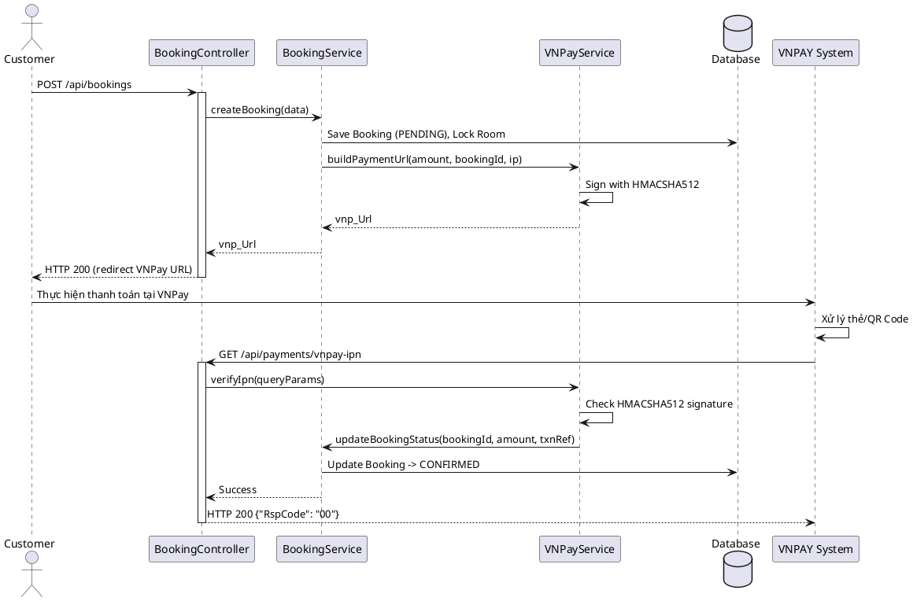
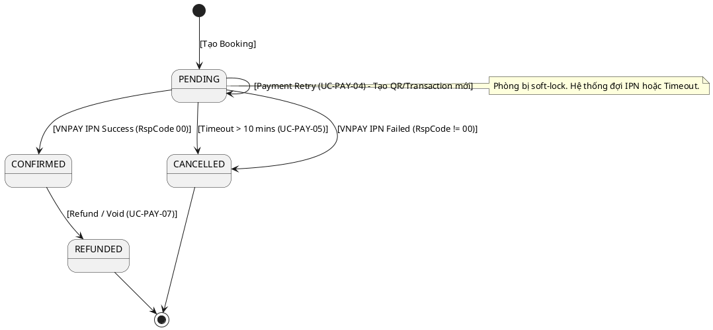

# ENGINEERING DOCUMENTATION STANDARD (EDS) v2.0

## Quy chuẩn Tài liệu Kỹ thuật và Đặc tả Hiện thực hóa

| Field                    | Value                                                                                       |
| ------------------------ | ------------------------------------------------------------------------------------------- |
| **Document ID**    | `BOOKING-PAY-IMP-001`                                                            |
| **Version**        | 2.0                                                                                         |
| **Date**           | 2026-06-15                                                                                  |
| **Status**         | Approved                                               |
| **Document Owner** | Chu Xuân Dũng                                                    |
| **Author**         | Chu Xuân Dũng                                                                           |
| **Reviewed by**    | Nguyễn Xuân Lưu                                                                             |
| **DPO Sign-off**   | `[x] Approved` |
| **Approved by**    | Nguyễn Xuân Lưu                                                                   |
| **Last Review**    | 2026-06-15                                    |
| **Based on EDS**   | v2.0                                                                                        |

---

### CHANGELOG

> [!IMPORTANT]
> **Policy 4.4 — Immutable History:** Không bao giờ xóa thông tin cũ. Mọi thay đổi phải ghi vào bảng này.

| Ngày      | Người thực hiện | Nội dung thay đổi       |
| ---------- | ------------------- | -------------------------- |
| 2026-06-15 | Chu Xuân Dũng  | Tạo tài liệu lần đầu - Đặc tả chức năng Payment bằng VNPAY cho UC-10 Book Room |
| 2026-06-15 | `Chu Xuân Dũng`    | Cập nhật ma trận phân quyền: bổ sung quyền gọi Webhook IPN cho VNPAY SYSTEM |
| 2026-06-15 | `Chu Xuân Dũng`    | **[v2.0]** Bổ sung VNPAY Signature Specification, Environment Configuration, Security Notes, VNPay ResponseCode Mapping và cập nhật Data Model PaymentTransaction |

---

### MỤC LỤC

1. [Tổng quan Module](#1-tong-quan-module)
2. [Ma trận Truy vết (Traceability Matrix)](#2-ma-tran-truy-vet-traceability-matrix)
3. [Architecture Decision Records (ADR)](#3-architecture-decision-records-adr)
4. [Non-Functional Requirements & SLA](#4-non-functional-requirements--sla)
5. [Static Modeling (Mô hình Tĩnh)](#5-static-modeling-mo-hinh-tinh)
6. [Dynamic Modeling (Mô hình Động)](#6-dynamic-modeling-mo-hinh-dong)
7. [Domain Event Catalog](#7-domain-event-catalog)
8. [Interface Specification (Đặc tả Giao diện)](#8-interface-specification-dac-ta-giao-dien)
9. [API Specification](#9-api-specification)
10. [Bảng mã lỗi (Error Codes)](#10-bang-ma-loi-error-codes)
11. [Quy trình Triển khai (Step-by-Step)](#11-quy-trinh-trien-khai-step-by-step)
12. [Rollback & Incident Runbook](#12-rollback--incident-runbook)
13. [Kịch bản Kiểm thử Chi tiết](#13-kich-ban-kiem-thu-chi-tiet)
14. [Phương pháp Xác minh](#14-phuong-phap-xac-minh)
15. [Mẫu thử thực tế (API Verification Samples)](#15-mau-thu-thuc-te-api-verification-samples)
16. [Bảng tổng hợp phân quyền (Authorization Matrix)](#16-bang-tong-hop-phan-quyen-authorization-matrix)
17. [VNPAY Signature Specification](#17-vnpay-signature-specification)
18. [Environment Configuration](#18-environment-configuration)
19. [Security Notes](#19-security-notes)
20. [Mapping VNPay ResponseCode](#20-mapping-vnpay-responsecode)

---

### 1. Tổng quan Module

Mô tả ngắn gọn: Module thực thi việc tạo giao dịch thanh toán tiền cọc (deposit) thông qua Cổng thanh toán VNPAY dành cho chức năng **UC-10 Book Room**. Module chịu trách nhiệm sinh URL thanh toán theo đặc tả chuẩn của VNPAY, nhận phản hồi từ webhook (IPN), cập nhật trạng thái Booking và tự động hủy sau 10 phút nếu thanh toán thất bại/chưa thanh toán. Ngoài ra, module bổ sung các use case mở rộng như Payment Retry, Reconciliation và Refund để đảm bảo tính toàn vẹn và linh hoạt trong thanh toán.

| Field                           | Value                                                  |
| ------------------------------- | ------------------------------------------------------ |
| **Module Name**           | `Booking Payment VNPAY`                                      |
| **Bounded Context**       | `Booking & Payment`                                           |
| **Data Classification**   | Confidential / PII |
| **Compliance Scope**      | PCI-DSS (Delegate via Gateway) / N/A                               |
| **Upstream Dependencies** | `Booking Module`                               |
| **Downstream Consumers**  | `Notification Module`, `VNPAY Gateway`                               |

---

### 2. Ma trận Truy vết (Traceability Matrix)

| Requirement ID | Loại (BR/ADR/US) | Mô tả yêu cầu | Thành phần Code                    | Compliance Target | ADR liên quan |
| -------------- | ----------------- | ----------------- | ------------------------------------ | ----------------- | -------------- |
| UC-10          | User Story     | Chuyển hướng VNPay đặt cọc | `VnpayService.createPaymentUrl()` | — | ADR-001 |
| UC-PAY-04      | User Story     | Payment Retry / Regenerate QR | `VnpayService.createPaymentUrl()` | — | — |
| UC-PAY-05      | Alternative Flow | Payment Expiration (Auto Cancel sau 10 phút) | `BookingTimeoutJob` | Giải phóng tài nguyên | ADR-002 |
| UC-PAY-06      | Business Rule  | Payment Reconciliation | `PaymentReconciliationJob` | Data Integrity | — |
| UC-PAY-07      | User Story     | Refund / Void (hủy đơn sau khi pay) | `VnpayService.refund()` | Customer Rights | — |
| VNPAY-IPN      | Business Rule  | IPN Webhook & Checksum HM512 | `VnpayService.verifyIpn()`         | Data Integrity | ADR-001 |
| UC-10 E1       | Exception      | Payment Failure -> Cancel   | `VnpayService.verifyIpn()`         | — | — |
| BR-PAY-01      | Business Rule  | Mỗi PaymentTransaction chỉ được update SUCCESS đúng 1 lần | `PaymentService.updateStatus()` | Idempotency | — |

---

### 3. Architecture Decision Records (ADR)

#### ADR-001 — Sử dụng VNPAY làm cổng thanh toán chính (Version 2.1.0)

| Field                | Value                                           |
| -------------------- | ----------------------------------------------- |
| **Status**     | Accepted   |
| **Deciders**   | Tech Lead, System Architect |
| **Date**       | 2026-06-15                                      |

**Bối cảnh (Context)**
Cần hỗ trợ thanh toán online trong chức năng Book Room, giúp hệ thống tự động xác nhận đơn hàng không cần thao tác thủ công, yêu cầu hỗ trợ thẻ nội địa và QR Code.

**Quyết định (Decision)**
Lựa chọn tích hợp VNPAY theo tài liệu `VNPAY Payment Gateway_Techspec Post method 2.1.0-VN.md`, sử dụng checksum bảo mật `HMACSHA512` thay vì các thuật toán cũ.

**Hệ quả (Consequences)**
* Tích cực: Thanh toán tiện lợi, chuẩn mã hóa mới nhất. Hệ thống không lưu trữ thông tin thẻ ngân hàng của user (delegation to VNPAY).
* Tiêu cực / Trade-offs: Cần expose 1 webhook public (`/vnpay-ipn`) để VNPAY gửi request về. Đòi hỏi cơ chế IP Whitelist hoặc xác thực signature chặt chẽ để tránh bị giả mạo thanh toán.

#### ADR-002 — Soft-lock phòng khi chờ thanh toán

| Field                | Value                                           |
| -------------------- | ----------------------------------------------- |
| **Status**     | Accepted   |
| **Deciders**   | Tech Lead |
| **Date**       | 2026-06-15                                      |

**Bối cảnh (Context)**
Cần ngăn chặn việc overbooking khi có 2 khách hàng đồng thời chọn chung 1 phòng trong lúc chưa hoàn tất thanh toán ở VNPay.

**Quyết định (Decision)**
Khi khách hàng bấm Book, hệ thống tạo Booking (trạng thái `PENDING`) và tạo các `Room_Booking_Details` tương ứng, đồng thời trigger bộ đếm thời gian (10 phút). Nếu quá 10 phút chưa thanh toán thành công, hệ thống chuyển sang `CANCELLED` và giải phóng inventory phòng.

---

### 4. Non-Functional Requirements & SLA

#### 4.1. Performance & Availability

| Category               | Requirement         | Target SLA | Measurement Method |
| ---------------------- | ------------------- | ---------- | ------------------ |
| **Latency**      | API trả URL thanh toán (p99) | < 300ms | Load test       |
| **Availability** | Webhook (IPN)       | 99.9%      | Uptime monitor     |

#### 4.2. Data Integrity & Retention

| Category              | Requirement            | Target  | Verification Method |
| --------------------- | ---------------------- | ------- | ------------------- |
| **Consistency** | IPN checksum validation| 100% | Unit tests & Integration tests |
| **Durability**  | Ghi nhận TransactionLog| RPO = 0 | Transaction log     |

#### 4.3. Security

| Category                        | Requirement   | Target          | Verification Method   |
| ------------------------------- | ------------- | --------------- | --------------------- |
| **Checksum Integrity**    | HMACSHA512    | Validated       | Security Code Audit |
| **Idempotency** | Xử lý trùng lặp IPN request | Strictly Enforced | Stress test webhook     |

---

### 5. Static Modeling (Mô hình Tĩnh)

#### 5.1. Data Structure (Prisma Schema / Logical Model)

```prisma
// Lược đồ tham khảo
model Booking {
  id              String   @id @default(uuid())
  customerId      String
  totalPrice      Decimal
  depositAmount   Decimal
  status          String   // HOLD, CONFIRMED, CANCELLED
  paymentMethod   String?  // 'VNPAY'
  createdAt       DateTime @default(now())
  expiresAt       DateTime // createdAt + 10 minutes
  paidAt          DateTime? // Được set khi IPN SUCCESS
  transactions    PaymentTransaction[]
}

model PaymentTransaction {
  id               String   @id @default(uuid())
  bookingId        String
  transactionRef   String   @unique // Mã giao dịch nội bộ: bookingId_timestamp
  vnpTransactionNo String?           // [NEW] Mã giao dịch do VNPAY trả về (vnp_TransactionNo)
  responseCode     String?           // [NEW] Mã phản hồi VNPAY để debug và audit (vnp_ResponseCode)
  amount           Decimal
  status           PaymentStatus     // PENDING, SUCCESS, FAILED, EXPIRED
  createdAt        DateTime @default(now())
  paidAt           DateTime?         // Set khi status = SUCCESS
  booking          Booking  @relation(fields: [bookingId], references: [id])
}
```

> [!NOTE]
> **[NEW — v2.0]** So với phiên bản trước, `PaymentTransaction` được bổ sung 2 trường:
> - `vnpTransactionNo`: Mã giao dịch do VNPAY cấp — dùng để tra cứu trên cổng VNPAY khi cần reconciliation.
> - `responseCode`: Lưu mã phản hồi (ví dụ `"00"`, `"97"`) để hỗ trợ debug và audit log nội bộ.

---

### 6. Dynamic Modeling (Mô hình Động)

#### 6.1. Sequence Diagram — Happy Path (PlantUML)



#### 6.2. State Machine



---

### 7. Domain Event Catalog

#### 7.1. Events Published (Phát ra)

| Event Name         | Trigger               | Publisher     | Subscriber(s)            | Payload Schema     | Async? |
| ------------------ | --------------------- | ------------- | ------------------------ | ------------------ | ------ |
| `BookingPending` | Khi user chọn Book Room| BookingService| TimerService | `bookingId`, `expiresAt` | Yes |
| `PaymentSuccess` | Khi VNPay IPN hợp lệ (RspCode 00) | VNPayService| NotificationService | `bookingId`, `vnpTxnRef` | Yes |
| `BookingExpired` | Khi TimerTask báo timeout | TimerService | BookingService, RoomInventory | `bookingId` | Yes |
| `PaymentRefunded`| Khi user cancel sau khi đã pay | VNPayService | BookingService, NotificationService | `bookingId`, `refundTxnRef` | Yes |

---

### 8. Interface Specification (Đặc tả Giao diện)

#### 8.1. Service Interface

```typescript
// IVNPayService.ts
// @version 1.0

export interface CreatePaymentInput {
  vnp_TxnRef: string; // ID tham chiếu từ DB (bookingId + time/random suffix)
  amount: number;     // Số tiền VND nguyên (chưa nhân 100, hàm tự nhân)
  ipAddr: string;
  orderInfo: string;
}

export interface IpnResponse {
  RspCode: string;
  Message: string;
}

export interface IVNPayService {
  /**
   * Sinh URL redirect khách hàng qua cổng VNPAY
   */
  createPaymentUrl(input: CreatePaymentInput): string;

  /**
   * Xử lý webhook gọi về từ VNPay (IPN)
   */
  processIpn(query: Record<string, string>): Promise<IpnResponse>;

  /**
   * Truy vấn trạng thái giao dịch từ VNPay (Dùng cho Reconciliation - UC-PAY-06)
   */
  queryTransaction(vnpTxnRef: string, transDate: string): Promise<any>;

  /**
   * Hoàn tiền giao dịch VNPay (Refund / Void - UC-PAY-07)
   */
  refundTransaction(vnpTxnRef: string, amount: number, transType: string, user: string): Promise<any>;
}
```

---

### 9. API Specification

#### 9.1. Endpoints Table

| Method | Path                       | Auth Level | Rate Limit | Idempotent? |
| ------ | -------------------------- | ---------- | ---------- | ----------- |
| GET    | `/api/v1/payments/vnpay-return` | None | 100/min    | Yes         |
| GET    | `/api/v1/payments/vnpay-ipn`    | None | 500/min    | Yes         |

**Lưu ý:**
- IPN URL là endpoint public cho VNPay ping vào. Phải thiết kế Idempotent (kiểm tra trạng thái cũ, không process lại IPN đã success).

---

### 10. Bảng mã lỗi (Error Codes)

Dựa theo VNPAY spec và mapping hệ thống:

| Code          | HTTP Status | Message (EN)             | Message (VI)              | Trigger Condition  |
| ------------- | ----------- | ------------------------ | ------------------------- | ------------------ |
| `PAY-001` | 400         | Invalid Checksum         | Chữ ký không hợp lệ | Checksum VNPay không khớp |
| `PAY-002` | 404         | Order Not Found          | Đơn hàng không tồn tại | vnp_TxnRef không có trong DB |
| `PAY-003` | 400         | Invalid Amount           | Số tiền không hợp lệ | vnp_Amount khác với giá trị trong DB |
| `PAY-004` | 400         | Order Already Confirmed  | Đơn hàng đã xử lý | IPN đến lần 2 cho cùng giao dịch |

---

### 11. Quy trình Triển khai (Step-by-Step)

#### 11.1. Prerequisites
- Đã đăng ký tài khoản VNPAY Sandbox (TmnCode, HashSecret).
- Môi trường đã sẵn sàng biến môi trường `VNPAY_TMN_CODE`, `VNPAY_HASH_SECRET`, `VNPAY_URL`.

#### 11.2. Implementation Steps
1. Khai báo các field model trong DB (Booking bổ sung status, tạo PaymentTransaction).
2. Xây dựng utility VNPAY Hashing sử dụng `crypto.createHmac('sha512', secret)`. Đảm bảo chuỗi tham số được sắp xếp theo đúng a-z.
3. Cài đặt IPN webhook, map các `RspCode` VNPAY ("00", "01", "02", "97"...) đúng theo tài liệu.

---

### 12. Rollback & Incident Runbook

#### 12.1. Điều kiện kích hoạt Rollback (Trigger Conditions)
- Người dùng bấm chuyển qua VNPay bị lỗi 4xx liên tục, báo Checksum sai.
- Webhook IPN chết, đơn chuyển qua VNPAY đã trả tiền nhưng Local không cập nhật.

#### 12.2. Rollback Procedure
- Nếu lỗi checksum: Quay lại commit version API cũ, verify lại secret key config.
- Nếu lỗi IPN không update: Chạy job Reconciliation truy vấn kết quả VNPay (API `querydr`) và chạy tay (manual update).

---

### 13. Kịch bản Kiểm thử Chi tiết
(Tham khảo chi tiết tại TDD Spec: `BOOKING-TDD-001`)

---

### 14. Phương pháp Xác minh
- Kiểm tra Log: Verify VNPAY raw URL và URL params đã được URI Encode đúng chuẩn trước khi hash.
- Kiểm thử VNPay Sandbox bằng test card (ATM Nội địa, thẻ test VNPAY cấp).

---

### 15. Bảng tổng hợp phân quyền (Authorization Matrix)

| Endpoint                          | GUEST | CUSTOMER | RECEPTIONIST | ADMIN | VNPAY SYSTEM |
| --------------------------------- | :---: | :------: | :----------: | :---: | :----------: |
| GET `/api/v1/payments/vnpay-return` | ❌ | ✔️ | ❌ | ✔️ | ❌ |
| GET `/api/v1/payments/vnpay-ipn`    | ❌ | ❌ | ❌ | ❌ | ✔️ |

---

### 16. VNPAY Signature Specification

> [!IMPORTANT]
> **[NEW — v2.0]** Mục này mô tả chính xác quy trình tạo checksum VNPAY nhằm tránh lỗi **signature mismatch** trong Spring Boot MVC.

#### 16.1. Thuật toán sử dụng

- **Algorithm:** `HMAC-SHA512`
- **Secret Key:** Lấy từ biến môi trường `VNPAY_HASH_SECRET` (xem §17)
- **Encoding:** `UTF-8` xuyên suốt toàn bộ quy trình

#### 16.2. Quy trình tạo Checksum

```
Bước 1: Tập hợp toàn bộ tham số cần ký (tất cả các tham số bắt đầu bằng "vnp_")
Bước 2: Loại bỏ các tham số sau khỏi tập ký:
         - vnp_SecureHash
         - vnp_SecureHashType
Bước 3: Loại bỏ các tham số có giá trị null hoặc empty string ("")
Bước 4: Sắp xếp toàn bộ key theo thứ tự ALPHABET TĂNG DẪN (a-z, case-sensitive)
Bước 5: Build chuỗi raw query string:
         key1=value1&key2=value2&key3=value3...
         ↑ KHÔNG URI Encode tại bước này
Bước 6: Tính HMAC-SHA512:
         signature = HMACSHA512(VNPAY_HASH_SECRET, rawQueryString)
Bước 7: Append vnp_SecureHash vào params:
         vnp_SecureHash = <signature_hex_lowercase>
Bước 8: URI Encode TẤT CẢ giá trị param (bao gồm cả vnp_SecureHash)
Bước 9: Build URL cuối cùng:
         VNP_PAY_URL?param1=encoded_val1&...&vnp_SecureHash=encoded_hash
```

> [!CAUTION]
> **Điểm hay gây lỗi (Common Mistake):** VNPAY v2.1.0 yêu cầu **KHÔNG URI Encode trước khi hash**. Nếu encode trước rồi mới hash, checksum sẽ không khớp và VNPAY trả về `RspCode=97`.

#### 16.3. Sequence Flow

```
Create Params
  → Filter Empty Params (bỏ null / empty)
  → Sort Keys (alphabet, a-z)
  → Build Raw Query String (key=value&..., KHÔNG encode)
  → Generate HMACSHA512(secret, rawString)
  → Append vnp_SecureHash to params
  → URI Encode all values
  → Redirect VNPay
```

#### 16.4. Verify Signature (IPN / Return URL)

```
Bước 1: Lấy vnp_SecureHash từ query params của VNPAY gửi về
Bước 2: Xóa vnp_SecureHash và vnp_SecureHashType khỏi map params
Bước 3: Bỏ các key có value null / empty
Bước 4: Sort key theo alphabet tăng dần
Bước 5: Build rawQueryString (KHÔNG encode)
Bước 6: Tính computedHash = HMACSHA512(VNPAY_HASH_SECRET, rawQueryString)
Bước 7: So sánh computedHash.equalsIgnoreCase(vnp_SecureHash)
         → true  : Chữ ký hợp lệ → xử lý nghiệp vụ
         → false : Reject, trả về RspCode=97
```

#### 16.5. Java Implementation Reference

```java
// VnPayUtil.java — Reference Implementation
public static String hmacSHA512(String key, String data) {
    try {
        Mac hmac512 = Mac.getInstance("HmacSHA512");
        hmac512.init(new SecretKeySpec(key.getBytes(StandardCharsets.UTF_8), "HmacSHA512"));
        byte[] result = hmac512.doFinal(data.getBytes(StandardCharsets.UTF_8));
        StringBuilder sb = new StringBuilder(2 * result.length);
        for (byte b : result) sb.append(String.format("%02x", b & 0xff));
        return sb.toString();
    } catch (Exception ex) {
        throw new RuntimeException("HMAC-SHA512 generation failed", ex);
    }
}

public static String buildRawHashString(Map<String, String> params) {
    // 1. Lọc bỏ null/empty và các key exclude
    // 2. Sort theo key alphabet
    // 3. Ghép key=value&...
    return params.entrySet().stream()
        .filter(e -> e.getKey().startsWith("vnp_")
                  && !e.getKey().equalsIgnoreCase("vnp_SecureHash")
                  && !e.getKey().equalsIgnoreCase("vnp_SecureHashType")
                  && e.getValue() != null && !e.getValue().isEmpty())
        .sorted(Map.Entry.comparingByKey())
        .map(e -> e.getKey() + "=" + e.getValue()) // KHÔNG encode tại đây
        .collect(Collectors.joining("&"));
}
```

---

### 17. Environment Configuration

> [!IMPORTANT]
> **[NEW — v2.0]** Cấu hình môi trường cho VNPAY trong Spring Boot.

#### 17.1. application.yml

```yaml
vnpay:
  tmn-code: "${VNPAY_TMN_CODE}"          # Terminal Merchant Number
  hash-secret: "${VNPAY_HASH_SECRET}"    # SECRET — KHÔNG ĐƯỢC LOG, KHÔNG COMMIT
  pay-url: "${VNPAY_PAY_URL:https://sandbox.vnpayment.vn/paymentv2/vpcpay.html}"
  return-url: "${VNPAY_RETURN_URL:http://localhost:8080/api/bookings/vnpay-callback}"
  api-version: "2.1.0"
```

#### 17.2. Các biến môi trường yêu cầu

| Variable | Mô tả | Bắt buộc |
| --- | --- | :---: |
| `VNPAY_TMN_CODE` | Mã Terminal Merchant | ✔️ |
| `VNPAY_HASH_SECRET` | Secret để ký HMAC | ✔️ |
| `VNPAY_PAY_URL` | URL cổng thanh toán VNPAY | ✔️ |
| `VNPAY_RETURN_URL` | URL callback sau thanh toán | ✔️ |

#### 17.3. Injection vào Spring Bean

```java
@Value("${vnpay.tmn-code}")
private String tmnCode;

@Value("${vnpay.hash-secret}")
private String hashSecret; // KHÔNG log trường này

@Value("${vnpay.pay-url}")
private String payUrl;

@Value("${vnpay.return-url}")
private String returnUrl;

@Value("${vnpay.api-version}")
private String apiVersion;
```

> [!CAUTION]
> `VNPAY_HASH_SECRET` **tuyệt đối không được** log ra console/file.
> **Không commit** giá trị thật lên Git — dùng `.env.local` hoặc Vault.

---

### 18. Security Notes

> [!IMPORTANT]
> **[NEW — v2.0]** Các quy tắc bảo mật bắt buộc cho module thanh toán VNPAY.

| # | Quy tắc | Mức độ |
| --- | --- | --- |
| SEC-01 | **KHÔNG log `VNPAY_HASH_SECRET`** dưới mọi hình thức (console, file, APM) | 🔴 CRITICAL |
| SEC-02 | **KHÔNG log raw checksum** (computed hash). Chỉ log kết quả so sánh (valid/invalid) | 🔴 CRITICAL |
| SEC-03 | **Verify checksum TRƯỚC** mọi xử lý nghiệp vụ. Nếu invalid → reject ngay, không đọc thêm data | 🔴 CRITICAL |
| SEC-04 | **Reject request** có checksum không hợp lệ với HTTP 400 + trả về `{"RspCode": "97"}` | 🔴 CRITICAL |
| SEC-05 | `VNPAY_HASH_SECRET` **không được commit** lên Git repository | 🔴 CRITICAL |
| SEC-06 | Luôn so sánh checksum bằng `equalsIgnoreCase()` — VNPAY có thể trả về hex uppercase hoặc lowercase | 🟡 HIGH |

---

### 19. Mapping VNPay ResponseCode

> [!NOTE]
> **[NEW — v2.0]** Bảng ánh xạ mã phản hồi từ VNPAY sang xử lý nghiệp vụ nội bộ.

| `vnp_ResponseCode` | Ý nghĩa | Hành động hệ thống | HTTP Response |
| :---: | --- | --- | :---: |
| `00` | Giao dịch thành công | Cập nhật Booking → CONFIRMED, set `paidAt` | 200 |
| `24` | Khách hàng hủy thanh toán | Giữ nguyên Booking HOLD, cho phép retry | 200 |
| `51` | Tài khoản không đủ số dư | Giữ nguyên Booking HOLD, thông báo người dùng | 200 |
| `97` | Chữ ký (checksum) không hợp lệ | Reject hoàn toàn, không xử lý nghiệp vụ | 400 |
| `99` | Lỗi không xác định từ VNPAY | Log error để debug, không thay đổi trạng thái | 200 |

**Tất cả mã lỗi khác ngoài `00`:** Booking giữ nguyên trạng thái HOLD, người dùng được phép retry thanh toán trong thời hạn 10 phút.

---
