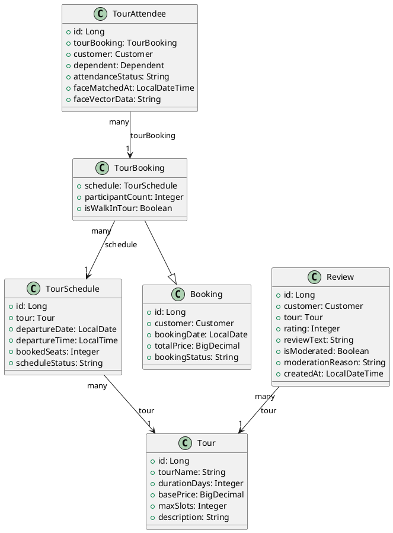
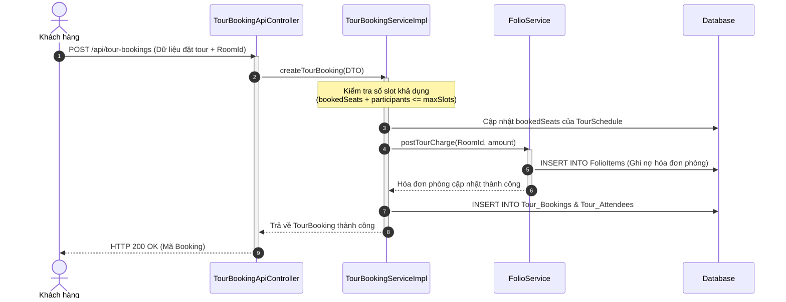

# ENGINEERING DOCUMENTATION STANDARD (EDS) v2.0

## Quy chuẩn Tài liệu Kỹ thuật và Đặc tả Hiện thực hóa

| Field                    | Value                          |
| ------------------------ | ------------------------------ |
| **Document ID**    | `KAWAI-MOD4-IMP-001`         |
| **Version**        | 2.0                            |
| **Date**           | 2026-06-13                     |
| **Status**         | Approved                       |
| **Document Owner** | Antigravity                    |
| **Author**         | Nguyễn Thị Thúy Ngọc       |
| **Reviewed by**    | Nguyễn Xuân Lưu - Tech Lead |
| **DPO Sign-off**   | `[x] Approved – 2026-06-13` |
| **Based on EDS**   | v2.0                           |

---

### CHANGELOG

> [!IMPORTANT]
> **Policy 4.4 — Immutable History:** Không bao giờ xóa thông tin cũ. Mọi thay đổi phải ghi vào bảng này.

| Ngày      | Người thực hiện      | Nội dung thay đổi                                                                     |
| ---------- | ------------------------ | ---------------------------------------------------------------------------------------- |
| 2026-06-12 | Nguyễn Xuân Lưu       | Khởi tạo tài liệu cấu trúc ban đầu                                               |
| 2026-06-13 | Nguyễn Thị Thúy Ngọc | Hoàn thiện đặc tả chi tiết 17 phần cho Module Quản lý Tour & Đánh giá (MOD4) |

---

### MỤC LỤC

1. [Tổng quan Module](#1-tong-quan-module)
2. [Ma trận Truy vết (Traceability Matrix)](#2-ma-tran-truy-vet-traceability-matrix)
3. [Architecture Decision Records (ADR)](#3-architecture-decision-records-adr)
4. [Non-Functional Requirements &amp; SLA](#4-non-functional-requirements--sla)
5. [Static Modeling (Mô hình Tĩnh)](#5-static-modeling-mo-hinh-tinh)
6. [Dynamic Modeling (Mô hình Động)](#6-dynamic-modeling-mo-hinh-dong)
7. [Domain Event Catalog](#7-domain-event-catalog)
8. [Interface Specification (Đặc tả Giao diện)](#8-interface-specification-dac-ta-giao-dien)
9. [API Specification](#9-api-specification)
10. [Bảng mã lỗi (Error Codes)](#10-bang-ma-loi-error-codes)
11. [Quy trình Triển khai (Step-by-Step)](#11-quy-trinh-trien-khai-step-by-step)
12. [Rollback &amp; Incident Runbook](#12-rollback--incident-runbook)
13. [Kịch bản Kiểm thử Chi tiết](#13-kich-ban-kiem-thu-chi-tiet)
14. [Phương pháp Xác minh](#14-phuong-phap-xac-minh)
15. [Mẫu thử thực tế (API Verification Samples)](#15-mau-thu-thuc-te-api-verification-samples)
16. [Bảng tổng hợp phân quyền (Authorization Matrix)](#16-bang-tong-hop-phan-quyen-authorization-matrix)
17. [Phụ lục](#17-phu-luc)

---

### 1. Tổng quan Module

Module quản lý Tour lữ hành và Đánh giá cung cấp khả năng tìm kiếm tour kèm thông tin thời tiết thời gian thực, đặt tour trực tuyến, xếp lịch hướng dẫn viên & phương tiện, điểm danh bằng công nghệ sinh trắc học FaceID tại resort, và thu thập đánh giá từ khách hàng.

| Field                           | Value                                              |
| ------------------------------- | -------------------------------------------------- |
| **Module Name**           | `Đặt Tour & Đánh giá (Tour & Review)`       |
| **Bounded Context**       | `Tour & Review Context`                          |
| **Data Classification**   | Restricted / PII (Face Vector Data)                |
| **Compliance Scope**      | Luật Du lịch Việt Nam 2017 & NĐ 13/2023/NĐ-CP |
| **Upstream Dependencies** | `[Module 1 - Auth, Module 2 - Booking/Folio]`    |
| **Downstream Consumers**  | `[Module 5 - Finance]`                           |

---

### 2. Ma trận Truy vết (Traceability Matrix)

| Requirement ID | Loại (BR/US) | Mô tả yêu cầu                                                               | Thành phần Code                            | Compliance Target      |
| -------------- | ------------- | ------------------------------------------------------------------------------- | -------------------------------------------- | ---------------------- |
| BR-TOUR-01     | Business Rule | Kiểm tra và chặn đặt tour khi đã hết slot khả dụng                    | `TourBookingServiceImpl.createTourBooking` | Tránh overbooking     |
| BR-TOUR-02     | Business Rule | Cho phép thanh toán cọc trực tiếp hoặc ghi nợ vào phòng (Post to Room) | `TourBookingServiceImpl.createTourBooking` | Luật Kế toán        |
| BR-FACE-01     | Business Rule | Nhận diện khuôn mặt với độ tương đồng (Confidence) >= 0.6            | `nhandien.py` / `FaceIdApiController`    | Bảo mật sinh trắc   |
| BR-FACE-02     | Business Rule | Điểm danh thành công phải cập nhật trạng thái của TourAttendee        | `TourAttendanceServiceImpl.updateStatus`   | Luật Du lịch 2017    |
| BR-REV-01      | Business Rule | Tự động kiểm duyệt ngôn từ thô tục (Moderation) trong đánh giá      | `ReviewServiceImpl.submitReview`           | Kiểm duyệt nội dung |

---

### 3. Architecture Decision Records (ADR)

#### ADR-001 — Điểm danh AI FaceID Đồng bộ với Cơ chế Fallback Thủ công

* **Status:** Accepted
* **Deciders:** Nguyễn Xuân Lưu, Nguyễn Thị Thúy Ngọc
* **Date:** 2026-06-13

**Bối cảnh:** Điểm danh đoàn khách tham quan tour cần được xử lý nhanh gọn ngay tại quầy hoặc xe trung chuyển. Việc quét mặt qua camera cần phản hồi dưới 3 giây. Nếu dịch vụ AI bị nghẽn mạng hoặc lỗi mô hình, quá trình điểm danh không được phép làm gián đoạn tour.

**Quyết định:** Tích hợp trực tiếp thư viện `face_recognition` qua service Python trung gian. Khi khách hàng quét mặt, hệ thống gọi API đồng bộ. Nếu có lỗi mạng hoặc API Timeout (>3s), giao diện sẽ hiển thị nút "Điểm danh thủ công" để Hướng dẫn viên (Tour Guide) tích chọn bằng tay.

**Hệ quả:** Trải nghiệm mượt mà, hệ thống tự phục hồi mà không gây tắc nghẽn vận hành.

---

#### ADR-002 — Tích hợp Weather API Không Chặn (Fail-safe)

* **Status:** Accepted
* **Deciders:** Nguyễn Xuân Lưu, Nguyễn Thị Thúy Ngọc
* **Date:** 2026-06-13

**Bối cảnh:** Khi tìm kiếm danh sách Tour, hệ thống cần hiển thị dự báo thời tiết tại điểm đến. Nếu Weather API của bên thứ 3 gặp sự cố, hệ thống không được trả về lỗi 500 cho khách hàng.

**Quyết định:** Triển khai cơ chế bao bọc Hystrix/Resilience4j hoặc khối `try-catch` bắt lỗi cô lập. Khi Weather API lỗi hoặc quá hạn phản hồi (timeout 500ms), hệ thống sẽ trả về danh sách Tour bình thường nhưng ẩn/trống thông tin thời tiết.

---

### 4. Non-Functional Requirements & SLA

| Category              | Requirement                                  | Target SLA    | Measurement Method         |
| --------------------- | -------------------------------------------- | ------------- | -------------------------- |
| **Performance** | Thời gian nhận diện khuôn mặt (FaceID)  | < 1500ms      | Trình duyệt Console/Logs |
| **Fail-safe**   | Bỏ qua lỗi Weather API khi tải danh sách | 100% Uptime   | Integration Tests          |
| **Privacy**     | Không lưu trữ trực tiếp file ảnh gốc  | 100% ẩn danh | Mã hóa Face Vector       |

---

### 5. Static Modeling (Mô hình Tĩnh)

#### 5.1. Class Diagram (PlantUML)



#### 5.2. Data Structure (JPA Entities)

```java
@Entity
@Table(name="Tours")
public class Tour {
    @Id @GeneratedValue(strategy=GenerationType.IDENTITY)
    private Long id;
    private String tourName;
    private Integer durationDays;
    private BigDecimal basePrice;
    private Integer maxSlots;
}

@Entity
@Table(name="Tour_Schedules")
public class TourSchedule {
    @Id @GeneratedValue(strategy=GenerationType.IDENTITY)
    @Column(name="schedule_id")
    private Long id;
    @ManyToOne @JoinColumn(name="tour_id")
    private Tour tour;
    private LocalDate departureDate;
    private LocalTime departureTime;
    private Integer bookedSeats;
    private String scheduleStatus;
}

@Entity
@Table(name="Tour_Bookings")
public class TourBooking extends Booking {
    @ManyToOne @JoinColumn(name="schedule_id")
    private TourSchedule schedule;
    private Integer participantCount;
    private Boolean isWalkInTour;
}
```

#### 5.3. Software Architecture Class Diagram (Sơ đồ lớp kiến trúc phần mềm)

```plantuml
@startuml
package "Controller Layer" {
    class TourApiController {
        -tourService: TourService
        +searchAvailableTours()
    }
    class TourBookingApiController {
        -tourBookingService: TourBookingService
        +createTourBooking()
    }
    class FaceIdApiController {
        -tourAttendanceService: TourAttendanceService
        +processFaceScan()
    }
    class ReviewApiController {
        -reviewService: ReviewService
        +submitReview()
    }
}

package "Service Layer" {
    interface TourService
    class TourServiceImpl
    interface TourBookingService
    class TourBookingServiceImpl
    interface TourAttendanceService
    class TourAttendanceServiceImpl
    interface ReviewService
    class ReviewServiceImpl
}

package "Repository Layer" {
    interface TourRepository
    interface TourBookingRepository
    interface TourScheduleRepository
    interface TourAttendeeRepository
    interface ReviewRepository
}

TourApiController --> TourService
TourBookingApiController --> TourBookingService
FaceIdApiController --> TourAttendanceService
ReviewApiController --> ReviewService

TourServiceImpl ..|> TourService
TourBookingServiceImpl ..|> TourBookingService
TourAttendanceServiceImpl ..|> TourAttendanceService
ReviewServiceImpl ..|> ReviewService

TourServiceImpl --> TourRepository
TourServiceImpl --> TourScheduleRepository

TourBookingServiceImpl --> TourBookingRepository
TourBookingServiceImpl --> TourScheduleRepository

TourAttendanceServiceImpl --> TourAttendeeRepository

ReviewServiceImpl --> ReviewRepository

@enduml
```



---

### 6. Dynamic Modeling (Mô hình Động)

#### 6.1. Sequence Diagram — Đặt Tour & Ghi Nợ Phòng (Post to Room)



---

### 7. Domain Event Catalog

| Event Name           | Publisher                     | Subscriber              | Action                                              |
| -------------------- | ----------------------------- | ----------------------- | --------------------------------------------------- |
| `TourBookedEvent`  | `TourBookingServiceImpl`    | `FolioServiceImpl`    | Tự động tạo hóa đơn nợ dịch vụ cho phòng |
| `FaceMatchedEvent` | `TourAttendanceServiceImpl` | `NotificationService` | Gửi tin nhắn thông báo điểm danh thành công |

---

### 8. Interface Specification (Đặc tả Giao diện)

#### 8.1. Java Services

```java
public interface TourService {
    List<TourSearchResponseDTO> searchAvailableTours(LocalDate date, String keyword);
}

public interface TourBookingService {
    TourBookingResponseDTO createTourBooking(TourBookingRequestDTO request);
    void scheduleTour(Long scheduleId, Long guideId, Long driverId);
    void cancelTour(Long bookingId);
}

public interface TourAttendanceService {
    boolean processFaceScan(Long attendeeId, String base64Image);
    void updateStatus(Long attendeeId, String status);
}
```

---

### 9. API Specification

#### 🔹 API 001: Tìm kiếm Tour & Thời tiết

* **Method:** `GET`
* **Path:** `/api/tours/search`
* **Query Params:** `date=2026-06-13&keyword=HoiAn`
* **Response (200 OK):**
  ```json
  [
    {
      "tourId": 1,
      "tourName": "Tinh hoa di sản Hội An",
      "price": 1200000,
      "availableSlots": 12,
      "weatherForecast": "Sunny - 32°C"
    }
  ]
  ```

#### 🔹 API 002: Điểm danh FaceID

* **Method:** `POST`
* **Path:** `/api/faceid/scan`
* **Request Body:**
  ```json
  {
    "attendeeId": 5,
    "imageBase64": "/9j/4AAQSkZJR..."
  }
  ```
* **Response (200 OK):**
  ```json
  {
    "status": "success",
    "matched": true,
    "confidence": 0.89,
    "message": "Điểm danh thành công!"
  }
  ```

---

### 10. Bảng mã lỗi (Error Codes)

| Code         | HTTP Status | Message (VI)                                  | Trigger Condition                         |
| ------------ | ----------- | --------------------------------------------- | ----------------------------------------- |
| `TOUR-001` | 400         | Tour đã hết chỗ khả dụng                | `bookedSeats + requestSlots > maxSlots` |
| `FACE-001` | 422         | Không tìm thấy khuôn mặt trong ảnh      | AI Service trả về 0 faces               |
| `FACE-002` | 400         | Độ nhận diện không đạt chuẩn an toàn | `confidence < 0.6`                      |

---

### 11. Quy trình Triển khai (Step-by-Step)

1. **Database Migration**: Chạy script cập nhật schema bảng `Tour_Bookings` và `Tour_Attendees`.
2. **AI Service Deploy**: Chạy script python nhận diện `nhandien.py` làm service độc lập lắng nghe cổng `5000`.
3. **Spring Boot Sync**: Deploy mã nguồn backend tích hợp gọi API nhận diện.

---

### 12. Rollback & Incident Runbook

#### 12.1. Điều kiện kích hoạt Rollback

* Tỷ lệ lỗi nhận diện FaceID (lỗi 5xx từ AI Service) vượt quá 10% trong vòng 10 phút liên tục.

#### 12.2. Quy trình Rollback nhanh

1. Truy cập trang cấu hình hệ thống (System Config Portal).
2. Chuyển cờ cấu hình `tour.attendance.faceid.enabled` sang `false` để ép hệ thống dùng điểm danh thủ công.
3. Restart ứng dụng backend nếu cần thiết.

---

### 13. Kịch bản Kiểm thử Chi tiết

#### **TC-UNIT-001 — Đặt Tour thành công (Còn chỗ)**

* **Scenario:** Khách hàng đặt tour 3 người khi lịch trình còn 5 chỗ.
* **Expected:** Trả về mã Booking, trạng thái `Confirmed`, DB ghi nhận `bookedSeats` tăng thêm 3.

#### **TC-UNIT-002 — Đặt Tour lỗi do hết chỗ (TOUR-001)**

* **Scenario:** Khách hàng cố gắng đặt tour 5 người khi lịch trình chỉ còn 2 chỗ trống.
* **Expected:** HTTP 400, mã lỗi `TOUR-001`.

---

### 14. Phương pháp Xác minh

#### 14.1. H2/MySQL CLI Verification

```sql
-- Kiểm tra số chỗ ngồi đã cập nhật của lịch trình tour ID 1
SELECT booked_seats FROM Tour_Schedules WHERE schedule_id = 1;
```

---

### 15. Mẫu thử thực tế (API Verification Samples)

```bash
# Gửi yêu cầu đặt tour qua cURL
curl -X POST http://localhost:8080/api/tour-bookings \
  -H "Content-Type: application/json" \
  -d '{"scheduleId": 1, "customerId": 2, "participantCount": 3}'
```

---

### 16. Bảng tổng hợp phân quyền (Authorization Matrix)

| Endpoint                    | GUEST | CUSTOMER | TOURGUIDE | ADMIN |
| --------------------------- | :---: | :------: | :-------: | :---: |
| `GET /api/tours/search`   | ✔️ |   ✔️   |   ✔️   | ✔️ |
| `POST /api/tour-bookings` |  ❌  |   ✔️   |   ✔️   | ✔️ |
| `POST /api/faceid/scan`   |  ❌  |    ❌    |   ✔️   | ✔️ |

---

### 17. Phụ lục

#### A. Glossary

* **Face Vector**: Chuỗi số hóa đặc trưng khuôn mặt (128 chiều) dùng để so sánh thay thế ảnh gốc.
* **Post to Room**: Hình thức ghi nợ chi phí dịch vụ vào hóa đơn tổng của phòng khách sạn đang lưu trú.
