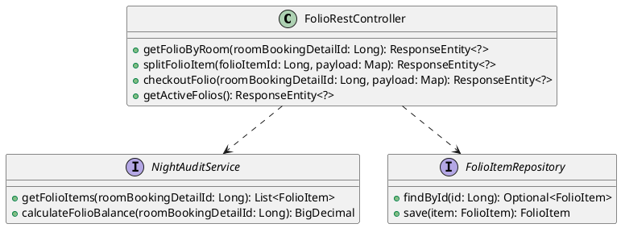
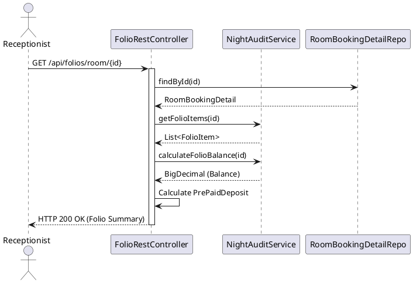

# ENGINEERING DOCUMENTATION STANDARD (EDS) v2.0

## Quy chuẩn Tài liệu Kỹ thuật và Đặc tả Hiện thực hóa

| Field                    | Value                                          |
| ------------------------ | ---------------------------------------------- |
| **Document ID**    | `KAWAI-MOD5-IMP-UC21`                        |
| **Version**        | 1.1                                            |
| **Date**           | 2026-06-20                                     |
| **Status**         | Approved                                       |
| **Document Owner** | Ngô Thị Ngọc Lan                            |
| **Author**         | Antigravity AI                                 |
| **Reviewed by**    | Ngô Thị Ngọc Lan                            |
| **DPO Sign-off**   | ` [x] Approved – 2026-06-20 – Antigravity` |
| **Approved by**    | Ngô Thị Ngọc Lan                            |
| **Last Review**    | 2026-06-20                                     |
| **Based on EDS**   | v2.0                                           |

---

### CHANGELOG

> [!IMPORTANT]
> **Policy 4.4 — Immutable History:** Không bao giờ xóa thông tin cũ. Mọi thay đổi phải ghi vào bảng này.

| Ngày      | Người thực hiện | Nội dung thay đổi         |
| ---------- | ------------------- | ---------------------------- |
| 2026-06-20 | Antigravity AI      | Tạo tài liệu EDS cho UC21 |
| 2026-06-20 | Ngô Thị Ngọc Lan | Duyệt tài liệu EDS        |
| 2026-06-21 | Antigravity AI    | Đồng bộ message lỗi FIN-002 với code thực tế: bổ sung prefix `{finalBalance}` |

---

### MỤC LỤC

1. [Tổng quan Module](#1-tong-quan-module)
2. [Ma trận Truy vết (Traceability Matrix)](#2-ma-tran-truy-vet-traceability-matrix)
3. [Architecture Decision Records (ADR)](#3-architecture-decision-records-adr)
4. [Non-Functional Requirements &amp; SLA](#4-non-functional-requirements--sla)
5. [Static Modeling (Mô hình Tĩnh)](#5-static-modeling-mo-hinh-tinh)
6. [Dynamic Modeling (Mô hình Động)](#6-dynamic-modeling-mo-hinh-dong)
7. [Domain Event Catalog](#7-domain-event-catalog)
8. [Interface Specification (Đặc tả Giao diện)](#8-interface-specification-dac-ta-giao-dien)
9. [API Specification](#9-api-specification)
10. [Bảng mã lỗi (Error Codes)](#10-bang-ma-loi-error-codes)
11. [Quy trình Triển khai (Step-by-Step)](#11-quy-trinh-trien-khai-step-by-step)
12. [Rollback &amp; Incident Runbook](#12-rollback--incident-runbook)
13. [Kịch bản Kiểm thử Chi tiết](#13-kich-ban-kiem-thu-chi-tiet)
14. [Phương pháp Xác minh](#14-phuong-phap-xac-minh)
15. [Mẫu thử thực tế (API Verification Samples)](#15-mau-thu-thuc-te-api-verification-samples)
16. [Bảng tổng hợp phân quyền (Authorization Matrix)](#16-bang-tong-hop-phan-quyen-authorization-matrix)
17. [Phụ lục](#phu-luc)

---

### 1. Tổng quan Module

Tài liệu này đặc tả kỹ thuật cho Use Case 21 (UC21) thuộc Module 5 (Finance & Reports). Mục đích của UC này là gom tất cả các khoản phí phát sinh của một phòng (Folio) để phục vụ cho việc thanh toán và theo dõi tài chính.

| Field                           | Value                                          |
| ------------------------------- | ---------------------------------------------- |
| **Module Name**           | Finance & Reports                              |
| **Bounded Context**       | Folio & Billing Management                     |
| **Data Classification**   | Internal                                       |
| **Compliance Scope**      | N/A                                            |
| **Upstream Dependencies** | Booking (MOD 2), POS/F&B (MOD 3), Tour (MOD 4) |
| **Downstream Consumers**  | Payment Gateway                                |

---

### 2. Ma trận Truy vết (Traceability Matrix)

| Requirement ID | Loại (BR/ADR/US) | Mô tả yêu cầu                                              | Thành phần Code                        | Compliance Target                          | ADR liên quan |
| -------------- | ----------------- | -------------------------------------------------------------- | ---------------------------------------- | ------------------------------------------ | -------------- |
| BR-FIN-001     | Business Rule     | Lấy thông tin Ví Folio của phòng theo ID chi tiết phòng | `FolioRestController.getFolioByRoom()` | Đảm bảo tính toán đúng nợ          | —             |
| BR-FIN-002     | Business Rule     | Tách hóa đơn dịch vụ riêng lẻ                          | `FolioRestController.splitFolioItem()` | —                                         | —             |
| BR-FIN-003     | Business Rule     | Gom Folio và Tất toán                                       | `FolioRestController.checkoutFolio()`  | Cập nhật chính xác trạng thái phòng | —             |

---

### 3. Architecture Decision Records (ADR)

#### ADR-001 — Quản lý tính toán số dư Folio động

| Field                | Value          |
| -------------------- | -------------- |
| **Status**     | Accepted       |
| **Deciders**   | Tech Lead, Lan |
| **Date**       | 2026-06-20     |
| **Supersedes** | N/A            |

**Bối cảnh (Context)**
Folio bao gồm nhiều item (FolioItem) và tiền phòng. Tiền cọc (Deposit) cũng cần được khấu trừ. Cần phương án tính số dư hiện tại của phòng để tránh thất thoát.

**Các phương án đã xem xét (Options Considered)**

| Phương án | Mô tả                                                                 | Ưu điểm          | Nhược điểm                                |
| ------------ | ----------------------------------------------------------------------- | ------------------- | --------------------------------------------- |
| **A**  | Tính toán on-the-fly dựa vào các bảng liên quan mỗi khi request | + Luôn chính xác | - Chậm nếu lịch sử dài                   |
| **B**  | Lưu số dư vào một field và update dần (Materialized View)        | + Nhanh khi read    | - Dễ bị race condition dẫn đến sai lệch |

**Quyết định (Decision)**
Chọn Phương án **A** vì tính chính xác của dữ liệu tài chính được ưu tiên hàng đầu, số lượng item của 1 booking detail thường không quá lớn.

**Hệ quả (Consequences)**

* **Tích cực:** Luôn đảm bảo số dư là chính xác nhất dựa trên lịch sử giao dịch.
* **Tiêu cực / Trade-offs:** Phải query nhiều bảng (FolioItem, PaymentTransaction, RoomBookingDetail). Sẽ tối ưu hóa bằng index nếu cần.

---

### 4. Non-Functional Requirements & SLA

#### 4.1. Performance & Availability

| Category               | Requirement        | Target SLA | Measurement Method | Compliance Basis |
| ---------------------- | ------------------ | ---------- | ------------------ | ---------------- |
| **Latency**      | API response (p99) | < 500ms    | k6 load test       | —               |
| **Availability** | Uptime (monthly)   | 99.9%      | Uptime monitor     | —               |

#### 4.2. Data Integrity & Retention

| Category              | Requirement                 | Target  | Verification Method | Compliance Basis |
| --------------------- | --------------------------- | ------- | ------------------- | ---------------- |
| **Durability**  | Zero record loss            | RPO = 0 | Transaction log     | —               |
| **Consistency** | Hóa đơn khớp với Folio | 100%    | Reconciliation job  | —               |

---

### 5. Static Modeling (Mô hình Tĩnh)

#### 5.1. Class Diagram (PlantUML)



---

### 6. Dynamic Modeling (Mô hình Động)

#### 6.1. Sequence Diagram — Gom Folio (GET /api/folios/room/)



---

### 7. Domain Event Catalog

#### 7.1. Events Published (Phát ra)

| Event Name          | Trigger                     | Publisher               | Subscriber(s)             | Payload Schema          | Async? |
| ------------------- | --------------------------- | ----------------------- | ------------------------- | ----------------------- | ------ |
| `FolioCheckedOut` | Khi tất toán thành công | `FolioRestController` | EmailService, RoomService | `roomBookingDetailId` | No     |

---

### 8. Interface Specification (Đặc tả Giao diện)

*Không áp dụng với hệ thống API sử dụng Spring Web REST*

---

### 9. API Specification

#### 9.1. Endpoints Table

| Method | Path                                                | Auth Level | Required Roles                   | Rate Limit | Idempotent? |
| ------ | --------------------------------------------------- | ---------- | -------------------------------- | ---------- | ----------- |
| GET    | `/api/folios/room/{roomBookingDetailId}`          | JWT Bearer | `RECEPTIONIST, MANAGER, ADMIN` | 100/min    | Yes         |
| PUT    | `/api/folios/items/{folioItemId}/split`           | JWT Bearer | `RECEPTIONIST, MANAGER, ADMIN` | 60/min     | Yes         |
| POST   | `/api/folios/room/{roomBookingDetailId}/checkout` | JWT Bearer | `RECEPTIONIST, MANAGER, ADMIN` | 60/min     | No          |
| GET    | `/api/folios/active`                              | JWT Bearer | `RECEPTIONIST, MANAGER, ADMIN` | 100/min    | Yes         |

#### 9.2. Request / Response Schemas

**GET `/api/folios/room/{id}` — Lấy Folio**

*Response — 200 OK (Happy Path):*

```json
{
  "success": true,
  "roomBookingDetailId": 1,
  "guestName": "Nguyen Van A",
  "roomNumber": "101",
  "subCreditLimit": 5000000,
  "items": [
    {
      "id": 1,
      "sourceDepartment": "F&B",
      "amount": 200000,
      "description": "Room Service",
      "isSettledSeparately": false,
      "createdAt": "2026-06-20T10:00:00"
    }
  ],
  "currentBalance": 200000,
  "prePaidDeposit": 0
}
```

**PUT `/api/folios/items/{id}/split` — Tách hóa đơn**

*Request Body:*

```json
{
  "isSettledSeparately": true
}
```

*Response — 200 OK:*

```json
{
  "success": true,
  "message": "Đã cập nhật trạng thái tách hóa đơn thành công",
  "item": { }
}
```

**POST `/api/folios/room/{id}/checkout` — Tất toán Folio**

*Request Body:*

```json
{
  "paymentAmount": 200000,
  "paymentMethod": "CASH"
}
```

*Response — 200 OK:*

```json
{
  "success": true,
  "message": "Tất toán thành công. Đã tạo hóa đơn và đổi trạng thái phòng thành Vacant_Dirty.",
  "invoiceNumber": "INV-A1B2C3D4"
}
```

---

### 10. Bảng mã lỗi (Error Codes)

| Code        | HTTP Status | Message (EN)                | Message (VI)                     | Trigger Condition                    |
| ----------- | ----------- | --------------------------- | -------------------------------- | ------------------------------------ |
| `FIN-001` | 400         | RoomBookingDetail not found | Không tìm thấy phòng         | Invalid `roomBookingDetailId`      |
| `FIN-002` | 400         | Insufficient payment amount | Khách hàng còn dư nợ {finalBalance}. Số tiền thanh toán chưa đủ. | `paymentAmount` < `finalBalance` |
| `FIN-003` | 404         | Folio Item not found        | Không tìm thấy Folio Item     | Invalid `folioItemId`              |

---

### 11. Quy trình Triển khai (Step-by-Step)

Không có cấu trúc Schema thay đổi, chỉ áp dụng logic Application. Triển khai theo quy trình CI/CD tích hợp Maven.

---

### 12. Rollback & Incident Runbook

Trường hợp lỗi hệ thống dẫn tới sai số dư phòng, revert Git commit code controller và tiến hành update lại bảng database (hotfix script tùy tình huống).

---

### 13. Kịch bản Kiểm thử Chi tiết

#### 13.1. Unit Tests

**TC-UNIT-UC21-01 — Kiểm tra Get Folio Balance**

* **Scenario:** Khách hàng có 1 Folio Item 200k, chưa cọc.
  * Given: `getFolioItems()` trả về list 1 item 200k.
  * When: Gọi GET `/api/folios/room/1`
  * Then: Trả về `currentBalance` = 200000.

**TC-UNIT-UC21-02 — Kiểm tra Split Folio**

* **Scenario:** Tách riêng lẻ item.
  * Given: `isSettledSeparately` = true.
  * When: Gọi PUT `/api/folios/items/1/split`
  * Then: DB update field thành công trả lại response success.

**TC-UNIT-UC21-03 — Checkout thành công**

* **Scenario:** Checkout với CASH đủ tiền.
  * Given: `paymentAmount` = 200k, `finalBalance` = 200k.
  * When: Gọi POST `/api/folios/room/1/checkout`
  * Then: Tạo hóa đơn, payment transaction sinh ra thành công, phòng đổi thành Vacant_Dirty.

---

### 14. Phương pháp Xác minh

Dùng Postman hoặc cURL gọi API trực tiếp. Truy vấn DB (`Consolidated_Invoices`, `Rooms`) xem trạng thái phòng đã đổi thành `Vacant_Dirty` và hóa đơn đã sinh ra chưa.

---

### 15. Mẫu thử thực tế (API Verification Samples)

```bash
curl -X GET http://localhost:8080/api/folios/room/1
```

---

### 16. Bảng tổng hợp phân quyền (Authorization Matrix)

| Endpoint                                | GUEST | RECEPTIONIST | ADMIN | MANAGER | SYSTEM |
| --------------------------------------- | :---: | :----------: | :---: | :-----: | :----: |
| GET `/api/folios/room/{id}`           |  ❌  |     ✔️     | ✔️ |  ✔️  |   ❌   |
| PUT `/api/folios/items/{id}/split`    |  ❌  |     ✔️     | ✔️ |  ✔️  |   ❌   |
| POST `/api/folios/room/{id}/checkout` |  ❌  |     ✔️     | ✔️ |  ✔️  |   ❌   |
| GET `/api/folios/active`              |  ❌  |     ✔️     | ✔️ |  ✔️  |   ❌   |

---

### 17. Phụ lục

- Hóa đơn PDF được xử lý thông qua `InvoicePdfService`.
- Email gửi qua `EmailService`.
