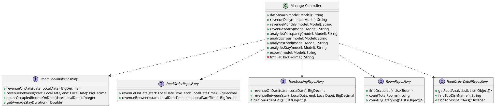
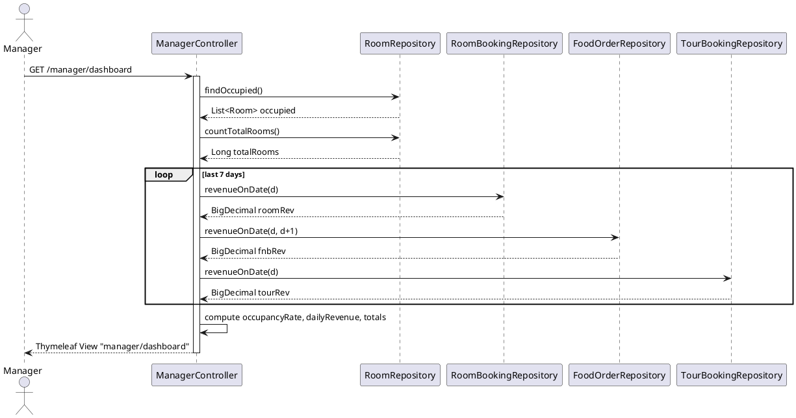
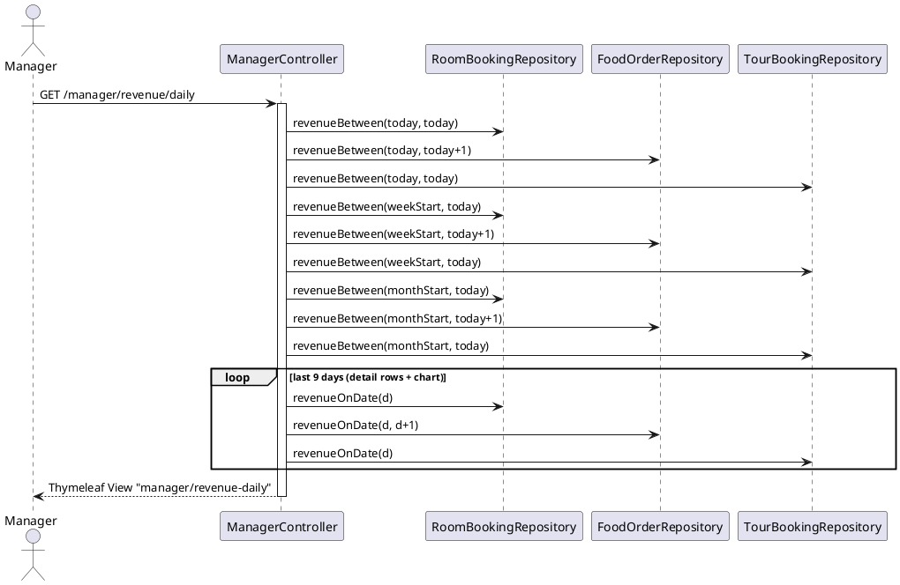

# ENGINEERING DOCUMENTATION STANDARD (EDS) v2.0

## Quy chuẩn Tài liệu Kỹ thuật và Đặc tả Hiện thực hóa

| Field                    | Value                                                                                       |
| ------------------------ | ------------------------------------------------------------------------------------------- |
| **Document ID**    | `KAWAI-MOD5-IMP-UC23`                                                                     |
| **Version**        | 1.0                                                                                         |
| **Date**           | 2026-06-21                                                                                  |
| **Status**         | Approved                                                                                    |
| **Document Owner** | Ngô Thị Ngọc Lan                                                                            |
| **Author**         | Antigravity AI                                                                              |
| **Reviewed by**    | Ngô Thị Ngọc Lan                                                                            |
| **DPO Sign-off**   | `[ ] Pending`                                                                               |
| **Approved by**    | Ngô Thị Ngọc Lan                                                                            |
| **Last Review**    | 2026-06-21                                                                                  |
| **Based on EDS**   | v2.0                                                                                        |

---

### CHANGELOG

> [!IMPORTANT]
> **Policy 4.4 — Immutable History:** Không bao giờ xóa thông tin cũ. Mọi thay đổi phải ghi vào bảng này.

| Ngày       | Người thực hiện | Nội dung thay đổi                      |
| ---------- | --------------- | --------------------------------------- |
| 2026-06-21 | Antigravity AI      | Tạo tài liệu EDS cho UC23 (Dashboard Manager) |
| 2026-06-21 | Ngô Thị Ngọc Lan  | Duyệt tài liệu EDS — Approved                |

---

### MỤC LỤC
1. [Tổng quan Module](#1-tong-quan-module)
2. [Ma trận Truy vết (Traceability Matrix)](#2-ma-tran-truy-vet-traceability-matrix)
3. [Architecture Decision Records (ADR)](#3-architecture-decision-records-adr)
4. [Non-Functional Requirements & SLA](#4-non-functional-requirements--sla)
5. [Static Modeling (Mô hình Tĩnh)](#5-static-modeling-mo-hinh-tinh)
6. [Dynamic Modeling (Mô hình Động)](#6-dynamic-modeling-mo-hinh-dong)
7. [Domain Event Catalog](#7-domain-event-catalog)
8. [Interface Specification (Đặc tả Giao diện)](#8-interface-specification-dac-ta-giao-dien)
9. [Endpoint Specification](#9-endpoint-specification)
10. [Bảng mã lỗi (Error Codes)](#10-bang-ma-loi-error-codes)
11. [Quy trình Triển khai (Step-by-Step)](#11-quy-trinh-trien-khai-step-by-step)
12. [Rollback & Incident Runbook](#12-rollback--incident-runbook)
13. [Kịch bản Kiểm thử Chi tiết](#13-kich-ban-kiem-thu-chi-tiet)
14. [Phương pháp Xác minh](#14-phuong-phap-xac-minh)
15. [Mẫu thử thực tế (Verification Samples)](#15-mau-thu-thuc-te-verification-samples)
16. [Bảng tổng hợp phân quyền (Authorization Matrix)](#16-bang-tong-hop-phan-quyen-authorization-matrix)
17. [Phụ lục](#phu-luc)

---

### 1. Tổng quan Module

Tài liệu này đặc tả kỹ thuật cho Use Case 23 (UC23) thuộc Module 5 (Finance & Reports). Mục đích là cung cấp cho Manager một bộ Dashboard trực quan hóa toàn diện: doanh thu lũy kế (theo ngày/tháng/năm), tỷ lệ lấp đầy phòng (Occupancy), phân tích Tour/F&B, và thời gian lưu trú trung bình.

| Field                           | Value                                                    |
| ------------------------------- | -------------------------------------------------------- |
| **Module Name**           | Finance & Reports                                        |
| **Bounded Context**       | Dashboard & Analytics                                    |
| **Data Classification**   | Internal                                                 |
| **Compliance Scope**      | N/A                                                      |
| **Upstream Dependencies** | Booking (MOD2), POS/F&B (MOD3), Tour (MOD4)              |
| **Downstream Consumers**  | Export Service (UC25)                                    |

---

### 2. Ma trận Truy vết (Traceability Matrix)

| Requirement ID | Loại (BR/ADR/US) | Mô tả yêu cầu | Thành phần Code | Compliance Target | ADR liên quan |
| -------------- | ----------------- | -------------- | ---------------- | ----------------- | ------------- |
| BR-MGR-001 | Business Rule | Manager xem tổng quan Dashboard: doanh thu, occupancy | `ManagerController.dashboard()` | Đảm bảo tính chính xác số liệu | ADR-001 |
| BR-MGR-002 | Business Rule | Manager xem doanh thu chi tiết theo ngày | `ManagerController.revenueDaily()` | — | — |
| BR-MGR-003 | Business Rule | Manager xem doanh thu theo tháng + YoY Growth | `ManagerController.revenueMonthly()` | — | — |
| BR-MGR-004 | Business Rule | Manager xem doanh thu theo năm + YTD | `ManagerController.revenueYearly()` | — | — |
| BR-MGR-005 | Business Rule | Manager xem tỷ lệ lấp đầy phòng 30 ngày | `ManagerController.analyticsOccupancy()` | — | — |
| BR-MGR-006 | Business Rule | Manager xem phân tích Tour | `ManagerController.analyticsTour()` | — | — |
| BR-MGR-007 | Business Rule | Manager xem phân tích món ăn F&B | `ManagerController.analyticsFood()` | — | — |
| BR-MGR-008 | Business Rule | Manager xem thời gian lưu trú trung bình | `ManagerController.analyticsStay()` | — | — |

---

### 3. Architecture Decision Records (ADR)

#### ADR-001 — Tổng hợp doanh thu on-the-fly từ 3 nguồn

| Field          | Value                         |
| -------------- | ----------------------------- |
| **Status**     | Accepted                      |
| **Deciders**   | Tech Lead, Ngô Thị Ngọc Lan   |
| **Date**       | 2026-06-21                    |
| **Supersedes** | N/A                           |

**Bối cảnh (Context)**
Dashboard cần tổng hợp doanh thu từ 3 nguồn độc lập: Phòng (`RoomBookingRepository`), F&B (`FoodOrderRepository`), Tour (`TourBookingRepository`). Có thể chọn: (A) tổng hợp lúc runtime (on-the-fly), hoặc (B) materialized view pre-aggregated.

**Các phương án đã xem xét (Options Considered)**

| Phương án | Mô tả | Ưu điểm | Nhược điểm |
| --------- | ----- | -------- | ---------- |
| **A** | Query 3 repo mỗi request, cộng tổng trong Controller | + Luôn real-time, không stale | - Chậm nếu volume lớn |
| **B** | Dùng bảng aggregate, cron job cập nhật mỗi giờ | + Nhanh | - Trễ data tối đa 1 giờ, phức tạp hơn |

**Quyết định (Decision)**
Chọn Phương án **A** vì dự án ở giai đoạn MVP, số lượng booking chưa đủ lớn để gây bottleneck. Có thể chuyển sang B khi cần scale.

**Hệ quả (Consequences)**
* **Tích cực:** Dashboard luôn phản ánh số liệu thực tế tức thời.
* **Tiêu cực / Trade-offs:** Mỗi page load gọi nhiều query DB. Sẽ bổ sung caching (Redis TTL 5 phút) khi cần tối ưu.

#### ADR-002 — Thymeleaf MVC thay vì REST API + SPA cho Dashboard

| Field          | Value                         |
| -------------- | ----------------------------- |
| **Status**     | Accepted                      |
| **Deciders**   | Tech Lead                     |
| **Date**       | 2026-06-21                    |
| **Supersedes** | N/A                           |

**Bối cảnh (Context)**
Dashboard chỉ dành cho Manager nội bộ, không cần SEO, không cần mobile app. Lựa chọn giữa Thymeleaf Server-Side Rendering và REST API + React/Vue.

**Quyết định (Decision)**
Chọn **Thymeleaf MVC** vì đơn giản, nhất quán với kiến trúc hiện có của dự án, không cần thêm frontend build pipeline.

**Hệ quả (Consequences)**
* **Tích cực:** Ít boilerplate, tích hợp Spring Security dễ hơn.
* **Tiêu cực:** Không thể tái dụng API này cho mobile. Acceptable vì UC23 chỉ nhắm Manager trên Desktop.

---

### 4. Non-Functional Requirements & SLA

#### 4.1. Performance & Availability

| Category           | Requirement                 | Target SLA | Measurement Method | Compliance Basis |
| ------------------ | --------------------------- | ---------- | ------------------ | ---------------- |
| **Latency**      | Dashboard page load (p99)   | < 2000ms   | Browser DevTools   | —               |
| **Latency**      | Revenue API response (p99)  | < 800ms    | k6 load test       | —               |
| **Availability** | Uptime (monthly)            | 99.5%      | Uptime monitor     | —               |

#### 4.2. Data Integrity & Retention

| Category           | Requirement                           | Target  | Verification Method | Compliance Basis |
| ------------------ | ------------------------------------- | ------- | ------------------- | ---------------- |
| **Accuracy**     | Revenue khớp giữa Dashboard và DB     | 100%    | Manual spot-check   | —               |
| **Consistency**  | Số liệu 3 nguồn không bị double-count | 100%    | Query kiểm tra chéo | —               |

#### 4.3. Security

| Category                | Requirement   | Target          | Verification Method | Compliance Basis |
| ----------------------- | ------------- | --------------- | ------------------- | ---------------- |
| **Access control**    | Chỉ MANAGER và ADMIN xem được | Session-based   | Auth Matrix (§16)  | —               |
| **Data exposure**     | Không lộ PII trong URL params | —               | Code review         | —               |

---

### 5. Static Modeling (Mô hình Tĩnh)

#### 5.1. Class Diagram (PlantUML)



#### 5.2. Data Structure — Bảng DB liên quan

```sql
-- Bảng nguồn cho Revenue Analytics
Room_Bookings        -- room revenue (checkout_date, total_amount)
Food_Orders          -- F&B revenue (order_time, total_price)
Tour_Bookings        -- Tour revenue (booking_date, total_price)

-- Bảng nguồn cho Occupancy Analytics
Rooms                -- room status (room_status = 'Checked_In')
Room_Booking_Details -- occupancy per date (check_in_date, check_out_date)

-- Bảng cho Export History
Export_History       -- lịch sử xuất báo cáo
```

---

### 6. Dynamic Modeling (Mô hình Động)

#### 6.1. Sequence Diagram — Dashboard Overview (GET /manager/dashboard)



#### 6.2. Sequence Diagram — Revenue Daily (GET /manager/revenue/daily)



---

### 7. Domain Event Catalog

#### 7.1. Events Published (Phát ra)
UC23 là module READ-ONLY. Không phát sinh domain events.

#### 7.2. Events Consumed (Tiêu thụ)
| Event Name | Source | Handler | Action thực hiện |
| ---------- | ------ | ------- | ---------------- |
| `BookingCheckedOut` | FolioRestController (UC21) | Không có handler — data được đọc trực tiếp từ DB | Dữ liệu tự động cập nhật trong Dashboard qua query |
| `FoodOrderCreated` | PosApiController (UC17) | Không có handler | Tương tự trên |

---

### 8. Interface Specification (Đặc tả Giao diện)

UC23 sử dụng kiến trúc **Server-Side Rendering (SSR) với Thymeleaf**. Không có REST API. Tất cả endpoint trả về HTML View, dữ liệu được inject vào `Model`.

**Các Model Attributes quan trọng truyền vào View:**

| Attribute | Kiểu | Mô tả |
| --------- | ---- | ----- |
| `occupancyRate` | `long` | Tỷ lệ lấp đầy % hiện tại |
| `totalRooms` | `long` | Tổng số phòng |
| `occupiedRooms` | `long` | Số phòng đang có khách |
| `dailyRevenue` | `List<DailyRevenueMock>` | Doanh thu 7 ngày (room/fnb/tour) cho biểu đồ |
| `revenueToday` | `String` | Formatted: `1,234M` |
| `revenueMonth` | `String` | Formatted: Tổng 7 ngày qua |
| `revRoom`, `revFnb`, `revTour` | `double` | Doanh thu từng bộ phận (triệu VND) |
| `rows` | `List<RevenueRowMock>` | Bảng chi tiết doanh thu theo kỳ |
| `chartLabels` | `List<String>` | Nhãn trục X biểu đồ |
| `chartRoom`, `chartFnb`, `chartTour` | `List<Double>` | Dữ liệu series biểu đồ |
| `totalYear` | `String` | YTD Revenue |
| `growthYoY` | `String` | VD: `+12.5%` |
| `currentOccupancy` | `long` | % lấp đầy hôm nay |
| `peakOccupancy`, `lowOccupancy` | `int` | Peak/Low % 30 ngày |
| `avgOccupancy` | `int` | Trung bình 30 ngày |
| `chartOccVals`, `chartOccLabels` | `List` | Dữ liệu biểu đồ Occupancy |

---

### 9. Endpoint Specification

#### 9.1. Endpoints Table

| Method | Path | Auth Level | Required Roles | Loại Render |
| ------ | ---- | ---------- | -------------- | ----------- |
| GET | `/manager/dashboard` | Session | `MANAGER`, `ADMIN` | Thymeleaf HTML |
| GET | `/manager/revenue/daily` | Session | `MANAGER`, `ADMIN` | Thymeleaf HTML |
| GET | `/manager/revenue/monthly` | Session | `MANAGER`, `ADMIN` | Thymeleaf HTML |
| GET | `/manager/revenue/yearly` | Session | `MANAGER`, `ADMIN` | Thymeleaf HTML |
| GET | `/manager/analytics/occupancy` | Session | `MANAGER`, `ADMIN` | Thymeleaf HTML |
| GET | `/manager/analytics/tour` | Session | `MANAGER`, `ADMIN` | Thymeleaf HTML |
| GET | `/manager/analytics/food` | Session | `MANAGER`, `ADMIN` | Thymeleaf HTML |
| GET | `/manager/analytics/stay` | Session | `MANAGER`, `ADMIN` | Thymeleaf HTML |
| GET | `/manager/export` | Session | `MANAGER`, `ADMIN` | Thymeleaf HTML |

#### 9.2. Mô tả chi tiết từng Endpoint

**GET `/manager/dashboard` — Tổng quan Dashboard**

Dữ liệu trả về View `manager/dashboard`:
- `occupancyRate`, `totalRooms`, `occupiedRooms`, `avgStayDays`
- `totalGuests`
- `dailyRevenue` (7 ngày): `List<DailyRevenueMock>` với `{label, room, fnb, tour}` (triệu VND)
- `revenueToday`, `revenueMonth`, `revRoom`, `revFnb`, `revTour` và % tương ứng
- `peakOccupancyDate`, `peakOccupancy`, `avgOccupancyMonth`
- `topDish`, `topDishOrders`, `topTour`, `topTourBookings`

**GET `/manager/revenue/daily` — Doanh thu theo ngày**

Dữ liệu trả về View `manager/revenue-daily`:
- `totalToday`, `totalWeek`, `totalMonth` (formatted string)
- `rows`: bảng 9 ngày gần nhất: `{period, room, fnb, tour, total}`
- `chartData`: `List<DailyRevenueMock>` cho biểu đồ

**GET `/manager/revenue/monthly` — Doanh thu theo tháng**

Dữ liệu trả về View `manager/revenue-monthly`:
- `totalYear` (YTD tổng năm nay), `growthYoY` (VD: `+12.5%`), `bestMonth`, `bestMonthVal`
- `rows`: 6 tháng gần nhất
- `chartLabels`, `chartRoom`, `chartFnb`, `chartTour`

**GET `/manager/revenue/yearly` — Doanh thu theo năm**

Dữ liệu trả về View `manager/revenue-yearly`:
- `currentYear`, `ytdRevenue`, `growthVsLast`, `cagr3y`
- `rows`: 3 năm gần nhất
- `chartLabels`, `chartRoom`, `chartFnb`, `chartTour`

**GET `/manager/analytics/occupancy` — Tỷ lệ lấp đầy phòng**

- `currentOccupancy`, `totalRooms`, `occupiedRooms`
- `peakOccupancy`, `peakDate`, `lowOccupancy`, `lowDate`, `avgOccupancy`
- `chartOccVals`, `chartOccLabels`: 30 điểm dữ liệu
- `rows`: `List<OccupancyRowMock>` — thống kê theo loại phòng

**GET `/manager/analytics/tour` — Phân tích Tour**

- `totalBookings`, `totalRevenue`, `avgTicket`
- `rows`: `List<TourRowMock>` — tên tour, danh mục, số lượng đặt, doanh thu, bar %

**GET `/manager/analytics/food` — Phân tích F&B**

- `totalOrders`, `totalRevenue`, `avgOrder`
- `rows`: Top 10 món ăn theo `List<FoodRowMock>`
- `catLabels`, `catValues`: Tỷ lệ theo danh mục (Pie chart)

**GET `/manager/analytics/stay` — Thời gian lưu trú**

- `avgStay`, `totalGuests`, `minStay`, `maxStay`, `medianStay`
- `rows`: `List<StayRowMock>` — theo loại phòng
- `distLabels`, `distValues`: Phân phối theo số đêm

---

### 10. Bảng mã lỗi (Error Codes)

| Code | HTTP Status | Message (EN) | Message (VI) | Trigger Condition |
| ---- | ----------- | ------------- | ------------- | ------------------ |
| `MGR-001` | 403 | Access denied — Insufficient role | Không đủ quyền truy cập Dashboard | Người dùng không có role MANAGER hoặc ADMIN |
| `MGR-002` | 500 | Revenue query failed | Lỗi truy vấn doanh thu từ Database | Exception trong `revenueBetween()` / `revenueOnDate()` |
| `MGR-003` | 500 | Occupancy data unavailable | Không thể tải dữ liệu công suất phòng | Exception trong `countOccupiedRoomsOnDate()` |

> [!NOTE]
> Do ManagerController đang dùng `catch (Exception e) {}` (nuốt lỗi), hiện tại các lỗi ở tầng query không hiển thị cho user mà trả về giá trị mặc định (0 / "0"). Đây là điểm cần cải thiện trong Pha Refactor.

---

### 11. Quy trình Triển khai (Step-by-Step)

#### 11.1. Prerequisites
- [x] Controller `ManagerController.java` đã được implement
- [x] Các Repository method `revenueOnDate`, `revenueBetween`, `countOccupiedRoomsOnDate` đã có
- [x] Template Thymeleaf (`dashboard.html`, `revenue-daily.html`, etc.) đã có

#### 11.2. Implementation Notes
- Không có migration DB nào cần chạy cho UC23 — chỉ đọc dữ liệu.
- Tất cả query dùng `@Query` trong Repository interface, không có stored procedure.

#### 11.3. Deployment Checklist
- [x] `ManagerController.java` compile thành công
- [x] Spring Security config cho phép role MANAGER truy cập `/manager/**`
- [ ] Load test với k6: thử với 50 concurrent Manager sessions

---

### 12. Rollback & Incident Runbook

#### 12.1. Điều kiện kích hoạt Rollback

| Điều kiện | Ngưỡng | Người quyết định |
| --------- | ------- | ---------------- |
| Dashboard trả về số 0 toàn bộ | Ngay lập tức | On-call Engineer |
| Page load > 5 giây | Liên tục 5 phút | Tech Lead |
| Exception lọt ra view | Bất kỳ case nào | On-call Engineer |

#### 12.2. Rollback Procedure

```bash
# Revert về commit trước
git revert HEAD
git push origin main

# Hoặc checkout file controller cụ thể
git checkout [previous-commit] -- src/main/java/com/kawai/controllers/web/ManagerController.java
```

#### 12.3. Known Pitfalls
- Nếu `MOCK_TOTAL_ROOMS = 100` (hardcode), tỷ lệ occupancy sẽ sai khi DB có ít hơn 100 phòng. Fix: xóa fallback constant, bắt buộc đọc từ `countTotalRooms()`.
- Nếu F&B query dùng `LocalDateTime` sai timezone, doanh thu ngày hiện tại sẽ bị trừ mất 1 ngày.

---

### 13. Kịch bản Kiểm thử Chi tiết

#### 13.1. Unit Tests

**TC-UNIT-UC23-01 — Dashboard trả về đúng occupancyRate**

* **Feature:** `ManagerController.dashboard()`
* **Background:** Test data classification: SYNTHETIC
* **Scenario: Happy Path**
  * Given: Mock `roomRepository.findOccupied()` trả về 30 phòng, `countTotalRooms()` trả về 100
  * When: Gọi GET `/manager/dashboard`
  * Then: `model.getAttribute("occupancyRate")` = 30

**TC-UNIT-UC23-02 — Revenue Daily tổng hợp đúng 3 nguồn**

* **Feature:** `ManagerController.revenueDaily()`
* **Background:** SYNTHETIC
* **Scenario:**
  * Given: Room revenue = 1M, FnB = 500k, Tour = 300k hôm nay
  * When: Gọi GET `/manager/revenue/daily`
  * Then: `totalToday` = `"1,800"` (formatted)

**TC-UNIT-UC23-03 — Revenue Monthly tính YoY Growth đúng**

* **Feature:** `ManagerController.revenueMonthly()`
* **Scenario:**
  * Given: Năm nay 120M, năm ngoái 100M
  * When: Gọi GET `/manager/revenue/monthly`
  * Then: `growthYoY` = `"+20.0%"`

**TC-UNIT-UC23-04 — Occupancy Analytics tính Peak đúng qua 30 ngày**

* **Feature:** `ManagerController.analyticsOccupancy()`
* **Scenario:**
  * Given: Ngày 15/06 có 80/100 phòng occupied (80%)
  * When: Gọi GET `/manager/analytics/occupancy`
  * Then: `peakOccupancy` = 80, `peakDate` = `"15/06"`

---

### 14. Phương pháp Xác minh

#### 14.1. Database Inspection

```sql
-- Kiểm tra doanh thu phòng ngày hôm nay
SELECT SUM(rb.total_amount)
FROM room_bookings rb
WHERE rb.checkout_date = CURRENT_DATE;

-- Kiểm tra số phòng đang occupied
SELECT COUNT(*) FROM rooms WHERE room_status = 'Checked_In';

-- Kiểm tra doanh thu F&B hôm nay
SELECT SUM(fo.total_price)
FROM food_orders fo
WHERE fo.order_time >= CURRENT_DATE AND fo.order_time < CURRENT_DATE + INTERVAL '1 day';
```

#### 14.2. Manual Verification

1. Đăng nhập bằng tài khoản Manager
2. Vào `/manager/dashboard` → kiểm tra số phòng occupied khớp với DB query trên
3. Vào `/manager/revenue/daily` → kiểm tra cột "Room" khớp với query SQL trên
4. Reload page → số liệu vẫn nhất quán (không bị random)

---

### 15. Mẫu thử thực tế (Verification Samples)

```bash
# Truy cập Dashboard (cần session Manager)
curl -b "JSESSIONID=[session_id]" http://localhost:8080/manager/dashboard

# Truy cập Revenue Daily
curl -b "JSESSIONID=[session_id]" http://localhost:8080/manager/revenue/daily

# Truy cập Occupancy Analytics
curl -b "JSESSIONID=[session_id]" http://localhost:8080/manager/analytics/occupancy

# Kiểm tra access control (không có session → redirect về login)
curl -v http://localhost:8080/manager/dashboard
# Expected: HTTP 302 → /login
```

---

### 16. Bảng tổng hợp phân quyền (Authorization Matrix)

| Endpoint | GUEST | CUSTOMER | RECEPTIONIST | MANAGER | ADMIN |
| -------- | :---: | :------: | :----------: | :-----: | :---: |
| GET `/manager/dashboard` | ❌ | ❌ | ❌ | ✔️ | ✔️ |
| GET `/manager/revenue/daily` | ❌ | ❌ | ❌ | ✔️ | ✔️ |
| GET `/manager/revenue/monthly` | ❌ | ❌ | ❌ | ✔️ | ✔️ |
| GET `/manager/revenue/yearly` | ❌ | ❌ | ❌ | ✔️ | ✔️ |
| GET `/manager/analytics/occupancy` | ❌ | ❌ | ❌ | ✔️ | ✔️ |
| GET `/manager/analytics/tour` | ❌ | ❌ | ❌ | ✔️ | ✔️ |
| GET `/manager/analytics/food` | ❌ | ❌ | ❌ | ✔️ | ✔️ |
| GET `/manager/analytics/stay` | ❌ | ❌ | ❌ | ✔️ | ✔️ |
| GET `/manager/export` | ❌ | ❌ | ❌ | ✔️ | ✔️ |

**Chú thích:**
- ✔️ = Được phép (có session hợp lệ + đúng role)
- ❌ = Bị từ chối (redirect về `/login`)

---

### 17. Phụ lục

#### A. Glossary

| Thuật ngữ | Định nghĩa |
| --------- | ---------- |
| **Occupancy Rate** | Tỷ lệ phần trăm phòng có khách so với tổng số phòng khả dụng |
| **YTD** | Year-to-Date — Doanh thu lũy kế từ đầu năm đến hôm nay |
| **YoY Growth** | Year-over-Year — Tăng trưởng so với cùng kỳ năm trước |
| **DailyRevenueMock** | Inner class DTO chứa `{label, room, fnb, tour}` để render biểu đồ |
| **RevenueRowMock** | Inner class DTO chứa `{period, room, fnb, tour, total}` cho bảng |
| **OccupancyRowMock** | Inner class DTO cho phân tích occupancy theo loại phòng |

#### B. Tài liệu tham chiếu

| Document | Path |
| -------- | ---- |
| SRS UC23 | `02-Requirement/UC_DETAIL_SPEC.md` §UC23 |
| ManagerController.java | `05-Development/kawai-backend/src/main/java/com/kawai/controllers/web/ManagerController.java` |
| Database Schema | `03-Design/database_schema.md` |
| EDS UC21 (tham chiếu) | `06-Testing/mod5_finance/uc21/EDS_UC21_SPEC.md` |
