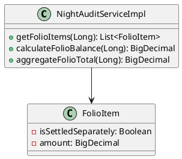
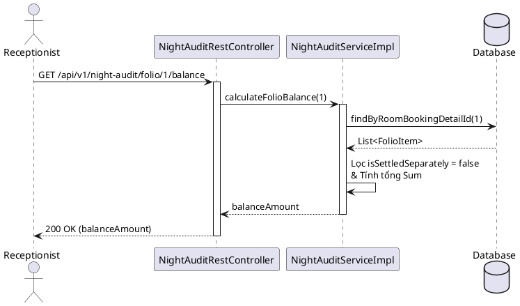

# ENGINEERING DESIGN SPECIFICATION (EDS)

| Field | Value |
| --- | --- |
| **Document ID** | `KAWAI-MOD5-EDS-UC24` |
| **Version** | 1.0 |
| **Date** | 2026-06-21 |
| **Status** | Approved |
| **Document Owner** | `Antigravity AI` |
| **Author** | `Antigravity AI` |
| **Reviewed by** | `Ngô Thị Ngọc Lan` |
| **DPO Sign-off** | `[x] N/A` |
| **Approved by** | `Ngô Thị Ngọc Lan` |
| **Last Review** | 2026-06-21 |
| **Based on EDS** | v2.0 |

---

## 1. Tổng quan Module

| Category | Description |
| --- | --- |
| **Module Name** | `MOD5 - Finance & Reports` |
| **Bounded Context** | Night Audit & Folio Aggregation (UC24) |
| **Data Classification** | Internal / Financial |
| **Compliance Scope** | Kiểm toán nội bộ, Kế toán doanh thu |
| **Upstream Dependencies** | `Housekeeping (UC10)`, `RoomService` |
| **Downstream Consumers** | `Checkout (UC22)` |

---

## 2. Ma trận Truy vết (Traceability Matrix)

| Requirement ID | Spec Version | Implemented Component | Status |
| --- | --- | --- | --- |
| `UC24.1` | v1.0 | `NightAuditServiceImpl.getFolioItems` | 🟢 DONE |
| `UC24.2` | v1.0 | `NightAuditServiceImpl.calculateFolioBalance` | 🟢 DONE |
| `BR-FIN-03` | v1.0 | `NightAuditServiceImpl` | 🟢 DONE |

---

## 3. Architecture Decision Records (ADR)

*   **ADR-002: Batch Processing cho Night Audit**
    *   *Context:* Hàng đêm cần cộng phí tiền phòng, minibar vào Folio.
    *   *Decision:* Sử dụng Spring `@Scheduled` hoặc gọi API trigger thủ công. Folio items được aggregate realtime khi cần (`calculateFolioBalance`).
    *   *Consequences:* Tránh lưu trữ dư thừa, đảm bảo tính chính xác tại thời điểm truy vấn.

---

## 4. Non-Functional Requirements & SLA

#### 4.1. Performance & Latency
| Metric | Target | Measurement Method |
| --- | --- | --- |
| **API Latency (p95)** | < 300ms | APM / Actuator Metrics |
| **Throughput** | 100 req/s | JMeter / K6 |

#### 4.2. Reliability
| Metric | Target | Failover Strategy |
| --- | --- | --- |
| **Availability** | 99.9% | Kubernetes Pod restart |
| **Data Durability** | RPO = 0 | Transactional logs |

#### 4.3. Security
| Category | Requirement | Target | Verification Method |
| --- | --- | --- | --- |
| **Access control** | Chỉ Manager/System | Least privilege | Role-based / API Auth |

#### 4.4. Scalability & Capacity Planning
Tải dự kiến `10,000` items/tháng. Hệ thống có khả năng scale ngang cho Read Replica.

---

## 5. Static Modeling (Mô hình Tĩnh)

#### 5.1. Class Diagram (PlantUML)



---

## 6. Dynamic Modeling (Mô hình Động)

#### 6.1. Sequence Diagram — Happy Path (PlantUML)



#### 6.2. Sequence Diagram — Error Path (PlantUML)
*Không áp dụng do trả về BigDecimal.ZERO nếu không tìm thấy items.*

#### 6.3. State Machine (Vòng đời)
*Không áp dụng (Folio items phụ thuộc vào trạng thái chung của Booking Detail).*

---

## 7. Domain Event Catalog

#### 7.1. Events Published (Phát ra)
- `NightAuditCompleted`: (Tương lai) Khi tiến trình Night Audit chạy xong hàng đêm.

#### 7.2. Events Consumed (Tiêu thụ)
- `RoomChargeAdded`: Khi hệ thống khác thêm phí vào Folio.

---

## 8. Interface Specification (Đặc tả Giao diện)

Không áp dụng (API thuần / Logic Service).

---

## 9. API Specification (Đặc tả API)

#### 9.1. Lấy Balance Folio
*   **Method:** `GET`
*   **Path:** `/api/v1/night-audit/folio/{id}/balance`
*   **Request Payload:** None
*   **Response (200 OK):**
```json
{
  "balance": 1500000.00
}
```

---

## 10. Bảng mã lỗi (Error Codes)

Không có mã lỗi nghiệp vụ đặc thù, chỉ sử dụng HTTP 500 nếu Database lỗi.

---

## 11. Quy trình Triển khai (Step-by-Step)

#### 11.1. Prerequisites
- [x] Database Schema `Folio_Items` đã có sẵn.

#### 11.2. Pre-Migration Checklist
- [x] Không cần thiết.

#### 11.3. Implementation Steps
1. Tích hợp `NightAuditServiceImpl`
2. Khởi tạo bean Spring.

#### 11.4. Deployment Checklist
- [x] Service hoạt động đúng logic tính tổng khi gọi từ UC22.

---

## 12. Rollback & Incident Runbook

#### 12.1. Rollback Trigger (Điều kiện Revert)
- Tính sai tiền nợ khách hàng hàng loạt.

#### 12.2. Rollback Steps
- Tạm dừng service bằng tính năng Feature Flag (nếu có) hoặc revert commit git.

#### 12.3. Notification Protocol
- Báo qua kênh Telegram/Zalo: `🚨 [UC24] Cảnh báo sai lệch Folio Balance`.

#### 12.4. Post-Incident Review (PIR)
- Thực hiện rà soát trong 48h.

---

## 13. Kịch bản Kiểm thử Chi tiết

#### 13.1. Unit Tests
- **TC-UNIT-01:** Test hàm `calculateFolioBalance` loại trừ các item đã settled (`isSettledSeparately = true`).

#### 13.2. Integration Tests
- **TC-INT-01:** Test luồng DB thực tế.

#### 13.3. E2E / Security Tests
- **TC-E2E-01:** Test quyền Access cho Endpoint (Manager/Receptionist).

---

## 14. Phương pháp Xác minh (Verification)

#### 14.1. Database Verification
```sql
SELECT sum(amount) FROM Folio_Items WHERE room_booking_detail_id = 1 AND is_settled_separately = false;
```

#### 14.2. Log / Audit Verification
```bash
grep "calculateFolioBalance" logs/spring.log
```

---

## 15. Mẫu thử thực tế (API Verification Samples)

#### 15.1. Happy Path
`curl -X GET http://localhost:8080/api/v1/night-audit/folio/1/balance -H "Authorization: Bearer [TOKEN]"`

#### 15.2. Error Paths
Không có.

---

## 16. Bảng tổng hợp phân quyền (Authorization Matrix)

| Endpoint | GUEST | RECEPTIONIST | MANAGER | ADMIN |
| --- | :---: | :---: | :---: | :---: |
| GET `/api/v1/night-audit/...` | ❌ | ✔️ | ✔️ | ✔️ |

---

## 17. Phụ lục

#### A. Thuật ngữ
- **Night Audit:** Tiến trình chốt số liệu hàng đêm.
- **Folio:** Bảng tính kê khai chi phí của khách.

#### B. Tài liệu tham chiếu
- `EDS_TEMPLATE_V2.0.md`
