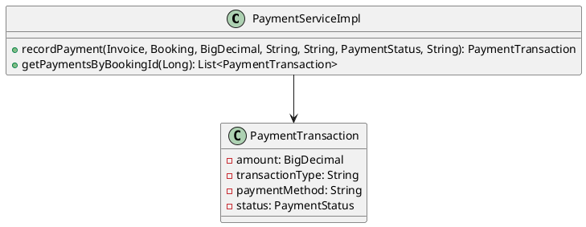
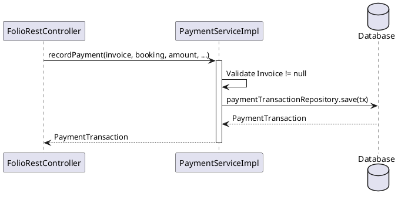
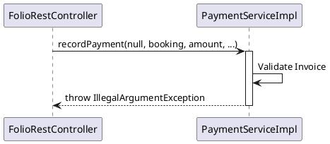
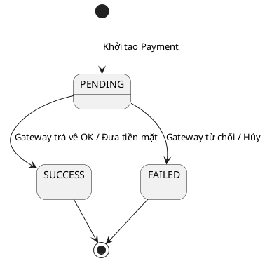

# ENGINEERING DESIGN SPECIFICATION (EDS)

| Field | Value |
| --- | --- |
| **Document ID** | `KAWAI-MOD5-EDS-UC25` |
| **Version** | 1.0 |
| **Date** | 2026-06-21 |
| **Status** | Approved |
| **Document Owner** | `Antigravity AI` |
| **Author** | `Antigravity AI` |
| **Reviewed by** | `Ngô Thị Ngọc Lan` |
| **DPO Sign-off** | `[x] N/A` |
| **Approved by** | `Ngô Thị Ngọc Lan` |
| **Last Review** | 2026-06-21 |
| **Based on EDS** | v2.0 |

---

## 1. Tổng quan Module

| Category | Description |
| --- | --- |
| **Module Name** | `MOD5 - Finance & Reports` |
| **Bounded Context** | Payment & Transaction Recording (UC25) |
| **Data Classification** | Internal / Highly Financial |
| **Compliance Scope** | Kiểm toán thu chi, Báo cáo dòng tiền |
| **Upstream Dependencies** | `Checkout (UC22)` |
| **Downstream Consumers** | `Revenue Reports` |

---

## 2. Ma trận Truy vết (Traceability Matrix)

| Requirement ID | Spec Version | Implemented Component | Status |
| --- | --- | --- | --- |
| `UC25.1` | v1.0 | `PaymentServiceImpl.recordPayment` | 🟢 DONE |
| `UC25.2` | v1.0 | `PaymentServiceImpl.getPaymentsByBookingId` | 🟢 DONE |

---

## 3. Architecture Decision Records (ADR)

*   **ADR-003: Quản lý Trạng thái Giao dịch Payment**
    *   *Context:* Cần ghi nhận chính xác dòng tiền thu vào (Tiền mặt, VNPay, Thẻ).
    *   *Decision:* Sử dụng `PaymentTransaction` table với status enum (SUCCESS, FAILED, PENDING). Fallback status được lưu dưới dạng chuỗi `gatewayStatus`.
    *   *Consequences:* Dễ dàng trace lại giao dịch nếu Gateway (VNPay) bị lỗi.

---

## 4. Non-Functional Requirements & SLA

#### 4.1. Performance & Latency
| Metric | Target | Measurement Method |
| --- | --- | --- |
| **API Latency (p95)** | < 200ms | APM |
| **Throughput** | 50 req/s | JMeter |

#### 4.2. Reliability
| Metric | Target | Failover Strategy |
| --- | --- | --- |
| **Availability** | 99.9% | Database Replication |
| **Data Durability** | RPO = 0 | Write-Ahead Logs (WAL) |

#### 4.3. Security
| Category | Requirement | Target | Verification Method |
| --- | --- | --- | --- |
| **Data Integrity** | Không thể sửa giao dịch | Immutable Logic | Code Review |

#### 4.4. Scalability & Capacity Planning
Tải dự kiến `10,000` tx/tháng. Bảng PaymentTransaction có thể Partition theo năm nếu phình to.

---

## 5. Static Modeling (Mô hình Tĩnh)

#### 5.1. Class Diagram (PlantUML)



---

## 6. Dynamic Modeling (Mô hình Động)

#### 6.1. Sequence Diagram — Happy Path (PlantUML)



#### 6.2. Sequence Diagram — Error Path (PlantUML)



#### 6.3. State Machine (Vòng đời Giao dịch)


---

## 7. Domain Event Catalog

#### 7.1. Events Published (Phát ra)
- `PaymentRecorded`: Phát ra khi lưu DB thành công.

#### 7.2. Events Consumed (Tiêu thụ)
- `CheckoutRequested`: Kích hoạt hàm `recordPayment`.

---

## 8. Interface Specification (Đặc tả Giao diện)
Không áp dụng (Logic core).

---

## 9. API Specification (Đặc tả API)
Không áp dụng (Hàm internal được gọi bởi Controller khác).

---

## 10. Bảng mã lỗi (Error Codes)

| HTTP Code | Nội dung | Giải pháp |
| --- | --- | --- |
| `500` | `Invoice cannot be null for payment transaction` | Gắn Invoice vào trước khi gọi. |

---

## 11. Quy trình Triển khai (Step-by-Step)

#### 11.1. Prerequisites
- [x] Đã khởi tạo schema bảng `Payment_Transactions`.

#### 11.2. Pre-Migration Checklist
- [x] N/A.

#### 11.3. Implementation Steps
1. Deploy `PaymentServiceImpl.java`.

#### 11.4. Deployment Checklist
- [x] Lịch sử thanh toán được ghi nhận đúng sau khi Checkout.

---

## 12. Rollback & Incident Runbook

#### 12.1. Rollback Trigger (Điều kiện Revert)
- Lưu sai số tiền, Method bị NULL.

#### 12.2. Rollback Steps
- Revert file `PaymentServiceImpl`.

#### 12.3. Notification Protocol
- `"🚨 [UC25] Lỗi ghi nhận dòng tiền"` báo về Kế toán trưởng.

#### 12.4. Post-Incident Review (PIR)
- Thực hiện review trong vòng 24h.

---

## 13. Kịch bản Kiểm thử Chi tiết

#### 13.1. Unit Tests
- **TC-UNIT-01:** Truyền Invoice null -> Quăng lỗi `IllegalArgumentException`.
- **TC-UNIT-02:** Truyền đầy đủ dữ liệu -> Trả về object lưu trữ thành công.

#### 13.2. Integration Tests
- **TC-INT-01:** Test lưu xuống DB có sinh tự động `createdAt` hay không.

#### 13.3. E2E / Security Tests
- **TC-E2E-01:** Đảm bảo không thể sửa lại (Update) một transaction đã SUCCESS.

---

## 14. Phương pháp Xác minh (Verification)

#### 14.1. Database Verification
```sql
SELECT * FROM payment_transactions WHERE booking_id = [ID] ORDER BY created_at DESC;
```

#### 14.2. Log / Audit Verification
Không cấu hình log riêng biệt.

---

## 15. Mẫu thử thực tế (API Verification Samples)
Không áp dụng.

---

## 16. Bảng tổng hợp phân quyền (Authorization Matrix)
Không áp dụng.

---

## 17. Phụ lục

#### A. Thuật ngữ
- **Payment Transaction:** Lịch sử ghi nhận từng lần thu tiền/trả tiền.
- **Gateway Status:** Chuỗi trả về từ bên thứ 3 (ví dụ: `00` của VNPay).

#### B. Tài liệu tham chiếu
- `EDS_TEMPLATE_V2.0.md`
