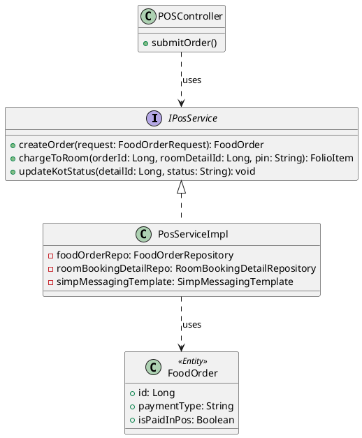
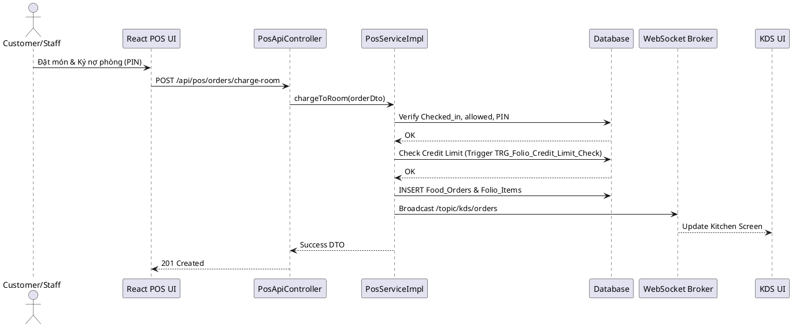

# ENGINEERING DOCUMENTATION STANDARD (EDS) v2.0

## WF-05 — F&B / POS / Ghi nợ Folio

| Field                    | Value                   |
| ------------------------ | ----------------------- |
| **Document ID**    | `KAWAI-MOD3-IMP-WF05` |
| **Version**        | 1.0                     |
| **Date**           | 2026-07-02              |
| **Status**         | Draft                   |
| **Document Owner** | Trịnh Minh Đức       |
| **Author**         | Trịnh Minh Đức       |
| **Reviewed by**    | Nguyễn Xuân Lưu      |
| **Based on EDS**   | v2.0                    |

---

### 1. Tổng quan Module

| Field                           | Value                                                      |
| ------------------------------- | ---------------------------------------------------------- |
| **Module Name**           | `Module 3 - F&B POS / Room Service`                      |
| **Bounded Context**       | `Food and Beverage`                                      |
| **Data Classification**   | Internal / Confidential                                    |
| **Upstream Dependencies** | `Module 2 (Front Office - RoomBookingDetail, Customers)` |
| **Downstream Consumers**  | `Module 5 (Finance - FolioItems, ConsolidatedInvoice)`   |

---

### 2. Ma trận Truy vết (Traceability Matrix)

| Requirement ID   | Loại (BR/ADR/US) | Mô tả yêu cầu                                             | Thành phần Code                                                  | Compliance Target |
| ---------------- | ----------------- | ------------------------------------------------------------- | ------------------------------------------------------------------ | ----------------- |
| BR-FB-01         | Business Rule     | Điều kiện ghi nợ phòng (Checked_in, Allowed, PIN, Limit) | `PosServiceImpl.chargeToRoom()`                                  | —                |
| BR-FB-02         | Business Rule     | WebSocket real-time update KOT/Hết món                      | `KdsWebsocketController`, `PosServiceImpl`                     | —                |
| BR-FB-04         | Business Rule     | Vòng đời KOT (Pending -> Cooking -> Ready -> Served)       | `FoodOrderRepository`, KDS UI                                    | —                |
| BR-FO-06         | Business Rule     | Hạn mức nợ phòng (Credit Limit)                           | `TRG_Folio_Credit_Limit_Check` DB Trigger                        | —                |
| UC16, UC17, UC19 | User Story        | Giao diện gọi món (Dine-in / Room Service) và KDS         | React Frontend:`OrderFoodComponent`, `POSScreen`, `KDSBoard` | —                |
| ADR-01           | Decision          | Spring Boot MVC Layered                                       | `PosApiController`, `PosServiceImpl`                           | —                |

---

### 3. Architecture Decision Records (ADR)

#### ADR-05.1 — Giao tiếp KDS Real-time

| Field              | Value      |
| ------------------ | ---------- |
| **Status**   | Accepted   |
| **Deciders** | Tech Lead  |
| **Date**     | 2026-07-02 |

**Bối cảnh (Context)**
Hệ thống F&B cần thông báo lập tức cho nhà bếp (KDS) khi có món mới được đặt (Dine-in hoặc Room Service) và báo lại cho POS khi món hết hàng hoặc đã sẵn sàng.

**Quyết định (Decision)**
Sử dụng **Spring WebSocket với STOMP broker** thay vì HTTP Polling để tối ưu hóa tài nguyên server và đảm bảo độ trễ thấp nhất. Frontend React sẽ dùng `SockJS` và `@stomp/stompjs` để nhận message.

---

### 4. Non-Functional Requirements & SLA

| Category              | Requirement          | Target SLA | Measurement Method |
| --------------------- | -------------------- | ---------- | ------------------ |
| **Latency**     | API order submission | < 200ms    | k6 load test       |
| **Real-time**   | WebSocket Delivery   | < 50ms     | WebSocket ping     |
| **Consistency** | Transactional Folio  | 100%       | Unit Tests         |

---

### 5. Static Modeling (Mô hình Tĩnh)

#### 5.1. Class Diagram (Backend & Frontend)



#### 5.2. Data Structure (Database Entities)

- `Food_Orders`: Bảng cha lưu thông tin tổng quát.
- `Food_Order_Details`: Lưu món ăn chi tiết và trạng thái KOT.
- `Menu_Items`: is_available flag.

---

### 6. Dynamic Modeling (Mô hình Động)

#### 6.1. Sequence Diagram — Happy Path (Post-to-Room)



---

### 7. Interface Specification & API Specification

#### 7.1. API Endpoints

| Method | Path                                 | Auth Level | Required Roles                  |
| ------ | ------------------------------------ | ---------- | ------------------------------- |
| POST   | `/api/pos/orders`                  | JWT Bearer | `ROLE_FB_STAFF, CUSTOMER`     |
| POST   | `/api/pos/orders/{id}/charge-room` | JWT Bearer | `ROLE_FB_STAFF, CUSTOMER`     |
| PATCH  | `/api/pos/kot/{detailId}/status`   | JWT Bearer | `ROLE_FB_STAFF, ROLE_KITCHEN` |

#### 7.2. Schemas

**POST /api/pos/orders/{id}/charge-room**
*Request:*

```json
{
  "roomBookingDetailId": 123,
  "pin": "1234"
}
```

---

### 8. Bảng mã lỗi (Error Codes)

| Code       | HTTP Status | Message (EN)                       | Trigger Condition           |
| ---------- | ----------- | ---------------------------------- | --------------------------- |
| `FB-001` | 400         | Room not checked in                | Phòng chưa Check-in       |
| `FB-002` | 403         | Invalid PIN / Charging not allowed | Sai PIN hoặc cấm ghi nợ  |
| `FB-003` | 403         | Credit Limit Exceeded              | Vượt hạn mức nợ phòng |
| `FB-004` | 404         | Menu Item out of stock             | Món đã hết hàng        |

---

### 9. Kịch bản Kiểm thử Chi tiết

#### 9.1. Frontend (React)

- **Component**: `ChargeRoomModal`
- **Luồng**: Nhập PIN -> Call API -> Bắt lỗi 403 và hiển thị "Mã PIN không đúng hoặc vượt hạn mức". Thành công -> clear giỏ hàng.

#### 9.2. Backend (Java Spring)

- Tham khảo file `TDD_WF05_SPEC.md`.

---

*EDS cho WF-05 - F&B POS / Room Service*
