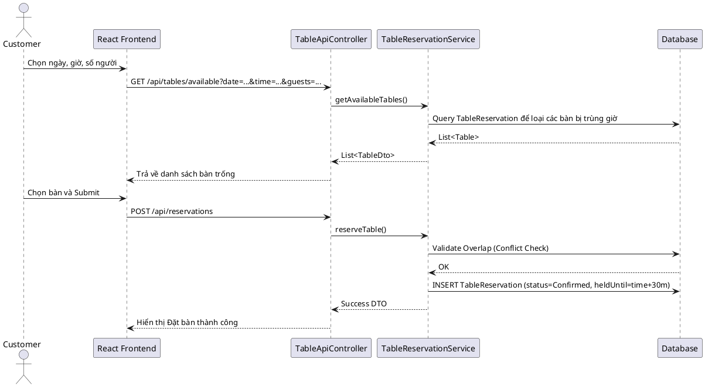

# ENGINEERING DOCUMENTATION STANDARD (EDS) v2.0

## WF-23 — Đặt Bàn Trực Tuyến

| Field                    | Value                   |
| ------------------------ | ----------------------- |
| **Document ID**    | `KAWAI-MOD3-IMP-WF23` |
| **Version**        | 1.0                     |
| **Date**           | 2026-07-02              |
| **Status**         | Draft                   |
| **Document Owner** | Trịnh Minh Đức       |
| **Author**         | Trịnh Minh Đức       |
| **Reviewed by**    | Nguyễn Xuân Lưu      |
| **Based on EDS**   | v2.0                    |

---

### 1. Tổng quan Module

| Field                         | Value                                  |
| ----------------------------- | -------------------------------------- |
| **Module Name**         | `Module 3 - Table Reservation (F&B)` |
| **Bounded Context**     | `Food and Beverage`                  |
| **Data Classification** | Public / Internal                      |

---

### 2. Ma trận Truy vết (Traceability Matrix)

| Requirement ID | Loại (BR/ADR/US) | Mô tả yêu cầu                                                 | Thành phần Code                                              |
| -------------- | ----------------- | ----------------------------------------------------------------- | -------------------------------------------------------------- |
| BR-FB-03       | Business Rule     | Thời gian giữ bàn tối đa 30 phút, giải phóng nếu No-show | `TableReservationService`, `DynamicJobManager` (Scheduler) |
| UC14, UC21     | User Story        | Tìm kiếm, lọc sức chứa, đặt bàn, validate Overlap         | `TableApiController`, `TableReservationRepository`         |

---

### 3. Non-Functional Requirements & SLA

| Category              | Requirement                | Target SLA | Measurement Method |
| --------------------- | -------------------------- | ---------- | ------------------ |
| **Latency**     | API find available tables  | < 150ms    | k6 load test       |
| **Concurrency** | Tránh double booking bàn | 100%       | Optimistic Locking |

---

### 4. Static Modeling (Mô hình Tĩnh)

#### 4.1. Entity

- `RestaurantTable`: Lưu ID bàn, số ghế (capacity), khu vực (zone), trạng thái hiện tại.
- `TableReservation`: Lưu `customerId`, `tableId`, `reserveDate`, `reserveTime`, `status`, `heldUntil`.

---

### 5. Dynamic Modeling (Mô hình Động)

#### 5.1. Sequence Diagram — Happy Path



---

### 6. Interface Specification & API Specification

#### 6.1. API Endpoints

| Method | Path                              | Auth Level          |
| ------ | --------------------------------- | ------------------- |
| GET    | `/api/tables/available`         | Public / JWT Bearer |
| POST   | `/api/reservations`             | JWT Bearer          |
| PATCH  | `/api/reservations/{id}/cancel` | JWT Bearer          |

#### 6.2. Request Schema

**POST /api/reservations**

```json
{
  "tableId": 12,
  "reserveDate": "2026-10-10",
  "reserveTime": "19:00:00",
  "guestsCount": 4
}
```

---

### 7. Bảng mã lỗi (Error Codes)

| Code       | HTTP Status | Message (EN)           | Trigger Condition                    |
| ---------- | ----------- | ---------------------- | ------------------------------------ |
| `FB-010` | 409         | Table already reserved | Bàn đã bị đặt trong khung giờ |
| `FB-011` | 400         | Invalid guests count   | Số khách vượt capacity của bàn |

---

*EDS cho WF-23 - Đặt Bàn Trực Tuyến*
