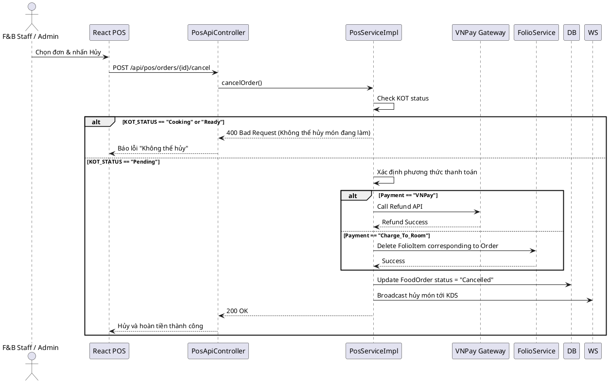

# ENGINEERING DOCUMENTATION STANDARD (EDS) v2.0

## WF-24 — Hủy Đơn Hàng F&B & Hoàn Tiền

| Field                    | Value                   |
| ------------------------ | ----------------------- |
| **Document ID**    | `KAWAI-MOD3-IMP-WF24` |
| **Version**        | 1.0                     |
| **Date**           | 2026-07-02              |
| **Status**         | Draft                   |
| **Document Owner** | Trịnh Minh Đức       |
| **Author**         | Trịnh Minh Đức       |
| **Reviewed by**    | Nguyễn Xuân Lưu      |
| **Based on EDS**   | v2.0                    |

---

### 1. Tổng quan Module

| Field                         | Value                            |
| ----------------------------- | -------------------------------- |
| **Module Name**         | `Module 3 - F&B Cancel/Refund` |
| **Bounded Context**     | `Food and Beverage`            |
| **Data Classification** | Internal / Confidential          |

---

### 2. Ma trận Truy vết (Traceability Matrix)

| Requirement ID | Loại (BR/ADR/US) | Mô tả yêu cầu                                                                                   | Thành phần Code                              |
| -------------- | ----------------- | --------------------------------------------------------------------------------------------------- | ---------------------------------------------- |
| WF-24          | Business Workflow | Khách yêu cầu hủy đơn, kiểm tra trạng thái bếp, nếu chưa nấu thì hủy và hoàn tiền | `FoodOrderService`, `PaymentApiController` |
| BR-FIN-08      | Business Rule     | Quy trình hoàn tiền (Refund Workflow) qua VNPay hoặc Trừ nợ Folio                             | `FolioRestController`, `VnPayServiceImpl`  |
| UC19           | User Story        | Quản lý Hủy Đơn                                                                                | `PosApiController.cancelOrder()`             |

---

### 3. Non-Functional Requirements & SLA

| Category              | Requirement                   | Target SLA |
| --------------------- | ----------------------------- | ---------- |
| **Consistency** | Không hoàn tiền sai lệch  | 100%       |
| **Latency**     | Xử lý Refund API (Internal) | < 300ms    |

---

### 4. Static Modeling (Mô hình Tĩnh)

#### 4.1. Sequence Diagram — Hủy & Hoàn Tiền (VNPay & Post-to-Room)

---

### 5. Interface Specification & API Specification

#### 5.1. API Endpoints

| Method | Path                            | Auth Level                             |
| ------ | ------------------------------- | -------------------------------------- |
| POST   | `/api/pos/orders/{id}/cancel` | JWT Bearer (ROLE_FB_STAFF, ROLE_ADMIN) |

---

### 6. Bảng mã lỗi (Error Codes)

| Code       | HTTP Status | Message (EN)                    | Trigger Condition                    |
| ---------- | ----------- | ------------------------------- | ------------------------------------ |
| `FB-020` | 400         | Cannot cancel order in progress | Đơn hàng đang được nấu       |
| `FB-021` | 500         | Refund gateway failed           | Lỗi kết nối VNPay khi hoàn tiền |

---

*EDS cho WF-24 - Hủy Đơn Hàng F&B & Hoàn Tiền*
