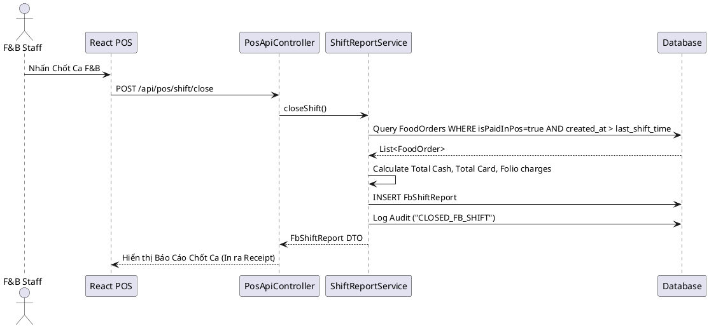

# ENGINEERING DOCUMENTATION STANDARD (EDS) v2.0

## WF-25 — Chốt Ca & Báo Cáo F&B

| Field                    | Value                   |
| ------------------------ | ----------------------- |
| **Document ID**    | `KAWAI-MOD3-IMP-WF25` |
| **Version**        | 1.0                     |
| **Date**           | 2026-07-02              |
| **Status**         | Draft                   |
| **Document Owner** | Trịnh Minh Đức       |
| **Author**         | Trịnh Minh Đức       |
| **Reviewed by**    | Nguyễn Xuân Lưu      |
| **Based on EDS**   | v2.0                    |

---

### 1. Tổng quan Module

| Field                         | Value                           |
| ----------------------------- | ------------------------------- |
| **Module Name**         | `Module 3 - F&B Shift/Report` |
| **Bounded Context**     | `Food and Beverage`           |
| **Data Classification** | Internal / Confidential         |

---

### 2. Ma trận Truy vết (Traceability Matrix)

| Requirement ID | Loại (BR/ADR/US) | Mô tả yêu cầu                                                                    | Thành phần Code                 |
| -------------- | ----------------- | ------------------------------------------------------------------------------------ | --------------------------------- |
| WF-25          | Business Workflow | Chốt ca, gom các đơn is_paid_in_pos = true, tạo snapshot báo cáo doanh thu ca | `ShiftReportService`            |
| BR-SYS-04      | Business Rule     | Audit Log việc chốt ca                                                             | `AuditLogAspect`                |
| UC18           | User Story        | Tất toán POS / Post-to-Room / Chốt ca                                             | `PosApiController.closeShift()` |

---

### 3. Static Modeling (Mô hình Tĩnh)

#### 3.1. Entity

- `FbShiftReport`: Lưu tổng doanh thu ca, người chốt ca, thời gian bắt đầu, thời gian kết thúc, số lượng đơn, số tiền mặt/số tiền thẻ.

---

### 4. Dynamic Modeling (Mô hình Động)

#### 4.1. Sequence Diagram — Chốt Ca

---

### 5. Interface Specification & API Specification

#### 5.1. API Endpoints

| Method | Path                       | Auth Level                                             |
| ------ | -------------------------- | ------------------------------------------------------ |
| POST   | `/api/pos/shift/close`   | JWT Bearer (ROLE_FB_STAFF, ROLE_MANAGER)               |
| GET    | `/api/pos/shift/current` | JWT Bearer (Lấy thống kê ca hiện tại chưa chốt) |

---

*EDS cho WF-25 - Chốt Ca & Báo Cáo F&B*
