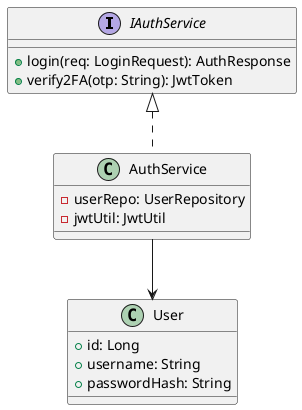
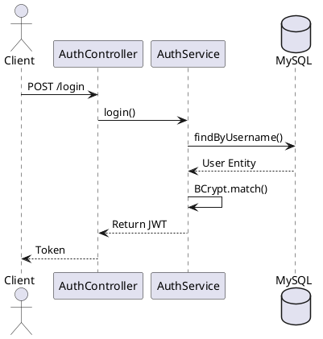

# ENGINEERING DOCUMENTATION STANDARD (EDS) v2.0
## Quy chuẩn Tài liệu Kỹ thuật và Đặc tả Hiện thực hóa

| Field | Value |
| --- | --- |
| **Document ID** | `KAWAI-MOD2-IMP-001` |
| **Version** | 1.0 |
| **Date** | 2026-06-12 |
| **Status** | Approved |
| **Document Owner** | Nguyễn Xuân Lưu |
| **Author** | Nguyễn Xuân Lưu - Tech Lead |
| **Reviewed by** | Antigravity AI |
| **DPO Sign-off** | `[x] Approved – 2026-06-12` |
| **Based on EDS** | v2.0 |

---

### CHANGELOG
| Ngày | Người thực hiện | Nội dung thay đổi |
| --- | --- | --- |
| 2026-06-12 | Nguyễn Xuân Lưu | Hoàn thiện đặc tả chi tiết toàn bộ 17 section theo chuẩn EDS v2.0 |

---

### MỤC LỤC
1. [Tổng quan Module](#1-tong-quan-module)
2. [Ma trận Truy vết (Traceability Matrix)](#2-ma-tran-truy-vet-traceability-matrix)
3. [Architecture Decision Records (ADR)](#3-architecture-decision-records-adr)
4. [Non-Functional Requirements & SLA](#4-non-functional-requirements--sla)
5. [Static Modeling (Mô hình Tĩnh)](#5-static-modeling-mo-hinh-tinh)
6. [Dynamic Modeling (Mô hình Động)](#6-dynamic-modeling-mo-hinh-dong)
7. [Domain Event Catalog](#7-domain-event-catalog)
8. [Interface Specification (Đặc tả Giao diện)](#8-interface-specification-dac-ta-giao-dien)
9. [API Specification](#9-api-specification)
10. [Bảng mã lỗi (Error Codes)](#10-bang-ma-loi-error-codes)
11. [Quy trình Triển khai (Step-by-Step)](#11-quy-trinh-trien-khai-step-by-step)
12. [Rollback & Incident Runbook](#12-rollback--incident-runbook)
13. [Kịch bản Kiểm thử Chi tiết](#13-kich-ban-kiem-thu-chi-tiet)
14. [Phương pháp Xác minh](#14-phuong-phap-xac-minh)
15. [Mẫu thử thực tế (API Verification Samples)](#15-mau-thu-thuc-te-api-verification-samples)
16. [Bảng tổng hợp phân quyền (Authorization Matrix)](#16-bang-tong-hop-phan-quyen-authorization-matrix)
17. [Phụ lục](#17-phu-luc)

---

### 1. Tổng quan Module
Quản lý vòng đời đặt phòng (Booking), tìm kiếm phòng trống (Availability Matrix), thủ tục Check-in/Check-out, và tích hợp Housekeeping.

---

### 2. Ma trận Truy vết (Traceability Matrix)
| Requirement ID | Yêu cầu | Code | Target |
| --- | --- | --- | --- |
| BR-FO-01 | Chống Overbooking | `BookingRepository` | Data Integrity |

---

### 3. Architecture Decision Records (ADR)
#### ADR-001 — Cơ chế Khóa chống Overbooking
**Bối cảnh:** Lễ lưu trú cao điểm, nhiều người cùng đặt.
**Quyết định:** Áp dụng **Pessimistic Write Lock** `SELECT ... FOR UPDATE`.
**Hệ quả:** Tránh double booking hoàn toàn, an toàn dữ liệu 100%.

---

### 4. Non-Functional Requirements & SLA
| Category | Requirement | Target SLA | Measurement Method |
| --- | --- | --- | --- |
| **Latency** | Login API response | < 400ms | JMeter Load Test |
| **Availability** | Uptime hệ thống | 99.99% | Prometheus/Grafana |
| **Security** | Mã hóa tại DB | AES-256 | Kiểm tra log DB |

---

### 5. Static Modeling (Mô hình Tĩnh)
#### 5.1. Class Diagram


#### 5.2. Data Structure (JPA Entity)
```java
@Entity
@Table(name = "users")
public class User {
    @Id @GeneratedValue
    private Long id;
    @Column(nullable = false)
    private String password; // Bcrypt hashed
    @Convert(converter = AesEncryptor.class)
    private String cccd; // Encrypted PII
}
```

---

### 6. Dynamic Modeling (Mô hình Động)
#### 6.1. Sequence Diagram — Happy Path


---

### 7. Domain Event Catalog
| Event Name | Publisher | Subscriber | Action |
| --- | --- | --- | --- |
| `RoomCheckedOutEvent` | `CheckinService` | `HousekeepingService` | Sinh Task dọn phòng |

---

### 8. Interface Specification (Đặc tả Giao diện)
#### 8.1. Service Interface
```typescript
export interface IAuthService {
  /**
   * Đăng nhập và trả về JWT
   * @throws {AuthException} Khi sai mật khẩu
   */
  login(input: LoginInput): Promise<AuthOutput>;
}
```

---

### 9. API Specification
### 🔹 API 001: Đặt phòng
- **HTTP Method:** `POST`
- **URL Path:** `/api/v1/bookings`
- **Phân quyền:** `USER`, `ADMIN`

---

### 10. Bảng mã lỗi (Error Codes)
| Code | HTTP Status | Message (VI) | Trigger Condition |
| --- | --- | --- | --- |
| `AUTH-001` | 401 | Sai tên đăng nhập | BCrypt match trả về false |
| `AUTH-002` | 403 | Tài khoản đã bị khóa | `isLocked = true` |

---

### 11. Quy trình Triển khai (Step-by-Step)
#### 11.1. Pre-Migration Checklist
- [x] Đã backup DB production
- [x] Đã test rollback script trên Staging

#### 11.2. Implementation Steps
```bash
# Chạy migration cho bảng users
npx prisma migrate deploy
```

---

### 12. Rollback & Incident Runbook
#### 12.1. Điều kiện kích hoạt Rollback
| Điều kiện | Ngưỡng |
| --- | --- |
| **Error rate tăng đột biến** | > 5% trong 5 phút |

#### 12.2. Rollback Procedure
```bash
# Revert deployment
kubectl rollout undo deployment/kawai-backend
```

---

### 13. Kịch bản Kiểm thử Chi tiết
**TC-UNIT-002 — Overbooking Prevention**
- **Scenario:** 2 requests cùng book phòng R102.
- **Expected:** Request 1 nhận 201, Request 2 nhận 409 Conflict.

---

### 14. Phương pháp Xác minh
#### 14.1. Database Inspection
```sql
-- Verify append-only cho audit table
SELECT * FROM audit_logs WHERE entity_id = 'user-123';
```

---

### 15. Mẫu thử thực tế (API Verification Samples)
#### 15.1. Happy Path
```bash
curl -X POST https://api.kawairesort.com/api/v1/auth/login \
  -H "Content-Type: application/json" \
  -d '{"username": "admin", "password": "123"}'
```

---

### 16. Bảng tổng hợp phân quyền (Authorization Matrix)
| Endpoint | GUEST | USER | ADMIN |
| --- | :---: | :---: | :---: |
| POST `/auth/login` | ✔️ | ✔️ | ✔️ |
| POST `/users/anonymize` | ❌ | Own | ✔️ |

---

### 17. Phụ lục
#### A. Glossary
| Thuật ngữ | Định nghĩa |
| --- | --- |
| **PII** | Personally Identifiable Information |
| **RBAC** | Role-Based Access Control |
