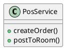
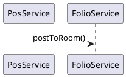

# ENGINEERING DOCUMENTATION STANDARD (EDS) v2.0
## Quy chuẩn Tài liệu Kỹ thuật và Đặc tả Hiện thực hóa

| Field | Value |
| --- | --- |
| **Document ID** | `KAWAI-MOD3-IMP-001` |
| **Version** | 1.0 |
| **Date** | 2026-06-12 |
| **Status** | Approved |
| **Document Owner** | Nguyễn Xuân Lưu |
| **Author** | Nguyễn Xuân Lưu - Tech Lead |

---

### MỤC LỤC
1. [Tổng quan Module](#1-tong-quan-module)
2. [Ma trận Truy vết (Traceability Matrix)](#2-ma-tran-truy-vet-traceability-matrix)
3. [Architecture Decision Records (ADR)](#3-architecture-decision-records-adr)
4. [Non-Functional Requirements & SLA](#4-non-functional-requirements--sla)
5. [Static Modeling (Mô hình Tĩnh)](#5-static-modeling-mo-hinh-tinh)
6. [Dynamic Modeling (Mô hình Động)](#6-dynamic-modeling-mo-hinh-dong)
7. [Domain Event Catalog](#7-domain-event-catalog)
8. [Interface Specification (Đặc tả Giao diện)](#8-interface-specification-dac-ta-giao-dien)
9. [API Specification](#9-api-specification)
10. [Bảng mã lỗi (Error Codes)](#10-bang-ma-loi-error-codes)
11. [Quy trình Triển khai (Step-by-Step)](#11-quy-trinh-trien-khai-step-by-step)
12. [Rollback & Incident Runbook](#12-rollback--incident-runbook)
13. [Kịch bản Kiểm thử Chi tiết](#13-kich-ban-kiem-thu-chi-tiet)
14. [Phương pháp Xác minh](#14-phuong-phap-xac-minh)
15. [Mẫu thử thực tế (API Verification Samples)](#15-mau-thu-thuc-te-api-verification-samples)
16. [Bảng tổng hợp phân quyền (Authorization Matrix)](#16-bang-tong-hop-phan-quyen-authorization-matrix)
17. [Phụ lục](#17-phu-luc)

---

### 1. Tổng quan Module
Quản lý Point of Sale nhà hàng, dịch vụ phòng, và luồng Post to Room ghi nợ tự động vào Folio.

---

### 2. Ma trận Truy vết (Traceability Matrix)
| Requirement ID | Loại | Mô tả yêu cầu | Thành phần Code |
| --- | --- | --- | --- |
| BR-POS-01 | Business Rule | Post to Room phải xác thực Credit Limit | `PosService.postToRoom()` |

---

### 3. Architecture Decision Records (ADR)
#### ADR-001 — Cơ chế Ký gửi (Post to Room)
**Bối cảnh:** Lễ tân và nhà hàng cần chia sẻ thông tin hóa đơn lưu trú.
**Quyết định:** Sử dụng Event-driven `PosOrderCompleted` để module Folio bắt và tính toán thay vì POS trừ tiền trực tiếp.
**Hệ quả:** Module rảnh rang, dễ scale.

---

### 4. Non-Functional Requirements & SLA
| Category | Requirement | Target SLA |
| --- | --- | --- |
| **Latency** | Post to room response | < 200ms |

---

### 5. Static Modeling (Mô hình Tĩnh)
#### 5.1. Class Diagram

---

### 6. Dynamic Modeling (Mô hình Động)
#### 6.1. Sequence Diagram

---

### 7. Domain Event Catalog
| Event Name | Publisher | Subscriber | Action |
| --- | --- | --- | --- |
| `PosOrderCompleted` | `PosService` | `FolioService` | Ghi nợ vào Folio |

---

### 8. Interface Specification (Đặc tả Giao diện)
`IPosService` with `postToRoom()`

---

### 9. API Specification
### 🔹 API 001: Ký gửi hóa đơn
- **HTTP Method:** `POST`
- **URL Path:** `/api/v1/pos/post-to-room`

---

### 10. Bảng mã lỗi (Error Codes)
| Code | HTTP Status | Message (VI) | Trigger Condition |
| --- | --- | --- | --- |
| `POS-001` | 400 | Phòng không tồn tại | RoomID invalid |

---

### 11. Quy trình Triển khai (Step-by-Step)
# Triển khai DB migration cho Order và OrderItem

---

### 12. Rollback & Incident Runbook
Rollback `orders` table.

---

### 13. Kịch bản Kiểm thử Chi tiết
**TC-UNIT-001 — Post to Room Success**
- **Scenario:** Hóa đơn hợp lệ.
- **Expected:** Event được publish thành công.

---

### 14. Phương pháp Xác minh
Kiểm tra message queue.

---

### 15. Mẫu thử thực tế (API Verification Samples)
`curl -X POST /api/v1/pos/post-to-room`

---

### 16. Bảng tổng hợp phân quyền (Authorization Matrix)
| Endpoint | GUEST | USER | ADMIN |
| --- | :---: | :---: | :---: |
| POST `/pos/post-to-room` | ❌ | ❌ | ✔️ |

---

### 17. Phụ lục
**Folio:** Hóa đơn tổng
