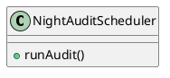
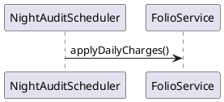

# ENGINEERING DOCUMENTATION STANDARD (EDS) v2.0
## Quy chuẩn Tài liệu Kỹ thuật và Đặc tả Hiện thực hóa

| Field | Value |
| --- | --- |
| **Document ID** | `KAWAI-MOD5-IMP-001` |
| **Version** | 1.0 |
| **Date** | 2026-06-12 |
| **Status** | Approved |
| **Document Owner** | Nguyễn Xuân Lưu |
| **Author** | Nguyễn Xuân Lưu - Tech Lead |

---

### MỤC LỤC
1. [Tổng quan Module](#1-tong-quan-module)
2. [Ma trận Truy vết (Traceability Matrix)](#2-ma-tran-truy-vet-traceability-matrix)
3. [Architecture Decision Records (ADR)](#3-architecture-decision-records-adr)
4. [Non-Functional Requirements & SLA](#4-non-functional-requirements--sla)
5. [Static Modeling (Mô hình Tĩnh)](#5-static-modeling-mo-hinh-tinh)
6. [Dynamic Modeling (Mô hình Động)](#6-dynamic-modeling-mo-hinh-dong)
7. [Domain Event Catalog](#7-domain-event-catalog)
8. [Interface Specification (Đặc tả Giao diện)](#8-interface-specification-dac-ta-giao-dien)
9. [API Specification](#9-api-specification)
10. [Bảng mã lỗi (Error Codes)](#10-bang-ma-loi-error-codes)
11. [Quy trình Triển khai (Step-by-Step)](#11-quy-trinh-trien-khai-step-by-step)
12. [Rollback & Incident Runbook](#12-rollback--incident-runbook)
13. [Kịch bản Kiểm thử Chi tiết](#13-kich-ban-kiem-thu-chi-tiet)
14. [Phương pháp Xác minh](#14-phuong-phap-xac-minh)
15. [Mẫu thử thực tế (API Verification Samples)](#15-mau-thu-thuc-te-api-verification-samples)
16. [Bảng tổng hợp phân quyền (Authorization Matrix)](#16-bang-tong-hop-phan-quyen-authorization-matrix)
17. [Phụ lục](#17-phu-luc)

---

### 1. Tổng quan Module
Kiểm toán đêm (Night Audit), chốt doanh thu, và hóa đơn tổng hợp (Folio).

---

### 2. Ma trận Truy vết (Traceability Matrix)
| Requirement ID | Loại | Mô tả yêu cầu | Thành phần Code |
| --- | --- | --- | --- |
| BR-FIN-01 | Business Rule | Night audit chốt sổ 2h sáng | `NightAuditScheduler.run()` |

---

### 3. Architecture Decision Records (ADR)
#### ADR-001 — Lập lịch Night Audit
**Bối cảnh:** Cần cộng tiền phòng vào 2h sáng mỗi đêm.
**Quyết định:** Sử dụng Spring `@Scheduled(cron = "0 0 2 * * ?")`.
**Hệ quả:** Đơn giản, tuy nhiên cần thiết lập Redis lock để tránh chạy 2 lần nếu có 2 server node.

---

### 4. Non-Functional Requirements & SLA
| Category | Requirement | Target SLA |
| --- | --- | --- |
| **Latency** | Night Audit completion | < 5 phút cho 1000 phòng |

---

### 5. Static Modeling (Mô hình Tĩnh)
#### 5.1. Class Diagram

---

### 6. Dynamic Modeling (Mô hình Động)
#### 6.1. Sequence Diagram

---

### 7. Domain Event Catalog
| Event Name | Publisher | Subscriber | Action |
| --- | --- | --- | --- |
| `NightAuditCompleted` | `NightAuditScheduler` | `ReportService` | Tạo báo cáo doanh thu |

---

### 8. Interface Specification (Đặc tả Giao diện)
`IFolioService` with `checkout()`

---

### 9. API Specification
### 🔹 API 001: Kích hoạt Night Audit thủ công
- **HTTP Method:** `POST`
- **URL Path:** `/api/v1/audit/run`

---

### 10. Bảng mã lỗi (Error Codes)
| Code | HTTP Status | Message (VI) | Trigger Condition |
| --- | --- | --- | --- |
| `FIN-001` | 400 | Đã audit trong ngày | BusinessDate đã update |

---

### 11. Quy trình Triển khai (Step-by-Step)
# Triển khai bảng FolioItem

---

### 12. Rollback & Incident Runbook
Rollback Folio balances.

---

### 13. Kịch bản Kiểm thử Chi tiết
**TC-UNIT-001 — Night Audit Success**
- **Scenario:** 5 phòng đang Occupied.
- **Expected:** Giá tiền được cộng thêm vào Folio tương ứng.

---

### 14. Phương pháp Xác minh
Kiểm tra bảng Business_Date.

---

### 15. Mẫu thử thực tế (API Verification Samples)
`curl -X POST /api/v1/audit/run`

---

### 16. Bảng tổng hợp phân quyền (Authorization Matrix)
| Endpoint | GUEST | USER | ADMIN |
| --- | :---: | :---: | :---: |
| POST `/audit/run` | ❌ | ❌ | ✔️ |

---

### 17. Phụ lục
**Night Audit:** Chốt sổ qua đêm.
