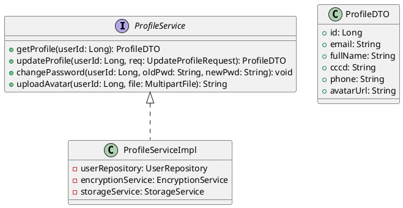
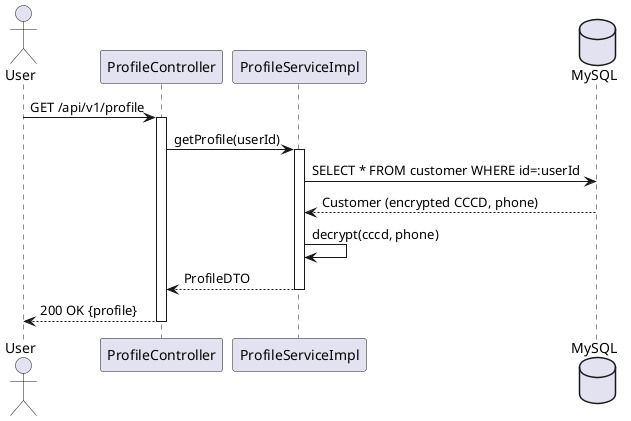

# ENGINEERING DOCUMENTATION STANDARD (EDS) v2.0

## UC02 — Quản lý hồ sơ cá nhân (ProfileService)

| Field | Value |
|-------|-------|
| **Document ID** | `KAWAI-EDS-MOD1-UC02-001` |
| **Version** | 1.0 |
| **Date** | 2026-06-14 |
| **Status** | Approved |
| **Document Owner** | Nguyễn Xuân Lưu |
| **Author** | Nguyễn Xuân Lưu — Developer |
| **Reviewed by** | Nguyễn Xuân Lưu — Tech Lead |
| **DPO Sign-off** | `[x] Approved – 2026-06-14` |
| **Approved by** | `[x] Nguyễn Xuân Lưu – 2026-06-14` |
| **Last Review** | 2026-06-14 |
| **Based on EDS** | v2.0 |

---

### CHANGELOG
| Ngày | Người thực hiện | Nội dung |
|------|-----------------|----------|
| 2026-06-14 | Nguyễn Xuân Lưu | Tạo tài liệu lần đầu |

---

### MỤC LỤC
1-17 sections

---

### 1. Tổng quan Module

| Field | Value |
|-------|-------|
| **Module Name** | Quản lý hồ sơ cá nhân (UC02) |
| **Bounded Context** | Auth & Identity |
| **Use Case** | UC02: Xem/sửa hồ sơ, đổi mật khẩu, upload avatar |
| **Data Classification** | PII (họ tên, CCCD, SĐT) |
| **Compliance** | Nghị định 13/2023/NĐ-CP |
| **Upstream** | UC01 (Login) |
| **Downstream** | UC03 (Employee), UC12 (Check-in) |

---

### 2. Traceability Matrix

| Requirement ID | Loại | Mô tả | Code Component | Compliance | ADR |
|----------------|------|-------|----------------|------------|-----|
| UC02.1 | US | Xem profile | `ProfileService.getProfile()` | — | — |
| UC02.2 | US | Sửa profile | `ProfileService.updateProfile()` | Nghị định 13/2023 | — |
| UC02.3 | US | Đổi mật khẩu | `ProfileService.changePassword()` | — | — |
| UC02.4 | US | Upload avatar | `ProfileService.uploadAvatar()` | — | — |
| BR-PII-01 | BR | CCCD phải 12 số | `ProfileServiceImpl.validateCCCD()` | — | — |

---

### 3. ADR

#### ADR-002 — PII Encryption at Rest

| Field | Value |
|-------|-------|
| **Status** | Accepted |
| **Date** | 2026-06-10 |

**Decision:** CCCD, SĐT được mã hóa AES-256 trước khi lưu DB.

---

### 4. Non-Functional & SLA

| Category | Requirement | Target SLA |
|----------|-------------|------------|
| **Latency** | API response p99 | < 200ms |
| **Availability** | Uptime | 99.9% |
| **Security** | CCCD encrypted | AES-256 |
| **File** | Avatar max 5MB, JPG/PNG | — |

---

### 5. Static Modeling

#### 5.1. Class Diagram



#### 5.2. Data Structure

```sql
CREATE TABLE customer (
    id BIGINT AUTO_INCREMENT PRIMARY KEY,
    email VARCHAR(255) UNIQUE NOT NULL,
    full_name VARCHAR(100),
    cccd_encrypted VARBINARY(255),
    phone_encrypted VARBINARY(255),
    avatar_url VARCHAR(500),
    updated_at TIMESTAMP DEFAULT CURRENT_TIMESTAMP ON UPDATE CURRENT_TIMESTAMP
);
```

---

### 6. Dynamic Modeling

#### 6.1. Sequence Diagram — Happy Path



#### 6.2. State Machine

UC02 không có state machine riêng. Profile data thay đổi nhưng không có flow trạng thái.

---

### 7. Domain Event Catalog

| Event Name | Trigger | Publisher | Subscriber(s) | Async? |
|------------|---------|-----------|---------------|--------|
| `ProfileUpdated` | Sửa profile | `ProfileService` | `AuditService` | Yes |
| `PasswordChanged` | Đổi password | `ProfileService` | `NotificationService` | Yes |

---

### 8. Interface Specification

```java
// ProfileService.java
// @version 1.0

public interface ProfileService {
    ProfileDTO getProfile(Long userId);
    ProfileDTO updateProfile(Long userId, UpdateProfileRequest req);
    void changePassword(Long userId, String oldPwd, String newPwd)
        throws InvalidPasswordException;
    String uploadAvatar(Long userId, MultipartFile file)
        throws FileSizeException, FileTypeException;
}
```

---

### 9. API Specification

| Method | Path | Auth | Roles | Rate Limit | Idempotent? |
|--------|------|------|-------|------------|-------------|
| GET | `/api/v1/profile` | JWT | All | 60/min | Yes |
| PUT | `/api/v1/profile` | JWT | All | 30/min | No |
| POST | `/api/v1/profile/change-password` | JWT | All | 10/min | No |
| POST | `/api/v1/profile/avatar` | JWT | All | 10/min | No |

**PUT `/api/v1/profile`**
*Request:* `{"fullName":"Nguyen Van B","cccd":"123456789012","phone":"0901234567"}`
*Response 200:* `{"id":1,"fullName":"Nguyen Van B","cccd":"****789012","phone":"****4567"}`

**POST `/api/v1/profile/change-password`**
*Request:* `{"oldPassword":"123456","newPassword":"abcdef"}`
*Response 200:* `{"message":"Password changed successfully"}`

---

### 10. Bảng mã lỗi

| Code | HTTP | Message (EN) | Message (VI) | Trigger |
|------|------|--------------|--------------|---------|
| `AUTH-006` | 400 | Invalid CCCD format | CCCD phải 12 số | CCCD sai format |
| `AUTH-007` | 400 | Invalid password | Sai mật khẩu hiện tại | Old password sai |
| `AUTH-008` | 400 | Password too weak | Mật khẩu quá yếu | newPwd < 8 chars |
| `AUTH-009` | 400 | Invalid file type | File không hợp lệ | Không phải JPG/PNG |
| `AUTH-010` | 413 | File too large | File quá lớn | > 5MB |

---

### 11. Deployment

```bash
mvn clean package -DskipTests
java -jar target/kawai-backend-1.0.jar --spring.profiles.active=staging
```

---

### 12. Rollback & Incident Runbook

| Điều kiện | Ngưỡng | Người quyết định |
|-----------|--------|-------------------|
| Profile update fail | > 5% trong 5 phút | On-call Engineer |

**Rollback:** `git checkout tags/v1.0.0 && mvn clean package`

---

### 13. Kịch bản Kiểm thử

**[Policy]** Test Data: SYNTHETIC. ❌ KHÔNG dùng Production PII.

#### 13.1. Unit Tests
- TC-UNIT-UC02-001: Get profile success
- TC-UNIT-UC02-002: Update profile success
- TC-UNIT-UC02-003: Change password success
- TC-UNIT-UC02-004: Upload avatar success
- TC-UNIT-UC02-005: Invalid CCCD → ValidationException

#### 13.2. E2E Tests
- TC-E2E-UC02-001: Login → Get profile → Update → Verify

---

### 14. Verification

```sql
SELECT id, email, full_name, cccd_encrypted IS NOT NULL as cccd_encrypted
FROM customer WHERE id = :userId;
```

---

### 15. Mẫu thử thực tế

```bash
# Get profile
curl -X GET https://api.kawairesort.com/api/v1/profile \
  -H "Authorization: Bearer [JWT]"

# Update profile
curl -X PUT https://api.kawairesort.com/api/v1/profile \
  -H "Authorization: Bearer [JWT]" \
  -H "Content-Type: application/json" \
  -d '{"fullName":"Nguyen Van B","cccd":"123456789012","phone":"0901234567"}'

# Change password
curl -X POST https://api.kawairesort.com/api/v1/profile/change-password \
  -H "Authorization: Bearer [JWT]" \
  -H "Content-Type: application/json" \
  -d '{"oldPassword":"123456","newPassword":"abcdef"}'
```

---

### 16. Authorization Matrix

| Endpoint | GUEST | CUSTOMER | RECEPTIONIST | ADMIN |
|----------|:-----:|:--------:|:------------:|:-----:|
| GET `/api/v1/profile` | ❌ | Own | Own | All |
| PUT `/api/v1/profile` | ❌ | Own | Own | All |
| POST `/api/v1/profile/change-password` | ❌ | Own | Own | Own |
| POST `/api/v1/profile/avatar` | ❌ | Own | Own | Own |

---

### PHỤ LỤC

#### A. Glossary
| Thuật ngữ | Định nghĩa |
|-----------|------------|
| **CCCD** | Căn cước công dân — 12 số |
| **PII** | Personally Identifiable Information |
| **Avatar** | Ảnh đại diện người dùng |

#### B. Tài liệu tham chiếu
| Document | Path |
|----------|------|
| TDD UC02 | `06-Testing/mod1_auth/uc02/TDD_UC02_SPEC.md` |

---

*EDS v2.0*